# Traceability Guidelines for AI Dev Flow

## Purpose

This document defines the standard traceability practices for the AI-Driven Specification-Driven Development (SDD) workflow. Traceability ensures complete linkage from business requirements through to production code, enabling impact analysis, change management, and validation.

## Core Principle

**Every document must include a `## Traceability` section** (typically Section 7) that documents:
- **Upstream Sources**: Documents that drive this artifact
- **Downstream Artifacts**: Documents/code that derive from this artifact
- **Anchors/IDs**: Primary identifiers within this document
- **Code Path(s)**: Implementation locations (where applicable)

**10-Layer Workflow**: This traceability system implements the 10-layer SDD workflow:
```
Business (BRD/PRD/EARS) → Testing (BDD) → Architecture (ADR/SYS) → Requirements (REQ) →
Project Management (IMPL) → Interface (CTR) → Implementation (SPEC) → Code Generation (TASKS) →
Execution (Code/Tests) → Validation
```

## Standard Traceability Section Structure

### Traceability Flow Visualization

**Note**: Layers group related artifacts by function. The arrows show the actual sequential workflow. Follow the connections (arrows) for the correct document order, not the layer positioning.

**Sequential Flow**: BRD → PRD → EARS → BDD → ADR → SYS → REQ → IMPL → CTR → SPEC → TASKS → Code → Tests → Validation

```mermaid
graph LR
    subgraph L1["Business Layer"]
        BRD[BRD] --> PRD[PRD] --> EARS[EARS]
    end

    subgraph L2["Testing Layer"]
        BDD[BDD<br/>Behavior Tests]
    end

    subgraph L3["Architecture Layer"]
        ADR[ADR] --> SYS[SYS]
    end

    subgraph L4["Requirements Layer"]
        REQ[REQ<br/>Atomic Requirements]
    end

    subgraph L5["Project Management Layer"]
        IMPL[IMPL<br/><i>WHO/WHEN</i>]
    end

    subgraph L6["Interface Layer"]
        CTR[CTR<br/><i>optional</i>]
    end

    subgraph L7["Implementation Layer"]
        SPEC[SPEC<br/><i>YAML</i>]
    end

    subgraph L8["Code Generation Layer"]
        TASKS[TASKS<br/>Generation Plans]
    end

    subgraph L9["Execution Layer"]
        CODE[Code] --> TESTS[Tests]
    end

    subgraph L10["Validation Layer"]
        VAL[Validation] --> REV[Review] --> PROD[Production]
    end

    EARS --> BDD
    BDD --> ADR
    SYS --> REQ
    REQ --> IMPL
    IMPL --> CTR
    CTR --> SPEC
    SPEC --> TASKS
    TASKS --> CODE
    TESTS --> VAL
    PROD -.-> BRD

    style BRD fill:#e1f5ff,stroke:#0277bd,stroke-width:2px
    style PRD fill:#e1f5ff,stroke:#0277bd,stroke-width:2px
    style EARS fill:#e1f5ff,stroke:#0277bd,stroke-width:2px
    style BDD fill:#fff3cd,stroke:#f9a825,stroke-width:2px
    style ADR fill:#d4edda,stroke:#388e3c,stroke-width:2px
    style SYS fill:#d4edda,stroke:#388e3c,stroke-width:2px
    style REQ fill:#f8d7da,stroke:#d32f2f,stroke-width:2px
    style IMPL fill:#d1ecf1,stroke:#0097a7,stroke-width:2px
    style CTR fill:#e2e3e5,stroke:#616161,stroke-width:2px
    style SPEC fill:#fff3e0,stroke:#f57c00,stroke-width:2px
    style TASKS fill:#fce4ec,stroke:#c2185b,stroke-width:2px
    style CODE fill:#f3e5f5,stroke:#7b1fa2,stroke-width:2px
    style TESTS fill:#e8f5e9,stroke:#388e3c,stroke-width:2px
    style VAL fill:#e0f2f1,stroke:#00897b,stroke-width:2px
    style REV fill:#e0f2f1,stroke:#00897b,stroke-width:2px
    style PROD fill:#e0f2f1,stroke:#00897b,stroke-width:2px
```



**10-Layer Workflow Flow:**
```
Business (BRD → PRD → EARS) → Testing (BDD) → Architecture (ADR → SYS) →
Requirements (REQ) → Project Management (IMPL) → Interface (CTR - optional) →
Implementation (SPEC) → Code Generation (TASKS) → Execution (Code → Tests) →
Validation (Validation → Review → Production)
```

**Legend:**
- **Layer 1 - Business** (Blue): BRD → PRD → EARS (Strategic direction and product vision)
- **Layer 2 - Testing** (Yellow): BDD (Acceptance criteria and test scenarios)
- **Layer 3 - Architecture** (Green): ADR → SYS (Technical decisions and system design)
- **Layer 4 - Requirements** (Red): REQ (Detailed atomic requirements)
- **Layer 5 - Project Management** (Cyan): IMPL (Implementation planning - WHO/WHEN)
- **Layer 6 - Interface** (Gray): CTR (API contracts - created when needed)
- **Layer 7 - Implementation** (Orange): SPEC (Technical specifications - YAML)
- **Layer 8 - Code Generation** (Pink): TASKS (Detailed implementation tasks)
- **Layer 9 - Execution** (Purple/Green): Code → Tests (Implementation and validation)
- **Layer 10 - Validation** (Teal): Validation → Review → Production (Quality gates and deployment)

### For Markdown Documents (PRD, SYS, EARS, REQ, ADR, CTR, IMPL, TASKS)

```markdown
## 7. Traceability

### Upstream Sources
Document the business and product requirements that drive this specification.

| Source Type | Document ID | Document Title | Relevant Sections | Relationship |
|-------------|-------------|----------------|-------------------|--------------|
| BRD | [BRD-NNN](../BRD/BRD-NNN_...md) | [Business requirement title] | Sections X.Y | Business objectives driving these requirements |
| PRD | [PRD-NNN](../PRD/PRD-NNN_...md) | [Product requirement title] | Functional Requirements X | Product features and user needs |
| SYS | [SYS-NNN](../SYS/SYS-NNN_...md) | [System requirement title] | System architecture section X | Technical system constraints |
| EARS | [EARS-NNN](../EARS/EARS-NNN_...md) | [EARS requirement title] | Statement IDs X-Y | Formal requirements driving this specification |

### Downstream Artifacts
Document the technical specifications and designs derived from this document.

| Artifact Type | Document ID | Document Title | Relationship |
|---------------|-------------|----------------|--------------|
| ADR | [ADR-NNN](../ADR/ADR-NNN_...md#ADR-NNN) | [Architecture decision title] | Architectural approach implementing these requirements |
| REQ | [REQ-NNN](../REQ/.../REQ-NNN_...md#REQ-NNN) | [Detailed requirement] | Detailed atomic requirement |
| IMPL | [IMPL-NNN](../IMPL/IMPL-NNN_...md#IMPL-NNN) | [Implementation plan] | Project management plan (WHO/WHEN) |
| CTR | [CTR-NNN](../CONTRACTS/CTR-NNN_...md#CTR-NNN) | [API contract] | Interface contract (if interface requirement) |
| BDD | [BDD-NNN](../BDD/BDD-NNN_...feature#scenarios) | [Test scenarios] | Acceptance test scenarios |
| SPEC | [SPEC-NNN](../SPEC/.../SPEC-NNN_...yaml) | [Technical specification] | Implementation blueprint (HOW to build) |
| TASKS | [TASKS-NNN](../TASKS/TASKS-NNN_...md) | [Code generation plan] | Exact TODOs to implement SPEC in code |

### Document Links
- **Anchors/IDs**: `#PRIMARY-ID` (e.g., `#REQ-003`, `#ADR-033`, `#IMPL-001`)
- **Code Path(s)**: `path/to/implementation.py` (if applicable)
- **Cross-references**: [Related documents and their relationship]
```

### Example: Complete Traceability Section

From EARS-TEMPLATE.md:

```markdown
## 7. Traceability

### 7.1 Upstream Sources

| Source Type | Document ID | Document Title | Relevant Sections | Relationship |
|-------------|-------------|----------------|-------------------|--------------|
| BRD | [BRD-001](../BRD/BRD-001_trading_platform.md) | [APPLICATION_TYPE - e.g., e-commerce platform, SaaS application] Requirements | Sections 2.4, 4.x | Business objectives driving these requirements |
| PRD | [PRD-001](../PRD/PRD-001_risk_management.md) | [RESOURCE_MANAGEMENT - e.g., capacity planning, quota management] Product Requirements | Functional Requirements 4.x | Product features and user needs |
| SYS | [SYS-001](../SYS/SYS-001_position_limits.md) | [RESOURCE_LIMIT - e.g., request quota, concurrent sessions] System Requirements | System architecture section 3 | Technical system constraints |

**Key Business Objectives Satisfied**:
- BO-001: Prevent excessive [RESOURCE_COLLECTION - e.g., user accounts, active sessions] heat → Satisfied by EARS statements EVENT-001, EVENT-002
- BO-002: Ensure regulatory compliance → Satisfied by EARS statements STATE-001, UB-001

**Product Features Enabled**:
- Feature: Real-time risk limit validation → Specified by EARS statements EVENT-001 through EVENT-005
- Capability: Automated trade rejection → Specified by EARS statements UB-001, UB-002

### 7.2 Downstream Artifacts

#### 7.2.1 Architecture Decisions

| ADR ID | ADR Title | Decisions Driven by EARS | Relationship |
|--------|-----------|-------------------------|--------------|
| [ADR-033](../ADR/ADR-033_risk_limit_enforcement.md#ADR-033) | Risk Limit Enforcement Architecture | EARS statements EVENT-001, STATE-001 | This EARS requirement necessitates the architectural approach |
| [ADR-034](../ADR/ADR-034_circuit_breaker.md#ADR-034) | [SAFETY_MECHANISM - e.g., rate limiter, error threshold] Pattern | EARS NFR-PERF-001 | Performance requirement drives architectural pattern |

#### 7.2.2 Atomic Requirements

| REQ ID | Requirement Title | Source EARS Statements | Relationship |
|--------|------------------|----------------------|--------------|
| [REQ-003](../REQ/risk/lim/REQ-003_position_limit.md#REQ-003) | [RESOURCE_LIMIT - e.g., request quota, concurrent sessions] Validation | Derived from EARS EVENT-001, EVENT-002 | Detailed implementation requirement |
| [REQ-004](../REQ/risk/lim/REQ-004_portfolio_heat.md#REQ-004) | [RESOURCE_COLLECTION - e.g., user accounts, active sessions] Heat Calculation | Derived from EARS STATE-001 | Detailed implementation requirement |

#### 7.2.3 BDD Scenarios

| BDD Feature | Scenario | Source EARS Statements | Relationship |
|-------------|----------|----------------------|--------------|
| [BDD-003](../BDD/BDD-003_risk_limits.feature#scenario-1) | Validate [RESOURCE_LIMIT - e.g., request quota, concurrent sessions] rejection | Tests EARS EVENT-001 | Acceptance test for requirement |
| [BDD-003](../BDD/BDD-003_risk_limits.feature#scenario-2) | Validate [RESOURCE_COLLECTION - e.g., user accounts, active sessions] heat threshold | Tests EARS STATE-001 | Acceptance test for requirement |

### Document Links
- **Anchors/IDs**: `#EARS-001`
- **Code Path(s)**: N/A (Requirements document)
- **Cross-references**: See sections 7.1 and 7.2 above
```

## Traceability by Document Type

### BRD (Business Requirements Document)
- **Upstream**: Market research, stakeholder needs, strategic goals
- **Downstream**: PRD (product features)
- **Section**: Business case and strategic alignment

### PRD (Product Requirements Document)
- **Upstream**: BRD (business objectives), product strategy
- **Downstream**: EARS (formal requirements)
- **Section**: Feature traceability to business objectives

### EARS (Engineering Requirements)
- **Upstream**: PRD (product requirements)
- **Downstream**: BDD (acceptance tests), ADR (architecture), REQ (atomic requirements)
- **Section**: Formal WHEN-THE-SHALL-WITHIN statements with traceability tables

### BDD (Behavior-Driven Development)
- **Upstream**: EARS (requirements being tested)
- **Downstream**: ADR (architecture decisions), Code (implementation), Test results
- **Format**: Gherkin tags at scenario level (not Section 7)

### ADR (Architecture Decision Record)
- **Upstream**: BRD/PRD (Architecture Decision Requirements identified in business/product docs), BDD (test scenarios), EARS (requirements)
- **Downstream**: SYS (system requirements), REQ (atomic requirements), CTR (contracts implementing architecture), SPEC (implementation)
- **Section**: Context, decision, consequences with full traceability

### SYS (System Requirements Specification)
- **Upstream**: ADR (architecture decisions), PRD (product features)
- **Downstream**: REQ (atomic requirements)
- **Section**: System-level functional/non-functional requirements within architectural framework

### REQ (Atomic Requirements)
- **Upstream**: EARS (formal requirements), SYS (system requirements), ADR (architectural constraints)
- **Downstream**: IMPL (implementation plans), CTR (interface contracts if interface requirement), BDD (test scenarios), SPEC (implementation), Code
- **Section**: Detailed requirement with acceptance criteria

### IMPL (Implementation Plans)
- **Upstream**: REQ (requirements to implement), ADR (architectural constraints)
- **Downstream**: CTR (interface contracts), SPEC (technical specifications), TASKS (implementation tasks)
- **Purpose**: Project management artifacts defining WHO implements and WHEN (schedule/phases)
- **Section**: Scope, stakeholders, milestones, dependencies, traceability to requirements
- **[RESOURCE_INSTANCE - e.g., database connection, workflow instance]**: Project management layer between requirements (WHAT) and implementation (HOW)

### CTR (API Contracts)
- **Upstream**: REQ (interface requirements), ADR (architecture decisions), IMPL (implementation schedules)
- **Downstream**: SPEC (technical implementation), TASKS (implementation plans), Code (provider/consumer implementations)
- **Format**: Dual-file format (.md + .yaml), Section 7 Traceability in markdown
- **Note**: Both .md and .yaml files must exist for each CTR-NNN

### SPEC (Technical Specifications)
- **Upstream**: REQ, ADR (requirements and architecture), CTR (interface contracts), IMPL (implementation plans)
- **Downstream**: TASKS (implementation plans), Code
- **Format**: YAML with `traceability` mapping and `contract_ref` field (if implementing contract)

### TASKS (Implementation Plans)
- **Upstream**: SPEC, REQ (requirements)
- **Downstream**: Code (implementation), Tests
- **Section**: Implementation scope with requirement links

## Cross-Reference Link Format

### Mandatory Markdown Link Format

All traceability references MUST use markdown links with anchors:

```markdown
[REQ-003](../REQ/risk/lim/REQ-003_position_limit_enforcement.md#REQ-003)
[ADR-033](../ADR/ADR-033_risk_limit_enforcement_architecture.md#ADR-033)
[CTR-001](../CONTRACTS/CTR-001_position_risk_validation.md#CTR-001)
[CTR-001 Schema](../CONTRACTS/CTR-001_position_risk_validation.yaml)
[PRD-001](../PRD/PRD-001_risk_management.md)
[BDD-003](../BDD/BDD-003_risk_limits.feature#scenarios)
```

### Anchor Types

1. **ID Anchors** (Preferred): `#REQ-003`, `#ADR-033`, `#CTR-001`
   - Stable across document changes
   - Used in H1 headers: `# REQ-003: [RESOURCE_LIMIT - e.g., request quota, concurrent sessions] Enforcement`, `# CTR-001: [RESOURCE_INSTANCE - e.g., database connection, workflow instance] Risk Validation Contract`

2. **Named Anchors**: `#scenarios`, `#acceptance-criteria`
   - For specific sections within documents
   - Use for BDD feature sections

3. **Line Anchors**: `#L28` (Use with caution)
   - Can break when document is edited
   - Revalidate after any edits

4. **Schema References** (CTR-specific): Link to `.yaml` files
   - Format: `[CTR-001 Schema](../CONTRACTS/CTR-001_position_risk_validation.yaml)`
   - Used for referencing machine-readable contract schemas

### Relative Path Rules

- Use relative paths from current file location
- Examples:
  - From `REQ/risk/lim/` to `ADR/`: `../../../ADR/ADR-033_...md`
  - From `REQ/risk/lim/` to `CONTRACTS/`: `../../../CONTRACTS/CTR-001_...md`
  - From `PRD/` to `EARS/`: `../EARS/EARS-001_...md`
  - From `SPEC/services/` to `REQ/`: `../../REQ/.../REQ-003_...md`
  - From `SPEC/services/` to `CONTRACTS/`: `../../CONTRACTS/CTR-001_...md`

## Validation Requirements

### Pre-Commit Checklist

Before committing any document:

- [ ] `## Traceability` section exists (Section 7 for most documents)
- [ ] All upstream sources documented with valid links
- [ ] All downstream artifacts documented with valid links
- [ ] Markdown links include anchors where applicable
- [ ] Relative paths are correct from current file location
- [ ] All links resolve (no broken references)
- [ ] Cross-reference tables are complete
- [ ] Code paths are documented (if applicable)

**CTR-Specific Validation** (when creating/updating contracts):
- [ ] Both `.md` and `.yaml` files exist for the contract
- [ ] Slugs match exactly between `.md` and `.yaml` files
- [ ] YAML `contract_id:` field uses lowercase_snake_case matching slug
- [ ] Contract markdown file includes Section 7 Traceability with upstream REQ/ADR links
- [ ] Contract markdown file includes downstream SPEC/Code links
- [ ] YAML schema is valid (passes JSON Schema validation)
- [ ] Both files are referenced correctly from SPEC (if implemented)

**IMPL-Specific Validation** (when creating/updating implementation plans):
- [ ] IMPL file references upstream REQ/ADR that drive the implementation
- [ ] Stakeholders (WHO) are clearly defined
- [ ] Schedule/phases (WHEN) are documented with dependencies
- [ ] Section 7 Traceability links to upstream REQ/ADR
- [ ] Downstream artifacts (CTR/SPEC/TASKS) are identified
- [ ] Milestone dates are realistic and dependency-aware

### Validation Commands

```bash
# Validate requirement IDs and format
python scripts/validate_requirement_ids.py

# Check broken references (if available)
python scripts/check_broken_references.py

# Generate traceability matrix (if available)
python scripts/complete_traceability_matrix.py
```

## Change Management

### Upstream Changes (BRD, PRD, SYS, EARS, REQ)

When upstream documents change:

1. Identify all downstream artifacts using traceability links
2. Update ADR/BDD/CTR/SPEC accordingly
3. Re-run validation scripts
4. Update code docstrings if requirements changed
5. Verify all links still resolve

### Contract Changes (CTR)

When contracts change:

1. **Update both files**: Modify both .md and .yaml files together
2. **Version bump**: Follow semantic versioning (MAJOR.MINOR.PATCH)
3. **Breaking changes**: Require new major version and deprecation period
4. **Update downstream**: Update all SPEC files referencing this contract
5. **Contract tests**: Update BDD scenarios validating this contract
6. **Provider/Consumer**: Notify all implementing services of changes
7. **Verify compatibility**: Run contract testing framework

### Specification Changes (SPEC)

When specifications change (including contract implementations):

1. Update Code implementation
2. Update BDD scenarios
3. Maintain backward compatibility or bump versions
4. Update related TASKS documents
5. Verify contract compliance (if implementing CTR)

### Always Update Traceability

- Update both Upstream and Downstream sections when altering any artifact
- Keep code path references current when files/symbols move
- Validate that all links resolve in the repository
- Update traceability tables to reflect new relationships
- Document rationale for changes in Change History section

## Best Practices

### Complete Traceability Chain

Every requirement should have:
```
BRD → PRD → EARS → BDD → ADR → SYS → REQ → IMPL → CTR → SPEC → TASKS → Code → Tests
```

**Note**:
- **IMPL** (Implementation Plans) defines WHO implements and WHEN (project management layer - WHO/WHEN)
- **CTR** (API Contracts) is created when REQ specifies interface requirements
- Not all REQs require CTR - only those defining component-to-component communication

### Bidirectional Links

- Documents link to their sources (upstream)
- Documents link to their derivatives (downstream)
- Enables impact analysis in both directions

### Granular Relationships

- Don't just link documents - specify sections
- Example: "PRD-001 Section 4.2 drives EARS-001 Statement EVENT-003"
- Enables precise change impact assessment

### Table Format for Complex Traceability

Use tables for multiple relationships:

| Source | Target | Relationship Type | Notes |
|--------|--------|------------------|-------|
| BRD-001 Section 2.4 | PRD-001 Feature-003 | Business objective → Product feature | [RESOURCE_MANAGEMENT - e.g., capacity planning, quota management] capability |
| PRD-001 Feature-003 | EARS-001 EVENT-001 | Product feature → Formal requirement | Real-time validation |

### Code Traceability

In code docstrings, include:

```python
"""
[RESOURCE_LIMIT - e.g., request quota, concurrent sessions] Service

## Traceability
- Requirements: REQ-003, REQ-004
- Architecture: ADR-033
- Implementation Plan: IMPL-001_phase1_risk_services
- Contract: CTR-001_position_risk_validation (if implementing contract)
- Specification: SPEC-003_position_limit_service.yaml
- BDD: BDD-003_risk_limits.feature
"""
```

**For Contract Implementations** (providers or consumers):
```python
"""
Risk Validator Service - Contract Provider

## Traceability
- Requirements: REQ-005
- Architecture: ADR-033
- Contract: CTR-001_position_risk_validation.md + .yaml (IMPLEMENTS)
- Specification: SPEC-005_risk_validator_service.yaml
- BDD: BDD-004_contract_validation.feature
- Role: Provider (implements contract interface)
"""
```

## Example Workflows

### Creating a New Requirement

1. Identify upstream PRD/EARS sources
2. Create REQ file with `## Traceability` section
3. Link to upstream PRD/EARS in table format
4. Create placeholder downstream entries (ADR, BDD, CTR if interface, SPEC)
5. Update upstream documents to link to this REQ
6. Validate all links resolve

### Creating a New Contract (CTR)

1. Identify upstream REQ/ADR that specify interface needs
2. Reserve next CTR-NNN number from CTR-000_index.md
3. Copy CTR-TEMPLATE.md and CTR-TEMPLATE.yaml
4. Create both files: `CTR-NNN_slug.md` + `CTR-NNN_slug.yaml`
5. Complete markdown file:
   - Status, Context, Contract Definition
   - Interface specification with request/response schemas
   - Error handling, NFRs, versioning strategy
   - Section 7 Traceability with upstream REQ/ADR links
6. Complete YAML file:
   - contract_id (lowercase_snake_case)
   - endpoints with JSON Schema definitions
   - error_codes, non_functional requirements
   - upstream_requirements, upstream_adrs
7. Update CTR-000_index.md with new contract entry
8. Update upstream REQ to link to CTR
9. Validate both files, verify slugs match
10. Run contract schema validation

### Creating a New Implementation Plan (IMPL)

1. Identify upstream REQ that need implementation coordination
2. Reserve next IMPL-NNN number from IMPL-000_index.md
3. Copy IMPL-TEMPLATE.md from docs_templates/ai_dev_flow/IMPL/
4. Complete implementation plan:
   - Scope: What REQs are being implemented
   - Stakeholders: WHO (teams/roles responsible)
   - Schedule: WHEN (phases, milestones, dependencies)
   - Section 7 Traceability with upstream REQ/ADR links
5. Identify if any REQ requires interfaces (CTR)
6. Create placeholder downstream entries (CTR if needed, SPEC, TASKS)
7. Update IMPL-000_index.md with new plan entry
8. Update upstream REQ to link to IMPL
9. Validate all links resolve

### Implementing from Specification

1. Read SPEC traceability section
2. Follow links to REQ, ADR, CTR (if contract implementation)
3. Review CTR schema (if applicable) for interface requirements
4. Review BDD scenarios for acceptance criteria
5. Implement code with docstring traceability (include CTR reference)
6. Update SPEC downstream to link to code path
7. Verify BDD tests pass
8. Run contract tests (if implementing CTR)

### Analyzing Change Impact

1. Identify document being changed
2. Check Downstream Artifacts section
3. **If REQ changed**: Check if IMPL exists (project scheduling impact)
4. Follow all downstream links
5. Assess impact on each downstream artifact (including IMPL schedules)
6. Plan updates to affected documents
7. Execute updates maintaining traceability chain

## Related Resources

- [ID Naming Standards](./ID_NAMING_STANDARDS.md) - Document identification rules
- [SPEC_DRIVEN_DEVELOPMENT_GUIDE.md](./SPEC_DRIVEN_DEVELOPMENT_GUIDE.md) - Complete SDD methodology
- [index.md](./index.md) - Detailed directory structure reference
- [README.md](./README.md) - AI Dev Flow overview

---

**Document Version**: 2.0
**Replaces**: Previous TRACEABILITY.md and TRACEABILITY_STYLE.md (legacy)
**Last Updated**: 2025-10-31
**Maintained By**: AI Dev Flow Standards Team
