# Traceability Guidelines for AI Dev Flow

Note: Some examples in this document show a portable `docs/` root. In this repository, artifact folders live at the ai_dev_flow root without the `docs/` prefix; see README → “Using This Repo” for path mapping.

## Purpose

This document defines the standard traceability practices for the AI-Driven Specification-Driven Development (SDD) workflow. Traceability ensures complete linkage from business requirements through to production code, enabling impact analysis, change management, and validation.

## Traceability Rules

The following rules govern traceability in the SDD workflow:

| Rule | Description | Enforcement |
|------|-------------|-------------|
| **Upstream Required** | All documents MUST reference existing upstream documents (except BRD) | MANDATORY |
| **Downstream Optional** | Documents MAY reference existing downstream documents | OPTIONAL |
| **No-TBD Strict** | NEVER use placeholder IDs (TBD, XXX, NNN) in actual documents | MANDATORY |
| **Existing Only** | Both upstream and downstream links MUST reference existing documents | MANDATORY |
| **BRD Exception** | BRD is the root - upstream is OPTIONAL (only to other BRDs or business documents) | SPECIAL |

**Key Distinctions:**
- **Upstream Traceability**: REQUIRED for all artifacts except BRD. Every document must trace back to its source.
- **Downstream Traceability**: OPTIONAL. Only add downstream links when those documents actually exist. Do not create placeholder links.
- **BRD Special Case**: BRD documents may optionally reference other BRDs or business description documents as upstream sources. They may have downstream references.

---

## Core Principle

**Every document must include a `## Traceability` section** (typically section 7) that documents:
- **Upstream Sources**: Documents that drive this artifact
- **Downstream Artifacts**: Documents/code that derive from this artifact
- **Anchors/IDs**: Primary identifiers within this document
- **Code Path(s)**: Implementation locations (where applicable)

### Schema Authority Principle

**Critical Rule**: `*_SCHEMA.yaml` files are the single source of truth for their respective artifact types. When conflicts exist between style guides and schemas, **the schema is authoritative**.

| Artifact | Schema File | Layer |
|----------|-------------|-------|
| PRD | `ai_dev_flow/02_PRD/PRD_SCHEMA.yaml` | 2 |
| EARS | `ai_dev_flow/03_EARS/EARS_SCHEMA.yaml` | 3 |
| BDD | `ai_dev_flow/04_BDD/BDD_SCHEMA.yaml` | 4 |
| ADR | `ai_dev_flow/05_ADR/ADR_SCHEMA.yaml` | 5 |
| SYS | `ai_dev_flow/06_SYS/SYS_SCHEMA.yaml` | 6 |
| REQ | `ai_dev_flow/07_REQ/REQ_SCHEMA.yaml` | 7 |
| IMPL | `ai_dev_flow/08_IMPL/IMPL_SCHEMA.yaml` | 8 |
| CTR | `ai_dev_flow/09_CTR/CTR_SCHEMA.yaml` | 9 |
| SPEC | `ai_dev_flow/10_SPEC/SPEC_SCHEMA.yaml` | 10 |
| TASKS | `ai_dev_flow/11_TASKS/TASKS_SCHEMA.yaml` | 11 |
| ICON | `ai_dev_flow/ICON/ICON_SCHEMA.yaml` | 11 |
| ~~IPLAN~~ | ~~`ai_dev_flow/12_IPLAN/IPLAN_SCHEMA.yaml`~~ | ~~12~~ | **DEPRECATED** - merged into TASKS |

## ⚠️ Upstream Artifact Verification (CRITICAL)

**Before completing traceability tags in ANY document, you MUST:**

### Step 1: Inventory Existing Upstream Artifacts

```bash
# List all existing artifacts before adding traceability references
ls -la docs/01_BRD/    # Layer 1 - Business Requirements
ls -la docs/02_PRD/    # Layer 2 - Product Requirements
ls -la docs/03_EARS/   # Layer 3 - Engineering Requirements
ls -la docs/04_BDD/    # Layer 4 - Behavior Tests
ls -la docs/05_ADR/    # Layer 5 - Architecture Decisions
ls -la docs/06_SYS/    # Layer 6 - System Requirements
ls -la docs/07_REQ/    # Layer 7 - Atomic Requirements
ls -la docs/08_IMPL/   # Layer 8 - Implementation Plans
ls -la docs/09_CTR/    # Layer 9 - Contracts
ls -la docs/10_SPEC/   # Layer 10 - Specifications
ls -la docs/11_TASKS/  # Layer 11 - Task Breakdowns
# Note: Layer 12 (IPLAN) has been deprecated and merged into TASKS
```

### Step 2: Map Existing Documents to Traceability Tags

| Tag | Required for Your Layer | Existing Document | Action |
|-----|------------------------|-------------------|--------|
| @brd | Yes/No | BRD-01 or null | Reference/Create/Skip |
| @prd | Yes/No | PRD-01 or null | Reference/Create/Skip |
| @ears | Yes/No | EARS-01 or null | Reference/Create/Skip |
| ... | ... | ... | ... |

### Step 3: Decision Rules

| Situation | Action |
|-----------|--------|
| Upstream exists | Reference with **exact document ID** |
| Upstream required but missing | **Skip that functionality** - do NOT implement |
| Upstream optional and missing | Use `null` in traceability tag |
| Upstream not applicable | Omit tag entirely |

### Traceability Tag Rules

- **NEVER** use placeholder IDs like `BRD-XXX`, `PRD-NN`, or `TBD`
- **NEVER** reference documents that don't exist
- **ALWAYS** verify document exists before adding reference
- **USE** `null` only when artifact type is genuinely not applicable
- **SKIP** functionality when required upstream artifacts are missing

### Example: Correct vs Incorrect References

**❌ INCORRECT** (phantom references):
```markdown
@brd: BRD.01.01.01  # Document doesn't exist yet
@prd: PRD.NN.EE.SS  # Placeholder ID
@adr: TBD           # Invalid reference
```

**✅ CORRECT** (verified references):
```markdown
@brd: BRD.01.01.30  # Verified: docs/01_BRD/BRD-01_project.md exists
@prd: null         # No PRD exists for this feature (legitimate)
@adr: ADR-05      # Verified: docs/05_ADR/ADR-05_architecture.md exists
```

**15-Layer Workflow**: This traceability system implements the 15-layer SDD workflow (Layer 0: Strategy through Layer 14: Validation):
```
Strategy (Layer 0) → Business (01_BRD/02_PRD/EARS) → Testing (BDD) → Architecture (05_ADR/SYS) →
Requirements (REQ) → Project Management (IMPL) → Interface (CTR) → Implementation (SPEC) →
Code Generation (TASKS) → Execution (Code/Tests) → Validation
```

## Standard Traceability section Structure

### Traceability Flow Visualization

**Note**: Layers group related artifacts by function. The arrows show the actual sequential workflow. Follow the connections (arrows) for the correct document order, not the layer positioning.

**Sequential Flow**: BRD → PRD → EARS → BDD → ADR → SYS → REQ → IMPL → CTR → SPEC → TASKS → Code → Tests → Validation
> **Note**: IPLAN (formerly Layer 12) has been deprecated and merged into TASKS Section 4.

**Cumulative Tagging**: Each artifact includes tags from ALL upstream artifacts (see diagram annotations below)

> ⚠️ **IMPORTANT - Layer Numbering**: The Mermaid subgraph labels (L1-L10) below are visual groupings for diagram clarity ONLY. Always use formal layer numbers (0-14) when implementing cumulative tagging or referencing layers in code/documentation. See layer mapping table in README.md.

```mermaid
graph LR
    subgraph L1["Business Layer"]
        BRD["BRD<br/><small>(0 tags)</small>"] --> PRD["PRD<br/><small>(@brd)</small>"] --> EARS["EARS<br/><small>(@brd, @prd)</small>"]
    end

    subgraph L2["Testing Layer"]
        BDD["BDD<br/>Behavior Tests<br/><small>(@brd, @prd, @ears)</small>"]
    end

    subgraph L3["Architecture Layer"]
        ADR["ADR<br/><small>(@brd through @bdd)</small>"] --> SYS["SYS<br/><small>(@brd through @adr)</small>"]
    end

    subgraph L4["Requirements Layer"]
        REQ["REQ<br/>Atomic Requirements<br/><small>(@brd through @sys)</small>"]
    end

    subgraph L5["Project Management Layer"]
        IMPL["IMPL<br/><i>WHO/WHEN</i><br/><small>(@brd through @req)</small>"]
    end

    subgraph L6["Interface Layer"]
        CTR["CTR<br/><i>optional</i><br/><small>(@brd through @impl)</small>"]
    end

    subgraph L7["Technical Specs (SPEC)"]
        SPEC["SPEC<br/><i>YAML</i><br/><small>(@brd through @req + opt)</small>"]
    end

    subgraph L8["Code Generation Layer"]
        TASKS["TASKS<br/>Generation Plans<br/><small>(@brd through @spec)</small>"]
    end

    subgraph L9["Execution Layer"]
        CODE["Code<br/><small>(@brd through @tasks)</small>"] --> TESTS["Tests<br/><small>(@brd through @code)</small>"]
    end

    subgraph L10["Validation Layer"]
        VAL["Validation<br/><small>(all upstream)</small>"] --> REV[Review] --> PROD[Production]
    end

    EARS --> BDD
    BDD --> ADR
    SYS --> REQ
    REQ --> IMPL
    IMPL --> CTR
    CTR --> SPEC
    SPEC --> TASKS
    TASKS --> CODE
    TESTS --> VAL
    PROD -.-> BRD

    style BRD fill:#e1f5ff,stroke:#0277bd,stroke-width:2px
    style PRD fill:#e1f5ff,stroke:#0277bd,stroke-width:2px
    style EARS fill:#e1f5ff,stroke:#0277bd,stroke-width:2px
    style BDD fill:#fff3cd,stroke:#f9a825,stroke-width:2px
    style ADR fill:#d4edda,stroke:#388e3c,stroke-width:2px
    style SYS fill:#d4edda,stroke:#388e3c,stroke-width:2px
    style REQ fill:#f8d7da,stroke:#d32f2f,stroke-width:2px
    style IMPL fill:#d1ecf1,stroke:#0097a7,stroke-width:2px
    style CTR fill:#e2e3e5,stroke:#616161,stroke-width:2px
    style SPEC fill:#fff3e0,stroke:#f57c00,stroke-width:2px
    style TASKS fill:#fce4ec,stroke:#c2185b,stroke-width:2px
    style CODE fill:#f3e5f5,stroke:#7b1fa2,stroke-width:2px
    style TESTS fill:#e8f5e9,stroke:#388e3c,stroke-width:2px
    style VAL fill:#e0f2f1,stroke:#00897b,stroke-width:2px
    style REV fill:#e0f2f1,stroke:#00897b,stroke-width:2px
    style PROD fill:#e0f2f1,stroke:#00897b,stroke-width:2px
```



> **Note on Diagram Labels**: Mermaid subgraph labels (L1-L10) are visual groupings for diagram clarity, not formal layer numbers. Always use formal layer numbers (0-14) when implementing cumulative tagging or referencing layers in code/documentation.

**15-Layer Workflow Flow:**
```
Business (BRD → PRD → EARS) → Testing (BDD) → Architecture (ADR → SYS) →
Requirements (REQ) → Project Management (IMPL) → Interface (CTR - optional) →
Implementation (SPEC) → Code Generation (TASKS) →
Execution (Code → Tests) → Validation (Validation → Review → Production)
```

### Layer Numbering Reference

#### Formal Layer Numbers (Use in Code/Tags/Documentation)

| Layer | Artifact Type | Purpose |
|-------|---------------|---------|
| 0 | Strategy (STRAT) | Strategic business direction |
| 1 | Business Requirements (BRD) | Business needs and goals |
| 2 | Product Requirements (PRD) | Product features and specifications |
| 3 | EARS | Structured requirement statements |
| 4 | BDD | Behavior-driven test scenarios |
| 5 | Architecture Decisions (ADR) | Technical architecture choices |
| 6 | System Requirements (SYS) | System-level specifications |
| 7 | Requirements (REQ) | Atomic requirements |
| 8 | Implementation Specifications (IMPL) | Project management plans |
| 9 | Contracts (CTR) | Interface contracts (dual-file format) |
| 10 | Specifications (SPEC) | Detailed technical specs |
| 11 | Tasks (TASKS) | Development task breakdown (includes execution commands) |
| 12 | Code | Actual implementation |
| 13 | Tests | Unit/integration tests |
| 14 | Validation | End-to-end validation |

> **Note**: IPLAN (formerly Layer 12) has been deprecated. Execution commands are now in TASKS Section 4.

**Note**: REF (Reference Documents) are supplementary documentation that does NOT participate in the formal traceability chain. Use REF for external research, standards references, glossaries, and other supporting material.

#### Mermaid Diagram Visual Groupings (L1-L11)

Diagrams use simplified labels for visual clarity:

- **L1**: Business Layer (contains Layers 1-3: BRD, PRD, EARS)
- **L2**: Testing Layer (contains Layer 4: BDD)
- **L3**: Architecture Layer (contains Layers 5-6: ADR, SYS)
- **L4**: Requirements Layer (contains Layer 7: REQ)
- **L5**: Project Management (contains Layer 8: IMPL)
- **L6**: Interface Layer (contains Layer 9: CTR)
- **L7**: Technical Specs (contains Layer 10: SPEC)
- **L8**: Code Generation (contains Layer 11: TASKS)
- **L9**: Execution Layer (contains Layer 12: Code)
- **L10**: Validation Layer (contains Layers 13-14: Tests, Validation)

**Important**: Always use formal layer numbers (0-14) in:
- Cumulative tagging implementations
- Documentation references
- Code comments
- Traceability matrices

**Legend** (Formal Layer Numbers 0-14):
- **Layers 1-3 - Business** (Blue): BRD (L1) → PRD (L2) → EARS (L3) - Strategic direction and product vision
- **Layer 4 - Testing** (Yellow): BDD - Acceptance criteria and test scenarios
- **Layers 5-6 - Architecture** (Green): ADR (L5) → SYS (L6) - Technical decisions and system design
- **Layer 7 - Requirements** (Red): REQ - Detailed atomic requirements
- **Layer 8 - Project Management** (Cyan): IMPL - Implementation planning (WHO/WHEN) - optional
- **Layer 9 - Interface** (Gray): CTR - API contracts (created when needed) - optional
- **Layer 10 - Technical Specifications** (Orange): SPEC - Technical specifications (YAML)
- **Layer 11 - Code Generation** (Pink): TASKS - Detailed implementation tasks (includes execution commands)
- **Layer 12 - Code** (Purple): Source code implementation
- **Layer 13 - Tests** (Green): Test execution and verification
- **Layer 14 - Validation** (Teal): Validation → Review → Production (Quality gates and deployment)

## Quick Reference Card

### Tag Counts by Layer

| Layer | Artifact | Min Tags | Max Tags |
|-------|----------|----------|----------|
| 1 | BRD | 0 | 0 |
| 2 | PRD | 1 | 1 |
| 3 | EARS | 2 | 2 |
| 4 | BDD | 3 | 3 |
| 5 | ADR | 4 | 4 |
| 6 | SYS | 5 | 5 |
| 7 | REQ | 6 | 6 |
| 8 | IMPL | 7 | 7 |
| 9 | CTR | 7 | 8 |
| 10 | SPEC | 7 | 9 |
| 11 | TASKS | 8 | 10 |
| 12 | Code | 9 | 11 |

### Tag Separator Rules

- Within a tag type’s value, separate multiple references with commas (supported by extractor).
- Across different tag types in prose snippets, pipes may be used visually but are not parsed.

Examples:
- Multiple PRD elements: `@prd: PRD-03:PRD.03.01.01, PRD-03:PRD.03.01.05`
- Adjacent tag types (visual only): `@prd: ... | @ears: ...`

### For Markdown Documents (PRD, SYS, EARS, REQ, ADR, CTR, IMPL, TASKS)

<!-- VALIDATOR:IGNORE-LINKS-START -->
```markdown
<!-- VALIDATOR:IGNORE-LINKS-END -->
<!-- VALIDATOR:IGNORE-LINKS-START -->
## 7. Traceability

### Upstream Sources
Document the business and product requirements that drive this specification.

| Source Type | Document ID | Document Title | Relevant sections | Relationship |
|-------------|-------------|----------------|-------------------|--------------|
| BRD | [BRD-NN](../01_BRD/BRD-NN_...md) | [Business requirement title] | sections X.Y | Business objectives driving these requirements |
| PRD | [PRD-NN](../02_PRD/PRD-NN_...md) | [Product requirement title] | Functional Requirements X | Product features and user needs |
| SYS | [SYS-NN](../06_SYS/SYS-NN_...md) | [System requirement title] | System architecture section X | Technical system constraints |
| EARS | [EARS-NN](../03_EARS/EARS-NN_...md) | [EARS requirement title] | Statement IDs X-Y | Formal requirements driving this specification |

### Downstream Artifacts
Document the technical specifications and designs derived from this document.

| Artifact Type | Document ID | Document Title | Relationship |
|---------------|-------------|----------------|--------------|
| ADR | [ADR-NN](../05_ADR/ADR-NN_...md#ADR-NN) | [Architecture decision title] | Architectural approach implementing these requirements |
| REQ | [REQ-NN](../07_REQ/.../REQ-NN_...md#REQ-NN) | [Detailed requirement] | Detailed atomic requirement |
| IMPL | [IMPL-NN](../08_IMPL/IMPL-NN_...md#IMPL-NN) | [Implementation plan] | Project management plan (WHO/WHEN) |
| CTR | [CTR-NN](../09_CTR/CTR-NN_...md#CTR-NN) | [API contract] | Interface contract (if interface requirement) |
| BDD | [BDD-NN.SS](../04_BDD/BDD-NN_{suite}/BDD-NN.SS_{slug}.feature#scenarios) | [Test scenarios] | Acceptance test scenarios |
| SPEC | [SPEC-NN](../10_SPEC/.../SPEC-NN_...yaml) | [Technical specification] | Implementation blueprint (HOW to build) |
| TASKS | [TASKS-NN](../11_TASKS/TASKS-NN_...md) | [Code generation plan] | Exact TODOs to implement SPEC in code (includes execution commands) |

<!-- VALIDATOR:IGNORE-LINKS-END -->
### Same-Type References (Conditional)

**Include this section only if same-type relationships exist.**

<!-- VALIDATOR:IGNORE-LINKS-START -->
| Relationship | Document ID | Document Title | Purpose |
|--------------|-------------|----------------|---------|
| Related | [REQ-01](../07_REQ/.../REQ-01_...md) | [Related requirement] | Shared domain context |
| Depends | [REQ-02](../07_REQ/.../REQ-02_...md) | [Prerequisite requirement] | Must complete before this |

**Tags**:

<!-- VALIDATOR:IGNORE-LINKS-END -->
```markdown
@related-req: REQ-01
@depends-req: REQ-02
```

### Document Links
- **Anchors/IDs**: `#PRIMARY-ID` (e.g., `#REQ-03`, `#ADR-33`, `#IMPL-01`)
- **Code Path(s)**: `path/to/implementation.py` (if applicable)
- **Cross-references**: [Related documents and their relationship]
```

## Tag-Based Auto-Discovery Alternative

**Principle:** Single source of truth (code) → Automated matrix generation

Instead of manually maintaining section 7, embed lightweight tags in code docstrings and documentation files. Scripts extract tags and auto-generate traceability matrices.

### Tag Format

```python
"""Module description.

@brd: BRD-01:BRD.01.01.30, BRD-01:BRD.01.01.06, BRD-02:BRD.02.01.15
@prd: PRD-03:PRD.03.01.01
@sys: SYS-08:SYS.08.25.01
@req: REQ-03:REQ.03.26.01
@adr: ADR-33
@spec: SPEC-03
@ctr: CTR-01
@test: BDD.03.13.01, BDD.03.13.05
@impl-status: complete
"""
```

### Tag Structure

**Format (hierarchical artifacts)**: `@tag-type: TYPE-NN:TYPE.NN.TT.SS` (document ID + element ID)
**Format (file-level artifacts)**: `@tag-type: TYPE-NN`

**Components:**
- **Tag Type:** Document type tags or valid non-document tags (see tables below)
- **TYPE:** Document type (BRD, PRD, SYS, etc.)
- **DOC_NUM:** 3-digit document number, zero-padded (001, 008, 017)
- **FEATURE_NUM:** 3-digit feature/requirement number, zero-padded (030, 006, 001)
- **Separator:** Dot (.) separates all components
- **Multiple:** Comma-separated list

### Tag Format Convention (By Design) — CRITICAL DISTINCTION

> **IMPORTANT**: The SDD framework uses **two distinct notations**. Using the wrong one is a validation error.

| Purpose | Notation | Format | Example | What It References |
|---------|----------|--------|---------|-------------------|
| **Document Reference** | Dash | `TYPE-NN` | `ADR-33`, `SPEC-01` | Whole document/file |
| **Element Reference** | Dot | `TYPE.NN.TT.SS` | `BRD.17.01.01` | Specific element within document |

**Key Distinction**:

- `@adr: ADR-33` → Points to the **document** `ADR-33_risk_limit_enforcement.md`
- `@brd: BRD.17.01.01` → Points to **element 01** (functional requirement) inside document `BRD-17`

**Which Artifacts Use Which?**

| Notation | Artifacts | Rationale |
|----------|-----------|-----------|
| **Dash** (Document-level) | ADR, SPEC, CTR, ICON | Referenced as complete self-contained units |
| **Dot** (Element-level) | BRD, PRD, EARS, BDD, SYS, REQ, IMPL, TASKS | Contain multiple numbered elements requiring specific references |

**Why Two Systems?**

1. **Dash notation** (`TYPE-NN`): Used for technical artifacts referenced as complete documents. Each ADR, SPEC, or CTR file is a self-contained unit. No internal element subdivision needed.

2. **Dot notation** (`TYPE.NN.TT.SS`): Used for requirement artifacts containing multiple numbered elements within a single document. The 4-segment format identifies:
   - `TYPE`: Document type
   - `NN`: Document number (matches filename digits)
   - `TT`: Element type code (01=Functional Req, 06=Acceptance Criteria, etc.)
   - `SS`: Sequential number within element type

**Common Errors to Avoid**:

| Error | Correction |
|-------|------------|
| `@brd: BRD-07` (dash for BRD) | `@brd: BRD.07.01.01` (dot notation for elements) |
| `@adr: ADR.33.10.01` (dot for ADR) | `@adr: ADR-33` (dash notation for documents) |

### Complete Tag Reference

#### Document Type Tags (Cross-Layer Traceability)

These tags reference documents in the SDD workflow hierarchy. Use the document type abbreviation (lowercase) as the tag name.

| Tag | Layer | Document Type | Format | Example |
|-----|-------|---------------|--------|---------|
| `@brd` | 1 | Business Requirements | `@brd: BRD-NN:BRD.NN.EE.SS` | `@brd: BRD-01:BRD.01.01.30` |
| `@prd` | 2 | Product Requirements | `@prd: PRD-NN:PRD.NN.EE.SS` | `@prd: PRD-03:PRD.03.01.02` |
| `@ears` | 3 | EARS Statements | `@ears: EARS-NN:EARS.NN.EE.SS` | `@ears: EARS-01:EARS.01.24.03` |
| `@bdd` | 4 | BDD Scenarios | `@bdd: BDD-NN:BDD.NN.EE.SS` | `@bdd: BDD-03:BDD.03.13.07` |
| `@adr` | 5 | Architecture Decisions | `@adr: ADR-NN` | `@adr: ADR-33` |
| `@sys` | 6 | System Requirements | `@sys: SYS-NN:SYS.NN.EE.SS` | `@sys: SYS-08:SYS.08.25.01` |
| `@req` | 7 | Atomic Requirements | `@req: REQ-NN:REQ.NN.EE.SS` | `@req: REQ-03:REQ.03.26.01` |
| `@impl` | 8 | Implementation Plans | `@impl: IMPL-NN:IMPL.NN.EE.SS` | `@impl: IMPL-01:IMPL.01.28.01` |
| `@ctr` | 9 | Data Contracts | `@ctr: CTR-NN` | `@ctr: CTR-01` |
| `@spec` | 10 | Technical Specs | `@spec: SPEC-NN` | `@spec: SPEC-03` |
| `@tasks` | 11 | Task Breakdowns | `@tasks: TASKS-NN:TASKS.NN.EE.SS` | `@tasks: TASKS-01:TASKS.01.29.03` |
| ~~`@iplan`~~ | ~~12~~ | ~~Implementation Plans~~ | ~~`@iplan: IPLAN-NN`~~ | ~~`@iplan: IPLAN-01`~~ | **DEPRECATED** - merged into TASKS |

**Note**: All requirements use sequential numbering (001, 002, 003...) within documents.

#### Valid Non-Document Tags (Special Purpose)

These tags serve specific purposes beyond cross-layer document traceability.

| Tag | Purpose | Format | Example | Notes |
|-----|---------|--------|---------|-------|
| `@test` | Test file reference | `@test: path` or `@test: BDD-NN:ID` | `@test: tests/test_service.py` | Links to test implementations |
| `@code` | Source code reference | `@code: path` | `@code: src/services/limit.py` | Links to implementation files |
| `@impl-status` | Implementation status | `@impl-status: status` | `@impl-status: complete` | Values: pending, in-progress, complete, deprecated |
| `@icon` | Implementation contract | `@icon: TASKS-NN:Name` | `@icon: TASKS-01:ServiceConnector` | Internal contracts for parallel dev |
| `@icon-role` | Contract role | `@icon-role: role` | `@icon-role: provider` | Values: provider, consumer |
| `@threshold` | Threshold registry ref | `@threshold: PRD.NNN.key` | `@threshold: PRD.035.kyc.tier1_timeout` | References Platform Threshold Registry |
| `@entity` | Data entity reference | `@entity: PRD.NNN.Name` | `@entity: PRD.004.UserProfile` | References Data Model document |
| `@priority` | Requirement priority | `@priority: level` | `@priority: critical` | Values: critical, high, medium, low |
| `@component` | Component reference | `@component: name` | `@component: risk-engine` | Links to system component |
| `@supersedes` | Superseded document | `@supersedes: DOC-NN` | `@supersedes: REQ-01` | Indicates document replacement |

#### Same-Type Relationship Tags

These tags define relationships between documents of the same artifact type.

| Tag Pattern | Purpose | Format | Example |
|-------------|---------|--------|---------|
| `@related-{type}` | Related context | `@related-req: REQ-NN` | `@related-req: REQ-01, REQ-005` |
| `@depends-{type}` | Implementation prerequisite | `@depends-req: REQ-NN` | `@depends-req: REQ-01` |

**Supported Types**: req, spec, tasks, adr, bdd, sys, ears, prd, ctr, impl

#### Invalid Tag Patterns (Deprecated/Incorrect)

Do NOT use these tag patterns:

| Invalid Tag | Correct Alternative | Reason |
|-------------|---------------------|--------|
| `@nfr:` | `@sys:`, `@brd:`, `@ears:` | NFR tag deprecated - use document type tag for quality attributes |
| `@fr:` | `@sys:` with FR ID | Use document type tag |
| `@contract:` | `@ctr:` | Use standard abbreviation |
| `@tests:` | `@test:` | Singular form |

**Examples:**
```python
# Multi-element document reference
@brd: BRD.01.01.30, BRD.01.01.06

# Multiple documents
@brd: BRD.01.01.20, BRD.02.01.105

# System requirement with element ID
@sys: SYS.08.25.01

# Single document reference (no element ID needed)
@spec: SPEC-03
@ctr: CTR-01
@test: BDD.03.13.01
# Note: @iplan tag is deprecated - IPLAN merged into TASKS Section 4
```

### Validation

**Extract tags from all files:**
```bash
python scripts/extract_tags.py --source src/ docs/ --output docs/generated/tags.json
```

**Validate tags against document existence:**
```bash
python scripts/validate_tags_against_docs.py --tags docs/generated/tags.json --docs docs/ --strict
```

**Generate bidirectional matrices:**
```bash
python3 scripts/generate_traceability_matrix.py --tags docs/generated/tags.json --output docs/generated/matrices/
```

**Validation Rules:**
1. **Format Check:** All @brd/@prd/@req tags must use DOCUMENT-ID:NNN format (numeric sub-IDs)
2. **Document Exists:** DOCUMENT-ID must reference existing file in docs/{TYPE}/
3. **Requirement Exists:** REQUIREMENT-ID must exist within the document
4. **No Orphans:** All tags must resolve to actual requirements
5. **Implementation Status:** @impl-status must be one of: pending|in-progress|complete|deprecated

### Benefits

- ✅ Code is single source of truth
- ✅ No manual section 7 maintenance
- ✅ Automated validation prevents drift
- ✅ Bidirectional matrices auto-generated
- ✅ CI/CD can enforce tag presence
- ✅ Explicit document namespacing prevents ambiguity (BRD.01.01.30 vs BRD.02.01.30)

### Example: Complete Traceability section

From EARS-TEMPLATE.md:

<!-- VALIDATOR:IGNORE-LINKS-START -->
```markdown
<!-- VALIDATOR:IGNORE-LINKS-END -->
## 7. Traceability

### 7.1 Upstream Sources

| Source Type | Document ID | Document Title | Relevant sections | Relationship |
|-------------|-------------|----------------|-------------------|--------------|
| BRD | [BRD-01](../01_BRD/BRD-01_service_platform.md) | [APPLICATION_TYPE - e.g., e-commerce platform, SaaS application] Requirements | sections 2.4, 4.x | Business objectives driving these requirements |
| PRD | [PRD-01](../02_PRD/PRD-01_risk_management.md) | resource management Product Requirements | Functional Requirements 4.x | Product features and user needs |
| SYS | [SYS-01](../06_SYS/SYS-01_resource_limits.md) | [RESOURCE_LIMIT - e.g., request quota, concurrent sessions] System Requirements | System architecture section 3 | Technical system constraints |

**Key Business Objectives Satisfied**:
- BRD.NN.23.01: Prevent excessive resource collection heat → Satisfied by EARS statements EARS.NN.21.01, EARS.NN.21.02
- BRD.NN.23.02: Ensure regulatory compliance → Satisfied by EARS statements EARS.NN.22.01, EARS.NN.23.01

**Product Features Enabled**:
- Feature: Real-time risk limit validation → Specified by EARS statements EARS.NN.21.01 through EARS.NN.21.05
- Capability: Automated trade rejection → Specified by EARS statements EARS.NN.23.01, EARS.NN.23.02

### 7.2 Downstream Artifacts

#### 7.2.1 Architecture Decisions

| ADR ID | ADR Title | Decisions Driven by EARS | Relationship |
|--------|-----------|-------------------------|--------------|
| [ADR-33](../05_ADR/ADR-33_risk_limit_enforcement.md#ADR-33) | Risk Limit Enforcement Architecture | EARS statements EARS.NN.21.01, EARS.NN.22.01 | This EARS requirement necessitates the architectural approach |
| [ADR-34](../05_ADR/ADR-34_circuit_breaker.md#ADR-34) | [SAFETY_MECHANISM - e.g., rate limiter, error threshold] Pattern | EARS.01.24.901 | Performance requirement drives architectural pattern |

#### 7.2.2 Atomic Requirements

| REQ ID | Requirement Title | Source EARS Statements | Relationship |
|--------|------------------|----------------------|--------------|
| [REQ-03](../07_REQ/risk/lim/REQ-03_resource_limit.md#REQ-03) | [RESOURCE_LIMIT - e.g., request quota, concurrent sessions] Validation | Derived from EARS.NN.21.01, EARS.NN.21.02 | Detailed implementation requirement |
| [REQ-004](../07_REQ/risk/lim/REQ-004_resource_usage.md#REQ-004) | resource collection Heat Calculation | Derived from EARS.NN.22.01 | Detailed implementation requirement |

#### 7.2.3 BDD Scenarios

| BDD Feature | Scenario | Source EARS Statements | Relationship |
|-------------|----------|----------------------|--------------|
| [BDD-03](../04_BDD/BDD-03_risk_limits/BDD-03.1_risk_limits.feature#scenario-1) | Validate [RESOURCE_LIMIT - e.g., request quota, concurrent sessions] rejection | Tests EARS.NN.21.01 | Acceptance test for requirement |
| [BDD-03](../04_BDD/BDD-03_risk_limits/BDD-03.1_risk_limits.feature#scenario-2) | Validate resource collection heat threshold | Tests EARS.NN.22.01 | Acceptance test for requirement |

### Document Links
- **Anchors/IDs**: `#EARS-01`
- **Code Path(s)**: N/A (Requirements document)
- **Cross-references**: See sections 7.1 and 7.2 above
```

## Cumulative Tagging Hierarchy

### Overview

Cumulative tagging ensures complete traceability chains from business requirements through validation. Each artifact type must include tags from ALL upstream artifacts in the hierarchy, creating explicit dependency chains for impact analysis and compliance auditing.

### Mandatory Hierarchy

```
Strategy → BRD → PRD → EARS → BDD → ADR → SYS → REQ → [IMPL] → [CTR] → SPEC → TASKS → Code → Tests → Validation
```

> **Note**: IPLAN (formerly between TASKS and Code) has been deprecated. Execution commands are now in TASKS Section 4.

### Cumulative Inheritance Rules

**Principle**: Each layer inherits ALL tags from upstream layers and adds its own.

**Example**: A SPEC file includes tags from: BRD, PRD, EARS, BDD, ADR, SYS, REQ, and optionally 08_IMPL/CTR if they exist in the chain.

**Format**: `@artifact-type: TYPE.NN.TT.SS` (e.g., `@brd: BRD.01.01.30`)

**Usage**:
- Embed tags in document metadata sections (markdown documents)
- Embed tags in code docstrings (implementation files)
- Embed tags in test files (BDD scenarios already use tags, unit tests use docstrings)
- Use tags for automated traceability matrix generation

### Cumulative Tagging Table

| Layer | Artifact Type | Required Tags | Tracking Method | Notes |
|-------|---------------|---------------|-----------------|-------|
| 0 | **Strategy** | None | External | Business owner documents, no formal artifact |
| 1 | **BRD** | None | Formal Template | Top level, no upstream dependencies |
| 2 | **PRD** | `@brd` | Formal Template | References parent BRD |
| 3 | **EARS** | `@brd`, `@prd` | Formal Template | Cumulative: BRD + PRD |
| 4 | **BDD** | `@brd`, `@prd`, `@ears` | Formal Template + Gherkin Tags | Cumulative: BRD through EARS |
| 5 | **ADR** | `@brd`, `@prd`, `@ears`, `@bdd` | Formal Template | Cumulative: BRD through BDD |
| 6 | **SYS** | `@brd`, `@prd`, `@ears`, `@bdd`, `@adr` | Formal Template | Cumulative: BRD through ADR |
| 7 | **REQ** | `@brd`, `@prd`, `@ears`, `@bdd`, `@adr`, `@sys` | Formal Template | Cumulative: BRD through SYS |
| 8 | **IMPL** | `@brd`, `@prd`, `@ears`, `@bdd`, `@adr`, `@sys`, `@req` | Formal Template | Cumulative: BRD through REQ |
| 9 | **CTR** | `@brd`, `@prd`, `@ears`, `@bdd`, `@adr`, `@sys`, `@req`, `@impl` | Formal Template | Cumulative: BRD through IMPL (optional layer) |
| 10 | **SPEC** | All upstream through `@req` + optional `@impl`, `@ctr` | Formal Template (YAML) | Full upstream chain |
| 11 | **TASKS** | All upstream through `@spec` + optional `@icon` | Formal Template | Include optional 08_IMPL/09_CTR/ICON if present; includes execution commands |
| 12 | **Code** | **ALL tags** through `@tasks` | Docstring Tags | Complete traceability chain |
| 13 | **Tests** | All upstream through `@code` | Docstring Tags + BDD | All upstream + code reference |
| 14 | **Validation** | **ALL tags from all documents** | Embedded Tags + CI/CD | Complete audit trail |

### Tag Format Specification

**Basic Format** (Unified Feature ID):
```
@artifact-type: TYPE.NN.TT.SS
```

**Components**:
- **Artifact Type**: Lowercase artifact name (`@brd`, `@prd`, `@ears`, `@bdd`, `@adr`, `@sys`, `@req`, `@impl`, `@ctr`, `@spec`, `@tasks`, `@icon`)
- **TYPE**: Document type (BRD, PRD, SYS, REQ, etc.)
- **DOC_NUM**: 3-digit document number, zero-padded (e.g., `001`, `003`, `008`)
- **FEATURE_NUM**: 3-digit feature number, zero-padded (e.g., `030`, `006`, `001`), or contract names for ICON tags
- **Separator**: Dot (`.`) between all components
- **Multiple Values**: Comma-separated
- **Special**: `@icon` includes optional `@icon-role: provider|consumer`

**Unified Numbering**: All requirements (functional and quality attributes) use sequential numbering (001, 002, 003...)

**Examples**:
```markdown
## Traceability Tags

@brd: BRD.01.01.30, BRD.01.01.06
@prd: PRD.03.01.02
@ears: EARS.01.24.03
@bdd: BDD.03.13.07
@adr: ADR-33
@sys: SYS.08.25.01
@req: REQ.03.26.01, REQ.04.26.02
@impl: IMPL.01.28.01
@ctr: CTR-01
@spec: SPEC-03
@tasks: TASKS.01.29.03
@icon: TASKS-01:ServiceConnector
@icon-role: consumer
```

> **Note**: `@iplan` tag is deprecated. IPLAN has been merged into TASKS Section 4.

**Implementation Contracts** (`@icon` - Layer 11, optional; shares with TASKS):
- Tags implementation contracts for parallel development
- Format: `@icon: TASKS-XXX:ContractName` or `@icon: ICON-XXX:ContractName`
- Optional role: `@icon-role: provider|consumer`
- Distinguishes from `@ctr` (Layer 9 external API contracts)
- Embedded in TASKS (default) or standalone ICON files (5+ consumers)

**Example**:
```markdown
## Provider TASKS (TASKS-01)
@icon: TASKS-01:ServiceConnector
@icon-role: provider

## Consumer TASKS (TASKS-02)
@icon: TASKS-01:ServiceConnector
@icon-role: consumer
```

**Same-Type Relationship Tags** (Forward-Only):

| Tag Type | Format | Purpose |
|----------|--------|---------|
| Related | `@related-{type}:` | Supporting context, shared domain knowledge |
| Depends | `@depends-{type}:` | Implementation prerequisite (must complete first) |

**Supported Types**: req, spec, tasks, adr, bdd, sys, ears, prd, ctr, impl

**Examples**:
```markdown
@related-req: REQ-01, REQ-05
@depends-req: REQ-01
@related-spec: SPEC-02, SPEC-004
@depends-spec: SPEC-01
@related-tasks: TASKS-02
@depends-tasks: TASKS-01
```

### Feature-Level Traceability Tags (Unified Feature ID Format)

Internal element IDs within documents use the unified format `TYPE.NN.TT.SS` for fine-grained traceability.

| Context | Element Type | Code | Cross-Reference (Unified) |
|---------|--------------|------|---------------------------|
| PRD Features | Feature Requirement | `01` | `@prd: PRD.22.01.15` |
| BRD Objectives | Feature Requirement | `01` | `@brd: BRD.01.01.30` |
| EARS Statements | EARS Statement | `24` | `@ears: EARS.06.24.03` |
| SYS Requirements | System Requirement | `25` | `@sys: SYS.08.25.01` |

**Global Uniqueness**: Unified Element ID (`TYPE.NN.TT.SS`) creates globally unique references.
- `PRD.22.01.15` = PRD-22, Element Type 01 (FR), Sequence 15 (globally unique)
- `EARS.06.24.03` = EARS-06, Element Type 24 (ES), Sequence 03 (globally unique)
- `SYS.08.25.15` = SYS-08, Element Type 25 (SYS), Sequence 15 (globally unique)

**Element-Level Tag Examples**:
```markdown
## Traceability Tags

@brd: BRD.01.01.30, BRD.01.01.06
@prd: PRD.22.01.15, PRD.22.01.18
@ears: EARS.06.24.03
@sys: SYS.08.25.01, SYS.08.25.15
```

**Optional Extension Tags**:

Projects may define optional tags for cross-referencing specialized documents:

| Tag | Format | Use Case |
|-----|--------|----------|
| @threshold | `PRD.NNN.category.key` | Reference timing/limits from Platform Threshold Registry |
| @entity | `PRD.NNN.EntityName` | Reference data entities from Data Model document |

**@threshold Tag Usage**:

References centralized timing, limits, and configuration values from a Platform Threshold Registry document.

**Format**: `@threshold: PRD.NNN.category.key`

**Example Categories**:
- `quota.*` - Verification/quota timing and limits
- `transaction.*` - Transaction processing
- `compliance.*` - Compliance thresholds
- `security.*` - Security parameters
- `system.*` - System performance

**Example**:
```markdown
**Traceability**: @prd: PRD.06.01.01 | @threshold: PRD.35.kyc.tier1_timeout
```

**@entity Tag Usage**:

References data entities defined in a Data Model document.

**Format**: `@entity: PRD.NN.EntityName`

**Example**:
```markdown
**Traceability**: @prd: PRD.06.01.01 | @entity: PRD.04.UserProfile
```

**Code Docstring Example**:
```python
"""
resource limit Service

Implements real-time resource limit validation and enforcement.

## Traceability Tags

@brd: BRD.01.01.30
@prd: PRD.03.01.02
@ears: EARS.01.24.03
@bdd: BDD.03.13.07
@adr: ADR-33
@sys: SYS.08.25.01
@req: REQ.03.26.01
@impl: IMPL.01.28.01
@ctr: CTR-01
@spec: SPEC-03
@tasks: TASKS.01.29.03
"""
```

### Validation Rules

**Mandatory Checks**:
1. **Complete Chain**: Each artifact must include ALL upstream tags
2. **Format Compliance**: All tags follow unified format `@type: TYPE.NN.TT.SS` (dot separator)
3. **Document Exists**: Referenced document must exist in repository
4. **Element Exists**: Element ID must exist within referenced document
5. **No Orphans**: All tags resolve to actual artifacts
6. **Layer Validation**: Artifact at layer N must have tags from layers 1 through N-1

**Validation Commands**:
```bash
# Validate tag format and completeness
python scripts/validate_tags_against_docs.py --strict

# Check cumulative tag chains
python scripts/validate_tags_against_docs.py --check-cumulative

# Generate traceability matrix from tags
python3 scripts/generate_traceability_matrix.py --tags docs/generated/tags.json
```

### Benefits of Cumulative Tagging

**Complete Traceability**:
- Single code file shows entire upstream dependency chain
- Impact analysis from any artifact to all affected downstream artifacts
- Compliance auditing with complete BRD-to-Code trace

**Automated Validation**:
- Scripts validate complete tag chains
- CI/CD enforces tag presence and correctness
- Automated traceability matrix generation

**Change Management**:
- Identify all affected artifacts when upstream document changes
- Verify downstream artifacts updated after requirement changes
- Maintain audit trail for regulatory compliance

**Developer Clarity**:
- Code clearly shows business requirements it implements
- Test files explicitly reference requirements under test
- Specifications document complete upstream context

## Same-Type Document Relationships

### Overview

In addition to upstream/downstream layer traceability, documents may have relationships with other documents of the **same artifact type**. These relationships are **conditional** - required only when they exist.

### Relationship Types

| Relationship | Tag Format | Purpose | When Required |
|--------------|------------|---------|---------------|
| **Related** | `@related-{type}:` | Supporting context, shared domain knowledge | When documents share concepts |
| **Depends** | `@depends-{type}:` | Implementation prerequisite, must complete first | When implementation order matters |

### Tag Formats

**Related Documents** (informational, no ordering):
```
@related-req: REQ-01, REQ-05
@related-spec: SPEC-02
@related-tasks: TASKS-03
```

**Dependency Documents** (implementation order):
```
@depends-req: REQ-01  # Must implement REQ-01 before this
@depends-spec: SPEC-01, SPEC-02  # Prerequisites
@depends-tasks: TASKS-01  # Depends on TASKS-01 completion
```

### Decision Rules

| Situation | Action |
|-----------|--------|
| No same-type relationships exist | Omit section entirely |
| Related documents exist | Add `@related-{type}:` tags |
| Implementation dependencies exist | Add `@depends-{type}:` tags |
| Both exist | Include both tag types |

### Examples

**REQ-03 with same-type relationships**:
```markdown
## Traceability Tags

### Upstream (Cross-Layer)
@brd: BRD.01.01.30
@prd: PRD.03.01.02
@sys: SYS.08.25.01

### Same-Type References
@related-req: REQ-01, REQ-02  # Shared risk management domain
@depends-req: REQ-01  # Connection must exist before validation
```

### Validation Rules

1. **Format Check**: Same-type tags use `@related-{type}:` or `@depends-{type}:` format
2. **Document Exists**: Referenced document must exist in docs/{TYPE}/
3. **No Circular Dependencies**: `@depends-` cannot create cycles
4. **Conditional Presence**: Section optional if no relationships exist

### Impact Analysis (Script-Based)

**Forward-only approach**: Reverse relationships derived via scripts, not stored in documents.

```bash
# Find all documents that depend on REQ-01
grep -r "@depends-req:.*REQ-01" docs/07_REQ/

# Find all documents related to SPEC-03
grep -r "@related-spec:.*SPEC-03" docs/10_SPEC/
```

## TASKS ↔ ICON Bidirectional Traceability

### Overview

Implementation Contracts (ICON) enable parallel development by defining type-safe interfaces between provider and consumer TASKS. Complete bidirectional traceability ensures that ICON files are properly integrated into the TASKS workflow, preventing "orphaned contracts" where ICON files exist but are not referenced by any TASKS documents.

**Critical Principle**: Creating an ICON file is only 50% of the work. Integration into TASKS files is mandatory for the contract to be usable.

### Integration Workflow

**Provider → ICON → Consumer Chain**:

```
SPEC-01 → TASKS-01 (Provider) → ICON-01 → TASKS-02-009 (Consumers) → Code
                ↓                       ↓              ↓
         section 8.1             Contract Def    section 8.2
         @icon-role:            Type-Safe       @icon-role:
          provider              Interface         consumer
```

### Contract Provider Workflow

**Step 1: Identify Contract Need (in TASKS-01)**

When creating a provider TASKS file with 3+ downstream dependencies:
- Determine if implementation contracts are needed
- Identify contract types: Protocol, State Machine, Exception Hierarchy, Data Model, DI Interface
- Document decision in section 8.1

**Step 2: Create ICON File (if standalone required)**

Standalone ICON file required when:
- 5+ consumer TASKS files
- Contract exceeds 500 lines
- Platform-level shared interface
- Complex state machines or exception hierarchies

Otherwise embed contract in TASKS section 8.1.

**Step 3: Update Provider TASKS-01 with section 8.1**

Mandatory integration in TASKS-01:

```markdown
## 8. Implementation Contracts

### 8.1 Contracts Provided by This TASKS

#### ICON-01: ServiceConnector Protocol

- **Purpose**: Protocol interface defining async IB Gateway connection operations
- **Location**: `[project_root]/docs/ICON/ICON-01_gateway_connector_protocol.md`
- **Contract Type**: Protocol Interface (typing.Protocol)
- **Consumers**: TASKS-02, 003, 004, 005, 007, 008, 009, 010
- **Traceability**: @icon: ICON-01:ServiceConnector
- **Role**: @icon-role: provider

**Key Interface Methods**:
- `async connect(host, port, client_id) -> ConnectionResult`
- `async disconnect() -> None`
- `async is_connected() -> bool`
- `async reconnect() -> ConnectionResult`
- `async get_connection_state() -> ConnectionState`
- `register_callback(event_type, callback) -> None`

**Type Safety**: Use `@runtime_checkable` decorator, validate with `mypy --strict`

**Contract Status**: Active (2025-11-25)
```

### Contract Consumer Workflow

**Step 1: Identify Contracts Needed (in TASKS-02)**

When creating consumer TASKS files:
- Review upstream TASKS files for provided contracts (section 8.1)
- Identify which contracts this TASKS consumes
- Document in section 8.2

**Step 2: Update Consumer TASKS-02 with section 8.2**

Mandatory integration in consumer TASKS:

```markdown
## 8. Implementation Contracts

### 8.2 Contracts Consumed by This TASKS

#### ICON-01: ServiceConnector Protocol

- **Provider**: TASKS-01 (IB Gateway Connection Implementation)
- **Purpose**: Connection operations for heartbeat monitoring
- **Location**: `[project_root]/docs/ICON/ICON-01_gateway_connector_protocol.md`
- **Usage in This TASKS**:
  - Use `is_connected()` to verify connection before heartbeat
  - Use `register_callback()` to monitor connection events
  - Use `get_connection_state()` for state validation
- **Traceability**: @icon: ICON-01:ServiceConnector
- **Role**: @icon-role: consumer

#### ICON-02: ConnectionState State Machine

- **Provider**: TASKS-05 (Connection State Machine)
- **Purpose**: Connection lifecycle state definitions
- **Location**: `[project_root]/docs/ICON/ICON-02_connection_state_machine.md`
- **Usage in This TASKS**:
  - Validate connection is in CONNECTED state before heartbeat
  - Handle DISCONNECTED and RECONNECTING states
  - Use valid state transitions
- **Traceability**: @icon: ICON-02:ConnectionState
- **Role**: @icon-role: consumer
```

### Validation Commands

**Check ICON Integration Completeness**:

```bash
# Count total ICON files
find docs/ICON/ -name "ICON-*.md" | wc -l

# Count @icon: references in TASKS files
grep -r "@icon:" docs/11_TASKS/ | wc -l

# Count section 8 headers in TASKS files
grep -r "## 8. Implementation Contracts" docs/11_TASKS/ | wc -l

# Verify specific ICON integration
grep -r "@icon: ICON-01" docs/11_TASKS/

# Check provider roles
grep -r "@icon-role: provider" docs/11_TASKS/

# Check consumer roles
grep -r "@icon-role: consumer" docs/11_TASKS/
```

**Expected Results (IB MCP Project)**:
- 3 ICON files → 21 @icon: tags (1 provider + 6 consumers × 3 contracts = 21)
- 9 TASKS files with section 8 (2 providers + 7 consumers)
- 3 provider role tags (TASKS-01 × 2 contracts + TASKS-05 × 1 contract)
- 18 consumer role tags (8 consumers × ICON-01 + 7 consumers × ICON-02 + 3 consumers × ICON-03)

### Traceability Tags

**Provider TASKS Tag Format**:

```markdown
## Traceability Tags

@spec: SPEC-01
@tasks: TASKS.01.29.01
@icon: ICON-01:ServiceConnector
@icon: ICON-03:GatewayExceptions
@icon-role: provider
```

**Consumer TASKS Tag Format**:

```markdown
## Traceability Tags

@spec: SPEC-02
@tasks: TASKS.02.29.01
@icon: ICON-01:ServiceConnector
@icon: ICON-02:ConnectionState
@icon: ICON-03:GatewayExceptions
@icon-role: consumer
```

**ICON File Tags** (standalone files only):

```markdown
## Traceability Tags

@spec: SPEC-01
@tasks: TASKS.01.29.01  # Provider TASKS
@icon: ICON-01:ServiceConnector
@icon-role: provider

## Consumers
- TASKS.02.29.01 (Heartbeat Monitoring)
- TASKS.03.29.01 (Automatic Reconnection)
- TASKS.04.29.01 (Circuit Breaker)
- TASKS.07.29.01 (Event Callbacks)
- TASKS.08.29.01 (Timeout Configuration)
- TASKS.09.29.01 (Protocol Negotiation)
```

### Common Anti-Patterns and Solutions

**Anti-Pattern 1: Orphaned ICON Files**

❌ **Problem**: ICON file created but no TASKS files reference it
- ICON-01 exists in `docs/ICON/`
- `grep -r "@icon: ICON-01" docs/11_TASKS/` returns 0 results
- No section 8 in any TASKS file

✅ **Solution**: Update all provider and consumer TASKS files with section 8

**Anti-Pattern 2: Missing Provider section 8.1**

❌ **Problem**: Provider TASKS doesn't document contracts it provides
- TASKS-01 implements ServiceConnector interface
- No section 8.1 documenting ICON-01
- Consumers don't know contract exists

✅ **Solution**: Add section 8.1 to TASKS-01 with contract details

**Anti-Pattern 3: Missing Consumer section 8.2**

❌ **Problem**: Consumer TASKS doesn't document contracts it uses
- TASKS-02 uses ServiceConnector methods
- No section 8.2 documenting dependency on ICON-01
- Unclear which contracts are required

✅ **Solution**: Add section 8.2 to TASKS-02 listing all consumed contracts

**Anti-Pattern 4: Missing @icon: Tags**

❌ **Problem**: section 8 exists but no traceability tags
- TASKS-01 has section 8.1
- No @icon: ICON-01:ServiceConnector tag
- Automated validation fails

✅ **Solution**: Add @icon: and @icon-role: tags to all TASKS files with section 8

**Anti-Pattern 5: Missing Role Tags**

❌ **Problem**: @icon: tag exists but no role specified
- TASKS-01 has @icon: ICON-01:ServiceConnector
- No @icon-role: provider tag
- Cannot distinguish provider from consumer

✅ **Solution**: Add @icon-role: provider or @icon-role: consumer to clarify relationship

### Benefits of ICON Integration

**Quantified Impact** (from TASKS-01 analysis):

**65% Faster Delivery**:
- Without ICON: 11.5 weeks sequential (TASKS-01 complete → TASKS-02-009 start)
- With ICON: 4 weeks parallel (TASKS-01 provides contract → TASKS-02-009 start immediately)
- Time saved: 7.5 weeks (65% reduction)

**90% Reduction in Integration Bugs**:
- Type safety at boundaries (`typing.Protocol`, `@runtime_checkable`)
- Mypy validation catches mismatches pre-merge
- Contract tests prevent breaking changes

**87% Reduction in Rework**:
- Stable interfaces prevent cascade changes
- Consumer TASKS use contracts from day 1
- No late-stage integration rewrites

**Complete Traceability**:
- Provider → ICON → Consumer chains explicit
- Impact analysis automated (grep @icon: tags)
- Documentation always in sync with code

### ICON vs CTR Distinction

**ICON (Implementation Contracts)** - Layer 11 (Internal):
- **Purpose**: Enable parallel development within codebase
- **Audience**: Internal implementation teams (provider and consumer TASKS)
- **Format**: Embedded in TASKS section 8 OR standalone ICON files
- **Examples**: `ServiceConnector` Protocol, `ConnectionState` State Machine
- **Tag**: `@icon: TASKS-01:ServiceConnector` or `@icon: ICON-01:ServiceConnector`
- **Location**: `docs/ICON/` or embedded in `docs/11_TASKS/`
- **Versioning**: Tied to TASKS implementation cycles

**CTR (Data Contracts)** - Layer 9 (External):
- **Purpose**: Define external API contracts with versioning/governance
- **Audience**: External consumers, API clients, microservices
- **Format**: Dual-file (.md + .yaml) with JSON Schema definitions
- **Examples**: REST API contracts, gRPC service definitions, message schemas
- **Tag**: `@ctr: CTR-01`
- **Location**: `docs/09_CTR/`
- **Versioning**: Semantic versioning (MAJOR.MINOR.PATCH), strict compatibility rules

### Validation Checklist

**Before Marking ICON as Active**:

- [ ] ICON file created (if standalone required)
- [ ] Provider TASKS has section 8.1 documenting contract
- [ ] Provider TASKS has @icon: and @icon-role: provider tags
- [ ] All consumer TASKS have section 8.2 documenting contract usage
- [ ] All consumer TASKS have @icon: and @icon-role: consumer tags
- [ ] Validation commands return expected counts:
  - [ ] `grep -r "@icon:" docs/11_TASKS/ | wc -l` ≥ (1 provider + N consumers)
  - [ ] `grep -r "@icon-role: provider" docs/11_TASKS/ | wc -l` = 1 per contract
  - [ ] `grep -r "@icon-role: consumer" docs/11_TASKS/ | wc -l` = N consumers
- [ ] section 8 exists in all provider and consumer TASKS
- [ ] Contract type documented (Protocol/State Machine/Exception/Data Model/DI)
- [ ] Usage examples provided for consumers

**Example Validation** (ICON-01: ServiceConnector):

```bash
# Should return 9: 1 provider (TASKS-01) + 8 consumers
grep -r "@icon: ICON-01" docs/11_TASKS/ | wc -l

# Should return 1: TASKS-01 only
grep -r "@icon: ICON-01" docs/11_TASKS/ | grep "@icon-role: provider" | wc -l

# Should return 8: TASKS-02, 003, 004, 005, 007, 008, 009, 010
grep -r "@icon: ICON-01" docs/11_TASKS/ | grep "@icon-role: consumer" | wc -l
```

## Artifact Tracking Methods

The SDD workflow employs different tracking methods for different artifact types based on their nature and usage patterns. Understanding these methods is essential for maintaining complete traceability.

### Tracking Method Categories

**1. External (Business Owner)**
- Artifact exists outside the framework
- No formal template or tagging required
- Referenced by downstream artifacts

**2. Formal Templates (No Tags)**
- Top-level artifacts with no upstream dependencies
- Use formal templates from framework
- No tags required as they are root documents

**3. Formal Templates (With Cumulative Tags)**
- Middle-tier artifacts with formal templates
- Must include ALL upstream tags (cumulative inheritance)
- Tags embedded in document Traceability section

**4. Project Files (With All Tags)**
- Implementation execution context
- Include complete upstream tag chain
- Support automation and CI/CD integration

**5. Code (Docstring Tags)**
- Implementation files
- ALL upstream tags in docstrings
- Enables automated traceability extraction

**6. Tests (BDD + Docstring Tags)**
- Test specifications and implementations
- BDD uses Gherkin tags
- Unit/integration tests use docstring tags

**7. Embedded Tags + CI/CD**
- Validation artifacts
- Tags embedded in validation documents
- Automated enforcement through CI/CD pipelines

### Artifact Type Tracking Matrix

| Layer | Artifact Type | Tracking Method | Formal Template | Tags Required | Tag Count | Notes |
|-------|---------------|-----------------|-----------------|---------------|-----------|-------|
| 0 | Strategy | External | No | No | 0 | Business owner documents |
| 1 | BRD | Formal Template | Yes | No | 0 | Top level, no upstream |
| 2 | PRD | Formal Template + Tags | Yes | Yes | 1 | @brd |
| 3 | EARS | Formal Template + Tags | Yes | Yes | 2 | @brd, @prd |
| 4 | BDD | Formal Template + Tags | Yes (Gherkin) | Yes | 3 | @brd, @prd, @ears |
| 5 | ADR | Formal Template + Tags | Yes | Yes | 4 | @brd through @bdd |
| 6 | SYS | Formal Template + Tags | Yes | Yes | 5 | @brd through @adr |
| 7 | REQ | Formal Template + Tags | Yes | Yes | 6 | @brd through @sys |
| 8 | IMPL | Formal Template + Tags | Yes | Yes | 7 | @brd through @req |
| 9 | CTR | Formal Template + Tags | Yes (Dual: .md + .yaml) | Yes | 8 | @brd through @impl (optional) |
| 10 | SPEC | Formal Template + Tags | Yes (YAML) | Yes | 7-9 | @brd through @req + optional |
| 11 | TASKS | Formal Template + Tags | Yes | Yes | 8-11 | @brd through @spec + optional @icon; includes execution commands |
| 12 | Code | Docstring Tags | No (Implementation) | Yes | 9-11 | ALL upstream tags |
| 13 | Tests | BDD + Docstring Tags | Mixed | Yes | 10-12 | All upstream + code |
| 14 | Validation | Embedded Tags + CI/CD | Mixed | Yes | ALL | Complete audit trail |

### Example: Complete Tag Chain in Code

**Code Implementation with Full Traceability**:

```python
"""
resource limit Validation Service

Implements real-time resource limit enforcement with resource usage monitoring
and automated trade rejection for risk management compliance.

Business Context:
Satisfies regulatory requirements for resource limit monitoring and prevents
excessive collection concentration risk through automated validation.

## Traceability Tags

@brd: BRD.01.01.30, BRD.01.01.06
@prd: PRD.03.01.02
@ears: EARS.01.24.03, EARS.01.24.02
@bdd: BDD.03.13.01, BDD.03.13.02
@adr: ADR-33
@sys: SYS.08.25.01, SYS.08.25.02
@req: REQ.03.26.01, REQ.04.26.01
@impl: IMPL.01.28.01
@ctr: CTR-01
@spec: SPEC-03
@tasks: TASKS.01.29.03, TASKS.01.29.05

@impl-status: complete
@test-coverage: 95%
@performance: p95=45ms
"""

class PositionLimitService:
    """
    Validates resource limits against resource usage thresholds.

    Implements CTR-01 position_risk_validation interface.
    """

    def validate_resource_limit(self, position: Position) -> ValidationResult:
        """
        Validate position against configured limits.

        Implements: REQ.03.26.01, EARS.01.24.03
        Tests: BDD.03.13.01
        Performance: p95 < 50ms (SYS.08.25.01)
        """
        # Implementation
        pass
```

**Test File with Complete Traceability**:

```python
"""
resource limit Validation Service Tests

Tests all scenarios from BDD-03 and validates REQ-03 acceptance criteria.

## Traceability Tags

@brd: BRD.01.01.30
@prd: PRD.03.01.02
@ears: EARS.01.24.03
@bdd: BDD.03.13.01
@adr: ADR-033
@sys: SYS.08.25.01
@req: REQ.03.26.01
@spec: SPEC-03
@tasks: TASKS.01.29.03
@code: src/services/resource_limit_service.py

@test-type: integration
@test-scope: position-limits
"""

def test_validate_resource_limit_within_threshold():
    """
    Test: Position within limit is approved

    BDD Scenario: BDD.03.13.01
    Requirement: REQ.03.26.01, EARS.01.24.03
    """
    # Test implementation
    pass
```

### Benefits of Mixed Tracking Methods

**Flexibility**:
- Formal templates for structured artifacts
- Tags for automation and validation
- External references for business context
- Code docstrings for implementation traceability

**Automation**:
- Scripts extract tags from all sources
- Automated validation of tag completeness
- Generated traceability matrices
- CI/CD enforcement of tag presence

**Clarity**:
- Each artifact type uses appropriate method
- Consistent tagging format across all types
- Clear documentation of tracking approach
- Complete audit trail from strategy to validation

## Traceability by Document Type

### BRD (Business Requirements Document)
- **Upstream**: Market research, stakeholder needs, strategic goals
- **Downstream**: PRD (product features)
- **section**: Business case and strategic alignment

### PRD (Product Requirements Document)
- **Upstream**: BRD (business objectives), product strategy
- **Downstream**: EARS (formal requirements)
- **section**: Feature traceability to business objectives

### EARS (Engineering Requirements)
- **Upstream**: PRD (product requirements)
- **Downstream**: BDD (acceptance tests), ADR (architecture), REQ (atomic requirements)
- **section**: Formal WHEN-THE-SHALL-WITHIN statements with traceability tables

### BDD (Behavior-Driven Development)
- **Upstream**: EARS (requirements being tested)
- **Downstream**: ADR (architecture decisions), Code (implementation), Test results
- **Format**: Gherkin tags at scenario level (not section 7)

### ADR (Architecture Decision Record)
- **Upstream**: 01_BRD/PRD (Architecture Decision Requirements identified in business/product docs), BDD (test scenarios), EARS (requirements)
- **Downstream**: SYS (system requirements), REQ (atomic requirements), CTR (contracts implementing architecture), SPEC (implementation)
- **section**: Context, decision, consequences with full traceability

### SYS (System Requirements Specification)
- **Upstream**: ADR (architecture decisions), PRD (product features)
- **Downstream**: REQ (atomic requirements)
- **section**: System-level functional requirements and quality attributes within architectural framework

### REQ (Atomic Requirements)
- **Upstream**: EARS (formal requirements), SYS (system requirements), ADR (architectural constraints)
- **Downstream**: IMPL (implementation plans), CTR (interface contracts if interface requirement), BDD (test scenarios), SPEC (implementation), Code
- **section**: Detailed requirement with acceptance criteria

### IMPL (Implementation Plans)
- **Upstream**: REQ (requirements to implement), ADR (architectural constraints)
- **Downstream**: CTR (interface contracts), SPEC (technical specifications), TASKS (implementation tasks)
- **Purpose**: Project management artifacts defining WHO implements and WHEN (schedule/phases)
- **section**: Scope, stakeholders, milestones, dependencies, traceability to requirements
- **resource**: Project management layer between requirements (WHAT) and implementation (HOW)

### CTR (API Contracts)
- **Upstream**: REQ (interface requirements), ADR (architecture decisions), IMPL (implementation schedules)
- **Downstream**: SPEC (technical implementation), TASKS (implementation plans), Code (provider/consumer implementations)
- **Format**: Dual-file format (.md + .yaml), section 7 Traceability in markdown
- **Note**: Both .md and .yaml files must exist for each CTR-NN

### SPEC (Technical Specifications)
- **Upstream**: REQ, ADR (requirements and architecture), CTR (interface contracts), IMPL (implementation plans)
- **Downstream**: TASKS (implementation plans), Code
- **Format**: YAML with `traceability` mapping and `contract_ref` field (if implementing contract)

### TASKS (Implementation Plans)
- **Upstream**: SPEC, REQ (requirements), ICON (optional - implementation contracts)
- **Downstream**: Code (implementation), Tests, ICON (optional - contracts provided)
- **section**: Implementation scope with requirement links
- **Contracts**: Use `@icon:` tag for implementation contracts (embedded or standalone ICON files)
- **Layer**: 11 (Code Generation)

**Implementation Contracts** (optional):
- Embedded in TASKS files (default) - section 8: Implementation Contracts
- Standalone ICON files (when 5+ consumers, >500 lines, platform-level)
- Use `@icon: TASKS-XXX:ContractName` or `@icon: ICON-XXX:ContractName`
- Optional role: `@icon-role: provider|consumer`
- Distinguishes from `@ctr:` (Layer 9 external API contracts)

## Cross-Reference Link Format

### Mandatory Markdown Link Format

All traceability references MUST use markdown links with anchors:

```markdown
[REQ-03](../07_REQ/risk/lim/REQ-03_resource_limit_enforcement.md#REQ-03)
[ADR-33](../05_ADR/ADR-33_risk_limit_enforcement_architecture.md#ADR-33)
\[CTR-01](../09_CTR/CTR-01_position_risk_validation.md#CTR-01)
\[CTR-01 Schema](../09_CTR/CTR-01_position_risk_validation.yaml)
[PRD-01](../02_PRD/PRD-01_risk_management.md)
[BDD-03.1](../04_BDD/BDD-03_risk_limits/BDD-03.1_risk_limits.feature#scenarios)
```

### Anchor Types

1. **ID Anchors** (Preferred): `#REQ-03`, `#ADR-33`, `#CTR-01`
   - Stable across document changes
   - Used in H1 headers: `# REQ-03: [RESOURCE_LIMIT - e.g., request quota, concurrent sessions] Enforcement`, `# CTR-01: resource Risk Validation Contract`

2. **Named Anchors**: `#scenarios`, `#acceptance-criteria`
   - For specific sections within documents
   - Use for BDD feature sections

3. **Line Anchors**: `#L28` (Use with caution)
   - Can break when document is edited
   - Revalidate after any edits

4. **Schema References** (CTR-specific): Link to `.yaml` files
   - Format (example): `[CTR-NN Schema] (../09_CTR/CTR-NN_example.yaml)`
   - Used for referencing machine-readable contract schemas

### Relative Path Rules

- Use relative paths from current file location
- Examples:
- From `07_REQ/risk/lim/` to `05_ADR/`: `../../../05_ADR/ADR-33_...md`
  - From `07_REQ/risk/lim/` to `09_CTR/`: `../../../09_CTR/CTR-01_...md`
  - From `02_PRD/` to `03_EARS/`: `../03_EARS/EARS-01_...md`
  - From `10_SPEC/` to `07_REQ/`: `../../07_REQ/.../REQ-03_...md`
  - From `10_SPEC/` to `09_CTR/`: `../../09_CTR/CTR-01_...md`

## Validation Requirements

### Pre-Commit Checklist

Before committing any document:

- [ ] `## Traceability` section exists (section 7 for most documents)
- [ ] All upstream sources documented with valid links
- [ ] All downstream artifacts documented with valid links
- [ ] Markdown links include anchors where applicable
- [ ] Relative paths are correct from current file location
- [ ] All links resolve (no broken references)
- [ ] Cross-reference tables are complete
- [ ] Code paths are documented (if applicable)

**CTR-Specific Validation** (when creating/updating contracts):
- [ ] Both `.md` and `.yaml` files exist for the contract
- [ ] Slugs match exactly between `.md` and `.yaml` files
- [ ] YAML `contract_id:` field uses lowercase_snake_case matching slug
- [ ] Contract markdown file includes section 7 Traceability with upstream 07_REQ/ADR links
- [ ] Contract markdown file includes downstream 10_SPEC/Code links
- [ ] YAML schema is valid (passes JSON Schema validation)
- [ ] Both files are referenced correctly from SPEC (if implemented)

**IMPL-Specific Validation** (when creating/updating implementation plans):
- [ ] IMPL file references upstream 07_REQ/ADR that drive the implementation
- [ ] Stakeholders (WHO) are clearly defined
- [ ] Schedule/phases (WHEN) are documented with dependencies
- [ ] section 7 Traceability links to upstream 07_REQ/ADR
- [ ] Downstream artifacts (09_CTR/10_SPEC/TASKS) are identified
- [ ] Milestone dates are realistic and dependency-aware

### Validation Commands

```bash
# Validate requirement IDs and format
python scripts/validate_requirement_ids.py

# Check broken references (if available)
python scripts/validate_links.py

# Generate traceability matrix (if available)
python scripts/complete_traceability_matrix.py
```

## Change Management

### Overview

The SDD framework employs two types of change management based on scope and impact:

1. **Routine Updates**: Standard document evolution through editing (most changes)
2. **CHG (Architectural Pivots)**: Document immutability procedure for major restructuring (rare)

### Routine Updates (Standard Workflow)

**When to Use**: 95% of all changes, including:
- Adding new requirements to existing documents
- Updating implementation details
- Clarifying existing specifications
- Bug fixes and corrections
- Performance optimizations

**Process**:
1. Edit document in place
2. Update version number and revision history
3. Update downstream artifacts as needed
4. Maintain traceability links
5. Run validation scripts

### CHG: Change Management for Architectural Pivots

⚠️ **IMPORTANT**: CHG is NOT a layer in the 15-layer architecture - it's an archival and immutability enforcement procedure.

**When to Use CHG** (rare - \u003c5% of changes):
- Complete architectural restructuring requiring new 01_BRD/PRD
- Deprecating entire workflow modules
- Major scope pivots affecting 5+ downstream artifacts
- Framework-wide pattern changes

**Why CHG Exists**:
LLMs are probabilistic - editing complex documents in place can introduce subtle inconsistencies that cascade through the artifact chain. For major changes, creating fresh documents from scratch ensures coherent, bug-free artifacts.

**CHG Workflow**:

**Step 1: Archive Superseded Documents**
```bash
# Create CHG directory for this change
mkdir -p CHG/CHG-01_architecture_pivot/archive/

# Move old documents
mv 01_BRD/BRD-05_old_architecture/ CHG/CHG-01_architecture_pivot/archive/
mv 02_PRD/PRD-08_old_product/ CHG/CHG-01_architecture_pivot/archive/
```

**Step 2: Create CHG Definition Document**
```markdown
# CHG-01: Architecture Pivot to Microservices

## Overview
Superseded monolithic architecture in favor of microservices approach.

## Superseded Artifacts
- BRD-05_monolithic_architecture (archived)
- PRD-08_monolithic_product (archived)
- ADR-15_monolith_design (archived)

## Reason for Change
Scalability requirements exceeded monolithic architecture capabilities.

## Impact Analysis
- 12 downstream artifacts require regeneration
- Estimated effort: 3 weeks
- All source code must be regenerated
```

**Step 3: Create NEW Documents from Scratch**
- Do NOT copy-paste old documents
- Start from templates
- Write fresh content aligned with new architecture
- Use new document IDs (e.g., BRD-25, PRD-32)

**Step 4: Regenerate Entire Downstream Chain**
1. Create new BRD → PRD → EARS → BDD → ADR → SYS → REQ
2. Create new SPEC → TASKS
3. Regenerate all source code
4. Update all tests

**Files**: [CHG-TEMPLATE.md](./CHG/CHG-TEMPLATE.md) | [CHG_CREATION_RULES.md](./CHG/CHG_CREATION_RULES.md) | [CHG_SCHEMA.yaml](./CHG/CHG_SCHEMA.yaml)

### Upstream Changes (BRD, PRD, SYS, EARS, REQ)

When upstream documents change:

1. Identify all downstream artifacts using traceability links
2. Update 05_ADR/04_BDD/09_CTR/SPEC accordingly
3. Re-run validation scripts
4. Update code docstrings if requirements changed
5. Verify all links still resolve

### Contract Changes (CTR)

When contracts change:

1. **Update both files**: Modify both .md and .yaml files together
2. **Version bump**: Follow semantic versioning (MAJOR.MINOR.PATCH)
3. **Breaking changes**: Require new major version and deprecation period
4. **Update downstream**: Update all SPEC files referencing this contract
5. **Contract tests**: Update BDD scenarios validating this contract
6. **Provider/Consumer**: Notify all implementing services of changes
7. **Verify compatibility**: Run contract testing framework

### Specification Changes (SPEC)

When specifications change (including contract implementations):

1. Update Code implementation
2. Update BDD scenarios
3. Maintain backward compatibility or bump versions
4. Update related TASKS documents
5. Verify contract compliance (if implementing CTR)

### Always Update Traceability

- Update both Upstream and Downstream sections when altering any artifact
- Keep code path references current when files/symbols move
- Validate that all links resolve in the repository
- Update traceability tables to reflect new relationships
- Document rationale for changes in Change History section

## Best Practices

### Complete Traceability Chain

Every requirement should have:
```
BRD → PRD → EARS → BDD → ADR → SYS → REQ → IMPL → CTR → SPEC → TASKS → Code → Tests
```

**Note**:
- **IMPL** (Implementation Plans) defines WHO implements and WHEN (project management layer - WHO/WHEN)
- **CTR** (API Contracts) is created when REQ specifies interface requirements
- Not all REQs require CTR - only those defining component-to-component communication

### Bidirectional Links

- Documents link to their sources (upstream)
- Documents link to their derivatives (downstream)
- Enables impact analysis in both directions

### Granular Relationships

- Don't just link documents - specify sections
- Example: "PRD-01 section 4.2 drives EARS.01.21.03"
- Enables precise change impact assessment

### Table Format for Complex Traceability

Use tables for multiple relationships:

| Source | Target | Relationship Type | Notes |
|--------|--------|------------------|-------|
| BRD-01 section 2.4 | PRD-01 Feature-03 | Business objective → Product feature | resource management capability |
| PRD-01 Feature-03 | EARS.01.21.01 | Product feature → Formal requirement | Real-time validation |

### Code Traceability

In code docstrings, include:

```python
"""
[RESOURCE_LIMIT - e.g., request quota, concurrent sessions] Service

## Traceability

Note: Script name canonicalization — use `scripts/generate_traceability_matrix.py` (singular). A backward-compatible wrapper `scripts/generate_traceability_matrix.py` exists but is deprecated.
- Requirements: REQ-03, REQ-04
- Architecture: ADR-33
 - Implementation Plan: IMPL-01_phase1_risk_services
 - Contract: CTR-01_position_risk_validation (if implementing contract)
- Specification: SPEC-03_resource_limit_service.yaml
- BDD: 04_BDD/BDD-03_risk_limits/BDD-03.1_risk_limits.feature
"""
```

**For Contract Implementations** (providers or consumers):
```python
"""
Risk Validator Service - Contract Provider

## Traceability
- Requirements: REQ-05
- Architecture: ADR-33
 - Contract: CTR-01_position_risk_validation.md + .yaml (IMPLEMENTS)
- Specification: SPEC-05_risk_validator_service.yaml
- BDD: 04_BDD/BDD-04_contract_validation/BDD-04.1_contract_validation.feature
- Role: Provider (implements contract interface)
"""
```

## Example Workflows

### Creating a New Requirement

1. Identify upstream 02_PRD/EARS sources
2. Create REQ file with `## Traceability` section
3. Link to upstream 02_PRD/EARS in table format
4. Create placeholder downstream entries (ADR, BDD, CTR if interface, SPEC)
5. Update upstream documents to link to this REQ
6. Validate all links resolve

### Creating a New Contract (CTR)

1. Identify upstream 07_REQ/ADR that specify interface needs
2. Reserve next CTR-NN number from CTR-00_index.md
3. Copy CTR-TEMPLATE.md and CTR-TEMPLATE.yaml
4. Create both files: `CTR-NN_slug.md` + `CTR-NN_slug.yaml`
5. Complete markdown file:
   - Status, Context, Contract Definition
   - Interface specification with request/response schemas
   - Error handling, quality attributes, versioning strategy
   - section 7 Traceability with upstream 07_REQ/ADR links
6. Complete YAML file:
   - contract_id (lowercase_snake_case)
   - endpoints with JSON Schema definitions
   - error_codes, non_functional requirements
   - upstream_requirements, upstream_adrs
7. Update CTR-00_index.md with new contract entry
8. Update upstream REQ to link to CTR
9. Validate both files, verify slugs match
10. Run contract schema validation

### Creating a New Implementation Plan (IMPL)

1. Identify upstream REQ that need implementation coordination
2. Reserve next IMPL-NN number from IMPL-00_index.md
3. Copy IMPL-TEMPLATE.md from ai_dev_flow/08_IMPL/
4. Complete implementation plan:
   - Scope: What REQs are being implemented
   - Stakeholders: WHO (teams/roles responsible)
   - Schedule: WHEN (phases, milestones, dependencies)
   - section 7 Traceability with upstream 07_REQ/ADR links
5. Identify if any REQ requires interfaces (CTR)
6. Create placeholder downstream entries (CTR if needed, SPEC, TASKS)
7. Update IMPL-00_index.md with new plan entry
8. Update upstream REQ to link to IMPL
9. Validate all links resolve

### Implementing from Specification

1. Read SPEC traceability section
2. Follow links to REQ, ADR, CTR (if contract implementation)
3. Review CTR schema (if applicable) for interface requirements
4. Review BDD scenarios for acceptance criteria
5. Implement code with docstring traceability (include CTR reference)
6. Update SPEC downstream to link to code path
7. Verify BDD tests pass
8. Run contract tests (if implementing CTR)

### Analyzing Change Impact

1. Identify document being changed
2. Check Downstream Artifacts section
3. **If REQ changed**: Check if IMPL exists (project scheduling impact)
4. Follow all downstream links
5. Assess impact on each downstream artifact (including IMPL schedules)
6. Plan updates to affected documents
7. Execute updates maintaining traceability chain

## Related Resources

- [ID Naming Standards](./ID_NAMING_STANDARDS.md) - Document identification rules
- [SPEC_DRIVEN_DEVELOPMENT_GUIDE.md](./SPEC_DRIVEN_DEVELOPMENT_GUIDE.md) - Complete SDD methodology
- [index.md](./index.md) - Detailed directory structure reference
- [README.md](./README.md) - AI Dev Flow overview

---

**Document Version**: 2.1
**Replaces**: Previous TRACEABILITY.md and TRACEABILITY_STYLE.md (legacy)
**Last Updated**: 2025-11-30
**Maintained By**: AI Dev Flow Standards Team

**Version 2.1 Changes**:
- Added Schema Authority Principle section
- Added Quick Reference Card (tag counts by layer, separator rules)
- Added Optional Extension Tags (@threshold, @entity)
