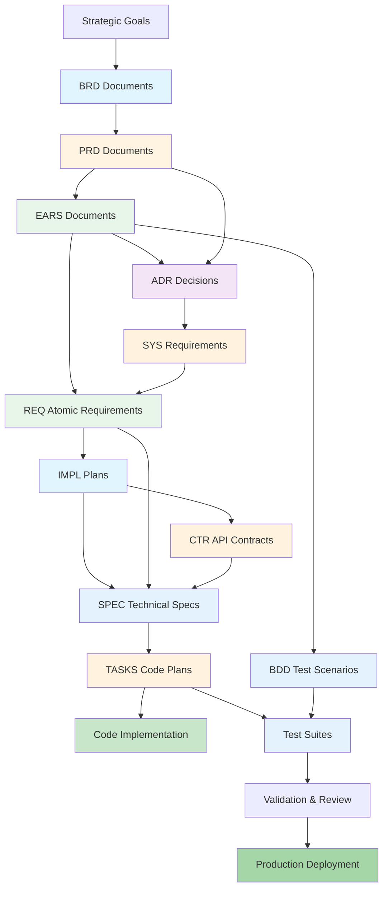

# Complete Traceability Matrix: End-to-End SDD Workflow

## Document Control

| Item | Details |
|------|---------|
| Document ID | TRACEABILITY_MATRIX_COMPLETE |
| Title | Complete End-to-End Traceability Matrix |
| Status | Active |
| Version | 1.0.0 |
| Date Created | YYYY-MM-DD |
| Author | [Team Name] |
| Purpose | Track complete traceability chain: Strategy → BRD → PRD → EARS → BDD → ADR → SYS → REQ → IMPL → CTR → SPEC → TASKS → IPLAN → Code → Production |

---

**⚠️ TAG-BASED AUTO-GENERATION AVAILABLE**

This traceability matrix can be automatically generated by scanning code files for @brd:, @sys:, @spec:, @test:, @impl-status: tags.

**Recommended Approach:** Use tag-based auto-discovery instead of manual maintenance.

**Generate automatically using:**
```bash
# Extract tags from all files
python scripts/extract_tags.py --source src/ docs/ tests/ --output docs/generated/tags.json

# Validate tags against documents
python scripts/validate_tags_against_docs.py --tags docs/generated/tags.json --strict

# Generate complete traceability matrices
python scripts/generate_traceability_matrices.py --tags docs/generated/tags.json --output docs/generated/matrices/
```

**Benefits:**
- ✅ Single source of truth: Tags embedded in code
- ✅ Always up-to-date: Generated from current codebase
- ✅ No manual sync: Automated validation prevents drift
- ✅ Coverage metrics: Automatically calculated

**Tag Format:** `@brd: BRD.001.030, BRD.001.006`

See: [TRACEABILITY.md](./TRACEABILITY.md#tag-based-auto-discovery-alternative) for complete tag-based workflow.

---

## 1. Overview

### 1.1 Complete SDD Workflow

This matrix tracks the complete 16-layer AI-Driven Specification-Driven Development workflow (Layer 0: Strategy through Layer 15: Validation):

**Layers 1-3 - Business**: BRD (L1) → PRD (L2) → EARS (L3)
**Layer 4 - Testing**: BDD (acceptance criteria)
**Layers 5-6 - Architecture**: ADR (L5) → SYS (L6) - technical decisions
**Layer 7 - Requirements**: REQ (atomic requirements)
**Layer 8 - Project Management**: IMPL (WHO/WHEN) - optional
**Layer 9 - Interface**: CTR (API contracts) - optional
**Layer 10 - Technical Specifications**: SPEC (YAML blueprints)
**Layer 11 - Code Generation**: TASKS (implementation steps)
**Layer 12 - Implementation Plans**: IPLAN (session context with bash commands)
**Layer 13 - Code**: Source code implementation
**Layer 14 - Tests**: Test execution and verification
**Layer 15 - Validation**: Validation → Review → Production

### 1.2 Coverage Summary

**Note:** Coverage metrics can be automatically calculated from tag extraction:
```bash
python scripts/generate_traceability_matrices.py --auto --report
```

| Document Type | Total Created | Coverage % | Status |
|---------------|---------------|------------|--------|
| **Business Layer** | | | |
| BRD | [X]/[Y] | XX% | [Status] |
| PRD | [X]/[Y] | XX% | [Status] |
| EARS | [X]/[Y] | XX% | [Status] |
| **Testing Layer** | | | |
| BDD | [X]/[Y] | XX% | [Status] |
| **Architecture Layer** | | | |
| ADR | [X]/[Y] | XX% | [Status] |
| SYS | [X]/[Y] | XX% | [Status] |
| **Requirements Layer** | | | |
| REQ | [X]/[Y] | XX% | [Status] |
| **Project Management Layer** | | | |
| IMPL | [X]/[Y] | XX% | [Status] |
| **Interface Layer** | | | |
| CTR | [X]/[Y] | XX% | [Status] |
| **Implementation Layer** | | | |
| SPEC | [X]/[Y] | XX% | [Status] |
| TASKS | [X]/[Y] | XX% | [Status] |
| ICON | [X]/[Y] | XX% | [Status] |
| **Implementation Plans Layer** | | | |
| IPLAN | [X]/[Y] | XX% | [Status] |
| **Execution Layer** | | | |
| Code Files | [X]/[Y] | XX% | [Status] |
| Test Files | [X]/[Y] | XX% | [Status] |
| **Total** | **[X]/[Y]** | **XX%** | **[Status]** |

### 1.3 Workflow Completeness Metrics

| Workflow Stage | Expected Documents | Actual Documents | Gap | Status |
|----------------|-------------------|------------------|-----|--------|
| Strategy → Business | [X] BRD/PRD/EARS | [Y] | [Z] | [Status] |
| Business → Testing | [X] BDD | [Y] | [Z] | [Status] |
| Business → Architecture | [X] ADR/SYS | [Y] | [Z] | [Status] |
| Architecture → Requirements | [X] REQ | [Y] | [Z] | [Status] |
| Requirements → Planning | [X] IMPL | [Y] | [Z] | [Status] |
| Planning → Interface | [X] CTR | [Y] | [Z] | [Status] |
| Planning → Implementation | [X] SPEC/TASKS | [Y] | [Z] | [Status] |
| Implementation → Code | [X] Code/Tests | [Y] | [Z] | [Status] |

---

## 2. Cumulative Tagging Hierarchy

### 2.1 Overview

The Docs Flow Framework implements **cumulative tagging** where each artifact type must include traceability tags from ALL upstream artifact types. This creates complete end-to-end traceability chains from business strategy through production deployment.

**Key Principle**: Each layer inherits ALL tags from upstream layers and adds its own.

### Traceability Rules (REQUIRED vs OPTIONAL)

| Document Type | Upstream Traceability | Downstream Traceability |
|---------------|----------------------|------------------------|
| **BRD** | OPTIONAL (to other BRDs) | OPTIONAL |
| **All Other Documents** | REQUIRED | OPTIONAL |

**Key Rules**:
- **Upstream REQUIRED** (except BRD): Document MUST reference its upstream sources
- **Downstream OPTIONAL**: Only link to documents that already exist
- **No-TBD Rule**: NEVER use placeholder IDs (TBD, XXX, NNN) - leave empty or omit section

### 2.2 Tag Format

```markdown
@artifact-type: TYPE.NNN.NNN (Unified Feature ID)
```

**Format Rules**:
- Prefix: `@` symbol
- Artifact Type: lowercase (brd, prd, ears, bdd, adr, sys, req, impl, ctr, spec, tasks, iplan)
- Separator: colon `:` after artifact type
- Document ID: `TYPE-NNN` format
- Requirement ID: specific requirement/section identifier
- Multiple Values: comma-separated `@brd: BRD.001.030, BRD.001.006`

### 2.3 Cumulative Tagging Table

| Layer | Artifact Type | Required Tags | Tag Count | Tracking Method | Notes |
|-------|---------------|---------------|-----------|-----------------|-------|
| 0 | **Strategy** | None | 0 | External | Business owner documents, no formal artifact |
| 1 | **BRD** | None | 0 | Formal Template (Markdown) | Top level, no upstream dependencies |
| 2 | **PRD** | `@brd` | 1 | Formal Template (Markdown) | References parent BRD |
| 3 | **EARS** | `@brd`, `@prd` | 2 | Formal Template (Markdown) | Cumulative: BRD + PRD |
| 4 | **BDD** | `@brd`, `@prd`, `@ears` | 3+ | Formal Template + Gherkin Tags | Cumulative: BRD through EARS + standard BDD tags |
| 5 | **ADR** | `@brd`, `@prd`, `@ears`, `@bdd` | 4 | Formal Template (Markdown) | Cumulative: BRD through BDD |
| 6 | **SYS** | `@brd` through `@adr` | 5 | Formal Template (Markdown) | Cumulative: BRD through ADR |
| 7 | **REQ** | `@brd` through `@sys` | 6 | Formal Template (Markdown) | Cumulative: BRD through SYS |
| 8 | **IMPL** | `@brd` through `@req` | 7 | Formal Template (Markdown) | Optional layer - include if exists |
| 9 | **CTR** | `@brd` through `@impl` | 8 | Formal Template (Markdown + YAML) | Optional layer - include if exists |
| 10 | **SPEC** | `@brd` through `@req` + optional `@impl`, `@ctr` | 7-9 | Formal Template (YAML) | YAML cumulative_tags section |
| 11 | **TASKS** | `@brd` through `@spec` | 8-10 | Formal Template (Markdown) | Cumulative: BRD through SPEC |
| 11 | **ICON** | All upstream through `@spec` + `@tasks` | 9-11 | Formal Template (Markdown) | Optional - standalone when 5+ consumers |
| 12 | **IPLAN** | `@brd` through `@tasks` | 9-11 | Project Files (Markdown) | Implementation session plans |
| 13 | **Code** | `@brd` through `@tasks` + optional `@iplan` | 9-12 | Code Docstrings (Python/JS/etc.) | Tags in module/class/function docstrings |
| 14 | **Tests** | `@brd` through code tags + `@code` | 10-13 | BDD + Docstrings | Test files reference code + all upstream |
| 15 | **Validation** | All upstream tags | 11-14 | Embedded + CI/CD | Deployment and validation artifacts |

### 2.4 Cumulative Tag Chain Examples

#### Example 1: SPEC Artifact (Layer 10)

```yaml
# SPEC-018: request submission Service Specification

# ... spec content ...

cumulative_tags:
  brd: "BRD.009.015"
  prd: "PRD.016.003"
  ears: "EARS.012.002"
  bdd: "BDD.015.001"
  adr: "ADR-033"
  sys: "SYS.012.001"
  req: "REQ.045.001"
  impl: "IMPL.003.002"  # Optional - included if exists
  ctr: "CTR-005"  # Optional - included if exists
```

**Tag Count**: 9 tags (7 required + 2 optional)

#### Example 2: Code Artifact (Layer 13)

```python
"""
request submission Service

Handles trade request submission with validation and execution.

## 3. Traceability Tags

@brd: BRD.009.015, BRD.009.006
@prd: PRD.016.003
@ears: EARS.012.002, EARS.012.001
@bdd: BDD.015.001, BDD.015.002
@adr: ADR-033
@sys: SYS.012.001, SYS.012.002
@req: REQ.045.001, REQ.045.002
@impl: IMPL.003.002
@ctr: CTR-005
@spec: SPEC-018
@tasks: TASKS.018.003, TASKS.018.007
@iplan: IPLAN-003

@impl-status: complete
@test-coverage: 95%
"""
```

**Tag Count**: 12 upstream tags (all required for Layer 13)

#### Example 3: Test Artifact (Layer 14)

```python
"""
Test suite for request submission Service

## 4. Traceability Tags

@brd: BRD.009.015, BRD.009.006
@prd: PRD.016.003
@ears: EARS.012.002, EARS.012.001
@bdd: BDD.015.001, BDD.015.002
@adr: ADR-033
@sys: SYS.012.001, SYS.012.002
@req: REQ.045.001, REQ.045.002
@impl: IMPL.003.002
@ctr: CTR-005
@spec: SPEC-018
@tasks: TASKS.018.003, TASKS.018.007
@iplan: IPLAN-003
@code: src/execution/order_service.py:OrderService

@test-type: integration
@test-coverage: 100%
"""
```

**Tag Count**: 13 upstream tags (including code reference)

### 2.5 Validation Rules

#### Tag Completeness Rules

1. **Required Tags**: Each artifact MUST include ALL tags from upstream layers
2. **Optional Layers**: IMPL (Layer 8) and CTR (Layer 9) are optional - include only if they exist in chain
3. **No Skipping**: Cannot skip intermediate layers (e.g., cannot reference BRD and REQ without intermediate layers)
4. **Format Compliance**: All tags must follow `@type: DOC-ID:REQ-ID` format

#### Validation Queries

**Check for Missing Upstream Tags**:
```bash
# Validate that SPEC-018 has all required upstream tags
python scripts/validate_tags_against_docs.py \
  --artifact SPEC-018 \
  --expected-layers brd,prd,ears,bdd,adr,sys,req \
  --strict
```

**Check Tag Format Compliance**:
```bash
# Verify all tags in codebase follow correct format
python scripts/extract_tags.py \
  --source src/ docs/ tests/ \
  --validate-format \
  --strict
```

**Generate Missing Tag Report**:
```bash
# Find all artifacts with incomplete tag chains
python scripts/generate_traceability_matrices.py \
  --check-completeness \
  --report-gaps
```

### 2.6 Benefits of Cumulative Tagging

1. **Complete Traceability**: Every artifact links back to original business requirements
2. **Impact Analysis**: Quickly identify all affected artifacts when requirements change
3. **Automated Validation**: Scripts can verify tag completeness and format
4. **Gap Detection**: Missing tags indicate incomplete traceability chains
5. **Requirements Coverage**: Validate that all business requirements have implementations
6. **Audit Trail**: Full history from strategy through production deployment

### 2.7 Common Patterns

#### Pattern 1: Feature Development Chain

```
Strategy Document
  ↓ @brd
BRD-009 (Business Requirements)
  ↓ @brd, @prd
PRD-016 (Product Requirements)
  ↓ @brd, @prd, @ears
EARS-012 (Engineering Requirements)
  ↓ @brd, @prd, @ears, @bdd
BDD-015 (Test Scenarios)
  ↓ @brd through @bdd, @adr
ADR-033 (Architecture Decision)
  ↓ @brd through @adr, @sys
SYS-012 (System Requirements)
  ↓ @brd through @sys, @req
REQ-045 (Atomic Requirement)
  ↓ @brd through @req, @impl
IMPL-003 (Implementation Plan)
  ↓ @brd through @impl, @ctr
CTR-005 (API Contract)
  ↓ @brd through @ctr, @spec
SPEC-018 (Technical Specification)
  ↓ @brd through @spec, @tasks
TASKS-018 (Implementation Tasks)
  ↓ @brd through @tasks, @code
Code: src/execution/order_service.py
  ↓ @brd through @code, @test
Tests: tests/test_order_service.py
  ↓ All tags validated
Production Deployment
```

#### Pattern 2: Simplified Chain (No Optional Layers)

When IMPL and CTR layers don't exist:

```
BRD-001 → PRD-003 → EARS-005 → BDD-008 → ADR-015 → SYS-020 → REQ-030
  ↓
SPEC-040 (tags: @brd through @req = 7 tags)
  ↓
TASKS-040 (tags: @brd through @spec = 8 tags)
  ↓
Code (tags: @brd through @tasks = 9 tags)
```

---

## 3. Complete Workflow Traceability Map

### 3.1 Business Layer Traceability

| Strategy Source | BRD ID | PRD ID | EARS ID | BDD ID | Status |
|-----------------|--------|--------|---------|--------|--------|
| [Strategic Goal 1] | BRD-001 | PRD-001, PRD-002 | EARS-001, EARS-002, EARS-003 | BDD-001, BDD-002 | ✅ Complete |
| [Strategic Goal 2] | BRD-002 | PRD-003 | EARS-004, EARS-005 | BDD-003 | ✅ Complete |
| [Strategic Goal 3] | BRD-003 | PRD-004, PRD-005 | EARS-006 | BDD-004 | 🟡 Partial |
| [Strategic Goal N] | ... | ... | ... | ... | ... |

### 3.2 Architecture Layer Traceability

| BRD ID | PRD ID | EARS ID | ADR ID | SYS ID | REQ IDs | Status |
|--------|--------|---------|--------|--------|---------|--------|
| BRD-001 | PRD-001 | EARS-001 | ADR-001, ADR-005 | SYS-001 | REQ-001, REQ-002, REQ-003 | ✅ Complete |
| BRD-002 | PRD-003 | EARS-004 | ADR-002 | SYS-002 | REQ-004, REQ-005 | ✅ Complete |
| BRD-003 | PRD-004 | EARS-006 | ADR-003 | SYS-003 | REQ-006 | 🟡 Partial |
| ... | ... | ... | ... | ... | ... | ... |

### 3.3 Implementation Layer Traceability

**Note:** This table can be auto-generated from @brd:, @req:, @spec:, @test: tags in code docstrings.

| REQ ID | IMPL ID | CTR ID | SPEC ID | TASKS ID | IPLAN ID | Code Files | Tag Discovery | Tests | Status |
|--------|---------|--------|---------|----------|---------------|------------|---------------|-------|--------|
| REQ-001 | IMPL-001 | CTR-001 | SPEC-001 | TASKS-001 | IPLAN-001 | src/module.py | @req: REQ.001.15 | test_module.py | ✅ Complete |
| REQ-002 | IMPL-001 | N/A | SPEC-002 | TASKS-002 | IPLAN-002 | src/service.py | test_service.py | ✅ Complete |
| REQ-003 | IMPL-002 | CTR-002 | SPEC-003 | TASKS-003 | IPLAN-003 | src/api.py | test_api.py | 🟡 In Progress |
| REQ-004 | IMPL-002 | N/A | SPEC-004 | ⏳ Pending | ⏳ Pending | ⏳ Pending | ⏳ Pending | ⏳ Not Started |
| ... | ... | ... | ... | ... | ... | ... | ... |

### 3.4 Validation Layer Traceability

| BDD ID | EARS ID | Code Files | Test Files | Test Results | Production Status | Status |
|--------|---------|------------|------------|--------------|-------------------|--------|
| BDD-001 | EARS-001 | src/module.py | test_module.py | ✅ Passed (100%) | ✅ Deployed v1.0 | Complete |
| BDD-002 | EARS-002 | src/service.py | test_service.py | ✅ Passed (95%) | ✅ Deployed v1.0 | Complete |
| BDD-003 | EARS-004 | src/api.py | test_api.py | 🟡 Partial (80%) | 🟡 Staging | Testing |
| BDD-004 | EARS-006 | ⏳ Pending | ⏳ Pending | ⏳ Not Tested | ⏳ Not Deployed | Not Started |
| ... | ... | ... | ... | ... | ... | ... |

---

## 3. End-to-End Traceability Examples

### 3.1 Example 1: Complete Feature Implementation Chain

```
Strategy: [Strategic Document section X.Y]
   ↓ drives
BRD-009: service integration Business Requirements
   ↓ defines
PRD-016: operation execution Product Requirements
   ↓ formalizes
EARS-012: operation execution formal requirements (WHEN user places order, THE system SHALL execute trade WITHIN 2 seconds)
   ↓ validates
BDD-015: operation execution acceptance tests (Gherkin scenarios)
   ↓ informs
ADR-033: operation execution architecture decision (Event-driven architecture for trade processing)
   ↓ defines
SYS-012: operation execution system requirements (Event bus, order processing service)
   ↓ decomposes
REQ-045: Place limit order atomic requirement
   ↓ plans
IMPL-003: operation execution implementation plan (Phase 2, Team B, 3 developers, 20 days)
   ↓ specifies
CTR-005: operation execution API contract (.md + .yaml)
   ↓ implements
SPEC-018: request submission service specification (YAML blueprint)
   ↓ guides
TASKS-018: request submission implementation tasks (15 step-by-step TODOs)
   ↓ generates
Code: src/execution/order_service.py (implements CTR-005, 350 LOC)
   ↓ verifies
Tests: tests/test_order_service.py + contract tests (95% coverage)
   ↓ validates
BDD-015: Acceptance tests pass (100% scenarios passing)
   ↓ deploys
Production: Deployed v1.2.0 (YYYY-MM-DD)
```

**Status**: ✅ Complete end-to-end traceability

### 3.2 Example 2: Partial Implementation Chain (Gap Identification)

```
Strategy: [Market Analysis Report section 4.3]
   ↓
BRD-015: ML-Based Market Sentiment Analysis
   ↓
PRD-025: Real-time sentiment scoring for option strategies
   ↓
EARS-020: WHEN market data updates, THE system SHALL compute sentiment score WITHIN 500ms
   ↓
BDD-028: Sentiment calculation test scenarios
   ↓
ADR-042: ML model architecture for sentiment analysis
   ↓
SYS-018: Sentiment service system requirements
   ↓
REQ-075: Calculate sentiment score from market data
   ↓
IMPL-008: Phase 3 ML implementation plan
   ↓ [GAP: CTR missing]
⚠️ CTR-NNN: No API contract defined for sentiment service
   ↓
SPEC-032: Sentiment scoring service specification (YAML)
   ↓ [GAP: TASKS missing]
⚠️ TASKS-NNN: No code generation plan created
   ↓ [GAP: Code missing]
⚠️ Code: Implementation not started
   ↓ [GAP: Tests missing]
⚠️ Tests: No tests created
   ↓ [GAP: Validation missing]
⚠️ BDD-028: Acceptance tests not executed
   ↓
Production: ⏳ Not deployed
```

**Status**: 🔴 Incomplete chain with multiple gaps

### 3.3 Example 3: Interface-Heavy Implementation

```
BRD-012: External data provider integration
   ↓
PRD-020: Alpha Vantage API integration
   ↓
EARS-015: WHEN system requests item data, THE system SHALL receive response WITHIN 2 seconds
   ↓
BDD-022: API integration test scenarios
   ↓
ADR-038: External API integration architecture
   ↓
REQ-062: Fetch real-time item quotes from Alpha Vantage
   ↓
IMPL-005: Integration implementation plan (Phase 2, Team C)
   ↓
CTR-003: Alpha Vantage API contract (.md + .yaml)
   ├─ SPEC-025: API client specification (consumer)
   └─ SPEC-026: Data transformation service (processor)
   ↓
TASKS-025: API client implementation tasks
TASKS-026: Data transformation tasks
   ↓
Code: src/integrations/external_api/
   ├─ client.py (implements CTR-003 consumer)
   ├─ transformer.py (data processing)
   └─ rate_limiter.py (API throttling)
   ↓
Tests:
   ├─ tests/integration/test_external_api.py
   ├─ tests/contract/test_ctr_003.py
   └─ tests/unit/test_transformer.py
   ↓
BDD-022: Integration tests pass (5/5 scenarios)
   ↓
Production: ✅ Deployed v1.1.0
```

**Status**: ✅ Complete with strong contract-based traceability

---

## 4. Coverage Metrics and Gap Analysis

### 4.1 Document Type Coverage

| Document Type | Expected | Created | Gap | Coverage % | Target % | Status |
|---------------|----------|---------|-----|------------|----------|--------|
| BRD | [X] | [Y] | [Z] | XX% | 100% | [Status] |
| PRD | [X] | [Y] | [Z] | XX% | 100% | [Status] |
| EARS | [X] | [Y] | [Z] | XX% | 100% | [Status] |
| BDD | [X] | [Y] | [Z] | XX% | 100% | [Status] |
| ADR | [X] | [Y] | [Z] | XX% | 100% | [Status] |
| SYS | [X] | [Y] | [Z] | XX% | 100% | [Status] |
| REQ | [X] | [Y] | [Z] | XX% | 100% | [Status] |
| IMPL | [X] | [Y] | [Z] | XX% | 100% | [Status] |
| CTR | [X] | [Y] | [Z] | XX% | 80% | [Status] |
| SPEC | [X] | [Y] | [Z] | XX% | 100% | [Status] |
| TASKS | [X] | [Y] | [Z] | XX% | 100% | [Status] |
| Code | [X] | [Y] | [Z] | XX% | 100% | [Status] |

### 4.2 Traceability Chain Completeness

| Chain Type | Total Chains | Complete | Partial | Broken | Completeness % |
|------------|--------------|----------|---------|--------|----------------|
| Strategy → BRD → PRD | [X] | [Y] | [Z] | [A] | XX% |
| PRD → EARS → BDD | [X] | [Y] | [Z] | [A] | XX% |
| EARS → ADR → SYS → REQ | [X] | [Y] | [Z] | [A] | XX% |
| REQ → IMPL → SPEC → TASKS | [X] | [Y] | [Z] | [A] | XX% |
| SPEC → TASKS → Code → Tests | [X] | [Y] | [Z] | [A] | XX% |
| BDD → Tests → Production | [X] | [Y] | [Z] | [A] | XX% |
| **End-to-End Complete** | **[X]** | **[Y]** | **[Z]** | **[A]** | **XX%** |

### 4.3 Orphaned Documents (No Upstream Traceability)

| Document Type | Orphaned Documents | Impact | Action Required |
|---------------|-------------------|--------|-----------------|
| PRD | [List PRD IDs] | No business justification | Link to BRD or create BRD |
| EARS | [List EARS IDs] | No product context | Link to PRD or validate necessity |
| REQ | [List REQ IDs] | No requirements source | Link to EARS/SYS or deprecate |
| SPEC | [List SPEC IDs] | No requirements basis | Link to REQ or validate purpose |
| Code | [List file paths] | No specification | Create SPEC/TASKS or refactor |

### 4.4 Missing Downstream Artifacts (Incomplete Chains)

| Source Document | Missing Artifact Type | Count | Impact | Priority |
|-----------------|----------------------|-------|--------|----------|
| BRD-XXX | PRD | [X] | Business requirements not translated | High |
| PRD-YYY | EARS | [X] | Features not formalized | High |
| EARS-ZZZ | BDD | [X] | Requirements not testable | Critical |
| REQ-AAA | SPEC | [X] | Requirements not specified | High |
| SPEC-BBB | TASKS | [X] | Specifications not implementable | Medium |
| TASKS-CCC | Code | [X] | Tasks not executed | High |

---

## 5. Complete Dependency Graph

### 5.1 Full Workflow Visualization



> **Note on Diagram Labels**: The above flowchart shows the sequential workflow. For formal layer numbers used in cumulative tagging, always reference the 16-layer architecture (Layers 0-15) defined in README.md. Diagram groupings are for visual clarity only.

### 5.2 Document Type Relationships Matrix

| From ↓ / To → | BRD | PRD | EARS | BDD | ADR | SYS | REQ | IMPL | CTR | SPEC | TASKS | Code |
|---------------|-----|-----|------|-----|-----|-----|-----|------|-----|------|-------|------|
| **Strategy** | ✓ | | | | | | | | | | | |
| **BRD** | | ✓ | ✓ | | ✓ | | | | | | | |
| **PRD** | | | ✓ | ✓ | ✓ | | | | | | | |
| **EARS** | | | | ✓ | ✓ | ✓ | ✓ | | | | | |
| **BDD** | | | | | ✓ | | | | | | | ✓ |
| **ADR** | | | | | | ✓ | ✓ | ✓ | | ✓ | | |
| **SYS** | | | | | | | ✓ | | | ✓ | | |
| **REQ** | | | | | | | | ✓ | ✓ | ✓ | | |
| **IMPL** | | | | | | | | | ✓ | ✓ | ✓ | |
| **CTR** | | | | | | | | | | ✓ | | ✓ |
| **SPEC** | | | | | | | | | | | ✓ | |
| **TASKS** | | | | | | | | | | | | ✓ |

**Legend**: ✓ = Direct traceability relationship exists

---

## 6. Change Impact Analysis Guidelines

### 6.1 Impact Analysis Process

When making changes to any document, use this matrix to identify affected artifacts:

**Step 1: Identify Changed Document**
- Document Type: [BRD/PRD/EARS/etc.]
- Document ID: [DOC-NNN]
- Change Type: [New/Modified/Deprecated]

**Step 2: Analyze Downstream Impact**
```
Changed Document: [DOC-NNN]
   ↓
Direct Downstream (Tier 1):
   - [List immediate downstream documents]
   ↓
Indirect Downstream (Tier 2):
   - [List second-level downstream documents]
   ↓
Final Impact (Tier 3+):
   - [List third-level and beyond]
```

**Step 3: Assess Impact Severity**
| Affected Artifact | Impact Type | Severity | Action Required |
|-------------------|-------------|----------|-----------------|
| [DOC-ID] | [Breaking/Non-Breaking/Informational] | [Critical/High/Medium/Low] | [Specific action] |

### 6.2 Change Impact Examples

**Example: Changing BRD-009 (Business Requirement Change)**
```
BRD-009: service integration Requirements
   ↓ Direct Impact (Tier 1)
   PRD-016: operation execution Features (Requires review and potential update)
   ↓ Indirect Impact (Tier 2)
   EARS-012: Formal trade requirements (May need revision)
   BDD-015: Test scenarios (May need new scenarios)
   ADR-033: Architecture decision (May need reconsideration)
   ↓ Cascading Impact (Tier 3)
   SYS-012, REQ-045: System/atomic requirements (Potential updates)
   IMPL-003: Implementation plan (Timeline may change)
   CTR-005, SPEC-018, TASKS-018: Implementation artifacts (Code changes)
   ↓ Final Impact (Tier 4)
   Code: src/execution/order_service.py (Refactoring required)
   Tests: tests/test_order_service.py (Test updates)
   Production: Requires release planning
```

**Impact Assessment**:
- **Severity**: High (affects production code)
- **Affected Teams**: Business, Product, Architecture, Backend Development
- **Estimated Effort**: 40 developer-hours + testing
- **Release Impact**: Requires hotfix or next release cycle

### 6.3 Impact Analysis Checklist

Before making changes, verify:
- [ ] All downstream documents identified
- [ ] Impact severity assessed for each artifact
- [ ] Affected teams notified
- [ ] Timeline and effort estimated
- [ ] Test impact analyzed
- [ ] Production deployment plan created
- [ ] Rollback plan prepared (if breaking change)
- [ ] Documentation updates planned
- [ ] Stakeholder approval obtained

---

## 7. Validation and Quality Gates

### 7.1 Traceability Validation Checklist

**Document Creation Validation**:
- [ ] All new documents linked to upstream sources
- [ ] Document follows naming conventions (TYPE-NNN_slug)
- [ ] section 7 Traceability complete (upstream + downstream)
- [ ] All referenced documents exist
- [ ] All markdown links include anchors
- [ ] Relative paths correct

**Workflow Completeness Validation**:
- [ ] Business requirements (BRD/PRD/EARS) complete
- [ ] Acceptance criteria (BDD) defined
- [ ] Architecture decisions (ADR) documented
- [ ] Atomic requirements (REQ) specified
- [ ] Implementation plan (IMPL) created
- [ ] Technical specifications (SPEC) written
- [ ] Code generation tasks (TASKS) defined
- [ ] Code implementation complete
- [ ] Tests passing (unit + integration + BDD)
- [ ] Production deployment successful

**Quality Gates by Layer**:
- **Business Layer**: 100% BRD → PRD → EARS linkage
- **Testing Layer**: 100% EARS → BDD coverage
- **Architecture Layer**: 100% ADR → SYS → REQ linkage
- **Requirements Layer**: 100% REQ → SPEC linkage
- **Implementation Layer**: 100% SPEC → TASKS → Code linkage
- **Validation Layer**: 95%+ test coverage, all BDD scenarios passing

### 7.2 Automated Validation Commands

**Tag-Based Validation (Recommended):**
```bash
# Complete workflow: Extract → Validate → Generate
python scripts/generate_traceability_matrices.py --auto

# Extract all tags from codebase
python scripts/extract_tags.py \
  --source src/ docs/ tests/ \
  --output docs/generated/tags.json

# Validate tags against documents
python scripts/validate_tags_against_docs.py \
  --tags docs/generated/tags.json \
  --strict

# Generate bidirectional traceability matrices
python scripts/generate_traceability_matrices.py \
  --tags docs/generated/tags.json \
  --output docs/generated/matrices/ \
  --report

# Validate only (no file generation)
python scripts/extract_tags.py --validate-only
```

**Legacy Manual Validation (Optional):**
```bash
# Check broken references across all documents
python scripts/check_broken_references.py \
  --scan-all \
  --fix-relative-paths

# Validate document naming conventions
python scripts/validate_requirement_ids.py \
  --all-types \
  --check-anchors
```

### 7.3 Continuous Validation

**Pre-Commit Hooks (Tag-Based)**:
- Extract and validate tag format: `python scripts/extract_tags.py --validate-only`
- Validate tags against documents: `python scripts/validate_tags_against_docs.py --strict`
- Verify all tags resolve to real requirements
- Check implementation status values

**CI/CD Pipeline Checks**:
- Run tag-based traceability validation
- Generate coverage reports from tags
- Check for orphaned tags (tags referencing non-existent documents)
- Validate YAML schemas (SPEC, CTR)
- Run BDD acceptance tests
- Auto-generate traceability matrices

**Scheduled Reviews**:
- Weekly: Review partial chains, identify gaps
- Monthly: Full traceability audit, update matrix
- Quarterly: Architecture review, ADR validation
- Annually: Complete workflow assessment

---

## 8. Revision History

| Version | Date | Changes | Author |
|---------|------|---------|--------|
| 1.0.0 | YYYY-MM-DD | Initial complete traceability matrix creation | [Author Name] |
| 0.9.0 | YYYY-MM-DD | Draft version for stakeholder review | [Author Name] |

---

## 9. References

### 9.1 Internal Documentation
- **Individual Matrix Templates**:
  - [BRD Matrix](BRD/BRD-000_TRACEABILITY_MATRIX-TEMPLATE.md)
  - [PRD Matrix](PRD/PRD-000_TRACEABILITY_MATRIX-TEMPLATE.md)
  - [EARS Matrix](EARS/EARS-000_TRACEABILITY_MATRIX-TEMPLATE.md)
  - [BDD Matrix](BDD/BDD-000_TRACEABILITY_MATRIX-TEMPLATE.md)
  - [ADR Matrix](ADR/ADR-000_TRACEABILITY_MATRIX-TEMPLATE.md)
  - [SYS Matrix](SYS/SYS-000_TRACEABILITY_MATRIX-TEMPLATE.md)
  - [REQ Matrix](REQ/REQ-000_TRACEABILITY_MATRIX-TEMPLATE.md)
  - [IMPL Matrix](IMPL/IMPL-000_TRACEABILITY_MATRIX-TEMPLATE.md)
  - [CTR Matrix](CTR/CTR-000_TRACEABILITY_MATRIX-TEMPLATE.md)
  - [SPEC Matrix](SPEC/SPEC-000_TRACEABILITY_MATRIX-TEMPLATE.md)
  - [TASKS Matrix](TASKS/TASKS-000_TRACEABILITY_MATRIX-TEMPLATE.md)

- **Workflow Guides**:
  - [SPEC_DRIVEN_DEVELOPMENT_GUIDE.md](SPEC_DRIVEN_DEVELOPMENT_GUIDE.md)
  - [TRACEABILITY.md](TRACEABILITY.md)
  - [index.md - Traceability Flow](index.md#traceability-flow)

### 9.2 External Standards
- ISO/IEC/IEEE 29148:2018 - Systems and software engineering requirements
- ISO/IEC/IEEE 15288:2023 - Systems engineering life cycle processes
- CMMI for Development - Requirements Development and Management
- Agile Traceability Best Practices

### 9.3 Traceability Tools
- Python validation scripts in `/scripts/` directory
- Automated matrix generation tools
- CI/CD pipeline integration

---

## 10. Appendix A: Matrix Usage Scenarios

### 10.1 Scenario 1: New Feature Development
1. **Start**: Strategic goal identified
2. **Create**: BRD → PRD → EARS → BDD
3. **Design**: ADR → SYS → REQ
4. **Plan**: IMPL → CTR (if API) → SPEC → TASKS
5. **Implement**: Code → Tests
6. **Validate**: BDD scenarios → Production
7. **Update Matrix**: Track all artifacts created

### 10.2 Scenario 2: Production Issue Investigation
1. **Identify**: Issue in production code
2. **Trace Back**: Code → TASKS → SPEC → REQ → EARS → PRD → BRD
3. **Analyze**: Determine if issue is:
   - Implementation bug (Code/TASKS)
   - Specification error (SPEC)
   - Requirements gap (REQ/EARS)
   - Design flaw (ADR/SYS)
   - Business misalignment (BRD/PRD)
4. **Fix**: Update appropriate layer
5. **Impact Analysis**: Use matrix to identify all affected artifacts
6. **Remediate**: Update downstream artifacts
7. **Validate**: Re-run BDD scenarios

### 10.3 Scenario 3: Requirements Change Request
1. **Change Request**: Update to EARS-012
2. **Impact Analysis**: Use matrix to find:
   - Upstream: Which PRD/BRD drives this requirement?
   - Downstream: Which BDD, REQ, SPEC, Code affected?
3. **Assess**: Determine change scope and effort
4. **Approve**: Stakeholder sign-off on impact
5. **Execute**: Update EARS-012 + all downstream artifacts
6. **Validate**: Run affected BDD scenarios
7. **Update Matrix**: Reflect changes

### 10.4 Scenario 4: Architecture Decision Update
1. **New ADR**: ADR-050 supersedes ADR-033
2. **Find Affected**:
   - Upstream: Which BRD/PRD/EARS drove ADR-033?
   - Downstream: Which SYS, REQ, SPEC, Code implement ADR-033?
3. **Plan Migration**:
   - Create IMPL for architecture change
   - Update all affected SPEC
   - Generate new TASKS
   - Schedule code refactoring
4. **Execute**: Systematic update of all layers
5. **Validate**: Full regression testing
6. **Update Matrix**: Track superseded ADR

---

## 11. Appendix B: Metrics Dashboard

### 11.1 Overall Health Score

```
Traceability Health Score: [XX]/100

Components:
- Document Coverage: [XX%] (weight: 30%)
- Chain Completeness: [XX%] (weight: 25%)
- Orphaned Documents: [XX%] (weight: 15%)
- Broken Links: [XX%] (weight: 10%)
- Test Coverage: [XX%] (weight: 10%)
- Production Deployment: [XX%] (weight: 10%)
```

### 11.2 Key Performance Indicators

**Tag-Based Metrics (Auto-Calculated):**
```bash
python scripts/generate_traceability_matrices.py --auto --report
```

| KPI | Current | Target | Status |
|-----|---------|--------|--------|
| End-to-End Chain Completeness | XX% | 95% | [Status] |
| Tag Coverage (Code Files with Tags) | XX% | 90% | [Status] |
| Tag Format Compliance | XX% | 100% | [Status] |
| Requirements with Code Tags | XX% | 85% | [Status] |
| Orphaned Tags (Invalid References) | [X] | 0 | [Status] |
| Implementation Status Tracking | XX% | 100% | [Status] |
| Upstream Traceability Coverage | XX% | 100% | [Status] |
| Downstream Artifact Coverage | XX% | 95% | [Status] |
| BDD Scenario Pass Rate | XX% | 95% | [Status] |
| Test Coverage (Code) | XX% | 85% | [Status] |
| Production Deployment Success | XX% | 100% | [Status] |

---

**Matrix Status**: ✅ Active and Maintained
**Last Full Validation**: YYYY-MM-DD
**Next Scheduled Update**: YYYY-MM-DD
