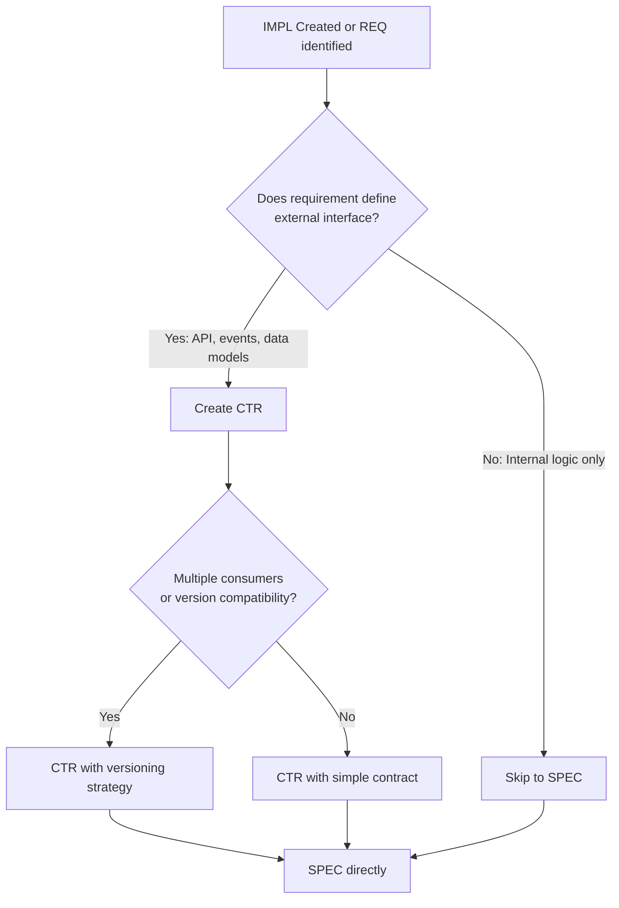

# When to Create an IMPL (Implementation Plan)

**Purpose**: Guide developers on when an IMPL document is necessary vs when to skip directly from REQ → CTR/SPEC

## Decision Criteria

### Create IMPL When: ✅

Use IMPL documents for **complex projects** that meet ANY of these criteria:

1. **Multi-Phase Work** (Duration ≥ 2 weeks)
   - Requires staged delivery
   - Dependencies between phases
   - Incremental releases

2. **Multi-Team Coordination** (Teams ≥ 3)
   - Cross-team dependencies
   - Shared resources
   - Integration points between teams

3. **Multiple Components** (Components ≥ 5)
   - Multiple microservices/agents
   - Shared infrastructure changes
   - Complex deployment orchestration

4. **Resource Constraints** (Budget/Timeline Critical)
   - Fixed deadline with risk
   - Budget approval required
   - Resource allocation conflicts

5. **External Dependencies** (Vendor/Partner Integration)
   - Third-party API integration
   - External system dependencies
   - Vendor coordination required

### Skip IMPL When: ⏭️

Go directly from REQ → CTR/SPEC for **simple tasks**:

1. **Single-Component Changes**
   - One service/agent modification
   - Self-contained feature
   - No cross-team coordination

2. **Short Duration** (Duration < 2 weeks)
   - Quick bug fix
   - Minor enhancement
   - Configuration change

3. **Single Developer** (Team = 1)
   - Solo implementation
   - No coordination needed
   - Minimal dependencies

4. **Low Risk** (No Production Impact)
   - Development environment only
   - Experimental feature
   - Optional enhancement

## Decision Tree

```
Start: New Requirement (REQ-NNN)
  │
  ├─ Is duration ≥ 2 weeks? ──────────── YES ──→ Create IMPL
  │
  └─ NO
     │
     ├─ Are there ≥ 3 teams involved? ── YES ──→ Create IMPL
     │
     └─ NO
        │
        ├─ Are there ≥ 5 components? ─── YES ──→ Create IMPL
        │
        └─ NO
           │
           ├─ Critical budget/timeline? ─ YES ──→ Create IMPL
           │
           └─ NO
              │
              ├─ External dependencies? ─ YES ──→ Create IMPL
              │
              └─ NO ──────────────────────────→ Skip IMPL
                                                 Go directly to:
                                                 REQ → CTR → SPEC → TASKS
```

## When to Create CTR After IMPL

After creating an IMPL document (or skipping directly from REQ), determine if a CTR (Contract) document is needed.

### Create CTR When: ✅

Create CTR documents for **interface requirements** that meet ANY of these criteria:

1. **Public API Endpoints**
   - REST/GraphQL APIs exposed to external clients
   - MCP server tool interfaces
   - Service-to-service APIs across team boundaries

2. **Event Schemas**
   - Inter-service event messages
   - Pub/Sub topics with multiple consumers
   - Event-driven communication contracts

3. **Data Models**
   - Shared data structures across services
   - Database schemas with external access
   - Data interchange formats (JSON, Protobuf)

4. **Version Compatibility Requirements**
   - API versioning needed
   - Backward compatibility guarantees
   - Breaking change management

### Skip CTR When: ⏭️

Go directly from IMPL (or REQ) → SPEC for **internal implementations**:

1. **Internal Logic Only**
   - Private functions/methods
   - Internal algorithms
   - Single-component implementation

2. **No External Interface**
   - No API exposure
   - No data interchange
   - No cross-service contracts

3. **No Serialization**
   - In-memory only
   - No network communication
   - No persistence format

### CTR Decision Flowchart



> **Note on Diagram Labels**: The above flowchart shows the sequential workflow. For formal layer numbers used in cumulative tagging, always reference the 16-layer architecture (Layers 0-15) defined in README.md. Diagram groupings are for visual clarity only.

### CTR Examples

**Example 1: Risk Validator API ✅ Create CTR**

**Criteria Met**:
- Public API endpoint for risk validation
- Used by multiple strategy agents
- Versioning required for backward compatibility

**Documents**:
```
REQ-003 → IMPL-001 → CTR-001 (Risk Validator API) → SPEC-003 → TASKS-003
```

**Example 2: [METRICS - e.g., performance indicators, quality scores] Calculation ⏭️ Skip CTR**

**Criteria Met**:
- Internal calculation function
- No external API exposure
- Used only within single service

**Documents**:
```
REQ-042 → SPEC-042 (internal implementation) → TASKS-042
(No CTR needed - internal logic only)
```

**Example 3: Trade Event Schema ✅ Create CTR**

**Criteria Met**:
- Pub/Sub event consumed by 5+ services
- Schema evolution required
- Multiple teams depend on format

**Documents**:
```
REQ-075 → IMPL-075 → CTR-075 (Trade Event Schema) → SPEC-075 → TASKS-075
```

## Examples

### Example 1: [ORCHESTRATION_COMPONENT] ✅ Create IMPL

**Criteria Met**:
- Duration: 6 weeks (3 phases)
- Teams: 4 (agent dev, infrastructure, testing, docs)
- Components: 8 (orchestrator + 7 strategy agents)
- External: [EXTERNAL_SERVICE_GATEWAY] integration, [EXTERNAL_DATA_PROVIDER - e.g., Weather API, item Data API] API

**IMPL Required**: Complex multi-phase project with cross-team coordination

**Documents**:
```
REQ-001 → IMPL-001 → CTR-001, CTR-002 → SPEC-001.1, SPEC-001.2 → TASKS-001
```

### Example 2: Bug Fix - [METRICS - e.g., performance indicators, quality scores] Calculation ⏭️ Skip IMPL

**Criteria Met**:
- Duration: 3 days
- Teams: 1 (single developer)
- Components: 1 ([METRICS - e.g., performance indicators, quality scores] Calculator service)
- Risk: Low (isolated bug)

**IMPL Not Required**: Simple single-component fix

**Documents**:
```
REQ-042 → SPEC-042.1 → TASKS-042
(No IMPL, no CTR needed - internal calculation fix)
```

### Example 3: Risk Parameter Configuration ⏭️ Skip IMPL

**Criteria Met**:
- Duration: 1 week
- Teams: 1 (DevOps)
- Components: 1 (config file)
- Risk: Medium (production change, but tested)

**IMPL Not Required**: Configuration change with existing process

**Documents**:
```
REQ-099 → SPEC-099.1 → TASKS-099
(No IMPL - standard config deployment)
```

### Example 4: ML Model Integration ✅ Create IMPL

**Criteria Met**:
- Duration: 8 weeks (4 phases: data prep, training, validation, deployment)
- Teams: 3 (ML engineers, backend devs, DevOps)
- Components: 6 (data pipeline, training, serving, monitoring, API, storage)
- External: BigQuery data warehouse, Vertex AI

**IMPL Required**: Complex ML project with multi-phase delivery

**Documents**:
```
REQ-075 → IMPL-075 → CTR-075, CTR-076 → SPEC-075.1, SPEC-075.2, SPEC-075.3 → TASKS-075
```

## Traceability Impact

### With IMPL (Complex Project):

```
REQ (Atomic Requirements) ← WHAT needs to be done
  ↓
IMPL (Implementation Plans) ← WHO/WHEN/PHASES
  ↓
CTR (API Contracts) ← Interface definitions
  ↓
SPEC (Technical Implementation) ← HOW to implement
  ↓
TASKS (Code Generation Plans) ← AI-structured code guidance
```

**Benefits**:
- Clear phase gates for stakeholder approval
- Team coordination and resource allocation
- Risk tracking and milestone management
- Budget and timeline visibility

### Without IMPL (Simple Task):

```
REQ (Atomic Requirements) ← WHAT needs to be done
  ↓
CTR (API Contracts) ← Interface definitions (if needed)
  ↓
SPEC (Technical Implementation) ← HOW to implement
  ↓
TASKS (Code Generation Plans) ← AI-structured code guidance
```

**Benefits**:
- Faster development (no project management overhead)
- Reduced documentation burden
- Simpler traceability chain
- Direct implementation path

## Key Points

1. **IMPL = Project Management Layer** (not technical implementation)
   - Phases, milestones, deliverables
   - Team assignments, resource allocation
   - Risk tracking, dependencies
   - Budget, timeline, approvals

2. **SPEC = Technical Implementation Layer** (not project planning)
   - API designs, data models
   - Algorithms, logic flows
   - Configuration, deployment
   - Code structure, patterns

3. **Don't Confuse IMPL with SPEC**:
   - IMPL answers: WHO does WHAT by WHEN?
   - SPEC answers: HOW is it implemented technically?

4. **When in Doubt, Start Without IMPL**:
   - If project scope grows during development → Create IMPL retroactively
   - If coordination becomes complex → Upgrade to IMPL
   - Better to add IMPL later than create unnecessary documentation

## Validation Checklist

Before creating IMPL, verify:

- ✅ Project meets at least ONE of the "Create IMPL When" criteria
- ✅ Multiple phases/teams/components require coordination
- ✅ Stakeholders need visibility into project timeline/milestones
- ✅ Resource allocation or budget approval is required
- ✅ Risk tracking is needed for the project

Before skipping IMPL, verify:

- ✅ Work is self-contained within single component
- ✅ Single developer or small team with informal coordination
- ✅ Duration < 2 weeks with clear scope
- ✅ No external dependencies or vendor coordination
- ✅ Low/medium risk with established deployment process

## References

- [IMPL-TEMPLATE.md](IMPL/IMPL-TEMPLATE.md) - Full IMPL template
- [IMPL-000_index.md](IMPL/IMPL-000_index.md) - IMPL document index
- [SPEC-TEMPLATE.yaml](SPEC/SPEC-TEMPLATE.yaml) - Technical specification template
- [Traceability Standards](TRACEABILITY.md) - Document linking requirements
