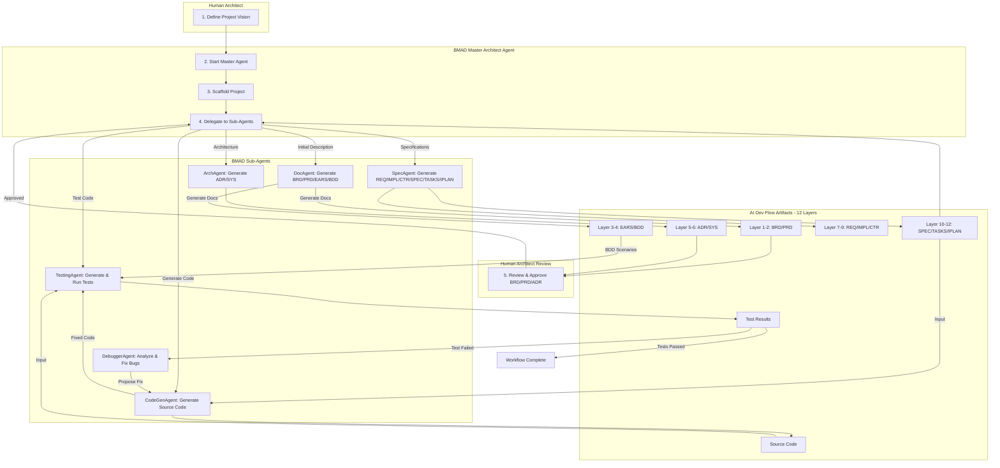

# How-To: Using BMAD Agents with the AI Dev Flow Framework

**Version**: 1.1
**Date**: 2025-12-29
**Status**: Active
**Purpose**: A step-by-step guide for a Software Architect to use the BMAD Agent Framework to execute the AI Dev Flow, automating software development from initial concept to tested code.

---

## 1. Introduction: The "Playbook" and the "Players"

This guide details how to combine two systems:

1. **The AI Dev Flow Framework (The "Playbook"):** A 12-layer governance and auditing framework that provides a structured, machine-readable process for software development. It defines *what* needs to be done and *how* to verify it.
2. **The BMAD Agent Framework (The "Players"):** BMAD (Breakthrough Method for Agile AI-Driven Development) is a multi-agent execution framework built on BMad Core (Collaboration Optimized Reflection Engine). It provides specialized AI agents that can read the playbook and *do* the work through deterministic workflows.

By combining them, you, the Software Architect, can define the high-level blueprint and supervise a team of AI agents as they handle the detailed work of specification, coding, testing, and bug-fixing.

### 1.1 BMAD Four-Phase Methodology

BMAD operates through four adaptive phases that map to AI Dev Flow layers:

| BMAD Phase | Purpose | AI Dev Flow Layers |
|------------|---------|-------------------|
| **Analysis** | Brainstorming, research, requirements gathering | BRD, PRD |
| **Planning** | Creating PRDs, tech specs, design documents | EARS, BDD, ADR |
| **Solutioning** | Designing architecture, UX, technical approach | SYS, REQ, IMPL, CTR |
| **Implementation** | Story-driven development with validation | SPEC, TASKS, IPLAN |

### 1.2 The 12-Layer Framework

| Layer | Artifact | Purpose |
|-------|----------|---------|
| 1 | BRD | Business objectives and scope |
| 2 | PRD | Product features and user needs |
| 3 | EARS | Formal requirements (WHEN-THE-SHALL-WITHIN) |
| 4 | BDD | Behavior scenarios (Given-When-Then) |
| 5 | ADR | Architecture decisions (Context-Decision-Consequences) |
| 6 | SYS | System functional requirements |
| 7 | REQ | Atomic implementation requirements |
| 8 | IMPL | Implementation approach (WHO-WHEN-WHAT) |
| 9 | CTR | API/data contracts (.md + .yaml) |
| 10 | SPEC | Technical specifications (YAML) |
| 11 | TASKS | Task breakdown for implementation |
| 12 | IPLAN | Session-based execution plans |

## 2. Prerequisites

Before starting, ensure you have the following:

1. **A High-Level Project Description:** A clear, natural-language description of the software you want to build. This is your initial input.
2. **BMAD Framework Ready:** The BMAD agent framework is installed and configured, with a main script to invoke a "Master Architect Agent." (Based on provided snippets, this includes `BaseAgent`, `ToolManager`, `ScriptExecutor`, etc.)
3. **AI Dev Flow Templates:** The AI Dev Flow directory (containing `BRD`, `REQ` templates, `AI_ASSISTANT_RULES.md`, etc.) is accessible to the BMAD agents.

## 3. The High-Level Workflow

The entire process is orchestrated by a master BMAD agent that delegates tasks to specialized sub-agents.



---

## 4. Step-by-Step Execution Guide

This guide assumes your BMAD framework has an entry point for a "Master Architect Agent" that can orchestrate the overall process and delegate to specialized sub-agents (e.g., `DocAgent`, `ArchAgent`, `SpecAgent`, `CodeGenAgent`, `TestingAgent`, `DebuggerAgent`).

### Step 0: Define the Project Vision (Human Architect)

Your primary role is to provide the initial, high-level business and technical vision for the project.

**Action:** Write a clear, concise natural-language description of the software you want to build. This will be the foundational input for the entire AI Dev Flow.

**Example Input Description:**
```text
"I need a Python-based REST API for a local document analysis service. It should be built using FastAPI. It requires two main endpoints:
1.  `/api/documentation`: Generates API documentation for a given Python script URL.
2.  `/api/analyze_documents`: Accepts local file paths, reads content, and provides a summary analysis."
```

### Step 1: Initiate the Master Architect Agent (BMAD Agent)

You, the Architect, start the main BMAD agent, providing the initial project description.

**Actor:** Human Architect invokes the BMAD Master Architect Agent.

**Action:** Execute the main BMAD script with your mission.

**Example Command:**
```bash
python your_bmad_main_script.py --agent "MasterArchitectAgent" \
  --mission "Create a new project based on this description: [Paste description from Step 0]" \
  --ai_dev_flow_root "/path/to/ai_dev_flow"
```

### Step 2: Automated Project Scaffolding (BMAD Architect Agent)

The Master Architect Agent now takes over, executing the setup rules defined in the AI Dev Flow's `AI_ASSISTANT_RULES.md`.

**Actor:** BMAD Master Architect Agent.

**Process:**
1. **Domain Selection:** The agent analyzes the `mission` description to determine the project domain (e.g., "Software/SaaS"). It loads the corresponding `*_DOMAIN_CONFIG.md`.
    * *BMAD Action:* `Agent.invoke_tool("AnalyzeTextTool", text=mission, purpose="Determine project domain")`
2. **Folder Creation:** It uses its `Bash` tool to execute `mkdir` commands to create the 12-layer directory structure and specific subdirectories as per `AI_ASSISTANT_RULES.md`.
    * *BMAD Action:* `Agent.invoke_tool("Bash", command="mkdir -p /path/to/project/docs/{BRD,PRD,EARS,BDD,ADR,SYS,REQ,IMPL,CTR,SPEC,TASKS,IPLAN}")`
3. **Template Initialization:** It copies all necessary `AI_DEV_FLOW` templates into the new project structure and initializes all `*-000_index.md` files.
    * *BMAD Action:* `Agent.invoke_tool("Bash", command="cp /path/to/ai_dev_flow/BRD/* /path/to/project/docs/BRD/")`

### Step 3: Generating the Initial BRD (BMAD Documentation Sub-Agent)

The Master Architect Agent delegates to a specialized "Documentation Sub-Agent" (DocAgent) for content generation.

**Actor:** BMAD DocAgent.

**Process:**
1. **Content Generation:** The DocAgent receives the initial project description and the empty `BRD-TEMPLATE.md`. Using its LLM capabilities, it generates the content for the initial `BRD-01`. It populates sections like "Business Objectives," "Project Scope," and high-level "Business Capabilities."
    * *BMAD Action:* `DocAgent.generate_document(template_path="BRD-TEMPLATE.md", context=mission_description)`
2. **Metadata and Traceability:** The DocAgent ensures the YAML frontmatter is correctly populated and the "Document Control" section (including `PRD-Ready Score`) is initialized.
3. **File Operations:** It uses its tools to save `BRD-01_local_analysis_service.md` and update `docs/BRD/BRD-000_index.md`.
    * *BMAD Action:* `DocAgent.invoke_tool("WriteFile", path="docs/BRD/BRD-01_local_analysis_service.md", content=generated_brd)`
    * *BMAD Action:* `DocAgent.invoke_tool("UpdateIndexTool", index_path="docs/BRD/BRD-000_index.md", doc_id="BRD-01", title="Local Analysis Service")`

### Step 4: Human Review and Approval (Human Architect)

This is a critical checkpoint where you, the Architect, provide explicit approval.

**Actor:** Human Architect.

**Action:**
1. **Review:** The Master Architect Agent will notify you that `BRD-01` is ready for review. You inspect its content to ensure it accurately reflects your vision.
    * *BMAD Output:* "BRD-01 has been generated and is awaiting your review at `/path/to/project/docs/BRD/BRD-01_local_analysis_service.md`. Please provide 'Approved' or 'Changes Required' feedback."
2. **Feedback:** You signal your approval or request changes to the Master Architect Agent.
    * *Human Input:* `agent.feedback("BRD-01 Approved")`

### Step 5: Cascading Document Generation (BMAD Agent Hierarchy)

Upon your approval of the BRD, the Master Architect Agent autonomously generates the subsequent layers of documentation.

**Actor:** BMAD Master Architect Agent delegating to various Sub-Agents (DocAgent, ArchAgent, SpecAgent).

**Process:**

#### Layers 1-2: Business and Product Requirements
1. **PRD Generation (Layer 2):** A DocAgent reads the approved `BRD-01` and `PRD-TEMPLATE.md` to generate `PRD-01`. It populates detailed product features and user stories.

#### Layer 3: Formal Requirements
2. **EARS Generation (Layer 3):** The DocAgent generates formal requirements using EARS syntax (WHEN-THE-SHALL-WITHIN format) in `EARS-01.md`, deriving from `PRD-01`.
    * *BMAD Action:* `DocAgent.invoke_tool("GenerateDocument", type="EARS", upstream_context="PRD-01", template="EARS-TEMPLATE.md")`

#### Layer 4: Behavior Scenarios
3. **BDD Generation (Layer 4):** The DocAgent generates Gherkin scenarios (Given-When-Then) in `BDD-01.feature`, translating `EARS-01` into testable behaviors.
    * *BMAD Action:* `DocAgent.invoke_tool("GenerateDocument", type="BDD", upstream_context="EARS-01", template="BDD-TEMPLATE.md")`

#### Layers 5-6: Architecture and System
4. **ADR Generation (Layer 5):** An "ArchitectureAgent" reads upstream documents and identifies architectural decision points (e.g., choice of REST framework, database strategy). It generates `ADR-01_fastapi_selection.md` documenting the decision using Context-Decision-Consequences format.
    * **Note:** The framework allows for human architect approval of ADRs here.
5. **SYS Generation (Layer 6):** The ArchAgent generates `SYS-01_system_overview.md` documenting system functional requirements and quality attributes.

#### Layers 7-9: Requirements, Implementation, Contracts
6. **REQ Generation (Layer 7):** For each functional unit, a "Specification Agent" (SpecAgent) generates atomic `REQ` documents (e.g., `REQ-01_api_documentation_endpoint.md`).
    * *BMAD Action:* `SpecAgent.invoke_tool("GenerateDocument", type="REQ", upstream_context="SYS-01", template="REQ-TEMPLATE.md")`
7. **IMPL Generation (Layer 8):** The SpecAgent generates `IMPL-01.md` documenting the implementation approach (WHO-WHEN-WHAT strategy).
8. **CTR Generation (Layer 9):** If external APIs or data contracts are required, the SpecAgent generates contract documents using dual-file format (.md + .yaml).

#### Layers 10-12: Specifications and Execution Plans
9. **SPEC Generation (Layer 10):** For each `REQ`, it generates the corresponding YAML `SPEC` (e.g., `SPEC-01_api_documentation.yaml`), which serves as the detailed technical blueprint for code generation.
10. **TASKS Generation (Layer 11):** For each `SPEC`, it generates a `TASKS` document (e.g., `TASKS-01_implement_api_documentation.md`), outlining the step-by-step implementation plan for the CodeGen agent.
11. **IPLAN Generation (Layer 12):** Session-based execution plans with bash commands are generated in `IPLAN-01_session_plan.md`.

### Step 6: AI-Driven Code Generation (BMAD CodeGen Sub-Agent)

This is where the AI acts as the primary developer, translating specifications into executable code.

**Actor:** BMAD CodeGen Sub-Agent.

**Process:**
1. **Task Acquisition:** The CodeGen Agent identifies a ready `TASKS` document (e.g., `TASKS-01_implement_api_documentation.md`) and corresponding `IPLAN`.
2. **Context Loading:** It reads the associated `SPEC-01_api_documentation.yaml` (the detailed blueprint), `CTR` contracts, and reviews `REQ-01` for functional requirements.
3. **Code Generation:** Using its LLM and reasoning capabilities (perhaps a ReAct loop to interact with helper tools), it generates the Python source code. It ensures that traceability comments (`# @req: REQ-01, @spec: SPEC-01`) are injected into the code as per `AI_ASSISTANT_RULES.md`.
    * *BMAD Action:* `CodeGenAgent.generate_code(spec_path="SPEC-01.yaml", tasks_path="TASKS-01.md", output_dir="src/")`
4. **File Output:** The agent saves the generated code to the designated source files.

### Step 7: Automated Unit Testing (BMAD Testing Sub-Agent)

**Actor:** BMAD Testing Sub-Agent.

**Process:**
1. **BDD Retrieval:** The Testing Agent identifies the `BDD` document (Layer 4) linked to the `REQ` being implemented by the code.
2. **Test Generation:** It reads the Gherkin scenarios (e.g., `Given/When/Then`) from the `BDD` and generates corresponding `pytest` test files.
    * *BMAD Action:* `TestingAgent.generate_tests(bdd_path="BDD-01.feature", code_dir="src/", output_dir="tests/")`
3. **Test Execution:** It uses a `ScriptExecutor` tool to run the generated `pytest` tests.
    * *BMAD Action:* `TestingAgent.invoke_tool("ScriptExecutor", script="pytest tests/ -v")`
4. **Evaluation:** It captures and analyzes the test results. The `AgentEvaluator` can parse the output to determine pass/fail status, logging any failures.

### Step 8: Automated Bug-Fixing Loop (BMAD Debugger Sub-Agent)

If the tests generated in Step 7 fail, the Master Architect Agent triggers a bug-fixing loop.

**Actor:** BMAD Debugger Sub-Agent (potentially using ReAct/ToT).

**Process:**
1. **Failure Analysis:** The Debugger Agent receives the failed test output, the relevant source code, and the full traceability context across all 12 layers (`IPLAN`, `TASKS`, `SPEC`, `CTR`, `IMPL`, `REQ`, `SYS`, `ADR`, `BDD`, `EARS`, `PRD`, `BRD`).
2. **Hypothesis Generation:** It uses its reasoning capabilities to analyze the discrepancy between the code's behavior and the BDD's expectation, forming a hypothesis about the bug's cause.
3. **Patch Generation:** It generates a code patch to fix the identified bug. This could involve modifying the source code, or even adjusting a `SPEC` or `TASKS` document if the bug stems from a faulty instruction.
    * *BMAD Action:* `DebuggerAgent.propose_fix(failure_context=..., code_dir=...)`
4. **Re-Test:** It applies the patch and triggers the Testing Agent (Step 7) again to re-run the tests. This loop continues until all tests pass, or a human architect is alerted if the agent cannot resolve the issue autonomously.

---

## 5. Conclusion

By integrating the BMAD Agent Framework with the AI Dev Flow, you establish an automated software development factory. You, as the Software Architect, focus on strategic design and critical human approvals, while your team of BMAD agents handles the detailed work of specification, code generation, testing, and bug-fixing.

This approach ensures:
* **Architectural Compliance:** Code adheres to your architectural decisions.
* **Auditable Governance:** Every step across all 12 layers is traceable and verifiable.
* **Full Traceability:** Complete chain from business objectives (BRD) to execution plans (IPLAN).

This combination realizes the promise of AI-driven development under expert human supervision.

---

## Appendix: Layer Dependency Flow

```mermaid
graph LR
    BRD[Layer 1: BRD] --> PRD[Layer 2: PRD]
    PRD --> EARS[Layer 3: EARS]
    EARS --> BDD[Layer 4: BDD]
    PRD --> ADR[Layer 5: ADR]
    ADR --> SYS[Layer 6: SYS]
    SYS --> REQ[Layer 7: REQ]
    REQ --> IMPL[Layer 8: IMPL]
    IMPL --> CTR[Layer 9: CTR]
    CTR --> SPEC[Layer 10: SPEC]
    SPEC --> TASKS[Layer 11: TASKS]
    TASKS --> IPLAN[Layer 12: IPLAN]
    IPLAN --> CODE[Source Code]
    BDD --> TESTS[Test Suite]
    CODE --> TESTS
