# AI Dev Flow Template Index

This directory provides comprehensive templates for the AI-Driven Specification-Driven Development (SDD) workflow. All artifacts follow numeric ID standards and use relative markdown links for traceability.

> Units & Conversions (KB vs tokens): KB = 1,024 bytes; tokens ≈ 4 characters. Rough conversions: tokens ≈ (KB × 1024) ÷ 4 and KB ≈ (tokens × 4) ÷ 1024. Examples: 10 KB ≈ 2,500 tokens; 50 KB ≈ 12,500 tokens; 10,000 tokens ≈ 39 KB.

> MVP Note: MVP templates default to single, flat files. Split only when a document is too large for AI assistants to handle in one file; otherwise ignore `DOCUMENT_SPLITTING_RULES.md` for MVP.

## Template Selection (MVP-Only)

**The framework uses MVP templates exclusively.** Full templates have been deprecated and archived.

### Templates by Layer

| Layer | Type | Template |
|-------|------|----------|
| 1 | BRD | `BRD-MVP-TEMPLATE.md` |
| 2 | PRD | `PRD-MVP-TEMPLATE.md` |
| 3 | EARS | `EARS-MVP-TEMPLATE.md` |
| 4 | BDD | `BDD-MVP-TEMPLATE.feature` |
| 5 | ADR | `ADR-MVP-TEMPLATE.md` |
| 6 | SYS | `SYS-MVP-TEMPLATE.md` |
| 7 | REQ | `REQ-MVP-TEMPLATE.md` |
| 8 | CTR | `CTR-MVP-TEMPLATE.md` |
| 9 | SPEC | `SPEC-MVP-TEMPLATE.yaml` |
| 10 | TSPEC | `UTEST/ITEST/STEST/FTEST-MVP-TEMPLATE.md` |
| 11 | TASKS | `TASKS-TEMPLATE.md` |

## Validation Decision Framework

- Core framework guidance for triaging validation findings and choosing whether to fix documents, adjust validators, or accept warnings: [VALIDATION_DECISION_FRAMEWORK.md](./VALIDATION_DECISION_FRAMEWORK.md)
- REQ-specific addendum with validator patterns and common fixes: [07_REQ/REQ_AI_VALIDATION_DECISION_GUIDE.md](./07_REQ/REQ_AI_VALIDATION_DECISION_GUIDE.md)

### Configuration Reference

- Registry: [LAYER_REGISTRY.yaml](./LAYER_REGISTRY.yaml) - `template` field definitions
- Workflow: [MVP_WORKFLOW_GUIDE.md](./MVP_WORKFLOW_GUIDE.md) - Detailed MVP workflow
- Autopilot: [AUTOPILOT/AUTOPILOT_WORKFLOW_GUIDE.md](./AUTOPILOT/AUTOPILOT_WORKFLOW_GUIDE.md) - YAML template usage documentation
- Dual-Format Architecture: [DUAL_MVP_TEMPLATES_ARCHITECTURE.md](./DUAL_MVP_TEMPLATES_ARCHITECTURE.md) - MD vs YAML templates, YAML schemas, authority hierarchy

## Framework Purpose

This framework provides structured, traceable steps for AI-assisted software development using MVP templates as the default.

- **Blueprint**: Early layers (BRD, PRD, ADR, SYS) capture business and architectural decisions.
- **Instruction Set**: Downstream layers (REQ, SPEC, TASKS) translate those decisions into granular, implementation-ready guidance for AI assistants.
- **Governance**: The traceability chain from BRD through TASKS documents decisions and checks for consistent implementation.
- **Delivery Loop**: Continuous MVP iteration - Create MVP → Fix Defects → Production → Add Features as new MVP → Repeat
  - Enables rapid product evolution with 1-2 week cycles
  - Automation accelerates each cycle (90%+ layers automated)
  - Cumulative traceability preserves knowledge across iterations
- **Automation Flow**: See `ai_dev_flow/SDD_AUTOMATION_WORKFLOW.md` for the extended automation playbook complementing `MVP_WORKFLOW_GUIDE.md`.

**Key Automation Benefits**:
- 90%+ automation (14 of 15 layers)
- Quality gates enable optional human checkpoints (auto-approve if score ≥90%)
- Code-from-specs capability (YAML → Python)
- Auto-fix testing with 3 retry attempts
- Maximum velocity to production MVP

## Recent Updates (2025-11-20)

- ✅ **Validation Scripts**: Expanded from 1 to 13 validation scripts covering IDs, naming, tags, links, and traceability matrices
- ✅ **Domain Adaptation**: Added domain-specific configuration guides (Financial, Software, Generic) with [PLACEHOLDER] examples
- ✅ **Project Setup**: New comprehensive setup guide with domain selection questionnaire
- ✅ **Traceability Enhancements**: Added setup guide, validation guide, and complete tagging examples
- ✅ **Decision Frameworks**: Contract decision questionnaire and CTR guidance
- ✅ **Dual-Format Architecture**: Created DUAL_MVP_TEMPLATES_ARCHITECTURE.md with MD/YAML template authority hierarchy
- ✅ **Autopilot Documentation**: Created AUTOPILOT/AUTOPILOT_WORKFLOW_GUIDE.md with YAML-only template usage guide

## Document Structure

The AI Dev Flow organizes documentation through a hierarchical, traceable structure:

> Default Directory Model: All artifact types use nested folders by default — `NN_{TYPE}/{TYPE}-NN_{slug}/` — containing the primary document file(s). BDD uses nested per-suite folders (`04_BDD/BDD-NN_{slug}/`) due to validator requirements.

### Change Management (CHG) - 4-Gate System

⚠️ **Note**: CHG is NOT a layer in the 15-layer architecture - it's a change management system with formal gate validation.

- **CHG** (`CHG/`) - 4-Gate change management with document immutability enforcement
  - **Guide**: [CHANGE_MANAGEMENT_GUIDE.md](./CHG/CHANGE_MANAGEMENT_GUIDE.md) - Complete change management procedures
  - **Templates**: [CHG-TEMPLATE.md](./CHG/CHG-TEMPLATE.md) (L3) | [CHG-MVP-TEMPLATE.md](./CHG/CHG-MVP-TEMPLATE.md) (L2)
  - **Schema**: [CHG_MVP_SCHEMA.yaml](./CHG/CHG_MVP_SCHEMA.yaml)
  - **Rules**: [CHG_MVP_CREATION_RULES.md](./CHG/CHG_MVP_CREATION_RULES.md)

  **4-Gate System**:
  - **GATE-01** (L1-L4): Business/Product validation - [gates/GATE-01_BUSINESS_PRODUCT.md](./CHG/gates/GATE-01_BUSINESS_PRODUCT.md)
  - **GATE-05** (L5-L8): Architecture/Contract validation - [gates/GATE-05_ARCHITECTURE_CONTRACT.md](./CHG/gates/GATE-05_ARCHITECTURE_CONTRACT.md)
  - **GATE-09** (L9-L11): Design/Test validation - [gates/GATE-09_DESIGN_TEST.md](./CHG/gates/GATE-09_DESIGN_TEST.md)
  - **GATE-12** (L12-L14): Implementation validation - [gates/GATE-12_IMPLEMENTATION.md](./CHG/gates/GATE-12_IMPLEMENTATION.md)

  **Change Source Workflows**:
  - [workflows/UPSTREAM_WORKFLOW.md](./CHG/workflows/UPSTREAM_WORKFLOW.md) - Business-driven (GATE-01)
  - [workflows/MIDSTREAM_WORKFLOW.md](./CHG/workflows/MIDSTREAM_WORKFLOW.md) - Architecture-driven (GATE-05)
  - [workflows/DESIGN_WORKFLOW.md](./CHG/workflows/DESIGN_WORKFLOW.md) - Design-driven (GATE-09)
  - [workflows/DOWNSTREAM_WORKFLOW.md](./CHG/workflows/DOWNSTREAM_WORKFLOW.md) - Defect-driven (GATE-12)
  - [workflows/EMERGENCY_WORKFLOW.md](./CHG/workflows/EMERGENCY_WORKFLOW.md) - P1/Security bypass

  **Purpose**: Archive superseded documents when requirements change; create NEW documents from scratch
  **Why**: Prevents LLM probabilistic errors from partial edits; ensures document immutability
  **Structure**: Directory-based (`CHG/CHG-XX_{slug}/`) containing Definition, Frozen Plan, and Archive
  **When**: Architectural pivots, document deprecation, major framework changes

### Layer 0: Strategy (STRAT) - Optional Pre-Documentation

- **STRAT** (External) - Layer 0: Business strategy documents that inform BRD creation
  - Market analysis, vision statements, competitive research
  - Not formally tracked in SDD workflow (reference material only)

### Business Layer (Layers 1-3)

- **BRD** (`01_BRD/`) - Layer 1: Business Requirements Documents defining business objectives and constraints
  - Template: [BRD-MVP-TEMPLATE.md](./01_BRD/BRD-MVP-TEMPLATE.md) (MVP Default)
  - Index: [BRD-00_index.md](./01_BRD/BRD-00_index.md)
  - Guidance: [PLATFORM_VS_FEATURE_BRD.md](./PLATFORM_VS_FEATURE_BRD.md)
- **PRD** (`02_PRD/`) - Layer 2: Product Requirements Documents translating business needs to product features
  - Index: [PRD-00_index.md](./02_PRD/PRD-00_index.md)
  - Template: [PRD-MVP-TEMPLATE.md](./02_PRD/PRD-MVP-TEMPLATE.md)
- **EARS** (`03_EARS/`) - Layer 3: Event-Action-Response-State (Engineering Requirements)
  - Index: [EARS-00_index.md](./03_EARS/EARS-00_index.md)
  - Template: [EARS-MVP-TEMPLATE.md](./03_EARS/EARS-MVP-TEMPLATE.md) (MVP Default)

### Testing Layer (Layer 4)

- **BDD** (`04_BDD/`) - Layer 4: Behavior-Driven Development feature files defining acceptance criteria
  - Nested: One folder per suite: `04_BDD/BDD-NN_{slug}/`
  - Index: `04_BDD/BDD-00_index.md`
  - Template: [BDD-MVP-TEMPLATE.feature](./04_BDD/BDD-MVP-TEMPLATE.feature)
  - Purpose: Executable acceptance tests written before implementation (Test-First approach)
  - Maps to TASKS execution plans for test-driven development workflow

### Architecture Layer (Layers 5-6)

- **ADR** (`05_ADR/`) - Layer 5: Architecture Decision Records documenting key architectural choices
  - Index: [ADR-00_index.md](./05_ADR/ADR-00_index.md)
  - Template: [ADR-MVP-TEMPLATE.md](./05_ADR/ADR-MVP-TEMPLATE.md) (MVP Default)
  - Purpose: Technical decisions with context, decision, and consequences
- **SYS** (`06_SYS/`) - Layer 6: System Requirements Specifications consolidating requirements into system designs
  - Index: [SYS-00_index.md](./06_SYS/SYS-00_index.md)
  - Template: [SYS-MVP-TEMPLATE.md](./06_SYS/SYS-MVP-TEMPLATE.md) (MVP Default)
  - Purpose: System-level functional requirements and quality attributes

### Requirements Layer (Layer 7)

- **REQ** (`07_REQ/`) - Layer 7: Atomic, testable requirements with SPEC-readiness scoring
  - Index: [REQ-00_index.md](./07_REQ/REQ-00_index.md)
  - Template: [REQ-MVP-TEMPLATE.md](./07_REQ/REQ-MVP-TEMPLATE.md) (MVP Default)
  - Organization: Nested per-document folders (DEFAULT)
    - Folder: `07_REQ/REQ-NN_{slug}/`
    - Primary file (atomic): `07_REQ/REQ-NN_{slug}/REQ-NN_{slug}.md`
    - Split (only if files are too large for AI assistants): `07_REQ/REQ-NN_{slug}/REQ-NN.0_index.md`, `REQ-NN.1_{section}.md`, ...
  - Format: 12-section framework with validation rules
<!-- VALIDATOR:IGNORE-LINKS-START -->
  - Examples:
    - [REQ-01: API Integration Example](./07_REQ/examples/api/REQ-01_api_integration_example.md)
    - See more in [07_REQ/examples/](./07_REQ/examples/)

### Interface Layer (Layer 8 - Optional)

- **CTR** (`08_CTR/`) - Layer 8: API Contracts defining component-to-component interfaces
  - Index: [CTR-00_index.md](./08_CTR/CTR-00_index.md)
  - Dual-file format: `.md` (human-readable context) + `.yaml` (machine-readable schema)
  - When to use: [CONTRACT_DECISION_QUESTIONNAIRE.md](./CONTRACT_DECISION_QUESTIONNAIRE.md)
  - Enables parallel development and contract testing
  - Optional organization: subdirectories by service type (agents/, mcp/, infra/)
  - Examples: [CTR-01](./08_CTR/examples/CTR-01_data_validation_api.md)

### Technical Specs (SPEC) (Layer 9)

- **SPEC** (`09_SPEC/`) - Layer 9: Technical specifications ready for code generation
  - YAML: Monolithic single file per component (codegen source)
  - Markdown: Split narrative using `SPEC-{DOC_NUM}.0_index.md` and `SPEC-{DOC_NUM}.{S}_{slug}.md` only if the document is too large for AI assistants
  - Layout:
    - Nested (default): `09_SPEC/SPEC-{DOC_NUM}_{slug}/SPEC-{DOC_NUM}_{slug}.yaml` (+ Markdown sections alongside)
    - Flat (exception): `09_SPEC/SPEC-{DOC_NUM}_{slug}.yaml` for small, stable specs
  - Template: [SPEC-MVP-TEMPLATE.yaml](./09_SPEC/SPEC-MVP-TEMPLATE.yaml)
  - Purpose: YAML format with classes, methods, algorithms (HOW to build)
  - References CTR contracts when implementing interfaces
  - Examples:
    - Flat (small): [SPEC-01](./09_SPEC/SPEC-01_api_client_example.yaml)
    - Nested (recommended): [SPEC-02 nested example](./09_SPEC/examples/SPEC-02_nested_example/SPEC-02_nested_example.yaml) with [index](./09_SPEC/examples/SPEC-02_nested_example/SPEC-02.0_index.md)

### Test Specifications Layer (Layer 10)

  - **TSPEC** (`10_TSPEC/`) - Layer 10: Test specifications for TDD workflow
   - Index: [TSPEC-00_index.md](./10_TSPEC/TSPEC-00_index.md)
   - Templates:
     - [UTEST-MVP-TEMPLATE.md](./10_TSPEC/UTEST/UTEST-MVP-TEMPLATE.md) - Unit tests
     - [ITEST-MVP-TEMPLATE.md](./10_TSPEC/ITEST/ITEST-MVP-TEMPLATE.md) - Integration tests
     - [STEST-MVP-TEMPLATE.md](./10_TSPEC/STEST/STEST-MVP-TEMPLATE.md) - Smoke tests
     - [FTEST-MVP-TEMPLATE.md](./10_TSPEC/FTEST/FTEST-MVP-TEMPLATE.md) - Functional tests
   - Purpose: Formalize test specifications before implementation (TDD)
   - Test types: UTEST (40), ITEST (41), STEST (42), FTEST (43)

### Code Generation Layer (Layer 11)

  - **TASKS** (`11_TASKS/`) - Layer 11: Code generation plans with exact TODOs
   - Index: [TASKS-00_index.md](./11_TASKS/TASKS-00_index.md)
   - Template: [TASKS-TEMPLATE.md](./11_TASKS/TASKS-TEMPLATE.md)
   - Purpose: Step-by-step guide to generate code from YAML SPEC
   - Each TASKS document corresponds to one SPEC

### Session Execution Layer (Layer 12) - DEPRECATED


  - **New Workflow**: `SPEC (Layer 9) → TSPEC (Layer 10) → TASKS (Layer 11) → Code → Tests`
  - Execution commands now in TASKS Section 4: Execution Commands

<!-- See README.md → “Using This Repo” for path mapping guidance. -->

## Traceability Flow

**⚠️ AUTHORITATIVE WORKFLOW**: This is the single source of truth for the AI Dev Flow traceability chain. All template diagrams reference this section.

**Cumulative Tagging**: Each artifact includes tags from ALL upstream artifacts (see diagram annotations below)

> ⚠️ **IMPORTANT - Layer Numbering**: The Mermaid diagram below uses visual groupings for clarity. Always use formal layer numbers (0-14) when implementing cumulative tagging or referencing layers in code/documentation. See layer mapping table in README.md.

```mermaid
flowchart TD
    %% Business Layer
    BRD[BRD<br/>Business Requirements<br/>High-level business needs<br/><small><i>0 tags</i></small>]
    PRD[PRD<br/>Product Requirements<br/>User needs and features<br/><small><i>@brd</i></small>]
    EARS[EARS<br/>Event-Action-Response-State<br/>Event-driven specifications<br/><small><i>@brd, @prd</i></small>]

    %% Testing Layer
    BDD[BDD<br/>Behavior-Driven Development<br/>Test scenarios and acceptance criteria<br/><small><i>@brd, @prd, @ears</i></small>]

    %% Architecture Layer
    ADR[ADR<br/>Architecture Decision Records<br/>Technical decisions and rationale<br/><small><i>@brd through @bdd</i></small>]
    SYS[SYS<br/>System Requirements<br/>Technical system specifications<br/><small><i>@brd through @adr</i></small>]

    %% Requirements Layer
    REQ[REQ<br/>Atomic Requirements<br/>Granular, testable requirements<br/><small><i>@brd through @sys</i></small>]

    %% Interface Layer
    CTR[CTR<br/>API Contracts<br/>Interface definitions between components<br/>Dual format: .md + .yaml<br/><small><i>@brd through @req</i></small>]

    %% Technical Specs (SPEC)
    SPEC[SPEC<br/>Technical Specifications<br/>HOW - Implementation blueprints<br/>YAML format with full details<br/><small><i>@brd through @req + opt</i></small>]

    %% Test Specifications Layer
    TSPEC[TSPEC<br/>Test Specifications<br/>TDD test cases before code<br/>UTEST, ITEST, STEST, FTEST<br/><small><i>@brd through @spec</i></small>]

    %% Code Generation Layer
    TASKS[TASKS<br/>Code Generation Plans<br/>AI-structured implementation steps<br/>Section 4: Execution Commands<br/>Section 7-8: Implementation Contracts<br/><small><i>@brd through @tspec</i></small>]

    %% Execution Layer
    Code[Code<br/>Python Implementation<br/>Generated from SPEC + TASKS<br/><small><i>@brd through @tasks</i></small>]
    Tests[Tests<br/>Test Suites<br/>Unit, Integration, E2E tests<br/><small><i>@brd through @code</i></small>]

    %% Validation Layer
    Validation[Validation<br/>BDD Test Execution<br/>Verify acceptance criteria<br/><small><i>all upstream</i></small>]
    Review[Human Review<br/>Architecture Review<br/>Code quality check]
    Prod[Production-Ready Code<br/>Deployed to environment]

    %% Primary Flow
    BRD --> PRD
    PRD --> EARS
    EARS --> BDD
    BDD --> ADR
    ADR --> SYS
    SYS --> REQ
    REQ --> CTR

    %% Interface Branch Decision
    CTR --> SPEC

    %% Implementation Flow
    SPEC --> TSPEC
    TSPEC --> TASKS
    TASKS --> Code
    Code --> Tests
    Tests --> Validation
    %% Note: Review and Prod are outcomes, not formal layers
    Validation --> Review
    Review --> Prod

    %% Styling
    classDef businessLayer fill:#fff9c4,stroke:#f57f17,stroke-width:2px
    classDef testingLayer fill:#c8e6c9,stroke:#388e3c,stroke-width:2px
    classDef architectureLayer fill:#e1bee7,stroke:#7b1fa2,stroke-width:2px
    classDef requirementsLayer fill:#ffccbc,stroke:#e64a19,stroke-width:2px
    classDef interfaceLayer fill:#f8bbd0,stroke:#c2185b,stroke-width:2px
    classDef implementationLayer fill:#dcedc8,stroke:#689f38,stroke-width:2px
    classDef testspecLayer fill:#b2ebf2,stroke:#00838f,stroke-width:2px
    classDef codegenLayer fill:#e1f5fe,stroke:#01579b,stroke-width:2px
    classDef executionLayer fill:#d1c4e9,stroke:#512da8,stroke-width:2px

    class BRD,PRD,EARS businessLayer
    class BDD testingLayer
    class ADR,SYS architectureLayer
    class REQ requirementsLayer
    class CTR interfaceLayer
    class SPEC implementationLayer
    class TSPEC testspecLayer
    class TASKS codegenLayer
    class Code,Tests,Validation,Review,Prod executionLayer
```



### Splitting Rules

- Core: [DOCUMENT_SPLITTING_RULES.md](./DOCUMENT_SPLITTING_RULES.md)
- Templates: Use `{TYPE}-SECTION-0-TEMPLATE.md` (index) and `{TYPE}-SECTION-TEMPLATE.md` (sections)

> **Note on Diagram Labels**: The above flowchart shows the sequential workflow. For formal layer numbers used in cumulative tagging, always reference the 15-layer architecture (Layers 0-14) defined in README.md. Diagram groupings are for visual clarity only. "Review" and "Prod" are outcomes, not formal layers.

### Workflow Explanation

**Business Layer** → **Testing Layer** → **Architecture Layer** → **Requirements Layer** → **Interface Layer** → **Technical Specs (SPEC)** → **Test Specifications (TSPEC)** → **Code Generation Layer** → **Execution Layer**

**Key Decision Point**: After REQ, if the requirement involves an interface (API, event schema, data model), create CTR before SPEC. Otherwise, go directly to SPEC.

Each document maintains bidirectional traceability:

- **Upstream**: Links to source documents (requirements, decisions)
- **Downstream**: Links to derived documents (implementations, tests)

## Document ID Standards

All documents follow strict ID conventions defined in [ID_NAMING_STANDARDS.md](./ID_NAMING_STANDARDS.md):

- **Format**: `{TYPE}-{NN}_{descriptive_slug}.{ext}`
- **Numbering**: Sequential from 01, stable once assigned
- **Slugs**: lower_snake_case, descriptive but concise
- **Index Files**: `{TYPE}-00_index.{ext}` for each document type
- **CTR Exception**: Dual-file format requires both `.md` and `.yaml` with matching slugs
  - Example: `CTR-01_position_risk_validation.md` + `CTR-01_position_risk_validation.yaml`

## Core Standards Documents

### Workflow & Methodology

- **Workflow Guide**: [SPEC_DRIVEN_DEVELOPMENT_GUIDE.md](./SPEC_DRIVEN_DEVELOPMENT_GUIDE.md) - Complete SDD methodology
- **Quick Reference**: [QUICK_REFERENCE.md](./QUICK_REFERENCE.md) - Quick reference for common tasks

### Naming & Organization

- **ID Naming**: [ID_NAMING_STANDARDS.md](./ID_NAMING_STANDARDS.md) - Document identification standards
- **Traceability**: [TRACEABILITY.md](./TRACEABILITY.md) - Traceability requirements and conventions
- **Traceability Style**: [Tag Format Specification](./TRACEABILITY.md#tag-format-specification) - Style guide for traceability links
- **Traceability Setup**: [TRACEABILITY_SETUP.md](./TRACEABILITY_SETUP.md) - Setting up traceability in projects
- **Traceability Validation**: [TRACEABILITY_VALIDATION.md](./TRACEABILITY_VALIDATION.md) - Validation procedures

### Domain Adaptation

- **Domain Adaptation Guide**: [DOMAIN_ADAPTATION_GUIDE.md](./DOMAIN_ADAPTATION_GUIDE.md) - Adapting framework to specific domains
- **Domain Selection**: [DOMAIN_SELECTION_QUESTIONNAIRE.md](./DOMAIN_SELECTION_QUESTIONNAIRE.md) - Questionnaire for selecting domain
- **Financial Domain**: [FINANCIAL_DOMAIN_CONFIG.md](./FINANCIAL_DOMAIN_CONFIG.md) - Financial regulatory configuration
- **Software Domain**: [SOFTWARE_DOMAIN_CONFIG.md](./SOFTWARE_DOMAIN_CONFIG.md) - Generic software configuration
- **Generic Domain**: [GENERIC_DOMAIN_CONFIG.md](./GENERIC_DOMAIN_CONFIG.md) - Minimal configuration template

### Project Setup

- **Project Setup**: [PROJECT_SETUP_GUIDE.md](./PROJECT_SETUP_GUIDE.md) - Complete project initialization guide
- **Project Kickoff**: [PROJECT_KICKOFF_TASKS.md](./PROJECT_KICKOFF_TASKS.md) - Initial project tasks checklist
- **Platform vs Feature BRD**: [PLATFORM_VS_FEATURE_BRD.md](./PLATFORM_VS_FEATURE_BRD.md) - BRD type selection guide

### Change Management

- **Change Management Guide**: [CHG/CHANGE_MANAGEMENT_GUIDE.md](./CHG/CHANGE_MANAGEMENT_GUIDE.md) - Complete change management procedures
- **Change Classification**: [CHG/CHANGE_CLASSIFICATION_GUIDE.md](./CHG/CHANGE_CLASSIFICATION_GUIDE.md) - L1/L2/L3 decision guide
- **Gate Specifications**: [CHG/gates/](./CHG/gates/) - 4-Gate system documentation
- **Change Workflows**: [CHG/workflows/](./CHG/workflows/) - Change source workflow guides
- **Gate Error Catalog**: [CHG/gates/GATE_ERROR_CATALOG.md](./CHG/gates/GATE_ERROR_CATALOG.md) - Validation error reference

### Decision Frameworks

- **Contract Decision**: [CONTRACT_DECISION_QUESTIONNAIRE.md](./CONTRACT_DECISION_QUESTIONNAIRE.md) - When to create CTR documents

### Tool Optimization

- **Tool Optimization**: [AI_TOOL_OPTIMIZATION_GUIDE.md](./AI_TOOL_OPTIMIZATION_GUIDE.md) - AI tool token limits and optimization strategies
- **AI Assistant Rules**: [AI_ASSISTANT_RULES.md](./AI_ASSISTANT_RULES.md) - Rules for AI assistants working with framework

### Templates & Examples

- **Complete Tagging Example**: [COMPLETE_TAGGING_EXAMPLE.md](./COMPLETE_TAGGING_EXAMPLE.md) - Full example of cumulative tagging
- **Matrix Template Guide**: [MATRIX_TEMPLATE_COMPLETION_GUIDE.md](./MATRIX_TEMPLATE_COMPLETION_GUIDE.md) - How to fill traceability matrices

## Creating New Documents

1. Identify document type and functional area
2. Check relevant index file (`{TYPE}-00_index.md`) for next available ID
3. Copy appropriate template from the directory
4. Name file following ID standards: `{TYPE}-{NN}_{slug}.{ext}`
5. Fill in all template sections with complete traceability links
6. Update index file with new document entry
7. Validate traceability using validation scripts

## Validation

Validate document structure and traceability using automated scripts:

```bash
# Core validation scripts
python 07_REQ/scripts/validate_requirement_ids.py               # REQ-ID format and uniqueness
python 07_REQ/scripts/validate_req_spec_readiness.py            # REQ SPEC-readiness scoring
python scripts/validate_documentation_paths.py           # Path consistency
python scripts/validate_links.py                         # Markdown link validation
python scripts/validate_tags_against_docs.py             # Tag extraction and validation
python scripts/validate_traceability_matrix.py           # Traceability matrix structure
python scripts/validate_traceability_matrix.py             # Matrix validation and enforcement

# Template validation scripts
bash 01_BRD/scripts/validate_brd.py                    # BRD template compliance
bash 07_REQ/scripts/validate_req_template.sh                    # REQ template compliance
bash 08_CTR/scripts/validate_ctr.sh                             # CTR dual-file format compliance
bash 11_TASKS/scripts/validate_tasks.sh                           # TASKS format including Section 7-8

# Traceability generation
python scripts/generate_traceability_matrix.py           # Generate traceability matrices
python scripts/update_traceability_matrix.py             # Update existing matrices
python scripts/extract_tags.py                           # Extract tags to JSON

# Change Management (4-Gate System)
./CHG/scripts/validate_gate01.sh <CHG_FILE>              # GATE-01 (Business/Product)
./CHG/scripts/validate_gate05.sh <CHG_FILE>              # GATE-05 (Architecture/Contract)
./CHG/scripts/validate_gate09.sh <CHG_FILE>              # GATE-09 (Design/Test)
./CHG/scripts/validate_gate12.sh <CHG_FILE>              # GATE-12 (Implementation)
./CHG/scripts/validate_all_gates.sh <CHG_FILE>           # Validate all applicable gates
python CHG/scripts/validate_chg_routing.py <CHG_FILE>    # Determine gate routing
```

**Script Categories:**

- **ID & Naming Validation**: Validates document IDs, naming conventions, and file paths
- **Content Validation**: Checks template compliance, tag usage, and link validity
- **Traceability Tools**: Generates and validates traceability matrices
- **Readiness Scoring**: Assesses REQ SPEC-readiness using 12-section framework

See [scripts/README.md](./scripts/README.md) for detailed script documentation.

## Glossary

### Terminology Disambiguation

| Term | Layer | Definition |
|------|-------|------------|
| **Functional Requirement** | Layer 1 (BRD) | High-level business capability statement. May encompass multiple downstream atomic requirements. |
| **Atomic Requirement** | Layer 7 (REQ) | Single, granular, testable requirement derived from business-level functional requirements. |

### Traceability Flow

```
BRD (Layer 1)                 REQ (Layer 7)
┌─────────────────────┐      ┌─────────────────────┐
│ Functional          │      │ Atomic              │
│ Requirements        │─────>│ Requirements        │
│ (Business-Level)    │      │ (Implementation)    │
│                     │      │                     │
│ FR-001: "System     │      │ REQ-001: "Login     │
│ shall authenticate  │      │ timeout = 30 min"   │
│ users"              │      │ REQ-002: "Max 3     │
│                     │      │ failed attempts"    │
└─────────────────────┘      └─────────────────────┘
```

Business-level Functional Requirements (BRD) are decomposed into Atomic Requirements (REQ) during the SDD workflow. This distinction prevents ambiguity when referencing requirements across layers.

## Best Practices

- **Link Format**: Use relative paths within templates directory
- **Traceability**: Always include upstream and downstream references
- **Completeness**: Fill all template sections; mark N/A if not applicable
- **Consistency**: Follow ID naming conventions strictly
- **Updates**: Update index files when adding new documents
- **Validation**: Run validation scripts after changes
