# AI Dev Flow Template Index

This directory provides comprehensive templates for the AI-Driven Specification-Driven Development (SDD) workflow. All artifacts follow numeric ID standards and use relative markdown links for traceability.

## Document Structure

The AI Dev Flow organizes documentation through a hierarchical, traceable structure:

### Business Layer

- **BRD** (`BRD/`): Business Requirements Documents defining business objectives and constraints
  - Templates: [BRD-TEMPLATE.md](./BRD/BRD-TEMPLATE.md), [BRD-template-2.md](./BRD/BRD-template-2.md), [BRD-trading-template.md](./BRD/BRD-trading-template.md)
- **PRD** (`PRD/`): Product Requirements Documents translating business needs to product features
  - Index: [PRD-000_index.md](./PRD/PRD-000_index.md)
  - Template: [PRD-TEMPLATE.md](./PRD/PRD-TEMPLATE.md)
- **EARS** (`EARS/`): Event Analysis Requirements Specification for event-driven requirements
  - Index: [EARS-000_index.md](./EARS/EARS-000_index.md)
  - Template: [EARS-TEMPLATE.md](./EARS/EARS-TEMPLATE.md)

### Requirements Layer

- **REQ** (`REQ/`): Formal requirements with functional/non-functional specifications
  - Index: [REQ-000_index.md](./REQ/REQ-000_index.md)
  - Template: [REQ-TEMPLATE.md](./REQ/REQ-TEMPLATE.md)
  - Organization: `api/`, `risk/`, `ml/`, `data/` subdirectories
  - Examples:
    - [REQ-001](./REQ/api/av/REQ-001_alpha_vantage_integration.md) ([EXTERNAL_DATA_PROVIDER - e.g., Weather API, Stock Data API] Integration)
    - [REQ-002](./REQ/api/ib/REQ-002_ib_gateway_integration.md) ([EXTERNAL_SERVICE_GATEWAY] Integration)
    - [REQ-003](./REQ/risk/lim/REQ-003_position_limit_enforcement.md) ([RESOURCE_INSTANCE - e.g., database connection, workflow instance] Risk Limits)

### Architecture Layer

- **ADR** (`ADR/`): Architecture Decision Records documenting key architectural choices
  - Index: [ADR-000_index.md](./ADR/ADR-000_index.md)
  - Template: [ADR-TEMPLATE.md](./ADR/ADR-TEMPLATE.md)
- **SYS** (`SYS/`): System Requirements Specifications consolidating requirements into system designs
  - Index: [SYS-000_index.md](./SYS/SYS-000_index.md)
  - Template: [SYS-TEMPLATE.md](./SYS/SYS-TEMPLATE.md)

### Project Management Layer

- **IMPL** (`IMPL/`): Implementation Plans organizing work into phases, teams, and deliverables
  - Index: [IMPL-000_index.md](./IMPL/IMPL-000_index.md)
  - Template: [IMPL-TEMPLATE.md](./IMPL/IMPL-TEMPLATE.md)
  - Purpose: Project management (WHO does WHAT, WHEN) - NOT technical specifications
  - Identifies deliverables: which CTR, SPEC, TASKS to create
  - Example: [IMPL-001](./IMPL/examples/IMPL-001_risk_management_system.md) ([RESOURCE_MANAGEMENT - e.g., capacity planning, quota management] System)

### Design Layer

- **CTR** (`CTR/`): API Contracts defining component-to-component interfaces
  - Index: [CTR-000_index.md](./CTR/CTR-000_index.md)
  - Templates: [CTR-TEMPLATE.md](./CTR/CTR-TEMPLATE.md), [CTR-TEMPLATE.yaml](./CTR/CTR-TEMPLATE.yaml)
  - Dual-file format: `.md` (human-readable context) + `.yaml` (machine-readable schema)
  - Created when REQ specifies interface requirements
  - Enables parallel development and contract testing
  - Optional organization: subdirectories by service type (agents/, mcp/, infra/)
- **SPEC** (`SPEC/`): Technical specifications ready for code generation (HOW to build)
  - Index: [SPEC-000_index.md](./SPEC/SPEC-000_index.md)
  - Template: [SPEC-TEMPLATE.yaml](./SPEC/SPEC-TEMPLATE.yaml)
  - YAML format with classes, methods, algorithms
  - References CTR contracts when implementing interfaces

### Testing Layer

- **BDD** (`BDD/`): Behavior-Driven Development feature files defining acceptance criteria
  - Index: [BDD-000_index.md](./BDD/BDD-000_index.md)
  - Template: [BDD-TEMPLATE.feature](./BDD/BDD-TEMPLATE.feature)

### Code Generation Layer

- **TASKS** (`TASKS/`): Code generation plans with exact TODOs to implement SPEC in source code
  - Index: [TASKS-000_index.md](./TASKS/TASKS-000_index.md)
  - Template: [TASKS-TEMPLATE.md](./TASKS/TASKS-TEMPLATE.md)
  - Purpose: Step-by-step guide to generate code from YAML SPEC
  - Each TASKS document corresponds to one SPEC

### Session Execution Layer

- **IPLAN** (`IPLAN/`): Implementation plans for specific coding sessions with executable bash commands
  - Index: [IPLAN-000_index.md](./IPLAN/IPLAN-000_index.md)
  - Template: [IPLAN-TEMPLATE.md](./IPLAN/IPLAN-TEMPLATE.md)
  - Purpose: Session-based execution context for implementing TASKS
  - Format: Timestamp-based naming `IPLAN-NNN_{slug}_YYYYMMDD_HHMMSS.md`
  - Enables context resumption across AI coding sessions
  - Contains bash commands for setup, execution, and validation
  - Each IPLAN executes one or more TASKS within a session

## Traceability Flow

**⚠️ AUTHORITATIVE WORKFLOW**: This is the single source of truth for the AI Dev Flow traceability chain. All template diagrams reference this section.

**Cumulative Tagging**: Each artifact includes tags from ALL upstream artifacts (see diagram annotations below)

```mermaid
flowchart TD
    %% Business Layer
    BRD[BRD<br/>Business Requirements<br/>High-level business needs<br/><small><i>0 tags</i></small>]
    PRD[PRD<br/>Product Requirements<br/>User needs and features<br/><small><i>@brd</i></small>]
    EARS[EARS<br/>Event Analysis Requirements<br/>Event-driven specifications<br/><small><i>@brd, @prd</i></small>]

    %% Testing Layer
    BDD[BDD<br/>Behavior-Driven Development<br/>Test scenarios and acceptance criteria<br/><small><i>@brd, @prd, @ears</i></small>]

    %% Architecture Layer
    ADR[ADR<br/>Architecture Decision Records<br/>Technical decisions and rationale<br/><small><i>@brd through @bdd</i></small>]
    SYS[SYS<br/>System Requirements<br/>Technical system specifications<br/><small><i>@brd through @adr</i></small>]

    %% Requirements Layer
    REQ[REQ<br/>Atomic Requirements<br/>Granular, testable requirements<br/><small><i>@brd through @sys</i></small>]

    %% Project Management Layer
    IMPL[IMPL<br/>Implementation Plans<br/>WHO/WHEN - Phases, teams, deliverables<br/><small><i>@brd through @req</i></small>]

    %% Interface Layer
    CTR[CTR<br/>API Contracts<br/>Interface definitions between components<br/>Dual format: .md + .yaml<br/><small><i>@brd through @impl</i></small>]

    %% Implementation Layer
    SPEC[SPEC<br/>Technical Specifications<br/>HOW - Implementation blueprints<br/>YAML format with full details<br/><small><i>@brd through @req + opt</i></small>]

    %% Code Generation Layer
    TASKS[TASKS<br/>Code Generation Plans<br/>AI-structured implementation steps<br/><small><i>@brd through @spec</i></small>]

    %% Session Execution Layer
    IPLAN[IPLAN<br/>Session Implementation Plans<br/>Executable bash commands for sessions<br/><small><i>@brd through @tasks</i></small>]

    %% Execution Layer
    Code[Code<br/>Python Implementation<br/>Generated from SPEC + TASKS + IPLAN<br/><small><i>@brd through @iplan</i></small>]
    Tests[Tests<br/>Test Suites<br/>Unit, Integration, E2E tests<br/><small><i>@brd through @code</i></small>]

    %% Validation Layer
    Validation[Validation<br/>BDD Test Execution<br/>Verify acceptance criteria<br/><small><i>all upstream</i></small>]
    Review[Human Review<br/>Architecture Review<br/>Code quality check]
    Prod[Production-Ready Code<br/>Deployed to environment]

    %% Primary Flow
    BRD --> PRD
    PRD --> EARS
    EARS --> BDD
    BDD --> ADR
    ADR --> SYS
    SYS --> REQ
    REQ --> IMPL

    %% Interface Branch Decision
    IMPL --> CTR
    IMPL --> SPEC
    CTR --> SPEC

    %% Implementation Flow
    SPEC --> TASKS
    TASKS --> IPLAN
    IPLAN --> Code
    Code --> Tests
    Tests --> Validation
    Validation --> Review
    Review --> Prod

    %% Styling
    classDef businessLayer fill:#fff9c4,stroke:#f57f17,stroke-width:2px
    classDef testingLayer fill:#c8e6c9,stroke:#388e3c,stroke-width:2px
    classDef architectureLayer fill:#e1bee7,stroke:#7b1fa2,stroke-width:2px
    classDef requirementsLayer fill:#ffccbc,stroke:#e64a19,stroke-width:2px
    classDef projectLayer fill:#b3e5fc,stroke:#0277bd,stroke-width:2px
    classDef interfaceLayer fill:#f8bbd0,stroke:#c2185b,stroke-width:2px
    classDef implementationLayer fill:#dcedc8,stroke:#689f38,stroke-width:2px
    classDef codegenLayer fill:#e1f5fe,stroke:#01579b,stroke-width:2px
    classDef sessionLayer fill:#fff3e0,stroke:#e65100,stroke-width:2px
    classDef executionLayer fill:#d1c4e9,stroke:#512da8,stroke-width:2px

    class BRD,PRD,EARS businessLayer
    class BDD testingLayer
    class ADR,SYS architectureLayer
    class REQ requirementsLayer
    class IMPL projectLayer
    class CTR interfaceLayer
    class SPEC implementationLayer
    class TASKS codegenLayer
    class IPLAN sessionLayer
    class Code,Tests,Validation,Review,Prod executionLayer
```



### Workflow Explanation

**Business Layer** → **Testing Layer** → **Architecture Layer** → **Requirements Layer** → **Project Management Layer** → **Interface Layer** → **Implementation Layer** → **Code Generation Layer** → **Execution Layer**

**Key Decision Point**: After IMPL, if the requirement involves an interface (API, event schema, data model), create CTR before SPEC. Otherwise, go directly to SPEC.

Each document maintains bidirectional traceability:

- **Upstream**: Links to source documents (requirements, decisions)
- **Downstream**: Links to derived documents (implementations, tests)

## Document ID Standards

All documents follow strict ID conventions defined in [ID_NAMING_STANDARDS.md](./ID_NAMING_STANDARDS.md):

- **Format**: `{TYPE}-{NNN}_{descriptive_slug}.{ext}`
- **Numbering**: Sequential from 001, stable once assigned
- **Slugs**: lower_snake_case, descriptive but concise
- **Index Files**: `{TYPE}-000_index.{ext}` for each document type
- **CTR Exception**: Dual-file format requires both `.md` and `.yaml` with matching slugs
  - Example: `CTR-001_position_risk_validation.md` + `CTR-001_position_risk_validation.yaml`

## Core Standards Documents

- **Workflow Guide**: [SPEC_DRIVEN_DEVELOPMENT_GUIDE.md](./SPEC_DRIVEN_DEVELOPMENT_GUIDE.md) - Complete SDD methodology
- **ID Naming**: [ID_NAMING_STANDARDS.md](./ID_NAMING_STANDARDS.md) - Document identification standards
- **Traceability**: [TRACEABILITY.md](./TRACEABILITY.md) - Traceability requirements and conventions
- **Traceability Style**: [Traceability Format Standards](./TRACEABILITY.md#traceability-format-standards) - Style guide for traceability links

## Creating New Documents

1. Identify document type and functional area
2. Check relevant index file (`{TYPE}-000_index.md`) for next available ID
3. Copy appropriate template from the directory
4. Name file following ID standards: `{TYPE}-{NNN}_{slug}.{ext}`
5. Fill in all template sections with complete traceability links
6. Update index file with new document entry
7. Validate traceability using validation scripts

## Validation

Validate document structure and traceability:

```bash
# Implemented validation scripts
python scripts/validate_requirement_ids.py          # ✓ Available

# Planned validation scripts (not yet implemented)
# python scripts/complete_traceability_matrix.py   # ✗ Planned
# python scripts/check_broken_references.py         # ✗ Planned
```

**Current Status:**
- ✓ `validate_requirement_ids.py` - Validates REQ-ID format and uniqueness
- ✗ `complete_traceability_matrix.py` - Planned: Generate complete traceability matrix
- ✗ `check_broken_references.py` - Planned: Check for broken internal links

## Best Practices

- **Link Format**: Use relative paths within templates directory
- **Traceability**: Always include upstream and downstream references
- **Completeness**: Fill all template sections; mark N/A if not applicable
- **Consistency**: Follow ID naming conventions strictly
- **Updates**: Update index files when adding new documents
- **Validation**: Run validation scripts after changes
