# AI Dev Flow Template Index

This directory provides comprehensive templates for the AI-Driven Specification-Driven Development (SDD) workflow. All artifacts follow numeric ID standards and use relative markdown links for traceability.

## Recent Updates (2025-11-20)

- ✅ **Validation Scripts**: Expanded from 1 to 13 validation scripts covering IDs, naming, tags, links, and traceability matrices
- ✅ **Domain Adaptation**: Added domain-specific configuration guides (Financial, Software, Generic) with [PLACEHOLDER] examples
- ✅ **Project Setup**: New comprehensive setup guide with domain selection questionnaire
- ✅ **Traceability Enhancements**: Added setup guide, validation guide, and complete tagging examples
- ✅ **Decision Frameworks**: Contract decision questionnaire and IMPL creation guidelines
- ✅ **Tool Optimization**: Token limits and optimization strategies for Claude Code, Gemini CLI, GitHub Copilot
- ✅ **BRD Guidance**: Platform vs Feature BRD selection guide
- ✅ **IPLAN Layer**: Formalized Layer 12 Implementation Plans with timestamp-based naming convention

## Document Structure

The AI Dev Flow organizes documentation through a hierarchical, traceable structure:

### Business Layer (Layers 1-3)

- **BRD** (`BRD/`) - Layer 1: Business Requirements Documents defining business objectives and constraints
  - Template: [BRD-TEMPLATE.md](./BRD/BRD-TEMPLATE.md)
  - Index: [BRD-000_index.md](./BRD/BRD-000_index.md)
  - Guidance: [PLATFORM_VS_FEATURE_BRD.md](./PLATFORM_VS_FEATURE_BRD.md)
- **PRD** (`PRD/`) - Layer 2: Product Requirements Documents translating business needs to product features
  - Index: [PRD-000_index.md](./PRD/PRD-000_index.md)
  - Template: [PRD-TEMPLATE.md](./PRD/PRD-TEMPLATE.md)
- **EARS** (`EARS/`) - Layer 3: Event Analysis Requirements Specification for event-driven requirements
  - Index: [EARS-000_index.md](./EARS/EARS-000_index.md)
  - Template: [EARS-TEMPLATE.md](./EARS/EARS-TEMPLATE.md)

### Testing Layer (Layer 4)

- **BDD** (`BDD/`) - Layer 4: Behavior-Driven Development feature files defining acceptance criteria
  - Index: [BDD-000_index.md](./BDD/BDD-000_index.md)
  - Template: [BDD-TEMPLATE.feature](./BDD/BDD-TEMPLATE.feature)
  - Purpose: Executable acceptance tests written before implementation (Test-First approach)
  - Maps to IPLAN scenarios for test-driven development workflow

### Architecture Layer (Layers 5-6)

- **ADR** (`ADR/`) - Layer 5: Architecture Decision Records documenting key architectural choices
  - Index: [ADR-000_index.md](./ADR/ADR-000_index.md)
  - Template: [ADR-TEMPLATE.md](./ADR/ADR-TEMPLATE.md)
  - Purpose: Technical decisions with context, decision, and consequences
- **SYS** (`SYS/`) - Layer 6: System Requirements Specifications consolidating requirements into system designs
  - Index: [SYS-000_index.md](./SYS/SYS-000_index.md)
  - Template: [SYS-TEMPLATE.md](./SYS/SYS-TEMPLATE.md)
  - Purpose: System-level functional requirements and quality attributes

### Requirements Layer (Layer 7)

- **REQ** (`REQ/`) - Layer 7: Atomic, testable requirements with SPEC-readiness scoring
  - Index: [REQ-000_index.md](./REQ/REQ-000_index.md)
  - Template: [REQ-TEMPLATE.md](./REQ/REQ-TEMPLATE.md)
  - Organization: Domain-specific subdirectories (`api/`, `risk/`, `ml/`, `data/`)
  - Format: 12-section framework with validation rules
  - Examples:
    - [REQ-001](./REQ/api/av/REQ-001_external_api_integration.md) (API Integration)
    - [REQ-002](./REQ/api/ib/REQ-002_ib_gateway_integration.md) (Gateway Integration)
    - [REQ-003](./REQ/risk/lim/REQ-003_resource_limit_enforcement.md) (Risk Limits)

### Project Management Layer (Layer 8 - Optional)

- **IMPL** (`IMPL/`) - Layer 8: Implementation planning documents organizing work into phases
  - Index: [IMPL-000_index.md](./IMPL/IMPL-000_index.md)
  - Template: [IMPL-TEMPLATE.md](./IMPL/IMPL-TEMPLATE.md)
  - Purpose: Project management (WHO does WHAT, WHEN) - NOT technical specifications
  - Identifies deliverables: which CTR, SPEC, TASKS to create
  - When to use: [WHEN_TO_CREATE_IMPL.md](./WHEN_TO_CREATE_IMPL.md)
  - Example: [IMPL-001](./IMPL/examples/IMPL-001_risk_management_system.md)

### Interface Layer (Layer 9 - Optional)

- **CTR** (`CTR/`) - Layer 9: API Contracts defining component-to-component interfaces
  - Index: [CTR-000_index.md](./CTR/CTR-000_index.md)
  - Templates: [CTR-TEMPLATE.md](./CTR/CTR-TEMPLATE.md), [CTR-TEMPLATE.yaml](./CTR/CTR-TEMPLATE.yaml)
  - Dual-file format: `.md` (human-readable context) + `.yaml` (machine-readable schema)
  - When to use: [CONTRACT_DECISION_QUESTIONNAIRE.md](./CONTRACT_DECISION_QUESTIONNAIRE.md)
  - Enables parallel development and contract testing
  - Optional organization: subdirectories by service type (agents/, mcp/, infra/)
  - Examples: [CTR-001](./CTR/examples/CTR-001_risk_validator_api.md)

### Implementation Layer (Layer 10)

- **SPEC** (`SPEC/`) - Layer 10: Technical specifications ready for code generation
  - Index: [SPEC-000_index.md](./SPEC/SPEC-000_index.md)
  - Template: [SPEC-TEMPLATE.yaml](./SPEC/SPEC-TEMPLATE.yaml)
  - Purpose: YAML format with classes, methods, algorithms (HOW to build)
  - References CTR contracts when implementing interfaces
  - Example: [SPEC-001](./SPEC/SPEC-001_api_client_example.yaml)

### Code Generation Layer (Layer 11)

- **TASKS** (`TASKS/`) - Layer 11: Code generation plans with exact TODOs
  - Index: [TASKS-000_index.md](./TASKS/TASKS-000_index.md)
  - Template: [TASKS-TEMPLATE.md](./TASKS/TASKS-TEMPLATE.md)
  - Purpose: Step-by-step guide to generate code from YAML SPEC
  - Each TASKS document corresponds to one SPEC
  - **Section 8**: Implementation Contracts for parallel development coordination

- **ICON** (`ICON/`) - Layer 11+: Implementation Contracts (Optional)
  - Index: [ICON-000_index.md](./ICON/ICON-000_index.md)
  - Template: [ICON-TEMPLATE.md](./ICON/ICON-TEMPLATE.md)
  - Purpose: Standalone contracts for parallel development coordination
  - Default: Embed contracts in TASKS Section 8 (standalone only when 5+ consumers)
  - Creation Guide: [ICON_CREATION_RULES.md](./ICON/ICON_CREATION_RULES.md)

### Session Execution Layer (Layer 12)

- **IPLAN** (`IPLAN/`) - Layer 12: Implementation Work Plans for specific coding sessions
  - Index: [IPLAN-000_index.md](./IPLAN/IPLAN-000_index.md)
  - Template: [IPLAN-TEMPLATE.md](./IPLAN/IPLAN-TEMPLATE.md)
  - Purpose: Session-based execution context with executable bash commands
  - Format: Timestamp-based naming `IPLAN-NNN_{slug}_YYYYMMDD_HHMMSS.md`
  - Enables context resumption across AI coding sessions
  - Contains bash commands for setup, execution, and validation
  - Each IPLAN executes one or more TASKS within a session
  - BDD Scenario Mapping: [BDD_SCENARIO_MAPPING.md](./IPLAN/BDD_SCENARIO_MAPPING.md)

## Traceability Flow

**⚠️ AUTHORITATIVE WORKFLOW**: This is the single source of truth for the AI Dev Flow traceability chain. All template diagrams reference this section.

**Cumulative Tagging**: Each artifact includes tags from ALL upstream artifacts (see diagram annotations below)

> ⚠️ **IMPORTANT - Layer Numbering**: The Mermaid diagram below uses visual groupings for clarity. Always use formal layer numbers (0-15) when implementing cumulative tagging or referencing layers in code/documentation. See layer mapping table in README.md.

```mermaid
flowchart TD
    %% Business Layer
    BRD[BRD<br/>Business Requirements<br/>High-level business needs<br/><small><i>0 tags</i></small>]
    PRD[PRD<br/>Product Requirements<br/>User needs and features<br/><small><i>@brd</i></small>]
    EARS[EARS<br/>Event Analysis Requirements<br/>Event-driven specifications<br/><small><i>@brd, @prd</i></small>]

    %% Testing Layer
    BDD[BDD<br/>Behavior-Driven Development<br/>Test scenarios and acceptance criteria<br/><small><i>@brd, @prd, @ears</i></small>]

    %% Architecture Layer
    ADR[ADR<br/>Architecture Decision Records<br/>Technical decisions and rationale<br/><small><i>@brd through @bdd</i></small>]
    SYS[SYS<br/>System Requirements<br/>Technical system specifications<br/><small><i>@brd through @adr</i></small>]

    %% Requirements Layer
    REQ[REQ<br/>Atomic Requirements<br/>Granular, testable requirements<br/><small><i>@brd through @sys</i></small>]

    %% Project Management Layer
    IMPL[IMPL<br/>Implementation Specifications<br/>WHO/WHEN - Phases, teams, deliverables<br/><small><i>@brd through @req</i></small>]

    %% Interface Layer
    CTR[CTR<br/>API Contracts<br/>Interface definitions between components<br/>Dual format: .md + .yaml<br/><small><i>@brd through @impl</i></small>]

    %% Implementation Layer
    SPEC[SPEC<br/>Technical Specifications<br/>HOW - Implementation blueprints<br/>YAML format with full details<br/><small><i>@brd through @req + opt</i></small>]

    %% Code Generation Layer
    TASKS[TASKS<br/>Code Generation Plans<br/>AI-structured implementation steps<br/>Section 8: Implementation Contracts<br/><small><i>@brd through @spec + opt @icon</i></small>]

    %% Session Execution Layer
    IPLAN[IPLAN<br/>Implementation Work Plans<br/>Executable bash commands for sessions<br/><small><i>@brd through @tasks</i></small>]

    %% Execution Layer
    Code[Code<br/>Python Implementation<br/>Generated from SPEC + TASKS + IPLAN<br/><small><i>@brd through @iplan</i></small>]
    Tests[Tests<br/>Test Suites<br/>Unit, Integration, E2E tests<br/><small><i>@brd through @code</i></small>]

    %% Validation Layer
    Validation[Validation<br/>BDD Test Execution<br/>Verify acceptance criteria<br/><small><i>all upstream</i></small>]
    Review[Human Review<br/>Architecture Review<br/>Code quality check]
    Prod[Production-Ready Code<br/>Deployed to environment]

    %% Primary Flow
    BRD --> PRD
    PRD --> EARS
    EARS --> BDD
    BDD --> ADR
    ADR --> SYS
    SYS --> REQ
    REQ --> IMPL

    %% Interface Branch Decision
    IMPL --> CTR
    IMPL --> SPEC
    CTR --> SPEC

    %% Implementation Flow
    SPEC --> TASKS
    TASKS --> IPLAN
    IPLAN --> Code
    Code --> Tests
    Tests --> Validation
    Validation --> Review
    Review --> Prod

    %% Styling
    classDef businessLayer fill:#fff9c4,stroke:#f57f17,stroke-width:2px
    classDef testingLayer fill:#c8e6c9,stroke:#388e3c,stroke-width:2px
    classDef architectureLayer fill:#e1bee7,stroke:#7b1fa2,stroke-width:2px
    classDef requirementsLayer fill:#ffccbc,stroke:#e64a19,stroke-width:2px
    classDef projectLayer fill:#b3e5fc,stroke:#0277bd,stroke-width:2px
    classDef interfaceLayer fill:#f8bbd0,stroke:#c2185b,stroke-width:2px
    classDef implementationLayer fill:#dcedc8,stroke:#689f38,stroke-width:2px
    classDef codegenLayer fill:#e1f5fe,stroke:#01579b,stroke-width:2px
    classDef sessionLayer fill:#fff3e0,stroke:#e65100,stroke-width:2px
    classDef executionLayer fill:#d1c4e9,stroke:#512da8,stroke-width:2px

    class BRD,PRD,EARS businessLayer
    class BDD testingLayer
    class ADR,SYS architectureLayer
    class REQ requirementsLayer
    class IMPL projectLayer
    class CTR interfaceLayer
    class SPEC implementationLayer
    class TASKS codegenLayer
    class IPLAN sessionLayer
    class Code,Tests,Validation,Review,Prod executionLayer
```



> **Note on Diagram Labels**: The above flowchart shows the sequential workflow. For formal layer numbers used in cumulative tagging, always reference the 16-layer architecture (Layers 0-15) defined in README.md. Diagram groupings are for visual clarity only.

### Workflow Explanation

**Business Layer** → **Testing Layer** → **Architecture Layer** → **Requirements Layer** → **Project Management Layer** → **Interface Layer** → **Implementation Layer** → **Code Generation Layer** → **Execution Layer**

**Key Decision Point**: After IMPL, if the requirement involves an interface (API, event schema, data model), create CTR before SPEC. Otherwise, go directly to SPEC.

Each document maintains bidirectional traceability:

- **Upstream**: Links to source documents (requirements, decisions)
- **Downstream**: Links to derived documents (implementations, tests)

## Document ID Standards

All documents follow strict ID conventions defined in [ID_NAMING_STANDARDS.md](./ID_NAMING_STANDARDS.md):

- **Format**: `{TYPE}-{NNN}_{descriptive_slug}.{ext}`
- **Numbering**: Sequential from 001, stable once assigned
- **Slugs**: lower_snake_case, descriptive but concise
- **Index Files**: `{TYPE}-000_index.{ext}` for each document type
- **CTR Exception**: Dual-file format requires both `.md` and `.yaml` with matching slugs
  - Example: `CTR-001_position_risk_validation.md` + `CTR-001_position_risk_validation.yaml`

## Core Standards Documents

### Workflow & Methodology

- **Workflow Guide**: [SPEC_DRIVEN_DEVELOPMENT_GUIDE.md](./SPEC_DRIVEN_DEVELOPMENT_GUIDE.md) - Complete SDD methodology
- **Quick Reference**: [QUICK_REFERENCE.md](./QUICK_REFERENCE.md) - Quick reference for common tasks

### Naming & Organization

- **ID Naming**: [ID_NAMING_STANDARDS.md](./ID_NAMING_STANDARDS.md) - Document identification standards
- **Traceability**: [TRACEABILITY.md](./TRACEABILITY.md) - Traceability requirements and conventions
- **Traceability Style**: [Traceability Format Standards](./TRACEABILITY.md#traceability-format-standards) - Style guide for traceability links
- **Traceability Setup**: [TRACEABILITY_SETUP.md](./TRACEABILITY_SETUP.md) - Setting up traceability in projects
- **Traceability Validation**: [TRACEABILITY_VALIDATION.md](./TRACEABILITY_VALIDATION.md) - Validation procedures

### Domain Adaptation

- **Domain Adaptation Guide**: [DOMAIN_ADAPTATION_GUIDE.md](./DOMAIN_ADAPTATION_GUIDE.md) - Adapting framework to specific domains
- **Domain Selection**: [DOMAIN_SELECTION_QUESTIONNAIRE.md](./DOMAIN_SELECTION_QUESTIONNAIRE.md) - Questionnaire for selecting domain
- **Financial Domain**: [FINANCIAL_DOMAIN_CONFIG.md](./FINANCIAL_DOMAIN_CONFIG.md) - Financial regulatorytor configuration
- **Software Domain**: [SOFTWARE_DOMAIN_CONFIG.md](./SOFTWARE_DOMAIN_CONFIG.md) - Generic software configuration
- **Generic Domain**: [GENERIC_DOMAIN_CONFIG.md](./GENERIC_DOMAIN_CONFIG.md) - Minimal configuration template

### Project Setup

- **Project Setup**: [PROJECT_SETUP_GUIDE.md](./PROJECT_SETUP_GUIDE.md) - Complete project initialization guide
- **Project Kickoff**: [PROJECT_KICKOFF_TASKS.md](./PROJECT_KICKOFF_TASKS.md) - Initial project tasks checklist
- **Platform vs Feature BRD**: [PLATFORM_VS_FEATURE_BRD.md](./PLATFORM_VS_FEATURE_BRD.md) - BRD type selection guide

### Decision Frameworks

- **Contract Decision**: [CONTRACT_DECISION_QUESTIONNAIRE.md](./CONTRACT_DECISION_QUESTIONNAIRE.md) - When to create CTR documents
- **IMPL Decision**: [WHEN_TO_CREATE_IMPL.md](./WHEN_TO_CREATE_IMPL.md) - When to create IMPL documents

### Tool Optimization

- **Tool Optimization**: [TOOL_OPTIMIZATION_GUIDE.md](./TOOL_OPTIMIZATION_GUIDE.md) - AI tool token limits and optimization strategies
- **AI Assistant Rules**: [AI_ASSISTANT_RULES.md](./AI_ASSISTANT_RULES.md) - Rules for AI assistants working with framework

### Templates & Examples

- **Complete Tagging Example**: [COMPLETE_TAGGING_EXAMPLE.md](./COMPLETE_TAGGING_EXAMPLE.md) - Full example of cumulative tagging
- **Matrix Template Guide**: [MATRIX_TEMPLATE_COMPLETION_GUIDE.md](./MATRIX_TEMPLATE_COMPLETION_GUIDE.md) - How to fill traceability matrices

## Creating New Documents

1. Identify document type and functional area
2. Check relevant index file (`{TYPE}-000_index.md`) for next available ID
3. Copy appropriate template from the directory
4. Name file following ID standards: `{TYPE}-{NNN}_{slug}.{ext}`
5. Fill in all template sections with complete traceability links
6. Update index file with new document entry
7. Validate traceability using validation scripts

## Validation

Validate document structure and traceability using automated scripts:

```bash
# Core validation scripts
python scripts/validate_requirement_ids.py               # REQ-ID format and uniqueness
python scripts/validate_req_spec_readiness.py            # REQ SPEC-readiness scoring
python scripts/validate_iplan_naming.py                  # IPLAN naming conventions
python scripts/validate_documentation_paths.py           # Path consistency
python scripts/validate_links.py                         # Markdown link validation
python scripts/validate_tags_against_docs.py             # Tag extraction and validation
python scripts/validate_traceability_matrix.py           # Traceability matrix structure
python scripts/validate_traceability_matrix_enforcement.py  # Matrix enforcement rules

# Template validation scripts
bash scripts/validate_brd_template.sh                    # BRD template compliance
bash scripts/validate_req_template.sh                    # REQ template compliance
bash scripts/validate_ctr.sh                             # CTR dual-file format compliance
bash scripts/validate_impl.sh                            # IMPL 4-PART structure compliance
bash scripts/validate_tasks.sh                           # TASKS format including Section 8
bash scripts/validate_iplan.sh                           # IPLAN session-based execution plans
bash scripts/validate_icon.sh                            # ICON Implementation Contracts

# Traceability generation
python scripts/generate_traceability_matrix.py           # Generate traceability matrices
python scripts/update_traceability_matrix.py             # Update existing matrices
python scripts/extract_tags.py                           # Extract tags to JSON
```

**Script Categories:**

- **ID & Naming Validation**: Validates document IDs, naming conventions, and file paths
- **Content Validation**: Checks template compliance, tag usage, and link validity
- **Traceability Tools**: Generates and validates traceability matrices
- **Readiness Scoring**: Assesses REQ SPEC-readiness using 12-section framework

See [scripts/README.md](./scripts/README.md) for detailed script documentation.

## Best Practices

- **Link Format**: Use relative paths within templates directory
- **Traceability**: Always include upstream and downstream references
- **Completeness**: Fill all template sections; mark N/A if not applicable
- **Consistency**: Follow ID naming conventions strictly
- **Updates**: Update index files when adding new documents
- **Validation**: Run validation scripts after changes
