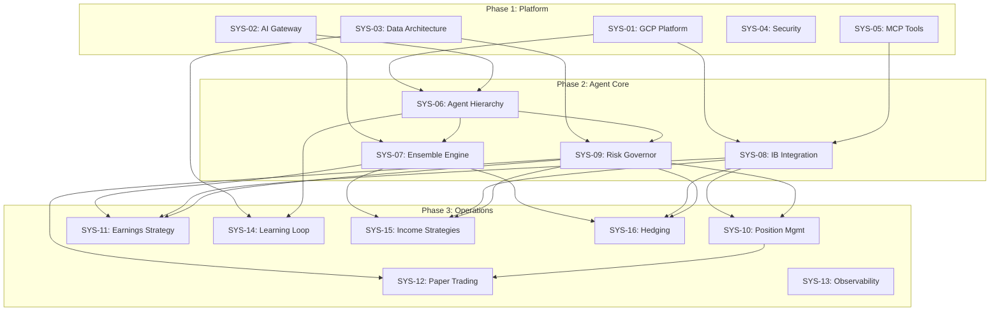

# SYS Index (System Requirements)

## Purpose

- Central index for System Requirements Specifications
- Tracks allocation and sequencing for `SYS-NN_{descriptive}.md` descriptors
- Layer 6 in SDD workflow: BRD → PRD → EARS → BDD → ADR → **SYS** → REQ

## Allocation Rules

- Numbering: allocate sequentially starting at `01`; keep numbers stable
- SYS documents define functional requirements and quality attributes
- Each SYS links upstream to 05_ADR/BDD and downstream to REQ
- Use MVP template for focused systems (5-10 capabilities)
- Use Full template for enterprise systems (20+ capabilities)

## Templates and Reference Files

### Framework Base Path

```
/opt/data/docs_flow_framework/ai_dev_flow/06_SYS/
```

### Document Templates

| Template | Path | Use Case | Lines |
|----------|------|----------|-------|
| **MVP Template** | `SYS-MVP-TEMPLATE.md` | Single-file, 5-10 capabilities, rapid development | ~350 |
| **Traceability Matrix** | `SYS-00_TRACEABILITY_MATRIX-TEMPLATE.md` | Cross-reference tracking template | ~150 |

### Creation and Validation Rules

| Document | Path | Purpose |
|----------|------|---------|
| **Creation Rules** | `SYS_CREATION_RULES.md` | Document creation standards and procedures |
| **Validation Rules** | `SYS_VALIDATION_RULES.md` | Quality gates and validation criteria |
| **Quality Gate Validation** | `SYS_MVP_QUALITY_GATE_VALIDATION.md` | Multi-document consistency checks |
| **README** | `README.md` | SYS overview, patterns, and best practices |

### Example Documents

| Example | Path | Description |
|---------|------|-------------|
| **Functional Requirements** | `examples/SYS-01_functional_requirements.md` | Sample functional requirements |
| **Quality Attributes** | `examples/SYS-02_quality_attributes.md` | Sample quality attributes |
| **Trading Bot SYS** | `SYS-01_trading_bot.md` | Complete SYS example |

### Reference Index Files

| File | Path | Purpose |
|------|------|---------|
| **Framework SYS Index** | `SYS-00_index.md` | Framework-level SYS registry |
| **Required Documents List** | `SYS-00_required_documents_list.md` | Standard SYS document list |

### Full Path Reference

```
/opt/data/docs_flow_framework/ai_dev_flow/06_SYS/
├── README.md                              # Overview and guidelines
├── SYS-TEMPLATE.md                        # Full template (~1,000 lines)
├── SYS-MVP-TEMPLATE.md                    # MVP template (~350 lines)
├── SYS-SKELETON-TEMPLATE.md               # Minimal template (~150 lines)
├── SYS-SECTION-0-TEMPLATE.md              # Section index template
├── SYS-SECTION-TEMPLATE.md                # Section template
├── SYS-00_TRACEABILITY_MATRIX-TEMPLATE.md # Traceability matrix
├── SYS-00_index.md                        # Framework index
├── SYS-00_required_documents_list.md      # Standard document list
├── SYS-01_trading_bot.md                  # Complete example
├── SYS_CREATION_RULES.md                  # Creation standards
├── SYS_VALIDATION_RULES.md                # Validation criteria
├── SYS_MVP_QUALITY_GATE_VALIDATION.md               # Corpus consistency
└── examples/
    ├── SYS-01_functional_requirements.md  # Functional example
    └── SYS-02_quality_attributes.md       # Quality example
```

### Template Selection Matrix

| Criteria | MVP | Full | Skeleton | Sectioned |
|----------|-----|------|----------|-----------|
| Capabilities | 5-10 | 20+ | 3-5 | 10-20 |
| File Size | Single | Single | Single | Multiple |
| Target Lines | ~350 | ~1,000 | ~150 | ~300/section |
| Use Case | Rapid MVP | Enterprise | Quick start | Large systems |
| Validation | Streamlined | Full | Minimal | Per-section |

### Recommended Template by SYS Document

| SYS ID | Title | Template | Rationale |
|--------|-------|----------|-----------|
| SYS-01 | GCP Platform Infrastructure | MVP | Focused infrastructure scope |
| SYS-02 | AI Gateway & LLM Integration | MVP | Single integration component |
| SYS-03 | Data Architecture & Storage | **Full** | Multi-database, complex data flows |
| SYS-04 | Security & Authentication | MVP | Focused security scope |
| SYS-05 | MCP Tool Architecture | MVP | Tool integration layer |
| SYS-06 | Agent Hierarchy & Orchestration | **Full** | 22+ agents, complex orchestration |
| SYS-07 | Agent Ensemble Engine | **Full** | Complex voting/consensus logic |
| SYS-08 | Interactive Brokers Integration | **Full** | Critical trading interface |
| SYS-09 | Risk Governor & Circuit Breakers | **Full** | Safety-critical, multi-rule system |
| SYS-10 | Position Management & Order Execution | **Full** | Complex state machine, order flow |
| SYS-11 | Earnings Trading Strategy | MVP | Single strategy focus |
| SYS-12 | Paper Trading Validation | MVP | Validation workflow |
| SYS-13 | Observability & Monitoring | MVP | Monitoring stack |
| SYS-14 | Self-Learning Loop | MVP | Learning pipeline |
| SYS-15 | Income Strategies (CC/CSP/IC) | MVP | Strategy collection |
| SYS-16 | Hedging Strategies | MVP | Strategy collection |

---

## Required SYS Documents

### Phase 1: Platform Infrastructure (P1)

Core infrastructure systems that enable all other components.

| ID | Title | BRD | ADR Links | Priority | Template | Status |
|----|-------|-----|-----------|----------|----------|--------|
| SYS-01 | GCP Platform Infrastructure | BRD-01 | ADR-18, ADR-19 | P1 | MVP | **Created** |
| SYS-02 | AI Gateway & LLM Integration | BRD-02 | ADR-04, ADR-06 | P1 | MVP | **Created** |
| SYS-03 | Data Architecture & Storage | BRD-03 | ADR-10, ADR-11, ADR-12, ADR-13 | P1 | Full | **Created** |
| SYS-04 | Security & Authentication | BRD-04 | ADR-21 | P1 | MVP | **Created** |
| SYS-05 | MCP Tool Architecture | BRD-05 | ADR-05 | P1 | MVP | **Created** |

### Phase 2: Agent Core Systems (P1)

Core agent framework and trading infrastructure.

| ID | Title | BRD | ADR Links | Priority | Template | Status |
|----|-------|-----|-----------|----------|----------|--------|
| SYS-06 | Agent Hierarchy & Orchestration | BRD-06 | ADR-04, ADR-07 | P1 | Full | **Created** |
| SYS-07 | Agent Ensemble Engine | BRD-07 | ADR-08, ADR-09 | P1 | Full | **Created** |
| SYS-08 | Interactive Brokers Integration | BRD-08 | ADR-20 | P1 | Full | **Created** |
| SYS-09 | Risk Governor & Circuit Breakers | BRD-09 | ADR-14, ADR-15, ADR-16, ADR-17 | P1 | Full | **Created** |

### Phase 3: Operations & Strategy (P1/P2)

Operational workflows, trading strategies, and supporting systems.

| ID | Title | BRD | ADR Links | Priority | Template | Status |
|----|-------|-----|-----------|----------|----------|--------|
| SYS-10 | Position Management & Order Execution | BRD-10 | ADR-16, ADR-17 | P1 | Full | **Created** |
| SYS-11 | Earnings Trading Strategy | BRD-11 | ADR-08, ADR-09, ADR-14 | P1 | MVP | **Created** |
| SYS-12 | Paper Trading Validation | BRD-12 | ADR-14, ADR-15 | P1 | MVP | **Created** |
| SYS-13 | Observability & Monitoring | BRD-13 | ADR-19 | P2 | MVP | **Created** |
| SYS-14 | Self-Learning Loop | BRD-14 | ADR-22 | P2 | MVP | **Created** |
| SYS-15 | Income Strategies (CC/CSP/IC) | BRD-15 | ADR-08, ADR-14, ADR-16 | P2 | MVP | **Created** |
| SYS-16 | Hedging Strategies | BRD-16 | ADR-08, ADR-14, ADR-16 | P2 | MVP | **Created** |

---

## Agent Subsystem SYS Documents (Optional Expansion)

For detailed agent-level specifications. Create as subsystems or standalone SYS when agent complexity requires it.

### Level 0: System Agents

| ID | Title | Parent SYS | Agent Name | Priority | Status |
|----|-------|------------|------------|----------|--------|
| SYS-17 | Health Monitor Agent | SYS-13 | health_monitor | P2 | **Created** |
| SYS-18 | System Scheduler Agent | SYS-01 | scheduler | P2 | **Created** |

### Level 1: Portfolio Orchestrator Agents

| ID | Title | Parent SYS | Agent Name | Priority | Status |
|----|-------|------------|------------|----------|--------|
| SYS-19 | Capital Allocator Agent | SYS-09 | capital_allocator | P2 | **Created** |
| SYS-20 | Auth Gate Agent | SYS-04 | auth_gate | P2 | **Created** |

### Level 2: Strategy Coordinator Agents

| ID | Title | Parent SYS | Agent Name | Priority | Status |
|----|-------|------------|------------|----------|--------|
| SYS-21 | Earnings Strategy Coordinator | SYS-11 | earnings_coordinator | P2 | **Created** |
| SYS-22 | Income Strategy Coordinator | SYS-15 | income_coordinator | P2 | **Created** |
| SYS-23 | Hedging Strategy Coordinator | SYS-16 | hedging_coordinator | P2 | **Created** |

### Level 3: Execution Agents

| ID | Title | Parent SYS | Agent Name | Priority | Status |
|----|-------|------------|------------|----------|--------|
| SYS-24 | Order Manager Agent | SYS-10 | order_manager | P1 | **Created** |
| SYS-25 | Position Monitor Agent | SYS-10 | position_monitor | P1 | **Created** |
| SYS-26 | P&L Tracker Agent | SYS-10 | pnl_tracker | P2 | **Created** |

### Level 4: Analysis Agents

| ID | Title | Parent SYS | Agent Name | Priority | Status |
|----|-------|------------|------------|----------|--------|
| SYS-27 | Stock Selection Agent | SYS-11 | stock_selection | P1 | **Created** |
| SYS-28 | Market Intelligence Agent | SYS-11 | market_intel | P2 | **Created** |
| SYS-29 | Earnings Calendar Agent | SYS-11 | calendar_agent | P2 | **Created** |

### Level 5: Data Agents

| ID | Title | Parent SYS | Agent Name | Priority | Status |
|----|-------|------------|------------|----------|--------|
| SYS-30 | IB Connector Agent | SYS-08 | ib_connector | P1 | **Created** |
| SYS-31 | Content Processor Agent | SYS-03 | content_processor | P2 | **Created** |
| SYS-32 | Graph RAG Agent | SYS-03 | graph_rag | P2 | **Created** |
| SYS-33 | Vector Search Agent | SYS-03 | vector_search | P2 | **Created** |

---

## Document Summary

### Primary SYS Documents (Core Requirements)

| Phase | Count | Priority | Status |
|-------|-------|----------|--------|
| Phase 1: Platform Infrastructure | 5 | P1 | 5/5 Created |
| Phase 2: Agent Core | 4 | P1 | 4/4 Created |
| Phase 3: Operations & Strategy | 7 | P1/P2 | 7/7 Created |
| **Total Primary** | **16** | | **16/16 Created** |

### Agent Subsystem SYS Documents (Expansion)

| Level | Count | Priority | Status |
|-------|-------|----------|--------|
| L0: System Agents | 2 | P2 | 2/2 Created |
| L1: Portfolio Agents | 2 | P2 | 2/2 Created |
| L2: Strategy Coordinators | 3 | P2 | **3/3 Created** |
| L3: Execution Agents | 3 | P1/P2 | **3/3 Created** |
| L4: Analysis Agents | 3 | P1/P2 | **3/3 Created** |
| L5: Data Agents | 4 | P1/P2 | **4/4 Created** |
| **Total Subsystems** | **17** | | **17/17 Created** |

### Grand Total

| Category | Count |
|----------|-------|
| Primary SYS (MVP Required) | 16 |
| Agent Subsystem SYS (Optional) | 17 |
| **Total Potential** | **33** |

---

## Creation Order (Recommended)

### Week 1-2: Platform Foundation (5 documents)

```
SYS-01 → SYS-02 → SYS-03 → SYS-04 → SYS-05
```

1. **SYS-01**: GCP Platform Infrastructure (enables all deployments)
2. **SYS-02**: AI Gateway & LLM Integration (enables agent decisions)
3. **SYS-03**: Data Architecture & Storage (enables state management)
4. **SYS-04**: Security & Authentication (enables secure access)
5. **SYS-05**: MCP Tool Architecture (enables agent-tool interaction)

### Week 3-4: Agent Core (4 documents)

```
SYS-06 → SYS-07 → SYS-08 → SYS-09
```

6. **SYS-06**: Agent Hierarchy & Orchestration (defines agent structure)
7. **SYS-07**: Agent Ensemble Engine (defines voting mechanism)
8. **SYS-08**: Interactive Brokers Integration (enables trading)
9. **SYS-09**: Risk Governor & Circuit Breakers (enables risk controls)

### Week 5-6: Trading Operations (4 documents)

```
SYS-10 → SYS-11 → SYS-12 → SYS-13
```

10. **SYS-10**: Position Management & Order Execution (enables trading)
11. **SYS-11**: Earnings Trading Strategy (primary strategy)
12. **SYS-12**: Paper Trading Validation (enables validation)
13. **SYS-13**: Observability & Monitoring (enables operations)

### Week 7-8: Advanced Capabilities (3 documents)

```
SYS-14 → SYS-15 → SYS-16
```

14. **SYS-14**: Self-Learning Loop (enables improvement)
15. **SYS-15**: Income Strategies (additional strategies)
16. **SYS-16**: Hedging Strategies (portfolio protection)

---

## Dependency Graph



---

## Template Usage Guidelines

### When to Use Each Template

| Template | When to Use | Key Indicators |
|----------|-------------|----------------|
| **MVP** | Initial development, focused scope | 5-10 capabilities, single component, <500 lines expected |
| **Full** | Production systems, complex integrations | 20+ capabilities, multiple interfaces, compliance needs |
| **Skeleton** | Quick exploration, placeholder | Initial draft, will expand later |
| **Sectioned** | Large systems exceeding file limits | >600 lines, logical domain boundaries |

### Template Quick Reference

**MVP Template** (`SYS-MVP-TEMPLATE.md`):
- 12 sections (vs 15 in Full)
- Single file format
- Streamlined validation
- Target: ~350 lines

**Full Template** (`SYS-TEMPLATE.md`):
- 15 sections with full detail
- Comprehensive quality attributes
- Full traceability requirements
- Target: ~1,000 lines

**Sectioned Format** (when needed):
- Use `SYS-SECTION-0-TEMPLATE.md` for index
- Use `SYS-SECTION-TEMPLATE.md` for each section
- Split at logical boundaries (functional, quality, interface, data)

---

## ADR to SYS Mapping

| ADR | Title | Target SYS |
|-----|-------|------------|
| ADR-01 | Agent Prompt Versioning | SYS-06 |
| ADR-02 | Ansible Configuration Mgmt | SYS-01 |
| ADR-03 | Prompt Templating Solutions | SYS-06 |
| ADR-04 | Google ADK Framework | SYS-02, SYS-06 |
| ADR-05 | MCP Architecture | SYS-05 |
| ADR-06 | LiteLLM AI Gateway | SYS-02 |
| ADR-07 | Agent Hierarchy | SYS-06 |
| ADR-08 | Ensemble Voting Architecture | SYS-07 |
| ADR-09 | Consensus Algorithm | SYS-07 |
| ADR-10 | Multi-Database Strategy | SYS-03 |
| ADR-11 | Neo4j Graph RAG | SYS-03 |
| ADR-12 | Vector Search Strategy | SYS-03 |
| ADR-13 | Data Retention and TTL | SYS-03 |
| ADR-14 | Risk Governor | SYS-09 |
| ADR-15 | Circuit Breaker System | SYS-09 |
| ADR-16 | Position Sizing | SYS-09, SYS-10 |
| ADR-17 | Options Exit Rules | SYS-09, SYS-10 |
| ADR-18 | Cloud Provider Selection | SYS-01 |
| ADR-19 | Cloud Run Deployment | SYS-01, SYS-13 |
| ADR-20 | IB Connection Strategy | SYS-08 |
| ADR-21 | Secrets and Config Mgmt | SYS-04 |
| ADR-22 | Agent Learning Loop | SYS-14 |

---

## Traceability Requirements

Each SYS document MUST include Section 12 (Traceability) with:

### Upstream References

```markdown
@brd: BRD.NN.EE.SS (Business requirements)
@prd: PRD.NN.EE.SS (Product features)
@ears: EARS.NN.24.SS (Engineering requirements)
@bdd: BDD-NN (Behavior scenarios)
@adr: ADR-NN (Architecture decisions)
```

### Downstream Artifacts

```markdown
@req: REQ.NN.EE.SS (Atomic requirements)
@spec: SPEC-NN (Technical specifications)
@ctr: CTR-NN (API contracts)
```

---

## Quality Gate

SYS documents must achieve:

- **EARS-Ready Score**: ≥90% (required for EARS progression)
- **All traceability links**: Valid upstream/downstream references
- **Functional requirements**: Complete with acceptance criteria
- **Quality attributes**: Quantified performance/reliability targets
- **Interface specifications**: Defined external interactions

---

## Next Steps

1. Create SYS-01 through SYS-05 (Platform Infrastructure)
2. Create SYS-06 through SYS-09 (Agent Core)
3. Create SYS-10 through SYS-13 (Trading Operations)
4. Create SYS-14 through SYS-16 (Advanced Capabilities)
5. Evaluate need for Agent Subsystem SYS documents

---

## Document History

| Version | Date | Author | Changes |
|---------|------|--------|---------|
| 1.0 | 2026-01-04 | Claude | Initial SYS index with 16 primary + 17 subsystem documents |
| 1.1 | 2026-01-04 | Claude | Added SYS-04: Security & Authentication |
| 1.2 | 2026-01-04 | Claude | Added SYS-07: Agent Ensemble Engine |
| 1.3 | 2026-01-04 | Claude | Added SYS-02: AI Gateway & LLM Integration |
| 1.4 | 2026-01-04 | Claude | Added SYS-13: Observability & Monitoring |
| 1.5 | 2026-01-04 | Claude | Added SYS-03: Data Architecture & Storage (Full Template) |
| 1.6 | 2026-01-04 | Claude | Added SYS-15: Income Strategies (CC/CSP/IC) |
| 1.7 | 2026-01-04 | Claude | Added SYS-12: Paper Trading Validation (MVP Template) |
| 1.8 | 2026-01-04 | Claude | Added SYS-11: Earnings Trading Strategy (MVP Template) |
| 1.9 | 2026-01-04 | Claude | Added SYS-14: Self-Learning Loop (MVP Template) |
| 1.10 | 2026-01-04 | Claude | Added SYS-16: Hedging Strategies (MVP Template) |
| 1.11 | 2026-01-04 | Claude | Added SYS-08: Interactive Brokers Integration (Full Template) |
| 1.12 | 2026-01-04 | Claude | Added SYS-06, SYS-09, SYS-10 - All 16 primary SYS documents complete |
| 1.13 | 2026-01-04 | Claude | Added L5 Data Agents: SYS-30 (IB Connector), SYS-31 (Content Processor), SYS-32 (Graph RAG), SYS-33 (Vector Search) |
| 1.14 | 2026-01-04 | Claude | Added L4 Analysis Agents: SYS-27 (Stock Selection), SYS-28 (Market Intelligence), SYS-29 (Earnings Calendar) |
| 1.15 | 2026-01-04 | Claude | Added L0-L1 Agent Subsystems: SYS-17 (Health Monitor), SYS-18 (System Scheduler), SYS-19 (Capital Allocator), SYS-20 (Auth Gate) |
| 1.16 | 2026-01-04 | Claude | Added L2 Strategy Coordinators: SYS-21 (Earnings), SYS-22 (Income), SYS-23 (Hedging) - All 17 subsystem SYS documents complete |

---

**End of SYS Index**
