Development Principles Guide

## The AI-Driven Specification-Driven Development Workflow

**⚠️ For the complete authoritative workflow diagram, see [index.md](./index.md#traceability-flow).**

### Workflow Overview

The SDD workflow transforms business needs into production-ready code through traceable artifacts organized in 10 distinct layers:

**Business Layer** (BRD → PRD → EARS) → **Testing Layer** (BDD) → **Architecture Layer** (ADR → SYS) → **Requirements Layer** (REQ) → **Project Management Layer** (IMPL) → **Interface Layer** (CTR - optional) → **Implementation Layer** (SPEC) → **Code Generation Layer** (TASKS) → **Execution Layer** (Code → Tests) → **Validation Layer** (Validation → Review → Production)

**Key Decision Point**: After IMPL, if the requirement involves an interface (API, event schema, data model), create CTR before SPEC. Otherwise, go directly to SPEC.

#### Visual Workflow Diagram

```mermaid
graph LR
    subgraph L1["Layer 1: Business"]
        BRD[BRD] --> PRD[PRD] --> EARS[EARS]
    end

    subgraph L2["Layer 2: Testing"]
        BDD[BDD<br/>Behavior Tests]
    end

    subgraph L3["Layer 3: Architecture"]
        ADR[ADR] --> SYS[SYS]
    end

    subgraph L4["Layer 4: Requirements"]
        REQ[REQ<br/>Atomic Requirements]
    end

    subgraph L5["Layer 5: Project Management"]
        IMPL[IMPL<br/><i>WHO/WHEN</i>]
    end

    subgraph L6["Layer 6: Interface"]
        CTR[CTR<br/><i>optional</i>]
    end

    subgraph L7["Layer 7: Implementation"]
        SPEC[SPEC<br/><i>YAML</i>]
    end

    subgraph L8["Layer 8: Code Generation"]
        TASKS[TASKS<br/>Generation Plans]
    end

    subgraph L9["Layer 9: Execution"]
        CODE[Code] --> TESTS[Tests]
    end

    subgraph L10["Layer 10: Validation"]
        VAL[Validation] --> REV[Review] --> PROD[Production]
    end

    EARS --> BDD
    BDD --> ADR
    SYS --> REQ
    REQ --> IMPL
    IMPL --> CTR
    CTR --> SPEC
    SPEC --> TASKS
    TASKS --> CODE
    TESTS --> VAL
    PROD -.-> BRD

    style BRD fill:#e1f5ff,stroke:#0277bd,stroke-width:2px
    style PRD fill:#e1f5ff,stroke:#0277bd,stroke-width:2px
    style EARS fill:#e1f5ff,stroke:#0277bd,stroke-width:2px
    style BDD fill:#fff3cd,stroke:#f9a825,stroke-width:2px
    style ADR fill:#d4edda,stroke:#388e3c,stroke-width:2px
    style SYS fill:#d4edda,stroke:#388e3c,stroke-width:2px
    style REQ fill:#f8d7da,stroke:#d32f2f,stroke-width:2px
    style IMPL fill:#d1ecf1,stroke:#0097a7,stroke-width:2px
    style CTR fill:#e2e3e5,stroke:#616161,stroke-width:2px
    style SPEC fill:#fff3e0,stroke:#f57c00,stroke-width:2px
    style TASKS fill:#fce4ec,stroke:#c2185b,stroke-width:2px
    style CODE fill:#f3e5f5,stroke:#7b1fa2,stroke-width:2px
    style TESTS fill:#e8f5e9,stroke:#388e3c,stroke-width:2px
    style VAL fill:#e0f2f1,stroke:#00897b,stroke-width:2px
    style REV fill:#e0f2f1,stroke:#00897b,stroke-width:2px
    style PROD fill:#e0f2f1,stroke:#00897b,stroke-width:2px
```



**Layer Descriptions:**
- **Layer 1 - Business** (Blue): BRD → PRD → EARS (Strategic direction and product vision)
- **Layer 2 - Testing** (Yellow): BDD (Acceptance criteria and test scenarios)
- **Layer 3 - Architecture** (Green): ADR → SYS (Technical decisions and system design)
- **Layer 4 - Requirements** (Red): REQ (Detailed atomic requirements)
- **Layer 5 - Project Management** (Cyan): IMPL (Implementation planning - WHO/WHEN)
- **Layer 6 - Interface** (Gray): CTR (API contracts - created when needed)
- **Layer 7 - Implementation** (Orange): SPEC (Technical specifications - YAML)
- **Layer 8 - Code Generation** (Pink): TASKS (Detailed implementation tasks)
- **Layer 9 - Execution** (Purple/Green): Code → Tests (Implementation and validation)
- **Layer 10 - Validation** (Teal): Validation → Review → Production (Quality gates and deployment)

See [index.md](./index.md#traceability-flow) for additional workflow visualizations and [TRACEABILITY.md](./TRACEABILITY.md) for complete traceability guidelines.


# Important Traceability Condition
PRDs should reference the documentation in this directory, but the documentation itself should not reference PRDs. The documentation is the authoritative source for requirements and features.
# Spec-Driven Development (SDD) Guide — Examples
@requirement:[REQ-003](./reqs/risk/lim/REQ-003_position_limit_enforcement.md#REQ-003)
@adr:[ADR-033](./adrs/ADR-033_risk_limit_enforcement_architecture.md#ADR-033)
@spec:[position_limit_service](./specs/services/SPEC-003_position_limit_service.yaml)

Status: Example-scoped standard for ai_dev_flow. Aligns with `.project_instructions/DOCUMENT_ID_CORE_RULES.md`, `docs/DOCUMENT_ID_CORE_RULES.md`, `TRACEABILITY.md`, and `ID_NAMING_STANDARDS.md`.

## Purpose
- Establish a clear, repeatable, and testable process to move from product intent to code using specifications as the source of truth.
- Ensure every behavior is traceable: PRD → EARS → BDD → ADR → SYS → REQ → IMPL → CTR → SPEC → TASKS → Code.

## Concept
- Define behavior, interfaces, constraints, and verification in unambiguous specifications before coding.
- Complementary to TDD/BDD: the spec drives tests and code; BDD verifies acceptance; TDD covers units.

## Principles
- Single Source of Truth: The technical specification defines the implementation.
- One-Doc-Per-ID: Each REQ/ADR/SPEC file holds one document; filenames include IDs.
- Specification-First: Technical specifications precede implementation.
- Complete Traceability: All cross-references use markdown link format with anchors.
- Executable Examples: Provide concrete I/O examples in specs for deterministic codegen.
- Non-Functional First-Class: Performance, reliability, observability, and security are explicit in specs.
- Minimal, Reviewable Diffs: Small steps; verify at each gate.
- Change via ADR: Architectural changes recorded and linked.
- **Document Structure Simplicity**: Keep documents as single comprehensive files with clear section headings. Only split into multiple files when file exceeds 1,000 lines AND has multiple distinct audience needs OR complex dependency chains requiring separate documentation. Use table of contents for navigation within single documents.
- Document ID Independence: IDs are sequential within artifact type; consult index files (ID: 000) to discover documents by topic or content

## Document Discovery and ID Independence

**⚠️ CRITICAL: Document IDs are independent of document content**

- **ID Numbers Do Not Match Content**: A document's ID number (e.g., PRD-009, REQ-015, BDD-003) does NOT necessarily correspond to related documents in other artifact types
- **Always Try to Find and Use Index Files**: To find documents by topic/content, consult the index file for each artifact type
  - Index files use ID `000` in their identifier (e.g., PRD-000, REQ-000, ADR-000)
  - Index filenames include "index" in the name
  - Index files contain descriptions and summaries of all documents of that artifact type
  - Organized by domain, category, or functional area depending on artifact type

**Example Scenario**:
- BRD-009 covers "Broker Integration Pilot"
- PRD-009 might cover "Cash-Secured Put Workflow" (completely unrelated topic)
- The corresponding PRD for broker integration might be PRD-016 or any other number
- **Solution**: Find and read the PRD index file (ID: 000, filename contains "index") to search descriptions for broker integration keywords

**Best Practice for AI Assistants**:
1. When searching for related documents, **find and read the index file first** (ID: 000, name contains "index")
2. Search index descriptions and summaries for keywords related to your topic
3. Do NOT assume document IDs match across artifact types
4. Use traceability tags within documents to find explicitly linked artifacts
5. Verify document content matches your topic before assuming relationship

## Required Artifacts (with ID standards)

### Product Requirements Documents (PRD)
- **Purpose**: Capture business requirements and product strategy before technical implementation
- **File Format**: `PRD-NNN_descriptive_title.md`
- **Contents**: Problem statement, goals, non-goals, KPIs, acceptance criteria
- **Position**: Starting point of development workflow - defines "what" needs to be built
- **Key Sections**:
  - Problem: Current state issues and business impact
  - Goals: Measurable outcomes and success criteria
  - Non-Goals: Explicit scope boundaries
  - KPIs: Quantitative business metrics
  - Acceptance: Business-focused validation criteria

### System Requirements (SYS)
- **Purpose**: Technical interpretation of business requirements
- **File Format**: `SYS-NNN_descriptive_title.md`
- **Contents**: Functional and non-functional requirements, system flows
- **Position**: Bridge between business PRDs and technical EARS requirements

### EARS Requirements (EARS)
- **Purpose**: Precise, testable requirements using structured WHEN-THE-SHALL-WITHIN syntax
- **File Format**: `EARS-NNN_descriptive_title.md`
- **Statement Types**:
  - Event-driven: `WHEN [condition] THE [system] SHALL [action] WITHIN [timeframe]`
  - State-driven: `WHILE [condition] THE [system] SHALL [behavior] WITHIN [constraint]`
  - Unwanted Behavior: `IF [condition] THE [system] SHALL [prevention] WITHIN [timeframe]`
  - Ubiquitous: `THE [system] SHALL [requirement] WITHIN [constraint]`
- **Position**: Transforms PRDs/SYS into formal, measurable requirements

### Atomic Requirements (REQ)
- **Purpose**: Break complex requirements into single, testable statements
- **File Format**: `reqs/{domain}/{subdomain}/REQ-NNN_descriptive_title.md`
- **Structure**:
  - Description: Precise SHALL statement defining one behavior
  - Acceptance Criteria: Measurable validation conditions
  - Related ADRs: Architecture decisions implementing the requirement
  - Source Requirements: Links to upstream PRD/EARS requirements
  - Verification: Method to prove requirement satisfaction
- **Hierarchical Organization**: Grouped by functional domains (api, risk, data, etc.)
- **Key Characteristics**: One atomic requirement per file, measurable criteria, BDD scenario linkage

### API Contracts (CTR)
- **Purpose**: Formal interface specifications for component-to-component communication
- **File Format (Dual)**: `contracts/CTR-NNN_descriptive_slug.md` + `CTR-NNN_descriptive_slug.yaml`
- **When to Create**: When REQ specifies interface requirements between components/services
- **Structure**:
  - Markdown (.md): Human-readable context, requirements satisfied, NFRs, versioning, traceability
  - YAML (.yaml): Machine-readable request/response schemas, error codes, performance targets
- **Key Sections**:
  - Contract Definition: Interface overview, parties (provider/consumer), communication pattern
  - Interface Specification: Request/response schemas using JSON Schema
  - Error Handling: Complete error taxonomy with codes and retry policies
  - Non-Functional Requirements: Latency, idempotency, rate limiting, circuit breaker settings
  - Versioning Strategy: Semantic versioning rules, deprecation policy
- **Organization**: Optional subdirectories by service type (`agents/`, `mcp/`, `infra/`, `shared/`)
- **Position**: After REQ, before SPEC - enables parallel development with contract-first approach
- **Benefits**: Parallel development, early validation, prevents implementation drift, testable interfaces

### Architecture Decision Records (ADR)
- **Purpose**: Document architectural decisions with rationale and consequences
- **File Format**: `ADR-NNN_descriptive_title.md`
- **Template Structure**:
  - Context: Problem, background, driving forces, constraints
  - Decision: Chosen solution and implementation approach
  - Consequences: Positive/negative impacts, trade-offs, risks
  - Verification: BDD scenarios validating architectural approach
  - Alternatives: Rejected options with specific reasons
  - Relations: Dependencies, supersedes, impacts on other decisions
- **Lifecycle**: Proposed → Accepted → Superseded/Deprecated
- **Position**: Decision artifacts bridge requirements with implementation

### Behavior-Driven Development (BDD)
- **Purpose**: Executable specifications written in natural language
- **File Format**: `BDD-NNN_descriptive_requirements.feature`
- **Scenario Types**: Success path, alternative path, error path, edge cases
- **Gherkin Syntax**: Given-When-Then structure for behavioral specifications
- **Key Features**:
  - Feature statements with business value
  - Tagged scenarios for traceability (`@requirement`, `@adr`)
  - Background setup shared across scenarios
  - Example tables for data-driven scenarios
- **Position**: Operational requirements validating technical implementation

### Technical Specifications (SPEC)
- **Purpose**: Machine-readable technical blueprints for implementation
- **File Format**: `specs/{domain}/SPEC-NNN_{component_name}.yaml`
- **Core Sections**:
  - Interface definitions (functions, classes, schemas)
  - Behavioral specifications (states, error handling, circuit breakers)
  - Operational requirements (caching, rate limiting, observability)
  - Performance specifications (latency, throughput, resource limits)
  - Verification mapping (BDD scenarios, load tests, integration tests)
- **Position**: YAML implementation specifications translated into executable code

### AI Tasks (TASKS)
- **Purpose**: Structured implementation guidance for AI-assisted development
- **File Format**: `TASKS-NNN_descriptive_component_tasks.md`
- **Structure**:
  - Scope: Clearly bounded implementation responsibility
  - Plan: Numbered sequence of development activities
  - Constraints: Technical boundaries and limitations
  - Acceptance: Verification requirements for completion
- **Position**: Implementation roadmap connecting specifications to code

### Code Implementation
- **Purpose**: Executable realization of specifications
- **File Structure**: `src/{module_name}/` implementing SPEC-defined interfaces
- **Requirements**: Exact match to SPEC interfaces, contract compliance (if implementing CTR), BDD scenario validation
- **Traceability**: Docstring links to all artifacts (PRD, EARS, REQ, ADR, CTR if applicable, BDD, SPEC)

## Universal Tag Header (Required)
- All artifacts (Markdown/YAML/Feature/Code) must include BDD-style tags at the top of the file to declare upstream dependencies.
- Minimum: `@requirement:[REQ-...](...)`; also add `@adr:[ADR-...](...)` when applicable. Recommended: `@prd`, `@sys`, `@ears`, `@contract`, `@spec`, `@bdd`.
- **Contract Tag**: Use `@contract:[CTR-NNN](...)` when implementing or consuming an API contract
- Examples:
  - Markdown:

    @requirement:[REQ-003](./reqs/risk/lim/REQ-003_position_limit_enforcement.md#REQ-003)
    @adr:[ADR-033](./adrs/ADR-033_risk_limit_enforcement_architecture.md#ADR-033)
    @contract:[CTR-001](./contracts/CTR-001_position_risk_validation.md#CTR-001)
    @prd:[PRD-003](./prd/PRD-003_position_risk_limits.md)
    @sys:[SYS-003](./sys/SYS-003_position_risk_limits.md)
    @ears:[EARS-003](./ears/EARS-003_position_limit_enforcement.md)
    @spec:[position_limit_service](./specs/services/position_limit_service.yaml)
    @bdd:[BDD-001](./bbds/risk_limits_requirements.feature:L28](./bbds/risk_limits_requirements.feature#L28)
  - YAML (comment header):

    # @requirement:[REQ-003](../reqs/risk/lim/REQ-003_position_limit_enforcement.md#REQ-003)
    # @adr:[ADR-033](../adrs/ADR-033_risk_limit_enforcement_architecture.md#ADR-033)
    # @contract:[CTR-001](../contracts/CTR-001_position_risk_validation.md#CTR-001)
    # @spec:[SPEC-001](../specs/services/SPEC-001_position_limit_service](../specs/services/SPEC-001_position_limit_service.yaml)
  - Code (Python docstring excerpt):

    """
    @requirement:[REQ-003](../../docs_v2/ai_dev_flow/reqs/risk/lim/REQ-003_position_limit_enforcement.md#REQ-003)
    @adr:[ADR-033](../../docs/examples/ai_dev_flow/adrs/ADR-033_risk_limit_enforcement_architecture.md#ADR-033)
    @contract:[CTR-001](../../docs/examples/ai_dev_flow/contracts/CTR-001_position_risk_validation.md#CTR-001)
    @spec:[position_limit_service](../../docs/examples/ai_dev_flow/specs/services/position_limit_service.yaml)
    """

## Tagging Goals
- End-to-end traceability: Connect REQ → ADR → CTR → BDD → SPEC → Code in a verifiable chain.
- Machine-readability: Use consistent tag syntax so scripts can validate IDs/links and build indexes.
- Impact analysis: Reveal upstream sources and downstream dependents to assess change ripple effects.
- Quality gates: Enable automated checks (ID format, link existence, required references) before commit.
- Consistency and discoverability: Standardized, grep-friendly headers make related artifacts easy to find.
- Auditability and compliance: Provide clear linkage for decisions, verification, and implementation.

## Workflow (Spec → Code)

### 1. Capture Business Intent (PRD)
- **Input**: Business needs, market requirements, stakeholder priorities
- **Output**: PRD document with problem/goals/non-goals/KPIs
- **Guidelines**: Focus on business value; avoid technical implementation details; set measurable success criteria

### 2. Formalize Requirements (EARS)
- **Input**: PRD objectives translated to precise behavioral statements
- **Output**: EARS statements using WHEN-THE-SHALL-WITHIN format
- **Types**:
  - Event-driven: `WHEN [condition] THE [system] SHALL [action] WITHIN [timeframe]`
  - State-driven: `WHILE [condition] THE [system] SHALL [behavior] WITHIN [constraint]`
  - Unwanted Behavior: `IF [condition] THE [system] SHALL [prevention] WITHIN [timeframe]`
  - Ubiquitous: `THE [system] SHALL [requirement] WITHIN [constraint]`
- **Guidelines**: One concept per statement; include quantitative constraints; enable testability

### 3. Define Atomic Requirements (REQ)
- **Input**: EARS statements decomposed into individual verifiable behaviors
- **Output**: REQ files with descriptions, acceptance criteria, verification methods
- **Structure**:
  - Description: Precise SHALL statement defining one behavior
  - Acceptance Criteria: Measurable validation conditions
  - Related ADRs: Architecture decisions implementing the requirement
  - Verification: Test methods (BDD scenarios, unit tests, integration tests)
- **Organization**: Hierarchical by functional domains (`reqs/{domain}/{subdomain}/`)
- **Guidelines**: Atomic principle (one requirement per file); include error and edge cases

### 4. Record Architectural Decisions (ADR)
- **Input**: Technical alternatives evaluated for requirement satisfaction
- **Output**: ADR with selected solution, context, consequences, alternatives
- **Template Structure**:
  - Context: Problem, background, constraints
  - Decision: Chosen approach and implementation
  - Consequences: Benefits, trade-offs, risks, dependencies
  - Verification: BDD scenarios validating architectural approach
  - Alternatives: Rejected options with specific rejection reasons
  - Relations: Dependencies, supersedes, subsequent decisions
- **Lifecycle**: Proposed (draft) → Accepted (implemented) → Superseded/Deprecated
- **Guidelines**: Document due diligence; avoid straw-man alternatives; include rollback plans

### 5. Specify Behavior (BDD)
- **Input**: REQ acceptance criteria expressed as executable scenarios
- **Output**: Gherkin feature files with Given-When-Then scenarios
- **Scenario Types**: Success paths, alternative paths, error conditions, edge cases
- **Tagging**: `@requirement:[REQ-...](...)` and `@adr:[ADR-...](...)` links
- **Guidelines**: Business language; declarative over imperative; tagged with traceability links

### 6. Author Technical Specifications (SPEC)
- **Input**: REQ acceptance criteria, ADR constraints
- **Output**: YAML blueprints defining implementation specifications
- **Core Sections**:
  - Interface definitions with function/class signatures and data schemas
  - Behavioral specifications (states, error handling, circuit breakers)
  - Operational requirements (caching, rate limiting, observability)
  - Performance targets with quantitative metrics
  - Verification mapping to BDD scenarios and load tests
- **Guidelines**: Machine-readable; complete specifications; feasibility of automated code generation

### 6.5. Define API Contracts (CTR) [IF INTERFACE REQUIREMENT]
- **When**: Create CTR when REQ specifies interface requirements for component-to-component communication
- **Skip If**: REQ is purely internal logic with no external interfaces
- **Input**: Interface-focused REQ, ADR architecture decisions
- **Output**: Dual-file contract (CTR-NNN_slug.md + CTR-NNN_slug.yaml)
- **Process**:
  1. Identify upstream REQ/ADR specifying interface needs
  2. Reserve next CTR-NNN from CTR-000_index.md
  3. Copy CTR-TEMPLATE.md + CTR-TEMPLATE.yaml
  4. Complete markdown file:
     - Contract Definition: Interface overview, provider/consumer parties, communication pattern
     - Interface Specification: Detailed request/response structure
     - Error Handling: Complete error taxonomy with retry policies
     - Non-Functional Requirements: Latency, idempotency, rate limiting
     - Versioning Strategy: Semantic versioning rules, deprecation policy
     - Section 7 Traceability: Upstream REQ/ADR links, downstream SPEC placeholders
  5. Complete YAML file:
     - contract_id (lowercase_snake_case matching slug)
     - endpoints with JSON Schema request/response definitions
     - error_codes with HTTP status and retry behavior
     - non_functional requirements (max_latency_ms, idempotent, circuit_breaker)
     - upstream_requirements, upstream_adrs
  6. Update CTR-000_index.md catalog
  7. Update upstream REQ to link to CTR
  8. Validate both files, verify slugs match
- **Benefits**:
  - Parallel Development: Provider and consumer teams work independently
  - Early Validation: Contract testing before full implementation
  - Drift Prevention: Schema validation ensures compliance
  - Clear Ownership: Explicit provider/consumer responsibilities
- **Guidelines**: Contract-first when multiple teams involved; versioning for breaking changes; include examples in markdown

### 7. Plan Implementation Scope (TASKS)
- **Input**: SPEC technical specifications, CTR contracts (if applicable), interface definitions
- **Output**: AI-structured implementation guidance with scope, plan, constraints, acceptance
- **Structure**:
  - Scope: Clearly bounded implementation responsibility
  - Plan: Numbered sequence of development activities
  - Constraints: Technical boundaries and limitations
  - Acceptance: Verification requirements for completion
- **Guidelines**: Task decomposition for parallel work; acceptanceCriteria for verification

### 8. Implement Code
- **Input**: SPEC specifications, CTR contracts (if applicable), TASKS implementation plans
- **Output**: Source code matching specifications and contracts exactly
- **Requirements**:
  - Exact match to SPEC interfaces
  - Contract compliance (if implementing CTR provider/consumer)
  - BDD scenario validation
  - Observability per SPEC requirements
  - Docstring traceability to all artifacts (including CTR if applicable)
- **Guidelines**: Test-driven implementation; contract testing; continuous compliance validation

### 9. Verify Implementation
- **Input**: Code, BDD tests, CTR contracts (if applicable), SPEC performance targets
- **Output**: Verification that implementation satisfies all requirements and contracts
- **Methods**:
  - BDD scenario execution with acceptance criteria
  - Contract testing (provider/consumer validation if CTR exists)
  - Performance benchmarking against SPEC targets (when measurable)
  - Integration testing with dependent components
  - Manual verification of error conditions and edge cases
- **Guidelines**: Automated verification preferred; contract tests validate interfaces; traceable test results

### 10. Validate Traceability
- **Input**: All artifacts in the development chain
- **Output**: Confirmed linkage and consistency across all documents
- **Checks**:
  - Cross-reference link resolution
  - ID format compliance
  - Tagging consistency (Gherkin tags, YAML comments, docstrings)
  - Requirement coverage completeness
  - Impact analysis accuracy
- **Guidelines**: Pre-commit validation using automated tools where available

## Quality Gates (Definition of Done)
- IDs: All files comply with `ID_NAMING_STANDARDS.md` and contain anchors in H1 where applicable.
- Links: All cross-references use markdown links; no broken paths or anchors.
- CTR (if applicable):
  - Both .md and .yaml files exist with matching slugs
  - YAML contract_id uses lowercase_snake_case matching slug
  - Upstream REQ/ADR links present in Section 7 Traceability
  - Schema validation passes (valid JSON Schema in YAML)
  - Contract version follows semantic versioning
- SPEC: Interface definitions and data schemas are complete and unambiguous.
- BDD: Scenarios tagged with valid `@requirement`, `@adr`, and `@contract` (if applicable) links.
- Non-Functional: Latency/timeouts, error taxonomy, logging/metrics defined in spec/contract.
- Observability: Key logs/metrics/traces named and fields enumerated.
- Code: Docstring lists PRD/EARS/REQ/ADR/CTR(if applicable)/BDD/SPEC links; symbol names match spec; contract compliance validated.

## AI Assistant Best Practices
- Provide Inputs: Tech Spec excerpt, concrete examples, constraints, target file paths.
- Task List: 3–6 linear steps; minimal scope; name exact files/symbols; include "do not touch" constraints.
- Acceptance: State precise outputs and commands to validate (e.g., link check, BDD tests).
- Diffs: Prefer minimal, reviewable changes; justify deviations against spec if unavoidable.

## Change Management
- Upstream Changes (PRD/EARS/REQ): Update ADR/BDD/Spec; re-run validations.
- Spec Changes: Update Code + BDD; maintain backward compatibility or bump versions.
- Always update Traceability sections and code docstrings to keep links current.

## References
- Core Rules: [../../DOCUMENT_ID_CORE_RULES.md](.. /DOCUMENT_ID_CORE_RULES.md) (project-wide compliance checklist: IDs numeric, links resolve, no promotional language)
- Example ID Standards: [ID_NAMING_STANDARDS.md](./ID_NAMING_STANDARDS.md)
- Traceability Style: [Traceability Format Standards](./TRACEABILITY.md#traceability-format-standards)
- Example Flow Index: [TRACEABILITY.md](./TRACEABILITY.md)
- Master Index: [index.md](./index.md)

## Example Mapping (Position Risk Limits)
- PRD: [PRD-003](./prd/PRD-003_position_risk_limits.md)
- SYS: [SYS-003](./sys/SYS-003_position_risk_limits.md)
- EARS: [EARS-003](./ears/EARS-003_position_limit_enforcement.md)
- BDD: [risk_limits_requirements.feature](./bbds/risk_limits_requirements.feature)
- ADR: [ADR-033](./adrs/ADR-033_risk_limit_enforcement_architecture.md#ADR-033)
- REQ: [REQ-003](./reqs/risk/lim/REQ-003_position_limit_enforcement.md#REQ-003)
- CTR: [CTR-001](./contracts/CTR-001_position_risk_validation.md#CTR-001) + [CTR-001.yaml](./contracts/CTR-001_position_risk_validation.yaml) ← Contract for position validation interface
- SPEC: [position_limit_service.yaml](./specs/services/position_limit_service.yaml)
- TASKS: [position_limit_service_tasks.md](./ai_tasks/position_limit_service_tasks.md)
- Code: `option_strategy/risk/position_limit_service.py`

## Validation Commands
- Validate requirement IDs: `python scripts/validate_requirement_ids.py`
- Check links (repo-level tools if available): `python scripts/check_broken_references.py`
- Generate matrices (if available): `python scripts/complete_traceability_matrix.py`

## Documentation Standards (No Marketing, Code Separation)
- Objective tone only: exclude promotional language, subjective claims, and business benefits.
- Do not include Python code blocks in documentation; prefer Mermaid flowcharts or structured pseudocode.
- Use flowcharts for logic with decision points and error paths; keep diagrams concise.
- Reference code with explicit paths and optional symbol hints: `[See Code Example: option_strategy/risk/position_limit_service.py - validate_position_limit()]`.

## Non-Functional Requirements Templates
- **Performance**: Add to SPEC performance section, e.g., latency_p95_ms: 50, throughput: 1000 rps; to ADR impact analysis, e.g., "p95 latency < 50 ms, trade-off: reduced batch size".
- **Reliability**: SYS/REQ: "System availability > 99.9%"; ADR: Circuit breaker on >5 failures/1min; SPEC: retry_policy with exponential backoff.
- **Security**: ADR: "Input validation per OWASP; no secrets in logs"; SPEC: errors for auth failures, observability: log correlation_id only (avoid PII).
- **Observability**: SPEC: logs with fields [correlation_id, error_code, timestamp]; ADR: "Alert on >10% reject rate, monitor via Cloud Monitoring".
- **Compliance Checklist**: 
  - [ ] NFRs quantified in SYS/REQ (e.g., uptime, latency bounds).
  - [ ] Security in ADR/SPEC (validation, secrets policy).
  - [ ] Observability in SPEC (log fields, metrics).
  - [ ] Trace to PROJECT_CORE_RULES: numeric IDs, absolute link validation.

## Token Efficiency and File Segmentation
- Soft limit: 10,000 tokens per file. If near the limit, split logically by function/module and add cross-references.
- Each split file must be independently understandable (minimal context header and links back to the index).
- Maintain an index page listing split files and their dependencies.
- Example: For complex specs, create SPEC-003_part1.yaml (interfaces/state), SPEC-003_part2.yaml (performance/verification); reference as [SPEC-003_part1.yaml](./specs/services/SPEC-003_part1.yaml), with [index.md](./index.md) enumerating splits and dependencies.
- Estimate tokens using tools like `wc -w` or AI token counters for maintenance.
- External References: Paths to project files are placeholders; verify existence or update to local copies for standalone use.

## Developer Checklist (Copyable)
- PRD/EARS/BDD/ADR/SYS/REQ updated; H1 contains IDs and anchors.
- ADR updated with Impact Analysis and Implementation Assessment sections.
- Tech Spec updated: `id` equals filename; includes upstream/downstream links, interfaces, data model, states, errors, performance, observability.
- BDD scenarios tagged with markdown-link format `@requirement:[REQ-...](...)` and `@adr:[ADR-...](...)`.
- AI tasks file includes scope, plan, constraints, acceptance criteria, and traceability links.
- Security implications documented (input validation, secrets policy references, correlation id handling).
- Run validators: `python scripts/validate_requirement_ids.py` and manual link checks.

## Appendix: Claude Instructions (Merged)

### General Instructions for Eliminating Marketing Language in Technical Documentation

This is an AI-Driven Specification-Driven Development approach.
This project implements **AI-Driven SDD (Specification-Driven Development)**, where AI assistants autonomously transform specifications into production code. 

**Primary Constraint:**
```
Generate technical documentation using objective, factual language only. 
Exclude promotional content, subjective claims, and business benefits.
Focus exclusively on functional specifications and implementation details.
Use minimal tokens while maintaining technical accuracy.
Evaluate all suggestions with realistic assessment of implementation complexity and impact.
Maintain file size under 10,000 tokens. Create sequential files when content exceeds limit.
Exclude Python code from documentation. Use flowcharts for logic representation.
```

**Explicit Prohibitions:**
- No time estimates or marketing performance claims
- No product benefits or advantages
- No comparative statements
- No subjective qualifiers (amazing, powerful, efficient, easy)
- No user experience predictions
- No business value propositions
- No redundant explanations or verbose descriptions
- No idealistic or oversimplified implementation scenarios
- No Python code blocks within documentation files

NFR clarification (allowed)
- It is acceptable to specify non-functional requirement targets (e.g., latency, availability, resource limits) as engineering constraints.
- State targets quantitatively and contextually (e.g., "p95 latency < 50 ms during trading hours").
- Avoid promotional phrasing; present NFRs as measurable constraints, not benefits.

### Code Separation Requirements

**Documentation Content Standards:**
- Replace Python code blocks with flowchart representations
- Use Mermaid diagram syntax for flowcharts and process flows
- Create algorithm descriptions using structured pseudocode notation
- Reference external code files using standardized linking format
- Maintain logical flow documentation without implementation details

**Code File Management:**
- Create separate `.py` files for all code examples
- Name code files: `[component]_example_[sequence].py`
- Include inline documentation within code files using docstrings
- Provide function-level explanations as comments
- Create code manifest file listing all example files with descriptions

**Reference System:**
- Use format: `[See Code Example: filename.py - function_name()]`
- Include brief functional description in reference
- Specify input/output parameters in documentation
- Map flowchart steps to corresponding code file sections
- Maintain bidirectional reference between docs and code

**Flowchart Requirements:**
- Use Mermaid syntax for all process diagrams
- Include decision points and error handling paths
- Specify data transformation steps clearly
- Document conditional logic branches
- Include validation and error handling flows

### File Management Requirements

**Document Structure Philosophy:**
- **Default: Single Comprehensive File** - Keep documents as single files with clear section headings and table of contents
- **Split Only When Necessary** - Multi-file structure justified ONLY when:
  - File exceeds 1,000 lines (approximately 50K) AND
  - Has multiple distinct audience needs (e.g., prerequisites doc for architects, phase gates for PMs, main spec for developers) OR
  - Complex dependency chains require separate documentation (e.g., critical prerequisite blocking multiple downstream components)
- **Navigation Strategy**: Use markdown table of contents and section anchors within single files rather than splitting prematurely
- **Maintenance Cost**: Multiple files increase cognitive load, synchronization risk, and cross-reference complexity

**Token Limitation Standards:**
- Maximum 10,000 tokens per individual file
- Create numbered sequential files when content exceeds limit (doc_001.md, doc_002.md, etc.)
- Include cross-reference index in first file
- Maintain logical content boundaries between files
- Ensure each file remains functionally complete for AI assistant processing

**File Segmentation Strategy (When Multi-File is Justified):**
- Segment by functional modules or API endpoints
- Maintain related functions within same file when possible
- Create manifest file listing all related documentation files
- Include file dependency mapping for multi-file documentation sets
- Use consistent naming convention: [component]_[sequence]_[type].md

**Example: BRD-009 Multi-Document Structure (Justified Case):**
- BRD-009-01_prerequisites.md (20K) - Audience: Architects, PMs - Focus: Critical path dependencies
- BRD-009-02_broker_integration_pilot.md (51K) - Audience: Developers - Focus: Full technical requirements
- BRD-009-03_phase_gates_quick_reference.md (12K) - Audience: PMs, QA - Focus: Go/no-go checklists
- **Justification**: BRD-009 is Phase 1 critical prerequisite blocking 6 downstream BRDs, requires separate phase gate documentation, serves 3 distinct audiences with different information needs

**AI Assistant Compatibility:**
- Structure each file for independent processing by AI systems
- Include minimal context headers in each file for standalone comprehension
- Maintain consistent formatting across all sequential files
- Provide clear file relationship indicators
- Ensure token counting includes all formatting and structural elements

### Realistic Evaluation Requirements

**Implementation Assessment:**
- Document actual complexity level (low/medium/high/critical)
- Identify prerequisite dependencies and constraints
- Specify resource requirements (CPU, memory, network, storage)
- Document potential failure modes and error conditions
- Include rollback procedures for suggested changes
- Assess compatibility with existing system architecture

**Impact Analysis Standards:**
- Quantify measurable effects where possible (latency, throughput, resource usage)
- Document trade-offs and limitations explicitly
- Identify affected system components and downstream dependencies
- Specify testing requirements before implementation
- Document maintenance overhead and ongoing operational costs

**Practical Considerations:**
- Include deployment complexity assessment
- Document required skill level for implementation
- Specify monitoring and observability requirements
- Identify potential security implications
- Document scaling limitations and boundaries

### Token Efficiency Requirements

**Content Optimization:**
- Use concise technical terminology instead of explanatory phrases
- Employ abbreviated syntax documentation format
- Remove redundant sentences and filler content
- Consolidate related information into structured lists
- Use flowcharts instead of code descriptions where applicable

**Format Constraints:**
- Maximum one sentence per function description
- Use tabular format for parameter specifications
- Employ bullet points for configuration options
- Implement reference-style linking for repeated concepts
- Use abbreviated notation systems (HTTP status codes, RFC references)

### Language Requirements

**Use Technical Precision:**
- Replace "improves performance" with "reduces execution time by X milliseconds"
- Replace "easy to use" with "requires N configuration parameters"
- Replace "powerful features" with "implements X, Y, Z functionality"
- Replace "saves time" with "automates process X"

**Realistic Assessment Language:**
- Replace "will solve" with "may address under conditions X, Y, Z"
- Replace "optimizes" with "modifies behavior with trade-off A for benefit B"
- Replace "enhances" with "changes functionality from X to Y"
- Replace "streamlines" with "reduces steps from N to M with complexity increase in area Z"

### Content Filtering Rules

**Eliminate These Patterns:**
- Benefit statements ("This will help you...")
- Efficiency claims ("Faster than...")
- Ease-of-use assertions ("Simply..." "Just...")
- Future-oriented promises ("You'll be able to...")
- Superlative adjectives ("best," "optimal," "superior")
- Verbose introductory paragraphs
- Repetitive explanatory text
- Marketing-oriented section headers
- Oversimplified implementation descriptions
- Unrealistic success assumptions
- Inline Python code blocks

**Enforce These Standards:**
- Imperative verb forms for procedures
- Passive voice for system behaviors
- Conditional statements for error handling
- Precise data type specifications
- Explicit scope limitations
- Minimal character count per information unit
- Realistic complexity assessments
- Measurable impact criteria
- Practical implementation constraints
- Flowchart-based logic representation

### Implementation Template

```
INSTRUCTION: Generate API documentation for [function]
CONSTRAINTS: 
- Use RFC specification format
- Include only verifiable technical properties
- Omit subjective assessments
- Provide measurable parameters only
- Document error codes and conditions
- Specify exact input/output formats
- Minimize token usage while preserving technical accuracy
- Use structured formats over prose descriptions
- Employ reference notation for standard protocols
- Limit explanatory text to essential technical details only
- Include realistic complexity assessment (1-5 scale)
- Document implementation prerequisites and dependencies
- Specify resource requirements and constraints
- Include failure scenarios and mitigation strategies
- Provide quantifiable impact metrics where measurable
- Maintain file size under 10,000 tokens
- Create sequential files with cross-references when needed
- Structure for AI assistant compatibility
- Replace code blocks with Mermaid flowcharts
- Reference external code files using standardized format
- Create separate Python files for all code examples
```

**Code Reference Format:**
```
[Code Reference: authentication_example_001.py]
Function: validate_token()
Purpose: JWT token validation with expiration check
Input: token_string, secret_key
Output: validation_result, user_payload
Flowchart: See Section 3.2.1
```

**File Structure Requirements:**
- Documentation files: [component]_[sequence_number]_[content_type].md
- Code files: [component]_example_[sequence].py
- Flowchart integration: Use Mermaid syntax within documentation
- Token counting: Include all markdown formatting in token calculation
- Cross-reference format: "See file [filename] section [section_id]"
- Manifest structure: List all files with content summary and token count
- Index format: Functional mapping to specific files and sections

**Evaluation Framework:**
- Implementation complexity: Scale 1-5 with specific criteria
- Resource impact: Quantified CPU/memory/network/storage requirements
- Risk assessment: High/medium/low with specific failure modes
- Dependencies: Explicit list of required components and versions
- Testing scope: Required validation procedures before deployment
- Maintenance burden: Ongoing operational requirements

**Token Budget Guidelines:**
- Function descriptions: Maximum 10 tokens
- Parameter definitions: Maximum 5 tokens per parameter
- Error documentation: Use standardized error code references
- Flowchart elements: Mermaid syntax only, no explanatory prose
- Complexity assessment: Maximum 15 tokens
- Impact analysis: Maximum 20 tokens per major system component
- File overhead (headers, formatting): Maximum 200 tokens per file
- Cross-reference elements: Maximum 5 tokens per reference
- Code references: Maximum 25 tokens per reference block


**Traceability Validation:**
- Every requirement traces to product strategy section
- Every ADR satisfies at least one requirement
- Every BDD scenario tagged with requirement ID
- Every specification references requirements and ADRs
- Traceability matrix shows complete chain for all components
- Zero orphaned requirements, ADRs, or specifications
- All cross-references validated and functional

** Documentation Standards:**
- All files comply with 10K token limit
- No Python code blocks in markdown (use Mermaid flowcharts)
- Objective language throughout (no promotional content)
- Complexity ratings on all implementation guides
- Resource requirements documented for all components

Apply these constraints consistently across all Claude Code documentation generation tasks.
