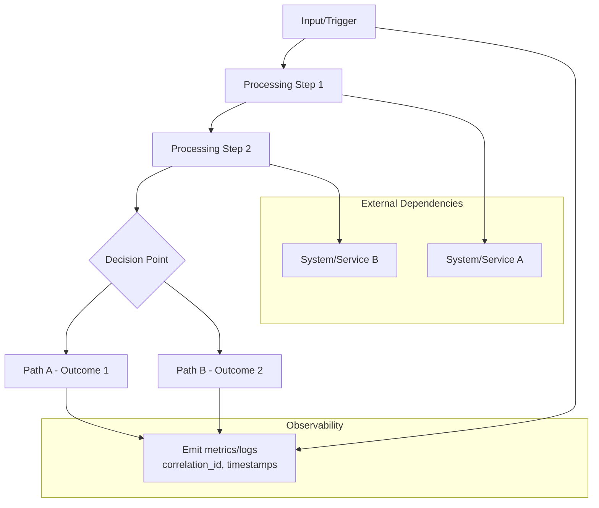

# ADR-NNN: [Architecture Decision Title]

## Position in Development Workflow

**⚠️ CRITICAL**: Always reference [SPEC_DRIVEN_DEVELOPMENT_GUIDE.md](../SPEC_DRIVEN_DEVELOPMENT_GUIDE.md) as the single source of truth for workflow steps, artifact definitions, and quality gates.

ADR is in the **Architecture Layer** within the complete SDD workflow:

**Business Layer** (BRD → PRD → EARS) → **Testing Layer** (BDD) → **Architecture Layer** (ADR → SYS) ← **YOU ARE HERE** → **Requirements Layer** (REQ) → **Project Management Layer** (IMPL) → **Interface Layer** (CTR - optional) → **Implementation Layer** (SPEC) → **Code Generation Layer** (TASKS) → **Execution Layer** (Code → Tests) → **Validation Layer** (Validation → Review → Production)

**Complete Workflow:**
```
BRD (Business Requirements)
  ↓
PRD (Product Requirements)
  ↓
EARS (Formal Requirements - WHEN/THEN format)
  ↓
BDD (Behavior-Driven Tests)
  ↓
ADR (Architecture Decisions) ← YOU ARE HERE
  ↓
SYS (System Requirements)
  ↓
REQ (Atomic Requirements)
  ↓
IMPL (Implementation Plans - WHO/WHEN)
  ↓
CTR (API Contracts - optional, if interface requirement)
  ↓
SPEC (Technical Specifications - YAML)
  ↓
TASKS (Code Generation Plans)
  ↓
Code (Python/TypeScript Implementation)
  ↓
Tests (Unit, Integration, BDD Execution)
  ↓
Validation (Traceability & Quality Gates)
  ↓
Production-Ready Code
```

# PART 1: Decision Context and Requirements

## Status
**Status**: Proposed
**Date**: YYYY-MM-DD
**Decision Makers**: [Team/Person names]
**ADR Author**: [Name]
**Last Updated**: YYYY-MM-DD

## Context

### Problem Statement
[Specific issue requiring architectural resolution - what problem are we solving? 
List of PRD, EARS, BDD files as technical base implementing requirements.
Short description of PRD, EARS, BDD files.]

### Background
[Historical context and existing system state - how did we get here? What current system state drove this need?]

### Driving Forces
[What makes this decision unavoidable now? Business pressures, technical limitations, compliance requirements, etc.]

### Constraints
- **Technical**: Platform, language, infrastructure, performance limitations
- **Business**: Timeline pressure, budget constraints, resource availability
- **Operational**: Deployment, monitoring, maintenance, scaling requirements
- **Regulatory/Compliance**: Legal, security, or industry standards requirements

### Technology Stack Compliance
**Reference**: [ADR-000: Technology Stack](ADR-000_technology_stack.md)

Before proposing new technologies, verify compliance with project-wide technology stack:

**Core Technologies (from ADR-000)**:
- **Agent Framework**: Google ADK, MCP, A2A Protocol
- **Cloud Infrastructure**: GCP (primary), Azure/AWS (multi-cloud)
- **Backend**: Python 3.11+, FastAPI
- **Frontend**: React 18, Next.js 14, TypeScript, TailwindCSS
- **IaC**: Terraform, Flyway, GitHub Actions

**Compliance Check**:
- [ ] Technology aligns with ADR-000 approved stack
- [ ] If proposing new technology: Justification documented below
- [ ] If replacing technology: Migration path and rationale documented

**New Technology Justification** (if applicable):
[If proposing technology not in ADR-000, document:
- Why existing stack cannot meet requirements
- Evaluation against alternatives in ADR-000
- Integration impact and migration plan
- Recommendation to update ADR-000 if adopted]

## Decision

### Chosen Solution
[Concise description of what was selected and why it addresses the problem]

### Key Components
- **Component 1**: [Purpose, role, and key characteristics]
- **Component 2**: [Purpose, role, and key characteristics]
- **Component N**: [Purpose, role, and key characteristics]

### Implementation Approach
[High-level strategy for realization including patterns, technologies, and integration approach]

## Requirements Satisfied

### Primary Requirements

| Requirement ID | Description | How This Decision Satisfies It |
|----------------|-------------|-------------------------------|
| PRD-### | [Brief description] | [Specific mechanism/technique used] |
| **PRD-NNN | [Brief description] | [Specific mechanism/technique used] | * if this ADR satify more then 1 PRD 
| EARS-### | [Brief description] | [Specific mechanism/technique used] |
| **EARS-NNN | [Brief description] | [Specific mechanism/technique used] | * if this ADR satify more then  1 EARS 
| BDD-### | [Brief description] | [Specific mechanism/technique used] |
| **BDD-NNN | [Brief description] | [Specific mechanism/technique used] | * if this ADR satify more then 1 BDD requirements


### Source Business Logic
[References to product strategy, business rules, or domain logic justifying this architectural approach]

### Non-Functional Requirements
[Links to NFRs (performance, security, scalability, reliability) addressed by this decision:
- Performance: [specific metrics/constraints satisfied]
- Security: [security requirements addressed]
- Scalability: [capacity/throughput requirements met]
- Reliability: [uptime/availability requirements satisfied]]

---

# PART 2: Impact Analysis and Architecture

## Consequences

### Positive Outcomes

**Requirements Satisfaction:**
- Satisfies Primary Requirements [PRD-###, PRD-###, etc.] through [specific mechanism/technique]
- Addresses [business need] with [quantifiable benefit]

**Technical Benefits:**
- [Benefit 1]: [Quantifiable advantage with metrics where possible]
- [Benefit 2]: [Quantifiable advantage with metrics where possible]

**Business Benefits:**
- [Business value 1]: [Measurable outcome in business terms]
- [Business value 2]: [Measurable outcome in business terms]

### Negative Outcomes

**Trade-offs:**
- [Trade-off 1]: [What we sacrificed] (addressed by ADR-### or accepted risk)

**Risks:**
- **Risk 1**: [Description] | **Mitigation**: [Strategy] | **Likelihood**: [Low/Medium/High]
- **Risk 2**: [Description] | **Mitigation**: [Strategy] | **Likelihood**: [Low/Medium/High]

**Costs:**
- **Development**: [Estimation in person-hours, complexity assessment]
- **Operational**: [Ongoing cost impact - compute, storage, monitoring]
- **Maintenance**: [Long-term burden - complexity, learning curve, dependencies]

## Architecture Flow



[Describe the flow and key interaction points. Include error paths and monitoring points.]

## Implementation Assessment

### Complexity Evaluation
- **Overall Complexity**: Low/Medium/High
- **Development Effort**: [Estimation with rationale]
- **Testing Complexity**: [Unit, integration, end-to-end requirements]
- **Deployment Complexity**: [Migration, rollback, zero-downtime concerns]

### Dependencies
- **Required Components**: [List with interfaces/contracts needed]
- **External Services**: [APIs, databases, third-party services]
- **Configuration**: [Required settings, secrets, certificates]
- **Infrastructure**: [Compute, network, storage requirements]

### Resources
- **Compute**: [CPU, memory, disk requirements and justification]
- **Network**: [Bandwidth, latency, security requirements]
- **Storage**: [Volume, retention, backup requirements]
- **Cost Estimate**: [Infrastructure and operational cost projections]

### Failure Modes & Recovery
- **Critical Failure Modes**: [What can go wrong and likelihood]
- **Recovery Strategies**: [Detection, mitigation, failover approaches]
- **Data Consistency**: [Impact on data integrity during failures]
- **Service Degradation**: [Graceful degradation strategies]

### Rollback Plan
- **Rollback Triggers**: [Conditions requiring reversion]
- **Rollback Steps**: [Procedural steps for safe rollback]
- **Rollback Impact**: [Downtime, data migration, user impact]
- **Feature Flags**: [Configuration toggles for gradual rollout/rollback]

### Compatibility
- **Backward Compatibility**: [Impact on existing consumers]
- **Forward Compatibility**: [Migration path for dependent systems]
- **Breaking Changes**: [Contract violations and migration requirements]
- **Deprecation Strategy**: [Sunsetting old implementations]

### Monitoring & Observability
- **Success Metrics**: [KPIs measuring decision effectiveness]
- **Error Tracking**: [Failure patterns and alerting thresholds]
- **Performance Metrics**: [Latency, throughput, error rate baselines]
- **Business Metrics**: [User adoption, business outcome tracking]

## Impact Analysis

### Affected Components
- **Direct Impact**: [Components requiring modification]
- **Downstream Systems**: [Services affected by interface changes]
- **Data Flow**: [Information flow changes and new dependencies]
- **Cross-cutting Concerns**: [Security, monitoring, configuration impacts]

### Migration Strategy
- **Phase 1**: [Immediate changes, low risk]
- **Phase 2**: [Major implementation, feature flags]
- **Phase 3**: [Cleanup, optimization, full adoption]

### Testing Requirements
- **Unit Tests**: [Component-level test coverage needed]
- **Integration Tests**: [Cross-component validation]
- **End-to-End Tests**: [Full workflow validation with real dependencies]
- **Performance Tests**: [Load and stress testing requirements]
- **Contract Tests**: [Interface validation and compatibility]

### Operational Costs
- **Runbook Updates**: [Operational procedure changes]
- **Monitoring Setup**: [New dashboards, alerts, metrics]
- **Support Documentation**: [Knowledge base, troubleshooting guides]
- **Training Requirements**: [Team enablement for new architecture]

## Verification

### BDD Scenarios
[List or reference BDD scenarios that validate this architectural approach:

- Scenario: [Brief description] - File: [BDD-NNN.feature#L##]]

### Specification Impact
[Changes required in downstream specifications and contracts]

### Validation Criteria
**Technical Validation:**
- [Measurable technical outcomes and acceptance criteria]
- [Performance benchmarks and service level objectives]
- [Security compliance and vulnerability assessments]

**Business Validation:**
- [Business outcome measures and success metrics]
- [User experience improvements and adoption targets]
- [Revenue/profit impact and ROI measurements]

## Alternatives Considered

### Alternative A: [Descriptive Name]
**Description**: [What approach was considered and key characteristics]

**Pros**:
- [Advantage 1 with quantifiable benefits]
- [Advantage 2 with quantifiable benefits]

**Cons**:
- [Disadvantage 1 with specific concerns]
- [Disadvantage 2 with specific concerns]

**Rejection Reason**: [Specific justification for non-selection tied to requirements/constraints]
**Fit Score**: Poor/Good/Better (relative ranking)

### Alternative B: [Descriptive Name]
**Description**: [What approach was considered and key characteristics]

**Pros**:
- [Advantage 1 with quantifiable benefits]
- [Advantage 2 with quantifiable benefits]

**Cons**:
- [Disadvantage 1 with specific concerns]
- [Disadvantage 2 with specific concerns]

**Rejection Reason**: [Specific justification for non-selection tied to requirements/constraints]
**Fit Score**: Poor/Good/Better (relative ranking)

---

# PART 3: Implementation and Operations

### Alternative C: [Descriptive Name]
**Description**: [Optional - if more than 2 alternatives were seriously considered]
**Pros**: [Advantages identified]
**Cons**: [Disadvantages identified]
**Rejection Reason**: [Specific justification]
**Fit Score**: Poor/Good/Better (relative ranking)

## Security

### Input Validation
- [Schema validation, type enforcement, boundary checks]
- [Malformed payload handling and error responses]

### Authentication & Authorization
- [Access control mechanisms and identity validation]
- [Role-based permissions and privilege escalation prevention]

### Data Protection
- [Encryption at rest and in transit requirements]
- [PII handling, retention policies, and data minimization]

### Security Monitoring
- [Intrusion detection and anomaly alerting]
- [Audit logging requirements and security event tracking]

### Secrets Management
- [Credential handling following ADR-### for secrets management]
- [Key rotation, access control, and compromise response]

### Compliance
- [Regulatory requirements addressed by this architecture]
- [Audit requirements and compliance validation procedures]

## Related Decisions

**Technology Stack**: [ADR-000: Technology Stack](ADR-000_technology_stack.md) - Project-wide approved technologies
**Depends On**: [ADR-### prerequisites and architectural foundations]
**Supersedes**: [ADR-### previous decisions replaced by this one]
**Related**: [ADR-### complementary parallel decisions]
**Impacts**: [ADR-### future decisions affected by this architectural choice]

## Implementation Notes

### Development Phases
1. **Phase 1**: [Immediate implementation steps]
2. **Phase 2**: [Integration and testing]
3. **Phase 3**: [Optimization and hardening]

### Code Locations
- **Primary Implementation**: [Main codebase location]
- **Tests**: [Test file locations]
- **Configuration**: [Config file locations]
- **Documentation**: [Runbooks, API docs, troubleshooting guides]

### Configuration Management
- [Required configuration parameters and validation]
- [Environment-specific overrides and secrets handling]
- [Configuration deployment and rollback procedures]

### Rollback Procedures
[Step-by-step rollback process including:
- Configuration changes to revert
- Database migrations to unwind
- Service deployment rollbacks
- Data cleanup requirements]

### Performance Considerations
- [Performance bottlenecks identified and mitigation strategies]
- [Caching strategies and data consistency trade-offs]
- [Asynchronous processing opportunities]

### Scalability Considerations
- [Horizontal scaling capabilities and limitations]
- [Database connection pooling and resource management]
- [Load balancing and request distribution strategies]

#- [Asynchronous processing opportunities]

---

# PART 4: Traceability and Documentation

## Traceability

### Upstream Sources
- **Business Logic**: [PRD-### - Product requirements driving this decision](../prd/PRD-###.md)
- **EARS Requirements**: [EARS-### - Engineering requirements driving this decision](../ears/EARS-###.md)
- **BDD scenarios**: [BDD-### - Behavior-driven test scenarios](../bdd/BDD-###.feature)

### Downstream Artifacts
- **System Requirements**: [SYS-### - System-level requirements satisfied](../sys/SYS-###.md)
- **Requirements**: [REQ-### - Links to specific requirements this ADR addresses](../reqs/.../REQ-###.md)
- **Specifications**: [SPEC-### - Technical specifications this ADR enables](../specs/.../SPEC-###.yaml)
- **Implementation**: [Code location and key files/classes]

### Document Links
- **Anchors/IDs**: `#ADR-NNN` (internal document reference)
- **Code Path(s)**: [Specific file paths, classes, or modules implementing this decision]
- **Cross-references**: [Related documents and their relationship to this ADR]

### Validation Artifacts
- **Test Results**: [Test run evidence and coverage reports]
- **Performance Benchmarks**: [Before/after performance comparisons]
- **Security Assessments**: [Security audit and penetration test results]

## References

### Internal Links [Reference for chosen documents]
- [PRD-###: Product Requirements](../prd/PRD-###.md)
- [EARS-###: Engineering Requirements](../ears/EARS-###.md)
- [BDD-###: Behavior-Driven Development](../bdd/BDD-###.feature)
- [SYS-###: System Requirements](../sys/SYS-###.md)
- [REQ-###: Related Requirement](../reqs/.../REQ-###.md)
- [SPEC-###: Technical Specification](../specs/.../SPEC-###.yaml)

### External Links
- [Technology Documentation](URL): Reference for chosen technology/solution
- [Research/Articles](URL): Supporting evidence for architectural decision
- [Standards/Compliance](URL): Applicable industry standards or compliance requirements

### Additional Context
- **Related Research**: [Papers, blog posts, or studies informing this decision]
- **Industry Benchmarks**: [Performance/cost comparisons from similar implementations]
- **Lessons Learned**: [Insights from previous similar decisions or implementations]

---

**Template Version**: 1.0
**Last Reviewed**: YYYY-MM-DD
**Next Review**: YYYY-MM-DD (recommend quarterly for active ADRs)
