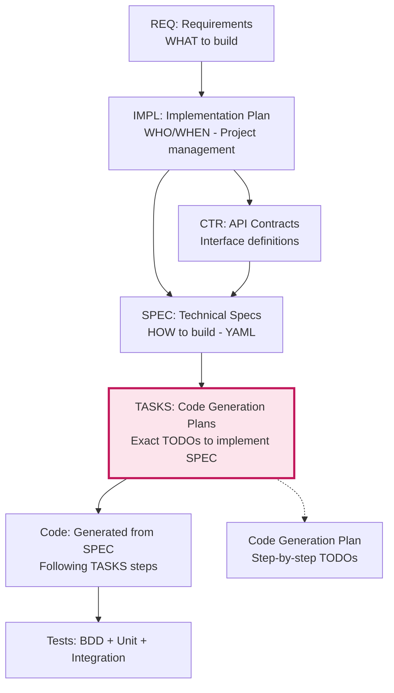

# AI Tasks (TASKS): SPEC Implementation Plans and TODOs

AI Tasks provide **exact implementation plans and TODOs** for generating code from YAML specifications. Tasks serve as precise, AI-friendly instructions that guide code generation from SPEC files with clear steps, constraints, and verification criteria.

## Purpose

Tasks create the **code generation roadmap** that:
- **Guides AI Code Generation**: Provides exact TODOs for implementing YAML SPEC in source code
- **Establishes Implementation Contracts**: Defines code generation scope, constraints, and validation
- **Enables SPEC-to-Code Automation**: Transforms YAML specifications into executable Python/TypeScript code
- **Ensures Quality**: Provides acceptance criteria and verification methods for generated code
- **Maintains Traceability**: Links code implementation to YAML SPEC and upstream requirements

## TASKS vs IMPL Plans

**Critical Distinction**:

| Aspect | IMPL Plans | TASKS Documents |
|--------|-----------|-----------------|
| **Purpose** | Project management (WHO/WHEN) | Code generation plans (exact TODOs) |
| **Scope** | Multi-component systems | Single YAML SPEC implementation |
| **Audience** | Project managers, architects | AI code generators, developers |
| **Content** | Phases, teams, deliverables (CTR/SPEC/TASKS) | Exact steps to implement SPEC in code |
| **Example** | "Phase 1: Build risk management (Week 1-2)" | "Step 3: Generate PositionLimitService class from SPEC-003.yaml line 45-78" |

**Flow**: IMPL Plans organize work → Create SPEC → TASKS plans code generation from SPEC → Code generated

## Position in Development Workflow

Tasks are the **code generation bridge** that connects YAML specifications to executable code:



**Key Points**:
- **REQ**: Business requirements (WHAT to build)
- **IMPL**: Implementation plan (WHO does WHAT, WHEN) - project management
- **CTR**: API contracts (interface definitions)
- **SPEC**: Technical specifications (HOW to build) - YAML with classes, methods, algorithms
- **TASKS**: Code generation plans (exact steps to implement SPEC in source code)
- **Code**: Generated from SPEC using TASKS as implementation guide

## Tasks Document Structure

### Header with Traceability Tags

Comprehensive links establish implementation context:

```markdown
@requirement:[REQ-NNN](../reqs/.../REQ-NNN_...md#REQ-NNN)
@adr:[ADR-NNN](../adrs/ADR-NNN_...md#ADR-NNN)
@prd:[PRD-NNN](../prd/PRD-NNN_...md)
@sys:[SYS-NNN](../sys/SYS-NNN_...md)
@ears:[EARS-NNN](../ears/EARS-NNN_...md)
@spec:[SPEC-NNN](../specs/.../SPEC-NNN_...yaml)

@bdd:[BDD-NNN:scenarios](../bbds/BDD-NNN.feature#scenarios)
```

### Scope Definition
Clearly bounded implementation responsibility:

```markdown
## Scope
[Brief statement of what component/functionality this task implements]

[One sentence describing the specific implementation goal]
```

### Plan (Implementation Steps)
Numbered sequence of development activities:

```markdown
## Plan
1. [Step 1: Description of first implementation activity]
2. [Step 2: Description of second implementation activity]
3. [Step 3: Description of third implementation activity]
[Additional numbered steps as needed]
```

### Constraints
Implementation boundaries and limitations:

```markdown
## Constraints
- [Technical constraint 1: Required patterns, standards, or technologies]
- [Technical constraint 2: Interface compatibility requirements]
- [Development constraint: Scope limitations, exclusions]
- [Quality constraint: Standards or metrics that must be maintained]
```

### Acceptance Criteria
Verification requirements for completed implementation:

```markdown
## Acceptance
- [Verifiable outcome 1 that proves successful implementation]
- [Verifiable outcome 2 that demonstrates compliance with specifications]
- [Verifiable outcome 3 that validates functionality]
- [Integration verification with dependent components]
```

## Task Organization Hierarchy

Tasks map to specific architectural components:

```
ai_tasks/
├── TASKS-001_position_limit_service_tasks.md     # Service component
├── TASKS-002_ib_gateway_integration_tasks.md      # Integration component
├── TASKS-003_alpha_vantage_integration_tasks.md    # API client component
└── TASKS-004_user_interface_implementation_tasks.md # UI component
```

## File Naming Convention

```
TASKS-NNN_descriptive_component_tasks.md
```

Where:
- `TASKS` is the constant prefix indicating AI Task instructions
- `NNN` is the three-digit sequence number (001, 002, 003, etc.)
- `descriptive_component` uses snake_case describing the component being implemented
- `tasks` is the constant suffix indicating implementation tasks
- `.md` is the required file extension

**Examples:**
- `TASKS-001_position_limit_service_tasks.md`
- `TASKS-002_ib_gateway_integration_tasks.md`
- `TASKS-003_alpha_vantage_integration_tasks.md`

## Writing Guidelines

### Task Scope Definition
Define clear boundaries for implementation:

**Good Scope Statement:**
```markdown
## Scope
Implement a minimal `position_limit_service` that validates orders per the spec and contract.
```

**Poor Scope Statement:**
```markdown
## Scope
Build the whole service.
```

### Implementation Plan Structure
Create clear, actionable steps:

**Good Plan:**
```markdown
## Plan
1. Parse config and limits cache module.
2. Implement HTTP handler `POST /v1/risk/limits/validate`.
3. Compute effective position including pending orders.
4. Return structured responses and errors per contract.
5. Add logging with `correlation_id` and key fields.
6. Validate against BDD scenarios and examples.
```

**Poor Plan:**
```markdown
## Plan
1. Write the code.
2. Test it.
3. Deploy it.
```

### Constraints Specification
Explicitly state limitations and requirements:

```markdown
## Constraints
- Follow PEP 8 and snake_case naming.
- Do not change public API; match OpenAPI contract exactly.
- No new runtime dependencies without approval.
- Implement within established architectural patterns.
- Maintain performance targets defined in specifications.
```

### Acceptance Criteria
Define measurable success conditions:

```markdown
## Acceptance
- Given examples in BDD pass.
- Links in REQ/ADR/SPEC remain valid.
- p95 validation latency target (simulated) is respected.
- Code coverage meets 85% minimum requirement.
```

## Task Development Process

### 1. Specification Analysis
Review related artifacts to understand requirements:

```markdown
Analysis Steps:
- Review SPEC-NNN.yaml for interface and behavioral specifications
- Review BDD scenarios for test case coverage requirements
- Review ADR-NNN for architectural constraints and decisions
```

### 2. Component Decomposition
Break implementation into manageable steps:

```markdown
Task Decomposition:
- Identify core feature implementation (3-5 main steps)
- Include integration and testing steps
- Add verification and validation steps
- Account for error handling and edge cases
```

### 3. Constraints Identification
Document all limitations and requirements:

```markdown
Constraint Categories:
- Technical: Language, framework, platform requirements
- Functional: Must/non-functional requirements from specifications
- Quality: Code style, testing, documentation standards
- Integration: Interface compliance, data format requirements
- Operational: Performance, scalability, monitoring needs
```

### 4. Acceptance Criteria Development
Create verifiable success measures:

```markdown
Verification Methods:
- Unit tests pass for implemented functions
- BDD scenarios execute successfully
- Contract validation confirms interface compliance
- Performance benchmarks meet specification targets
- Manual testing validates user-facing functionality
```

## Task Quality Gates

**Every TASK must:**
- Clearly define implementation scope with specific deliverables
- Reference upstream requirements and downstream specifications
- Include sequential, actionable implementation steps
- Specify constraints and limitations for implementation
- Provide measurable acceptance criteria for verification
- Maintain traceability to all related development artifacts

**Task validation checklist:**
- ✅ Scope statement clearly defines what will be implemented
- ✅ Plan contains numbered, actionable implementation steps
- ✅ Constraints section defines required standards and limitations
- ✅ Acceptance criteria are specific and verifiable
- ✅ Cross-reference links resolve to existing artifacts
- ✅ Implementation plan is feasible within given constraints
- ✅ Task scope aligns with component specifications

## Common Task Patterns

### Service Implementation Tasks
```markdown
## Scope
Implement the position limit service with core validation logic.

## Plan
1. Create service skeleton with dependency injection framework.
2. Implement configuration management for risk limits.
3. Build position calculation logic with pending order aggregation.
4. Create validation API endpoints per OpenAPI contract.
5. Integrate circuit breaker protection and error handling.
6. Add comprehensive logging and request correlation.
7. Write unit tests and integration tests.
8. Validate against BDD scenarios and performance benchmarks.

## Constraints
- Use established Python/FastAPI patterns.
- Match contract interface exactly without additions.
- Meet 50ms p95 latency target for validations.
- Implement comprehensive error handling without silent failures.

## Acceptance
- All BDD scenarios pass against implemented service.
- OpenAPI contract validation succeeds for all endpoints.
- Load testing demonstrates required performance characteristics.
- All upstream artifact links remain valid and functional.
```

### Integration Component Tasks
```markdown
## Scope
Build Alpha Vantage API client with rate limiting and normalization.

## Plan
1. Create client module with configuration management.
2. Implement HTTP client with timeout and retry logic.
3. Build token bucket rate limiting for tier management.
4. Create response normalization to internal schema.
5. Add caching layer with TTL-based expiration.
6. Implement circuit breaker for API resilience.
7. Add structured logging with correlation tracking.
8. Validate against contract examples and edge cases.

## Constraints
- Must support both Free and Premium API tiers.
- Response normalization must match trading platform schema.
- No additional dependencies beyond approved libraries.
- Implement graceful degradation when API unavailable.

## Acceptance
- Successfully handles all documented API rate limits.
- Normalized responses match internal data structure schema.
- Circuit breaker protection activates appropriately.
- All external configuration (API keys, endpoints) injected via config.
```

### User Interface Tasks
```markdown
## Scope
Implement trading dashboard with real-time position monitoring.

## Plan
1. Create React component skeleton with TypeScript definitions.
2. Implement WebSocket connection for real-time data feeds.
3. Build position display components with sorting and filtering.
4. Add market data visualization with charting library.
5. Implement order entry forms with validation.
6. Create notification system for alerts and updates.
7. Add responsive design for mobile compatibility.
8. Integrate e2e testing and accessibility validation.

## Constraints
- Follow established UI component library and design system.
- Implement real-time updates without performance degradation.
- Ensure WCAG 2.1 AA accessibility compliance.
- Maintain consistent user experience patterns.

## Acceptance
- All user stories from PRD acceptance criteria satisfied.
- UI components render correctly across supported browsers.
- Real-time data updates work within network constraints.
- Accessibility testing passes WCAG AA requirements.
```

## Task Lifecycle Management

### Task Creation
- Generated from component specifications and requirements analysis
- Reviewed for feasibility and alignment with architecture decisions
- Assigned priority based on dependency and risk analysis

### Task Execution
- Work completed in small, verifiable increments
- Regular check-ins against acceptance criteria
- Continuous integration and testing of implementation
- Documentation of trade-offs and design decisions

### Task Completion
- All acceptance criteria verified and documented
- Code merged with proper review and testing
- Implementation links traceable from specifications
- Tasks archived while maintaining reference links

## Integration with Development Workflow

### AI-Assisted Development
Tasks provide structured input for AI code generation:

- Clear scope prevents scope creep and improves code generation quality
- Sequential plans guide incremental implementation
- Specific constraints ensure compliance with architectural standards
- Measurable acceptance criteria enable automated verification

### Human-AI Collaboration
Tasks establish collaboration patterns:

```markdown
## AI Implementation Guidance
- Step 1 (AI): Generate service skeleton with stubs
- Step 2 (Review): Human review of generated structure
- Step 3 (AI): Implement core business logic
- Step 4 (Testing): Automated test execution and validation
- Step 5 (Review): Final human review and acceptance
```

### Quality Assurance Integration
Tasks drive comprehensive verification:

```markdown
## Verification Integration
- Unit Tests: Validate individual function correctness
- Integration Tests: Verify component interactions
- Contract Tests: Ensure API compliance
- Performance Tests: Validate non-functional requirements
- BDD Tests: Confirm end-to-end behavioral compliance
```

## Task Maintenance and Evolution

### Updating Tasks
Modify tasks as understanding evolves:

```markdown
## Task Updates
**Added Step 4.5**: Security header validation
- **Reason**: New security requirements from updated ADR
- **Impact**: Additional implementation complexity
- **Acceptance**: Extend existing BDD scenarios
```

### Task Dependencies
Track relationships between implementation tasks:

```markdown
## Dependencies
**Blocks**: TASKS-005_database_migration (requires completed service)
**Blocked By**: TASKS-003_authentication_service (required for security)
**Related**: TASKS-006_monitoring_implementation (parallel monitoring setup)
```

### Retrospective Documentation
Capture lessons for future task planning:

```markdown
## Post-Implementation Notes
**Challenges Encountered**: External API latency variability
**Solutions Implemented**: Circuit breaker with adaptive timeout
**Future Recommendations**: Consider local data enrichment
**Total Effort**: 3 days (estimated 2.5, actual 3 due to API complexity)
```

## Benefits of Structured Tasks

1. **Implementation Clarity**: Eliminates ambiguity about what should be built
2. **AI-Friendly Guidance**: Provides structured input for automated development
3. **Quality Assurance**: Begins with acceptance criteria for verification
4. **Dependency Management**: Clear task relationships support parallel work
5. **Progress Tracking**: Measurable outcomes enable project progress monitoring

## Avoiding Common Task Pitfalls

1. **Unclear Scope**: Ambiguous definitions leading to different interpretations
   - Solution: Include concrete examples and exclusion lists

2. **Vague Steps**: High-level plans that don't guide actual implementation
   - Solution: Write implementation steps as specific coding tasks

3. **Missing Constraints**: Implementation without architectural boundaries
   - Solution: Document all technical, functional, and operational limitations

4. **Unverifiable Acceptance**: Ambiguous success criteria
   - Solution: Write acceptance criteria as testable assertions with clear pass/fail conditions

5. **Inadequate Verification**: Planning without integration testing
   - Solution: Include BDD scenario validation and contract testing requirements

## Tooling and Automation

### Task Validation Scripts
```bash
# Validate task format and links
python validate_tasks.py --directory ai_tasks/

# Check task completeness
python check_task_coverage.py --task-file ai_tasks/TASKS-001_*.md

# Generate implementation reports
python generate_task_reports.py --tasks ai_tasks/TASKS-*.md --format html
```

### Progress Tracking
```bash
# Update task status
python update_task_status.py --task TASKS-001 --status completed

# Generate dependency graphs
python show_task_dependencies.py --output dependencies.png
```

### Code Generation Integration
```bash
# Generate implementation from task
ai-codegen --task ai_tasks/TASKS-001_position_limit_service_tasks.md --framework fastapi

# Validate generated code against contracts
```

## Example Task Template

See `TASKS-001_position_limit_service_tasks.md` for a complete example of a well-structured tasks document that includes scope definition, implementation plan, constraints, acceptance criteria, and comprehensive traceability.

## Task Maturity Model

### Level 1 - Basic Tasks
- Simple, unstructured implementation notes
- Vague scope and acceptance criteria
- Manual verification methods
- Limited traceability to requirements

### Level 2 - Structured Tasks
- Clear scope and numbered implementation steps
- Defined constraints and acceptance criteria
- Basic verification and testing plans
- Minimal traceability to specifications

### Level 3 - Comprehensive Tasks
- Detailed implementation plans with dependencies
- Complete constraints and operational requirements
- Automated verification and quality gates
- Full traceability to all development artifacts

### Level 4 - AI-Driven Tasks
- Specification-derived task generation
- Real-time verification and feedback
- Adaptive planning based on implementation progress
- Automated dependency and risk analysis
