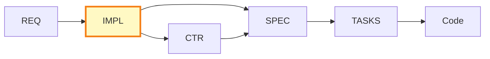

# IMPL-000: Implementation Plans Master Index

## Purpose

This document serves as the master index for all Implementation Plans (IMPL) in the project. Use this index to:

- **Discover** existing implementation plans
- **Track** project status across multiple features
- **Coordinate** work between teams
- **Reference** deliverables and their status

## Position in Development Workflow



## Implementation Plans Index

| IMPL ID | Title | Status | Related REQs | Deliverables | Timeline | Owner | Last Updated |
|---------|-------|--------|--------------|--------------|----------|-------|--------------|
| [IMPL_IMPLEMENTATION_PLAN](./IMPL_IMPLEMENTATION_PLAN.md) | Create impl_plans/ System | In Progress | N/A | impl_plans/ folder, templates | 4-5 hours | Documentation Team | 2025-11-02 |
| [IMPL-001](./examples/IMPL-001_risk_management_system.md) | Risk Management System | Planned | REQ-003, REQ-005, REQ-008 | CTR-003, SPEC-003, TASKS-003, CTR-005, SPEC-005, TASKS-005, CTR-008, SPEC-008, TASKS-008 | 3 sprints (6 weeks) | Agent Team | 2025-11-02 |

## Status Definitions

| Status | Meaning | Description |
|--------|---------|-------------|
| **Planned** | Not started | IMPL Plan created, waiting to begin |
| **In Progress** | Active work | Currently implementing phases |
| **On Hold** | Temporarily paused | Blocked or deprioritized |
| **Completed** | Finished | All deliverables created and validated |
| **Cancelled** | Abandoned | Work stopped, requirements changed |

## Adding New Implementation Plans

When creating a new IMPL Plan:

1. **Copy Template**:
   ```bash
   cp docs_templates/ai_dev_flow/impl_plans/IMPL-TEMPLATE.md \
      docs_templates/ai_dev_flow/impl_plans/IMPL-NNN_feature_name.md
   ```

2. **Assign IMPL ID**: Use next sequential number (IMPL-002, IMPL-003, ...)

3. **Update This Index**: Add new row to table above with:
   - IMPL ID and link to file
   - Title (brief feature description)
   - Status (Planned initially)
   - Related REQ-IDs
   - Deliverables (CTR/SPEC/TASKS to be created)
   - Timeline estimate
   - Owner (team or person)
   - Last Updated date

4. **Create Cross-References**: Update related REQ documents to reference new IMPL

## Index by Status

### Planned
- IMPL-001: Risk Management System

### In Progress
- IMPL_IMPLEMENTATION_PLAN: Create impl_plans/ System

### On Hold
- None

### Completed
- None

### Cancelled
- None

## Index by Team/Owner

| Team/Owner | IMPL Plans | Count |
|------------|-----------|-------|
| Documentation Team | IMPL_IMPLEMENTATION_PLAN | 1 |
| Agent Team | IMPL-001 | 1 |

## Index by Timeline

| Timeline | IMPL Plans |
|----------|-----------|
| < 1 week | IMPL_IMPLEMENTATION_PLAN (4-5 hours) |
| 1-4 weeks | - |
| 1-3 months | IMPL-001 (6 weeks) |
| > 3 months | - |

## Deliverables Summary

### CTR Documents to Create
- CTR-003 (IMPL-001)
- CTR-005 (IMPL-001)
- CTR-008 (IMPL-001)

### SPEC Documents to Create
- SPEC-003 (IMPL-001)
- SPEC-005 (IMPL-001)
- SPEC-008 (IMPL-001)

### TASKS Documents to Create
- TASKS-003 (IMPL-001)
- TASKS-005 (IMPL-001)
- TASKS-008 (IMPL-001)

## Related Documents

- **Template**: [IMPL-TEMPLATE.md](./IMPL-TEMPLATE.md) - Use this to create new IMPL Plans
- **README**: [README.md](./README.md) - Learn about IMPL Plans purpose and structure
- **Example**: [IMPL-001](./examples/IMPL-001_risk_management_system.md) - Reference implementation plan

## Maintenance Guidelines

### Updating This Index

**When starting work on an IMPL Plan**:
- Update Status from "Planned" to "In Progress"
- Update Last Updated date

**When completing a phase**:
- Add checkmarks to Deliverables column for created documents
- Update Last Updated date

**When completing an IMPL Plan**:
- Update Status to "Completed"
- Link all created CTR/SPEC/TASKS documents
- Update Last Updated date

**When putting work on hold**:
- Update Status to "On Hold"
- Add reason in Notes column
- Update Last Updated date

### Review Schedule

This index should be reviewed:
- **Daily**: By project managers for status updates
- **Weekly**: By team leads for resource allocation
- **Monthly**: By architects for deliverable tracking

## Quick Statistics

- **Total IMPL Plans**: 2
- **Planned**: 1
- **In Progress**: 1
- **On Hold**: 0
- **Completed**: 0
- **Cancelled**: 0

## Usage Examples

### Finding Implementation Plans for a Requirement

**Question**: "Which IMPL Plans address REQ-003?"

**Answer**: Check "Related REQs" column → IMPL-001 (Risk Management System)

### Checking What's Currently Being Worked On

**Question**: "What's in progress?"

**Answer**: Check "Status" column for "In Progress" → IMPL_IMPLEMENTATION_PLAN

### Identifying Upcoming Deliverables

**Question**: "What CTR documents will be created?"

**Answer**: See "Deliverables Summary" section → CTR-003, CTR-005, CTR-008

---

**Index Version**: 1.0
**Last Updated**: 2025-11-02
**Maintained By**: Documentation Team
**Next Review**: 2025-11-09 (weekly)
