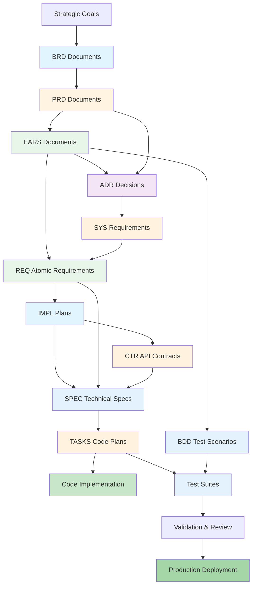

# Complete Traceability Matrix: End-to-End SDD Workflow

## Document Control

| Item | Details |
|------|---------|
| Document ID | TRACEABILITY_MATRIX_COMPLETE |
| Title | Complete End-to-End Traceability Matrix |
| Status | Active |
| Version | 1.0.0 |
| Date Created | YYYY-MM-DD |
| Author | [Team Name] |
| Purpose | Track complete traceability chain: Strategy → BRD → PRD → EARS → BDD → ADR → SYS → REQ → IMPL → CTR → SPEC → TASKS → Code → Production |

## 1. Overview

### 1.1 Complete SDD Workflow

This matrix tracks the complete 10-layer AI-Driven Specification-Driven Development workflow:

**Layer 1 - Business**: BRD → PRD → EARS
**Layer 2 - Testing**: BDD (acceptance criteria)
**Layer 3 - Architecture**: ADR → SYS (technical decisions)
**Layer 4 - Requirements**: REQ (atomic requirements)
**Layer 5 - Project Management**: IMPL (WHO/WHEN)
**Layer 6 - Interface**: CTR (API contracts - optional)
**Layer 7 - Implementation**: SPEC (YAML blueprints)
**Layer 8 - Code Generation**: TASKS (implementation steps)
**Layer 9 - Execution**: Code → Tests
**Layer 10 - Validation**: Validation → Review → Production

### 1.2 Coverage Summary

| Document Type | Total Created | Coverage % | Status |
|---------------|---------------|------------|--------|
| **Business Layer** | | | |
| BRD | [X]/[Y] | XX% | [Status] |
| PRD | [X]/[Y] | XX% | [Status] |
| EARS | [X]/[Y] | XX% | [Status] |
| **Testing Layer** | | | |
| BDD | [X]/[Y] | XX% | [Status] |
| **Architecture Layer** | | | |
| ADR | [X]/[Y] | XX% | [Status] |
| SYS | [X]/[Y] | XX% | [Status] |
| **Requirements Layer** | | | |
| REQ | [X]/[Y] | XX% | [Status] |
| **Project Management Layer** | | | |
| IMPL | [X]/[Y] | XX% | [Status] |
| **Interface Layer** | | | |
| CTR | [X]/[Y] | XX% | [Status] |
| **Implementation Layer** | | | |
| SPEC | [X]/[Y] | XX% | [Status] |
| TASKS | [X]/[Y] | XX% | [Status] |
| **Execution Layer** | | | |
| Code Files | [X]/[Y] | XX% | [Status] |
| Test Files | [X]/[Y] | XX% | [Status] |
| **Total** | **[X]/[Y]** | **XX%** | **[Status]** |

### 1.3 Workflow Completeness Metrics

| Workflow Stage | Expected Documents | Actual Documents | Gap | Status |
|----------------|-------------------|------------------|-----|--------|
| Strategy → Business | [X] BRD/PRD/EARS | [Y] | [Z] | [Status] |
| Business → Testing | [X] BDD | [Y] | [Z] | [Status] |
| Business → Architecture | [X] ADR/SYS | [Y] | [Z] | [Status] |
| Architecture → Requirements | [X] REQ | [Y] | [Z] | [Status] |
| Requirements → Planning | [X] IMPL | [Y] | [Z] | [Status] |
| Planning → Interface | [X] CTR | [Y] | [Z] | [Status] |
| Planning → Implementation | [X] SPEC/TASKS | [Y] | [Z] | [Status] |
| Implementation → Code | [X] Code/Tests | [Y] | [Z] | [Status] |

---

## 2. Complete Workflow Traceability Map

### 2.1 Business Layer Traceability

| Strategy Source | BRD ID | PRD ID | EARS ID | BDD ID | Status |
|-----------------|--------|--------|---------|--------|--------|
| [Strategic Goal 1] | BRD-001 | PRD-001, PRD-002 | EARS-001, EARS-002, EARS-003 | BDD-001, BDD-002 | ✅ Complete |
| [Strategic Goal 2] | BRD-002 | PRD-003 | EARS-004, EARS-005 | BDD-003 | ✅ Complete |
| [Strategic Goal 3] | BRD-003 | PRD-004, PRD-005 | EARS-006 | BDD-004 | 🟡 Partial |
| [Strategic Goal N] | ... | ... | ... | ... | ... |

### 2.2 Architecture Layer Traceability

| BRD ID | PRD ID | EARS ID | ADR ID | SYS ID | REQ IDs | Status |
|--------|--------|---------|--------|--------|---------|--------|
| BRD-001 | PRD-001 | EARS-001 | ADR-001, ADR-005 | SYS-001 | REQ-001, REQ-002, REQ-003 | ✅ Complete |
| BRD-002 | PRD-003 | EARS-004 | ADR-002 | SYS-002 | REQ-004, REQ-005 | ✅ Complete |
| BRD-003 | PRD-004 | EARS-006 | ADR-003 | SYS-003 | REQ-006 | 🟡 Partial |
| ... | ... | ... | ... | ... | ... | ... |

### 2.3 Implementation Layer Traceability

| REQ ID | IMPL ID | CTR ID | SPEC ID | TASKS ID | Code Files | Tests | Status |
|--------|---------|--------|---------|----------|------------|-------|--------|
| REQ-001 | IMPL-001 | CTR-001 | SPEC-001 | TASKS-001 | src/module.py | test_module.py | ✅ Complete |
| REQ-002 | IMPL-001 | N/A | SPEC-002 | TASKS-002 | src/service.py | test_service.py | ✅ Complete |
| REQ-003 | IMPL-002 | CTR-002 | SPEC-003 | TASKS-003 | src/api.py | test_api.py | 🟡 In Progress |
| REQ-004 | IMPL-002 | N/A | SPEC-004 | ⏳ Pending | ⏳ Pending | ⏳ Pending | ⏳ Not Started |
| ... | ... | ... | ... | ... | ... | ... | ... |

### 2.4 Validation Layer Traceability

| BDD ID | EARS ID | Code Files | Test Files | Test Results | Production Status | Status |
|--------|---------|------------|------------|--------------|-------------------|--------|
| BDD-001 | EARS-001 | src/module.py | test_module.py | ✅ Passed (100%) | ✅ Deployed v1.0 | Complete |
| BDD-002 | EARS-002 | src/service.py | test_service.py | ✅ Passed (95%) | ✅ Deployed v1.0 | Complete |
| BDD-003 | EARS-004 | src/api.py | test_api.py | 🟡 Partial (80%) | 🟡 Staging | Testing |
| BDD-004 | EARS-006 | ⏳ Pending | ⏳ Pending | ⏳ Not Tested | ⏳ Not Deployed | Not Started |
| ... | ... | ... | ... | ... | ... | ... |

---

## 3. End-to-End Traceability Examples

### Example 1: Complete Feature Implementation Chain

```
Strategy: [Strategic Document Section X.Y]
   ↓ drives
BRD-009: Broker Integration Business Requirements
   ↓ defines
PRD-016: Trade Execution Product Requirements
   ↓ formalizes
EARS-012: Trade execution formal requirements (WHEN user places order, THE system SHALL execute trade WITHIN 2 seconds)
   ↓ validates
BDD-015: Trade execution acceptance tests (Gherkin scenarios)
   ↓ informs
ADR-033: Trade execution architecture decision (Event-driven architecture for trade processing)
   ↓ defines
SYS-012: Trade execution system requirements (Event bus, order processing service)
   ↓ decomposes
REQ-045: Place limit order atomic requirement
   ↓ plans
IMPL-003: Trade execution implementation plan (Phase 2, Team B, 3 developers, 20 days)
   ↓ specifies
CTR-005: Trade execution API contract (.md + .yaml)
   ↓ implements
SPEC-018: Order placement service specification (YAML blueprint)
   ↓ guides
TASKS-018: Order placement implementation tasks (15 step-by-step TODOs)
   ↓ generates
Code: src/execution/order_service.py (implements CTR-005, 350 LOC)
   ↓ verifies
Tests: tests/test_order_service.py + contract tests (95% coverage)
   ↓ validates
BDD-015: Acceptance tests pass (100% scenarios passing)
   ↓ deploys
Production: Deployed v1.2.0 (YYYY-MM-DD)
```

**Status**: ✅ Complete end-to-end traceability

### Example 2: Partial Implementation Chain (Gap Identification)

```
Strategy: [Market Analysis Report Section 4.3]
   ↓
BRD-015: ML-Based Market Sentiment Analysis
   ↓
PRD-025: Real-time sentiment scoring for option strategies
   ↓
EARS-020: WHEN market data updates, THE system SHALL compute sentiment score WITHIN 500ms
   ↓
BDD-028: Sentiment calculation test scenarios
   ↓
ADR-042: ML model architecture for sentiment analysis
   ↓
SYS-018: Sentiment service system requirements
   ↓
REQ-075: Calculate sentiment score from market data
   ↓
IMPL-008: Phase 3 ML implementation plan
   ↓ [GAP: CTR missing]
⚠️ CTR-NNN: No API contract defined for sentiment service
   ↓
SPEC-032: Sentiment scoring service specification (YAML)
   ↓ [GAP: TASKS missing]
⚠️ TASKS-NNN: No code generation plan created
   ↓ [GAP: Code missing]
⚠️ Code: Implementation not started
   ↓ [GAP: Tests missing]
⚠️ Tests: No tests created
   ↓ [GAP: Validation missing]
⚠️ BDD-028: Acceptance tests not executed
   ↓
Production: ⏳ Not deployed
```

**Status**: 🔴 Incomplete chain with multiple gaps

### Example 3: Interface-Heavy Implementation

```
BRD-012: External data provider integration
   ↓
PRD-020: Alpha Vantage API integration
   ↓
EARS-015: WHEN system requests stock data, THE system SHALL receive response WITHIN 2 seconds
   ↓
BDD-022: API integration test scenarios
   ↓
ADR-038: External API integration architecture
   ↓
REQ-062: Fetch real-time stock quotes from Alpha Vantage
   ↓
IMPL-005: Integration implementation plan (Phase 2, Team C)
   ↓
CTR-003: Alpha Vantage API contract (.md + .yaml)
   ├─ SPEC-025: API client specification (consumer)
   └─ SPEC-026: Data transformation service (processor)
   ↓
TASKS-025: API client implementation tasks
TASKS-026: Data transformation tasks
   ↓
Code: src/integrations/alpha_vantage/
   ├─ client.py (implements CTR-003 consumer)
   ├─ transformer.py (data processing)
   └─ rate_limiter.py (API throttling)
   ↓
Tests:
   ├─ tests/integration/test_alpha_vantage.py
   ├─ tests/contract/test_ctr_003.py
   └─ tests/unit/test_transformer.py
   ↓
BDD-022: Integration tests pass (5/5 scenarios)
   ↓
Production: ✅ Deployed v1.1.0
```

**Status**: ✅ Complete with strong contract-based traceability

---

## 4. Coverage Metrics and Gap Analysis

### 4.1 Document Type Coverage

| Document Type | Expected | Created | Gap | Coverage % | Target % | Status |
|---------------|----------|---------|-----|------------|----------|--------|
| BRD | [X] | [Y] | [Z] | XX% | 100% | [Status] |
| PRD | [X] | [Y] | [Z] | XX% | 100% | [Status] |
| EARS | [X] | [Y] | [Z] | XX% | 100% | [Status] |
| BDD | [X] | [Y] | [Z] | XX% | 100% | [Status] |
| ADR | [X] | [Y] | [Z] | XX% | 100% | [Status] |
| SYS | [X] | [Y] | [Z] | XX% | 100% | [Status] |
| REQ | [X] | [Y] | [Z] | XX% | 100% | [Status] |
| IMPL | [X] | [Y] | [Z] | XX% | 100% | [Status] |
| CTR | [X] | [Y] | [Z] | XX% | 80% | [Status] |
| SPEC | [X] | [Y] | [Z] | XX% | 100% | [Status] |
| TASKS | [X] | [Y] | [Z] | XX% | 100% | [Status] |
| Code | [X] | [Y] | [Z] | XX% | 100% | [Status] |

### 4.2 Traceability Chain Completeness

| Chain Type | Total Chains | Complete | Partial | Broken | Completeness % |
|------------|--------------|----------|---------|--------|----------------|
| Strategy → BRD → PRD | [X] | [Y] | [Z] | [A] | XX% |
| PRD → EARS → BDD | [X] | [Y] | [Z] | [A] | XX% |
| EARS → ADR → SYS → REQ | [X] | [Y] | [Z] | [A] | XX% |
| REQ → IMPL → SPEC → TASKS | [X] | [Y] | [Z] | [A] | XX% |
| SPEC → TASKS → Code → Tests | [X] | [Y] | [Z] | [A] | XX% |
| BDD → Tests → Production | [X] | [Y] | [Z] | [A] | XX% |
| **End-to-End Complete** | **[X]** | **[Y]** | **[Z]** | **[A]** | **XX%** |

### 4.3 Orphaned Documents (No Upstream Traceability)

| Document Type | Orphaned Documents | Impact | Action Required |
|---------------|-------------------|--------|-----------------|
| PRD | [List PRD IDs] | No business justification | Link to BRD or create BRD |
| EARS | [List EARS IDs] | No product context | Link to PRD or validate necessity |
| REQ | [List REQ IDs] | No requirements source | Link to EARS/SYS or deprecate |
| SPEC | [List SPEC IDs] | No requirements basis | Link to REQ or validate purpose |
| Code | [List file paths] | No specification | Create SPEC/TASKS or refactor |

### 4.4 Missing Downstream Artifacts (Incomplete Chains)

| Source Document | Missing Artifact Type | Count | Impact | Priority |
|-----------------|----------------------|-------|--------|----------|
| BRD-XXX | PRD | [X] | Business requirements not translated | High |
| PRD-YYY | EARS | [X] | Features not formalized | High |
| EARS-ZZZ | BDD | [X] | Requirements not testable | Critical |
| REQ-AAA | SPEC | [X] | Requirements not specified | High |
| SPEC-BBB | TASKS | [X] | Specifications not implementable | Medium |
| TASKS-CCC | Code | [X] | Tasks not executed | High |

---

## 5. Complete Dependency Graph

### 5.1 Full Workflow Visualization



### 5.2 Document Type Relationships Matrix

| From ↓ / To → | BRD | PRD | EARS | BDD | ADR | SYS | REQ | IMPL | CTR | SPEC | TASKS | Code |
|---------------|-----|-----|------|-----|-----|-----|-----|------|-----|------|-------|------|
| **Strategy** | ✓ | | | | | | | | | | | |
| **BRD** | | ✓ | ✓ | | ✓ | | | | | | | |
| **PRD** | | | ✓ | ✓ | ✓ | | | | | | | |
| **EARS** | | | | ✓ | ✓ | ✓ | ✓ | | | | | |
| **BDD** | | | | | ✓ | | | | | | | ✓ |
| **ADR** | | | | | | ✓ | ✓ | ✓ | | ✓ | | |
| **SYS** | | | | | | | ✓ | | | ✓ | | |
| **REQ** | | | | | | | | ✓ | ✓ | ✓ | | |
| **IMPL** | | | | | | | | | ✓ | ✓ | ✓ | |
| **CTR** | | | | | | | | | | ✓ | | ✓ |
| **SPEC** | | | | | | | | | | | ✓ | |
| **TASKS** | | | | | | | | | | | | ✓ |

**Legend**: ✓ = Direct traceability relationship exists

---

## 6. Change Impact Analysis Guidelines

### 6.1 Impact Analysis Process

When making changes to any document, use this matrix to identify affected artifacts:

**Step 1: Identify Changed Document**
- Document Type: [BRD/PRD/EARS/etc.]
- Document ID: [DOC-NNN]
- Change Type: [New/Modified/Deprecated]

**Step 2: Analyze Downstream Impact**
```
Changed Document: [DOC-NNN]
   ↓
Direct Downstream (Tier 1):
   - [List immediate downstream documents]
   ↓
Indirect Downstream (Tier 2):
   - [List second-level downstream documents]
   ↓
Final Impact (Tier 3+):
   - [List third-level and beyond]
```

**Step 3: Assess Impact Severity**
| Affected Artifact | Impact Type | Severity | Action Required |
|-------------------|-------------|----------|-----------------|
| [DOC-ID] | [Breaking/Non-Breaking/Informational] | [Critical/High/Medium/Low] | [Specific action] |

### 6.2 Change Impact Examples

**Example: Changing BRD-009 (Business Requirement Change)**
```
BRD-009: Broker Integration Requirements
   ↓ Direct Impact (Tier 1)
   PRD-016: Trade Execution Features (Requires review and potential update)
   ↓ Indirect Impact (Tier 2)
   EARS-012: Formal trade requirements (May need revision)
   BDD-015: Test scenarios (May need new scenarios)
   ADR-033: Architecture decision (May need reconsideration)
   ↓ Cascading Impact (Tier 3)
   SYS-012, REQ-045: System/atomic requirements (Potential updates)
   IMPL-003: Implementation plan (Timeline may change)
   CTR-005, SPEC-018, TASKS-018: Implementation artifacts (Code changes)
   ↓ Final Impact (Tier 4)
   Code: src/execution/order_service.py (Refactoring required)
   Tests: tests/test_order_service.py (Test updates)
   Production: Requires release planning
```

**Impact Assessment**:
- **Severity**: High (affects production code)
- **Affected Teams**: Business, Product, Architecture, Backend Development
- **Estimated Effort**: 40 developer-hours + testing
- **Release Impact**: Requires hotfix or next release cycle

### 6.3 Impact Analysis Checklist

Before making changes, verify:
- [ ] All downstream documents identified
- [ ] Impact severity assessed for each artifact
- [ ] Affected teams notified
- [ ] Timeline and effort estimated
- [ ] Test impact analyzed
- [ ] Production deployment plan created
- [ ] Rollback plan prepared (if breaking change)
- [ ] Documentation updates planned
- [ ] Stakeholder approval obtained

---

## 7. Validation and Quality Gates

### 7.1 Traceability Validation Checklist

**Document Creation Validation**:
- [ ] All new documents linked to upstream sources
- [ ] Document follows naming conventions (TYPE-NNN_slug)
- [ ] Section 7 Traceability complete (upstream + downstream)
- [ ] All referenced documents exist
- [ ] All markdown links include anchors
- [ ] Relative paths correct

**Workflow Completeness Validation**:
- [ ] Business requirements (BRD/PRD/EARS) complete
- [ ] Acceptance criteria (BDD) defined
- [ ] Architecture decisions (ADR) documented
- [ ] Atomic requirements (REQ) specified
- [ ] Implementation plan (IMPL) created
- [ ] Technical specifications (SPEC) written
- [ ] Code generation tasks (TASKS) defined
- [ ] Code implementation complete
- [ ] Tests passing (unit + integration + BDD)
- [ ] Production deployment successful

**Quality Gates by Layer**:
- **Business Layer**: 100% BRD → PRD → EARS linkage
- **Testing Layer**: 100% EARS → BDD coverage
- **Architecture Layer**: 100% ADR → SYS → REQ linkage
- **Requirements Layer**: 100% REQ → SPEC linkage
- **Implementation Layer**: 100% SPEC → TASKS → Code linkage
- **Validation Layer**: 95%+ test coverage, all BDD scenarios passing

### 7.2 Automated Validation Commands

```bash
# Validate complete traceability matrix
python scripts/complete_traceability_matrix.py \
  --validate-all \
  --check-coverage \
  --identify-gaps \
  --report matrix_validation_report.html

# Check broken references across all documents
python scripts/check_broken_references.py \
  --scan-all \
  --fix-relative-paths

# Validate document naming conventions
python scripts/validate_requirement_ids.py \
  --all-types \
  --check-anchors

# Generate coverage report
python scripts/coverage_report.py \
  --output coverage_dashboard.html

# Identify orphaned documents
python scripts/find_orphaned_documents.py \
  --all-types \
  --suggest-links

# Analyze change impact
python scripts/change_impact_analyzer.py \
  --document BRD-009 \
  --depth 4 \
  --output impact_analysis.md
```

### 7.3 Continuous Validation

**Pre-Commit Hooks**:
- Validate document naming conventions
- Check Section 7 Traceability completeness
- Verify all links resolve
- Ensure upstream sources exist

**CI/CD Pipeline Checks**:
- Run traceability validation
- Generate coverage reports
- Check for orphaned documents
- Validate YAML schemas (SPEC, CTR)
- Run BDD acceptance tests

**Scheduled Reviews**:
- Weekly: Review partial chains, identify gaps
- Monthly: Full traceability audit, update matrix
- Quarterly: Architecture review, ADR validation
- Annually: Complete workflow assessment

---

## 8. Revision History

| Version | Date | Changes | Author |
|---------|------|---------|--------|
| 1.0.0 | YYYY-MM-DD | Initial complete traceability matrix creation | [Author Name] |
| 0.9.0 | YYYY-MM-DD | Draft version for stakeholder review | [Author Name] |

---

## 9. References

### Internal Documentation
- **Individual Matrix Templates**:
  - [BRD Matrix](brds/BRD-000_TRACEABILITY_MATRIX-TEMPLATE.md)
  - [PRD Matrix](prd/PRD-000_TRACEABILITY_MATRIX-TEMPLATE.md)
  - [EARS Matrix](ears/EARS-000_TRACEABILITY_MATRIX-TEMPLATE.md)
  - [BDD Matrix](bbds/BDD-000_TRACEABILITY_MATRIX-TEMPLATE.md)
  - [ADR Matrix](adrs/ADR-000_TRACEABILITY_MATRIX-TEMPLATE.md)
  - [SYS Matrix](sys/SYS-000_TRACEABILITY_MATRIX-TEMPLATE.md)
  - [REQ Matrix](reqs/REQ-000_TRACEABILITY_MATRIX-TEMPLATE.md)
  - [IMPL Matrix](impl_plans/IMPL-000_TRACEABILITY_MATRIX-TEMPLATE.md)
  - [CTR Matrix](contracts/CTR-000_TRACEABILITY_MATRIX-TEMPLATE.md)
  - [SPEC Matrix](specs/SPEC-000_TRACEABILITY_MATRIX-TEMPLATE.md)
  - [TASKS Matrix](ai_tasks/TASKS-000_TRACEABILITY_MATRIX-TEMPLATE.md)

- **Workflow Guides**:
  - [SPEC_DRIVEN_DEVELOPMENT_GUIDE.md](SPEC_DRIVEN_DEVELOPMENT_GUIDE.md)
  - [TRACEABILITY.md](TRACEABILITY.md)
  - [index.md - Traceability Flow](index.md#traceability-flow)

### External Standards
- ISO/IEC/IEEE 29148:2018 - Systems and software engineering requirements
- ISO/IEC/IEEE 15288:2023 - Systems engineering life cycle processes
- CMMI for Development - Requirements Development and Management
- Agile Traceability Best Practices

### Traceability Tools
- Python validation scripts in `/scripts/` directory
- Automated matrix generation tools
- CI/CD pipeline integration

---

## 10. Appendix A: Matrix Usage Scenarios

### Scenario 1: New Feature Development
1. **Start**: Strategic goal identified
2. **Create**: BRD → PRD → EARS → BDD
3. **Design**: ADR → SYS → REQ
4. **Plan**: IMPL → CTR (if API) → SPEC → TASKS
5. **Implement**: Code → Tests
6. **Validate**: BDD scenarios → Production
7. **Update Matrix**: Track all artifacts created

### Scenario 2: Production Issue Investigation
1. **Identify**: Issue in production code
2. **Trace Back**: Code → TASKS → SPEC → REQ → EARS → PRD → BRD
3. **Analyze**: Determine if issue is:
   - Implementation bug (Code/TASKS)
   - Specification error (SPEC)
   - Requirements gap (REQ/EARS)
   - Design flaw (ADR/SYS)
   - Business misalignment (BRD/PRD)
4. **Fix**: Update appropriate layer
5. **Impact Analysis**: Use matrix to identify all affected artifacts
6. **Remediate**: Update downstream artifacts
7. **Validate**: Re-run BDD scenarios

### Scenario 3: Requirements Change Request
1. **Change Request**: Update to EARS-012
2. **Impact Analysis**: Use matrix to find:
   - Upstream: Which PRD/BRD drives this requirement?
   - Downstream: Which BDD, REQ, SPEC, Code affected?
3. **Assess**: Determine change scope and effort
4. **Approve**: Stakeholder sign-off on impact
5. **Execute**: Update EARS-012 + all downstream artifacts
6. **Validate**: Run affected BDD scenarios
7. **Update Matrix**: Reflect changes

### Scenario 4: Architecture Decision Update
1. **New ADR**: ADR-050 supersedes ADR-033
2. **Find Affected**:
   - Upstream: Which BRD/PRD/EARS drove ADR-033?
   - Downstream: Which SYS, REQ, SPEC, Code implement ADR-033?
3. **Plan Migration**:
   - Create IMPL for architecture change
   - Update all affected SPEC
   - Generate new TASKS
   - Schedule code refactoring
4. **Execute**: Systematic update of all layers
5. **Validate**: Full regression testing
6. **Update Matrix**: Track superseded ADR

---

## 11. Appendix B: Metrics Dashboard

### 11.1 Overall Health Score

```
Traceability Health Score: [XX]/100

Components:
- Document Coverage: [XX%] (weight: 30%)
- Chain Completeness: [XX%] (weight: 25%)
- Orphaned Documents: [XX%] (weight: 15%)
- Broken Links: [XX%] (weight: 10%)
- Test Coverage: [XX%] (weight: 10%)
- Production Deployment: [XX%] (weight: 10%)
```

### 11.2 Key Performance Indicators

| KPI | Current | Target | Status |
|-----|---------|--------|--------|
| End-to-End Chain Completeness | XX% | 95% | [Status] |
| Upstream Traceability Coverage | XX% | 100% | [Status] |
| Downstream Artifact Coverage | XX% | 95% | [Status] |
| Orphaned Documents | [X] | 0 | [Status] |
| Broken Links | [X] | 0 | [Status] |
| BDD Scenario Pass Rate | XX% | 95% | [Status] |
| Test Coverage (Code) | XX% | 85% | [Status] |
| Production Deployment Success | XX% | 100% | [Status] |

---

**Matrix Status**: ✅ Active and Maintained
**Last Full Validation**: YYYY-MM-DD
**Next Scheduled Update**: YYYY-MM-DD
