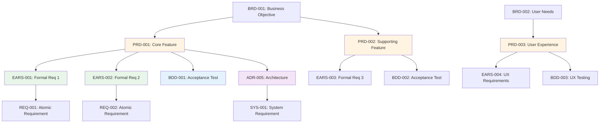

# Traceability Matrix: PRD-001 through PRD-NNN

## Document Control

| Item | Details |
|------|---------|
| Document ID | TRACEABILITY_MATRIX_PRD |
| Title | Comprehensive Product Requirements Traceability Matrix |
| Status | [Active/Draft] |
| Version | 1.0.0 |
| Date Created | YYYY-MM-DD |
| Author | [Team Name] |
| Purpose | Track bidirectional traceability for all Product Requirements Documents |

## 1. Overview

### 1.1 Document Type Description
Product Requirements Documents (PRDs) translate business objectives into concrete product features, user stories, and functional specifications. PRDs define WHAT the product does from a user perspective.

### 1.2 Coverage Scope
This matrix tracks all PRD documents, mapping upstream business requirements (BRDs) to downstream formal requirements (EARS), acceptance tests (BDD), and architecture decisions (ADRs).

### 1.3 Statistics
- **Total PRDs Tracked**: [X] documents
- **Document Status**: [Y] active, [Z] in development
- **Coverage Period**: [Start Date] to [End Date]
- **Last Updated**: YYYY-MM-DD

---

## 2. Complete PRD Inventory

| PRD ID | Title | Feature Category | Status | Date | Upstream Sources | Downstream Artifacts |
|--------|-------|------------------|--------|------|------------------|---------------------|
| PRD-001 | [Product feature title] | [Category] | Active | YYYY-MM-DD | BRD-001, BRD-002 | EARS-001, EARS-002, BDD-001, ADR-005 |
| PRD-002 | [Product feature title] | [Category] | Active | YYYY-MM-DD | BRD-003 | EARS-003, BDD-002 |
| PRD-NNN | ... | ... | ... | ... | ... | ... |

**Document Status Legend**:
- **Active**: Current and actively referenced
- **In Development**: Under active development
- **In Review**: Pending stakeholder approval
- **Superseded**: Replaced by newer version
- **Archived**: Historical reference only

---

## 3. Upstream Traceability

### 3.1 BRD → PRD Traceability

| BRD ID | BRD Title | PRD IDs | PRD Titles | Relationship Description |
|--------|-----------|---------|------------|--------------------------|
| BRD-001 | [Business requirement] | PRD-001, PRD-002 | [Product features] | Business objectives drive feature definitions |
| BRD-002 | [Business requirement] | PRD-003 | [Product feature] | Stakeholder needs translated to product specs |
| BRD-NNN | ... | ... | ... | ... |

### 3.2 Market Research → PRD Traceability

| Research Source | Research Finding | PRD IDs | Feature Impact |
|-----------------|------------------|---------|----------------|
| User Research [Date] | [Key insight] | PRD-001, PRD-004 | Feature prioritization based on user needs |
| Competitive Analysis | [Market gap identified] | PRD-002 | Differentiation feature requirements |
| [Source Type] | ... | ... | ... |

### 3.3 Upstream Source Summary

| Source Category | Total Sources | PRDs Derived | Coverage % |
|-----------------|---------------|--------------|------------|
| BRD | [X] | [Y] PRDs | XX% |
| User Research | [X] | [Y] PRDs | XX% |
| Competitive Analysis | [X] | [Y] PRDs | XX% |
| Technical Feasibility | [X] | [Y] PRDs | XX% |

---

## 4. Downstream Traceability

### 4.1 PRD → EARS Traceability

| PRD ID | PRD Title | EARS IDs | EARS Titles | Relationship |
|--------|-----------|----------|-------------|--------------|
| PRD-001 | [Product feature] | EARS-001, EARS-002, EARS-003 | [Formal requirements] | Product features formalized as EARS statements |
| PRD-002 | [Product feature] | EARS-004 | [Formal requirement] | User story converted to formal requirement |
| PRD-NNN | ... | ... | ... | ... |

### 4.2 PRD → BDD Traceability

| PRD ID | PRD Title | BDD IDs | BDD Titles | Relationship |
|--------|-----------|---------|------------|--------------|
| PRD-001 | [Product feature] | BDD-001, BDD-002 | [Test scenarios] | Acceptance criteria defined in BDD scenarios |
| PRD-002 | [Product feature] | BDD-003 | [Test scenario] | User story validation through BDD |
| PRD-NNN | ... | ... | ... | ... |

### 4.3 PRD → ADR Traceability

| PRD ID | PRD Title | ADR IDs | ADR Titles | Relationship |
|--------|-----------|---------|------------|--------------|
| PRD-001 | [Product feature requiring architectural decision] | ADR-005, ADR-012 | [Architecture decisions] | Product requirements drive technical decisions |
| PRD-NNN | ... | ... | ... | ... |

### 4.4 PRD → REQ Traceability (Direct)

| PRD ID | PRD Title | REQ IDs | REQ Titles | Relationship |
|--------|-----------|---------|------------|--------------|
| PRD-001 | [Product feature] | REQ-010, REQ-011 | [Atomic requirements] | Feature decomposed into atomic requirements |
| PRD-NNN | ... | ... | ... | ... |

### 4.5 Downstream Artifact Summary

| Artifact Type | Total Artifacts | PRDs Traced | Coverage % |
|---------------|-----------------|-------------|------------|
| EARS | [X] | [Y] PRDs | XX% |
| BDD | [X] | [Y] PRDs | XX% |
| ADR | [X] | [Y] PRDs | XX% |
| REQ | [X] | [Y] PRDs | XX% |
| SPEC | [X] | [Y] PRDs | XX% |

---

## 5. Cross-PRD Dependencies

### 5.1 PRD Relationship Map



### 5.2 Inter-PRD Dependencies

| Source PRD | Target PRD | Dependency Type | Description |
|------------|------------|-----------------|-------------|
| PRD-001 | PRD-005 | Prerequisite | Core authentication must exist before advanced features |
| PRD-002 | PRD-003 | Related | User profile management supports personalization |
| PRD-NNN | ... | ... | ... |

---

## 6. Feature Category Summary

### 6.1 PRDs by Feature Category

| Feature Category | PRD IDs | Total | Description |
|------------------|---------|-------|-------------|
| [Core Platform] | PRD-001, PRD-002, PRD-003 | 3 | Foundation platform capabilities |
| [User Experience] | PRD-004, PRD-005 | 2 | User-facing workflows and interfaces |
| [Integration] | PRD-006, PRD-007 | 2 | External system connections |
| [Analytics] | PRD-008 | 1 | Reporting and insights |
| [Security] | PRD-009, PRD-010 | 2 | Authentication, authorization, data protection |

### 6.2 User Persona Alignment

| User Persona | Related PRDs | Primary Needs | Satisfaction Score |
|--------------|--------------|---------------|-------------------|
| [Persona 1: End User] | PRD-001, PRD-004, PRD-005 | Ease of use, performance | 8/10 |
| [Persona 2: Administrator] | PRD-002, PRD-009 | Control, visibility | 7/10 |
| [Persona 3: Developer] | PRD-006, PRD-007 | Integration, APIs | 9/10 |

---

## 7. User Story and Acceptance Criteria Summary

### 7.1 User Story Distribution

| PRD ID | Total User Stories | Completed Stories | Completion % |
|--------|-------------------|-------------------|--------------|
| PRD-001 | [X] | [Y] | XX% |
| PRD-002 | [X] | [Y] | XX% |
| PRD-NNN | ... | ... | ... |
| **Total** | **[X]** | **[Y]** | **XX%** |

### 7.2 Acceptance Criteria Coverage

| PRD ID | User Stories | BDD Scenarios | AC Coverage % | Status |
|--------|--------------|---------------|---------------|--------|
| PRD-001 | 5 | 8 | 100% | ✅ Complete |
| PRD-002 | 3 | 5 | 100% | ✅ Complete |
| PRD-003 | 4 | 2 | 50% | 🟡 Incomplete |
| PRD-NNN | ... | ... | ... | ... |

---

## 8. Implementation Status

### 8.1 Artifact Creation Coverage

| Artifact Type | Required | Created | Pending | Coverage % |
|---------------|----------|---------|---------|------------|
| EARS | [X] | [Y] | [Z] | XX% |
| BDD | [X] | [Y] | [Z] | XX% |
| ADR | [X] | [Y] | [Z] | XX% |
| REQ | [X] | [Y] | [Z] | XX% |
| SPEC | [X] | [Y] | [Z] | XX% |
| **Total** | **[X]** | **[Y]** | **[Z]** | **XX%** |

### 8.2 PRD Implementation Status

| PRD ID | EARS Status | BDD Status | ADR Status | REQ Status | Overall Status | Completion % |
|--------|-------------|------------|------------|------------|----------------|--------------|
| PRD-001 | ✅ Complete | ✅ Complete | ✅ Complete | ✅ Complete | Complete | 100% |
| PRD-002 | ✅ Complete | 🟡 In Progress | N/A | 🟡 In Progress | In Progress | 60% |
| PRD-003 | 🟡 In Progress | ⏳ Pending | ⏳ Pending | ⏳ Pending | Started | 25% |
| PRD-NNN | ... | ... | ... | ... | ... | ... |

**Status Legend**:
- ✅ Complete: Artifact created and validated
- 🟡 In Progress: Artifact under development
- ⏳ Pending: Artifact not yet started
- N/A: Not applicable for this PRD
- ❌ Blocked: Artifact creation blocked by dependencies

### 8.3 Gap Analysis

**Missing Downstream Artifacts**:
- PRD-XXX: Missing EARS formalization (feature not formalized)
- PRD-YYY: Missing BDD scenarios (no acceptance tests)
- PRD-ZZZ: Missing REQ decomposition (not broken into atomic requirements)

**Orphaned Documents** (downstream artifacts with no PRD source):
- EARS-XXX: Formal requirement with no product feature
- BDD-YYY: Test scenario with no user story
- REQ-ZZZ: Atomic requirement with no feature context

---

## 9. Immediate Next Steps

### 9.1 Priority Actions

1. **Complete Missing EARS Mappings**: [X] PRDs require EARS formalization
2. **Create BDD Scenarios**: [Y] PRDs need acceptance tests
3. **Decompose into Atomic Requirements**: [Z] PRDs need REQ breakdown
4. **Architecture Decision Documentation**: [N] PRDs require ADR analysis

### 9.2 Upcoming Release Milestones

| Release | Target Date | Required PRDs | Status | Completion % |
|---------|-------------|---------------|--------|--------------|
| [Release 1.0: MVP] | YYYY-MM-DD | PRD-001 through PRD-005 | On Track | 85% |
| [Release 1.1: Feature Pack] | YYYY-MM-DD | PRD-006 through PRD-010 | Planning | 30% |
| [Release 2.0: Major Update] | YYYY-MM-DD | All PRDs | Not Started | 0% |

### 9.3 Quality Improvement Recommendations

- **Traceability Coverage**: Achieve 100% PRD → EARS → BDD coverage
- **User Story Validation**: Ensure all user stories have BDD scenarios
- **Architecture Review**: Document ADRs for all technical decisions
- **Acceptance Criteria**: Complete BDD scenario coverage for all PRDs
- **Stakeholder Review**: Schedule feature validation with product owners

---

## 10. Revision History

| Version | Date | Changes | Author |
|---------|------|---------|--------|
| 1.0.0 | YYYY-MM-DD | Initial traceability matrix creation | [Author Name] |
| 0.9.0 | YYYY-MM-DD | Draft version for review | [Author Name] |

---

## 11. References

### Internal Documentation
- **PRD Index**: [PRD-000_index.md](PRD-000_index.md)
- **PRD Template**: [PRD-TEMPLATE.md](PRD-TEMPLATE.md)
- **Complete Traceability Matrix**: [../TRACEABILITY_MATRIX_COMPLETE-TEMPLATE.md](../TRACEABILITY_MATRIX_COMPLETE-TEMPLATE.md)
- **Traceability Standards**: [../TRACEABILITY.md](../TRACEABILITY.md)
- **SDD Workflow Guide**: [../SPEC_DRIVEN_DEVELOPMENT_GUIDE.md](../SPEC_DRIVEN_DEVELOPMENT_GUIDE.md)

### External Standards
- ISO/IEC/IEEE 29148:2018 - Systems and software engineering requirements
- SAFe Product Requirements Documentation Standards
- Agile Alliance User Story Best Practices

### Related Matrices
- [BRD Traceability Matrix](../brds/BRD-000_TRACEABILITY_MATRIX-TEMPLATE.md)
- [EARS Traceability Matrix](../ears/EARS-000_TRACEABILITY_MATRIX-TEMPLATE.md)
- [BDD Traceability Matrix](../bbds/BDD-000_TRACEABILITY_MATRIX-TEMPLATE.md)
- [ADR Traceability Matrix](../adrs/ADR-000_TRACEABILITY_MATRIX-TEMPLATE.md)

---

## Appendix A: Matrix Maintenance Guidelines

### When to Update This Matrix
1. **After Creating/Updating PRDs**: Add new entries within 1 business day
2. **Sprint Planning**: Review PRD coverage before sprint commitments
3. **Release Preparation**: Full validation of traceability chain
4. **Feature Prioritization**: Ensure alignment with business requirements

### Automated Generation
```bash
# Generate matrix from PRD directory
python ../scripts/generate_traceability_matrix.py \
  --type PRD \
  --input ../prd/ \
  --template PRD-000_TRACEABILITY_MATRIX-TEMPLATE.md \
  --output TRACEABILITY_MATRIX_PRD.md

# Validate matrix
python ../scripts/validate_traceability_matrix.py \
  --matrix TRACEABILITY_MATRIX_PRD.md \
  --strict

# Update incrementally
python ../scripts/update_traceability_matrix.py \
  --matrix TRACEABILITY_MATRIX_PRD.md \
  --preserve-annotations
```

### Quality Checklist
- [ ] All PRD documents included in inventory
- [ ] Upstream BRD sources documented for each PRD
- [ ] Downstream artifacts mapped (EARS, BDD, ADR, REQ)
- [ ] Cross-PRD dependencies identified
- [ ] Feature category classification complete
- [ ] User persona alignment documented
- [ ] User story and acceptance criteria coverage tracked
- [ ] Implementation status current (within 1 week)
- [ ] Gap analysis identifies missing artifacts
- [ ] All hyperlinks resolve correctly
- [ ] Mermaid diagrams render without errors
- [ ] Coverage metrics mathematically correct
- [ ] Revision history updated
