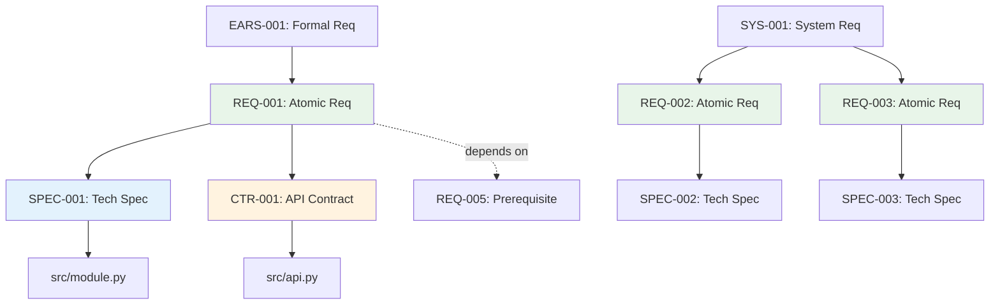

# Traceability Matrix: REQ-001 through REQ-NNN

## Document Control

| Item | Details |
|------|---------|
| Document ID | TRACEABILITY_MATRIX_REQ |
| Title | Comprehensive Atomic Requirements Traceability Matrix |
| Status | [Active/Draft] |
| Version | 1.0.0 |
| Date Created | YYYY-MM-DD |
| Author | [Team Name] |
| Purpose | Track bidirectional traceability for all Atomic Requirements Documents |

## 1. Overview

### 1.1 Document Type Description
Atomic Requirements Documents (REQ) define single, testable, implementation-ready requirements. REQ documents are the bridge between formal requirements (EARS/SYS) and technical specifications (SPEC/Code).

### 1.2 Coverage Scope
This matrix tracks all REQ documents across all requirement domains, mapping upstream requirements to downstream specifications, contracts, and code implementations.

### 1.3 Statistics
- **Total REQ Tracked**: [X] documents
- **Requirement Domains**: [Y] domains
- **Coverage Period**: [Start Date] to [End Date]
- **Last Updated**: YYYY-MM-DD

---

## 2. Complete REQ Inventory

| REQ ID | Title | Domain | Priority | Status | Date | Upstream Sources | Downstream Artifacts |
|--------|-------|--------|----------|--------|------|------------------|---------------------|
| REQ-001 | [Atomic requirement title] | [Domain] | Must | Active | YYYY-MM-DD | EARS-001, SYS-001 | SPEC-001, Code: module.py |
| REQ-002 | [Atomic requirement title] | [Domain] | Should | Active | YYYY-MM-DD | EARS-002, ADR-001 | SPEC-002, CTR-001 |
| REQ-NNN | ... | ... | ... | ... | ... | ... | ... |

**Priority Legend**: Must, Should, Could, Won't (MoSCoW)

---

## 3. Upstream Traceability

### 3.1 EARS → REQ Traceability

| EARS ID | EARS Title | REQ IDs | REQ Titles | Relationship |
|---------|------------|---------|------------|--------------|
| EARS-001 | [Formal requirement] | REQ-001, REQ-002 | [Atomic requirements] | EARS decomposed into atomic implementation requirements |
| EARS-NNN | ... | ... | ... | ... |

### 3.2 SYS → REQ Traceability

| SYS ID | SYS Title | REQ IDs | REQ Titles | Relationship |
|--------|-----------|---------|------------|--------------|
| SYS-001 | [System requirement] | REQ-003, REQ-004, REQ-005 | [Atomic requirements] | System requirements broken down to atomic level |
| SYS-NNN | ... | ... | ... | ... |

### 3.3 ADR → REQ Traceability

| ADR ID | ADR Title | REQ IDs | REQ Titles | Relationship |
|--------|-----------|---------|------------|--------------|
| ADR-001 | [Architecture decision] | REQ-006 | [Atomic requirement] | Architectural decisions necessitate specific requirements |
| ADR-NNN | ... | ... | ... | ... |

---

## 4. Downstream Traceability

### 4.1 REQ → IMPL Traceability

| REQ ID | REQ Title | IMPL IDs | IMPL Titles | Relationship |
|--------|-----------|----------|-------------|--------------|
| REQ-001 | [Atomic requirement] | IMPL-001 | [Implementation plan] | Requirement included in implementation plan |
| REQ-NNN | ... | ... | ... | ... |

### 4.2 REQ → CTR Traceability

| REQ ID | REQ Title | CTR IDs | CTR Titles | Relationship |
|--------|-----------|---------|------------|--------------|
| REQ-001 | [API interface requirement] | CTR-001 | [API contract] | Requirement defines API contract |
| REQ-NNN | ... | ... | ... | ... |

### 4.3 REQ → SPEC Traceability

| REQ ID | REQ Title | SPEC IDs | SPEC Titles | Relationship |
|--------|-----------|----------|-------------|--------------|
| REQ-001 | [Atomic requirement] | SPEC-001 | [Technical specification] | Requirement implemented in specification |
| REQ-NNN | ... | ... | ... | ... |

### 4.4 REQ → Code Traceability

| REQ ID | REQ Title | Code Files | Functions/Classes | Relationship |
|--------|-----------|------------|-------------------|--------------|
| REQ-001 | [Atomic requirement] | src/module.py | FeatureClass.method() | Direct implementation |
| REQ-NNN | ... | ... | ... | ... |

---

## 5. Requirement Domains

### 5.1 REQ by Domain

| Domain | REQ IDs | Total | Must | Should | Could | Status |
|--------|---------|-------|------|--------|-------|--------|
| [api/] | REQ-001, REQ-002, REQ-003 | 3 | 2 | 1 | 0 | [Status] |
| [auth/] | REQ-004, REQ-005 | 2 | 2 | 0 | 0 | [Status] |
| [data/] | REQ-006, REQ-007 | 2 | 1 | 1 | 0 | [Status] |
| [risk/lim/] | REQ-008, REQ-009 | 2 | 2 | 0 | 0 | [Status] |

### 5.2 Priority Distribution

| Priority | Count | Percentage | Implemented | Pending |
|----------|-------|------------|-------------|---------|
| Must | [X] | XX% | [Y] | [Z] |
| Should | [X] | XX% | [Y] | [Z] |
| Could | [X] | XX% | [Y] | [Z] |
| Won't | [X] | XX% | [Y] | [Z] |

---

## 6. Cross-REQ Dependencies



### 6.1 Inter-REQ Dependencies

| Source REQ | Target REQ | Dependency Type | Description |
|------------|------------|-----------------|-------------|
| REQ-001 | REQ-005 | Prerequisite | Authentication required before authorization |
| REQ-002 | REQ-003 | Related | Data validation supports data processing |
| REQ-NNN | ... | ... | ... |

---

## 7. Verification and Acceptance

### 7.1 REQ Verification Status

| REQ ID | Verification Method | BDD Scenarios | Code Tests | Verified | Status |
|--------|---------------------|---------------|------------|----------|--------|
| REQ-001 | BDD + Unit Tests | BDD-001 | test_module.py | Yes | ✅ |
| REQ-002 | Integration Tests | BDD-002 | test_integration.py | Yes | ✅ |
| REQ-003 | Unit Tests | N/A | test_feature.py | No | 🟡 |
| REQ-NNN | ... | ... | ... | ... | ... |

### 7.2 Acceptance Criteria Coverage

| REQ ID | Total Criteria | Verified | Coverage % | Status |
|--------|----------------|----------|------------|--------|
| REQ-001 | 5 | 5 | 100% | ✅ Complete |
| REQ-002 | 3 | 2 | 67% | 🟡 Partial |
| REQ-003 | 4 | 0 | 0% | ⏳ Pending |
| REQ-NNN | ... | ... | ... | ... |

---

## 8. Implementation Status

### 8.1 REQ Implementation Progress

| REQ ID | IMPL Status | CTR Status | SPEC Status | Code Status | Overall | Completion % |
|--------|-------------|------------|-------------|-------------|---------|--------------|
| REQ-001 | ✅ | ✅ | ✅ | ✅ | Complete | 100% |
| REQ-002 | ✅ | N/A | 🟡 | 🟡 | In Progress | 60% |
| REQ-003 | 🟡 | N/A | ⏳ | ⏳ | Started | 25% |
| REQ-NNN | ... | ... | ... | ... | ... | ... |

### 8.2 Gap Analysis

**Missing Downstream Artifacts**:
- REQ-XXX: Missing SPEC (requirement not specified)
- REQ-YYY: Missing Code (requirement not implemented)
- REQ-ZZZ: Missing Tests (requirement not verified)

**Orphaned Artifacts**:
- SPEC-XXX: Specification with no REQ traceability
- Code File: src/orphan.py with no REQ linkage

---

## 9. Immediate Next Steps

### 9.1 Priority Actions
1. **Complete Missing SPEC Documents**: [X] REQ documents need specifications
2. **Implement Pending Code**: [Y] REQ documents need code implementation
3. **Verify Acceptance Criteria**: [Z] REQ documents need verification

---

## 10. Revision History

| Version | Date | Changes | Author |
|---------|------|---------|--------|
| 1.0.0 | YYYY-MM-DD | Initial creation | [Author Name] |

---

## 11. References

- **REQ Index**: [REQ-000_index.md](REQ-000_index.md)
- **REQ Template**: [REQ-TEMPLATE.md](REQ-TEMPLATE.md)
- **Complete Traceability Matrix**: [../TRACEABILITY_MATRIX_COMPLETE-TEMPLATE.md](../TRACEABILITY_MATRIX_COMPLETE-TEMPLATE.md)
- **Related Matrices**: [EARS](../ears/EARS-000_TRACEABILITY_MATRIX-TEMPLATE.md), [SPEC](../specs/SPEC-000_TRACEABILITY_MATRIX-TEMPLATE.md), [CTR](../contracts/CTR-000_TRACEABILITY_MATRIX-TEMPLATE.md)

---

## Appendix A: Matrix Maintenance

### Automated Generation
```bash
python ../scripts/generate_traceability_matrix.py \
  --type REQ \
  --input ../reqs/ \
  --template REQ-000_TRACEABILITY_MATRIX-TEMPLATE.md \
  --output TRACEABILITY_MATRIX_REQ.md
```
