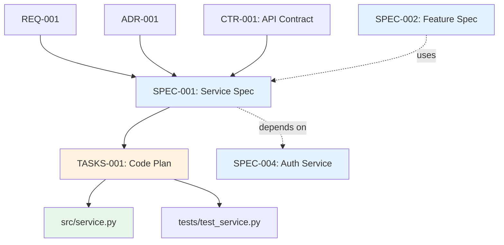

# Traceability Matrix: SPEC-001 through SPEC-NNN

## Document Control

| Item | Details |
|------|---------|
| Document ID | TRACEABILITY_MATRIX_SPEC |
| Title | Comprehensive Technical Specifications Traceability Matrix |
| Status | [Active/Draft] |
| Version | 1.0.0 |
| Date Created | YYYY-MM-DD |
| Author | [Team Name] |
| Purpose | Track bidirectional traceability for all Technical Specification Documents (YAML format) |

## 1. Overview

### 1.1 Document Type Description
Technical Specification Documents (SPEC) define HOW to implement requirements using YAML format. SPEC documents provide AI-optimized implementation blueprints including interfaces, algorithms, patterns, performance targets, and observability.

### 1.2 Coverage Scope
This matrix tracks all SPEC documents, mapping upstream requirements/contracts to downstream code generation tasks and implementations.

### 1.3 Statistics
- **Total SPEC Tracked**: [X] documents
- **Total Components**: [Y] services/agents/infrastructure
- **Coverage Period**: [Start Date] to [End Date]
- **Last Updated**: YYYY-MM-DD

---

## 2. Complete SPEC Inventory

| SPEC ID | Title | Spec Type | Status | Date | Upstream Sources | Downstream Artifacts |
|---------|-------|-----------|--------|------|------------------|---------------------|
| SPEC-001 | [Technical specification title] | Service | Active | YYYY-MM-DD | REQ-001, ADR-001, CTR-001 | TASKS-001, Code: src/service.py |
| SPEC-002 | [Technical specification title] | Agent | Active | YYYY-MM-DD | REQ-002, ADR-002 | TASKS-002, Code: src/agent.py |
| SPEC-NNN | ... | ... | ... | ... | ... | ... |

**Status Legend**:
- **Active**: Current specification
- **In Development**: Under construction
- **Validated**: Reviewed and approved
- **Superseded**: Replaced by newer version

---

## 3. Upstream Traceability

### 3.1 REQ → SPEC Traceability

| REQ ID | REQ Title | SPEC IDs | SPEC Titles | Relationship |
|--------|-----------|----------|-------------|--------------|
| REQ-001 | [Atomic requirement] | SPEC-001 | [Technical specification] | Requirement implemented in specification |
| REQ-NNN | ... | ... | ... | ... |

### 3.2 ADR → SPEC Traceability

| ADR ID | ADR Title | SPEC IDs | SPEC Titles | Relationship |
|--------|-----------|----------|-------------|--------------|
| ADR-001 | [Architecture decision] | SPEC-001, SPEC-002 | [Technical specifications] | Architectural patterns implemented in specs |
| ADR-NNN | ... | ... | ... | ... |

### 3.3 CTR → SPEC Traceability

| CTR ID | CTR Title | SPEC IDs | SPEC Titles | Provider/Consumer |
|--------|-----------|----------|-------------|-------------------|
| CTR-001 | [API contract] | SPEC-001 | [Technical specification] | Provider |
| CTR-001 | [API contract] | SPEC-002, SPEC-003 | [Technical specifications] | Consumers |
| CTR-NNN | ... | ... | ... | ... |

---

## 4. Downstream Traceability

### 4.1 SPEC → TASKS Traceability

| SPEC ID | SPEC Title | TASKS IDs | TASKS Titles | Relationship |
|---------|------------|-----------|--------------|--------------|
| SPEC-001 | [Technical specification] | TASKS-001 | [Code generation plan] | 1:1 mapping SPEC to TASKS |
| SPEC-NNN | ... | ... | ... | ... |

### 4.2 SPEC → Code Traceability

| SPEC ID | SPEC Title | Code Files | Functions/Classes | Relationship |
|---------|------------|------------|-------------------|--------------|
| SPEC-001 | [Technical specification] | src/service.py | ServiceClass, method1(), method2() | Direct implementation |
| SPEC-NNN | ... | ... | ... | ... |

### 4.3 SPEC → Tests Traceability

| SPEC ID | SPEC Title | Test Files | Test Functions | Coverage % |
|---------|------------|------------|----------------|------------|
| SPEC-001 | [Technical specification] | tests/test_service.py | test_method1(), test_method2() | 95% |
| SPEC-NNN | ... | ... | ... | ... |

---

## 5. Specification Organization

### 5.1 SPEC by Type

| Spec Type | SPEC IDs | Total | Description |
|-----------|---------|-------|-------------|
| Service | SPEC-001, SPEC-002, SPEC-003 | 3 | Backend services |
| Agent | SPEC-004, SPEC-005 | 2 | AI agents |
| Infrastructure | SPEC-006, SPEC-007 | 2 | Infrastructure components |
| Integration | SPEC-008 | 1 | External integrations |

### 5.2 SPEC Validation Evidence

| SPEC ID | Requirements Coverage | Test Coverage | Upstream Traceability | Validation Status |
|---------|----------------------|---------------|----------------------|-------------------|
| SPEC-001 | 100% (5/5 REQ) | 95% | 100% | ✅ Validated |
| SPEC-002 | 80% (4/5 REQ) | 85% | 100% | 🟡 Partial |
| SPEC-003 | 0% (0/3 REQ) | 0% | 0% | ⏳ Pending |
| SPEC-NNN | ... | ... | ... | ... |

---

## 6. Cross-SPEC Dependencies



### 6.1 Inter-SPEC Dependencies

| Source SPEC | Target SPEC | Dependency Type | Description |
|-------------|-------------|-----------------|-------------|
| SPEC-001 | SPEC-004 | Prerequisite | Authentication service required |
| SPEC-002 | SPEC-001 | Uses | Feature uses core service |
| SPEC-NNN | ... | ... | ... |

---

## 7. Implementation Metrics

### 7.1 SPEC Implementation Status

| SPEC ID | YAML Valid | TASKS Status | Code Status | Tests Status | Overall | Completion % |
|---------|------------|--------------|-------------|--------------|---------|--------------|
| SPEC-001 | ✅ | ✅ Complete | ✅ Complete | ✅ Complete | Complete | 100% |
| SPEC-002 | ✅ | 🟡 In Progress | 🟡 Partial | 🟡 Partial | In Progress | 60% |
| SPEC-003 | ❌ | ⏳ Pending | ⏳ Pending | ⏳ Pending | Not Started | 0% |
| SPEC-NNN | ... | ... | ... | ... | ... | ... |

### 7.2 Code Generation Metrics

| SPEC ID | Spec Size (LOC in YAML) | Generated Code (LOC) | Generation Ratio | Quality Score |
|---------|------------------------|---------------------|------------------|---------------|
| SPEC-001 | 250 | 1200 | 4.8x | 9/10 |
| SPEC-002 | 180 | 850 | 4.7x | 8/10 |
| SPEC-003 | 200 | 0 | N/A | N/A |
| SPEC-NNN | ... | ... | ... | ... |

---

## 8. Performance and Quality Targets

### 8.1 Performance Targets from SPEC

| SPEC ID | Response Time Target | Throughput Target | Resource Limit | Achieved | Status |
|---------|---------------------|-------------------|----------------|----------|--------|
| SPEC-001 | < 100ms | 1000 req/s | 512MB RAM | 95ms, 950 req/s | ✅ Met |
| SPEC-002 | < 200ms | 500 req/s | 256MB RAM | 180ms, 480 req/s | ✅ Met |
| SPEC-003 | < 50ms | 2000 req/s | 1GB RAM | Not Tested | ⏳ Pending |
| SPEC-NNN | ... | ... | ... | ... | ... |

### 8.2 Observability Coverage

| SPEC ID | Metrics Defined | Logs Defined | Traces Defined | Alerts Defined | Coverage % |
|---------|-----------------|--------------|----------------|----------------|------------|
| SPEC-001 | ✅ (10) | ✅ (5) | ✅ (3) | ✅ (5) | 100% |
| SPEC-002 | ✅ (8) | ✅ (3) | ❌ (0) | 🟡 (2) | 65% |
| SPEC-003 | ❌ (0) | ❌ (0) | ❌ (0) | ❌ (0) | 0% |
| SPEC-NNN | ... | ... | ... | ... | ... |

---

## 9. Gap Analysis

### 9.1 Missing Downstream Artifacts
- SPEC-XXX: Missing TASKS (no code generation plan)
- SPEC-YYY: Missing Code (not implemented)
- SPEC-ZZZ: Missing Tests (no test coverage)

### 9.2 Orphaned Artifacts
- Code File: src/orphan.py (no SPEC traceability)
- TASKS-XXX: Code plan with no SPEC source

### 9.3 Quality Issues
- SPEC-002: Invalid YAML syntax
- SPEC-005: Missing performance targets
- SPEC-008: Incomplete observability definition

---

## 10. Immediate Next Steps

### 10.1 Priority Actions
1. **Fix YAML Validation Errors**: [X] SPEC documents have invalid syntax
2. **Create Missing TASKS**: [Y] SPEC documents need code generation plans
3. **Implement Pending Code**: [Z] SPEC documents need implementation
4. **Complete Observability**: [N] SPEC documents need full observability specs

### 10.2 Specification Review Schedule

| Review Type | Target Date | SPEC Scope | Status |
|-------------|-------------|------------|--------|
| Technical Review | YYYY-MM-DD | All active SPEC | Scheduled |
| Performance Review | YYYY-MM-DD | Service SPEC | Planning |
| Security Review | YYYY-MM-DD | All SPEC | Scheduled |

---

## 11. Revision History

| Version | Date | Changes | Author |
|---------|------|---------|--------|
| 1.0.0 | YYYY-MM-DD | Initial creation | [Author Name] |

---

## 12. References

- **SPEC Index**: [SPEC-000_index.md](SPEC-000_index.md)
- **SPEC Template**: [SPEC-TEMPLATE.yaml](SPEC-TEMPLATE.yaml)
- **Complete Traceability Matrix**: [../TRACEABILITY_MATRIX_COMPLETE-TEMPLATE.md](../TRACEABILITY_MATRIX_COMPLETE-TEMPLATE.md)
- **Related Matrices**: [REQ](../reqs/REQ-000_TRACEABILITY_MATRIX-TEMPLATE.md), [CTR](../contracts/CTR-000_TRACEABILITY_MATRIX-TEMPLATE.md), [TASKS](../ai_tasks/TASKS-000_TRACEABILITY_MATRIX-TEMPLATE.md)

---

## Appendix A: Matrix Maintenance

### Automated Generation
```bash
python ../scripts/generate_traceability_matrix.py \
  --type SPEC \
  --input ../specs/ \
  --template SPEC-000_TRACEABILITY_MATRIX-TEMPLATE.md \
  --output TRACEABILITY_MATRIX_SPEC.md \
  --validate-yaml
```

### Quality Checklist
- [ ] All SPEC documents are valid YAML
- [ ] Upstream sources documented (REQ, ADR, CTR)
- [ ] Downstream artifacts mapped (TASKS, Code, Tests)
- [ ] Performance targets defined
- [ ] Observability specifications complete
- [ ] Validation evidence tracked
- [ ] Inter-SPEC dependencies identified
- [ ] Code generation metrics calculated
