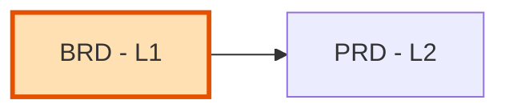

# BRD-00: Business Requirements Document Index

Master index of all Business Requirements Documents for the project.

---

## Position in Document Workflow



**Layer**: 1 (Business Requirements Layer)
**Downstream**: PRD (Layer 2)
**Traceability chain**: BRD → PRD → EARS → BDD → ADR → SPEC → TDD → IPLAN → Code

---

## Quick Start

### Generate New BRD

Use the `sdd-lifecycle` MCP server:

```
sdd_create doc_type=brd layer=01_BRD
```

### Validate BRD

```
sdd_validate doc_type=brd
sdd_score_validate doc_type=brd  # PRD-Ready score (>=90/100)
```

### Review and Fix BRD

```
sdd_review doc_type=brd
sdd_remediate doc_type=brd  # Apply review findings
```

---

## Document Registry

| BRD ID | Module | Type | Status | PRD-Ready | Location |
|--------|--------|------|--------|-----------|----------|
| - | - | - | - | - | No BRDs created yet |

---

## Module Categories

### Foundation Modules (F1-F7)

Domain-agnostic, reusable infrastructure modules.

| ID | Module Name | BRD | Status |
|----|-------------|-----|--------|
| F1 | Identity & Access Management | Pending | - |
| F2 | Session Management | Pending | - |
| F3 | Observability | Pending | - |
| F4 | SecOps | Pending | - |
| F5 | Events | Pending | - |
| F6 | Infrastructure | Pending | - |
| F7 | Configuration | Pending | - |

### Domain Modules (D1-D7)

Business-specific modules (customize per project).

| ID | Module Name | BRD | Status |
|----|-------------|-----|--------|
| D1 | [Domain Module 1] | Pending | - |
| D2 | [Domain Module 2] | Pending | - |
| D3 | [Domain Module 3] | Pending | - |
| D4 | [Domain Module 4] | Pending | - |
| D5 | [Domain Module 5] | Pending | - |
| D6 | [Domain Module 6] | Pending | - |
| D7 | [Domain Module 7] | Pending | - |

---

## Input Sources

BRD autopilot uses these source directories (in priority order):

| Priority | Location | Content |
|----------|----------|---------|
| 1 | Project reference documents | Technical specifications, gap analysis |
| 2 | Existing project documentation | Architecture docs, stakeholder input |
| 3 | User prompts | Interactive input (fallback) |

---

## Quick Links

- **PRD Layer**: [02_PRD](../02_PRD/)
- **Template**: [BRD-TEMPLATE.yaml](BRD-TEMPLATE.yaml)
- **README**: [README.md](README.md)

---

## Statistics

| Metric | Value |
|--------|-------|
| Total BRDs | 0 |
| Foundation Modules | 0/7 |
| Domain Modules | 0/7 |
| Average PRD-Ready Score | - |

---

## Planned BRDs

| ID | Title | Priority | Target Date | Notes |
|----|-------|----------|-------------|-------|
| BRD-01 | [First module] | High | TBD | - |

---

## Allocation Rules

- **Numbering**: Allocate sequentially starting at `01`; keep numbers stable
- **Foundation**: F1-F7 modules use BRD-01 through BRD-07
- **Domain**: D1-D7 modules use BRD-08 through BRD-14 (or custom numbering)
- **Feature BRDs**: Continue sequence from last allocated number
- **Filename**: `BRD-NN_{descriptive_slug}.yaml` (platform BRDs: `BRD-NN_platform_{slug}.yaml`)

---

*Last Updated: 2026-04-29*
