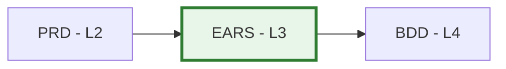

# EARS-00: EARS Requirements Master Index

## Purpose

This document serves as the master index for all EARS (Easy Approach to Requirements Syntax) Requirements in the project. Use this index to:

- **Discover** existing formal requirements
- **Track** requirement specification status
- **Coordinate** requirements engineering across teams
- **Reference** atomic, testable requirements

## Position in Document Workflow

**Layer**: 3 (Formal Requirements Layer)
**Upstream**: BRD, PRD
**Downstream**: BDD (Behavior-Driven Development, Layer 4)
**Traceability chain**: BRD → PRD → EARS → BDD → ADR → SPEC → TDD → IPLAN → Code

## EARS Requirements Index

| EARS ID | Title | Requirement Type | Status | Related PRD | Last Updated |
|---------|-------|------------------|--------|-------------|--------------|
| [EARS-TEMPLATE.yaml](./EARS-TEMPLATE.yaml) | Template (default) | Reference | Reference | - | 2026-03-29 |

## Planned

| ID | Title | Source PRD | Priority | Notes |
|----|-------|------------|----------|-------|
| EARS-XX | … | PRD-YY | High/Med/Low | … |

## Status Definitions

| Status | Meaning | Description |
|--------|---------|-------------|
| **Draft** | In development | EARS requirements being written |
| **Review** | Under review | Technical review in progress |
| **Approved** | Finalized | Requirements approved and testable |
| **Implemented** | In system | Requirements implemented in code |
| **Verified** | Tested | Requirements verified through testing |
| **Deprecated** | Obsolete | No longer valid, superseded by newer requirement |

## EARS Statement Types

| Type | Pattern | Example | Usage |
|------|---------|---------|-------|
| **Event-driven** | WHEN [trigger] THEN [response] | WHEN user clicks submit THEN validate form | Triggered actions |
| **State-driven** | WHILE [state] THEN [response] | WHILE system is offline THEN queue requests | Continuous conditions |
| **Unwanted** | IF [condition] THEN [prevention] | IF invalid input THEN reject with error | Error handling |
| **Optional** | WHERE [feature enabled] THEN [response] | WHERE premium enabled THEN show analytics | Feature flags |
| **Ubiquitous** | THE [system] SHALL [requirement] | THE system SHALL log all transactions | Always-on requirements |

## Adding New EARS Requirements

When creating a new EARS document:

1. **Generate via MCP**: `sdd_create doc_type=ears layer=03_EARS`

2. **Assign EARS ID**: Use next sequential number (EARS-01, EARS-02, ...)

3. **Update This Index**: Add new row to table above

4. **Create Cross-References**: Update related PRD and create downstream BDD scenarios

## Allocation Rules

- **Numbering**: Allocate sequentially starting at `01`
- **One Area Per File**: Each `EARS-NN` file covers a coherent requirement area
- **Slugs**: Short, descriptive, lower_snake_case
- **Testability**: Every requirement must be verifiable through testing
- **Index Updates**: Add entry for every new EARS document

## Index by Requirement Type

### Event-Driven Requirements
- None

### State-Driven Requirements
- None

### Unwanted Behavior (Error Handling)
- None

### Optional Features
- None

### Ubiquitous Requirements
- None

## Index by Status

### Draft
- None

### Review
- None

### Approved
- None

### Implemented
- None

### Verified
- None

## Metrics

| Metric | Value | Description |
|--------|-------|-------------|
| Total EARS Documents | 0 | Total formal requirement documents |
| Total Requirements | 0 | Total atomic requirements specified |
| Event-Driven | 0 | WHEN/THEN requirements |
| State-Driven | 0 | WHILE/THEN requirements |

## Quality Gate

EARS must achieve **BDD-Ready score >=90/100** before downstream BDD generation.

## Related Documents

- **Template**: [EARS-TEMPLATE.yaml](./EARS-TEMPLATE.yaml)
- **README**: [README.md](./README.md) — EARS purpose and statement types
- **Upstream**: [02_PRD](../02_PRD/) — Product Requirements
- **Downstream**: [04_BDD](../04_BDD/) — Behavior-Driven Development

## Maintenance Guidelines

Before marking EARS as "Approved":
- [PASS] All requirements follow EARS patterns (WHEN/THEN, WHILE/THEN, etc.)
- [PASS] Requirements are atomic and independently testable
- [PASS] Measurable acceptance criteria defined
- [PASS] Cross-references to PRD use hash-based element IDs
- [PASS] BDD-Ready score >=90/100

---

**Index Version**: 3.0
**Last Updated**: 2026-04-29
**Maintainer**: [Project Team]
