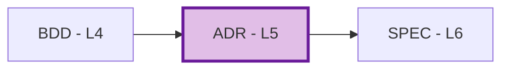

# ADR-00: Architecture Decision Records Master Index

## Purpose

This document serves as the master index for all Architecture Decision Records in the project. Use this index to:

- **Discover** architectural decisions and their rationale
- **Track** decision status and evolution
- **Coordinate** architecture changes across teams
- **Reference** decision history and alternatives considered

## Position in Document Workflow

**Layer**: 5 (Architecture Decision Layer)
**Upstream**: BRD, PRD, EARS, BDD
**Downstream**: SPEC (Technical Specification, Layer 6)
**Traceability chain**: BRD → PRD → EARS → BDD → ADR → SPEC → TDD → IPLAN → Code

## Architecture Decision Records Index

| ADR ID | Title | Status | Category | Related BDD | Impact | Last Updated |
|--------|-------|--------|----------|-------------|--------|--------------|
| [ADR-TEMPLATE.yaml](./ADR-TEMPLATE.yaml) | Template (default) | Reference | Reference | - | - | 2026-03-29 |

## Planned

| ID | Decision Topic | Source (01_BRD/02_PRD) | Priority | Notes |
|----|----------------|------------------------|----------|-------|
| ADR-XX | … | BRD-YY / PRD-ZZ | High/Med/Low | … |

## Status Definitions

| Status | Meaning | Description |
|--------|---------|-------------|
| **Proposed** | Under consideration | ADR drafted, awaiting review and approval |
| **Accepted** | Approved | Decision approved, implementation in progress or complete |
| **Deprecated** | Being replaced | Decision still in use but migration to replacement planned |
| **Superseded** | Replaced | Completely replaced by newer ADR, kept for historical reference |

## Decision Categories

| Category | Description | Examples |
|----------|-------------|----------|
| **Infrastructure** | Deployment, scaling, networking | Cloud Run, Kubernetes, VPC design |
| **Integration** | System-to-system communication | API contracts, message queues, webhooks |
| **Technology Selection** | Framework, language, platform choices | Python vs Go, FastAPI vs Flask |
| **Data Architecture** | Database, storage, consistency | PostgreSQL, BigQuery, caching strategy |
| **Security** | Authentication, authorization, encryption | OAuth2, RBAC, secrets management |
| **Observability** | Monitoring, logging, alerting | Cloud Monitoring, OpenTelemetry |
| **AI/ML** | Model serving, training, MLOps | Vertex AI, model deployment patterns |

## Adding New Architecture Decisions

When creating a new ADR:

1. **Generate via MCP**: `sdd_create doc_type=adr layer=05_ADR`

2. **Assign ADR ID**: Use next sequential number (ADR-01, ADR-02, ...)

3. **Update This Index**: Add new row to table above

4. **Create Cross-References**: Link to upstream BDD scenarios and downstream 06_SPEC

## Allocation Rules

- **Numbering**: Allocate sequentially starting at `01`
- **One Decision Per File**: Each `ADR-NN` covers a single significant architectural decision
- **Slugs**: Short, descriptive, lower_snake_case
- **Alternatives Required**: Document at least 2-3 alternatives considered
- **Consequences Analysis**: Include positive and negative outcomes
- **Index Updates**: Add entry for every new ADR

## Quality Gate

ADR must achieve **SPEC-Ready score >=90/100** before downstream SPEC generation.

## Index by Status

### Proposed
- None

### Accepted
- None

### Deprecated
- None

### Superseded
- None

## Index by Category

### Infrastructure
- None

### Integration
- None

### Technology Selection
- None

### Data Architecture
- None

### Security
- None

### Observability
- None

### AI/ML
- None

## Impact Summary

| Impact Level | ADR Count | Description |
|--------------|-----------|-------------|
| **Critical** | 0 | Fundamental system architecture, affects all components |
| **High** | 0 | Significant architectural changes, affects multiple components |
| **Medium** | 0 | Localized architectural decisions, affects specific areas |
| **Low** | 0 | Minor decisions, limited scope |

## Metrics

| Metric | Value | Description |
|--------|-------|-------------|
| Total ADRs | 0 | Total architecture decisions documented |
| Proposed | 0 | Decisions under review |
| Accepted | 0 | Approved and implemented decisions |
| Deprecated | 0 | Decisions being phased out |
| Superseded | 0 | Historical decisions replaced by newer ones |

## Related Documents

- **Template**: [ADR-TEMPLATE.yaml](./ADR-TEMPLATE.yaml)
- **README**: [README.md](./README.md) — ADR purpose, structure, and best practices
- **Upstream**: [04_BDD](../04_BDD/) — Behavior-Driven Development
- **Downstream**: [06_SPEC](../06_SPEC/) — Technical Specification

## Maintenance Guidelines

Before marking ADR as "Accepted":
- [PASS] Problem statement clearly defined with business context
- [PASS] At least 2-3 alternatives considered and documented
- [PASS] Consequences analysis includes both positive and negative outcomes
- [PASS] Architecture flow diagrams included (Mermaid format)
- [PASS] Implementation assessment covers complexity, dependencies, resources
- [PASS] Rollback procedures documented
- [PASS] Cross-references to BDD scenarios and downstream SPEC complete
- [PASS] SPEC-Ready score >=90/100

---

**Index Version**: 3.0
**Last Updated**: 2026-04-29
**Maintainer**: [Project Team]
