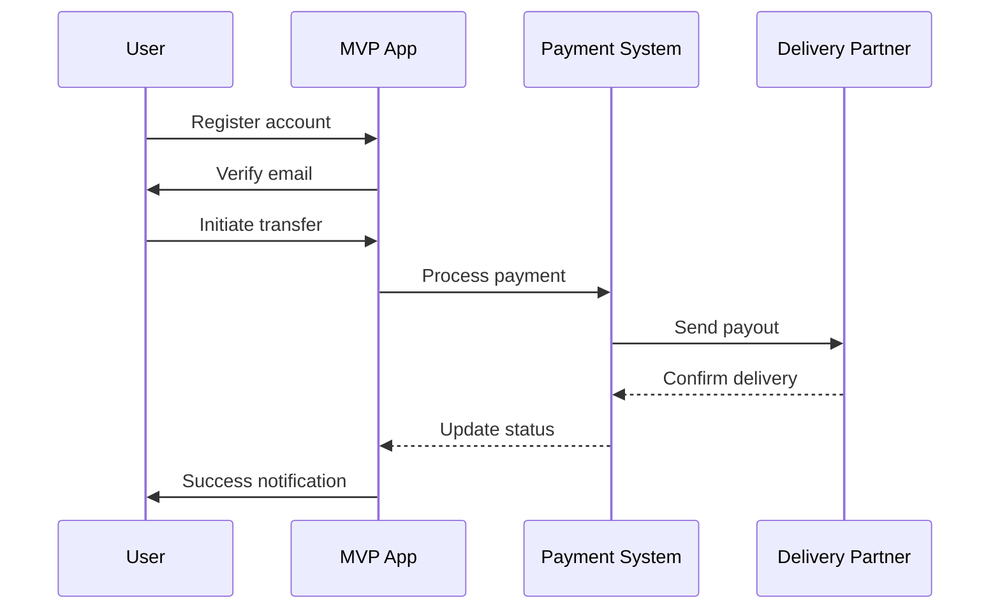
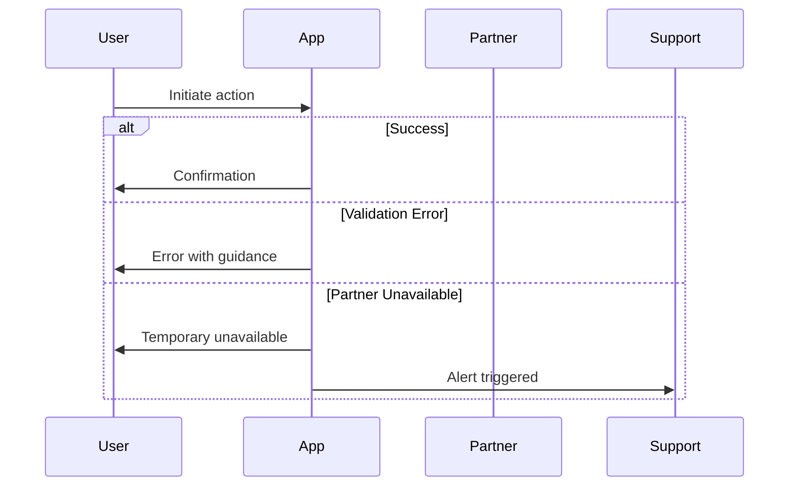
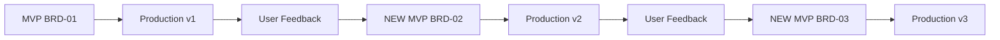

> ** Dual-Format Note**:
>
> This MD template is the **primary source** for human workflow.
> - **For Autopilot**: See `BRD-MVP-TEMPLATE.yaml` (YAML template)
> - **Shared Validation Source**: BRD wrapper checks enforce template/rule compliance; optional schema checks (`BRD_MVP_SCHEMA.yaml`) remain advisory.
> - **Complete Explanation**: See [DUAL_MVP_TEMPLATES_ARCHITECTURE.md](../DUAL_MVP_TEMPLATES_ARCHITECTURE.md) for full comparison of formats, authority hierarchy, and when to use each.
> ---

# BRD-MVP-TEMPLATE: Business Requirements Document (MVP-First)

<!--
AI_CONTEXT_START
Role: AI Product Owner / Business Analyst
Objective: Create a Business Requirements Document for one MVP cycle.
Constraints:
- Focus on MVP scope (5-15 core requirements per cycle)
- Keep descriptions concise, avoid generic filler
- Maintain single-file structure (monolithic)
- Prioritize P1 (Must Have) features
- Lifecycle: MVP → PROD → NEW MVP (iterative)
- New features = new BRD, not indefinite expansion
  template_variant: standard
  lifecycle: mvp-prod-newmvp
AI_CONTEXT_END
-->

> **Purpose**: This is the **standard BRD template** for all projects. The MVP-first approach enables rapid delivery with iterative enhancement.
>
> **Lifecycle**: **MVP → PROD → NEW MVP**
> 1. **MVP**: Start with core features (5-15 requirements), deploy to production
> 2. **PROD**: Operate, gather feedback, measure success
> 3. **NEW MVP**: Create a new BRD for next feature set, repeat cycle
>
> **Use this template when**:
> - Starting any new project or feature set
> - Building core functionality for production deployment
> - Fast iteration with real user feedback
> - Any team size (scales from 2 to 50+ people)
>
> **Key Principle**: Each BRD represents ONE iteration cycle. When the current MVP reaches production and you need new features, create a **new BRD** for the next MVP cycle rather than expanding the existing BRD indefinitely.

> **Section Structure**: 18 sections provide complete coverage. Sections can be expanded as the product matures within the current MVP cycle.

> **Validation**: Use `scripts/validate_brd_wrapper.sh` as the canonical BRD validation entrypoint (`--skip-advisory` for automation). Schema checks via `BRD_MVP_SCHEMA.yaml` are advisory.

> References: Schema `BRD_MVP_SCHEMA.yaml` | Rules `BRD_MVP_CREATION_RULES.md`, `BRD_MVP_VALIDATION_RULES.md` | Matrix `BRD-00_TRACEABILITY_MATRIX-TEMPLATE.md`

---

## 0. Document Control

| Item | Details |
|------|---------|
| **Project Name** | [Enter MVP project name] |
| **Document Version** | [e.g., 1.0] |
| **Date** | [YYYY-MM-DDTHH:MM:SS] |
| **Document Owner** | [Name and title] |
| **Prepared By** | [Business Analyst name] |
| **Status** | [Draft / In Review / Approved] |
| **MVP Target Launch** | [Target date] |
| **PRD-Ready Score** | [Score]/100 (MVP Target: ≥90/100) |

### Executive Summary (MVP)
[One-paragraph elevator pitch of the MVP: target users, core value, and expected impact.]

### Document Revision History

| Version | Date | Author | Changes Made | Approver |
|---------|------|--------|--------------|----------|
| 1.0 | [YYYY-MM-DDTHH:MM:SS] | [Name] | Initial MVP draft | |

---

## 1. Introduction

Business Context (MVP):
[Brief situational context — what business environment or trigger motivates this MVP?]

### 1.1 Purpose
This Business Requirements Document (BRD) defines the business requirements for [MVP Project Name]. This document focuses on the **Minimum Viable Product** - the smallest set of features needed to deliver value to early users and validate the core business hypothesis.

### 1.2 Document Scope
This document covers:
- Core business objectives for MVP
- Essential functional requirements (5-15 requirements)
- Baseline quality attributes (performance, security, usability)
- Streamlined architecture decision topics
- MVP success criteria and transition to full product

**Out of Scope for MVP BRD**:
- Detailed stakeholder communication plans (simplified to key approvers)
- Comprehensive cost-benefit analysis (ROI estimate only)
- Full support and maintenance operations (basic support plan)
- Extensive user story matrices (5-10 high-level stories)

### 1.3 Intended Audience
- Executive sponsor (approval authority)
- Product manager (feature prioritization)
- Development team (technical implementation)
- Early users/beta testers (feedback loop)

### 1.4 Document Conventions
- **Must/Shall:** MVP critical requirements (P1)
- **Should:** Important for MVP (P2)
- **Future:** Next MVP cycle enhancements (documented but deferred)

---

## 2. Business Objectives

### 2.1 MVP Hypothesis
[State the core hypothesis this MVP aims to validate. Example: "Users will pay for instant cross-border money transfers if the experience is simpler than traditional methods."]

**Key Validation Questions**:
1. [Question 1 - e.g., "Will users complete onboarding in <5 minutes?"]
2. [Question 2 - e.g., "Will we achieve ≥90% transaction success rate?"]
3. [Question 3 - e.g., "Will users rate the experience ≥4.0/5?"]

### 2.2 Business Problem Statement
**Problem**: [Concise description of the business problem]

**Impact**: [Quantifiable impact - revenue loss, customer pain, market gap]

**MVP Solution**: [How the MVP addresses this problem with minimum features]

### 2.3 MVP Business Goals

1. **Goal 1**: [Primary business goal - e.g., "Validate market demand"]
2. **Goal 2**: [Secondary goal - e.g., "Prove technical feasibility"]
3. **Goal 3**: [Tertiary goal - e.g., "Build early user community"]

### 2.4 MVP Success Metrics

| Objective ID | Objective Statement | Success Metric | MVP Target | Measurement Period |
|--------------|---------------------|----------------|------------|-------------------|
| BRD.NN.23.01 | [Objective] | [How measured] | [Target] | [90 days post-launch] |
| BRD.NN.23.02 | [Objective] | [How measured] | [Target] | [90 days post-launch] |
| BRD.NN.23.03 | [Objective] | [How measured] | [Target] | [90 days post-launch] |

### 2.5 Expected Benefits (MVP Scope)

**Quantifiable Benefits**:
- User acquisition: [Target number] early users
- Revenue validation: [Target $] in test transactions
- Time to market: Launch in [X weeks/months]

**Qualitative Benefits**:
- Market validation for full product investment
- User feedback for product refinement
- Team learning on technical stack

---

## 3. Project Scope

### 3.1 MVP Scope Statement
[Define the minimum set of features needed to deliver value and validate the business hypothesis. Be explicit about what's included vs deferred.]

### 3.2 MVP Core Features (In-Scope)

**P1 - Must Have for MVP Launch**:
1. [Core feature 1 - e.g., "User registration and basic profile"]
2. [Core feature 2 - e.g., "Single payment corridor (US → Mexico)"]
3. [Core feature 3 - e.g., "Bank account payout only"]
4. [Core feature 4 - e.g., "Email notifications"]
5. [Core feature 5 - e.g., "Basic transaction history"]

**P2 - Should Have if Time Permits**:
1. [Nice-to-have feature 1]
2. [Nice-to-have feature 2]

### 3.3 Explicitly Out-of-Scope for MVP

**Future Enhancements (Next MVP Cycle)**:
1. [Feature deferred - e.g., "Multiple payment corridors"]
2. [Feature deferred - e.g., "Cash pickup options"]
3. [Feature deferred - e.g., "Mobile apps (web-only for MVP)"]
4. [Feature deferred - e.g., "Real-time chat support"]

**Rationale**: MVP focuses on proving core value proposition; additional features added based on user feedback.

### 3.4 MVP Workflow (High-Level)

#### 3.4.1 End-to-End Workflow Diagram

**End-to-End User Journey**:



**Happy Path Summary** (5-7 key steps):
1. [Step 1 - User action and business outcome]
2. [Step 2 - User action and business outcome]
3. [Step 3 - User action and business outcome]
4. [Step 4 - User action and business outcome]
5. [Step 5 - User action and business outcome]

#### 3.4.2 Exception Handling Workflow

**Exception Categories**:

| Category | Trigger | Business Response | Recovery Path |
|----------|---------|-------------------|---------------|
| Validation Failure | Invalid input | Clear error message | Retry with corrections |
| Partner Error | External system failure | Queued retry | Manual escalation after 3 retries |
| Timeout | Processing delay | Status notification | Automatic retry |
| Payment Decline | Insufficient funds, card error | Notify user | Alternative payment method |

**Exception Handling Diagram**:



#### 3.4.3 Optional Business Visualization (Transition Policy)

For BRD, diagrams are advisory and non-blocking. Canonical design enforcement starts in PRD.

Recommended BRD tags:
- `@diagram: c4-l1` (system context)
- `@diagram: dfd-l0` (top-level data movement)

Optional:
- Key business `sequenceDiagram` for critical journey timing.

Example declaration block (optional):

```markdown
@diagram: c4-l1
@diagram: dfd-l0
@diagram-scope: business-boundary
@diagram-lifecycle: mvp-prod-newmvp
```

### 3.5 MVP Technology Stack

**User-Facing Platforms**:
- Web application (browser-based, responsive design)
- [Mobile apps: Out of scope for MVP]

**Core Technology Decisions**:
- [Frontend: e.g., React/Next.js]
- [Backend: e.g., Node.js/Python]
- [Database: e.g., PostgreSQL]
- [Hosting: e.g., GCP/AWS]

> **Note**: Detailed technology evaluation in Section 7 (Architecture Decision Requirements)

---

## 4. Stakeholders

**Decision Makers**:
- **Executive Sponsor**: [Name/Title] - Final approval authority
- **Product Owner**: [Name/Title] - Feature prioritization
- **Technical Lead**: [Name/Title] - Architecture decisions

**Key Contributors**:
- **Compliance/Legal**: [Department] - Regulatory guidance (if applicable)
- **Early Users/Beta Testers**: [Description] - Feedback loop

> **Extended stakeholder matrix**: Expand in subsequent MVP cycles as organization grows. Each cycle focuses on minimal approval chain.

---

## 5. User Stories

> **Complete user stories**: Detailed user story tables belong in PRD. This section provides high-level summaries for MVP.

> **MVP Scope**: These user story tables are simplified for MVP scope (5-10 stories).
> Additional stories go in PRD. Consolidated tables reduce document count.
> New user stories for next features go in the next BRD iteration (BRD-02, etc.).

**ID Format**: `BRD.NN.09.SS` (User Story)

### 5.1 Primary User Stories (MVP Essential)

**End Users** (5-7 core stories):

| Story ID | User Role | Action | Business Value | Priority |
|----------|-----------|--------|----------------|----------|
| BRD.NN.09.01 | [user role] | [core action] | [business value] | P1 |
| BRD.NN.09.02 | [user role] | [core action] | [business value] | P1 |
| BRD.NN.09.03 | [user role] | [core action] | [business value] | P1 |
| BRD.NN.09.04 | [user role] | [core action] | [business value] | P2 |
| BRD.NN.09.05 | [user role] | [core action] | [business value] | P2 |

**Operational Users** (2-3 stories):

| Story ID | User Role | Action | Business Value | Priority |
|----------|-----------|--------|----------------|----------|
| BRD.NN.09.06 | [admin/support role] | [capability] | [operational efficiency] | P1 |
| BRD.NN.09.07 | [compliance role] | [capability] | [regulatory compliance] | P1 |

### 5.2 User Story Summary

- **Total MVP User Stories**: [X] (P1: [Y], P2: [Z])
- **Future Phase Stories**: [XX] (logged for next MVP cycle)

---

## 6. Functional Requirements

> **Terminology Note**: Functional Requirements in BRD are business-level capabilities. Technical implementation details belong in PRD.

### 6.1 MVP Requirements Overview

**Priority Definitions**:
- **P1 (Must Have)**: Essential for MVP launch; blocks go-live if missing
- **P2 (Should Have)**: Important but workarounds exist for MVP
- **Future**: Next MVP cycle enhancements based on user feedback

### 6.2 MVP Functional Requirements

Quick Core MVP Requirements Checklist:
- [ ] P1 Requirement 1 (must have for MVP)
- [ ] P1 Requirement 2
- [ ] P1 Requirement 3


---

### 6.3 BRD.NN.01.01: [MVP Core Feature 1 - Business Capability Name]

**ID Format**: `BRD.NN.01.SS` (Feature Requirement)

**Business Capability**: [One-sentence description of what business capability this enables for MVP]

**Business Requirements**:
- [Business need 1 - what must be accomplished]
- [Business need 2 - regulatory or compliance requirement if applicable]
- [Business need 3 - partner dependency at business level]

**Business Rules**:
- [Policy constraint 1 - business rule that governs behavior]
- [Policy constraint 2 - regulatory limit or threshold]

**Business Acceptance Criteria**:

| Criteria ID | Criterion | MVP Target |
|-------------|-----------|------------|
| BRD.NN.06.01 | [Measurable criterion] | [Target value] |
| BRD.NN.06.02 | [Measurable criterion] | [Target value] |

**Related Requirements**: [Platform BRDs or related Feature BRDs]

**Complexity**: X/5 ([Business rationale])

---

### 6.4 BRD.NN.01.02: [MVP Core Feature 2]

[Repeat structure above for each core MVP feature - aim for 5-15 requirements total]

---

### 6.5 Business Rules (Core Only)

[Document critical business rules for MVP - 5-10 rules maximum]

| Rule ID | Business Rule Description | Conditions | Actions | Priority |
|---------|--------------------------|------------|---------|----------|
| BR-001 | [Core rule] | [When this exists] | [System must do this] | P1 |
| BR-002 | [Core rule] | [When this exists] | [System must do this] | P1 |

---

## 7. Quality Attributes

### 7.1 MVP Quality Attributes Overview

**MVP Philosophy**: Establish baseline quality for core user experience. Advanced quality attributes (extensive scalability, comprehensive observability) deferred to full product.

### 7.2 Architecture Decision Requirements (Streamlined for MVP)

**ID Format**: `BRD.NN.10.SS` (Decision - canonical)
> **Note**: Code 10 is canonical for Architecture Decision requirements. Code 32 accepted for legacy compatibility.

> **Framework Compliance**: All BRDs must address 7 mandatory ADR topic categories. MVP template uses streamlined format.

| Topic Area | Decision Needed | Business Driver | Key Considerations |
|------------|-----------------|-----------------|-------------------|
| Infrastructure | Hosting & Deployment | Rapid MVP deployment | Cloud Run, App Engine, GKE |
| Data Architecture | Database & Storage | Data persistence needs | PostgreSQL, Firestore, Cloud SQL |
| Integration | External Systems | Partner connectivity | REST APIs, Webhooks |
| Security | Auth & Data Protection | User trust, compliance | Firebase Auth, IAM |
| Observability | Monitoring & Logging | Error tracking for MVP | Cloud Logging, Error Reporting |
| AI/ML | If Applicable | Intelligent features | Vertex AI, custom models |
| Technology Selection | Core Stack | Team expertise | React, Node.js, Python |

#### 7.2.1 Mandatory ADR Topics (MVP Streamlined Format)

---

#### BRD.NN.10.01: Infrastructure - [Hosting & Deployment]

**Status**: [ ] Selected | [ ] Pending | [ ] N/A

**Business Driver**: [Why MVP needs this - e.g., "Need rapid deployment for user testing"]

**Budget Constraint**: $[X,XXX]/month maximum

**Recommended Selection**: [Option - e.g., "GCP Cloud Run for serverless MVP"] OR **Pending**

**Rationale**: [1-2 sentence business justification]

**PRD Requirements**: [What PRD must detail - e.g., "Container configuration, auto-scaling thresholds"]

---

#### BRD.NN.10.02: Data Architecture - [Database & Storage]

**Status**: [ ] Selected | [ ] Pending | [ ] N/A

**Business Driver**: [Data requirements]

**Budget Constraint**: $[X,XXX]/month maximum

**Recommended Selection**: [Option - e.g., "PostgreSQL on Cloud SQL"] OR **Pending**

**Rationale**: [1-2 sentence business justification]

**PRD Requirements**: [What PRD must detail]

---

#### BRD.NN.10.03: Integration - [External Systems]

**Status**: [ ] Selected | [ ] Pending | [ ] N/A - [No external integrations for MVP]

**Business Driver**: [Integration needs - e.g., "Partner API for payouts"]

**Recommended Selection**: [Option] OR **Pending**

**PRD Requirements**: [What PRD must detail]

---

#### BRD.NN.10.04: Security - [Authentication & Data Protection]

**Status**: [ ] Selected | [ ] Pending | [ ] N/A

**Business Driver**: [Security requirements - regulatory or user trust]

**Compliance Requirements**: [e.g., "GDPR for EU users, basic PII encryption"]

**Recommended Selection**: [Option - e.g., "Firebase Auth + field-level encryption"]

**PRD Requirements**: [What PRD must detail]

---

#### BRD.NN.10.05: Observability - [Monitoring & Logging]

**Status**: [ ] Selected | [ ] Pending | [ ] N/A - [Basic logging only for MVP]

**Business Driver**: [Why needed - e.g., "Error tracking for MVP iteration"]

**Recommended Selection**: [Option - e.g., "Cloud provider native logging"]

**PRD Requirements**: [What PRD must detail]

---

#### BRD.NN.10.06: AI/ML - [If Applicable]

**Status**: [ ] Selected | [ ] Pending | [X] N/A - [No AI/ML in MVP scope]

**Rationale**: [Why N/A or what's needed]

---

#### BRD.NN.10.07: Technology Selection - [Core Stack]

**Status**: [ ] Selected | [ ] Pending | [ ] N/A

**Business Driver**: [Why technology choice matters]

**Team Constraints**: [Existing skills to leverage]

**Recommended Selection**: [Tech stack - e.g., "React + Node.js + PostgreSQL"]

**Rationale**: [Team expertise, rapid development, community support]

**PRD Requirements**: [Detailed framework versions, build process]

---

### 7.3 Performance Requirements (MVP Baseline)

**ID Format**: `BRD.NN.91.SS` (Performance Requirement - canonical)
> **Note**: Code 91 is canonical for Performance requirements. Code 02 accepted for legacy compatibility.

| Req ID | Requirement | Metric | MVP Target | Priority |
|--------|-------------|--------|------------|----------|
| BRD.NN.91.01 | Page load time | Load time | <3 seconds | P1 |
| BRD.NN.91.02 | Transaction processing | Response time | <10 seconds | P1 |
| BRD.NN.91.03 | Concurrent users | User capacity | 100 users | P2 |

### 7.4 Reliability Requirements (MVP Baseline)

**ID Format**: `BRD.NN.92.SS` (Reliability Requirement - canonical)
> **Note**: Code 92 is canonical for Reliability requirements. Code 02 accepted for legacy compatibility.

| Req ID | Requirement | MVP Target | Priority |
|--------|-------------|------------|----------|
| BRD.NN.92.01 | System uptime | 95% (MVP acceptable) | P2 |
| BRD.NN.92.02 | Backup frequency | Daily | P1 |
| BRD.NN.92.03 | Recovery time (RTO) | <4 hours | P2 |

### 7.5 Scalability Requirements (MVP Baseline)

**ID Format**: `BRD.NN.94.SS` (Scalability Requirement - canonical)
> **Note**: Code 94 is canonical for Scalability requirements. Code 02 accepted for legacy compatibility.

| Req ID | Requirement | MVP Target | Growth Target | Priority |
|--------|-------------|------------|---------------|----------|
| BRD.NN.94.01 | Horizontal scaling | Manual scaling | Auto-scale | P2 |
| BRD.NN.94.02 | Data volume growth | 10GB | 100GB | P2 |
| BRD.NN.94.03 | User base growth | 100 users | 10,000 users | P2 |

### 7.6 Security Requirements (MVP Essential)

**ID Format**: `BRD.NN.96.SS` (Security Requirement - canonical)
> **Note**: Code 96 is canonical for Security requirements. Code 02 accepted for legacy compatibility.

| Req ID | Requirement | Standard | Priority | Validation |
|--------|-------------|----------|----------|------------|
| BRD.NN.96.01 | User authentication | Email + password (min) | P1 | Login testing |
| BRD.NN.96.02 | Data encryption at rest | AES-256 | P1 | Security audit |
| BRD.NN.96.03 | HTTPS/TLS | TLS 1.2+ | P1 | Certificate check |
| BRD.NN.96.04 | PII protection | Field-level encryption | P1 | Compliance review |

### 7.7 Observability Requirements (MVP Baseline)

**ID Format**: `BRD.NN.98.SS` (Observability Requirement - canonical)
> **Note**: Code 98 is canonical for Observability requirements. Code 02 accepted for legacy compatibility.

| Req ID | Requirement | MVP Implementation | Priority |
|--------|-------------|-------------------|----------|
| BRD.NN.98.01 | Application logging | Structured logs to Cloud Logging | P1 |
| BRD.NN.98.02 | Error tracking | Error Reporting integration | P1 |
| BRD.NN.98.03 | Health endpoints | /health, /ready endpoints | P2 |
| BRD.NN.98.04 | Metrics collection | Basic latency/throughput metrics | P2 |

### 7.8 Maintainability Requirements (MVP Baseline)

**ID Format**: `BRD.NN.99.SS` (Maintainability Requirement - canonical)
> **Note**: Code 99 is canonical for Maintainability requirements. Code 02 accepted for legacy compatibility.

| Req ID | Requirement | MVP Standard | Priority |
|--------|-------------|--------------|----------|
| BRD.NN.99.01 | Code documentation | Inline comments for complex logic | P2 |
| BRD.NN.99.02 | API documentation | OpenAPI/Swagger for endpoints | P2 |
| BRD.NN.99.03 | Configuration management | Environment-based config | P1 |
| BRD.NN.99.04 | Dependency management | Pinned versions, security updates | P1 |

> **Note**: Production targets increase over time. MVP cycle focuses on functionality validation; subsequent cycles enhance quality attributes.

---

## 8. Business Constraints and Assumptions

### 8.1 MVP Business Constraints

**ID Format**: `BRD.NN.03.SS` (Business Constraint)

| ID | Constraint Category | Description | Impact |
|----|---------------------|-------------|--------|
| BRD.NN.03.01 | Budget | MVP budget capped at $[XXX,XXX] | Limits scope to core features |
| BRD.NN.03.02 | Timeline | Must launch within [X] weeks | Drives feature prioritization |
| BRD.NN.03.03 | Team Size | [X] developers available | Limits parallel workstreams |
| BRD.NN.03.04 | [Regulatory] | [If applicable] | [Impact] |

### 8.2 MVP Assumptions

**ID Format**: `BRD.NN.04.SS` (Business Assumption)

| ID | Assumption | Validation Method | Impact if False |
|----|------------|-------------------|-----------------|
| BRD.NN.04.01 | [Assumption] | [How to validate] | [Mitigation plan] |
| BRD.NN.04.02 | [Assumption] | [How to validate] | [Mitigation plan] |

---

## 9. Acceptance Criteria

### 9.1 MVP Launch Criteria

**Must-Have Criteria** (All must be met):
1. [ ] All P1 functional requirements implemented and tested
2. [ ] MVP success metrics defined and tracking enabled
3. [ ] Security baseline met (authentication, encryption, HTTPS)
4. [ ] Basic error handling and user feedback in place
5. [ ] Early user onboarding flow tested with [X] beta users
6. [ ] Legal/compliance approval (if applicable)

**Should-Have Criteria** (80% completion acceptable):
1. [ ] All P2 functional requirements
2. [ ] Automated testing coverage ≥60%
3. [ ] Documentation for early users (FAQ, help content)

### 9.2 MVP Success Validation (Post-Launch)

**30-Day Metrics**:
- [ ] [X] active users
- [ ] [Y] successful transactions
- [ ] ≥[Z]% transaction success rate
- [ ] User satisfaction score ≥[rating]

**90-Day Decision Gate**:
- Start next MVP cycle if [criteria met, new features identified]
- Pivot if [criteria indicate different direction]
- Maintain current state if [no new features needed]
- Shutdown if [validation fails]

---

## 10. Business Risk Management

**ID Format**: `BRD.NN.05.SS` (Business Risk)

| Risk ID | Risk Description | Likelihood | Impact | Mitigation Strategy | Owner |
|---------|------------------|------------|--------|---------------------|-------|
| BRD.NN.05.01 | [Top risk 1] | High/Med/Low | High/Med/Low | [How to mitigate] | [Role] |
| BRD.NN.05.02 | [Top risk 2] | High/Med/Low | High/Med/Low | [How to mitigate] | [Role] |
| BRD.NN.05.03 | [Top risk 3] | High/Med/Low | High/Med/Low | [How to mitigate] | [Role] |

**Risk Acceptance**: MVP accepts higher risk tolerance than full product. Focus on critical user experience and data security risks only.

---

## 11. Implementation Approach

### 11.1 MVP Development Phases

**Phase 1 - Foundation** (Weeks 1-[X]):
- [Infrastructure setup]
- [Core database schema]
- [Authentication]

**Phase 2 - Core Features** (Weeks [X]-[Y]):
- [Feature 1]
- [Feature 2]
- [Feature 3]

**Phase 3 - Integration & Testing** (Weeks [Y]-[Z]):
- [Partner integrations]
- [End-to-end testing]
- [Beta user testing]

**Phase 4 - Launch** (Week [Z]):
- [Production deployment]
- [User onboarding]
- [Monitoring setup]

### 11.2 MVP Support Model (Basic)

**Support Channels**:
- Email support: [email address]
- Response SLA: [X] business hours
- Escalation: [Process]

**Known Limitations**:
- No 24/7 support for MVP
- Limited language support ([English only, etc.])
- Basic self-service help content only

> **Enhanced support operations**: Defined in subsequent MVP cycles based on user volume and feedback.

---

## 12. Support and Maintenance

### 12.1 Support Model (MVP)

**Support Tiers**:

| Tier | Scope | Response Time | Channel |
|------|-------|---------------|---------|
| Tier 1 | User inquiries, FAQs | [X] business hours | Email |
| Tier 2 | Technical issues | [Y] business hours | Email, escalation |
| Tier 3 | Critical system issues | [Z] hours | Direct contact |

**Support Channels** (MVP):
- Primary: Email support at [support@example.com]
- Secondary: In-app help documentation
- Future: Live chat (next MVP cycle)

### 12.2 Maintenance Windows

**Planned Maintenance**:
- Frequency: [Weekly/Monthly]
- Window: [Day] [Time range] [Timezone]
- Notification: [X] hours advance notice

**Emergency Maintenance**:
- Criteria: Security patches, critical fixes
- Process: Immediate deployment with retrospective notice

### 12.3 Service Level Targets (MVP)

| Metric | MVP Target | Next Cycle Target |
|--------|------------|-----------------|
| System Uptime | 95% | 99.9% |
| Email Response | 24 business hours | 4 business hours |
| Issue Resolution | 72 hours | 24 hours |
| Backup Frequency | Daily | Hourly |

> **Note**: Support model starts simple and scales with each MVP cycle. Enhanced support operations defined in subsequent BRDs based on user volume and feedback patterns.

---

## 13. Cost-Benefit Analysis

**Development Costs**:
- Team: [X] people × [Y] weeks = $[ZZZ,ZZZ]
- Infrastructure: $[X,XXX]/month
- Third-party services: $[X,XXX]/month

**Total MVP Investment**: $[XXX,XXX]

**ROI Hypothesis**: [Expected return or validation metric]

> **Detailed cost-benefit analysis**: Expand in subsequent MVP cycles as investment grows.

---

## 14. Project Governance

### 14.1 Governance Structure (MVP)

**Decision Authority**:
- **Executive Sponsor**: Final approval authority for scope and budget
- **Product Owner**: Day-to-day feature prioritization decisions
- **Technical Lead**: Architecture and technology decisions

### 14.2 Decision Authority Matrix

| Decision Type | Authority | Escalation Path |
|--------------|-----------|-----------------|
| Scope changes | Product Owner | Executive Sponsor |
| Architecture | Technical Lead | Product Owner |
| Budget | Executive Sponsor | Board/Leadership |
| Timeline | Product Owner | Executive Sponsor |
| Resource allocation | Product Owner | Executive Sponsor |

### 14.3 Status Reporting

- **Frequency**: Weekly for MVP phase
- **Format**: Status dashboard with blockers highlighted
- **Distribution**: Executive Sponsor, Product Owner, Technical Lead
- **Metrics Tracked**: Feature completion, bug count, user feedback

### 14.4 Change Control (MVP Simplified)

| Change Type | Approval | Process |
|-------------|----------|---------|
| Minor (clarifications) | Product Owner | Direct update, notify stakeholders |
| Moderate (feature adjustments) | Product Owner + Technical Lead | Impact review, document decision |
| Major (scope changes) | Executive Sponsor | Full impact assessment, formal approval |

### 14.5 Approval and Sign-off

#### 14.5.1 Document Approval Table

| Role | Name | Title | Approval Date | Signature |
|------|------|-------|---------------|-----------|
| Executive Sponsor | [TBD] | [Title] | [Pending] | |
| Product Owner | [TBD] | [Title] | [Pending] | |
| Business Lead | [TBD] | [Title] | [Pending] | |
| Technology Lead | [TBD] | [Title] | [Pending] | |

#### 14.5.2 Approval Criteria

1. All P1 requirements defined and validated
2. Critical business risks identified with mitigation
3. Budget estimate approved
4. Technical feasibility confirmed
5. Stakeholder alignment achieved

#### 14.5.3 Change Control Process

| Change Type | Approval Required | Version Impact |
|-------------|------------------|----------------|
| Minor (clarifications) | Product Owner | Patch (1.2.1) |
| Moderate (new requirements) | PO + Tech Lead | Minor (1.3) |
| Major (scope changes) | All stakeholders | Major (2.0) |

---

## 15. Quality Assurance

### 15.1 Quality Standards (MVP)

**Code Quality**:
- Code review required for all changes
- Linting and formatting enforced via CI/CD
- No critical static analysis warnings

**Testing Coverage**:
- Unit test coverage: ≥60%
- Integration test coverage: ≥40%
- Critical paths: 100% covered

**Security Baseline**:
- OWASP Top 10 compliance
- No critical/high vulnerabilities in dependencies
- Security review before launch

### 15.2 Testing Strategy (MVP)

| Test Type | Scope | Automation | Priority |
|-----------|-------|------------|----------|
| Unit | Core business logic | Required | P1 |
| Integration | API endpoints, database | Required | P1 |
| E2E | Critical user paths only | Manual acceptable | P2 |
| Security | Authentication, data protection | Required | P1 |
| Performance | Baseline metrics | Manual acceptable | P2 |

### 15.3 Quality Gates

**Pre-Launch Gates**:
- [ ] All P1 functional requirements tested
- [ ] Security baseline validated
- [ ] Performance baseline met (<3s page load)
- [ ] No critical/high severity bugs open
- [ ] User acceptance testing complete
- [ ] Documentation reviewed

**Post-Launch Gates**:
- [ ] Error rate <1% within first 24 hours
- [ ] No data integrity issues
- [ ] User feedback collection active

> **Note**: Detailed QA standards, defect management, and comprehensive testing protocols defined in PRD.

---

## 16. Traceability

### 16.1 Requirements Traceability Matrix

#### 16.1.1 Business Objectives → Functional Requirements

| Objective ID | Objective | Related FRs | Coverage Status |
|--------------|-----------|-------------|-----------------|
| BRD.NN.23.01 | [Objective] | BRD.NN.01.01, BRD.NN.01.02 | [Complete/Partial/Planned] |
| BRD.NN.23.02 | [Objective] | BRD.NN.01.03 | [Complete/Partial/Planned] |

#### 16.1.2 Functional Requirements → Downstream (SPEC/TASKS)

| FR ID | Requirement | Planned SPEC | Planned TASKS |
|-------|-------------|--------------|---------------|
| BRD.NN.01.01 | [Requirement] | SPEC-NN-01 | TASKS-NN-01 |
| BRD.NN.01.02 | [Requirement] | SPEC-NN-01 | TASKS-NN-01 |

> **Note**: Do NOT create numeric downstream references until artifacts exist. Use placeholders.

#### 16.1.3 Upstream Dependencies

**ID Format**: `@upstream: [artifact-type]: [ID]`

| Upstream Artifact | Reference | Relevance |
|-------------------|-----------|-----------|
| [Stakeholder Requirements] | [Document] | [How it informs this BRD] |
| [Market Research] | [Document] | [How it informs this BRD] |

> **Note**: Use `null` if no upstream artifacts exist.

#### 16.1.4 Downstream Artifacts (Expected)

**ID Format**: `@downstream: [artifact-type]: [placeholder]`

- **PRD**: Product Requirements Document (Layer 2) - Detailed technical specifications
- **EARS/BDD**: Test specifications (Layer 3/4) - Acceptance test scenarios
- **ADR**: Architecture Decision Records (Layer 5) - Technology selections from Section 7

### 16.2 Cross-BRD Dependencies

[If this MVP depends on platform BRDs]

| Related BRD | Dependency Type | Rationale |
|-------------|----------------|-----------|
| Platform BRD (e.g., BRD-01) | Foundation | [Infrastructure/services required] |

**Cross-Links** (machine-parseable tags):
- `@depends: BRD-NN` — hard prerequisite BRD(s) that must be satisfied first
- `@discoverability: BRD-NN (short rationale)` — related BRDs for AI search and ranking

### 16.3 Test Coverage Traceability

| FR ID | Unit Test | Integration Test | E2E Test |
|-------|-----------|------------------|----------|
| BRD.NN.01.01 | TEST-NN-UNIT-01 | TEST-NN-INT-01 | TEST-NN-E2E-01 |
| BRD.NN.01.02 | TEST-NN-UNIT-02 | TEST-NN-INT-02 | — |

> **Note**: Test IDs are placeholders. Update as tests are created in downstream artifacts.

### 16.4 Traceability Summary

| Metric | Value | Target |
|--------|-------|--------|
| BO→FR Coverage | [X]% | ≥90% |
| FR→Test Coverage | [X]% | ≥80% |
| Cross-BRD Links Validated | [X]% | 100% |
| **Traceability Health Score** | [X]/100 | ≥90/100 |

---

## 17. Glossary

> **Master Glossary**: See [BRD-00_GLOSSARY.md](BRD-00_GLOSSARY.md)

### 17.1 Business Terms

| Term | Definition | Context |
|------|------------|---------|
| [Term] | [Definition] | [Section reference] |

### 17.2 Technical Terms

| Term | Definition | Context |
|------|------------|---------|
| [Term] | [Definition] | [Section reference] |

### 17.3 Domain-Specific Terms

| Term | Definition | Context |
|------|------------|---------|
| [Term] | [Definition] | [Section reference] |

### 17.4 Acronyms

| Acronym | Full Form | First Use |
|---------|-----------|-----------|
| MVP | Minimum Viable Product | Section 1 |
| BRD | Business Requirements Document | Section 0 |
| PRD | Product Requirements Document | Section 16 |

### 17.5 Cross-References

| Term | Referenced Document | Section |
|------|---------------------|---------|
| [Term] | [Document] | [Section] |

### 17.6 External Standards

| Standard | Organization | Relevance |
|----------|--------------|-----------|
| [Standard] | [Org] | [How used] |

> **MVP Approach**: Populate terms specific to this project. The 6-subsection structure ensures consistency. Expand content as needed during this MVP cycle or carry forward to next cycle (see Appendix C).

---

## 18. Appendices

### 18.1 Appendix A: MVP Metrics Dashboard

| Metric | Target | Data Source | Review Frequency |
|--------|--------|-------------|------------------|
| [Metric 1] | [Target] | [System] | Daily |
| [Metric 2] | [Target] | [System] | Weekly |

### 18.2 Appendix B: Next MVP Cycle Roadmap

**After This MVP Reaches Production**:
- Next MVP features (BRD-XX): [List candidates for next cycle]
- Platform scaling: [Considerations for future BRDs]
- Market expansion: [Plans for future BRDs]

**Next Cycle Trigger Criteria**:
- [ ] Current MVP stable in production (30+ days)
- [ ] User feedback collected and analyzed
- [ ] New features prioritized and approved
- [ ] Resources allocated for next cycle

### 18.3 Appendix C: MVP Lifecycle (MVP → PROD → NEW MVP)

#### C.1 The Iterative Approach



**Key Principles**:
1. **Each MVP is a complete cycle** - BRD defines scope, development delivers, production validates
2. **New features = New BRD** - Don't expand existing BRDs indefinitely; create new ones
3. **BRDs are versioned iterations** - BRD-01, BRD-02, BRD-03 represent successive feature sets
4. **Traceability links cycles** - Cross-BRD dependencies show how iterations build on each other

#### C.2 When to Start a New MVP Cycle

- [ ] Current MVP deployed to production and stable
- [ ] User feedback collected (30-90 days)
- [ ] New feature requirements identified
- [ ] Current BRD scope is complete (no pending P1s)
- [ ] Business justification for next iteration approved

#### C.3 New MVP BRD Creation Steps

1. **Create new BRD**: Use this template with new BRD ID (e.g., BRD-02, BRD-03)
2. **Reference predecessor**: Link to previous BRD in Section 16 (Cross-BRD Dependencies)
3. **Inherit decisions**: Reference ADRs from previous cycle that still apply
4. **Define new scope**: Focus on NEW features, not re-documenting existing functionality
5. **Update master index**: Add new BRD to `BRD-00_index.md`

#### C.4 Cross-Cycle Traceability

| Current BRD | Relationship | Related BRD | Purpose |
|-------------|--------------|-------------|---------|
| BRD-02 | `@depends: BRD-01` | BRD-01 | Foundation platform |
| BRD-02 | `@extends: BRD-01` | BRD-01 | Adds features to existing |
| BRD-03 | `@depends: BRD-01, BRD-02` | Both | Builds on both cycles |

#### C.5 When to Expand vs Create New

| Scenario | Action | Rationale |
|----------|--------|-----------|
| Bug fixes, minor enhancements | Update current BRD (patch version) | Same scope, refinement |
| New P1/P2 features in same domain | Create NEW BRD | New scope = new cycle |
| Entirely new product area | Create NEW BRD | Separate domain |
| Regulatory/compliance additions | Update current BRD OR new BRD | Depends on scope impact |

### 18.4 Appendix D: File Size Guidelines

- **BRD Target**: 200-400 lines per BRD (this template ~800 lines with instructions)
- **If exceeding 800 lines**: Consider splitting scope across multiple BRD cycles
- **Section splitting**: Use sectioned format (BRD-NN.1_*.md) only for very large BRDs (>25KB)
- **Principle**: One focused MVP cycle per BRD; split features into multiple BRDs if scope grows

### 18.5 Document Control Notes

**MVP-First Philosophy**:
- Each BRD represents one complete iteration cycle (MVP → PROD)
- New features = new BRD for next cycle, not indefinite expansion
- Keep BRDs focused: 5-15 core requirements per cycle
- Detailed requirements evolve based on production feedback

**Version Management**:
- Track all changes in revision history
- Lock requirements 1 week before launch
- After production deployment, create new BRD for next feature cycle
- Reference previous BRDs via Cross-BRD Dependencies (Section 16.2)

**Lifecycle**: MVP → PROD → NEW MVP (repeat)

---

**End of MVP BRD Template**
