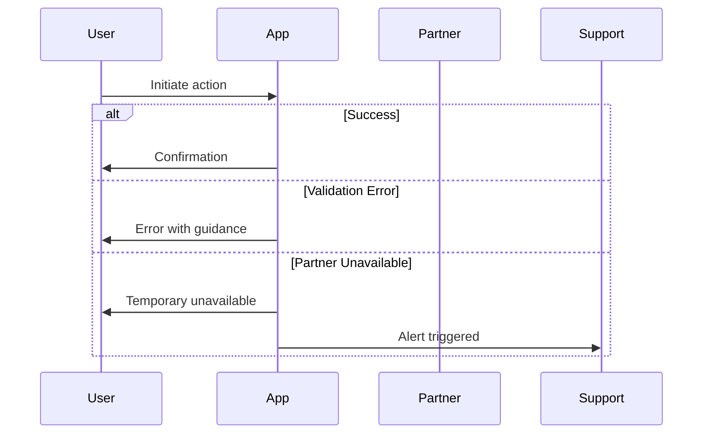

# BRD-MVP-TEMPLATE Fix Plan

**Created**: 2026-02-25
**Completed**: 2026-02-25
**Status**: ✅ Completed
**Version**: 2.0 (Updated with gap remediation)
**Target Files**:
- `BRD-MVP-TEMPLATE.md` (primary)
- `BRD-MVP-TEMPLATE.yaml` (autopilot)

## Overview

Fix 13 identified gaps in `/opt/data/docs_flow_framework/ai_dev_ssd_flow/01_BRD/BRD-MVP-TEMPLATE.md` and align with validation rules, creation rules, and schema requirements. Also update YAML template and all related skills.

## Target Files

| File | Type | Priority |
|------|------|----------|
| `BRD-MVP-TEMPLATE.md` | MD Template (human workflow) | P1 |
| `BRD-MVP-TEMPLATE.yaml` | YAML Template (autopilot) | P1 |
| `README.md` | Layer Documentation | P2 |
| `doc-brd*/SKILL.md` | Skills (6 files) | P2 |
| `doc-brd_quickref.md` | Quick Reference | P2 |

## Reference Files

- `BRD_MVP_VALIDATION_RULES.md`
- `BRD_MVP_CREATION_RULES.md`
- `BRD_MVP_SCHEMA.yaml`

---

## Gap Summary

| # | Gap | Severity | Phase |
|---|-----|----------|-------|
| 1 | Duplicate YAML frontmatter (lines 1-18, 39-67) | Critical | 1 |
| 2 | Duplicate section 6.3 (lines 330, 364) | Critical | 1 |
| 3 | Missing Section 15: Quality Assurance | Critical | 3 |
| 4 | Section numbering mismatch (17 vs 18 sections) | Critical | 2 |
| 5 | Traceability missing required subsections | High | 4 |
| 6 | Glossary missing 6 required subsections | Medium | 4 |
| 7 | Missing Section 14.5: Approval and Sign-off | High | 3 |
| 8 | Missing workflow sections 3.5.4, 3.5.5 | Medium | 4 |
| 9 | ADR table structure mismatch | Medium | 4 |
| 10 | Missing Cloud Provider Comparison tables | Low | 4 |
| 11 | Missing Alternatives Overview tables | Low | 4 |
| 12 | PRD-Ready Score threshold inconsistency | Low | 6 |
| 13 | Section mapping table outdated | Low | 5 |
| 14 | YAML template not updated (dual-template gap) | High | 4.5 |
| 15 | Missing version metadata update | Medium | 6 |

---

## Phase 0: Pre-Implementation

### 0.1 Backup All Files

```bash
# Create backup directory
mkdir -p /opt/data/docs_flow_framework/ai_dev_ssd_flow/01_BRD/.backup_2026-02-25

# Backup templates
cp BRD-MVP-TEMPLATE.md .backup_2026-02-25/
cp BRD-MVP-TEMPLATE.yaml .backup_2026-02-25/

# Backup skills
cp -r /opt/data/docs_flow_framework/.claude/skills/doc-brd* .backup_2026-02-25/
```

### 0.2 Risk Assessment

| Risk | Likelihood | Impact | Mitigation |
|------|------------|--------|------------|
| Existing BRDs reference old section numbers | Medium | High | Document migration guide for existing BRDs |
| Autopilot fails with new structure | Medium | High | Update YAML template before testing autopilot |
| Skills produce invalid output | Medium | Medium | Update all skills in Phase 7 before use |
| Validation rules mismatch | Low | Medium | Verify CHECK numbers align post-update |
| Cross-document links break | Low | Low | Update references in Related Files phase |

### 0.3 Rollback Plan

**If issues occur during implementation:**

1. **Immediate Rollback**:
   ```bash
   # Restore templates
   cp .backup_2026-02-25/BRD-MVP-TEMPLATE.md ./
   cp .backup_2026-02-25/BRD-MVP-TEMPLATE.yaml ./

   # Restore skills
   cp -r .backup_2026-02-25/doc-brd* /opt/data/docs_flow_framework/.claude/skills/
   ```

2. **Partial Rollback** (if only specific phase fails):
   - Revert only affected files from backup
   - Document which phases completed successfully

3. **Post-Rollback**:
   - Clear any caches
   - Re-run validators to confirm restored state

### 0.4 Downstream Impact Analysis

| Downstream Artifact | Impact | Action Required |
|--------------------|--------|-----------------|
| Existing BRD documents | Section numbers changed | Add migration note to plan |
| PRD templates | Reference BRD sections | Verify PRD-MVP-TEMPLATE.md references |
| Validation scripts | CHECK numbers reference sections | Verify BRD_MVP_VALIDATION_RULES.md |
| Autopilot workflows | Generate from YAML template | Update YAML template (Phase 4.5) |
| Training materials | Reference old structure | Flag for documentation team |

---

## Phase 1: Critical Structural Fixes

### 1.1 Remove Duplicate YAML Frontmatter
- **Lines**: 39-67
- **Action**: Delete second frontmatter block
- **Keep**: Lines 1-18 (first frontmatter)

### 1.2 Fix Duplicate Section 6.3
- **Current**: Two sections labeled 6.3 (lines 330, 364)
- **Action**: Renumber "Business Rules (Core Only)" from 6.3 to 6.5

### 1.3 Verify Section 12 Exists
- **Required**: Section 12: Support and Maintenance
- **Action**: Confirm template has Section 12 or add placeholder

---

## Phase 2: Section Renumbering

Renumber sections to match 18-section structure required by validation rules:

| Current | New | Title | Action |
|---------|-----|-------|--------|
| 11. Implementation Approach | 11. Implementation Approach | No change |
| (verify exists) | 12. Support and Maintenance | Verify/Add |
| 12. Cost-Benefit Analysis | 13. Cost-Benefit Analysis | Renumber |
| 13. Traceability | 16. Traceability | Move down |
| 14. Glossary | 17. Glossary | Move down |
| 15. Appendices | 18. Appendices | Move down |
| 16. Migration to Full BRD | (Appendix C) | Demote |
| 17. File Size Guidelines | (Appendix D) | Demote |
| *NEW* | 14. Project Governance | Add |
| *NEW* | 15. Quality Assurance | Add |

---

## Phase 3: Add Missing Sections

### 3.1 Add Section 14: Project Governance
Insert after Section 13 (Cost-Benefit Analysis):

```markdown
## 14. Project Governance

### 14.1 Governance Structure (MVP)
- **Executive Sponsor**: Final approval authority
- **Product Owner**: Day-to-day decisions
- **Technical Lead**: Architecture decisions

### 14.2 Decision Authority Matrix
| Decision Type | Authority | Escalation Path |
|--------------|-----------|-----------------|
| Scope changes | Product Owner | Executive Sponsor |
| Architecture | Technical Lead | Product Owner |
| Budget | Executive Sponsor | Board |

### 14.3 Status Reporting
- **Frequency**: Weekly for MVP phase
- **Format**: Status dashboard with blockers

### 14.4 Change Control (MVP Simplified)
| Change Type | Approval | Process |
|-------------|----------|---------|
| Minor | Product Owner | Direct update |
| Major | Executive Sponsor | Impact review |

### 14.5 Approval and Sign-off

#### 14.5.1 Document Approval Table
| Role | Name | Title | Approval Date | Signature |
|------|------|-------|---------------|-----------|
| Executive Sponsor | [TBD] | [Title] | [Pending] | |
| Product Owner | [TBD] | [Title] | [Pending] | |
| Business Lead | [TBD] | [Title] | [Pending] | |
| Technology Lead | [TBD] | [Title] | [Pending] | |

#### 14.5.2 Approval Criteria
1. All P1 requirements defined and validated
2. Critical business risks identified with mitigation
3. Budget estimate approved
4. Technical feasibility confirmed
5. Stakeholder alignment achieved

#### 14.5.3 Change Control Process
| Change Type | Approval Required | Version Impact |
|-------------|------------------|----------------|
| Minor (clarifications) | Product Owner | Patch (1.2.1) |
| Moderate (new requirements) | PO + Tech Lead | Minor (1.3) |
| Major (scope changes) | All stakeholders | Major (2.0) |
```

### 3.2 Add Section 15: Quality Assurance
Insert after Section 14:

```markdown
## 15. Quality Assurance

### 15.1 Quality Standards (MVP)
- Code review required for all changes
- Automated testing coverage ≥60%
- Security baseline compliance

### 15.2 Testing Strategy (MVP)
| Test Type | Scope | Automation |
|-----------|-------|------------|
| Unit | Core business logic | Required |
| Integration | API endpoints | Required |
| E2E | Critical user paths | Manual acceptable |

### 15.3 Quality Gates
- [ ] All P1 functional requirements tested
- [ ] Security baseline validated
- [ ] Performance baseline met (<3s page load)
- [ ] No critical/high severity bugs open

> **Note**: Detailed QA standards, defect management, and testing protocols defined in PRD.
```

---

## Phase 4: Enhance Existing Sections

### 4.1 Update Traceability Section (Current 13 → New 16)

Add missing subsections:

```markdown
## 16. Traceability

### 16.1 Requirements Traceability Matrix

#### 16.1.1 Business Objectives → Functional Requirements
| Objective ID | Objective | Related FRs | Coverage Status |
|--------------|-----------|-------------|-----------------|
| BRD.NN.23.01 | [Objective] | BRD.NN.01.01, BRD.NN.01.02 | Complete |

#### 16.1.2 Functional Requirements → SPEC (Layer 9)
| FR ID | Requirement | Planned SPEC | Planned TASKS |
|-------|-------------|--------------|---------------|
| BRD.NN.01.01 | [Requirement] | SPEC-NN-01 | TASKS-NN-01 |

### 16.2 Cross-BRD Dependencies
[Keep existing content]

### 16.3 Test Coverage Traceability
| FR ID | Unit Test | Integration Test | E2E Test |
|-------|-----------|-----------------|----------|
| BRD.NN.01.01 | TEST-NN-UNIT-01 | TEST-NN-INT-01 | TEST-NN-E2E-01 |

### 16.4 Traceability Summary
| Metric | Value | Target |
|--------|-------|--------|
| BO→FR Coverage | [X]% | ≥90% |
| FR→Test Coverage | [X]% | ≥80% |
| **Health Score** | [X]/100 | ≥90/100 |
```

### 4.2 Expand Glossary Section (Current 14 → New 17)

Add subsection structure (keep MVP note about simplification):

```markdown
## 17. Glossary

> **Master Glossary**: See [BRD-00_GLOSSARY.md](BRD-00_GLOSSARY.md)

### 17.1 Business Terms
| Term | Definition | Context |
|------|------------|---------|
| [Term] | [Definition] | [Section reference] |

### 17.2 Technical Terms
| Term | Definition | Context |
|------|------------|---------|
| [Term] | [Definition] | [Section reference] |

### 17.3 Domain-Specific Terms
| Term | Definition | Context |
|------|------------|---------|
| [Term] | [Definition] | [Section reference] |

### 17.4 Acronyms
| Acronym | Full Form | First Use |
|---------|-----------|-----------|
| MVP | Minimum Viable Product | Section 1 |

### 17.5 Cross-References
| Term | Referenced Document | Section |
|------|---------------------|---------|
| [Term] | [Document] | [Section] |

### 17.6 External Standards
| Standard | Organization | Relevance |
|----------|--------------|-----------|
| [Standard] | [Org] | [How used] |

> **MVP Simplification**: Populate only terms specific to this project. Expand to full 6-subsection structure during Migration to Full BRD.
```

### 4.3 Add ADR Summary Table to Section 7.2

Add at the beginning of Section 7.2:

```markdown
### 7.2 Architecture Decision Requirements (Streamlined for MVP)

> **Framework Compliance**: All BRDs must address 7 mandatory ADR topic categories.

| Topic Area | Decision Needed | Business Driver | Key Considerations |
|------------|-----------------|-----------------|-------------------|
| Infrastructure | Hosting & Deployment | Rapid MVP deployment | Cloud Run, App Engine, GKE |
| Data Architecture | Database & Storage | Data persistence needs | PostgreSQL, Firestore, Cloud SQL |
| Integration | External Systems | Partner connectivity | REST APIs, Webhooks |
| Security | Auth & Data Protection | User trust, compliance | Firebase Auth, IAM |
| Observability | Monitoring & Logging | Error tracking for MVP | Cloud Logging, Error Reporting |
| AI/ML | If Applicable | Intelligent features | Vertex AI, custom models |
| Technology Selection | Core Stack | Team expertise | React, Node.js, Python |

#### 7.2.1 Mandatory ADR Topics (MVP Streamlined Format)
[Keep existing detailed sections]
```

### 4.4 Fix Workflow Section Numbering

Rename Section 3.4 to 3.5.4 and add 3.5.5:

```markdown
### 3.5.4 End-to-End Workflow Diagram
[Keep existing Mermaid diagram]

### 3.5.5 Exception Handling Workflow

**Exception Categories**:
| Category | Trigger | Business Response | Recovery Path |
|----------|---------|-------------------|---------------|
| Validation Failure | Invalid input | Clear error message | Retry with corrections |
| Partner Error | External failure | Queued retry | Manual escalation |
| Timeout | Processing delay | Status notification | Automatic retry |

**Exception Handling Diagram**:

```

---

## Phase 4.5: Update YAML Template

**File**: `BRD-MVP-TEMPLATE.yaml`

Sync YAML template with MD template changes:

### 4.5.1 Section Structure Updates

```yaml
sections:
  - number: 0
    title: "Document Control"
    required: true
  - number: 1
    title: "Introduction"
    required: true
  # ... sections 2-13 ...
  - number: 14
    title: "Project Governance"
    required: true
    subsections:
      - "14.1 Governance Structure"
      - "14.2 Decision Authority Matrix"
      - "14.3 Status Reporting"
      - "14.4 Change Control"
      - "14.5 Approval and Sign-off"
  - number: 15
    title: "Quality Assurance"
    required: true
    subsections:
      - "15.1 Quality Standards"
      - "15.2 Testing Strategy"
      - "15.3 Quality Gates"
  - number: 16
    title: "Traceability"
    required: true
    subsections:
      - "16.1 Requirements Traceability Matrix"
      - "16.2 Cross-BRD Dependencies"
      - "16.3 Test Coverage Traceability"
      - "16.4 Traceability Summary"
  - number: 17
    title: "Glossary"
    required: true
    subsections:
      - "17.1 Business Terms"
      - "17.2 Technical Terms"
      - "17.3 Domain-Specific Terms"
      - "17.4 Acronyms"
      - "17.5 Cross-References"
      - "17.6 External Standards"
  - number: 18
    title: "Appendices"
    required: true
```

### 4.5.2 Metadata Updates

```yaml
schema_version: "1.1"
last_updated: "2026-02-25"
total_sections: 18
```

---

## Phase 5: Section Reference (DEPRECATED)

> **Note**: The concept of "full templates" is deprecated. MVP templates ARE the standard.
> Expansion happens through NEW MVP iterations (BRD-02, BRD-03), not template migration.
> This section is preserved for historical reference only.

```markdown
### Section Reference (MVP Standard)

| MVP Section | Notes |
|-------------|-----------------------|
| 1. Introduction | 1. Introduction |
| 2. Business Objectives | 2. Business Objectives |
| 3. Project Scope | 3. Project Scope (expand) |
| 4. Stakeholders | 4. Stakeholder Analysis (expand) |
| 5. User Stories | 5. User Stories & Personas (expand) |
| 6. Functional Requirements | 6. Functional Requirements (expand) |
| 7. Quality Attributes | 7. Quality Attributes (expand) |
| 8. Constraints & Assumptions | 8. Business Constraints (expand) |
| 9. Acceptance Criteria | 9. Acceptance Criteria (expand) |
| 10. Business Risk Management | 10. Risk Management (expand) |
| 11. Implementation Approach | 11. Implementation Approach (expand) |
| 12. Support and Maintenance | 12. Support and Maintenance (expand) |
| 13. Cost-Benefit Analysis | 13. Cost-Benefit Analysis (expand) |
| 14. Project Governance | 14. Project Governance (expand) |
| 15. Quality Assurance | 15. Quality Assurance (expand) |
| 16. Traceability | 16. Traceability (expand) |
| 17. Glossary | 17. Glossary (expand to 6 subsections) |
| 18. Appendices | 18. Appendices (add full appendices) |
```

---

## Phase 6: Minor Fixes

### 6.1 Update PRD-Ready Score Note
Add clarification in Document Control section:

```markdown
| **PRD-Ready Score** | [Score]/100 (MVP Target: ≥70/100, Full: ≥90/100) |
```

### 6.2 Move Migration/File Size to Appendices
- Move current Section 16 (Migration) → Appendix C
- Move current Section 17 (File Size) → Appendix D

### 6.3 Update Version Metadata

Update YAML frontmatter in `BRD-MVP-TEMPLATE.md`:

```yaml
---
title: "BRD-MVP-TEMPLATE: Business Requirements Document (MVP)"
tags:
  - brd-template
  - mvp-template
  - layer-1-artifact
  - document-template
  - shared-architecture
custom_fields:
  document_type: template
  artifact_type: BRD
  layer: 1
  template_variant: mvp
  architecture_approaches: [ai-agent-based, traditional-8layer]
  priority: shared
  development_status: active
  schema_version: "1.1"          # Updated from 1.0
  last_updated: "2026-02-25"     # Added
  total_sections: 18             # Added
---
```

---

## Phase 7: Update doc-brd* Skills

Update all BRD-related skills to align with the updated 18-section template structure.

### 7.1 Target Skill Files

| Skill | File Path | Update Scope |
|-------|-----------|--------------|
| doc-brd | `.claude/skills/doc-brd/SKILL.md` | Section structure, key sections table |
| doc-brd-validator | `.claude/skills/doc-brd-validator/SKILL.md` | Validation checks, section references |
| doc-brd-reviewer | `.claude/skills/doc-brd-reviewer/SKILL.md` | Review criteria, section checklist |
| doc-brd-fixer | `.claude/skills/doc-brd-fixer/SKILL.md` | Fix patterns, section mappings |
| doc-brd-autopilot | `.claude/skills/doc-brd-autopilot/SKILL.md` | Generation logic, section order |
| doc-brd_quickref | `.claude/skills/doc-brd_quickref.md` | Quick reference section list |

### 7.2 Updates Required per Skill

#### doc-brd/SKILL.md
- Update "Key Sections" to reflect 18-section structure
- Add Section 14 (Project Governance) and Section 15 (Quality Assurance)
- Update traceability section number (13 → 16)
- Update glossary section number (14 → 17)

#### doc-brd-validator/SKILL.md
- Update CHECK references to match new section numbers
- Add validation for Section 14.5 (Approval and Sign-off)
- Add validation for Section 15 (Quality Assurance)
- Update traceability subsection checks (16.1-16.4)
- Update glossary subsection checks (17.1-17.6)

#### doc-brd-reviewer/SKILL.md
- Update review checklist with new sections
- Add review criteria for governance and QA sections
- Update section references throughout

#### doc-brd-fixer/SKILL.md
- Add fix patterns for new section gaps
- Update section renumbering logic
- Add fixes for missing 14.5, 15, 16.x, 17.x subsections

#### doc-brd-autopilot/SKILL.md
- Update generation order to include sections 14-15
- Update template section references
- Ensure downstream traceability uses section 16

#### doc-brd_quickref.md
- Update "Key Sections" table to show 18 sections
- Add Section 14 (Project Governance)
- Add Section 15 (Quality Assurance)
- Update section numbers for Traceability (16) and Glossary (17)

### 7.3 Specific Changes for doc-brd_quickref.md

Update the Key Sections table:

```markdown
## Key Sections

| Section | Purpose |
|---------|---------|
| Document Control | Metadata and revision history |
| 1. Introduction | Purpose, scope, audience |
| 2. Business Objectives | Measurable goals (SMART) |
| 3. Project Scope | What's in/out |
| 4. Stakeholders | Who is impacted |
| 5. User Stories | High-level user needs |
| 6. Functional Requirements | Business capabilities |
| **7. Quality Attributes** | **Performance, security, ADR topics** |
| 8. Constraints & Assumptions | Business limitations |
| 9. Acceptance Criteria | Success measures |
| 10. Risk Management | Risk register |
| 11. Implementation Approach | Phases, rollout |
| 12. Support & Maintenance | Support model |
| 13. Cost-Benefit Analysis | ROI, costs |
| **14. Project Governance** | **Decision authority, approval** |
| **15. Quality Assurance** | **QA standards, testing strategy** |
| **16. Traceability** | **Requirements matrix, health score** |
| **17. Glossary** | **Terms (6 subsections)** |
| 18. Appendices | Supporting documents |
```

### 7.4 Quick Validation Checklist Update

Update in all skills:

```markdown
## Quick Validation

- [ ] 18 numbered sections present
- [ ] Section 7.2 has ADR summary table
- [ ] Section 14.5 Approval and Sign-off exists
- [ ] Section 15 Quality Assurance exists
- [ ] Section 16.1-16.4 Traceability subsections exist
- [ ] Section 17.1-17.6 Glossary subsections exist
- [ ] PRD-Ready Score in Document Control
- [ ] No duplicate section numbers
```

---

## Phase 7.5: Update README.md with 18-Section Structure

**File**: `ai_dev_ssd_flow/01_BRD/README.md`

Update the BRD layer README to document the complete 18-section structure.

### 7.5.1 Replace "BRD Structure" Section (Lines ~247-316)

Replace the current structure documentation with the complete 18-section reference:

```markdown
## BRD Document Structure (18 Sections)

### Document Control (Section 0 - Top of Document)

| Field | Required | Description |
|-------|----------|-------------|
| Project Name | Yes | Project identifier |
| Document Version | Yes | Semantic version (X.Y) |
| Date | Yes | ISO format (YYYY-MM-DD) |
| Document Owner | Yes | Business executive responsible |
| Prepared By | Yes | Business analyst author |
| Status | Yes | Draft / In Review / Approved |
| PRD-Ready Score | Yes | [Score]/100 (Target: ≥90/100) |
| Revision History | Yes | Version table with changes |

### 18 Numbered Sections

| # | Section | Purpose | Key Subsections |
|---|---------|---------|-----------------|
| **1** | **Introduction** | Purpose, scope, audience | 1.1-1.4 |
| **2** | **Business Objectives** | Goals, hypothesis, metrics | 2.1 Hypothesis, 2.2 Problem, 2.3 Goals, 2.4 Metrics, 2.5 Benefits |
| **3** | **Project Scope** | Boundaries, workflows | 3.1-3.3 Scope, 3.4 Tech Stack, **3.5.4 Workflow**, **3.5.5 Exceptions** |
| **4** | **Stakeholders** | Decision makers | 4.1 Decision Makers, 4.2 Contributors |
| **5** | **User Stories** | High-level needs | 5.1 Primary, 5.2 Operational, 5.3 Summary |
| **6** | **Functional Requirements** | Business capabilities | 6.1 Overview, 6.2+ Requirements (BRD.NN.01.SS) |
| **7** | **Quality Attributes** | Performance, security, ADR | 7.1 Overview, **7.2 ADR Topics (7 mandatory)**, 7.3-7.5 |
| **8** | **Constraints & Assumptions** | Limitations | 8.1 Constraints, 8.2 Assumptions |
| **9** | **Acceptance Criteria** | Success measures | 9.1 Launch, 9.2 Post-Launch |
| **10** | **Business Risk Management** | Risk register | Risk ID, Description, Likelihood, Impact, Mitigation |
| **11** | **Implementation Approach** | Phases, rollout | 11.1 Phases, 11.2 Support Model |
| **12** | **Support & Maintenance** | Support model | 12.1 Support, 12.2 Maintenance |
| **13** | **Cost-Benefit Analysis** | ROI, costs | 13.1 Costs, 13.2 ROI |
| **14** | **Project Governance** | Decision authority | **14.1 Structure**, **14.2 Matrix**, **14.3 Reporting**, **14.4 Change Control**, **14.5 Approval** |
| **15** | **Quality Assurance** | QA standards | **15.1 Standards**, **15.2 Testing Strategy**, **15.3 Quality Gates** |
| **16** | **Traceability** | Requirements matrix | **16.1 Matrix**, **16.2 Cross-BRD**, **16.3 Test Coverage**, **16.4 Health Score** |
| **17** | **Glossary** | Terms, acronyms | **17.1 Business**, **17.2 Technical**, **17.3 Domain**, **17.4 Acronyms**, **17.5 Cross-Refs**, **17.6 Standards** |
| **18** | **Appendices** | Supporting docs | A-D: Metrics, Roadmap, Migration, Guidelines |

### Section 7.2: 7 Mandatory ADR Topic Categories

| # | Category | Element ID | Purpose |
|---|----------|------------|---------|
| 1 | Infrastructure | BRD.NN.32.01 | Hosting & Deployment |
| 2 | Data Architecture | BRD.NN.32.02 | Database & Storage |
| 3 | Integration | BRD.NN.32.03 | External Systems |
| 4 | Security | BRD.NN.32.04 | Auth & Data Protection |
| 5 | Observability | BRD.NN.32.05 | Monitoring & Logging |
| 6 | AI/ML | BRD.NN.32.06 | If Applicable |
| 7 | Technology Selection | BRD.NN.32.07 | Core Stack |

### Element ID Format

Pattern: `BRD.{DOC_NUM}.{ELEM_TYPE}.{SEQ}`

| Element Type | Code | Example |
|--------------|------|---------|
| Functional Requirement | 01 | BRD.09.01.01 |
| Quality Attribute | 02 | BRD.09.02.01 |
| Constraint | 03 | BRD.09.03.01 |
| Assumption | 04 | BRD.09.04.01 |
| Acceptance Criteria | 06 | BRD.09.06.01 |
| Risk | 07 | BRD.09.07.01 |
| Business Objective | 23 | BRD.09.23.01 |
| ADR Topic | 32 | BRD.09.32.01 |

### Visual Structure

```
BRD-NN_{slug}.md
├── YAML Frontmatter
├── Document Control
├── Sections 1-13: Core Business Content
├── Sections 14-15: Governance & QA
├── Sections 16-17: Traceability & Reference
└── Section 18: Appendices
```
```

### 7.5.2 Update Target Files Table

Add README.md to the target files at the top of this plan:

| File | Type | Priority |
|------|------|----------|
| `README.md` | Layer Documentation | P2 |

### 7.5.3 Verification

- [ ] 18-section table present in README
- [ ] ADR topics table accurate
- [ ] Element ID format documented
- [ ] Visual structure diagram included
- [ ] All section numbers match template

---

## Phase 8: Testing & Validation

### 8.1 Template Validation

| Test | Command/Action | Expected Result |
|------|----------------|-----------------|
| Syntax check | Open in markdown viewer | Renders without errors |
| Section count | Count `## N.` headers | 18 sections + Document Control |
| Duplicate check | Search for duplicate headers | 0 duplicates |
| Frontmatter | Validate YAML | Single valid block |

### 8.2 Validator Script Test

```bash
# Run validator against updated template
python3 01_BRD/scripts/validate_brd.py BRD-MVP-TEMPLATE.md

# Expected: 0 errors, 0 warnings
```

### 8.3 Skill Testing

| Skill | Test Action | Expected Result |
|-------|-------------|-----------------|
| doc-brd | Create test BRD | 18-section BRD generated |
| doc-brd-validator | Validate test BRD | Pass all checks |
| doc-brd-reviewer | Review test BRD | No section gaps reported |
| doc-brd-autopilot | Generate BRD from YAML | Valid 18-section output |

### 8.4 Regression Testing

```bash
# Validate existing BRD-09 (gold standard)
python3 01_BRD/scripts/validate_brd.py docs/01_BRD/BRD-09_*.md

# If fails: Document required migration steps
```

### 8.5 Cross-Reference Validation

- [ ] PRD-MVP-TEMPLATE.md references correct BRD sections
- [ ] BRD_MVP_VALIDATION_RULES.md CHECK numbers align
- [ ] BRD_MVP_CREATION_RULES.md section references correct

---

## Execution Order

| Step | Phase | Action | Dependencies |
|------|-------|--------|--------------|
| 1 | 0 | Create backups | None |
| 2 | 1 | Fix duplicate frontmatter | Backup complete |
| 3 | 1 | Fix duplicate section 6.3 | Step 2 |
| 4 | 1 | Verify Section 12 exists | Step 3 |
| 5 | 3 | Add Section 14 (Governance) | Step 4 |
| 6 | 3 | Add Section 15 (QA) | Step 5 |
| 7 | 2 | Renumber sections 13-18 | Steps 5-6 |
| 8 | 4 | Enhance Traceability (→16) | Step 7 |
| 9 | 4 | Enhance Glossary (→17) | Step 7 |
| 10 | 4 | Add ADR summary table | Step 7 |
| 11 | 4 | Fix workflow sections | Step 7 |
| 12 | 4.5 | Update YAML template | Steps 8-11 |
| 13 | 5 | Update section mapping | Step 12 |
| 14 | 6 | Apply minor fixes | Step 13 |
| 15 | 6 | Update version metadata | Step 14 |
| 16 | 7 | Update all skills | Step 15 |
| 17 | 7.5 | Update README.md with 18-section structure | Step 16 |
| 18 | 8 | Run all tests | Step 17 |

---

## Verification Checklist

### Template Verification
- [ ] Single YAML frontmatter block at top
- [ ] 18 numbered sections exist (1-18 + Document Control)
- [ ] No duplicate section numbers
- [ ] Section 12 (Support & Maintenance) exists
- [ ] Section 14.5 Approval and Sign-off exists
- [ ] Section 15 Quality Assurance exists
- [ ] Section 16.1-16.4 Traceability subsections exist
- [ ] Section 17.1-17.6 Glossary subsections exist
- [ ] ADR summary table in 7.2 with required columns
- [ ] Workflow sections 3.5.4 and 3.5.5 exist
- [ ] Migration and File Size moved to Appendices
- [ ] Version metadata updated (schema_version: 1.1)

### YAML Template Verification
- [ ] Section structure matches MD template
- [ ] All 18 sections defined
- [ ] Subsections for 14, 15, 16, 17 defined
- [ ] Metadata updated (schema_version, last_updated)

### Skill Files Verification
- [ ] doc-brd/SKILL.md updated with 18-section structure
- [ ] doc-brd-validator/SKILL.md validation checks aligned
- [ ] doc-brd-reviewer/SKILL.md review criteria updated
- [ ] doc-brd-fixer/SKILL.md fix patterns updated
- [ ] doc-brd-autopilot/SKILL.md generation logic updated
- [ ] doc-brd_quickref.md key sections table updated

### README.md Verification
- [ ] 18-section structure table present
- [ ] ADR topics table (7 categories) included
- [ ] Element ID format documented
- [ ] Visual structure diagram added
- [ ] Section numbers match updated template

### Test Verification
- [ ] Validator passes on updated template
- [ ] Sample BRD generates correctly
- [ ] Existing BRD-09 validates (or migration documented)
- [ ] All skills produce valid output

---

## Estimated Changes

| Metric | Count |
|--------|-------|
| MD Template lines added | ~200 |
| MD Template lines modified | ~50 |
| MD Template lines removed | ~30 |
| YAML Template updates | ~50 lines |
| README.md updates | ~100 lines |
| Skill files to update | 6 |
| Total sections after fix | 18 + Document Control |

---

## Related Files to Update (Post-Implementation)

After fixing the template and skills, update these files if needed:

| File | Update Needed | Priority |
|------|---------------|----------|
| `BRD_MVP_CREATION_RULES.md` | Section references | P2 |
| `BRD_MVP_VALIDATION_RULES.md` | CHECK numbers | P2 |
| `BRD_MVP_SCHEMA.yaml` | Section patterns | P2 |
| `PRD-MVP-TEMPLATE.md` | BRD section references | P3 |
| Existing BRD documents | Migration to new structure | P3 |

---

## Migration Guide for Existing BRDs

If existing BRD documents need updating:

1. **Identify affected documents**: Search for BRDs using old section numbers
2. **Section renumbering**: Apply mapping from Phase 2 table
3. **Add missing sections**: Insert Section 14 and 15 content
4. **Update traceability**: Renumber to Section 16
5. **Update glossary**: Renumber to Section 17, add subsections if needed
6. **Validate**: Run validator on updated document

---

## Implementation Summary (2026-02-25)

### Completed Changes

| File | Changes Applied | Version |
|------|-----------------|---------|
| `BRD-MVP-TEMPLATE.md` | 18-section structure, sections 12/14/15, traceability 16, glossary 17 | 1.1 |
| `BRD-MVP-TEMPLATE.yaml` | Full rewrite with 18 sections, ADR topics, subsections | 1.1 |
| `README.md` | Complete 18-section reference table, ADR topics, Element IDs | Updated |
| `doc-brd/SKILL.md` | Core sections updated to 18-section structure | 2.2 |
| `doc-brd-validator/SKILL.md` | Validation with sections 14-17 subsections | 2.3 |
| `doc-brd-reviewer/SKILL.md` | Check #6: 18-section validation, REV-MVP001-010 error codes | 1.7 ✅ |
| `doc-brd-fixer/SKILL.md` | Template alignment | 2.3 |
| `doc-brd-autopilot/SKILL.md` | Template alignment | 2.9 |
| `doc-brd_quickref.md` | 18 sections in Key Sections table | Updated |
| `BRD_MVP_VALIDATION_RULES.md` | Section references (Traceability→16, Glossary→17) | 1.4.0 |
| `BRD_MVP_SCHEMA.yaml` | 18-section structure, subsections for 14-17 | 1.1 |

### Key Changes Summary

1. **Structure**: 17 sections → 18 sections
2. **New Sections**: 12 (Support & Maintenance), 14 (Project Governance), 15 (Quality Assurance)
3. **Renumbered**: Traceability (13→16), Glossary (14→17), Appendices (15→18)
4. **Subsections Added**: 14.5 Approval, 15.3 Quality Gates, 16.1-16.4 Traceability, 17.1-17.6 Glossary
5. **PRD-Ready Score**: Updated to `[Score]/100 (MVP Target: ≥90/100)`

### Backups Created

Location: `.backup_2026-02-25/`

---

**End of Plan**
