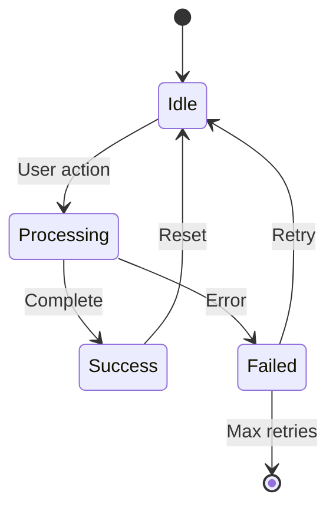

> ** Dual-Format Note**:
>
> This MD template is the **primary source** for human workflow.
> - **For Autopilot**: See `PRD-MVP-TEMPLATE.yaml` (YAML template)
> - **Shared Validation**: Both formats are validated by `PRD_MVP_SCHEMA.yaml`
> - **Complete Explanation**: See [DUAL_MVP_TEMPLATES_ARCHITECTURE.md](../DUAL_MVP_TEMPLATES_ARCHITECTURE.md) for full comparison of formats, authority hierarchy, and when to use each.
> ---

<!--
  AI_CONTEXT_START
Role: AI Product Manager
Objective: Create a streamlined MVP Product Requirements Document.
Constraints:
  - Focus on hypothesis validation and core user stories
  - Keep functional requirements atomic and testable
  - Do not split file; keep it monolithic
AI_CONTEXT_END
-->

> **MVP-First Template** — Single-file PRD for the **MVP → PROD → NEW MVP** lifecycle.
> Use this template for each iteration cycle with 5-15 core features.

> **Lifecycle**: Each PRD corresponds to ONE BRD cycle. After production deployment and feedback collection, create NEW PRD for next features (linked to NEW BRD).

> **Validation Note**: MVP templates use ≥90% score thresholds. See `scripts/README.md` → "MVP Template Validation" for guidance.

> References: Schema `PRD_MVP_SCHEMA.yaml` | Rules `PRD_MVP_CREATION_RULES.md`, `PRD_MVP_VALIDATION_RULES.md` | Matrix `PRD-00_TRACEABILITY_MATRIX-TEMPLATE.md`

# PRD-NN: [MVP Product/Feature Name]

**[WARN] MVP Scope**: This PRD focuses on core hypothesis validation. Use MVP only.

**Upstream guardrails**: Use only existing upstream artifacts (BRD/ADR/EARS/BDD/SYS); set `null` only when a layer is absent.

**Thresholds pointer**: Define thresholds once; reuse via `@threshold:` tags; follow `THRESHOLD_NAMING_RULES.md`.

**User-story scope**: PRD holds role/story summaries; detailed behaviors live in EARS and executable scenarios in BDD.

## 1. Document Control

| Item | Details |
|------|---------|
| **Status** | Draft / Review / Approved |
| **Version** | 0.1.0 |
| **Date Created** | YYYY-MM-DDTHH:MM:SS |
| **Last Updated** | YYYY-MM-DDTHH:MM:SS |
| **Author** | [Product Manager Name] |
| **Reviewer** | [Technical Lead Name] |
| **Approver** | [Stakeholder Name] |
| **BRD Reference** | @brd: BRD.NN.TT.SS |
| **Priority** | High |
| **Target Release** | [MVP Launch Date] |
| **Estimated Effort** | [X person-weeks] |
| **SYS-Ready Score** | [Score]/100 (Target: ≥90) |
| **EARS-Ready Score** | [Score]/100 (Target: ≥90) |

### 1.1 Document Revision History

| Version | Date | Author | Changes Made |
|---------|------|--------|--------------|
| 0.1.0 | YYYY-MM-DDTHH:MM:SS | [Author] | Initial MVP draft |

---

## 2. Executive Summary

[2-3 sentences: What problem does this MVP solve? Who benefits? What's the expected business impact?]

### 2.1 MVP Hypothesis

**We believe that** [target users] **will** [key behavior/outcome] **if we** [MVP solution].

**We will know this is true when** [measurable validation criteria].

### 2.2 Timeline Overview

| Phase | Dates | Duration |
|-------|-------|----------|
| Development | YYYY-MM-DDTHH:MM:SS to YYYY-MM-DDTHH:MM:SS | X weeks |
| Testing | YYYY-MM-DDTHH:MM:SS to YYYY-MM-DDTHH:MM:SS | X weeks |
| MVP Launch | YYYY-MM-DDTHH:MM:SS | - |
| Validation Period | +30 days post-launch | 30 days |

---

## 3. Problem Statement

### 3.1 Current State

[Brief description of the current situation and pain points - 3-5 bullet points]

- [Pain point 1]: [Impact]
- [Pain point 2]: [Impact]
- [Pain point 3]: [Impact]

### 3.2 Business Impact

[Quantify the problem - use available data]

- Revenue/efficiency impact: [estimate]
- Customer satisfaction impact: [estimate]
- Competitive disadvantage: [brief description]

### 3.3 Opportunity

[1-2 sentences: What market or business opportunity does this MVP address?]

---

## 4. Target Audience & User Personas

### 4.1 Primary User Persona

**[Persona Name]** - [Role/Description]

- **Key characteristic**: [What defines this user]
- **Main pain point**: [What problem they face]
- **Success criteria**: [What outcome they need]
- **Usage frequency**: [How often they'll use the product]

### 4.2 Secondary Users (Optional)

[List any secondary users if relevant for MVP - keep brief]

---

## 5. Success Metrics (KPIs)

### 5.1 MVP Validation Metrics (30-Day)

| Metric | Baseline | Target | Measurement |
|--------|----------|--------|-------------|
| [Adoption metric] | 0 | [target] | [how measured] |
| [Engagement metric] | N/A | [target] | [how measured] |
| [Satisfaction metric] | N/A | ≥[target]/5 | User survey |

### 5.2 Business Success Metrics (90-Day)

| Metric | Target | Decision Threshold |
|--------|--------|-------------------|
| [Primary business metric] | [target] | < [threshold] = Pivot |
| [Secondary metric] | [target] | < [threshold] = Iterate |

### 5.3 Go/No-Go Decision Gate

**At MVP+90 days**, evaluate:
- [PASS] **Proceed to Full Product**: All targets met
-  **Iterate**: 60-80% of targets met
- [FAIL] **Pivot/Shutdown**: <60% of targets met

---

## 6. Goals & Objectives

### 6.1 Primary Business Goals

| Goal ID | Goal | Metric | Target | Timeline |
|---------|------|--------|--------|----------|
| PRD.NN.23.01 | [Primary goal] | [Metric] | [Target] | MVP Launch |
| PRD.NN.23.02 | [Secondary goal] | [Metric] | [Target] | MVP+30d |

### 6.2 Secondary Objectives

| Objective ID | Objective | Priority | Success Criteria |
|--------------|-----------|----------|------------------|
| PRD.NN.23.03 | [Objective] | P2 | [Criteria] |

### 6.3 Stretch Goals (Optional)

| Goal | Condition | Benefit |
|------|-----------|---------|
| [Stretch goal] | If MVP metrics exceed by 50% | [Benefit] |

---

## 7. Scope & Requirements

### 7.1 In-Scope (MVP Core Features)

[List 5-15 must-have features for MVP - prioritized]

| # | Feature | Priority | Description |
|---|---------|----------|-------------|
| 1 | [Feature name] | P1-Must | [Brief description] |
| 2 | [Feature name] | P1-Must | [Brief description] |
| 3 | [Feature name] | P1-Must | [Brief description] |
| 4 | [Feature name] | P2-Should | [Brief description] |
| 5 | [Feature name] | P2-Should | [Brief description] |

### 7.2 Dependencies (keep short)
- Technical: [System/API/infra] — status, impact
- Business: [Org/process prerequisite] — owner, date
- External: [Vendor/regulatory] — status, impact

### 7.3 Out-of-Scope (Next MVP Cycle)
- [Feature]: Candidate for BRD-NN+1 - [reason]
- [Feature]: Candidate for BRD-NN+1 - [reason]
- [Integration]: Not included in this cycle - [reason]

> **Lifecycle Note**: Out-of-scope items become candidates for the next BRD/PRD cycle.

---

## 8. User Stories & User Roles

**Scope split**: PRD = roles + story summaries; EARS = detailed behaviors; BDD = executable scenarios.

### 8.1 Core User Stories

| ID | User Story | Priority | Acceptance Criteria |
|----|------------|----------|---------------------|
| PRD.NN.09.01 | As a [persona], I want to [action], so that [benefit] | P1 | [Brief criteria] |
| PRD.NN.09.02 | As a [persona], I want to [action], so that [benefit] | P1 | [Brief criteria] |
| PRD.NN.09.03 | As a [persona], I want to [action], so that [benefit] | P1 | [Brief criteria] |
| PRD.NN.09.04 | As a [persona], I want to [action], so that [benefit] | P2 | [Brief criteria] |
| PRD.NN.09.05 | As a [persona], I want to [action], so that [benefit] | P2 | [Brief criteria] |

### 8.2 User Roles (brief)
| Role | Purpose | Permissions |
|------|---------|-------------|
| [Role] | [What they do] | [Access level] |
| [Role] | [What they do] | [Access level] |

### 8.3 Story Summary

| Priority | Count | Notes |
|----------|-------|-------|
| P1 (Must-Have) | [X] | Required for MVP launch |
| P2 (Should-Have) | [X] | Include if time permits |
| **Total** | [X] | |

---

## 9. Functional Requirements

### 9.1 Core Capabilities (brief)
| ID | Capability | Success Criteria |
|----|------------|------------------|
| PRD.NN.01.01 | [Capability name] | [How to validate] |
| PRD.NN.01.02 | [Capability name] | [How to validate] |
| PRD.NN.01.03 | [Capability name] | [How to validate] |

### 9.2 User Journey (happy path)
1. User [action] → System [response]
2. User [action] → System [response]
3. [Outcome]

### 9.3 Error Handling (MVP)
| Error Scenario | User Experience | System Behavior |
|----------------|-----------------|-----------------|
| [Error type] | [What user sees] | [What system does] |

### 9.4 Required Diagram Contract (MVP)

For PRD, include:
- `@diagram: c4-l2` (container-level product architecture)
- `@diagram: dfd-l1` (product data-flow paths)
- At least one key `sequenceDiagram` for primary user journey and one error path branch.

Required declaration block:

```markdown
@diagram: c4-l2
@diagram: dfd-l1
@diagram: sequence-sync
@diagram-scope: product-interaction
@diagram-lifecycle: mvp-prod-newmvp
```

---

## 10. Customer-Facing Content & Messaging (MANDATORY)

> **Status**: BLOCKING - This section must contain substantive content

### 10.1 Product Positioning

**Value Proposition**: [Clear statement of unique value]

**Target Positioning**: [Market position vs competitors]

### 10.2 Key Messaging Themes

| Theme | Message | Target Audience | Channel |
|-------|---------|-----------------|---------|
| [Theme 1] | [Core message] | [Persona] | [Marketing/In-app] |
| [Theme 2] | [Core message] | [Persona] | [Email/Support] |

### 10.3 User-Facing Content Requirements

| Content Type | Description | Owner | Status |
|--------------|-------------|-------|--------|
| Help text & tooltips | [Description] | [PM/UX] | Draft |
| Error messages | [Description] | [PM/Dev] | Draft |
| Success confirmations | [Description] | [PM/UX] | Draft |
| Onboarding content | [Description] | [PM/Marketing] | Draft |

### 10.4 Release Notes Template

**Version**: [X.Y.Z]
**Release Date**: YYYY-MM-DD

**New Features**:
- [Feature 1]: [User-facing description]

**Improvements**:
- [Improvement 1]: [User-facing description]

**Known Issues**:
- [Issue 1]: [Workaround if any]

---

## 11. Acceptance Criteria

### 11.1 Acceptance Criteria (trimmed)
- Business: P1 features deliver observable user value; KPIs instrumented.
- Technical: Core journeys pass; perf targets met; logging/monitoring enabled; security baseline checked.
- QA: Critical bugs resolved; basic docs/support ready; analytics tracking configured.
- [ ] User feedback collected
- [ ] Initial satisfaction survey

---

## 12. Constraints & Assumptions

### 12.1 Constraints
- Budget/timeline limits: [X]
- Resource limits: [team/skills]
- Technical constraints: [stack/infra]

### 12.2 Assumptions
- Key assumptions (H/M/L risk): [list 2-3]

**Constraints/Risks (short)**: surface single blockers; pair each risk with owner and trigger.

---

## 13. Risk Assessment
| Risk | Likelihood | Impact | Mitigation |
|------|------------|--------|------------|
| [Risk 1] | H/M/L | H/M/L | [Mitigation] |
| [Risk 2] | H/M/L | H/M/L | [Mitigation] |

---

## 14. Success Definition

### 14.1 Go-Live Criteria

| Category | Criterion | Threshold | Validation |
|----------|-----------|-----------|------------|
| Functional | All P1 features complete | 100% | UAT signoff |
| Quality | Critical bugs resolved | 0 open | QA signoff |
| Performance | Meets baseline metrics | >=90% | Load test |
| Security | Passes security baseline | Pass | Security review |

### 14.2 Post-Launch Validation

| Metric | Baseline | Day 7 Target | Day 30 Target |
|--------|----------|--------------|---------------|
| [Adoption metric] | 0 | [target] | [target] |
| [Engagement metric] | N/A | [target] | [target] |
| [Error rate] | N/A | <1% | <0.5% |

### 14.3 Measurement Timeline

| Milestone | Date | Metrics Evaluated | Decision Gate |
|-----------|------|-------------------|---------------|
| MVP Launch | T+0 | Go-live criteria | Launch/No-Launch |
| Week 1 Review | T+7 | Early adoption | Continue/Iterate |
| Month 1 Review | T+30 | Full validation | Proceed/Pivot/Stop |

---

## 15. Stakeholders & Communication

### 15.1 Core Team

| Role | Name | Responsibility | Contact |
|------|------|----------------|---------|
| Product Owner | [Name] | Requirements, prioritization | [email] |
| Tech Lead | [Name] | Architecture, implementation | [email] |
| QA Lead | [Name] | Testing, quality gates | [email] |
| UX Lead | [Name] | User experience, design | [email] |

### 15.2 Stakeholders

| Stakeholder | Interest | Influence | Communication |
|-------------|----------|-----------|---------------|
| [Stakeholder 1] | [Interest] | High | Weekly updates |
| [Stakeholder 2] | [Interest] | Medium | Bi-weekly demos |

### 15.3 Communication Plan

| Audience | Channel | Frequency | Content | Owner |
|----------|---------|-----------|---------|-------|
| Core Team | Daily standup | Daily | Progress, blockers | PM |
| Stakeholders | Status report | Weekly | Metrics, risks | PM |
| Executives | Dashboard | Weekly | KPIs, decisions | PM |

---

## 16. Implementation Approach

### 16.1 MVP Development Phases

| Phase | Duration | Deliverables | Success Criteria |
|-------|----------|--------------|------------------|
| **Phase 1: Core** | [X] weeks | [Core features] | [Criteria] |
| **Phase 2: Polish** | [X] weeks | [Secondary features, bug fixes] | [Criteria] |
| **Phase 3: Launch** | [X] days | [Deployment, monitoring] | [Criteria] |

### 16.2 Testing Strategy (MVP)

| Test Type | Coverage | Responsible |
|-----------|----------|-------------|
| Unit Tests | [X]% minimum | Development |
| Integration Tests | Critical paths | Development |
| UAT | Core user stories | Product/QA |
| Performance | Baseline metrics | QA |

---

## 17. Budget & Resources

### 17.1 MVP Development Cost

| Category | Estimate | Notes |
|----------|----------|-------|
| Development | $[X] | [X] person-weeks × rate |
| Infrastructure (3 months) | $[X] | Cloud hosting, services |
| Third-party services | $[X] | APIs, tools |
| **Total MVP Cost** | **$[X]** | |

### 17.2 ROI Hypothesis

**Investment**: $[MVP cost]

**Expected Return**: [Describe expected value if MVP succeeds]

**Payback Period**: [Estimated timeframe if hypothesis validated]

**Decision Logic**: If MVP metrics met → Full product investment of $[X] justified.

---

## 18. Traceability

### 18.1 Upstream References

| Source | Document | Relationship |
|--------|----------|--------------|
| BRD | @brd: BRD.NN.TT.SS | Business requirements source |
| Strategy | [Strategic document] | Strategic alignment |

### 18.2 Downstream Artifacts

| Artifact Type | Status | Notes |
|---------------|--------|-------|
| EARS | TBD | Created after PRD approval |
| BDD | TBD | Created after EARS |
| ADR | TBD | Created for selected architecture decisions |

### 18.3 Traceability Tags

```markdown
@brd: BRD.NN.TT.SS
```

### 18.4 Architecture Decision Requirements

> **Purpose**: Elaborate BRD Section 7.2 topics with technical options for ADR evaluation.

| Topic Area | BRD Reference | Status | Business Driver | Options to Evaluate |
|------------|---------------|--------|-----------------|---------------------|
| Infrastructure | BRD.NN.32.01 | Pending | [Driver] | [Options] |
| Data Architecture | BRD.NN.32.02 | Pending | [Driver] | [Options] |
| Integration | BRD.NN.32.03 | Pending | [Driver] | [Options] |
| Security | BRD.NN.32.04 | Pending | [Driver] | [Options] |
| Observability | BRD.NN.32.05 | Pending | [Driver] | [Options] |
| AI/ML | BRD.NN.32.06 | N/A | [Driver] | [Options] |
| Technology Selection | BRD.NN.32.07 | Pending | [Driver] | [Options] |

**Note**: Do NOT reference specific ADR numbers (ADR-01, etc.) - ADRs don't exist yet.

### 18.5 Cross-Links (Same-Layer)

Use machine-parseable tags to document relationships between PRDs:
- `@depends: PRD-NN` — hard prerequisite PRD(s) that must be satisfied first.
- `@discoverability: PRD-NN (short rationale); PRD-NN (short rationale)` — related PRDs with brief reasons to aid AI search and ranking.

---

## 19. References

### 19.1 Internal Documentation

| Document | Location | Purpose |
|----------|----------|---------|
| BRD-NN | `../01_BRD/BRD-NN_*.md` | Business requirements source |
| Architecture | [Link] | System architecture |

### 19.2 External Standards

| Standard | Organization | Relevance |
|----------|--------------|-----------|
| [Standard] | [Org] | [How used] |

### 19.3 Domain References

| Reference | Type | Notes |
|-----------|------|-------|
| [Industry standard] | Specification | [Compliance requirement] |

### 19.4 Technology References

| Technology | Documentation | Version |
|------------|---------------|---------|
| [Framework] | [URL] | [Version] |

---

## 20. EARS Enhancement Appendix

> **Purpose**: Provides structured requirements for EARS transformation.

### 20.1 Timing Profile Matrix

| Operation | p50 | p95 | p99 | Unit | Trigger Event | Notes |
|-----------|-----|-----|-----|------|---------------|-------|
| API response | [X] | [X] | [X] | ms | User request | Core endpoints |
| Page load | [X] | [X] | [X] | s | Navigation | Primary screens |
| Data sync | [X] | [X] | [X] | s | Background | Batch operations |

### 20.2 Boundary Value Matrix

| Threshold | Operator | Value | At Boundary | Above | Below |
|-----------|----------|-------|-------------|-------|-------|
| Max items | <= | 100 | Accept | Reject | Accept |
| Min length | >= | 1 | Accept | Accept | Reject |
| Rate limit | < | 1000/min | Accept | Reject | Accept |

### 20.3 State Transition Diagram



### 20.4 Fallback Path Documentation

| Dependency | Failure Mode | Detection | Fallback Behavior | Timeout | Recovery |
|------------|--------------|-----------|-------------------|---------|----------|
| [API] | Timeout | >30s | Cache/default | 30s | Auto-retry |
| [Service] | Error 5xx | Status code | Graceful degradation | - | Alert + manual |

### 20.5 EARS-Ready Checklist

- [ ] All timing requirements have p50/p95/p99 values
- [ ] All boundary conditions have explicit operators
- [ ] State transitions include error states
- [ ] All external dependencies have fallback paths
- [ ] Requirements are testable (Given-When-Then derivable)

---

## 21. Quality Assurance & Testing Strategy

> **Note**: Quality attributes and testing strategy for MVP.

### 21.1 Quality Standards (MVP)

| Standard | Target | Measurement |
|----------|--------|-------------|
| Code coverage | >=60% | Automated CI |
| Code review | 100% | PR requirement |
| Security baseline | Pass | Security scan |
| Accessibility | WCAG 2.1 AA | Audit tool |

### 21.2 Performance Baseline

| Metric | Target | Notes |
|--------|--------|-------|
| API Response Time (p95) | < [X]ms | Core endpoints |
| Page Load Time | < [X]s | Primary screens |
| Concurrent Users | [X] | MVP capacity |

### 21.3 Security Baseline

- [ ] Authentication approach noted
- [ ] Encryption at transit/rest
- [ ] Input validation in place

### 21.4 Availability Baseline

- Uptime target: [95-99]% (MVP)
- Planned maintenance window: [if any]

### 21.5 Testing Strategy

| Test Type | Scope | Coverage | Automation | Responsible |
|-----------|-------|----------|------------|-------------|
| Unit | Business logic | >=70% | Required | Dev |
| Integration | API endpoints | Critical paths | Required | Dev |
| E2E | User journeys | P1 scenarios | Encouraged | QA |
| Performance | Load/stress | Baseline metrics | Required | QA |
| Security | OWASP Top 10 | Critical | Required | Security |

### 21.6 Quality Gates

- [ ] All P1 functional requirements have test coverage
- [ ] No critical/high severity bugs open
- [ ] Performance baseline met
- [ ] Security scan passed
- [ ] Accessibility audit completed

---

## Appendix A: Future Roadmap (Next MVP Cycle)

### A.1 Phase 2 Features (If MVP Succeeds)

| Feature | Priority | Estimated Effort | Dependency |
|---------|----------|------------------|------------|
| [Feature] | P1 | [X] weeks | MVP complete |
| [Feature] | P2 | [X] weeks | [Dependency] |

### A.2 Scaling Considerations

[Brief notes on what needs to change for full product scale]

- Infrastructure: [Scaling approach]
- Performance: [Optimization needs]
- Features: [Expansion areas]

---

## Appendix B: Glossary

| Term | Definition | Context |
|------|------------|---------|
| [Term 1] | [Definition relevant to this MVP] | Section X |
| [Term 2] | [Definition relevant to this MVP] | Section X |

**Master Glossary Reference**: See [BRD-00_GLOSSARY.md](../01_BRD/BRD-00_GLOSSARY.md)

---

## Appendix C: MVP Lifecycle Reference

> **Lifecycle Principle**: Each PRD represents ONE iteration cycle. New features require a NEW PRD.

### C.1 Lifecycle Phases

| Phase | Duration | Focus | PRD Output |
|-------|----------|-------|------------|
| **MVP** | 1-2 weeks | Core features (5-15) | This PRD → EARS → Implementation |
| **PROD** | 30-90 days | Operate, measure, collect feedback | Production metrics, user feedback |
| **NEW MVP** | 1-2 weeks | Next feature set | Create PRD-02, PRD-03, etc. |

### C.2 When to Create a New PRD

- [ ] Current PRD features are in production
- [ ] New feature set identified (next 5-15 features)
- [ ] Production feedback collected and analyzed
- [ ] Business case for new iteration approved

### C.3 Cross-PRD Traceability

When creating the next PRD iteration:

1. **Link to previous cycle**: Add `@depends: PRD-01` in Section 18.5
2. **Reference production metrics**: Include validation data from previous cycle
3. **Carry forward learnings**: Document technical debt or deferred features
4. **Update index**: Add new PRD to PRD-00_index.md with cross-references

### C.4 Iteration Cycle Example

```
PRD-01 (MVP) → Production → PRD-02 (New Features) → Production → PRD-03 ...
     ↓                           ↓                         ↓
   EARS-01                     EARS-02                   EARS-03
```

**Note**: There is no "full PRD" template. This MVP template IS the standard. Expansion happens through NEW PRDs, not template migration.

---

**Document Version**: 0.1.0
**Template Version**: 1.1 (MVP - 21 sections)
**Last Updated**: 2026-02-26
**Maintained By**: [Product Manager]

---

> **MVP Template Notes**:
> - This is the standard PRD template (21 sections)
> - Single file - no sectioning per user requirement
> - Maintains ai_dev_flow framework compliance
> - **Lifecycle**: MVP → PROD → NEW MVP (no separate "full PRD" template)
