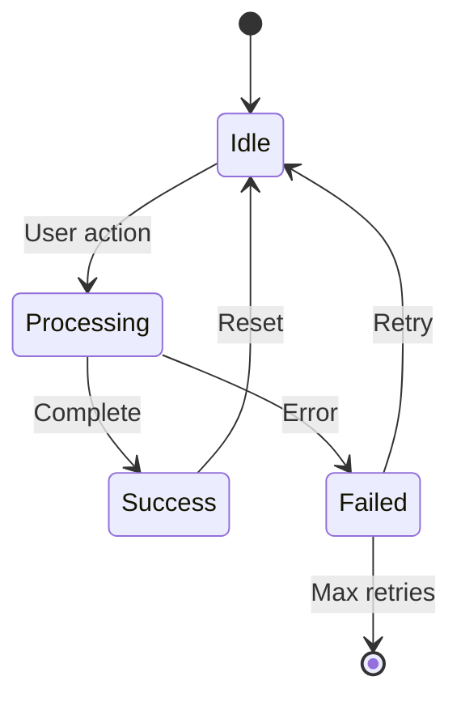

# PRD-MVP-TEMPLATE Fix Plan

**Created**: 2026-02-25
**Status**: Completed
**Completed**: 2026-02-26
**Version**: 2.1 (Added gaps #25-27: doc-prd mixed refs, doc-prd-autopilot lines, YAML↔MD sync)
**Target Files**:
- `PRD-MVP-TEMPLATE.md` (primary)
- `PRD-MVP-TEMPLATE.yaml` (autopilot)
- `PRD_MVP_VALIDATION_RULES.md`
- `PRD_MVP_SCHEMA.yaml`
- `PRD_MVP_CREATION_RULES.md`
- `PRD_MVP_QUALITY_GATE_VALIDATION.md`
- `README.md`

## Overview

Fix identified gaps in `/opt/data/docs_flow_framework/ai_dev_ssd_flow/02_PRD/` documents and align template, validation rules, schema, and skills to a consistent **21-section** MVP structure.

## Target Files

| File | Type | Priority |
|------|------|----------|
| `PRD-MVP-TEMPLATE.md` | MD Template (human workflow) | P1 |
| `PRD_MVP_VALIDATION_RULES.md` | Validation Rules | P1 |
| `PRD_MVP_SCHEMA.yaml` | Schema Definition | P1 |
| `PRD_MVP_CREATION_RULES.md` | Creation Rules | P1 |
| `PRD-MVP-TEMPLATE.yaml` | YAML Template (autopilot) | P1 |
| `PRD_MVP_QUALITY_GATE_VALIDATION.md` | Quality Gate Rules | P2 |
| `README.md` | Layer Documentation | P2 |
| `doc-prd*/SKILL.md` | Skills (6 files) | P2 |
| `doc-prd_quickref.md` | Quick Reference | P2 |

## Reference Files

- `BRD-MVP-TEMPLATE.md` (for alignment reference - 18 sections)
- `ID_NAMING_STANDARDS.md` (for element ID format)

---

## Gap Summary

| # | Gap | Severity | Location | Phase |
|---|-----|----------|----------|-------|
| 1 | Duplicate YAML frontmatter in template | Critical | PRD-MVP-TEMPLATE.md lines 1-19, 39-62 | 1 |
| 2 | Duplicate YAML frontmatter in validation rules | Critical | PRD_MVP_VALIDATION_RULES.md lines 1-13, 22-34 | 1 |
| 3 | Duplicate required_sections in schema | Critical | PRD_MVP_SCHEMA.yaml lines 131-249, 346-433 | 1 |
| 4 | **Duplicate YAML frontmatter in creation rules** | Critical | PRD_MVP_CREATION_RULES.md lines 1-14, 22-34 | 1 |
| 5 | Section count mismatch (template=19, validation=21, schema=21) | Critical | All files | 2 |
| 6 | Missing Section 6: Goals & Objectives | High | PRD-MVP-TEMPLATE.md | 3 |
| 7 | Wrong Section 10: Architecture Requirements vs Customer-Facing Content | Critical | PRD-MVP-TEMPLATE.md | 3 |
| 8 | Missing Section 14: Success Definition | High | PRD-MVP-TEMPLATE.md | 3 |
| 9 | Missing Section 15: Stakeholders & Communication | High | PRD-MVP-TEMPLATE.md | 3 |
| 10 | Missing Section 19: References | Medium | PRD-MVP-TEMPLATE.md | 3 |
| 11 | Missing Section 20: EARS Enhancement Appendix | High | PRD-MVP-TEMPLATE.md | 3 |
| 12 | Missing Section 21: Quality Assurance & Testing Strategy | High | PRD-MVP-TEMPLATE.md | 3 |
| 13 | Duplicate section 6.2/6.4 Dependencies | Medium | PRD-MVP-TEMPLATE.md lines 211-230 | 1 |
| 14 | Duplicate paragraph in README | Low | README.md lines 248-250 | 4 |
| 15 | YAML template minimal structure | Medium | PRD-MVP-TEMPLATE.yaml | 4.5 |
| 16 | Validator skill says 17 sections, should be 21 | High | doc-prd-validator/SKILL.md | 5 |
| 17 | Quickref outdated paths | Low | doc-prd_quickref.md | 5 |
| 18 | Missing version metadata in template | Medium | PRD-MVP-TEMPLATE.md | 6 |
| 19 | **Architecture Requirements relocation undefined** | High | PRD-MVP-TEMPLATE.md | 3 |
| 20 | **Appendices structure undefined** | Medium | PRD-MVP-TEMPLATE.md | 3 |
| 21 | **Missing Downstream Impact Analysis** | Medium | Fix Plan Phase 0 | 0 |
| 22 | **CHECK numbers mapping not defined** | Medium | PRD_MVP_VALIDATION_RULES.md | 5 |
| 23 | **doc-prd-reviewer Check #6 may need update** | Low | doc-prd-reviewer/SKILL.md | 5 |
| 24 | **doc-prd-fixer phases may need update** | Low | doc-prd-fixer/SKILL.md | 5 |
| 25 | **doc-prd/SKILL.md has MIXED references (17 AND 21)** | High | doc-prd/SKILL.md:71,108,125,519 | 5 |
| 26 | **doc-prd-autopilot/SKILL.md specific lines** | High | doc-prd-autopilot/SKILL.md:352,876 | 5 |
| 27 | **No YAML ↔ MD sync verification step** | Medium | Fix Plan Phase 7 | 7 |

---

## Phase 0: Pre-Implementation

### 0.1 Backup All Files

```bash
# Create backup directory
mkdir -p /opt/data/docs_flow_framework/ai_dev_ssd_flow/02_PRD/.backup_2026-02-25

# Backup templates and rules
cp PRD-MVP-TEMPLATE.md .backup_2026-02-25/
cp PRD-MVP-TEMPLATE.yaml .backup_2026-02-25/
cp PRD_MVP_VALIDATION_RULES.md .backup_2026-02-25/
cp PRD_MVP_CREATION_RULES.md .backup_2026-02-25/
cp PRD_MVP_QUALITY_GATE_VALIDATION.md .backup_2026-02-25/
cp PRD_MVP_SCHEMA.yaml .backup_2026-02-25/
cp README.md .backup_2026-02-25/

# Backup skills
cp -r /opt/data/docs_flow_framework/.claude/skills/doc-prd* .backup_2026-02-25/
```

### 0.2 Risk Assessment

| Risk | Likelihood | Impact | Mitigation |
|------|------------|--------|------------|
| Existing PRDs reference old section numbers | Medium | High | Document migration guide |
| Autopilot fails with new structure | Medium | High | Update YAML template in Phase 4.5 |
| Skills produce invalid output | Medium | Medium | Update all skills in Phase 5 |
| Validation rules mismatch | Low | Medium | Verify CHECK numbers align |
| Cross-document links break | Low | Low | Update references in Phase 4 |

### 0.3 Rollback Plan

**If issues occur during implementation:**

1. **Immediate Rollback**:
   ```bash
   # Restore all files
   cp .backup_2026-02-25/PRD-MVP-TEMPLATE.md ./
   cp .backup_2026-02-25/PRD-MVP-TEMPLATE.yaml ./
   cp .backup_2026-02-25/PRD_MVP_VALIDATION_RULES.md ./
   cp .backup_2026-02-25/PRD_MVP_SCHEMA.yaml ./
   cp .backup_2026-02-25/README.md ./

   # Restore skills
   cp -r .backup_2026-02-25/doc-prd* /opt/data/docs_flow_framework/.claude/skills/
   ```

2. **Partial Rollback**: Revert only affected files from backup

3. **Post-Rollback**: Re-run validators to confirm restored state

### 0.4 Downstream Impact Analysis

| Downstream Artifact | Impact | Action Required |
|--------------------|--------|-----------------|
| Existing PRD documents | Section numbers changed | Add migration note to plan |
| EARS templates | Reference PRD sections | Verify EARS-MVP-TEMPLATE.md references |
| Validation scripts | CHECK numbers reference sections | Verify PRD_MVP_VALIDATION_RULES.md |
| Autopilot workflows | Generate from YAML template | Update YAML template (Phase 4.5) |
| doc-prd-reviewer | Check #6 Section Completeness | Verify 21-section check |
| doc-prd-fixer | Fix phases reference sections | Verify section creation logic |
| Quality Gate validation | Corpus-level checks | Verify PRD_MVP_QUALITY_GATE_VALIDATION.md |

### 0.5 Decision: Target Section Count

**Analysis**:
- Current template: 19 sections (but some wrong)
- Validation rules: 21 sections
- Schema: 21 sections
- doc-prd skill: 21 sections

**Decision**: Align to **21 sections** as per validation rules, schema, and skill.

---

## Phase 1: Critical Structural Fixes

### 1.1 Remove Duplicate YAML Frontmatter in Template

**File**: `PRD-MVP-TEMPLATE.md`

**Current State**:
- Lines 1-19: First (correct) YAML frontmatter
- Lines 29-38: AI_CONTEXT HTML comment block
- Lines 39-62: Second (duplicate) YAML frontmatter inside HTML comment

**Action**: Delete lines 39-62 (second frontmatter block)

**Keep**: Lines 1-19 (first frontmatter) and lines 29-38 (AI_CONTEXT)

### 1.2 Remove Duplicate YAML Frontmatter in Validation Rules

**File**: `PRD_MVP_VALIDATION_RULES.md`

**Current State**:
- Lines 1-13: First YAML frontmatter (valid)
- Lines 22-34: Second YAML frontmatter (duplicate)

**Action**: Delete lines 22-34 (second frontmatter block)

### 1.3 Remove Duplicate required_sections in Schema

**File**: `PRD_MVP_SCHEMA.yaml`

**Current State**:
- Lines 131-249: First required_sections block
- Lines 346-433: Second required_sections block (duplicate)

**Action**: Delete lines 346-433 (second duplicate block)

### 1.4 Remove Duplicate YAML Frontmatter in Creation Rules

**File**: `PRD_MVP_CREATION_RULES.md`

**Current State**:
- Lines 1-14: First YAML frontmatter (valid)
- Lines 22-34: Second YAML frontmatter (duplicate)

**Action**: Delete lines 22-34 (second frontmatter block)

### 1.5 Fix Duplicate Section 6.2/6.4 Dependencies in Template

**File**: `PRD-MVP-TEMPLATE.md`

**Current State**:
- Line ~211: `### 6.2 Dependencies (keep short)`
- Line ~223: `### 6.3 Out-of-Scope (Next MVP Cycle)`
- Line ~223: `### 6.4 Dependencies` (DUPLICATE)

**Action**: Delete duplicate section 6.4 Dependencies (keep 6.2)

---

## Phase 2: Define Target 21-Section Structure

### 2.1 Target Section Mapping

Based on validation rules, schema, and doc-prd skill:

| # | Section Title | Validation | Schema | Template Status |
|---|--------------|------------|--------|-----------------|
| 1 | Document Control | Required | Required | EXISTS (correct) |
| 2 | Executive Summary | Required | Required | EXISTS (correct) |
| 3 | Problem Statement | Required | Required | EXISTS (correct) |
| 4 | Target Audience & User Personas | Required | Required | EXISTS (correct) |
| 5 | Success Metrics (KPIs) | Required | Required | EXISTS (correct) |
| 6 | Goals & Objectives | Required | Required | **MISSING** |
| 7 | Scope & Requirements | Required | Required | EXISTS as 6 (renumber) |
| 8 | User Stories & User Roles | Required | Required | EXISTS as 7 (renumber) |
| 9 | Functional Requirements | Required | Required | EXISTS as 8 (renumber) |
| 10 | Customer-Facing Content & Messaging (MANDATORY) | Required | Required | **WRONG** - has Architecture |
| 11 | Acceptance Criteria | Required | Required | EXISTS as 14 (renumber) |
| 12 | Constraints & Assumptions | Required | Required | EXISTS as 11 (renumber) |
| 13 | Risk Assessment | Required | Required | EXISTS as 12 (renumber) |
| 14 | Success Definition | Required | Required | **MISSING** |
| 15 | Stakeholders & Communication | Required | Required | **MISSING** |
| 16 | Implementation Approach | Required | Required | EXISTS as 13 (renumber) |
| 17 | Budget & Resources | Required | Required | EXISTS as 15 (renumber) |
| 18 | Traceability | Required | Required | EXISTS as 16 (renumber) |
| 19 | References | Required | Required | **MISSING** |
| 20 | EARS Enhancement Appendix | Required | Required | **MISSING** |
| 21 | Quality Assurance & Testing Strategy | Required | Required | **MISSING** |

### 2.2 Template Architecture Requirements Relocation

**Current Section 10**: Architecture Requirements
**Target Section 10**: Customer-Facing Content & Messaging (MANDATORY)

**Resolution**: Move Architecture Requirements content to Section 18 (Traceability) subsection or create appendix.

---

## Phase 3: Add Missing Sections

### 3.1 Add Section 6: Goals & Objectives

Insert after Section 5 (Success Metrics):

```markdown
## 6. Goals & Objectives

### 6.1 Primary Business Goals

| Goal ID | Goal | Metric | Target | Timeline |
|---------|------|--------|--------|----------|
| PRD.NN.23.01 | [Primary goal] | [Metric] | [Target] | MVP Launch |
| PRD.NN.23.02 | [Secondary goal] | [Metric] | [Target] | MVP+30d |

### 6.2 Secondary Objectives

| Objective ID | Objective | Priority | Success Criteria |
|--------------|-----------|----------|------------------|
| PRD.NN.23.03 | [Objective] | P2 | [Criteria] |

### 6.3 Stretch Goals (Optional)

| Goal | Condition | Benefit |
|------|-----------|---------|
| [Stretch goal] | If MVP metrics exceed by 50% | [Benefit] |
```

### 3.2 Replace Section 10: Customer-Facing Content & Messaging (MANDATORY)

Replace current Architecture Requirements section:

```markdown
## 10. Customer-Facing Content & Messaging (MANDATORY)

> **Status**: BLOCKING - This section must contain substantive content

### 10.1 Product Positioning

**Value Proposition**: [Clear statement of unique value]

**Target Positioning**: [Market position vs competitors]

### 10.2 Key Messaging Themes

| Theme | Message | Target Audience | Channel |
|-------|---------|-----------------|---------|
| [Theme 1] | [Core message] | [Persona] | [Marketing/In-app] |
| [Theme 2] | [Core message] | [Persona] | [Email/Support] |

### 10.3 User-Facing Content Requirements

| Content Type | Description | Owner | Status |
|--------------|-------------|-------|--------|
| Help text & tooltips | [Description] | [PM/UX] | Draft |
| Error messages | [Description] | [PM/Dev] | Draft |
| Success confirmations | [Description] | [PM/UX] | Draft |
| Onboarding content | [Description] | [PM/Marketing] | Draft |

### 10.4 Release Notes Template

**Version**: [X.Y.Z]
**Release Date**: YYYY-MM-DD

**New Features**:
- [Feature 1]: [User-facing description]

**Improvements**:
- [Improvement 1]: [User-facing description]

**Known Issues**:
- [Issue 1]: [Workaround if any]
```

### 3.3 Add Section 14: Success Definition

Insert after Section 13 (Risk Assessment):

```markdown
## 14. Success Definition

### 14.1 Go-Live Criteria

| Category | Criterion | Threshold | Validation |
|----------|-----------|-----------|------------|
| Functional | All P1 features complete | 100% | UAT signoff |
| Quality | Critical bugs resolved | 0 open | QA signoff |
| Performance | Meets baseline metrics | >=90% | Load test |
| Security | Passes security baseline | Pass | Security review |

### 14.2 Post-Launch Validation

| Metric | Baseline | Day 7 Target | Day 30 Target |
|--------|----------|--------------|---------------|
| [Adoption metric] | 0 | [target] | [target] |
| [Engagement metric] | N/A | [target] | [target] |
| [Error rate] | N/A | <1% | <0.5% |

### 14.3 Measurement Timeline

| Milestone | Date | Metrics Evaluated | Decision Gate |
|-----------|------|-------------------|---------------|
| MVP Launch | T+0 | Go-live criteria | Launch/No-Launch |
| Week 1 Review | T+7 | Early adoption | Continue/Iterate |
| Month 1 Review | T+30 | Full validation | Proceed/Pivot/Stop |
```

### 3.4 Add Section 15: Stakeholders & Communication

Insert after Section 14:

```markdown
## 15. Stakeholders & Communication

### 15.1 Core Team

| Role | Name | Responsibility | Contact |
|------|------|----------------|---------|
| Product Owner | [Name] | Requirements, prioritization | [email] |
| Tech Lead | [Name] | Architecture, implementation | [email] |
| QA Lead | [Name] | Testing, quality gates | [email] |
| UX Lead | [Name] | User experience, design | [email] |

### 15.2 Stakeholders

| Stakeholder | Interest | Influence | Communication |
|-------------|----------|-----------|---------------|
| [Stakeholder 1] | [Interest] | High | Weekly updates |
| [Stakeholder 2] | [Interest] | Medium | Bi-weekly demos |

### 15.3 Communication Plan

| Audience | Channel | Frequency | Content | Owner |
|----------|---------|-----------|---------|-------|
| Core Team | Daily standup | Daily | Progress, blockers | PM |
| Stakeholders | Status report | Weekly | Metrics, risks | PM |
| Executives | Dashboard | Weekly | KPIs, decisions | PM |
```

### 3.5 Add Section 19: References

Insert after Section 18 (Traceability):

```markdown
## 19. References

### 19.1 Internal Documentation

| Document | Location | Purpose |
|----------|----------|---------|
| BRD-NN | `../01_BRD/BRD-NN_*.md` | Business requirements source |
| Architecture | [Link] | System architecture |

### 19.2 External Standards

| Standard | Organization | Relevance |
|----------|--------------|-----------|
| [Standard] | [Org] | [How used] |

### 19.3 Domain References

| Reference | Type | Notes |
|-----------|------|-------|
| [Industry standard] | Specification | [Compliance requirement] |

### 19.4 Technology References

| Technology | Documentation | Version |
|------------|---------------|---------|
| [Framework] | [URL] | [Version] |
```

### 3.6 Add Section 20: EARS Enhancement Appendix

Insert after Section 19:

```markdown
## 20. EARS Enhancement Appendix

> **Purpose**: Provides structured requirements for EARS transformation.

### 20.1 Timing Profile Matrix

| Operation | p50 | p95 | p99 | Unit | Trigger Event | Notes |
|-----------|-----|-----|-----|------|---------------|-------|
| API response | [X] | [X] | [X] | ms | User request | Core endpoints |
| Page load | [X] | [X] | [X] | s | Navigation | Primary screens |
| Data sync | [X] | [X] | [X] | s | Background | Batch operations |

### 20.2 Boundary Value Matrix

| Threshold | Operator | Value | At Boundary | Above | Below |
|-----------|----------|-------|-------------|-------|-------|
| Max items | <= | 100 | Accept | Reject | Accept |
| Min length | >= | 1 | Accept | Accept | Reject |
| Rate limit | < | 1000/min | Accept | Reject | Accept |

### 20.3 State Transition Diagram



### 20.4 Fallback Path Documentation

| Dependency | Failure Mode | Detection | Fallback Behavior | Timeout | Recovery |
|------------|--------------|-----------|-------------------|---------|----------|
| [API] | Timeout | >30s | Cache/default | 30s | Auto-retry |
| [Service] | Error 5xx | Status code | Graceful degradation | - | Alert + manual |

### 20.5 EARS-Ready Checklist

- [ ] All timing requirements have p50/p95/p99 values
- [ ] All boundary conditions have explicit operators
- [ ] State transitions include error states
- [ ] All external dependencies have fallback paths
- [ ] Requirements are testable (Given-When-Then derivable)
```

### 3.7 Add Section 21: Quality Assurance & Testing Strategy

Insert after Section 20:

```markdown
## 21. Quality Assurance & Testing Strategy

> **Note**: Moved from BRD as technical QA belongs at product level.

### 21.1 Quality Standards (MVP)

| Standard | Target | Measurement |
|----------|--------|-------------|
| Code coverage | >=60% | Automated CI |
| Code review | 100% | PR requirement |
| Security baseline | Pass | Security scan |
| Accessibility | WCAG 2.1 AA | Audit tool |

### 21.2 Testing Strategy

| Test Type | Scope | Coverage | Automation | Responsible |
|-----------|-------|----------|------------|-------------|
| Unit | Business logic | >=70% | Required | Dev |
| Integration | API endpoints | Critical paths | Required | Dev |
| E2E | User journeys | P1 scenarios | Encouraged | QA |
| Performance | Load/stress | Baseline metrics | Required | QA |
| Security | OWASP Top 10 | Critical | Required | Security |

### 21.3 Quality Gates

- [ ] All P1 functional requirements have test coverage
- [ ] No critical/high severity bugs open
- [ ] Performance baseline met
- [ ] Security scan passed
- [ ] Accessibility audit completed
```

### 3.8 Relocate Architecture Requirements

**Current Location**: Template Section 10 (Architecture Requirements)
**Target Location**: Section 18.4 (Traceability → Architecture Decision Requirements)

**Rationale**:
- Section 10 must be "Customer-Facing Content & Messaging (MANDATORY)" per validation rules
- Architecture decision topics belong in Traceability as they inform ADR creation
- This aligns with BRD Section 7.2 → PRD Section 18 → ADR workflow

**New Section 18.4 Content**:

```markdown
### 18.4 Architecture Decision Requirements

> **Purpose**: Elaborate BRD Section 7.2 topics with technical options for ADR evaluation.

| Topic Area | BRD Reference | Status | Business Driver | Options to Evaluate |
|------------|---------------|--------|-----------------|---------------------|
| Infrastructure | BRD.NN.32.01 | Pending | [Driver] | [Options] |
| Data Architecture | BRD.NN.32.02 | Pending | [Driver] | [Options] |
| Integration | BRD.NN.32.03 | Pending | [Driver] | [Options] |
| Security | BRD.NN.32.04 | Pending | [Driver] | [Options] |
| Observability | BRD.NN.32.05 | Pending | [Driver] | [Options] |
| AI/ML | BRD.NN.32.06 | N/A | [Driver] | [Options] |
| Technology Selection | BRD.NN.32.07 | Pending | [Driver] | [Options] |

**Note**: Do NOT reference specific ADR numbers (ADR-01, etc.) - ADRs don't exist yet.
```

### 3.9 Define Appendices Structure

After Section 21, add appendices for content that doesn't fit in numbered sections:

```markdown
---

## Appendix A: Future Roadmap (Next MVP Cycle)

### A.1 Phase 2 Features (If MVP Succeeds)

| Feature | Priority | Estimated Effort | Dependency |
|---------|----------|------------------|------------|
| [Feature] | P1 | [X] weeks | MVP complete |

### A.2 Scaling Considerations

[Brief notes on what needs to change for full product scale]

---

## Appendix B: Glossary

| Term | Definition | Context |
|------|------------|---------|
| [Term 1] | [Definition relevant to this MVP] | Section X |

**Master Glossary Reference**: See [BRD-00_GLOSSARY.md](../01_BRD/BRD-00_GLOSSARY.md)

---

## Appendix C: MVP Lifecycle Reference

> **Lifecycle Principle**: Each PRD represents ONE iteration cycle. New features require a NEW PRD.

| Phase | Duration | Focus | PRD Output |
|-------|----------|-------|------------|
| **MVP** | 1-2 weeks | Core features (5-15) | This PRD → EARS → Implementation |
| **PROD** | 30-90 days | Operate, measure, collect feedback | Production metrics |
| **NEW MVP** | 1-2 weeks | Next feature set | Create PRD-02, PRD-03, etc. |
```

---

## Phase 4: Renumber Existing Sections

After adding new sections, renumber existing sections to match target structure:

| Current # | Current Title | New # | Notes |
|-----------|--------------|-------|-------|
| 6 | Scope & Requirements | 7 | Renumber |
| 7 | User Stories & User Roles | 8 | Renumber |
| 8 | Functional Requirements | 9 | Renumber |
| 9 | Quality Attributes | (moved to 21.1) | Merge with QA |
| 10 | Architecture Requirements | (moved to 18.x) | Move to Traceability |
| 11 | Constraints & Assumptions | 12 | Renumber |
| 12 | Risk Assessment | 13 | Renumber |
| 13 | Implementation Approach | 16 | Renumber |
| 14 | Acceptance Criteria | 11 | Renumber |
| 15 | Budget & Resources | 17 | Renumber |
| 16 | Traceability | 18 | Renumber |
| 17 | Glossary | (Appendix B) | Move to appendix |
| 18 | Appendix A: Future Roadmap | (Appendix A) | Keep as appendix |
| 19 | MVP Lifecycle | (Appendix C) | Move to appendix |

### 4.1 Update README.md

- Remove duplicate paragraph (lines 248-250)
- Update section count from 17 to 21
- Update section reference table

---

## Phase 4.5: Update YAML Template

**File**: `PRD-MVP-TEMPLATE.yaml`

The YAML template currently has minimal structure. Sync with MD template:

### 4.5.1 Add Section Structure

```yaml
sections:
  - number: 1
    title: "Document Control"
    required: true
  - number: 2
    title: "Executive Summary"
    required: true
  - number: 3
    title: "Problem Statement"
    required: true
  - number: 4
    title: "Target Audience & User Personas"
    required: true
  - number: 5
    title: "Success Metrics (KPIs)"
    required: true
  - number: 6
    title: "Goals & Objectives"
    required: true
  - number: 7
    title: "Scope & Requirements"
    required: true
  - number: 8
    title: "User Stories & User Roles"
    required: true
  - number: 9
    title: "Functional Requirements"
    required: true
  - number: 10
    title: "Customer-Facing Content & Messaging"
    required: true
    mandatory_designation: true
  - number: 11
    title: "Acceptance Criteria"
    required: true
  - number: 12
    title: "Constraints & Assumptions"
    required: true
  - number: 13
    title: "Risk Assessment"
    required: true
  - number: 14
    title: "Success Definition"
    required: true
    subsections:
      - "14.1 Go-Live Criteria"
      - "14.2 Post-Launch Validation"
      - "14.3 Measurement Timeline"
  - number: 15
    title: "Stakeholders & Communication"
    required: true
    subsections:
      - "15.1 Core Team"
      - "15.2 Stakeholders"
      - "15.3 Communication Plan"
  - number: 16
    title: "Implementation Approach"
    required: true
  - number: 17
    title: "Budget & Resources"
    required: true
  - number: 18
    title: "Traceability"
    required: true
    subsections:
      - "18.1 Upstream Sources"
      - "18.2 Downstream Artifacts"
      - "18.3 Traceability Tags"
      - "18.4 Architecture Decision Requirements"
  - number: 19
    title: "References"
    required: true
    subsections:
      - "19.1 Internal Documentation"
      - "19.2 External Standards"
      - "19.3 Domain References"
      - "19.4 Technology References"
  - number: 20
    title: "EARS Enhancement Appendix"
    required: true
    subsections:
      - "20.1 Timing Profile Matrix"
      - "20.2 Boundary Value Matrix"
      - "20.3 State Transition Diagram"
      - "20.4 Fallback Path Documentation"
      - "20.5 EARS-Ready Checklist"
  - number: 21
    title: "Quality Assurance & Testing Strategy"
    required: true
    subsections:
      - "21.1 Quality Standards"
      - "21.2 Testing Strategy"
      - "21.3 Quality Gates"
```

### 4.5.2 Update Metadata

```yaml
schema_version: "1.1"
last_updated: "2026-02-25"
total_sections: 21
```

---

## Phase 5: Update doc-prd* Skills

### 5.1 Target Skill Files

| Skill | File Path | Update Scope |
|-------|-----------|--------------|
| doc-prd | `.claude/skills/doc-prd/SKILL.md` | **FIX MIXED REFS**: Line 71 says "17 sections", lines 108/125/519 say "21 sections" - align ALL to 21 |
| doc-prd-validator | `.claude/skills/doc-prd-validator/SKILL.md` | Fix "17 sections" to "21 sections" (lines 31, 370) |
| doc-prd-reviewer | `.claude/skills/doc-prd-reviewer/SKILL.md` | Review criteria update |
| doc-prd-fixer | `.claude/skills/doc-prd-fixer/SKILL.md` | Fix patterns update |
| doc-prd-autopilot | `.claude/skills/doc-prd-autopilot/SKILL.md` | Fix "17 sections" to "21 sections" (lines 352, 876) |
| doc-prd_quickref | `.claude/skills/doc-prd_quickref.md` | Fix paths, section count |

### 5.2 doc-prd/SKILL.md Fixes

**Line 71**: Change "17 sections" to "21 sections":
```markdown
# Before:
PRD documents follow the **MVP template structure** (17 sections).

# After:
PRD documents follow the **MVP template structure** (21 sections).
```

Lines 108, 125, 519 already say "21 sections" - no changes needed.

### 5.3 doc-prd-validator/SKILL.md Fixes

**Line 31**: Change "17 sections for MVP template" to "21 sections for MVP template"

**Line 80-105**: Update section table to 21 sections:

```markdown
### 2. Structure Validation (MVP Template - 21 Sections)

**Required Sections (MVP Template)**:

| Section | Title | Required |
|---------|-------|----------|
| 1 | Document Control | MANDATORY |
| 2 | Executive Summary | MANDATORY |
| 3 | Problem Statement | MANDATORY |
| 4 | Target Audience & User Personas | MANDATORY |
| 5 | Success Metrics (KPIs) | MANDATORY |
| 6 | Goals & Objectives | MANDATORY |
| 7 | Scope & Requirements | MANDATORY |
| 8 | User Stories & User Roles | MANDATORY |
| 9 | Functional Requirements | MANDATORY |
| 10 | Customer-Facing Content & Messaging (MANDATORY) | MANDATORY |
| 11 | Acceptance Criteria | MANDATORY |
| 12 | Constraints & Assumptions | MANDATORY |
| 13 | Risk Assessment | MANDATORY |
| 14 | Success Definition | MANDATORY |
| 15 | Stakeholders & Communication | MANDATORY |
| 16 | Implementation Approach | MANDATORY |
| 17 | Budget & Resources | MANDATORY |
| 18 | Traceability | MANDATORY |
| 19 | References | MANDATORY |
| 20 | EARS Enhancement Appendix | MANDATORY |
| 21 | Quality Assurance & Testing Strategy | MANDATORY |
```

### 5.4 doc-prd-autopilot/SKILL.md Fixes

**Line 352**: Change "17 sections" to "21 sections":
```markdown
# Before:
   - **MVP Template** (standard): `ai_dev_flow/02_PRD/PRD-MVP-TEMPLATE.md` (17 sections, ≥90% thresholds)

# After:
   - **MVP Template** (standard): `ai_dev_flow/02_PRD/PRD-MVP-TEMPLATE.md` (21 sections, ≥90% thresholds)
```

**Line 876**: Change "17/21 sections" to "21 sections":
```markdown
# Before:
    - structure_validation      # 17/21 sections

# After:
    - structure_validation      # 21 sections
```

### 5.5 doc-prd_quickref.md Fixes

- Update path `docs/PRD/` to `docs/02_PRD/`
- Update "19 files" to "21 sections"
- Update key sections table

---

## Phase 6: Minor Fixes and Metadata

### 6.1 Update Version Metadata in Template

Update YAML frontmatter in `PRD-MVP-TEMPLATE.md`:

```yaml
---
title: "PRD-MVP-TEMPLATE: Product Requirements Document (MVP)"
tags:
  - prd-template
  - mvp-template
  - layer-2-artifact
  - document-template
  - shared-architecture
custom_fields:
  document_type: template
  artifact_type: PRD
  layer: 2
  template_variant: mvp
  architecture_approaches: [ai-agent-based, traditional-8layer]
  priority: shared
  development_status: active
  schema_version: "1.1"          # Updated from 1.0
  last_updated: "2026-02-25"     # Added
  total_sections: 21             # Added
---
```

### 6.2 Update Template Footer

```markdown
---

**Document Version**: 0.1.0
**Template Version**: 1.1 (MVP - 21 sections)
**Last Updated**: 2026-02-25
**Maintained By**: [Product Manager]

---

> **MVP Template Notes**:
> - This is the standard PRD template (21 sections)
> - Single file - no sectioning per user requirement
> - Maintains ai_dev_flow framework compliance
> - **Lifecycle**: MVP → PROD → NEW MVP (no separate "full PRD" template)
```

---

## Phase 7: Testing & Validation

### 7.1 Template Validation

| Test | Command/Action | Expected Result |
|------|----------------|-----------------|
| Syntax check | Open in markdown viewer | Renders without errors |
| Section count | Count `## N.` headers | 21 sections + appendices |
| Duplicate check | Search for duplicate headers | 0 duplicates |
| Frontmatter | Validate YAML | Single valid block |

### 7.2 Schema Validation

```bash
# Validate YAML syntax
python3 -c "import yaml; yaml.safe_load(open('PRD_MVP_SCHEMA.yaml').read())"

# Check for duplicates
grep -n "required_sections:" PRD_MVP_SCHEMA.yaml
# Expected: 1 occurrence
```

### 7.3 Skill Testing

| Skill | Test Action | Expected Result |
|-------|-------------|-----------------|
| doc-prd | Create test PRD | 21-section PRD generated |
| doc-prd-validator | Validate test PRD | Pass all checks |
| doc-prd-autopilot | Generate PRD from YAML | Valid 21-section output |

### 7.4 YAML ↔ MD Template Sync Verification

**Purpose**: Ensure MD template and YAML template are aligned after changes.

| Check | MD Template | YAML Template | Expected |
|-------|-------------|---------------|----------|
| Total sections | Count `## N.` headers | Count `sections:` entries | 21 each |
| Section titles | Extract from headers | Extract from `title:` | Match exactly |
| Subsections | Count `### N.M` headers | Count `subsections:` | Match |
| Schema version | `custom_fields.schema_version` | `schema_version:` | Match |

**Verification Command**:
```bash
# Count sections in MD template
grep -c "^## [0-9]" PRD-MVP-TEMPLATE.md
# Expected: 21

# Count sections in YAML template
grep -c "number:" PRD-MVP-TEMPLATE.yaml
# Expected: 21

# Verify section titles match
diff <(grep "^## [0-9]" PRD-MVP-TEMPLATE.md | sed 's/## [0-9]*\. //') \
     <(grep "title:" PRD-MVP-TEMPLATE.yaml | sed 's/.*title: "//;s/"$//')
# Expected: No output (files match)
```

---

## Execution Order

| Step | Phase | Action | Dependencies |
|------|-------|--------|--------------|
| 1 | 0 | Create backups | None |
| 2 | 1 | Fix duplicate YAML in template | Backup complete |
| 3 | 1 | Fix duplicate YAML in validation rules | Step 2 |
| 4 | 1 | Fix duplicate sections in schema | Step 3 |
| 5 | 1 | Fix duplicate YAML in creation rules | Step 4 |
| 6 | 1 | Fix duplicate 6.2/6.4 in template | Step 5 |
| 7 | 3 | Add Section 6 (Goals & Objectives) | Step 6 |
| 8 | 3 | Replace Section 10 (Customer-Facing Content) | Step 7 |
| 9 | 3 | Add Sections 14, 15 | Step 8 |
| 10 | 3 | Add Sections 19, 20, 21 | Step 9 |
| 11 | 3 | Relocate Architecture Requirements to 18.4 | Step 10 |
| 12 | 3 | Add Appendices structure | Step 11 |
| 13 | 4 | Renumber all sections | Step 12 |
| 14 | 4 | Update README.md | Step 13 |
| 15 | 4.5 | Update YAML template | Step 14 |
| 16 | 5 | Update all skills | Step 15 |
| 17 | 6 | Update version metadata | Step 16 |
| 18 | 7 | Run all tests | Step 17 |

---

## Verification Checklist

### Template Verification
- [ ] Single YAML frontmatter block at top
- [ ] 21 numbered sections exist (1-21)
- [ ] No duplicate section numbers
- [ ] No duplicate subsections (6.2/6.4 fixed)
- [ ] Section 6 Goals & Objectives exists
- [ ] Section 10 Customer-Facing Content (MANDATORY) exists
- [ ] Sections 14, 15, 19, 20, 21 exist
- [ ] Section 18.4 Architecture Decision Requirements exists
- [ ] Appendices A, B, C defined
- [ ] Version metadata updated (schema_version: 1.1)

### Validation Rules Verification
- [ ] Single YAML frontmatter block
- [ ] Section structure matches template (21 sections)
- [ ] CHECK numbers reference correct sections
- [ ] No duplicate frontmatter blocks

### Creation Rules Verification
- [ ] Single YAML frontmatter block (duplicate removed)
- [ ] Section structure matches template (21 sections)
- [ ] Rule numbers don't conflict with section numbers

### Schema Verification
- [ ] Single required_sections block
- [ ] 21 sections defined
- [ ] Matches validation rules

### YAML Template Verification
- [ ] Section structure matches MD template
- [ ] All 21 sections defined with subsections
- [ ] Metadata updated

### Skill Files Verification
- [ ] doc-prd/SKILL.md correct (already 21 sections)
- [ ] doc-prd-validator/SKILL.md updated to 21 sections
- [ ] doc-prd-reviewer/SKILL.md Check #6 section completeness updated
- [ ] doc-prd-fixer/SKILL.md fix patterns updated
- [ ] doc-prd-autopilot/SKILL.md generation logic updated
- [ ] doc-prd_quickref.md paths and counts updated

### README Verification
- [ ] Duplicate paragraph removed
- [ ] Section count updated to 21
- [ ] Section reference table updated

### Quality Gate Verification
- [ ] PRD_MVP_QUALITY_GATE_VALIDATION.md reviewed for 21-section compliance

---

## Estimated Changes

| Metric | Count |
|--------|-------|
| MD Template lines added | ~300 |
| MD Template lines modified | ~120 |
| MD Template lines removed | ~60 |
| Validation Rules fixes | ~25 lines |
| Creation Rules fixes | ~15 lines removed |
| Schema fixes | ~90 lines removed |
| YAML Template updates | ~120 lines |
| README updates | ~30 lines |
| Skill files to update | 6 |
| Total sections after fix | 21 + 3 Appendices |

---

## Migration Guide for Existing PRDs

If existing PRD documents need updating:

1. **Identify affected documents**: Search for PRDs using old section numbers
2. **Section renumbering**: Apply mapping from Phase 4 table
3. **Add missing sections**: Insert Sections 6, 10, 14, 15, 19, 20, 21
4. **Relocate Architecture Requirements**: Move to Section 18.4
5. **Add Appendices**: Create Appendix A (Roadmap), B (Glossary), C (Lifecycle)
6. **Update Customer-Facing Content**: Replace old Section 10 with MANDATORY content
7. **Update traceability**: Ensure Section 18 format with subsections 18.1-18.4
8. **Validate**: Run validator on updated document

### Section Migration Mapping

| Old Section | Content | New Location |
|-------------|---------|--------------|
| 6. Scope & Requirements | Scope content | 7. Scope & Requirements |
| 10. Architecture Requirements | ADR topics | 18.4 Architecture Decision Requirements |
| 17. Glossary | Terms | Appendix B: Glossary |
| 18. Future Roadmap | Roadmap | Appendix A: Future Roadmap |
| 19. MVP Lifecycle | Lifecycle | Appendix C: MVP Lifecycle Reference |

---

## Related Files to Update (Post-Implementation)

After fixing the template and skills, verify these files:

| File | Update Needed | Priority |
|------|---------------|----------|
| `EARS-MVP-TEMPLATE.md` | PRD section references | P3 |
| `BDD-MVP-TEMPLATE.feature` | PRD section references | P3 |
| Existing PRD documents | Migration to new structure | P3 |

---

**End of Plan**
