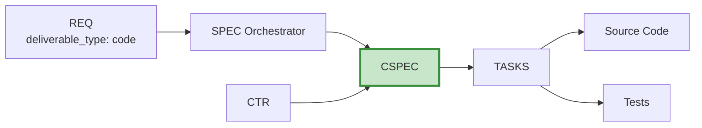

# CSPEC-00: Code Specification Index

## Purpose

This document serves as the index for all Code Specification (CSPEC) documents - technical specifications for source code implementation.

## Position in Document Workflow

**Layer**: 9 (Implementation Specification Layer)
**Subtype Code**: 50
**Parent**: SPEC (orchestrator)
**Trigger**: `deliverable_type == 'code'`
**CTR Required**: Yes
**Downstream**: TASKS → Source code, Unit tests, Integration tests

## CSPEC Documents

| CSPEC ID | Title | Status | Related REQ | Related CTR | TASKS-Ready |
|----------|-------|--------|-------------|-------------|-------------|
| [CSPEC-MVP-TEMPLATE](./CSPEC-MVP-TEMPLATE.yaml) | Template | Reference | - | - | - |

## Element Type Codes

| Code | Type | Description | Example |
|------|------|-------------|---------|
| 50 | interface | API/class interface | `CSPEC.01.50.01` |
| 51 | method | Method specification | `CSPEC.01.51.01` |
| 52 | model | Data model | `CSPEC.01.52.01` |
| 53 | error | Error definition | `CSPEC.01.53.01` |
| 54 | config | Configuration | `CSPEC.01.54.01` |

## Quality Gate: TASKS-Ready Score

| Criterion | Weight | Description |
|-----------|--------|-------------|
| Interface Completeness | 25% | All interfaces, methods, APIs fully specified |
| Error Handling | 20% | Error codes, recovery strategies defined |
| Test Coverage Plan | 20% | BDD, unit, integration test references |
| Traceability | 20% | All upstream/downstream links complete |
| Implementation Guidance | 15% | Language, framework, paths, dependencies |

**Target**: >= 90%

## Related Documents

- **Parent Template**: [SPEC-MVP-TEMPLATE.yaml](../SPEC-MVP-TEMPLATE.yaml)
- **Template**: [CSPEC-MVP-TEMPLATE.yaml](./CSPEC-MVP-TEMPLATE.yaml)
- **Schema**: [CSPEC_MVP_SCHEMA.yaml](./CSPEC_MVP_SCHEMA.yaml)
- **Creation Rules**: [CSPEC_MVP_CREATION_RULES.md](./CSPEC_MVP_CREATION_RULES.md)
- **Validation Rules**: [CSPEC_MVP_VALIDATION_RULES.md](./CSPEC_MVP_VALIDATION_RULES.md)

---

**Index Version**: 1.0
**Last Updated**: 2026-03-01
