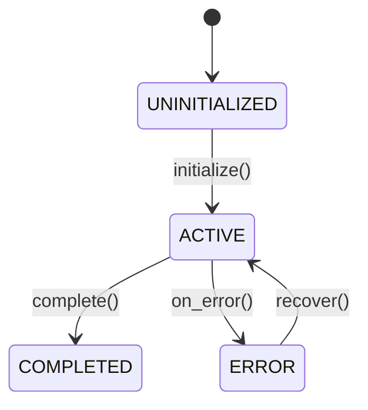

> **Dual-Format Note**:
>
> This MD template is the **primary source** for human workflow.
> - **For Autopilot**: See `CSPEC-MVP-TEMPLATE.yaml` (YAML template)
> - **Shared Validation**: Both formats are validated by `CSPEC_MVP_SCHEMA.yaml`
> - **Parent**: SPEC (orchestrator) - routes here when `deliverable_type == 'code'`

---

> **Document Authority**: This is the STANDARD for CSPEC (Code Specification) structure.
> Schema: `CSPEC_MVP_SCHEMA.yaml v1.0` | Rules: `CSPEC_MVP_CREATION_RULES.md`, `CSPEC_MVP_VALIDATION_RULES.md`

<!--
AI_CONTEXT_START
Role: AI Technical Architect
Objective: Create code specification for source code implementation.
Constraints:
- One CSPEC per component/module.
- Define HOW to implement in code (not just WHAT).
- CTR (Contract) is REQUIRED - reference API/data contracts.
- TASKS-Ready threshold: >= 90%.
- Include pseudocode for complex logic.
- Explicit state machines for stateful components.
- Define all error handling and edge cases.
- Element IDs use codes 50-54 for interfaces, methods, models, errors, config.
AI_CONTEXT_END
-->

**MVP Template** - Code Specification for source code implementation.

References: Schema `CSPEC_MVP_SCHEMA.yaml` | Rules `CSPEC_MVP_CREATION_RULES.md`, `CSPEC_MVP_VALIDATION_RULES.md`

# CSPEC-NN: [Component Name] Code Specification

**Deliverable Type**: `code`
**CTR Required**: Yes (API/data contracts must be referenced)

## 1. Document Control

| Item | Details |
|------|---------|
| **Status** | Draft / Review / Approved / Implemented |
| **Version** | 1.0.0 |
| **Date Created** | YYYY-MM-DDTHH:MM:SS |
| **Last Updated** | YYYY-MM-DDTHH:MM:SS |
| **Author** | [Author name] |
| **Component** | [Component/module name] |
| **Deliverable Type** | code |
| **CTR Reference** | @ctr: CTR-NN |
| **TASKS-Ready Score** | [XX]% (Target: >= 90%) |

---

## 2. Traceability

### 2.1 Upstream Sources

| Type | ID | Title | Relevant Sections |
|------|-----|-------|-------------------|
| REQ | REQ-NN | [Requirements title] | [Sections] |
| CTR | CTR-NN | [Contract title] | [API contract sections] |
| ADR | ADR-NN | [Architecture decision] | [Sections] |

### 2.2 Cumulative Tags

```yaml
brd: "@brd: BRD.NN.EE.SS"
prd: "@prd: PRD.NN.EE.SS"
ears: "@ears: EARS.NN.EE.SS"
bdd: "@bdd: BDD.NN.EE.SS"
adr: "@adr: ADR-NN"
sys: "@sys: SYS.NN.EE.SS"
req: "@req: REQ.NN.EE.SS"
ctr: "@ctr: CTR-NN"  # REQUIRED for CSPEC
```

### 2.3 Downstream Consumers

| Type | ID | Purpose |
|------|-----|---------|
| TASKS | TASKS-NN | Implementation tasks |
| Code | src/[module]/ | Source code output |
| Tests | tests/[module]/ | Test code output |

---

## 3. Architecture

### 3.1 Overview

[High-level component description including purpose, technologies, and integration.]

### 3.2 Component Structure

| Component | Responsibility | Dependencies |
|-----------|----------------|--------------|
| [Name] | [What it does] | [Deps] |

### 3.3 Element IDs

| ID | Type | Name | Description |
|----|------|------|-------------|
| CSPEC.NN.50.01 | interface | [Name] | [Description] |
| CSPEC.NN.51.01 | method | [Name] | [Description] |
| CSPEC.NN.52.01 | model | [Name] | [Description] |

---

## 4. Interfaces

### 4.1 External APIs

Reference: CTR-NN

| Endpoint | Method | Auth | Rate Limit | Latency Target |
|----------|--------|------|------------|----------------|
| /api/v1/[resource] | POST | JWT | 100/min | @threshold: PRD.NN.perf.api.p95_latency |

### 4.2 Internal APIs

```python
class [ClassName]:
    def [method_name](self, param: Type) -> ReturnType:
        """
        Purpose:
        1. [Step 1]
        2. [Step 2]
        3. [Step 3]
        """
        pass
```

---

## 5. Behavior

### 5.1 State Machine



### 5.2 Request Processing

| Property | Value |
|----------|-------|
| Concurrency Model | async |
| Max Concurrent | 100 |
| Request Timeout | 30s |

---

## 6. Performance

| Metric | Target | Threshold Reference |
|--------|--------|---------------------|
| p50 Latency | [X]ms | @threshold: PRD.NN.perf.api.p50_latency |
| p95 Latency | [X]ms | @threshold: PRD.NN.perf.api.p95_latency |
| p99 Latency | [X]ms | @threshold: PRD.NN.perf.api.p99_latency |
| Throughput | [X] rps | @threshold: PRD.NN.limit.api.requests_per_second |

---

## 7. Security

| Aspect | Specification |
|--------|---------------|
| Authentication | Required: bearer_jwt, api_key |
| Authorization | RBAC enabled |
| Input Validation | Schema-based, sanitization enabled |

---

## 8. Observability

### 8.1 Metrics

| Metric | Type | Labels |
|--------|------|--------|
| component_requests_total | counter | method, endpoint, status_code |
| component_request_duration_seconds | histogram | method, endpoint |

### 8.2 Health Checks

| Endpoint | Checks |
|----------|--------|
| /health/live | memory, threads |
| /health/ready | database, dependencies |

---

## 9. Verification

### 9.1 BDD Scenarios

- `04_BDD/BDD-NN_{suite}/BDD-NN.SS_{slug}.feature#scenario-name`

### 9.2 Tests

| Type | Coverage Target | Path |
|------|-----------------|------|
| Unit | >= 85% | tests/unit/[module]/ |
| Integration | >= 75% | tests/integration/[module]/ |

---

## 10. Implementation

| Property | Value |
|----------|-------|
| Language | Python |
| Framework | FastAPI |
| Module Path | src/[module]/[component].py |
| Entry Point | main.py |

### Dependencies

| Package | Version | Type |
|---------|---------|------|
| fastapi | >= 0.100.0 | runtime |
| pytest | >= 7.0.0 | development |

---

**Template Version**: 1.0
**Last Updated**: 2026-03-01
