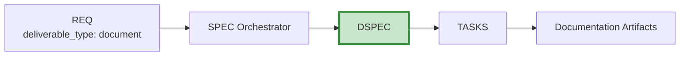

# DSPEC-00: Document Specification Index

## Purpose

This document serves as the index for all Document Specification (DSPEC) documents - specifications for documentation artifacts including user guides, API documentation, compliance documents, and training materials.

## Position in Document Workflow

**Layer**: 9 (Implementation Specification Layer)
**Subtype Code**: 51
**Parent**: SPEC (orchestrator)
**Trigger**: `deliverable_type == 'document'`
**CTR Required**: No (optional)
**Downstream**: TASKS - User guides, API docs, Compliance docs, Training materials

## DSPEC Documents

| DSPEC ID | Title | Status | Related REQ | DOC-Ready |
|----------|-------|--------|-------------|-----------|
| [DSPEC-MVP-TEMPLATE](./DSPEC-MVP-TEMPLATE.yaml) | Template | Reference | - | - |

## Element Type Codes

| Code | Type | Description | Example |
|------|------|-------------|---------|
| 55 | section | Document section | `DSPEC.01.55.01` |
| 56 | topic | Content topic | `DSPEC.01.56.01` |
| 57 | example | Code/usage example | `DSPEC.01.57.01` |
| 58 | reference | External reference | `DSPEC.01.58.01` |

## Quality Gate: DOC-Ready Score

| Criterion | Weight | Description |
|-----------|--------|-------------|
| Content Outline Completeness | 25% | All sections defined with purpose and content requirements |
| Audience Clarity | 20% | Target audience clearly identified with appropriate level |
| Format Specification | 15% | Output format, style, and tone defined |
| Review Criteria | 20% | Accuracy, completeness, clarity standards specified |
| Traceability | 20% | All upstream/downstream links complete |

**Target**: >= 85%

## Related Documents

- **Parent Template**: [SPEC-MVP-TEMPLATE.yaml](../SPEC-MVP-TEMPLATE.yaml)
- **Template**: [DSPEC-MVP-TEMPLATE.yaml](./DSPEC-MVP-TEMPLATE.yaml)
- **Schema**: [DSPEC_MVP_SCHEMA.yaml](./DSPEC_MVP_SCHEMA.yaml)
- **Creation Rules**: [DSPEC_MVP_CREATION_RULES.md](./DSPEC_MVP_CREATION_RULES.md)
- **Validation Rules**: [DSPEC_MVP_VALIDATION_RULES.md](./DSPEC_MVP_VALIDATION_RULES.md)

---

**Index Version**: 1.0
**Last Updated**: 2026-03-01
