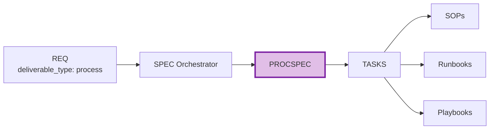

# PROCSPEC-00: Process Specification Index

## Purpose

This document serves as the index for all Process Specification (PROCSPEC) documents - specifications for SOPs, runbooks, playbooks, checklists, and workflows.

## Position in Document Workflow

**Layer**: 9 (Implementation Specification Layer)
**Subtype Code**: 54
**Parent**: SPEC (orchestrator)
**Trigger**: `deliverable_type == 'process'`
**CTR Required**: No (optional)
**Downstream**: TASKS -> SOPs, Runbooks, Playbooks, Checklists

## PROCSPEC Documents

| PROCSPEC ID | Title | Status | Related REQ | PROC-Ready |
|-------------|-------|--------|-------------|------------|
| [PROCSPEC-MVP-TEMPLATE](./PROCSPEC-MVP-TEMPLATE.yaml) | Template | Reference | - | - |

## Element Type Codes

| Code | Type | Description | Example |
|------|------|-------------|---------|
| 70 | step | Process step | `PROCSPEC.01.7bee` |
| 71 | decision | Decision point | `PROCSPEC.01.2bf4` |
| 72 | escalation | Escalation procedure | `PROCSPEC.01.dd48` |
| 73 | rollback | Rollback procedure | `PROCSPEC.01.fd41` |

## Quality Gate: PROC-Ready Score

| Criterion | Weight | Description |
|-----------|--------|-------------|
| Step Completeness | 25% | All steps with prerequisites, inputs, outputs |
| Decision Points | 20% | All decision points with options and next steps |
| Escalation Procedures | 20% | Triggers, paths, SLAs defined |
| Rollback Procedures | 15% | Rollback triggers and steps documented |
| Traceability | 20% | All upstream/downstream links complete |

**Target**: >= 85%

## Related Documents

- **Parent Template**: [SPEC-TEMPLATE.yaml](../SPEC-TEMPLATE.yaml)
- **Template**: [PROCSPEC-MVP-TEMPLATE.yaml](./PROCSPEC-MVP-TEMPLATE.yaml)
- **Schema**: [PROCSPEC_MVP_SCHEMA.yaml](./PROCSPEC_MVP_SCHEMA.yaml)
- **Creation Rules**: [PROCSPEC_MVP_CREATION_RULES.md](./PROCSPEC_MVP_CREATION_RULES.md)
- **Validation Rules**: [PROCSPEC_MVP_VALIDATION_RULES.md](./PROCSPEC_MVP_VALIDATION_RULES.md)

---

**Index Version**: 1.0
**Last Updated**: 2026-03-01
