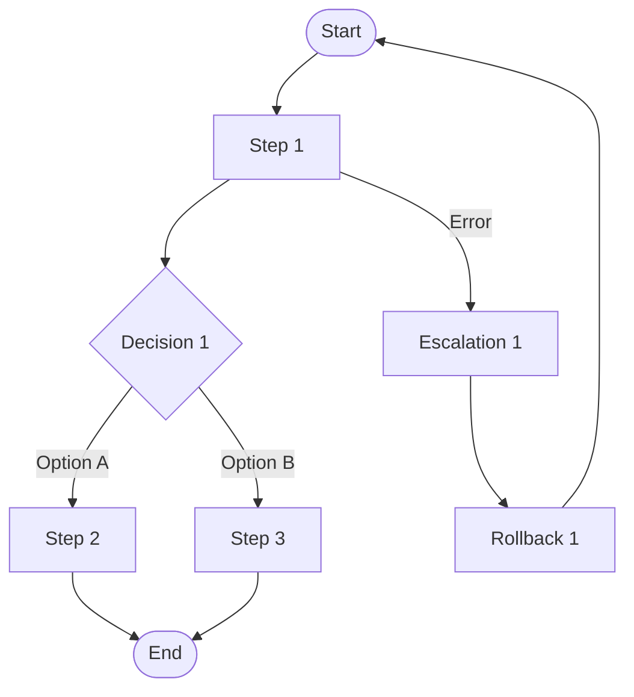

> **Dual-Format Note**:
>
> This MD template is the **primary source** for human workflow.
> - **For Autopilot**: See `PROCSPEC-MVP-TEMPLATE.yaml` (YAML template)
> - **Shared Validation**: Both formats are validated by `PROCSPEC_MVP_SCHEMA.yaml`
> - **Parent**: SPEC (orchestrator) - routes here when `deliverable_type == 'process'`

---

> **Document Authority**: This is the STANDARD for PROCSPEC (Process Specification) structure.
> Schema: `PROCSPEC_MVP_SCHEMA.yaml v1.0` | Rules: `PROCSPEC_MVP_CREATION_RULES.md`, `PROCSPEC_MVP_VALIDATION_RULES.md`

<!--
AI_CONTEXT_START
Role: AI Process Architect
Objective: Create process specification for SOPs, runbooks, playbooks, checklists.
Constraints:
- One PROCSPEC per process/procedure.
- Define WHAT to do, WHO does it, WHEN to do it.
- CTR is OPTIONAL (only if external APIs involved).
- PROC-Ready threshold: >= 85%.
- Include decision points with clear options.
- Define escalation paths with SLAs.
- Define rollback procedures for failure scenarios.
- Element IDs use codes 70-73 for steps, decisions, escalations, rollbacks.
AI_CONTEXT_END
-->

**MVP Template** - Process Specification for SOPs, runbooks, playbooks, checklists.

References: Schema `PROCSPEC_MVP_SCHEMA.yaml` | Rules `PROCSPEC_MVP_CREATION_RULES.md`, `PROCSPEC_MVP_VALIDATION_RULES.md`

# PROCSPEC-NN: [Process Name] Process Specification

**Deliverable Type**: `process`
**CTR Required**: No (optional - only if external APIs involved)

## 1. Document Control

| Item | Details |
|------|---------|
| **Status** | Draft / Review / Approved / Implemented |
| **Version** | 1.0.0 |
| **Date Created** | YYYY-MM-DDTHH:MM:SS |
| **Last Updated** | YYYY-MM-DDTHH:MM:SS |
| **Author** | [Author name] |
| **Process Name** | [Process/procedure name] |
| **Deliverable Type** | process |
| **CTR Reference** | @ctr: CTR-NN (optional) |
| **PROC-Ready Score** | [XX]% (Target: >= 85%) |

---

## 2. Traceability

### 2.1 Upstream Sources

| Type | ID | Title | Relevant Sections |
|------|-----|-------|-------------------|
| REQ | REQ-NN | [Requirements title] | [Sections] |
| ADR | ADR-NN | [Architecture decision] | [Sections] |

### 2.2 Cumulative Tags

```yaml
brd: "@brd: BRD.NN.EE.SS"
prd: "@prd: PRD.NN.EE.SS"
ears: "@ears: EARS.NN.EE.SS"
bdd: "@bdd: BDD.NN.EE.SS"
adr: "@adr: ADR-NN"
sys: "@sys: SYS.NN.EE.SS"
req: "@req: REQ.NN.EE.SS"
ctr: "@ctr: CTR-NN"  # OPTIONAL for PROCSPEC
```

### 2.3 Downstream Consumers

| Type | ID | Purpose |
|------|-----|---------|
| TASKS | TASKS-NN | Implementation tasks |
| SOP | docs/sops/[process]/ | Standard operating procedure |
| Runbook | docs/runbooks/[process]/ | Operational runbook |
| Playbook | docs/playbooks/[process]/ | Incident playbook |

---

## 3. Process Specification

### 3.1 Process Overview

| Property | Value |
|----------|-------|
| **Process Type** | [sop / runbook / playbook / checklist / workflow] |
| **Execution Context** | [manual / automated / hybrid] |
| **Frequency** | [on-demand / scheduled / event-triggered] |
| **Duration** | [Estimated time to complete] |
| **Criticality** | [low / medium / high / critical] |

### 3.2 Roles and Responsibilities

| Role | Responsibilities | RACI |
|------|------------------|------|
| [Role Name] | [What they do] | [R/A/C/I] |

### 3.3 Element IDs

| ID | Type | Name | Description |
|----|------|------|-------------|
| PROCSPEC.NN.70.01 | step | [Name] | [Description] |
| PROCSPEC.NN.71.01 | decision | [Name] | [Description] |
| PROCSPEC.NN.72.01 | escalation | [Name] | [Description] |
| PROCSPEC.NN.73.01 | rollback | [Name] | [Description] |

---

## 4. Process Steps

### Step 1: [Step Name]

| Property | Value |
|----------|-------|
| **ID** | PROCSPEC.NN.70.01 |
| **Responsible** | [Role/Team] |
| **Prerequisites** | [What must be true before] |
| **Inputs** | [Required inputs] |
| **Outputs** | [Expected outputs] |
| **Duration** | [Estimated time] |

**Actions**:
1. [Action 1]
2. [Action 2]
3. [Action 3]

**Success Criteria**:
- [Criterion 1]
- [Criterion 2]

### Step 2: [Step Name]

| Property | Value |
|----------|-------|
| **ID** | PROCSPEC.NN.70.02 |
| **Responsible** | [Role/Team] |
| **Prerequisites** | [What must be true before] |
| **Inputs** | [Required inputs] |
| **Outputs** | [Expected outputs] |
| **Duration** | [Estimated time] |

**Actions**:
1. [Action 1]
2. [Action 2]

---

## 5. Decision Points

### Decision 1: [Decision Question]

| Property | Value |
|----------|-------|
| **ID** | PROCSPEC.NN.71.01 |
| **Trigger** | [When this decision is needed] |
| **Decision Maker** | [Role/Team] |

| Option | Condition | Next Step |
|--------|-----------|-----------|
| Option A | [When to choose A] | PROCSPEC.NN.70.XX |
| Option B | [When to choose B] | PROCSPEC.NN.70.YY |
| Default | [Fallback condition] | PROCSPEC.NN.70.ZZ |

---

## 6. Escalation Procedures

### Escalation 1: [Escalation Name]

| Property | Value |
|----------|-------|
| **ID** | PROCSPEC.NN.72.01 |
| **Trigger** | [When to escalate] |
| **Escalation Path** | [Who to contact] |
| **SLA** | [Response time requirement] |
| **Communication Channel** | [Slack/Email/Phone/PagerDuty] |

**Escalation Steps**:
1. [Step 1]
2. [Step 2]

**Information to Include**:
- [Info item 1]
- [Info item 2]

---

## 7. Rollback Procedures

### Rollback 1: [Rollback Name]

| Property | Value |
|----------|-------|
| **ID** | PROCSPEC.NN.73.01 |
| **Trigger** | [When to rollback] |
| **Rollback Owner** | [Role/Team] |
| **Max Rollback Time** | [Time limit] |

**Rollback Steps**:
1. [Step 1]
2. [Step 2]
3. [Step 3]

**Verification**:
- [Verification check 1]
- [Verification check 2]

---

## 8. Process Flow Diagram



---

## 9. Prerequisites and Dependencies

### 9.1 Prerequisites

| Prerequisite | Description | Verification |
|--------------|-------------|--------------|
| [Prerequisite 1] | [Description] | [How to verify] |

### 9.2 Dependencies

| Dependency | Type | Required | Fallback |
|------------|------|----------|----------|
| [System/Service] | [internal/external] | [yes/no] | [Fallback strategy] |

---

## 10. Verification

### 10.1 BDD Scenarios

- `04_BDD/BDD-NN_{suite}/BDD-NN.SS_{slug}.feature#scenario-name`

### 10.2 Verification Checklist

| Check | Frequency | Owner |
|-------|-----------|-------|
| [Check description] | [Per execution / Daily / Weekly] | [Role] |

---

## 11. Implementation

| Property | Value |
|----------|-------|
| **Output Type** | [SOP / Runbook / Playbook / Checklist] |
| **Output Path** | docs/[type]/[process_name]/ |
| **Format** | Markdown / Wiki / Confluence |
| **Automation** | [None / Partial / Full] |

### 11.1 Automation Details

| Component | Tool | Script Path |
|-----------|------|-------------|
| [Automated step] | [Tool name] | scripts/[path] |

---

**Template Version**: 1.0
**Last Updated**: 2026-03-01
