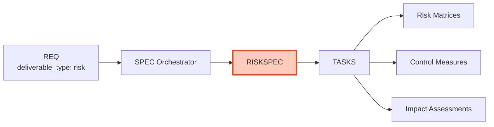

# RISKSPEC-00: Risk Specification Index

## Purpose

This document serves as the index for all Risk Analysis Specification (RISKSPEC) documents - comprehensive risk assessments, impact analyses, and control measures for system components.

## Position in Document Workflow

**Layer**: 9 (Implementation Specification Layer)
**Subtype Code**: 53
**Parent**: SPEC (orchestrator)
**Trigger**: `deliverable_type == 'risk'`
**CTR Required**: No (no external interface)
**Downstream**: TASKS - Risk matrices, Impact assessments, Control measures

## RISKSPEC Documents

| RISKSPEC ID | Title | Status | Related REQ | Risk Framework | RISK-Ready |
|-------------|-------|--------|-------------|----------------|------------|
| [RISKSPEC-MVP-TEMPLATE](./RISKSPEC-MVP-TEMPLATE.yaml) | Template | Reference | - | - | - |

## Element Type Codes

| Code | Type | Description | Example |
|------|------|-------------|---------|
| 65 | risk | Risk identification | `RISKSPEC.01.65.01` |
| 66 | control | Control measure | `RISKSPEC.01.66.01` |
| 67 | mitigation | Mitigation strategy | `RISKSPEC.01.67.01` |
| 68 | assessment | Impact assessment | `RISKSPEC.01.68.01` |

## Quality Gate: RISK-Ready Score

| Criterion | Weight | Description |
|-----------|--------|-------------|
| Risk Identification | 25% | All risks identified with categories and descriptions |
| Impact Assessment | 25% | Likelihood and impact scores, risk calculations |
| Mitigation Strategies | 20% | Avoid/transfer/mitigate/accept strategies defined |
| Control Measures | 15% | Preventive/detective/corrective controls specified |
| Traceability | 15% | All upstream/downstream links complete |

**Target**: >= 90%

## Risk Framework Support

RISKSPEC supports the following frameworks:
- **ISO31000**: International risk management standard
- **NIST**: NIST Risk Management Framework
- **FAIR**: Factor Analysis of Information Risk
- **Custom**: Organization-specific frameworks

## Related Documents

- **Parent Template**: [SPEC-MVP-TEMPLATE.yaml](../SPEC-MVP-TEMPLATE.yaml)
- **Template**: [RISKSPEC-MVP-TEMPLATE.yaml](./RISKSPEC-MVP-TEMPLATE.yaml)
- **Schema**: [RISKSPEC_MVP_SCHEMA.yaml](./RISKSPEC_MVP_SCHEMA.yaml)
- **Creation Rules**: [RISKSPEC_MVP_CREATION_RULES.md](./RISKSPEC_MVP_CREATION_RULES.md)
- **Validation Rules**: [RISKSPEC_MVP_VALIDATION_RULES.md](./RISKSPEC_MVP_VALIDATION_RULES.md)

---

**Index Version**: 1.0
**Last Updated**: 2026-03-01
