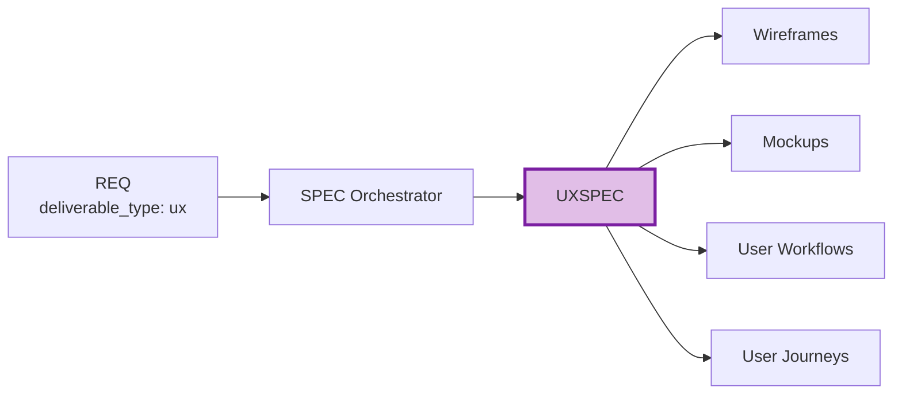

# UXSPEC-00: UX/Design Specification Index

## Purpose

This document serves as the index for all UX/Design Specification (UXSPEC) documents - specifications for wireframes, mockups, workflows, and user journeys.

## Position in Document Workflow

**Layer**: 9 (Implementation Specification Layer)
**Subtype Code**: 52
**Parent**: SPEC (orchestrator)
**Trigger**: `deliverable_type == 'ux'`
**CTR Required**: No (optional)
**Downstream**: Wireframes, Mockups, User workflows, User journeys

## UXSPEC Documents

| UXSPEC ID | Title | Status | Related REQ | Fidelity | DESIGN-Ready |
|-----------|-------|--------|-------------|----------|--------------|
| [UXSPEC-MVP-TEMPLATE](./UXSPEC-MVP-TEMPLATE.yaml) | Template | Reference | - | - | - |

## Element Type Codes

| Code | Type | Description | Example |
|------|------|-------------|---------|
| 60 | flow | User flow | `UXSPEC.01.c890` |
| 61 | screen | Screen specification | `UXSPEC.01.f2ae` |
| 62 | component | UI component | `UXSPEC.01.bf46` |
| 63 | interaction | Interaction pattern | `UXSPEC.01.fb37` |

## Quality Gate: DESIGN-Ready Score

| Criterion | Weight | Description |
|-----------|--------|-------------|
| User Flow Completeness | 25% | All user flows documented with entry/exit points |
| Interaction Patterns | 20% | All interactions, animations, transitions defined |
| Accessibility Requirements | 20% | WCAG compliance, ARIA patterns documented |
| Visual Requirements | 15% | Style guide, typography, color references |
| Traceability | 20% | All upstream/downstream links complete |

**Target**: >= 85%

## Related Documents

- **Parent Template**: [SPEC-TEMPLATE.yaml](../SPEC-TEMPLATE.yaml)
- **Template**: [UXSPEC-MVP-TEMPLATE.yaml](./UXSPEC-MVP-TEMPLATE.yaml)
- **Schema**: [UXSPEC_MVP_SCHEMA.yaml](./UXSPEC_MVP_SCHEMA.yaml)
- **Creation Rules**: [UXSPEC_MVP_CREATION_RULES.md](./UXSPEC_MVP_CREATION_RULES.md)
- **Validation Rules**: [UXSPEC_MVP_VALIDATION_RULES.md](./UXSPEC_MVP_VALIDATION_RULES.md)

---

**Index Version**: 1.0
**Last Updated**: 2026-03-01
