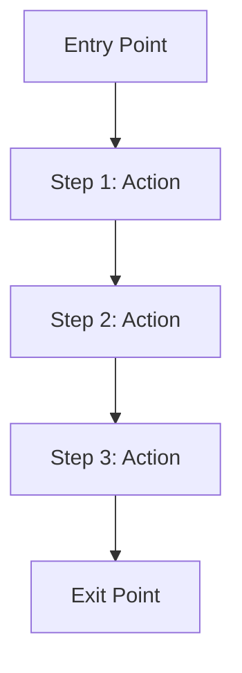

> **Dual-Format Note**:
>
> This MD template is the **primary source** for human workflow.
> - **For Autopilot**: See `UXSPEC-MVP-TEMPLATE.yaml` (YAML template)
> - **Shared Validation**: Both formats are validated by `UXSPEC_MVP_SCHEMA.yaml`
> - **Parent**: SPEC (orchestrator) - routes here when `deliverable_type == 'ux'`

---

> **Document Authority**: This is the STANDARD for UXSPEC (UX/Design Specification) structure.
> Schema: `UXSPEC_MVP_SCHEMA.yaml v1.0` | Rules: `UXSPEC_MVP_CREATION_RULES.md`, `UXSPEC_MVP_VALIDATION_RULES.md`

<!--
AI_CONTEXT_START
Role: AI UX Designer / Product Designer
Objective: Create UX specification for wireframes, mockups, workflows, and user journeys.
Constraints:
- One UXSPEC per feature/module.
- Define user flows with entry/exit points.
- Include accessibility requirements (WCAG level).
- CTR (Contract) is OPTIONAL for UX specs.
- DESIGN-Ready threshold: >= 85%.
- Include screen specifications with components.
- Define interaction patterns and transitions.
- Element IDs use codes 60-63 for flows, screens, components, interactions.
AI_CONTEXT_END
-->

**MVP Template** - UX/Design Specification for wireframes, mockups, workflows, and user journeys.

References: Schema `UXSPEC_MVP_SCHEMA.yaml` | Rules `UXSPEC_MVP_CREATION_RULES.md`, `UXSPEC_MVP_VALIDATION_RULES.md`

# UXSPEC-NN: [Feature Name] UX Specification

**Deliverable Type**: `ux`
**CTR Required**: No (optional)

## 1. Document Control

| Item | Details |
|------|---------|
| **Status** | Draft / Review / Approved / Implemented |
| **Version** | 1.0.0 |
| **Date Created** | YYYY-MM-DDTHH:MM:SS |
| **Last Updated** | YYYY-MM-DDTHH:MM:SS |
| **Author** | [Author name] |
| **Feature** | [Feature/module name] |
| **Deliverable Type** | ux |
| **CTR Reference** | @ctr: CTR-NN (optional) |
| **DESIGN-Ready Score** | [XX]% (Target: >= 85%) |

---

## 2. Traceability

### 2.1 Upstream Sources

| Type | ID | Title | Relevant Sections |
|------|-----|-------|-------------------|
| REQ | REQ-NN | [Requirements title] | [Sections] |
| BRD | BRD-NN | [Business requirements] | [User story sections] |
| PRD | PRD-NN | [Product requirements] | [UX sections] |

### 2.2 Cumulative Tags

```yaml
brd: "@brd: BRD.NN.EE.SS"
prd: "@prd: PRD.NN.EE.SS"
ears: "@ears: EARS.NN.EE.SS"
bdd: "@bdd: BDD.NN.EE.SS"
adr: "@adr: ADR-NN"
sys: "@sys: SYS.NN.EE.SS"
req: "@req: REQ.NN.EE.SS"
ctr: "@ctr: CTR-NN"  # Optional for UXSPEC
```

### 2.3 Downstream Consumers

| Type | ID | Purpose |
|------|-----|---------|
| Wireframes | wireframes/[feature]/ | Low-fidelity designs |
| Mockups | mockups/[feature]/ | High-fidelity designs |
| Prototypes | prototypes/[feature]/ | Interactive prototypes |

---

## 3. UX Specification

### 3.1 Artifact Details

| Property | Value |
|----------|-------|
| Artifact Type | [wireframe / mockup / prototype / workflow / user_journey] |
| Fidelity | [low / medium / high] |
| Tool | [figma / sketch / miro / lucidchart] |

### 3.2 User Flows

| ID | Name | Entry Point | Exit Point |
|----|------|-------------|------------|
| UXSPEC.NN.60.01 | [Flow Name] | [Where user starts] | [Where user ends] |

#### Flow: UXSPEC.NN.60.01 - [Flow Name]

| Step | Action | System Response | Screen |
|------|--------|-----------------|--------|
| 1 | [User action] | [System response] | UXSPEC.NN.61.01 |
| 2 | [User action] | [System response] | UXSPEC.NN.61.02 |
| 3 | [User action] | [System response] | UXSPEC.NN.61.03 |



### 3.3 Screens

| ID | Name | Purpose | Components |
|----|------|---------|------------|
| UXSPEC.NN.61.01 | [Screen Name] | [Screen purpose] | [Component list] |
| UXSPEC.NN.61.02 | [Screen Name] | [Screen purpose] | [Component list] |

#### Screen: UXSPEC.NN.61.01 - [Screen Name]

| Property | Value |
|----------|-------|
| Purpose | [What this screen accomplishes] |
| Entry Points | [How users arrive at this screen] |
| Exit Points | [Where users can go from here] |

**Layout**:

```
+------------------------------------------+
|  Header / Navigation                      |
+------------------------------------------+
|                                          |
|  [Primary Content Area]                  |
|                                          |
|  +----------------+  +----------------+  |
|  | Component 1    |  | Component 2    |  |
|  +----------------+  +----------------+  |
|                                          |
+------------------------------------------+
|  Footer / Actions                        |
+------------------------------------------+
```

**Components**:

| Component ID | Name | Type | Behavior |
|--------------|------|------|----------|
| UXSPEC.NN.62.01 | [Name] | [button / form / card / list] | [Behavior] |

### 3.4 Components

| ID | Name | Type | States | Variants |
|----|------|------|--------|----------|
| UXSPEC.NN.62.01 | [Component Name] | [Type] | [default, hover, active, disabled] | [Variants] |

#### Component: UXSPEC.NN.62.01 - [Component Name]

| Property | Value |
|----------|-------|
| Type | [button / input / card / modal / etc.] |
| States | default, hover, active, disabled, error, loading |
| Props | [Properties/configuration options] |

### 3.5 Interactions

| ID | Trigger | Action | Response | Duration |
|----|---------|--------|----------|----------|
| UXSPEC.NN.63.01 | [User trigger] | [Interaction type] | [Visual response] | [Duration ms] |

#### Interaction: UXSPEC.NN.63.01 - [Interaction Name]

| Property | Value |
|----------|-------|
| Trigger | [click / hover / focus / scroll / gesture] |
| Animation | [fade / slide / scale / none] |
| Duration | [Duration in ms] |
| Easing | [ease-in / ease-out / ease-in-out / linear] |

---

## 4. Accessibility Requirements

### 4.1 WCAG Compliance

| Property | Value |
|----------|-------|
| WCAG Level | [A / AA / AAA] |
| Target Compliance | [Target percentage] |

### 4.2 ARIA Requirements

| Pattern | Usage | Elements |
|---------|-------|----------|
| [ARIA Pattern] | [Usage context] | [Elements applying this pattern] |

### 4.3 Accessibility Checklist

- [ ] Color contrast ratio meets WCAG guidelines (4.5:1 for normal text)
- [ ] All interactive elements are keyboard accessible
- [ ] Focus indicators are visible
- [ ] Screen reader compatible (proper ARIA labels)
- [ ] Touch targets are minimum 44x44px
- [ ] Form inputs have associated labels
- [ ] Error messages are programmatically associated
- [ ] No content relies solely on color

---

## 5. Visual Requirements

### 5.1 Style Guide Reference

| Property | Value |
|----------|-------|
| Design System | [Design system name/link] |
| Theme | [light / dark / system] |
| Brand Guidelines | [Link to brand guidelines] |

### 5.2 Typography

| Element | Font | Size | Weight | Line Height |
|---------|------|------|--------|-------------|
| H1 | [Font] | [Size] | [Weight] | [Line height] |
| Body | [Font] | [Size] | [Weight] | [Line height] |
| Caption | [Font] | [Size] | [Weight] | [Line height] |

### 5.3 Color Palette

| Name | Hex | Usage |
|------|-----|-------|
| Primary | #[hex] | [Usage] |
| Secondary | #[hex] | [Usage] |
| Error | #[hex] | [Usage] |
| Success | #[hex] | [Usage] |

### 5.4 Spacing

| Token | Value | Usage |
|-------|-------|-------|
| xs | [value] | [Usage] |
| sm | [value] | [Usage] |
| md | [value] | [Usage] |
| lg | [value] | [Usage] |

---

## 6. Responsive Behavior

### 6.1 Breakpoints

| Breakpoint | Min Width | Max Width | Layout Changes |
|------------|-----------|-----------|----------------|
| Mobile | 0 | 767px | [Changes] |
| Tablet | 768px | 1023px | [Changes] |
| Desktop | 1024px | - | [Changes] |

### 6.2 Adaptive Components

| Component | Mobile | Tablet | Desktop |
|-----------|--------|--------|---------|
| Navigation | Hamburger menu | Hamburger menu | Full nav bar |
| Grid | 1 column | 2 columns | 3+ columns |

---

## 7. Error States

### 7.1 Error Messages

| Error Type | Message | Display Location | Action |
|------------|---------|------------------|--------|
| Validation | [Message] | [Location] | [Recovery action] |
| Network | [Message] | [Location] | [Recovery action] |
| Server | [Message] | [Location] | [Recovery action] |

### 7.2 Empty States

| Context | Message | Action |
|---------|---------|--------|
| No data | [Message] | [CTA button/action] |
| Search no results | [Message] | [CTA button/action] |

---

## 8. Loading States

| Context | Type | Duration Threshold |
|---------|------|-------------------|
| Page load | Skeleton | > 300ms |
| Action | Spinner | > 200ms |
| Form submit | Button loading | Immediate |

---

## 9. Verification

### 9.1 BDD Scenarios

- `04_BDD/BDD-NN_{suite}/BDD-NN.SS_{slug}.feature#scenario-name`

### 9.2 Usability Testing

| Test Type | Participants | Success Criteria |
|-----------|--------------|------------------|
| Task completion | [N users] | [Target %] |
| Time on task | [N users] | [Target duration] |
| Error rate | [N users] | [Target %] |

---

## 10. Design Assets

| Asset Type | Location | Format |
|------------|----------|--------|
| Wireframes | [Path/URL] | [figma / sketch / png] |
| Mockups | [Path/URL] | [figma / sketch / png] |
| Prototypes | [Path/URL] | [figma / invision / principle] |
| Icons | [Path/URL] | [svg / icon font] |

---

**Template Version**: 1.0
**Last Updated**: 2026-03-01
