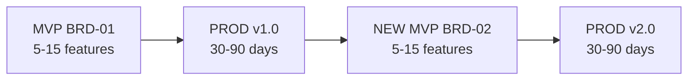
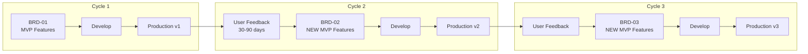

<!-- markdownlint-disable MD025 -->

# MVP Development Workflow Guide

**Version**: 3.1
**Purpose**: Iterative product development using the **MVP → PROD → NEW MVP** lifecycle.
**Target Audience**: AI Assistants and teams of any size building production software.

---

## Core Lifecycle: MVP → PROD → NEW MVP

**This is the fundamental pattern for all project development.**



### Phase Details

| Phase | Duration | Focus | Key Deliverable |

| :------ | :--------- | :------ | :---------------- |

| **MVP** | 1-2 weeks | Build 5-15 core features | BRD → PRD → EARS → BDD → ADR → SYS → REQ → SPEC → TASKS → Production |

| **PROD** | 30-90 days | Operate, measure metrics, collect user feedback | Validated insights & priorities |

| **NEW MVP** | 1-2 weeks | Create NEW BRD for next feature set | Production v(N+1) |

### Critical Principles

1. **Each BRD = One Iteration Cycle**: Never expand BRDs indefinitely - create new ones

2. **New Features = New BRD**: BRD-01, BRD-02, BRD-03 represent successive product versions

3. **Production is Always the Goal**: Every MVP cycle targets production deployment

4. **Cross-Cycle Traceability**: Link iterations using `@depends: BRD-01` in Section 16.2

5. **Focused Scope**: 5-15 features per BRD prevents scope creep and ensures shipping

### Diagram Model by Layer (Required)

Apply this model during each MVP cycle:

| Layer | Required Diagram Model |

| ------- | ------------------------ |

| BRD (L1) | C4 L1 + DFD L0 |

| PRD (L2) | C4 L2 + DFD L1 + key sequence |

| ADR (L5) | C4 L3 + decision sequence (+ DFD L2 when data-impacting) |

| SYS (L6) | System Diagram Contract (bridge model, no mandatory C4 L4 diagrams) |

| SPEC/Code/Test (L9+) | C4 L4 ownership |

**Lifecycle rule**: carry diagram quality findings from PROD feedback into NEW MVP requirements and cross-link via `@depends`.

### When to Start the Next MVP Cycle

- [ ] Current MVP deployed to production and stable

- [ ] User feedback collected (30-90 days minimum)

- [ ] New feature requirements identified and prioritized

- [ ] Current BRD scope complete (no pending P1s)

- [ ] Business approval for next iteration

---

> See [LAYER_REGISTRY.yaml](./LAYER_REGISTRY.yaml) for `template` field definitions.

Note: Some examples in this guide show a portable `docs/` root. In this repository, artifact folders live under `ai_dev_ssd_flow/` without the `docs/` prefix. Use zero-padded paths (e.g., `01_BRD`, `02_PRD`). Run commands from the repo root, e.g., `python3 ai_dev_ssd_flow/02_PRD/scripts/validate_prd.py ai_dev_ssd_flow/02_PRD`. For the automation-focused flow, see `ai_dev_ssd_flow/SDD_AUTOMATION_WORKFLOW.md`.

Important MVP note: MVP artifacts are single, flat files. Split only when a document is too large for AI assistants to handle in one file; otherwise ignore `DOCUMENT_SPLITTING_RULES.md` for MVP.

---

## The MVP Track

The **MVP Track** delivers **90%+ automation** across 14 of 15 layers, enabling **1-2 week cycles** from business idea to production MVP.

### Automation Capabilities

- **Automated Layers**: 14 of 15 (L1-L14, excluding L0 Strategy)

- **Quality Gates**: Auto-approve artifacts scoring ≥90%

- **Human Oversight**: 5 strategic checkpoints (optional if score ≥90%)

- **Target Cycle**: 1-2 weeks idea → production

- **Time Savings**: ~90% reduction in manual documentation

### Key Differences vs Standard Flow

| Feature | Standard Flow | MVP Track |

| --------- | --------------- | ----------- |

| **Automation Level** | 90%+ | **90%+ (14 of 15 layers)** |

| **Quality Gates** | ≥90% | **Auto-approve ≥90%** |

| **Templates** | Full multi-section templates | **Streamlined, single-file MVP templates** |

| **File Structure** | May use document splitting rules | **Single flat files; no splitting** |

| **BRD Layer** | Detailed strategy & finance | **Hypothesis & Core Validation** |

| **Requirements** | BRD → PRD → EARS → REQ | **BRD → PRD → EARS → REQ** (Streamlined) |

| **Validation** | Strict, full compliance | **Focus on active documents & links** |

| **Time-to-Code** | 1-2 Weeks (Planning) | **1-2 Days (Planning)** |

| **Human Checkpoints** | 5 strategic | **5 optional (auto-skip ≥90%)** |

---

## The 6-Step Universal Verification Loop

For **EVERY** step in the workflow below (BRD, PRD, etc.), follow this exact micro-workflow:

1. **PLAN**: Create/Update `X-00_index.md` & `X-00_required_documents_list.md`.

2. **PRE-CHECK**: Run `python3 ai_dev_flow/scripts/validate_documentation_paths.py --root ai_dev_flow` (verify planning docs exist for the layer).

3. **SETUP**: Load `X-MVP-TEMPLATE.md` + `X-MVP-TEMPLATE.md`. See also: [`ID_NAMING_STANDARDS.md`](./ID_NAMING_STANDARDS.md). Note: MVP uses flat files only; do not use document splitting rules.

4. **GENERATE**: Create the file (e.g., `X-01.md`).

5. **VALIDATE**: Run single-file validator (e.g., `validate_brd.py`). Fix errors.

6. **CORPUS CHECK**: Once all files in *required list* are done, run full Quality Gate validation.

---

## 7-Step MVP Workflow

### Step 1: Business Hypothesis (BRD) — **Day 1 (Morning)**

**Artifacts**: `01_BRD/BRD-MVP-TEMPLATE.md`, `BRD-MVP-TEMPLATE.md`

1. **Plan**: Edit `BRD-00_index.md`. Create `BRD-00_required_documents_list.md` (List: BRD-01).

2. **Pre-Check**: Verify index/required lists structure; run `python3 ai_dev_flow/scripts/validate_documentation_paths.py --root ai_dev_flow`.

3. **Generate**: "Create BRD-01 using BRD-MVP-TEMPLATE. Focus on Hypothesis."

4. **Validate**: `python3 ai_dev_flow/01_BRD/01_BRD/scripts/validate_brd.py ai_dev_flow/01_BRD`

5. **Quality Gate Validation**: `python3 ai_dev_flow/scripts/validate_all.py ai_dev_flow --layer BRD`

### Step 2: Core Product Definition (PRD) — **Day 1 (Morning)**

**Artifacts**: `02_PRD/PRD-MVP-TEMPLATE.md`, `PRD-MVP-TEMPLATE.md`

1. **Plan**: Edit `PRD-00_index.md`. Create `PRD-00_required_documents_list.md` (List: PRD-01).

2. **Pre-Check**: Ensure `BRD-01` exists; verify PRD index/required list; run `python3 ai_dev_flow/scripts/validate_documentation_paths.py --root ai_dev_flow`.

3. **Generate**: "Create PRD-01 using PRD-MVP-TEMPLATE. List P1 features."

4. **Validate**: `python3 ai_dev_flow/02_PRD/scripts/validate_prd.py ai_dev_flow/02_PRD`

5. **Quality Gate Validation**: `python3 ai_dev_flow/scripts/validate_links.py --docs-dir ai_dev_flow` (check traceability)

### Step 3: Logic Mapping (EARS) — **Day 1 (Afternoon)**

**Artifacts**: `03_EARS/EARS-MVP-TEMPLATE.md`, `EARS-MVP-TEMPLATE.md`

1. **Plan**: Edit `EARS-00_index.md`, `EARS-00_required_documents_list.md`.

2. **Pre-Check**: Ensure `PRD-01` exists; verify EARS index/required list; run `python3 ai_dev_flow/scripts/validate_documentation_paths.py --root ai_dev_flow`.

3. **Generate**: "Create EARS-01. Map PRD features to MVP Logic."

4. **Validate**: `python3 ai_dev_flow/03_EARS/scripts/validate_ears.py --path ai_dev_flow/03_EARS`

5. **Quality Gate Validation**: `python3 ai_dev_flow/scripts/validate_all.py ai_dev_flow --layer EARS`

### Step 4: Critical Scenarios (BDD) — **Day 1 (Late Afternoon)**

**Artifacts**: `04_BDD/BDD-MVP-TEMPLATE.feature`, `BDD-MVP-TEMPLATE.feature`

1. **Plan**: Edit `BDD-00_index.md` (one per suite), `required_documents_list`.

2. **Pre-Check**: Ensure `EARS-01` exists; verify BDD index/required list; run `python3 ai_dev_flow/scripts/validate_documentation_paths.py --root ai_dev_flow`.

3. **Generate**: "Create `BDD-01_checkout.feature`. Include Happy Path + Critical Error Path scenarios."

4. **Validate**: `python3 ai_dev_flow/04_BDD/scripts/validate_bdd.py ai_dev_flow/04_BDD`

5. **Quality Gate Validation**: Verify Gherkin syntax across suite.

### Step 5: Lean Architecture (ADR & SYS) — **Day 2 (Morning)**

**Artifacts**: MVP Templates for 05_ADR/SYS.

1. **Plan**: Identify *irreversible* decisions (ADR) and System Boundary (SYS).

2. **Pre-Check**: Ensure upstream docs exist (`BRD-01`, `PRD-01`, `EARS-01`); verify `ADR-00_index.md` and `SYS-00_index.md` + required lists; run `python3 ai_dev_flow/scripts/validate_documentation_paths.py --root ai_dev_flow`.

3. **Generate**: `ADR-01` (Tech Stack), `SYS-01` (System Spec).

4. **Validate**:

    - `python3 ai_dev_flow/05_ADR/scripts/validate_adr.py ai_dev_flow/05_ADR`

    - `python3 ai_dev_flow/06_SYS/scripts/validate_sys.py ai_dev_flow/06_SYS`

5. **Quality Gate Validation**: `python3 ai_dev_flow/scripts/validate_all.py ai_dev_flow --layer ADR --layer SYS`

### Step 6: Atomic Requirements (REQ) — **Day 2 (Mid-Day)**

**Artifacts**: `07_REQ/REQ-MVP-TEMPLATE.md`, `REQ-MVP-TEMPLATE.md`

1. **Plan**: List all required REQ files in `REQ-00_required_documents_list.md`.

2. **Pre-Check**: Ensure upstream docs exist (`ADR-01`, `SYS-01`); verify REQ index/required list; run `python3 ai_dev_flow/scripts/validate_documentation_paths.py --root ai_dev_flow`.

3. **Generate**: Batch creation of atomic requirements.

4. **Validate** (per file):

    - `find ai_dev_flow/07_REQ -name 'REQ-*.md' -exec bash ai_dev_flow/07_REQ/scripts/validate_req_template.sh {} \;`

5. **Quality Gate Validation**: `python3 ai_dev_flow/07_REQ/scripts/validate_requirement_ids.py --directory ai_dev_flow/07_REQ` (unique IDs)

### Step 7: Spec & Code (SPEC -> TSPEC -> TASKS) — **Day 2 (Afternoon)**

**Artifacts**: Standard `SPEC` (YAML), `TASKS`.

1. **Plan**: Map REQs to Specs.

2. **Pre-Check**: Ensure required REQ files exist; verify any 09_SPEC/TASKS index/required lists used; run `python3 ai_dev_flow/scripts/validate_documentation_paths.py --root ai_dev_flow`.

3. **Generate**: Specs and Task Lists.

4. **Validate**: `python3 ai_dev_flow/09_SPEC/scripts/validate_spec.py ai_dev_flow/09_SPEC`.

5. **Quality Gate Validation**: `python3 ai_dev_flow/scripts/validate_links.py --docs-dir ai_dev_flow` (final pre-code check).

---

## MVP → PROD → NEW MVP: The Iterative Lifecycle

The framework enables **continuous product evolution** through the **MVP → PROD → NEW MVP** lifecycle:



### The Three Phases

| Phase | Duration | Focus | Output |

| ------- | ---------- | ------- | -------- |

| **MVP** | 1-2 weeks | Core features (5-15) | BRD → PRD → ... → Production |

| **PROD** | 30-90 days | Operate, measure, collect feedback | Metrics, user feedback |

| **NEW MVP** | 1-2 weeks | Next feature set | NEW BRD → repeat cycle |

### Key Principles

1. **Each BRD = One Cycle**: Don't expand BRDs indefinitely; create new ones

2. **New Features = New BRD**: BRD-01, BRD-02, BRD-03 represent successive iterations

3. **Traceability Links Cycles**: Cross-BRD dependencies show how iterations build

4. **Production is the Goal**: Every MVP aims for production deployment

### When to Start a New MVP Cycle

- [ ] Current MVP deployed to production and stable

- [ ] User feedback collected (30-90 days minimum)

- [ ] New feature requirements identified and prioritized

- [ ] Current BRD scope complete (no pending P1s)

- [ ] Business approval for next iteration

### Cycle Artifacts

| Cycle | BRD | PRD | Downstream |

| ------- | ----- | ----- | ------------ |

| 1 | BRD-01 | PRD-01 | EARS-01, ADR-01, ... |

| 2 | BRD-02 | PRD-02 | EARS-02, ADR-02, ... |

| 3 | BRD-03 | PRD-03 | EARS-03, ADR-03, ... |

**Cross-Cycle References**:

- `@depends: BRD-01` — BRD-02 builds on foundation from BRD-01

- `@extends: BRD-01` — BRD-02 adds features to existing system

**Key Benefits**:

- **Rapid Iteration**: 1-2 week cycles from idea to production

---

## Quick-Start Commands

### Common Scenarios

#### Scenario 1: Brand New MVP (Recommended)

```bash
python3 AUTOPILOT/scripts/mvp_autopilot.py \
  --root ai_dev_flow \
  --intent "Your MVP idea" \
  --slug your_mvp \
  --auto-fix \
  --up-to TASKS \
  --report markdown

```

Outcome: Generates complete MVP documentation (BRD → TASKS) with auto-approval for artifacts scoring ≥90%.

#### Scenario 2: Resume Existing Project

```bash
python3 AUTOPILOT/scripts/mvp_autopilot.py \
  --root ai_dev_flow \
  --resume \
  --auto-fix \
  --report markdown

```

Outcome: Validates existing artifacts, generates missing layers, and applies fixes while preserving existing IDs and links.

#### Scenario 3: Partial Execution (Start from ADR → SPEC)

```bash
python3 AUTOPILOT/scripts/mvp_autopilot.py \
  --root ai_dev_flow \
  --from-layer ADR \
  --up-to SPEC \
  --auto-fix \
  --report markdown

```

Outcome: Generates architecture decisions and technical specifications while skipping early layers.

#### Scenario 4: Partial Execution (Start from SPEC → TSPEC → TASKS)

```bash
python3 AUTOPILOT/scripts/mvp_autopilot.py \
  --root ai_dev_flow \
  --from-layer SPEC \
  --up-to TASKS \
  --auto-fix \
  --report markdown

```

Outcome: Generates implementation plans from existing specifications.

#### Scenario 5: Strict Validation (Pre-Release)

```bash
python3 AUTOPILOT/scripts/mvp_autopilot.py \
  --root ai_dev_flow \
  --resume \
  --strict \
  --report json

```

Outcome: Runs strict mode where warnings fail validation, using full validators and JSON reporting.

#### Scenario 6: Validate Only (No Changes)

```bash
python3 ai_dev_flow/scripts/validate_all.py ai_dev_flow \
  --all \
  --report markdown

```

Outcome: Performs validation-only execution without generating or modifying files.

---

## Practical Example: Trading Bot MVP

Let's walk through generating a **crypto trading bot** from idea to production using the MVP workflow.

### Day 1 Morning: Automated Documentation (2 hours)

**Initial Command**:

```bash
python3 AUTOPILOT/scripts/mvp_autopilot.py \
  --root ai_dev_flow \
  --intent "Crypto trading bot with moving average crossover strategy" \
  --slug trading_bot \
  --auto-fix \
  --mvp-validators \
  --up-to TASKS \
  --report markdown

```

**What Happens** (automated):

1. **BRD Generation** → `BRD-01_trading_bot.md`

   - Score: 92% → [PASS] Auto-approved

2. **PRD Generation** → `PRD-01_trading_bot.md`

   - Score: 94% → [PASS] Auto-approved

3. **EARS Generation** → `EARS-01_trading_bot.md`

   - Score: 95% → [PASS] Auto-approved

4. **BDD Generation** → `BDD-01_trading_bot.feature`

   - Score: 91% → [PASS] Auto-approved

5. **ADR Generation** → `ADR-01_trading_bot.md`

   - Score: 88% → [WARN] Human review required

   - Architect reviews (15 min), approves

6. **SYS/REQ/SPEC/TASKS** → All auto-generated

   - All artifacts score ≥90%

**Result**: Complete documentation stack in ~2 hours

### Day 1 Afternoon → Day 2: Implementation (Guided by TASKS)

**Manual Steps**:

- Implement code from `SPEC-01_trading_bot.yaml`

- Run tests based on `BDD-01_trading_bot.feature` scenarios

- Deploy to production

**Total Time**: <2 days from idea to deployed MVP

### Generated Artifacts

```text
ai_dev_flow/
 01_BRD/BRD-01_trading_bot.md               (Business hypothesis)
 02_PRD/PRD-01_trading_bot.md               (Product requirements)
 03_EARS/EARS-01_trading_bot.md             (Engineering requirements)
 04_BDD/BDD-01_trading_bot.feature          (Test scenarios)
 05_ADR/ADR-01_trading_bot.md               (Tech stack decisions)
 06_SYS/SYS-01_trading_bot.md               (System architecture)
 07_REQ/REQ-01...15_trading_bot.md          (15 atomic requirements)
 09_SPEC/SPEC-01_trading_bot.yaml           (Technical spec)
 11_TASKS/TASKS-01_trading_bot.md           (Implementation plan)

```

### Key Takeaways

- **Automation**: 14 of 15 layers automated (only L0 Strategy requires manual review)

- **Speed**: ~2 hours for complete documentation

- **Quality**: 6 of 7 artifacts auto-approved (score ≥90%)

- **Traceability**: Complete tag chain from BRD to TASKS

- **Human Time**: ~30 minutes total (1 review + final check)

- **Automation Acceleration**: 90%+ layers automated with quality gates

- **Incremental Features**: Add features as new MVPs, preserve working product

- **Cumulative Traceability**: Each MVP inherits and extends previous version's artifacts

**How Automation Enables the Loop**:

- Quality gates enable auto-approval (score ≥90%)

- Auto-fix capabilities reduce manual debugging

- Complete L1-L13 pipeline automation

- Strategic human checkpoints preserve quality (5 critical decisions)

Use MVP templates by default; split files only when size blocks AI assistants.

## Validation for MVP

When using the MVP track, run validation with awareness:

1. **Use Specific Scripts**:

   - Traceability is still strictly enforced.

   - Use `python3 ai_dev_flow/scripts/validate_links.py --docs-dir ai_dev_flow` frequently.

   - Optional cross-checks:

     - Forward refs: `python3 ai_dev_flow/scripts/validate_forward_references.py ai_dev_flow`

     - Cross-doc: `python3 ai_dev_flow/scripts/validate_cross_document.py --all --strict`

2. **Ignore "Missing Section" Warnings**:

   - MVP templates are the standard; some validators may expect legacy sections.

   - If `validate_brd.py` complains about missing "Financial Analysis", **ignore it**.

   - **Green Flag**: As long as Traceability Links (@brd, @req) are valid, you are good.

3. **Use MVP Validator Profile**:

   - Set `custom_fields.template_profile: mvp` in MVP template frontmatter to relax non-critical checks to warnings during drafting.

   - Use the full profile (omit `template_profile` or set `full`) for strict/enterprise runs.

```yaml
---
custom_fields:
  template_profile: mvp
---

```

---

## Change Management

When changes occur during MVP development, use the **4-Gate Change Management System**:

### Change Levels

| Level | When to Use | Process |

| ------- | ------------- | --------- |

| **L1 Patch** | Bug fixes, typos | Edit in place, no CHG required |

| **L2 Minor** | Feature adds, enhancements | Use `CHG-MVP-TEMPLATE.md` |

| **L3 Major** | Architecture pivots | Full CHG with archive |

### Gate Entry Points

| Change Source | Entry Gate | Typical Scenario |

| --------------- | ------------ | ------------------ |

| Business request | GATE-01 | New feature from stakeholder |

| Architecture change | GATE-05 | Technology pivot |

| Design optimization | GATE-09 | Better algorithm |

| Bug/defect | GATE-12 | Test failure fix |

| Emergency | BYPASS | P1 incident |

### Validation Commands

```bash
# Validate change routing
python CHG/scripts/validate_chg_routing.py <CHG_FILE>

# Validate specific gate
./CHG/scripts/validate_gate01.sh <CHG_FILE>

```

**Documentation**: [CHG/CHANGE_MANAGEMENT_GUIDE.md](./CHG/CHANGE_MANAGEMENT_GUIDE.md)

---

## MVP → PROD → NEW MVP: Lifecycle Approach

See the "Lifecycle" section at the bottom of every MVP template for iteration guidance.

1. **MVP Phase**: Develop core features (5-15 requirements) using MVP templates, deploy to production.

2. **PROD Phase**: Operate 30-90 days, collect metrics, gather user feedback.

3. **NEW MVP Phase**: Create new iteration (`BRD-02`, `PRD-02`, etc.) for next feature set.

4. **Traceability**: Link new documents with `@depends: BRD-01` to maintain iteration history.

> **Note**: There are no "full templates." MVP templates ARE the standard. Expansion happens through NEW iterations, not template migration.

---

### Primary Workflow Command (Autopilot)

**The recommended way to run the entire MVP workflow:**

```bash
# Start new project
python3 AUTOPILOT/scripts/mvp_autopilot.py --root ai_dev_flow --intent "My MVP Idea" --auto-fix

# Resume existing project (Generate missing files + Validate)
python3 AUTOPILOT/scripts/mvp_autopilot.py --root ai_dev_flow --resume --auto-fix

# Validate only (no new files)
python3 AUTOPILOT/scripts/mvp_autopilot.py --root ai_dev_flow --resume --skip-validate

```

### Manual Validation Commands (Debugging)

- **Orchestrator (All)**: `python3 ai_dev_flow/scripts/validate_all.py ai_dev_flow --all --report markdown`

- **Plan Check**: `python3 ai_dev_flow/scripts/validate_documentation_paths.py --root ai_dev_flow`

- **BRD**: `python3 ai_dev_flow/01_BRD/01_BRD/scripts/validate_brd.py ai_dev_flow/01_BRD`

- **PRD**: `python3 ai_dev_flow/02_PRD/scripts/validate_prd.py ai_dev_flow/02_PRD`

- **EARS**: `python3 ai_dev_flow/03_EARS/scripts/validate_ears.py --path ai_dev_flow/03_EARS`

- **BDD**: `python3 ai_dev_flow/04_BDD/scripts/validate_bdd.py ai_dev_flow/04_BDD`

- **ADR**: `python3 ai_dev_flow/05_ADR/scripts/validate_adr.py ai_dev_flow/05_ADR`

- **SYS**: `python3 ai_dev_flow/06_SYS/scripts/validate_sys.py ai_dev_flow/06_SYS`

- **SPEC**: `python3 ai_dev_flow/09_SPEC/scripts/validate_spec.py ai_dev_flow/09_SPEC`

- **Links**: `python3 ai_dev_flow/scripts/validate_links.py --docs-dir ai_dev_flow`
