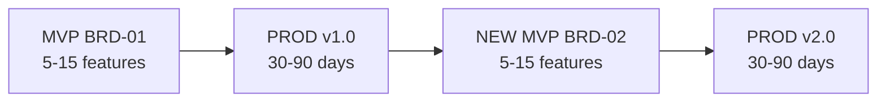

# MVP Development Workflow Guide

**Version**: 4.0
**Purpose**: Iterative product development using the **MVP → PROD → NEW MVP** lifecycle.
**Target Audience**: AI Assistants and teams of any size building production software.

---

## Core Lifecycle: MVP → PROD → NEW MVP



| Phase | Duration | Focus | Key Deliverable |
|:------|:---------|:------|:----------------|
| **MVP** | 1-2 weeks | Build 5-15 core features | BRD → PRD → EARS → BDD → ADR → SYS → REQ → SPEC → TSPEC → TASKS → Production |
| **PROD** | 30-90 days | Operate, measure metrics, collect user feedback | Validated insights and priorities |
| **NEW MVP** | 1-2 weeks | Create NEW BRD for next feature set | Production v(N+1) |

### Critical Principles

1. **Each BRD = One Iteration Cycle**: Never expand BRDs indefinitely — create new ones
2. **New Features = New BRD**: BRD-01, BRD-02, BRD-03 represent successive product versions
3. **Production is Always the Goal**: Every MVP cycle targets production deployment
4. **Cross-Cycle Traceability**: Link iterations using `@depends: BRD-01`
5. **Focused Scope**: 5-15 features per BRD prevents scope creep

---

## Document Size Policy

All SDD documents are monolithic (single self-contained file) up to 50,000 tokens. If a document exceeds 50,000 tokens, create a new document of the same type with its own scope.

---

## Diagram Model by Layer

| Layer | Required Diagram Model |
|-------|------------------------|
| BRD (L1) | C4 L1 (Context) + DFD L1 |
| PRD (L2) | C4 L2 (Container) + DFD L2 + key sequence |
| ADR (L5) | Decision sequence (no C4 level — decision bridge) |
| SYS (L6) | C4 L3 (Component) + DFD L3 |
| SPEC/Code/Test (L9+) | C4 L4 (Code) ownership |

---

## The 6-Step Universal Verification Loop

For **EVERY** layer in the workflow, follow this micro-workflow:

1. **PLAN**: Create/Update `{TYPE}-00_index.md`.
2. **PRE-CHECK**: Verify upstream documents exist for the layer.
3. **SETUP**: Load `{TYPE}-TEMPLATE.yaml` from the layer directory. See: [ID_NAMING_STANDARDS.md](./ID_NAMING_STANDARDS.md).
4. **GENERATE**: Create the document (e.g., `BRD-01_{slug}.yaml`).
5. **VALIDATE**: Run validation via mcp_sdd `sdd_validate` tool. Fix errors.
6. **CORPUS CHECK**: Once all documents for the layer are complete, run full quality gate validation.

---

## 7-Step MVP Workflow

### Step 1: Business Hypothesis (BRD) — Day 1 Morning

**Template**: `{NN}_BRD/BRD-TEMPLATE.yaml`

1. **Plan**: Edit `BRD-00_index.md`.
2. **Pre-Check**: Verify directory structure exists.
3. **Generate**: Create BRD-01 using BRD-TEMPLATE. Focus on hypothesis and core validation.
4. **Validate**: Run `sdd_validate` with `doc_type=brd`.

### Step 2: Core Product Definition (PRD) — Day 1 Morning

**Template**: `{NN}_PRD/PRD-TEMPLATE.yaml`

1. **Plan**: Edit `PRD-00_index.md`.
2. **Pre-Check**: Ensure BRD-01 exists.
3. **Generate**: Create PRD-01 using PRD-TEMPLATE. List P1 features.
4. **Validate**: Run `sdd_validate` with `doc_type=prd`.

### Step 3: Logic Mapping (EARS) — Day 1 Afternoon

**Template**: `{NN}_EARS/EARS-TEMPLATE.yaml`

1. **Plan**: Edit `EARS-00_index.md`.
2. **Pre-Check**: Ensure PRD-01 exists.
3. **Generate**: Create EARS-01. Map PRD features to WHEN-THE-SHALL syntax.
4. **Validate**: Run `sdd_validate` with `doc_type=ears`.

### Step 4: Critical Scenarios (BDD) — Day 1 Late Afternoon

**Template**: `{NN}_BDD/BDD-TEMPLATE.yaml`

1. **Plan**: Edit `BDD-00_index.md`.
2. **Pre-Check**: Ensure EARS-01 exists.
3. **Generate**: Create BDD-01. Include Happy Path + Critical Error Path scenarios.
4. **Validate**: Run `sdd_validate` with `doc_type=bdd`.

### Step 5: Architecture (ADR & SYS) — Day 2 Morning

**Templates**: `{NN}_ADR/ADR-TEMPLATE.yaml`, `{NN}_SYS/SYS-TEMPLATE.yaml`

1. **Plan**: Identify irreversible decisions (ADR) and system boundary (SYS).
2. **Pre-Check**: Ensure upstream docs exist (BRD-01, PRD-01, EARS-01, BDD-01).
3. **Generate**: ADR-01 (Tech Stack), SYS-01 (System Spec).
4. **Validate**: Run `sdd_validate` for both `doc_type=adr` and `doc_type=sys`.

### Step 6: Atomic Requirements (REQ) — Day 2 Mid-Day

**Template**: `{NN}_REQ/REQ-TEMPLATE.yaml`

1. **Plan**: List all required REQ documents in `REQ-00_index.md`.
2. **Pre-Check**: Ensure ADR-01 and SYS-01 exist.
3. **Generate**: Batch creation of atomic requirements.
4. **Validate**: Run `sdd_validate` with `doc_type=req`.

### Step 7: Spec & Code (SPEC → TSPEC → TASKS) — Day 2 Afternoon

**Templates**: `{NN}_SPEC/SPEC-TEMPLATE.yaml`, `{NN}_TSPEC/TSPEC-TEMPLATE.yaml`, `{NN}_TASKS/TASKS-TEMPLATE.yaml`

1. **Plan**: Map REQs to SPECs.
2. **Pre-Check**: Ensure required REQ documents exist.
3. **Generate**: SPECs, TSPECs, and TASKS documents.
4. **Validate**: Run `sdd_validate` for each layer.

---

## Cycle Artifacts

| Cycle | BRD | PRD | Downstream |
|-------|-----|-----|------------|
| 1 | BRD-01 | PRD-01 | EARS-01, ADR-01, SYS-01, REQ-01..N, SPEC-01, TSPEC-01, TASKS-01 |
| 2 | BRD-02 | PRD-02 | EARS-02, ADR-02, SYS-02, REQ-02..N, SPEC-02, TSPEC-02, TASKS-02 |
| 3 | BRD-03 | PRD-03 | EARS-03, ADR-03, ... |

**Cross-Cycle References**:
- `@depends: BRD-01` — BRD-02 builds on foundation from BRD-01
- `@extends: BRD-01` — BRD-02 adds features to existing system

---

## When to Start the Next MVP Cycle

- [ ] Current MVP deployed to production and stable
- [ ] User feedback collected (30-90 days minimum)
- [ ] New feature requirements identified and prioritized
- [ ] Current BRD scope complete (no pending P1s)
- [ ] Business approval for next iteration

---

## Validation

Validation is centralized via mcp_sdd `sdd_validate` tool:

```bash
# Validate any document
sdd_validate --doc-type {type} --path {file}

# Validate traceability
sdd_validate --check-traceability --path {docs_dir}
```

When using the MVP track:
1. Traceability is strictly enforced (`@brd`, `@prd`, `@ears`, etc.)
2. Quality gate auto-approve threshold: score >= 90%
3. Use `custom_fields.template_profile: mvp` in frontmatter to relax non-critical checks during drafting

---

## Change Management

When changes occur during MVP development, use the **4-Gate Change Management System**:

### Change Levels

| Level | When to Use | Process |
|-------|-------------|---------|
| **L1 Patch** | Bug fixes, typos | Edit in place, no CHG required |
| **L2 Minor** | Feature adds, enhancements | Use `CHG-TEMPLATE.yaml` |
| **L3 Major** | Architecture pivots | Full CHG with archive |

### Gate Entry Points

| Change Source | Entry Gate | Typical Scenario |
|---------------|------------|------------------|
| Business request | GATE-01 | New feature from stakeholder |
| Architecture change | GATE-05 | Technology pivot |
| Design optimization | GATE-09 | Better algorithm |
| Bug/defect | GATE-12 | Test failure fix |
| Emergency | BYPASS | P1 incident |

**Documentation**: [CHG/CHG-00_index.md](./CHG/CHG-00_index.md)

---

## References

- [LAYER_REGISTRY.yaml](./LAYER_REGISTRY.yaml) — Layer definitions and templates
- [ID_NAMING_STANDARDS.md](./ID_NAMING_STANDARDS.md) — Document ID and element ID standards
- [TRACEABILITY.md](./TRACEABILITY.md) — Cross-layer traceability rules
- [CUMULATIVE_TAG_REFERENCE.md](./CUMULATIVE_TAG_REFERENCE.md) — Tag counts by layer
