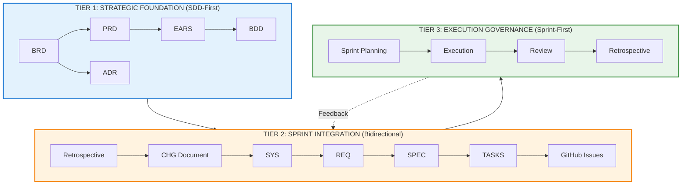
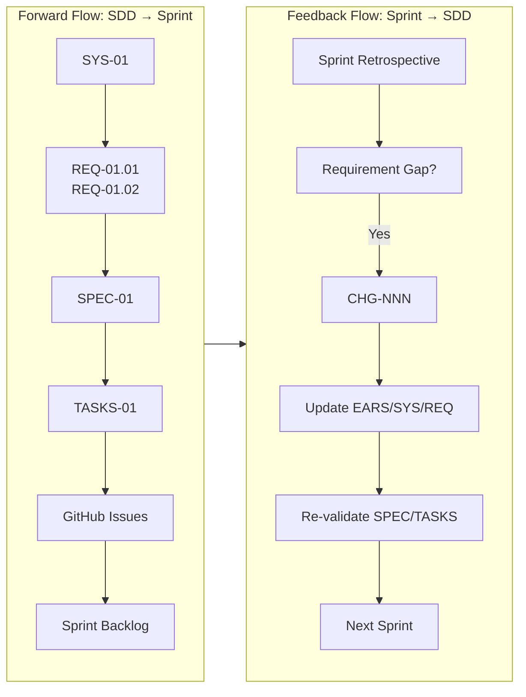
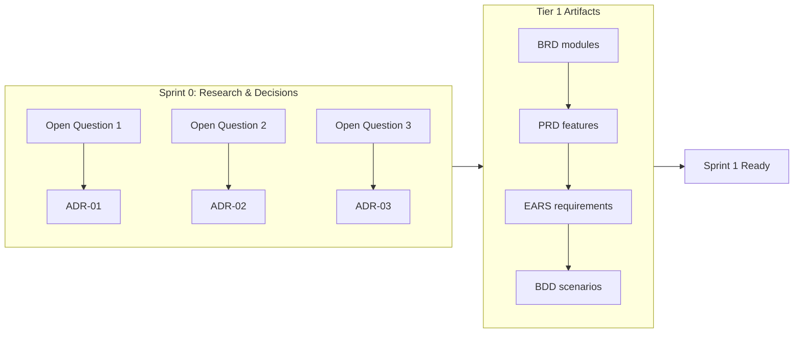
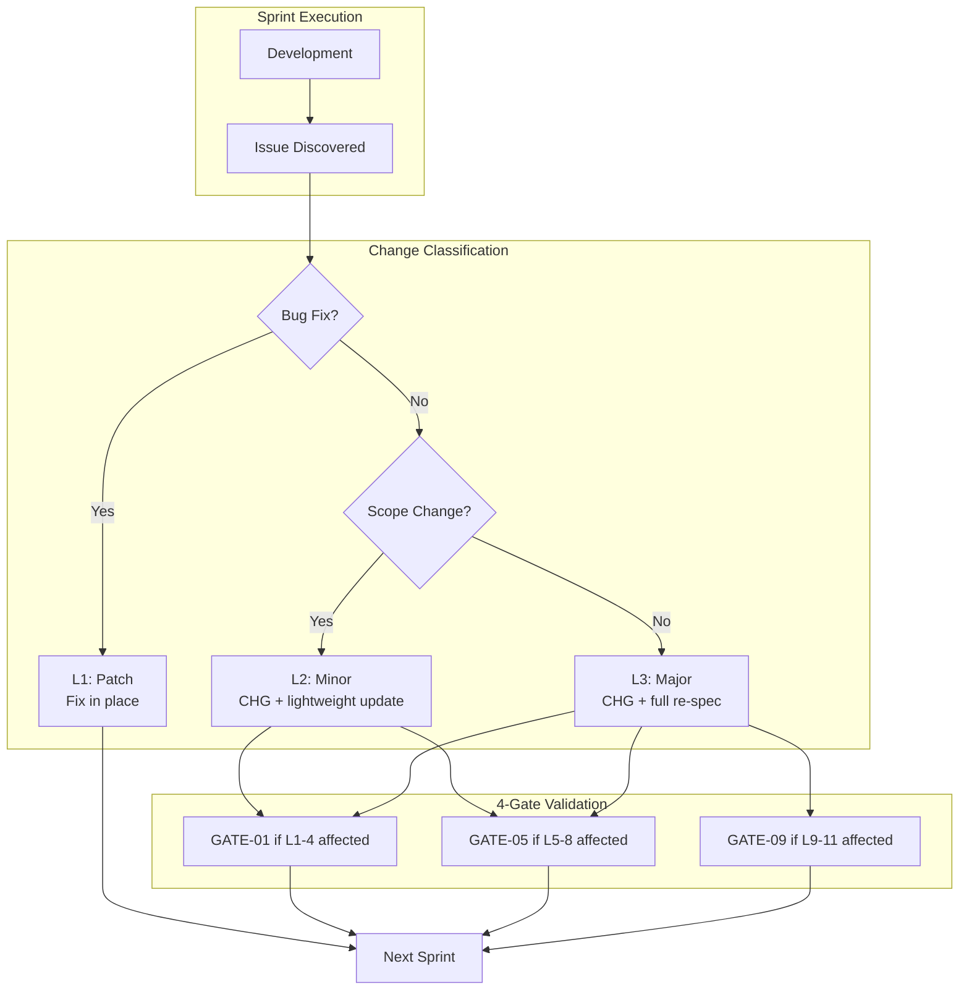
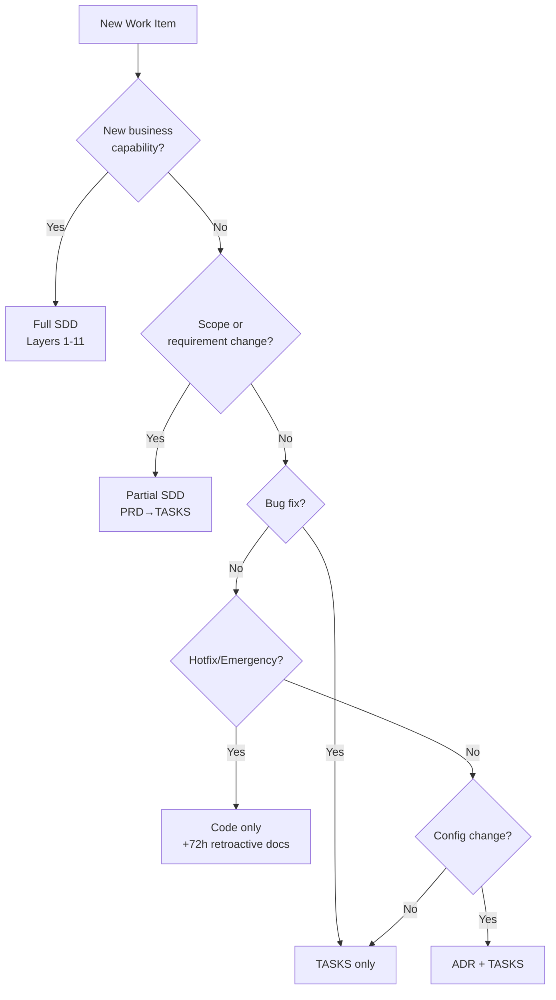
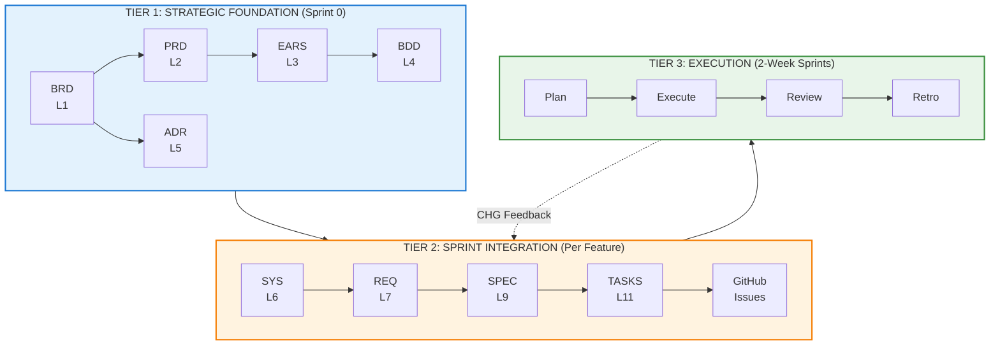

<!-- markdownlint-disable MD025 MD032 MD036 MD040 MD060 -->

# SDD Project Model v2.2

## Sprint-Based Governance + Specification-Driven Development Integration

**Version**: 2.2
**Created**: 2026-02-14
**Updated**: 2026-02-16
**Location**: `ai_dev_ssd_flow/PROJECT/PROJECT_MODEL.md`
**Status**: Active
**Applicable To**: Production projects requiring both agile delivery and requirements traceability

---

## 1. Executive Summary

### 1.1 Purpose

This document defines a **hybrid development methodology** that integrates:

- **Sprint-Based Governance**: 2-week iterations, GitHub-native tracking, AI-assisted task execution
- **Specification-Driven Development (SDD)**: 15-layer artifact hierarchy, cumulative traceability, quality gates

### 1.2 Value Proposition

| Challenge | Hybrid Solution |
|-----------|-----------------|
| Sprint velocity vs documentation rigor | SDD Layers 1-5 upfront, sprints for execution |
| Requirement traceability gaps | Automated TASKS→GitHub Issue mapping with full tags |
| Documentation drift | Weekly drift checks, CI-integrated validators |
| Late requirement discovery | Feedback loop via CHG documents |
| Regulatory compliance needs | Full BRD→Code audit trail preserved |

### 1.3 Target Audience

| Role | How This Document Helps |
|------|------------------------|
| **Project Lead** | Adoption decision, rollout planning |
| **Product Manager** | Understand BRD/PRD integration with sprints |
| **Architect** | ADR workflow, CHG/4-Gate integration |
| **Developer** | TASKS→Issue automation, PR workflow |
| **QA Lead** | BDD/TSPEC integration with sprint testing |
| **DevOps** | CI/CD validator integration |

### 1.4 When to Use This Model

**Use Hybrid Model when**:
- Production product with 3+ month lifecycle
- Team size 5-15 developers
- Mix of planned features and exploratory work
- Need traceability without sacrificing velocity
- Regulatory compliance desired but not mandated

**Do NOT use when**:
- Pure prototype/POC (use Sprint-Only)
- Strict regulatory mandate like FDA/ISO (use Full SDD)
- Solo developer project (overkill)
- Fixed-scope contract with detailed upfront specs (use Full SDD)

### 1.5 Key Outcomes

```text

                    HYBRID MODEL OUTCOMES                    

  Velocity         2-week sprint delivery cycles            
  Traceability     100% requirement→code lineage            
  Quality          14+ validators integrated in CI          
  Flexibility      Skip layers for bug fixes/hotfixes       
  Compliance       Full audit trail when needed             
  Automation       90% artifact generation + issue sync     

```

---

## 2. Prerequisites

### 2.1 Required Infrastructure

| Component | Purpose | Setup Reference |
|-----------|---------|-----------------|
| GitHub Repository | Issue tracking, PR workflow | Standard |
| GitHub Project (V2) | Sprint board, phase tracking | `ai_project_issues_flow/governance/GITHUB_PROJECT_SETUP_AI_FIRST.md` |
| Claude Code / Skills | SDD artifact generation | `.claude/skills/` |
| Python 3.10+ | Validation scripts | `requirements.txt` |
| CI/CD Pipeline | Validator integration | `.github/workflows/` |

### 2.2 Required Documentation

| Document | Status | Action if Missing |
|----------|--------|-------------------|
| BRD-00_index.md | Required | Create using `/doc-brd` skill |
| ADR folder structure | Required | Create `docs/05_ADR/` |
| TASKS template | Required | Copy from `ai_dev_ssd_flow/11_TASKS/` (SDD) or use IPLANs from `ai_project_issues_flow/governance/plans/` |
| CHG template | Required | Copy from `ai_dev_ssd_flow/CHG/` (SDD projects only) |

### 2.3 Team Readiness

| Skill | Required Level | Training Resource |
|-------|----------------|-------------------|
| SDD artifact basics | Understand BRD→TASKS flow | `SPEC_DRIVEN_DEVELOPMENT_GUIDE.md` |
| GitHub Projects | Can manage board, labels | GitHub Docs |
| Traceability tags | Understand cumulative tagging | `TRACEABILITY.md` |
| Validator usage | Can run and interpret | `scripts/README.md` |

---

## 3. Approach Comparison

### 3.1 Sprint-Based Governance

**Source Reference**: `ai_project_issues_flow/governance/`

| Aspect | Description |
|--------|-------------|
| **Structure** | Configurable phases, 2-week sprints, project-defined timeline |
| **Focus** | Task execution and iterative delivery |
| **Tracking** | GitHub Project boards, Issues, PRs |
| **Automation** | 43% time reduction via AI-assisted development |
| **Traceability** | Issue → PR → Code (limited) |

**Strengths**:

| Category | Benefit |
|----------|---------|
| Flexibility | Adapts to scope changes within sprints |
| Visibility | GitHub Project boards, daily task progress |
| Team Coordination | Clear roles (AI vs Human), polyrepo isolation |
| Iterative Delivery | Working software every 2 weeks |
| Risk Management | Sprint 0 resolves blocking questions upfront |
| Tooling Integration | Native GitHub ecosystem (Issues, PR, Actions) |
| Accountability | Definition of Done at task/sprint/phase levels |

**Limitations**:

| Category | Limitation |
|----------|------------|
| Traceability Gap | No formal requirement→code lineage |
| Documentation Debt | Docs often lag behind implementation |
| Regulatory Risk | Insufficient audit trail for ISO/FDA compliance |
| Rework Cost | Late discovery of requirement misunderstanding |
| Specification Drift | No formal contract between business and technical |
| Manual Overhead | Board sync, label management, status updates |

**Best Use Cases**:
1. Greenfield prototypes with fuzzy requirements
2. Small teams (1-5 developers)
3. Internal tools without compliance requirements
4. Time-boxed POCs with fixed deadline
5. Infrastructure projects with clear technical deliverables

### 3.2 Document Flow Framework (SDD)

**Source Reference**: `ai_dev_ssd_flow/`

| Aspect | Description |
|--------|-------------|
| **Structure** | 15 layers (BRD → Code), cumulative traceability |
| **Focus** | Requirements traceability and quality assurance |
| **Tracking** | Artifact validation, readiness scores |
| **Automation** | 90%+ artifact generation via autopilot |
| **Traceability** | Full audit trail with cumulative tags |

**Strengths**:

| Category | Benefit |
|----------|---------|
| Full Traceability | Complete audit trail: BRD→Code with cumulative tags |
| Regulatory Compliance | ISO 26262, FDA 21 CFR Part 11, SOX ready |
| 90% Automation | Autopilot generates 14 of 15 layers |
| Quality Gates | 14+ validation checks per layer, auto-fix |
| Requirement Clarity | EARS/BDD enforce measurable, testable requirements |
| TDD Integration | TSPEC drives test implementation before code |
| Impact Analysis | Change in upstream → visible downstream impact |
| Reduced Rework | Errors caught in specification, not implementation |

**Limitations**:

| Category | Limitation |
|----------|------------|
| Upfront Investment | 15 layers require discipline, even if automated |
| Learning Curve | Team must understand artifact relationships |
| Overhead for Simple Tasks | Overkill for bug fixes or minor enhancements |
| Sequential Bottlenecks | Layer N depends on Layer N-1 completion |
| Less Agile | Changing BRD triggers cascade through all layers |
| Tool Dependency | Requires skill infrastructure (Claude skills, validators) |

**Best Use Cases**:
1. Regulated industries (healthcare, finance, automotive)
2. Complex domains (AI agents, multi-cloud, distributed systems)
3. Long-lived products (3+ year lifecycle)
4. Large teams (10+ developers)
5. Mission-critical systems
6. Contract development with formal deliverables

### 3.3 AI Project Flow

**Source Reference**: `ai_project_issues_flow/`

| Aspect | Description |
|--------|-------------|
| **Structure** | Configurable phases, phase-gated deployment, AI label lifecycle |
| **Focus** | Rapid AI-assisted development with governance guardrails |
| **Tracking** | GitHub Project boards, AI-powered issue execution |
| **Automation** | AI PR review, phase-gated deployment, automated QA |
| **Traceability** | Issue → PR → Deployment (phase-based) |

**Strengths**:

| Category | Benefit |
|----------|---------|
| AI-First Design | Built for AI assistants (Claude, Gemini, Copilot) |
| Phase-Gated Deployment | dev → staging → prod with automated gates |
| AI Label Lifecycle | `ai:ready` → `ai:in-progress` → `ai:review-requested` |
| Multi-Cloud Support | Setup scripts for GCP, AWS, Azure |
| Lightweight Governance | IPLAN templates instead of full SDD artifacts |
| Rapid Setup | 47+ placeholder variables, validation script |
| GitHub-Native | 18 workflow templates, issue automation |

**Limitations**:

| Category | Limitation |
|----------|------------|
| Limited Traceability | No formal requirement→code lineage (phase-based only) |
| Regulatory Gap | Insufficient for FDA/ISO compliance |
| Documentation Scope | IPLANs vs full SDD artifacts |
| Team Scale | Optimized for solo/small teams, not enterprise |
| Change Management | No formal CHG/4-Gate system |

**Best Use Cases**:
1. Small AI-first projects (1-6 month timeline)
2. Solo developers or small teams (1-5 developers)
3. MVPs and prototypes with production intent
4. Projects leveraging AI assistants heavily
5. Rapid iteration with phase-gated quality gates
6. Multi-cloud deployments with GitHub Actions

### 3.4 Framework Selection Matrix

| Criteria | Sprint-Only | AI Project Flow | Hybrid v2.2 | Full SDD |
|----------|:-----------:|:---------------:|:-----------:|:--------:|
| Team Size | 1-5 | 1-5 | 5-15 | 10+ |
| Timeline | <3 months | 1-6 months | 3-12 months | >12 months |
| AI Integration | Optional | Primary | Complementary | Complementary |
| Traceability | Minimal | Phase-based | Full | Full |
| Regulatory | None | None | Optional | Required |
| Deployment Model | Manual | Phase-gated | Sprint-based | Formal gates |
| Documentation | Minimal | IPLANs | 15-layer SDD | 15-layer SDD |
| Setup Complexity | Low | Low | Medium | High |

---

## 4. Hybrid Model v2.2 Architecture

### 4.1 Three-Tier Integration

> **Note**: We use "Tier" (not "Layer") to avoid confusion with SDD's Layer 1-15 numbering.



### 4.2 Tier 1: Strategic Foundation (SDD-First)

**Purpose**: Establish business/product intent before sprint execution begins.

**SDD Layers Used**: 1 (BRD), 2 (PRD), 3 (EARS), 4 (BDD), 5 (ADR)

| Artifact | When Created | Owner | Sprint Integration |
|----------|--------------|-------|-------------------|
| BRD | Project inception | Business Owner | Maps to Phase Epics |
| PRD | Feature scoping | Product Manager | Maps to Feature Epics |
| EARS | Requirement formalization | BA/Architect | Source for acceptance criteria |
| BDD | Testability definition | QA Lead | Source for test plans |
| ADR | Technical decisions | Architect | Sprint 0 research output |

**Output**: Phase-aligned requirement sets ready for sprint execution.

**Timing**: Complete Tier 1 before Sprint 1 begins (typically during Sprint 0).

### 4.3 Tier 2: Sprint Integration (Bidirectional)

**Purpose**: Bridge SDD specifications to executable sprint tasks with feedback loop.

**SDD Layers Used**: 6 (SYS), 7 (REQ), 8 (CTR), 9 (SPEC), 10 (TSPEC), 11 (TASKS)



**Feedback Loop Triggers**:

| Trigger | CHG Level | Action | SDD Update |
|---------|-----------|--------|------------|
| Sprint defect | L1 (Patch) | Bug fix in place | Update TASKS only |
| Scope change | L2 (Minor) | PO approval required | Update PRD→TASKS cascade |
| Technical pivot | L3 (Major) | Architecture review | Full re-specification |
| Performance issue | L2 (Minor) | ADR amendment | Update SPEC constraints |

### 4.4 Tier 3: Execution Governance (Sprint-First)

**Purpose**: Iterative delivery with quality gates and team coordination.

| Governance Artifact | SDD Equivalent | Integration Point |
|---------------------|----------------|-------------------|
| Phase Epic | BRD module | 1:1 mapping, links in epic description |
| Feature Epic | PRD feature set | 1:1 mapping, @prd tag in epic |
| Sprint Task | TASKS element | Auto-generated via `tasks_to_github.py` |
| Definition of Done | BDD scenarios | Imported as acceptance criteria checkboxes |
| Sprint 0 Research | ADR documents | ADR-NN created per decision |

### 4.5 Sprint 0 Integration

Sprint 0 bridges Tier 1 (SDD strategic) with Tier 3 (sprint execution).



**Sprint 0 Checklist**:

| # | Task | Output | Blocks |
|---|------|--------|--------|
| 0.1 | Identify blocking technical questions | Question list | All |
| 0.2 | Research each question | Research notes | 0.3 |
| 0.3 | Document decisions as ADRs | ADR-01 through ADR-NN | Sprint 1 |
| 0.4 | Validate BRD completeness | BRD validation report | 0.5 |
| 0.5 | Generate PRD from BRD | PRD-01 through PRD-NN | 0.6 |
| 0.6 | Generate EARS from PRD | EARS-01 through EARS-NN | 0.7 |
| 0.7 | Generate BDD from EARS | BDD-01 through BDD-NN | Sprint 1 |
| 0.8 | Set up GitHub Project board | Configured board | Sprint 1 |

---

## 5. Roles and Responsibilities (RACI Matrix)

### 5.1 Artifact Ownership

| Activity | Project Lead | Product Manager | Architect | Developer | QA Lead | DevOps |
|----------|:------------:|:---------------:|:---------:|:---------:|:-------:|:------:|
| BRD creation | A | R | C | I | I | I |
| PRD creation | A | R | C | I | C | I |
| EARS creation | A | C | R | I | C | I |
| BDD creation | A | C | C | I | R | I |
| ADR creation | A | I | R | C | I | C |
| SYS creation | A | I | R | C | C | I |
| REQ creation | A | I | R | C | C | I |
| SPEC creation | A | I | C | R | I | I |
| TSPEC creation | A | I | I | C | R | I |
| TASKS creation | A | I | C | R | C | I |
| GitHub Issue sync | A | I | I | R | I | C |
| Validator CI setup | A | I | I | C | I | R |
| CHG management | R | C | A | C | C | I |

**Legend**: R = Responsible, A = Accountable, C = Consulted, I = Informed

### 5.2 Sprint Ceremony Roles

| Ceremony | Lead | Required Attendees | Optional |
|----------|------|-------------------|----------|
| Sprint Planning | Project Lead | All | - |
| Daily Standup | Rotating | Developers, QA | PM, Architect |
| Sprint Review | Product Manager | All | Stakeholders |
| Retrospective | Project Lead | All | - |
| CHG Review | Architect | PM, Dev Lead | Others as needed |

---

## 6. CHG and 4-Gate System Integration

### 6.1 How CHG Fits in Hybrid Model

The CHG (Change Management) system handles requirement changes discovered during sprint execution.



### 6.2 Gate Applicability in Hybrid Model

| Gate | Layers | When Required in Hybrid |
|------|--------|------------------------|
| GATE-01 | L1-4 (BRD→BDD) | Scope change affects business requirements |
| GATE-05 | L5-8 (ADR→CTR) | Architecture decision changed |
| GATE-09 | L9-11 (SPEC→TASKS) | Technical specification modified |
| GATE-12 | L12-14 (Code→Validation) | Post-implementation validation |

### 6.3 CHG Workflow in Sprint Context

| Sprint Event | CHG Action | Timeline |
|--------------|------------|----------|
| Defect found | Classify severity | Same day |
| L1 Patch | No CHG needed | Immediate fix |
| L2 Minor | Create CHG, get PO approval | Within sprint |
| L3 Major | Create CHG, architecture review | May extend sprint |
| Retrospective | Review all CHGs | End of sprint |

**CHG Document Location**: `docs/CHG/CHG-NN_{slug}/`

**Reference**: `ai_dev_ssd_flow/CHG/CHANGE_MANAGEMENT_GUIDE.md` (SDD projects) or `ai_project_issues_flow/governance/plans/` (AI Project Flow)

---

## 7. TASKS → GitHub Issue Automation

### 7.1 Mapping Specification

TASKS elements map to GitHub Issues with full traceability:

```yaml
# TASKS file structure (from TASKS-TEMPLATE.md Section 4)
metadata:
  spec_reference: SPEC-01_budget_alerts
  sprint: "Sprint 2.1"
  phase: "P1"

tasks:
  - id: TASKS-01.01.01
    title: "Implement budget threshold checker"
    description: |
      Create function to check current spend against configured thresholds.
    traceability:
      brd: "BRD-01:BRD.01.02.01"
      prd: "PRD-01:PRD.01.04.02"
      ears: "EARS-01:EARS.01.03.01"
      spec: "SPEC-01"
    acceptance_criteria:
      - "Threshold check returns boolean within 100ms"
      - "Supports percentage and absolute thresholds"
      - "Logs threshold breach events"
    size: "M"
    priority: "P0"
    dependencies: []

  - id: TASKS-01.01.02
    title: "Create notification dispatcher"
    # ... additional tasks
```

### 7.2 GitHub Issue Template

Create `.github/ISSUE_TEMPLATE/sdd-task.yml`:

```yaml
name: SDD Task
description: Task generated from TASKS specification
title: "[${PHASE}-${TASK_NUM}] ${TITLE}"
labels: ["ai:ready", "source:sdd"]
body:
  - type: markdown
    attributes:
      value: |
        ## Traceability
        <!-- Auto-populated from TASKS file -->

  - type: input
    id: brd_ref
    attributes:
      label: "@brd"
      description: "BRD reference"
    validations:
      required: true

  - type: input
    id: prd_ref
    attributes:
      label: "@prd"
      description: "PRD reference"
    validations:
      required: true

  - type: input
    id: spec_ref
    attributes:
      label: "@spec"
      description: "SPEC reference"
    validations:
      required: true

  - type: input
    id: tasks_ref
    attributes:
      label: "@tasks"
      description: "TASKS element ID"
    validations:
      required: true

  - type: textarea
    id: acceptance
    attributes:
      label: "Acceptance Criteria"
      description: "Imported from SPEC"
      placeholder: |
        - [ ] Criterion 1
        - [ ] Criterion 2
    validations:
      required: true

  - type: textarea
    id: implementation
    attributes:
      label: "Implementation Notes"
      description: "From TASKS guidance"
```

### 7.3 Automation Script

```bash
# Convert TASKS to GitHub Issues
python scripts/tasks_to_github.py \
  --tasks-file docs/11_TASKS/TASKS-01_budget_alerts.yaml \
  --repo owner/repo-name \
  --sprint "Sprint 2.1" \
  --dry-run  # Remove for actual creation
```

**Script Requirements** (for `scripts/tasks_to_github.py`):

```python
"""
TASKS to GitHub Issue Sync

Dependencies:
- PyGithub
- PyYAML
- Click

Usage:
    python tasks_to_github.py --tasks-file <path> --repo <owner/repo> --sprint <name>

Features:
- Parses TASKS YAML format
- Creates GitHub issues with full traceability
- Applies labels from task metadata
- Sets milestone from sprint name
- Links to parent epic if available
- Idempotent: skips existing issues (matches by @tasks ID)
"""
```

---

## 8. Quality Gate Integration

### 8.1 Validator Triggers

| Sprint Event | SDD Validator | Blocking? | Action on Failure |
|--------------|---------------|-----------|-------------------|
| Sprint Planning | `doc-spec-validator` | Yes | Cannot start sprint without valid SPEC |
| PR Created | `doc-tspec-validator` | No | Warning, manual review |
| PR Approved | `trace-check` | Yes | Must have valid traceability |
| PR Merged | Matrix update | No | Auto-update traceability matrix |
| Sprint Review | `doc-validator` (all) | No | Flag for retrospective |
| Phase Exit | All validators | Yes | Cannot close phase with errors |

### 8.2 CI/CD Integration

Create `.github/workflows/sdd-validation.yml`:

```yaml
name: SDD Validation

on:
  pull_request:
    paths:
      - 'docs/**/*.md'
      - 'docs/**/*.yaml'
      - 'docs/**/*.feature'
  push:
    branches: [main]
    paths:
      - 'docs/**/*'

jobs:
  validate-artifacts:
    runs-on: ubuntu-latest
    steps:
      - uses: actions/checkout@v4
        with:
          fetch-depth: 0  # Full history for diff

      - name: Set up Python
        uses: actions/setup-python@v5
        with:
          python-version: '3.11'

      - name: Install dependencies
        run: |
          pip install -r scripts/requirements.txt

      - name: Get changed files
        id: changed
        run: |
          if [ "${{ github.event_name }}" = "pull_request" ]; then
            echo "files=$(git diff --name-only origin/${{ github.base_ref }}...HEAD | grep -E '^docs/.*\.(md|yaml|feature)$' | tr '\n' ' ')" >> $GITHUB_OUTPUT
          else
            echo "files=$(git diff --name-only HEAD~1 | grep -E '^docs/.*\.(md|yaml|feature)$' | tr '\n' ' ')" >> $GITHUB_OUTPUT
          fi

      - name: Validate changed artifacts
        if: steps.changed.outputs.files != ''
        run: |
          for file in ${{ steps.changed.outputs.files }}; do
            echo "Validating: $file"
            python scripts/validate_artifact.py --path "$file" --strict
          done

      - name: Validate traceability
        run: |
          python scripts/validate_tags_against_docs.py --validate-cumulative

  update-matrix:
    runs-on: ubuntu-latest
    needs: validate-artifacts
    if: github.event_name == 'push' && github.ref == 'refs/heads/main'
    steps:
      - uses: actions/checkout@v4

      - name: Set up Python
        uses: actions/setup-python@v5
        with:
          python-version: '3.11'

      - name: Update traceability matrix
        run: |
          python scripts/generate_traceability_matrix.py --auto

      - name: Commit matrix updates
        run: |
          git config user.name "github-actions[bot]"
          git config user.email "github-actions[bot]@users.noreply.github.com"
          git add docs/generated/
          git diff --staged --quiet || git commit -m "chore: update traceability matrix [skip ci]"
          git push
```

---

## 9. Worked Example: Adding Budget Alert Feature

This example shows how a new feature flows through the hybrid model.

### 9.1 Starting Point

**User Request**: "Add email notifications when cloud spend exceeds 80% of budget"

### 9.2 Tier 1: Strategic Foundation

**Step 1: Update BRD** (if new business capability)

```markdown
# In BRD-01_cost_monitoring.md, Section 3.2

## BRD.01.02.05 Budget Alerting
The system shall notify stakeholders when spending approaches or exceeds budget thresholds.

- Threshold levels: 50%, 80%, 100%, 120%
- Notification channels: Email, Teams, Slack
- Alert frequency: Maximum 1 per threshold per day
```

**Step 2: Create/Update PRD**

```markdown
# PRD-01_cost_monitoring.md, Section 5

## PRD.01.05.01 Budget Alert Notifications

**User Story**: As a FinOps Manager, I want to receive email alerts when cloud spend reaches 80% of my budget so that I can take corrective action before overspending.

**Acceptance Criteria**:
- Email sent within 5 minutes of threshold breach
- Email includes: current spend, budget amount, percentage, top 3 cost drivers
- User can configure alert recipients per budget
```

**Step 3: Generate EARS**

```markdown
# EARS-01_cost_monitoring.md

## EARS.01.03.01 Budget Threshold Alert

**Requirement**:
WHEN the calculated spend percentage exceeds a configured threshold,
THE system SHALL send an email notification to configured recipients
WITHIN 5 minutes of threshold detection.

**Measurable Criteria**:
- Latency: < 5 minutes from detection to delivery
- Accuracy: 100% of threshold breaches trigger notification
- Delivery: 99.9% email delivery success rate
```

**Step 4: Generate BDD**

```gherkin
# BDD-01_cost_monitoring.feature

Feature: Budget Alert Notifications
  As a FinOps Manager
  I want budget threshold alerts
  So that I can prevent overspending

  @brd: BRD-01:BRD.01.02.05
  @prd: PRD-01:PRD.01.05.01
  @ears: EARS-01:EARS.01.03.01

  Scenario: Email sent when 80% threshold exceeded
    Given a budget of $10,000 for project "web-app"
    And alert threshold configured at 80%
    And current spend is $7,500
    When new charges of $600 are recorded
    Then an email alert should be sent within 5 minutes
    And the email should contain current spend "$8,100"
    And the email should contain budget amount "$10,000"
    And the email should contain percentage "81%"
```

### 9.3 Tier 2: Sprint Integration

**Step 5: Generate SYS/REQ**

```markdown
# REQ-05_budget_alerts/REQ-05_budget_alerts.md

## REQ.05.01.01 Threshold Detection

**Requirement**: The budget monitoring service shall calculate spend percentage after each cost update and compare against configured thresholds.

**Traceability**:
- @brd: BRD-01:BRD.01.02.05
- @prd: PRD-01:PRD.01.05.01
- @ears: EARS-01:EARS.01.03.01
- @bdd: BDD-01:BDD.01.01.01
- @sys: SYS-01:SYS.01.03.01

**Acceptance Criteria**:
- Calculation accuracy: within 0.1% of actual
- Processing time: < 1 second per budget check
```

**Step 6: Generate SPEC**

```yaml
# SPEC-05_budget_alerts.yaml

spec_id: SPEC-05
title: Budget Alert System
version: 1.0.0

traceability:
  brd: BRD-01:BRD.01.02.05
  prd: PRD-01:PRD.01.05.01
  ears: EARS-01:EARS.01.03.01
  req: REQ-05:REQ.05.01.01

components:
  - name: ThresholdChecker
    type: class
    methods:
      - name: check_threshold
        input:
          - name: budget_id
            type: str
          - name: current_spend
            type: Decimal
        output:
          type: Optional[ThresholdBreach]
        description: Compare spend against thresholds, return breach if exceeded

  - name: AlertDispatcher
    type: class
    methods:
      - name: send_email_alert
        input:
          - name: breach
            type: ThresholdBreach
          - name: recipients
            type: List[str]
        output:
          type: AlertResult
        description: Format and send email notification
```

**Step 7: Generate TASKS**

```yaml
# TASKS-05_budget_alerts.yaml

metadata:
  spec_reference: SPEC-05_budget_alerts
  sprint: "Sprint 3.1"
  phase: "P2"

tasks:
  - id: TASKS-05.01.01
    title: "Implement ThresholdChecker class"
    traceability:
      brd: "BRD-01:BRD.01.02.05"
      prd: "PRD-01:PRD.01.05.01"
      spec: "SPEC-05"
    acceptance_criteria:
      - "Calculates percentage with 0.1% accuracy"
      - "Returns ThresholdBreach when exceeded"
      - "Processing time < 1 second"
    size: "M"

  - id: TASKS-05.01.02
    title: "Implement AlertDispatcher class"
    traceability:
      brd: "BRD-01:BRD.01.02.05"
      prd: "PRD-01:PRD.01.05.01"
      spec: "SPEC-05"
    acceptance_criteria:
      - "Sends email via configured SMTP"
      - "Email contains all required fields"
      - "Handles delivery failures gracefully"
    size: "M"
    dependencies: ["TASKS-05.01.01"]
```

### 9.4 Tier 3: Sprint Execution

**Step 8: Convert to GitHub Issues**

```bash
python scripts/tasks_to_github.py \
  --tasks-file docs/11_TASKS/TASKS-05_budget_alerts.yaml \
  --repo myorg/cost-monitoring \
  --sprint "Sprint 3.1"
```

**Created Issues**:
- `[P2-05.01.01] Implement ThresholdChecker class`
- `[P2-05.01.02] Implement AlertDispatcher class`

**Step 9: Sprint Execution**

```
Sprint 3.1 (Days 1-10):
 Day 1: Sprint planning, pull TASKS-05 into backlog
 Day 2-3: Implement ThresholdChecker (TASKS-05.01.01)
 Day 4-5: Implement AlertDispatcher (TASKS-05.01.02)
 Day 6-7: Integration testing against BDD scenarios
 Day 8-9: Code review, address feedback
 Day 10: Sprint review, demo to stakeholders
```

**Step 10: Feedback Loop** (if needed)

During implementation, developer discovers email templates need localization support (not in original requirements).

```markdown
# CHG-01_budget_alert_localization/CHG-01_definition.md

## Change Request: Add Email Localization

**Change Level**: L2 (Minor)
**Trigger**: Implementation discovery
**Impact**: PRD-01, SPEC-05, TASKS-05

**Proposed Change**:
Add locale parameter to AlertDispatcher.send_email_alert()

**Approval**: Product Owner
**Timeline**: Address in Sprint 3.2
```

---

## 10. Decision Framework

### 10.1 Layer Usage by Scenario

| Layer | New Feature | Enhancement | Bug Fix | Hotfix | Config Change |
|-------|:-----------:|:-----------:|:-------:|:------:|:-------------:|
| BRD | If new capability | - | - | - | - |
| PRD | Yes | If scope change | - | - | - |
| EARS | Yes | If acceptance changes | - | - | - |
| BDD | Yes | If tests change | - | - | - |
| ADR | If decision needed | If decision needed | - | - | If decision needed |
| SYS | Yes | If system impact | - | - | - |
| REQ | Yes | If requirements change | - | - | - |
| CTR | If interface | If interface changes | - | - | - |
| SPEC | Yes | Yes | - | - | - |
| TSPEC | Yes | If tests change | - | - | - |
| TASKS | Yes | Yes | Yes | - | Yes |
| Code | Yes | Yes | Yes | Yes | Yes |

### 10.2 Quick Decision Tree



### 10.3 Project Type Selection

**Use FULL SDD when**:
- [ ] Regulatory compliance required (FDA, ISO, SOX)
- [ ] Product lifecycle > 3 years
- [ ] Team size > 10 developers
- [ ] External stakeholder sign-off needed
- [ ] Complex domain (AI, distributed systems, multi-cloud)
- [ ] Contract development with formal deliverables

**Use Sprint-Only when**:
- [ ] Proof of concept or prototype
- [ ] Team size < 5
- [ ] Internal tooling with no compliance needs
- [ ] Fixed deadline, flexible scope
- [ ] Clear technical requirements, minimal business logic

**Use AI Project Flow when**:
- [ ] Small AI-first project (1-6 months)
- [ ] Solo developer or team < 5
- [ ] Heavy reliance on AI assistants (Claude, Gemini, Copilot)
- [ ] Need phase-gated deployment (dev → staging → prod)
- [ ] Want GitHub-native automation without SDD overhead
- [ ] Building MVP with production deployment intent
- [ ] Multi-cloud deployment (GCP, AWS, Azure)

**Use Hybrid when**:
- [ ] Production product with growth potential
- [ ] Mix of planned features and exploratory work
- [ ] Need traceability without full bureaucracy
- [ ] Medium team (5-15 developers)
- [ ] Iterative delivery with quality gates
- [ ] May need compliance in future

---

## 11. Risk Mitigation

### 11.1 Documentation Drift

**Risk**: SDD artifacts become outdated as sprints progress.

**Mitigation**: Weekly drift check

```bash
# Run every Friday (add to CI or cron)
python scripts/drift_check.py \
  --sdd-root docs/ \
  --github-project 31 \
  --max-age-days 14 \
  --report tmp/drift_report.md
```

**Drift Check Logic**:
- Compare TASKS last-modified vs GitHub issue close date
- Flag artifacts not updated in 14+ days with open issues
- Generate report for retrospective review

### 11.2 Over-Documentation

**Risk**: Team spends more time documenting than building.

**Mitigation**: MVP template enforcement
- All artifacts use MVP templates (not full)
- Maximum 11 sections per document
- No document > 50,000 tokens
- Bug fixes: TASKS only, no upstream updates

### 11.3 Validator Bottlenecks

**Risk**: Validators block development velocity.

**Mitigation**: Async validation strategy
- PR creation: Validators run but don't block
- PR approval: Traceability check required
- PR merge: Full validation required
- Sprint planning: SPEC validation required

### 11.4 Team Resistance

**Risk**: Team finds hybrid model too complex.

**Mitigation**: Gradual adoption

| Week | Team Responsibility | AI Responsibility |
|------|---------------------|-------------------|
| 1-4 | Review SDD artifacts | Generate all artifacts |
| 5-8 | Write TASKS, review others | Generate Layers 1-9 |
| 9-12 | Write SPEC+TASKS, review others | Generate Layers 1-7 |
| 13+ | Full participation | Assist and validate |

### 11.5 Sprint 0 Scope Creep

**Risk**: Sprint 0 research expands indefinitely.

**Mitigation**: Time-boxed research
- Sprint 0 maximum: 1 week
- Each research question: 2-hour timebox
- Decision required even with incomplete information
- Document uncertainty in ADR "Risks" section

### 11.6 Anti-Patterns to Avoid

These common mistakes undermine the hybrid model's effectiveness:

| Anti-Pattern | Why It's Harmful | Correct Approach |
|--------------|------------------|------------------|
| **Skipping Tier 1 for "simple" features** | Creates traceability gaps, requirements discovered late | Always create at least PRD + BDD for new features |
| **Treating SDD as one-time documentation** | Artifacts become stale, lose value | Update artifacts as part of sprint workflow |
| **Bypassing validators "to save time"** | Technical debt accumulates, errors propagate | Validators are non-negotiable at merge |
| **Creating CHG for every change** | Process overhead kills velocity | L1 patches don't need CHG, only L2/L3 |
| **Manual TASKS→Issue sync** | Error-prone, inconsistent traceability | Always use automation script |
| **Skipping Sprint 0** | Blocking decisions delay Sprint 1 | Research phase is investment, not overhead |
| **Over-documenting bug fixes** | Wastes effort on transient issues | Bug fixes = TASKS only, no upstream updates |
| **Ignoring retrospective feedback** | Same problems recur | CHG captures learnings, feeds next sprint |
| **Treating validators as blockers** | Team resents process | Run async, block only at merge/phase exit |
| **Parallel SDD + Sprint without sync** | Documentation diverges from reality | Weekly drift check is mandatory |

**Red Flags to Watch For**:

```text
[WARN]  Documentation last updated > 14 days ago with open issues
[WARN]  GitHub issues without @tasks traceability tags
[WARN]  CHG backlog > 5 items
[WARN]  Validator pass rate < 80%
[WARN]  Sprint retrospectives without CHG review
[WARN]  PRs merged without traceability check
[WARN]  Features shipped without BDD scenarios
```

---

## 12. Success Metrics

### 12.1 Quantitative Metrics

| Metric | Target | Measurement Method | Frequency |
|--------|--------|-------------------|-----------|
| Requirement→Code traceability | 100% | `trace-check` script | Per PR |
| Sprint velocity | +20% vs baseline | GitHub Insights | Per sprint |
| Defect escape rate | <5% | Production bugs / features | Monthly |
| Documentation currency | <7 days lag | Last modified dates | Weekly |
| Validator pass rate | >95% first attempt | CI metrics | Weekly |
| TASKS→Issue automation | 100% | Manual audit | Per sprint |
| CHG turnaround | <2 days L2, <5 days L3 | CHG close dates | Per CHG |

### 12.2 Qualitative Metrics

| Metric | Assessment Method | Frequency |
|--------|-------------------|-----------|
| Team satisfaction with process | Anonymous survey | Monthly |
| Stakeholder confidence in estimates | Sprint review feedback | Per sprint |
| Clarity of requirements | Developer feedback | Per sprint |
| Ease of onboarding new team members | Onboarding time tracking | Per hire |

### 12.3 Health Dashboard

```text

                    HYBRID MODEL HEALTH                          

  Traceability Coverage      100%          
  Validator Pass Rate         95%          
  Documentation Currency     100% (<7d)    
  Sprint Velocity Trend       +18%         
  Defect Escape Rate           3%          
  CHG Backlog                  2 open      

```

---

## 13. Implementation Roadmap

### Phase 1: Immediate (Week 1)

| # | Task | Owner | Deliverable | Dependencies |
|---|------|-------|-------------|--------------|
| 1.1 | Review and approve Hybrid Model v2.2 | Project Lead | Signed-off document | None |
| 1.2 | Create `scripts/tasks_to_github.py` | Developer | Working automation script | 1.1 |
| 1.3 | Create GitHub Issue template | Developer | `.github/ISSUE_TEMPLATE/sdd-task.yml` | 1.1 |
| 1.4 | Set up validator CI integration | DevOps | `.github/workflows/sdd-validation.yml` | 1.1 |

### Phase 2: Integration (Week 2)

| # | Task | Owner | Deliverable | Dependencies |
|---|------|-------|-------------|--------------|
| 2.1 | Create CHG template for feedback loop | Architect | `CHG/CHG-TEMPLATE.md` | 1.1 |
| 2.2 | Merge governance docs into main project | Project Lead | Unified `docs/governance/` | 1.1 |
| 2.3 | Create drift check script | Developer | `scripts/drift_check.py` | 1.2 |
| 2.4 | Document BRD→Phase Epic mappings | BA | Updated `BRD-00_index.md` | 1.1 |
| 2.5 | Configure GitHub Project board | DevOps | Labels, milestones, fields | 1.1 |

### Phase 3: Validation (Week 3)

| # | Task | Owner | Deliverable | Dependencies |
|---|------|-------|-------------|--------------|
| 3.1 | Run full doc-validator on existing artifacts | QA | Validation report | 2.4 |
| 3.2 | Test TASKS→Issue automation end-to-end | Developer | Test results | 1.2, 1.3 |
| 3.3 | Conduct team training on hybrid workflow | Project Lead | Training session recording | 1.1-2.5 |
| 3.4 | Execute pilot sprint using hybrid model | Team | Sprint retrospective | 3.1-3.3 |

### Phase 4: Optimization (Week 4+)

| # | Task | Owner | Deliverable | Dependencies |
|---|------|-------|-------------|--------------|
| 4.1 | Analyze pilot sprint metrics | Project Lead | Metrics report | 3.4 |
| 4.2 | Refine automation based on feedback | Developer | Updated scripts | 4.1 |
| 4.3 | Update this document with lessons learned | Architect | PROJECT_MODEL.md | 4.1 |
| 4.4 | Roll out to full project | Team | Full adoption | 4.1-4.3 |

---

## 14. Related Documents

### AI Dev Flow (SDD)

| Document | Location | Purpose |
|----------|----------|---------|
| MVP Workflow Guide | `ai_dev_ssd_flow/MVP_WORKFLOW_GUIDE.md` | SDD workflow reference |
| ID Naming Standards | `ai_dev_ssd_flow/ID_NAMING_STANDARDS.md` | Artifact naming conventions |
| Traceability Guide | `ai_dev_ssd_flow/TRACEABILITY.md` | Cumulative tagging rules |
| CHG Guide | `ai_dev_ssd_flow/CHG/CHANGE_MANAGEMENT_GUIDE.md` | Change management procedures |
| 4-Gate System | `ai_dev_ssd_flow/CHG/gates/` | Gate validation rules |
| TASKS Template | `ai_dev_ssd_flow/11_TASKS/TASKS-TEMPLATE.md` | Task breakdown format |

### AI Project Flow

| Document | Location | Purpose |
|----------|----------|---------|
| Framework Overview | `ai_project_issues_flow/README.md` | Quick start and structure |
| Configuration Guide | `ai_project_issues_flow/CONFIG.md` | 47+ placeholder variables |
| Setup Guide | `ai_project_issues_flow/SETUP_GUIDE.md` | Step-by-step customization |
| Cloud Guide | `ai_project_issues_flow/CLOUD_GUIDE.md` | GCP/AWS/Azure setup |
| Governance Rules | `ai_project_issues_flow/governance/GOVERNANCE_RULES.md` | AI-first governance |
| IPLAN Templates | `ai_project_issues_flow/governance/plans/` | Implementation plan templates |
| GitHub Workflows | `ai_project_issues_flow/governance/GITHUB_WORKFLOWS.md` | 18 workflow documentation |
| AI PR Review | `ai_project_issues_flow/governance/AI_PR_Review/` | AI code review setup |

### Sprint Governance (AI Project Flow)

| Document | Location | Purpose |
|----------|----------|---------|
| Governance Rules | `ai_project_issues_flow/governance/GOVERNANCE_RULES.md` | Sprint governance policies |
| Project Plan | `ai_project_issues_flow/governance/PROJECT_PLAN.md` | Phase and task breakdown |
| Definition of Done | `ai_project_issues_flow/governance/DEFINITION_OF_DONE.md` | Completion criteria |
| AI Issue Lifecycle | `ai_project_issues_flow/governance/AI_ISSUE_LIFECYCLE.md` | AI label workflow |
| Branching Strategy | `ai_project_issues_flow/governance/BRANCHING_STRATEGY.md` | Git branching rules |
| Release Process | `ai_project_issues_flow/governance/RELEASE_PROCESS.md` | Release workflow |
| Roadmap | `ai_project_issues_flow/governance/ROADMAP.md` | Project phases and timeline |

---

## 15. Version History

| Version | Date | Author | Changes |
|---------|------|--------|---------|
| 2.0 | 2026-02-14 | AI Assistant | Initial hybrid model definition |
| 2.1 | 2026-02-14 | AI Assistant | Added: YAML frontmatter, prerequisites, RACI matrix, CHG/4-Gate integration, worked example, Mermaid diagrams, Sprint 0 integration, fixed CI/CD workflow, expanded executive summary |
| 2.1.1 | 2026-02-14 | AI Assistant | Added: Anti-patterns section (11.6), One-page visual summary (Appendix C) |
| 2.2 | 2026-02-16 | AI Assistant | Added: AI Project Flow framework (Section 3.3), Framework Selection Matrix (Section 3.4), "Use AI Project Flow when" decision criteria (Section 10.3), AI Project Flow related documents (Section 14) |

---

## Appendix A: Comparison Summary

| Aspect | Sprint-Based | AI Project Flow | Document Flow | Hybrid v2.2 |
|--------|--------------|-----------------|---------------|-------------|
| **Focus** | Task execution | AI-assisted delivery | Traceability | Both |
| **Structure** | Configurable phases, sprints | Configurable phases, phase-gated | 15 layers | Tiers 1-3 + Sprints |
| **Automation** | 43% time reduction | AI PR review, phase gates | 90% artifact generation | Combined |
| **Traceability** | Issue→PR→Code | Phase→Issue→PR→Deploy | BRD→Code (full) | Full with automation |
| **Human Touchpoints** | Every sprint | PR review, prod deploy | 5 checkpoints | Sprint + checkpoints |
| **Quality Gates** | DoD checklists | Phase completion gates | 14+ validators | Integrated in CI |
| **Feedback Loop** | Retrospective | IPLAN documents | CHG documents | Both + automation |
| **Best For** | Small teams, POCs | AI-first MVPs | Regulated, complex | Production products |
| **Team Size** | 1-5 | 1-5 | 10+ | 5-15 |
| **Timeline** | <3 months | 1-6 months | >12 months | 3-12 months |

---

## Appendix B: Quick Reference

### Commands

```bash
# Generate SDD artifacts (Tier 1)
/doc-brd-autopilot           # Generate BRD from reference docs
/doc-prd-autopilot BRD-01    # Generate PRD from BRD
/doc-ears-autopilot PRD-01   # Generate EARS from PRD
/doc-bdd-autopilot EARS-01   # Generate BDD from EARS
/doc-adr                     # Create ADR for decisions

# Generate SDD artifacts (Tier 2)
/doc-sys-autopilot ADR-01    # Generate SYS from ADR
/doc-req-autopilot SYS-01    # Generate REQ from SYS
/doc-spec-autopilot REQ-01   # Generate SPEC from REQ
/doc-tspec-autopilot SPEC-01 # Generate TSPEC from SPEC
/doc-tasks-autopilot SPEC-01 # Generate TASKS from SPEC

# Sprint integration
python scripts/tasks_to_github.py --tasks-file docs/11_TASKS/TASKS-01.yaml --repo owner/repo

# Validation
/doc-validator docs/                    # Validate all artifacts
python scripts/trace-check.py           # Check traceability
python scripts/drift_check.py           # Check documentation drift

# Traceability
python scripts/generate_traceability_matrix.py --auto
python scripts/extract_tags.py --source docs/
```

### Key Principles

1. **Tier 1 for WHAT** (SDD Layers 1-5): Business intent, requirements, decisions
2. **Tier 2 for HOW** (SDD Layers 6-11): Specifications, tasks, execution plans
3. **Tier 3 for DELIVERY** (Sprints): Iteration, coordination, feedback
4. **Automate the bridge**: TASKS→Issues, validators in CI
5. **Feedback is mandatory**: CHG documents for sprint learnings
6. **MVP templates only**: Avoid over-documentation
7. **Sprint 0 is critical**: Resolve decisions before Sprint 1

### Cheat Sheet: What Layers for What Work?

| Work Type | Layers | Time Estimate |
|-----------|--------|---------------|
| New feature | 1-11 (all) | 1-2 sprints |
| Enhancement | 2-11 (skip BRD) | 1 sprint |
| Bug fix | 11 only (TASKS) | Same sprint |
| Hotfix | None (code only) | Hours + 72h docs |
| Config change | 5, 11 (ADR + TASKS) | Same sprint |
| Refactoring | 5, 9-11 (ADR + SPEC + TSPEC + TASKS) | 1 sprint |

---

## Appendix C: One-Page Visual Summary

**Use this page for presentations, onboarding, or quick reference.**

```text

                      HYBRID DEVELOPMENT MODEL v2.2                            
              Sprint-Based Governance + Document Flow Framework                 

                                                                               
    
                      TIER 1: STRATEGIC FOUNDATION                           
                           (Complete in Sprint 0)                            
                                                                             
      BRD  PRD  EARS  BDD        ADR (decisions)                   
      (L1)   (L2)    (L3)    (L4)         (L5)                              
                                                                             
      Output: Phase-aligned requirements ready for sprint execution          
    
                                                                              
                                                                              
    
                      TIER 2: SPRINT INTEGRATION                             
                          (Per-Feature/Sprint)                               
                                                                             
      SYS  REQ  SPEC  TASKS  GitHub Issues                      
      (L6)   (L7)    (L9)    (L11)       (Auto-sync)                        
                                                                            
                     [CTR]   Optional for interfaces (L8)                
                     [TSPEC]  Test specs for TDD (L10)                   
                                                                             
                
        FEEDBACK LOOP: Retrospective  CHG  Update SDD               
                
    
                                                                              
                                                                              
    
                      TIER 3: EXECUTION GOVERNANCE                           
                            (2-Week Sprints)                                 
                                                                             
      Planning  Execution  Review  Retrospective                   
                                                                         
      Pull SPEC    TDD from     Validate      Create CHG                    
      to backlog   TSPEC        vs BDD        if needed                     
    
                                                                               

  DECISION QUICK GUIDE                                                         
   
  New Feature     Full SDD (Layers 1-11)       1-2 sprints                  
  Enhancement     PRD→TASKS (Layers 2-11)      1 sprint                     
  Bug Fix         TASKS only (Layer 11)        Same sprint                  
  Hotfix          Code only + 72h docs         Hours                        
  Config Change   ADR + TASKS (Layers 5, 11)   Same sprint                  

  KEY AUTOMATION                                                               
   
  TASKS → GitHub Issues     python scripts/tasks_to_github.py               
  Validation in CI          .github/workflows/sdd-validation.yml            
  Traceability Matrix       python scripts/generate_traceability_matrix.py  
  Drift Check               python scripts/drift_check.py (weekly)          

  SUCCESS METRICS                                                              
   
  Traceability: 100%    Velocity: +20%    Defect Escape: <5%    Docs: <7d  

  ANTI-PATTERNS TO AVOID                                                       
   
   Skip Tier 1 for "simple" features     Manual TASKS→Issue sync           
   Treat SDD as one-time documentation   Skip Sprint 0 research            
   Bypass validators to save time        Over-document bug fixes           
   Create CHG for every change           Ignore retrospective feedback     

  WHEN TO USE                             WHEN NOT TO USE                    
   
   Production product (3+ months)         Pure prototype/POC              
   Team size 5-15 developers              Solo developer project          
   Need traceability + velocity           Strict FDA/ISO (use Full SDD)   
   Mix of planned + exploratory work      Fixed-scope contract            

```

### Visual Summary as Mermaid (for rendering)



### Printable Summary Table

| Aspect | Description |
|--------|-------------|
| **Model** | Hybrid v2.2: Sprint Governance + SDD |
| **Tiers** | 1: Strategic (L1-5), 2: Integration (L6-11), 3: Execution (Sprints) |
| **Sprint Length** | 2 weeks |
| **Sprint 0** | 1 week for research + Tier 1 artifacts |
| **Automation** | TASKS→Issues, CI validators, drift check |
| **Feedback Loop** | Retrospective → CHG → SDD update |
| **Quality Gates** | 14+ validators, traceability check at merge |
| **Target Teams** | 5-15 developers, production products |
| **Key Metric** | 100% requirement→code traceability |
