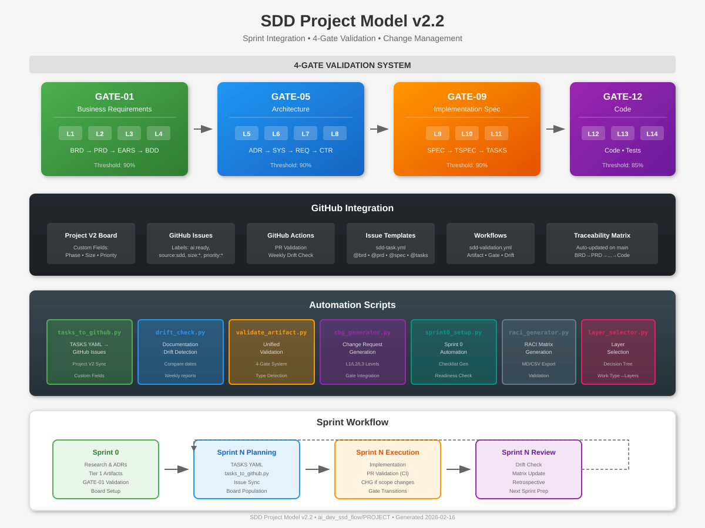

# SDD Project Model v2.2

**Sprint Integration, CI/CD Validation, and Change Management for SDD**

[](#4-gate-system)
[](#cicd-integration)

---

## Overview

The SDD Project Model v2.2 extends the core Specification-Driven Development framework with:

- **Sprint Integration**: Automated TASKS→GitHub Issue synchronization with Project V2 boards
- **CI/CD Validation**: Artifact validators integrated in GitHub Actions workflows
- **4-Gate System**: Quality gates for layer transitions (GATE-01, GATE-05, GATE-09, GATE-12)
- **Change Management**: CHG-based feedback loop during sprints
- **Sprint 0 Support**: Checklist automation and readiness validation

## Architecture



<details>
<summary>Text Diagram (fallback)</summary>

```
┌─────────────────────────────────────────────────────────────────────────────┐
│                        SDD Project Model v2.2                               │
├─────────────────────────────────────────────────────────────────────────────┤
│                                                                             │
│  ┌─────────────┐     ┌─────────────┐     ┌─────────────┐     ┌───────────┐ │
│  │   GATE-01   │────▶│   GATE-05   │────▶│   GATE-09   │────▶│  GATE-12  │ │
│  │  Business   │     │Architecture │     │   Impl.     │     │   Code    │ │
│  │  L1-L4      │     │   L5-L8     │     │   L9-L11    │     │  L12-L14  │ │
│  └─────────────┘     └─────────────┘     └─────────────┘     └───────────┘ │
│        │                   │                   │                   │        │
│        ▼                   ▼                   ▼                   ▼        │
│  ┌─────────────────────────────────────────────────────────────────────┐   │
│  │                    GitHub Project V2 Board                          │   │
│  │  ┌────────┐  ┌────────┐  ┌────────┐  ┌────────┐  ┌────────┐        │   │
│  │  │Backlog │  │Sprint 0│  │Sprint N│  │Review  │  │  Done  │        │   │
│  │  └────────┘  └────────┘  └────────┘  └────────┘  └────────┘        │   │
│  └─────────────────────────────────────────────────────────────────────┘   │
│                                                                             │
│  ┌─────────────────────────────────────────────────────────────────────┐   │
│  │                         Automation Scripts                           │   │
│  │  tasks_to_github │ drift_check │ validate_artifact │ chg_generator  │   │
│  │  sprint0_setup   │ raci_generator │ layer_selector                  │   │
│  └─────────────────────────────────────────────────────────────────────┘   │
│                                                                             │
└─────────────────────────────────────────────────────────────────────────────┘
```
</details>

## Quick Start

### Prerequisites

```bash
# Python 3.11+
python3 --version

# Install dependencies
pip install -r ../scripts/requirements-project.txt

# Set GitHub token
export GITHUB_TOKEN="ghp_your_token"
```

### Basic Usage

```bash
# 1. Check Sprint 0 readiness
python ../scripts/sprint0_setup.py --docs-root docs/ --check-readiness

# 2. Sync TASKS to GitHub Issues
python ../scripts/tasks_to_github.py \
  --tasks-file docs/11_TASKS/TASKS-01.yaml \
  --repo owner/repo \
  --project-number 31 \
  --dry-run

# 3. Validate artifacts
python ../scripts/validate_artifact.py --path docs/BRD/BRD-01.md --strict

# 4. Check documentation drift
python ../scripts/drift_check.py --sdd-root docs/ --repo owner/repo

# 5. Determine required layers
python ../scripts/layer_selector.py --interactive
```

## Directory Structure

```
PROJECT/
├── assets/
│   └── sdd-project-model-v2.svg  # Architecture diagram
├── config/
│   └── project_model.yaml        # Central configuration
├── templates/
│   ├── CHG-PROJECT-TEMPLATE.md   # Change request template
│   ├── SPRINT0_CHECKLIST.md      # Sprint 0 checklist
│   └── RACI_MATRIX.md            # RACI matrix template
├── fixtures/
│   └── budget_alert/             # Sample worked example
│       ├── BRD-01.md
│       ├── PRD-01.md
│       └── TASKS-05.yaml
├── .github/
│   ├── ISSUE_TEMPLATE/
│   │   └── sdd-task.yml          # GitHub issue template
│   └── workflows/
│       └── sdd-validation.yml    # CI validation workflow
├── tests/                        # Unit tests (9 files)
├── PROJECT_MODEL.md              # Methodology document
├── IMPLEMENTATION_PLAN.md        # Technical specifications
├── SETUP_GUIDE.md                # Setup instructions
└── README.md                     # This file
```

## 4-Gate System

Quality gates ensure artifacts meet standards before layer transitions:

| Gate | Layers | Artifacts | Threshold |
|------|--------|-----------|-----------|
| **GATE-01** | L1-L4 | BRD, PRD, EARS, BDD | 90% |
| **GATE-05** | L5-L8 | ADR, SYS, REQ, CTR | 90% |
| **GATE-09** | L9-L11 | SPEC, TSPEC, TASKS | 90% |
| **GATE-12** | L12-L14 | Code, Tests, Release | 85% |

### Gate Validation

```bash
# Validate artifact against specific gate
python ../scripts/validate_artifact.py \
  --path docs/BRD/BRD-01.md \
  --gate GATE-01

# Detect affected gates for changes
python ../scripts/validate_artifact.py \
  --path docs/ \
  --detect-gates
```

## Scripts Reference

| Script | Purpose | Key Options |
|--------|---------|-------------|
| `tasks_to_github.py` | TASKS→GitHub Issues | `--tasks-file`, `--repo`, `--project-number` |
| `drift_check.py` | Documentation drift | `--sdd-root`, `--max-age-days`, `--report` |
| `validate_artifact.py` | Artifact validation | `--path`, `--gate`, `--strict` |
| `chg_generator.py` | CHG generation | `--description`, `--affected-layers` |
| `sprint0_setup.py` | Sprint 0 setup | `--check-readiness`, `--create-issues` |
| `raci_generator.py` | RACI matrix | `--output`, `--format`, `--validate` |
| `layer_selector.py` | Layer selection | `--interactive`, `--work-type` |

## CI/CD Integration

### GitHub Actions Workflow

The `sdd-validation.yml` workflow provides:

1. **Artifact Validation**: Validates changed docs on PR
2. **Gate Validation**: Checks gate requirements
3. **Traceability Update**: Updates matrix on main push
4. **Drift Check**: Weekly scheduled drift detection

### Setup

```bash
# Copy workflow to your repository
mkdir -p .github/workflows
cp .github/workflows/sdd-validation.yml ../.github/workflows/

# Copy issue template
mkdir -p .github/ISSUE_TEMPLATE
cp .github/ISSUE_TEMPLATE/sdd-task.yml ../.github/ISSUE_TEMPLATE/
```

## Change Management

Changes are classified by level:

| Level | Description | Gates Required | Approval |
|-------|-------------|----------------|----------|
| **L1** | Patch/Bug fix | None | Developer |
| **L2** | Minor/Scope change | Affected gates | Product Owner |
| **L3** | Major/Architecture | All gates | Architect |

### Generate CHG Document

```bash
python ../scripts/chg_generator.py \
  --description "Add localization support" \
  --affected-layers 2,9,11 \
  --output docs/CHG/
```

## Sprint 0 Workflow

Sprint 0 ensures Tier 1 artifacts are complete before Sprint 1:

1. **Research**: Identify and resolve technical questions → ADRs
2. **Tier 1**: BRD → PRD → EARS → BDD generation
3. **Setup**: GitHub board configuration, CI/CD
4. **Validation**: GATE-01 validation, team sign-off

```bash
# Full Sprint 0 setup
python ../scripts/sprint0_setup.py \
  --repo owner/repo \
  --create-issues \
  --check-readiness
```

## Configuration

Edit `config/project_model.yaml`:

```yaml
project:
  name: "Your Project"
  repo: "owner/repo"
  board_number: 31

validation:
  strict_mode: true
  coverage_threshold: 85

drift_check:
  max_age_days: 14
  schedule: "0 17 * * 5"  # Friday 5pm

quality_gates:
  GATE-01:
    layers: [1, 2, 3, 4]
    threshold: 90
```

## Testing

```bash
# Run all tests
cd PROJECT/tests
pytest -v

# Run with coverage
pytest --cov=../scripts --cov-report=html
```

## Related Documentation

- [PROJECT_MODEL.md](PROJECT_MODEL.md) - Complete methodology
- [IMPLEMENTATION_PLAN.md](IMPLEMENTATION_PLAN.md) - Technical specifications
- [SETUP_GUIDE.md](SETUP_GUIDE.md) - Detailed setup instructions
- [../scripts/README.md](../scripts/README.md) - Script documentation

## Version History

| Version | Date | Changes |
|---------|------|---------|
| 2.2 | 2026-02-16 | Sprint integration, 4-Gate system, CHG automation |
| 2.1 | 2026-02-15 | Initial PROJECT model |

---

**License**: Internal use only
