# Specification-Driven Development (SDD) Framework

**Version**: 3.0 (v0.12.0 — All 11 Layers Unified)

The SDD framework transforms business requirements into production code through a structured, traceable workflow. All 11 artifact layers use unified YAML templates with embedded authoring guidance.

---

## 15-Layer Architecture

```mermaid
flowchart LR
    BRD[BRD<br/>Layer 1] --> PRD[PRD<br/>Layer 2]
    PRD --> EARS[EARS<br/>Layer 3]
    EARS --> BDD[BDD<br/>Layer 4]
    BDD --> ADR[ADR<br/>Layer 5]
    ADR --> SYS[SYS<br/>Layer 6]
    SYS --> REQ[REQ<br/>Layer 7]
    REQ --> CTR[CTR<br/>Layer 8]
    CTR --> SPEC[SPEC<br/>Layer 9]
    SPEC --> TSPEC[TSPEC<br/>Layer 10]
    TSPEC --> TASKS[TASKS<br/>Layer 11]
    TASKS --> Code[Code<br/>Layer 12]
    Code --> Tests[Tests<br/>Layer 13]
    Tests --> Val[Validation<br/>Layer 14]
```



| Layer | Artifact | C4 Level | Template | Purpose |
|-------|----------|----------|----------|---------|
| 1 | BRD | Context (L1) | `BRD-TEMPLATE.yaml` | Business objectives and market context |
| 2 | PRD | Container (L2) | `PRD-TEMPLATE.yaml` | Product features and user stories |
| 3 | EARS | Transition | `EARS-TEMPLATE.yaml` | Formal WHEN-THE-SHALL requirements |
| 4 | BDD | Transition | `BDD-TEMPLATE.yaml` | Behavior scenarios (Gherkin in `_example` fields) |
| 5 | ADR | Bridge | `ADR-TEMPLATE.yaml` | Architecture decisions |
| 6 | SYS | Component (L3) | `SYS-TEMPLATE.yaml` | System structure and quality attributes |
| 7 | REQ | Decomposition | `REQ-TEMPLATE.yaml` | Atomic testable requirements |
| 8 | CTR | Decomposition | `CTR-TEMPLATE.yaml` | API contracts (optional, dual .md+.yaml) |
| 9 | SPEC | Code (L4) | `SPEC-TEMPLATE.yaml` | Implementation-ready specifications |
| 10 | TSPEC | Validation | `TSPEC-TEMPLATE.yaml` | Test specifications (6 subtypes) |
| 11 | TASKS | Execution | `TASKS-TEMPLATE.yaml` | AI code generation guide |
| 12-14 | Code/Tests/Validation | — | — | Source code, test execution, deployment |

**CHG** (Change Management) is a governance overlay, not a layer. See `CHG/CHG-00_index.md`.

---

## Unified YAML Templates

All 11 templates follow a consistent structure:

```yaml
metadata:
  doc_type: TYPE
  doc_id: "TYPE-NN"
  version: "1.0"
  status: draft
  c4_level:
    value: "context|container|component|code"  # or _guidance for non-C4 layers
  validation:
    tool: sdd_validate
    server: mcp_sdd

sections:
  - id: "TYPE.NN.TT.xxxx"
    _guidance: |
      Authoring instructions (ignored by tools)
    _antipatterns:
      - "Common mistakes to avoid"
    content: "..."

glossary:
  terms:
    - term: "..."
      definition: "..."
```

**Key conventions:**
- `_guidance` — authoring instructions, ignored by MCP tools
- `_antipatterns` — common mistakes to avoid
- `_note` — contextual clarification
- `_example` — sample values for reference

---

## Directory Structure

```
ai_dev_ssd_flow/
├── 01_BRD/          BRD-TEMPLATE.yaml, BRD-00_index.md, README.md
├── 02_PRD/          PRD-TEMPLATE.yaml, ...
├── 03_EARS/         EARS-TEMPLATE.yaml, ...
├── 04_BDD/          BDD-TEMPLATE.yaml, ...
├── 05_ADR/          ADR-TEMPLATE.yaml, ...
├── 06_SYS/          SYS-TEMPLATE.yaml, ...
├── 07_REQ/          REQ-TEMPLATE.yaml, ...
├── 08_CTR/          CTR-TEMPLATE.yaml, ...
├── 09_SPEC/         SPEC-TEMPLATE.yaml, + subtypes (CSPEC, DSPEC, UXSPEC, RISKSPEC, PROCSPEC)
├── 10_TSPEC/        TSPEC-TEMPLATE.yaml, + subtypes (UTEST, ITEST, STEST, FTEST, PTEST, SECTEST)
├── 11_TASKS/        TASKS-TEMPLATE.yaml, IMPLEMENTATION_PLAN_TEMPLATE.md/.yaml
├── CHG/             CHG-TEMPLATE.yaml, gates/, workflows/, sources/
├── PROJECT/         SDD Project Model (sprint integration, CI/CD, 4-gate system)
└── [framework docs] Standards, guides, and references (see below)
```

Each layer directory contains:
- `{TYPE}-TEMPLATE.yaml` — unified template (single source of truth)
- `{TYPE}-00_index.md` — document registry
- `README.md` — layer overview
- `{TYPE}_v1_archive/` — deprecated files from pre-unification

---

## Document Size Policy

All SDD documents are **monolithic** (single self-contained file) up to **50,000 tokens**. If a document exceeds 50,000 tokens, create a new document of the same type with its own scope (e.g., BRD-02 instead of splitting BRD-01). Do NOT split into sectioned files.

---

## Document ID Standards

### Two ID Formats

| Purpose | Format | Example | Use |
|---------|--------|---------|-----|
| **Document reference** | `TYPE-NN` (dash) | `ADR-01`, `BRD-07` | Whole document |
| **Element reference** | `TYPE.NN.TT.SS` (dots) | `BRD.07.01.01` | Specific element within document |

### File Naming

```
{TYPE}-{NN}_{descriptive_slug}.yaml
```

Examples: `BRD-01_platform_architecture.yaml`, `REQ-03_user_auth.yaml`, `CTR-05_api.md` + `CTR-05_api.yaml`

### ID Numbering

- Start with 2 digits (01), expand as needed (99 → 100)
- Sequential, no gaps in document numbers
- Element IDs may have gaps (deprecation, logical grouping)
- `{TYPE}-00_*` reserved for indexes and utility files

Full reference: [ID_NAMING_STANDARDS.md](./ID_NAMING_STANDARDS.md)

---

## Cumulative Tagging

Each layer requires tags from ALL upstream layers:

| Layer | Tags Required | Count |
|-------|---------------|-------|
| BRD (1) | (none — top level) | 0 |
| PRD (2) | @brd | 1 |
| EARS (3) | @brd, @prd | 2 |
| BDD (4) | @brd, @prd, @ears | 3 |
| ADR (5) | @brd → @bdd | 4 |
| SYS (6) | @brd → @adr | 5 |
| REQ (7) | @brd → @sys | 6 |
| CTR (8) | @brd → @req | 7 (optional layer) |
| SPEC (9) | @brd → @req + optional @ctr | 7-8 |
| TSPEC (10) | @brd → @spec + optional @ctr | 8-9 |
| TASKS (11) | @brd → @tspec + optional @ctr | 9-10 |

Full reference: [CUMULATIVE_TAG_REFERENCE.md](./CUMULATIVE_TAG_REFERENCE.md)

---

## C4 + DFD Diagram Model

| Layer | C4 Level | DFD Level | Diagram Tags |
|-------|----------|-----------|--------------|
| BRD (L1) | Context | L1 | `c4-l1`, `dfd-l1` |
| PRD (L2) | Container | L2 | `c4-l2`, `dfd-l2` |
| ADR (L5) | — (bridge) | — | Decision sequence only |
| SYS (L6) | Component | L3 | `c4-l3`, `dfd-l3` |
| SPEC (L9+) | Code | L4 | `c4-l4` |

All diagrams use Mermaid syntax. See [DIAGRAM_STANDARDS.md](./DIAGRAM_STANDARDS.md).

---

## Validation

Validation is centralized via mcp_sdd `sdd_validate` tool. Per-layer shell scripts are deprecated.

All 11 unified YAML templates are available in `mcp_sdd/templates/`:

```
ADR-TEMPLATE.yaml    CTR-TEMPLATE.yaml    REQ-TEMPLATE.yaml    TASKS-TEMPLATE.yaml
BDD-TEMPLATE.yaml    EARS-TEMPLATE.yaml   SPEC-TEMPLATE.yaml   TSPEC-TEMPLATE.yaml
BRD-TEMPLATE.yaml    PRD-TEMPLATE.yaml    SYS-TEMPLATE.yaml
```

---

## Lifecycle: MVP → PROD → NEW MVP

| Phase | Duration | Focus |
|-------|----------|-------|
| **MVP** | 1-2 weeks | Build 5-15 core features (BRD → TASKS → Code) |
| **PROD** | 30-90 days | Operate, measure, collect feedback |
| **NEW MVP** | 1-2 weeks | Create NEW BRD for next feature set |

Each BRD represents one iteration cycle. New features get new BRDs (BRD-01, BRD-02, BRD-03). Cross-cycle traceability via `@depends: BRD-01`.

Full guide: [MVP_WORKFLOW_GUIDE.md](./MVP_WORKFLOW_GUIDE.md)

---

## Using This Repo

This repository is a **framework template**. To use in a project:

1. Copy unified templates from `mcp_sdd/templates/` or layer directories
2. Create `docs/{NN}_{TYPE}/` directories for your project artifacts
3. Use mcp_sdd `sdd_create` to scaffold new documents
4. Validate with mcp_sdd `sdd_validate`

Path note: Examples in guides may show a `docs/` prefix. In this repository, layer directories live at the `ai_dev_ssd_flow/` root (e.g., `01_BRD/`, `02_PRD/`).

---

## Framework Documents

### Core Standards

| Document | Purpose |
|----------|---------|
| [ID_NAMING_STANDARDS.md](./ID_NAMING_STANDARDS.md) | Document and element ID formats |
| [TRACEABILITY.md](./TRACEABILITY.md) | Cross-layer traceability rules |
| [CUMULATIVE_TAG_REFERENCE.md](./CUMULATIVE_TAG_REFERENCE.md) | Tag counts by layer |
| [DIAGRAM_STANDARDS.md](./DIAGRAM_STANDARDS.md) | Mermaid-only diagram rules, C4+DFD model |
| [LAYER_REGISTRY.yaml](./LAYER_REGISTRY.yaml) | Authoritative layer definitions |
| [LAYER_EVOLUTION.md](./LAYER_EVOLUTION.md) | Procedures for adding/modifying layers |
| [THRESHOLD_NAMING_RULES.md](./THRESHOLD_NAMING_RULES.md) | Threshold key naming conventions |

### Workflow Guides

| Document | Purpose |
|----------|---------|
| [MVP_WORKFLOW_GUIDE.md](./MVP_WORKFLOW_GUIDE.md) | MVP → PROD → NEW MVP lifecycle |
| [SPEC_DRIVEN_DEVELOPMENT_GUIDE.md](./SPEC_DRIVEN_DEVELOPMENT_GUIDE.md) | Complete SDD methodology |
| [CONTRACT_DECISION_QUESTIONNAIRE.md](./CONTRACT_DECISION_QUESTIONNAIRE.md) | CTR layer decision guide |
| [PLATFORM_VS_FEATURE_BRD.md](./PLATFORM_VS_FEATURE_BRD.md) | Platform vs feature BRD patterns |
| [TESTING_STRATEGY_TDD.md](./TESTING_STRATEGY_TDD.md) | TDD integration with SDD |

### Metadata and Validation

| Document | Purpose |
|----------|---------|
| [METADATA_TAGGING_GUIDE.md](./METADATA_TAGGING_GUIDE.md) | YAML frontmatter standards |
| [METADATA_QUICK_REFERENCE.md](./METADATA_QUICK_REFERENCE.md) | Metadata quick reference card |
| [METADATA_CORE_MATRIX.md](./METADATA_CORE_MATRIX.md) | Core metadata field matrix |
| [VALIDATION_DECISION_FRAMEWORK.md](./VALIDATION_DECISION_FRAMEWORK.md) | Fix doc vs fix validator decisions |
| [VALIDATION_STANDARDS.md](./VALIDATION_STANDARDS.md) | Error codes and exit conventions |

### AI Assistant Guides

| Document | Purpose |
|----------|---------|
| [AI_ASSISTANT_RULES.md](./AI_ASSISTANT_RULES.md) | Rules for AI assistants |
| [AI_ASSISTANT_PLAYBOOK.md](./AI_ASSISTANT_PLAYBOOK.md) | Playbook index |
| [AI_TOOL_OPTIMIZATION_GUIDE.md](./AI_TOOL_OPTIMIZATION_GUIDE.md) | Tool-specific optimization |
| [DOC_GOVERNANCE_CORE.md](./DOC_GOVERNANCE_CORE.md) | Documentation-as-code governance |

### Traceability

| Document | Purpose |
|----------|---------|
| [TRACEABILITY_MATRIX_COMPLETE-TEMPLATE.md](./TRACEABILITY_MATRIX_COMPLETE-TEMPLATE.md) | Complete traceability matrix template |
| [TRACEABILITY_SETUP.md](./TRACEABILITY_SETUP.md) | Drift detection and CI/CD setup |
| [COMPLETE_TAGGING_EXAMPLE.md](./COMPLETE_TAGGING_EXAMPLE.md) | End-to-end tagging example |

---

## Version History

| Version | Release | Changes |
|---------|---------|---------|
| 3.0 | v0.12.0 | All 11 layers unified to YAML templates. README rewritten. |
| 2.5 | v0.6.0 | Autopilot v6.0, TSPEC layer, CHG modes |
| 2.0 | v0.2.0 | BRD unification, mcp_sdd naming migration |
| 1.0 | v0.1.0 | MCP transport layer, 19 tools |

See [changelog/](../changelog/) and [roadmap/ROADMAP.md](../roadmap/ROADMAP.md) for details.
