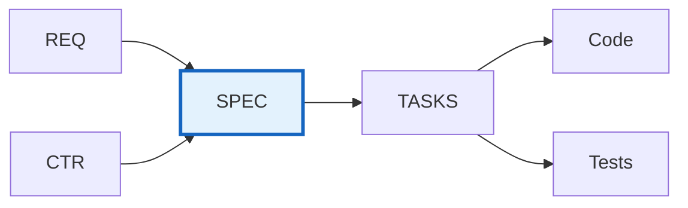
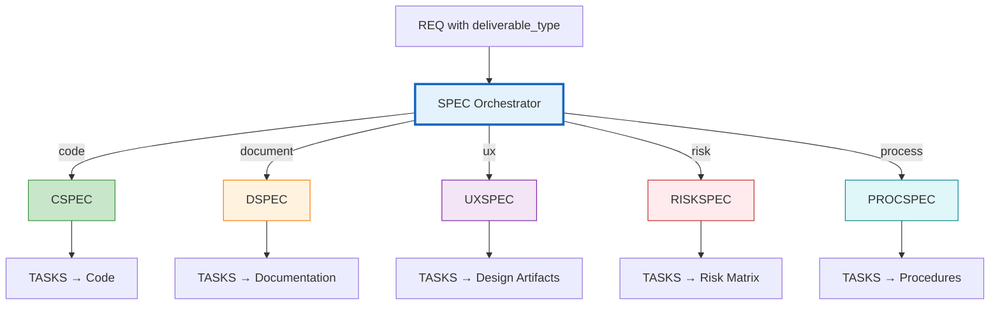

# SPEC-000: Technical Specifications Master Index

Note: Some examples in this document show a portable `docs/` root. In this repository, artifact folders live at the ucx_flow_v3 root without the `docs/` prefix; see README → “Using This Repo” for path mapping.

## Purpose

This document serves as the master index for all Technical Specification (SPEC) documents in the project. Use this index to:

- **Discover** existing technical specifications
- **Track** implementation specification status
- **Coordinate** development across components
- **Reference** implementation-ready technical details

## Position in Document Workflow

> **Note on Diagram Labels**: The above flowchart shows the sequential workflow. For formal layer numbers used in cumulative tagging, always reference the 15-layer architecture (Layers 0-14) defined in README.md. Diagram groupings are for visual clarity only.

**Layer**: 9 (Implementation Specification Layer)
**Upstream**: BRD→REQ, CTR (optional)
**Downstream**: TASKS, Code, Tests

---

## SPEC Subtypes (Deliverable Type Routing)

SPEC serves as an **orchestrator** that routes to subtypes based on `deliverable_type` (propagated from BRD through REQ):

| Subtype | Code | deliverable_type | Output | Template | CTR Required |
|---------|------|------------------|--------|----------|--------------|
| **[CSPEC](./CSPEC/)** | 50 | `code` (default) | Source code | `CSPEC-TEMPLATE.yaml` | Yes |
| **[DSPEC](./DSPEC/)** | 51 | `document` | Documentation artifacts | `DSPEC-TEMPLATE.yaml` | Optional |
| **[UXSPEC](./UXSPEC/)** | 52 | `ux` | Wireframes, mockups | `UXSPEC-TEMPLATE.yaml` | Optional |
| **[RISKSPEC](./RISKSPEC/)** | 53 | `risk` | Risk matrices | `RISKSPEC-TEMPLATE.yaml` | No |
| **[PROCSPEC](./PROCSPEC/)** | 54 | `process` | SOPs, runbooks | `PROCSPEC-TEMPLATE.yaml` | Optional |

### Routing Logic

### Default Behavior

- If `deliverable_type` is not specified, defaults to `code` → CSPEC
- Existing SPEC documents without `deliverable_type` are treated as CSPEC (backward compatible)

## Technical Specifications Index

| SPEC ID | Title | Specification Type | Status | Related REQ | Related CTR | Priority | Last Updated |
|---------|-------|--------------------|--------|-------------|-------------|----------|--------------|
| [SPEC-TEMPLATE](./SPEC-TEMPLATE.yaml) | Template | Reference | Reference | - | - | - | 2026-03-29 |
| [SPEC-01_api_client_example](./SPEC-01_api_client_example.yaml) | API Client (flat example) | Example | Draft | REQ-.. | CTR-.. | Medium | 2025-12-28T00:00:00 |
| [SPEC-02_nested_example](./examples/SPEC-02_nested_example/SPEC-02_nested_example.yaml) | Nested Example (YAML+MD) | Example | Draft | REQ-.. | CTR-.. | Low | 2025-12-28T00:00:00 |

## Planned

- Use this section to list SPEC documents planned but not yet created. Move rows to the main index table when created.

| ID | Component | Source (07_REQ/CTR) | Priority | Notes |
|----|-----------|-------------------|----------|-------|
| SPEC-XX | … | 07_REQ/CTR-YY | High/Med/Low | … |

## Status Definitions

| Status | Meaning | Description |
|--------|---------|-------------|
| **Draft** | In development | SPEC being written, technical design in progress |
| **Review** | Under review | Technical and architecture review in progress |
| **Approved** | Finalized | Specification approved, ready for implementation |
| **In Progress** | Active development | Code generation or development in progress |
| **Implemented** | Code complete | Implementation complete, testing in progress |
| **Verified** | Tested | Implementation tested and verified |
| **Deployed** | In production | Deployed to production environment |

## Specification Types

| Type | Format | Description | Examples |
|------|--------|-------------|----------|
| **Service** | YAML | Microservice or API specifications | REST APIs, gRPC services |
| **Agent** | YAML | AI agent specifications | LLM agents, autonomous agents |
| **Infrastructure** | YAML | Infrastructure as Code specs | Cloud resources, Terraform |
| **ML Model** | YAML | Machine learning model specs | Training, inference, deployment |
| **Database** | YAML | Data schema and migration specs | Tables, indexes, migrations |
| **Integration** | YAML | External integration specs | Third-party APIs, webhooks |

## Adding New Technical Specifications

When creating a new SPEC:

1. **Copy Template**:
   Generate via MCP: `sdd_create` with `doc_type=spec`, `layer=09_SPEC`

2. **Assign SPEC ID**: Use next sequential number (SPEC-01, SPEC-02, 100, 1000 ...)

3. **Update This Index**: Add new row to table above

4. **Create Cross-References**: Link to upstream 07_REQ/CTR and plan downstream TASKS

## Allocation Rules

- **Numbering**: Allocate sequentially starting at `01` (variable-length DOC_NUM)
- **One Component Per File**: Each `SPEC-NN` covers a single component or service
- **Format**: YAML format for machine readability (monolithic per component)
- **Organization**: Flat (default) or nested (exception for specs with supporting files)
- **Slugs**: Short, descriptive, lower_snake_case
- **Index Updates**: Add entry for every new SPEC

## Index by Specification Type

### Service Specifications
- None

### Agent Specifications
- None

### Infrastructure Specifications
- None

### ML Model Specifications
- None

### Database Specifications
- None

### Integration Specifications
- None

## Index by Status

### Draft
- None

### Review
- None

### Approved
- None

### In Progress
- None

### Implemented
- None

### Verified
- None

### Deployed
- None

## Index by Domain

| Domain | SPEC Documents | Count |
|--------|----------------|-------|
| Services | - | 0 |
| Agents | - | 0 |
| Infrastructure | - | 0 |
| ML Models | - | 0 |
| Database | - | 0 |
| Integration | - | 0 |

## Implementation Status

| SPEC ID | Requirements Satisfied | Code Files | Test Coverage | Deployment Status |
|---------|------------------------|------------|---------------|-------------------|
| - | 0% | 0 | 0% | - |

## Metrics

| Metric | Value | Description |
|--------|-------|-------------|
| Total SPECs | 0 | Total technical specifications |
| Approved SPECs | 0 | Specifications ready for implementation |
| In Progress | 0 | Specifications being implemented |
| Implemented | 0 | Specifications with complete code |
| Deployed | 0 | Specifications deployed to production |
| Test Coverage | 0% | Average test coverage across SPECs |

## Related Documents

- **Template**: [SPEC-TEMPLATE.yaml](./SPEC-TEMPLATE.yaml) - Unified template (single source of truth)
- **README**: [README.md](./README.md) - Learn about SPEC purpose, format, and structure
- **Traceability Matrix**: [SPEC-00_TRACEABILITY_MATRIX-TEMPLATE.md](./SPEC-00_TRACEABILITY_MATRIX-TEMPLATE.md)
- **Example**: [SPEC-01_api_client_example.yaml](./SPEC-01_api_client_example.yaml) - Reference specification

## Maintenance Guidelines

### Updating This Index

- Update whenever new SPEC is created
- Track status changes through implementation lifecycle
- Maintain domain classifications
- Monitor implementation and deployment progress

### Quality Checks

Before marking SPEC as "Approved":
- [PASS] All required sections complete (ID, Summary, Interfaces, Traceability)
- [PASS] Technical details implementation-ready
- [PASS] API/interface definitions complete and unambiguous
- [PASS] Quality attributes specified (performance, caching, security)
- [PASS] Cross-references to upstream 07_REQ/CTR complete
- [PASS] Test strategy defined
- [PASS] Deployment configuration specified
- [PASS] YAML format valid and parseable

---

**Index Version**: 2.0
**Last Updated**: 2025-11-13T00:00:00
**Maintainer**: [Project Team]
