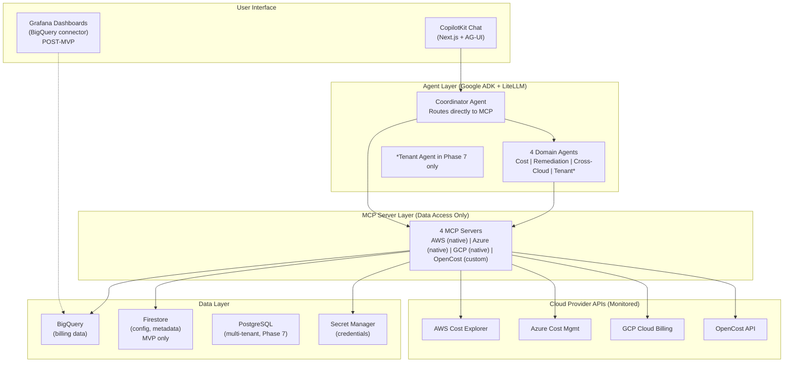

# Repository Strategy & Architecture

**Project**: {PROJECT_NAME} | **Prefix**: `{PROJECT_PREFIX}`

This document defines the **monorepo strategy** and component architecture for the {PROJECT_NAME} project.

> [!TIP]
> For comprehensive details about the repository structure and usage, see **[HOME_REPO.md](./HOME_REPO.md)**.

---

## Strategy: Monorepo with Components Directory

All project code, documentation, and governance live in a single repository. Component source code is organized under `components/`.

> **Reference**: See [REPO_STRUCTURE_DECISION_MATRIX.md](./REPO_STRUCTURE_DECISION_MATRIX.md) for the rationale behind this decision.

### Home Repository

The **home repo** is [`{REPO_NAME}`](https://{GITHUB_HOST}/{GITHUB_ORG}/{REPO_NAME}) — the single source of truth for the entire project.

| What lives here |
|:----------------|
| Governance docs (`governance/`) |
| Architecture docs, ADRs (`docs/`) |
| Issue templates (`.github/ISSUE_TEMPLATE/`) |
| CI/CD workflows (`.github/workflows/`) |
| Component source code (`components/`) |
| Root `README.md`, `CONTRIBUTING.md` |

> [!IMPORTANT]
> All issues, milestones, and labels are tracked in this repo. The [V2 Project Board (#{PROJECT_BOARD_NUMBER})](https://{GITHUB_HOST}/orgs/{GITHUB_ORG}/projects/{PROJECT_BOARD_NUMBER}) pulls issues from this repo. See [GITHUB_PROJECT_SETUP_AI_FIRST.md](./GITHUB_PROJECT_SETUP_AI_FIRST.md) for AI-optimized workflow setup.

### Why Monorepo?

| Benefit | Description |
|:--------|:------------|
| **Single git context** | AI agents work without dual-repo confusion |
| **Atomic changes** | Cross-component changes in a single PR |
| **Unified CI/CD** | One pipeline for all components |
| **Simple workflow** | Single commit, single push, single PR |
| **Refactoring** | IDE-assisted, atomic refactors across components |
| **No version drift** | Direct imports, no submodule pointer management |

### Repository Map

```
{REPO_NAME}/               ← Monorepo (this repo)
├── governance/                         ← Project governance
├── docs/                               ← Documentation
│   ├── adr/                            ← Architecture Decision Records (9)
│   ├── core/                           ← Core specifications (8 specs)
│   └── architecture/                   ← System architecture diagrams
├── components/                         ← All component source code
│   ├── {SERVICE_NAME}/                 ← GCP budget protection (Phase 1)
│   ├── mcp-servers/                    ← 4 MCP servers (Phase 3)
│   ├── agents/                         ← 5 AI agents (Phase 4)
│   ├── frontend/                       ← Next.js + CopilotKit (Phase 5)
│   └── infrastructure/                 ← Terraform modules (Phase 2)
├── scripts/                            ← Utility scripts
├── .github/
│   ├── ISSUE_TEMPLATE/                 ← Issue templates
│   └── workflows/                      ← CI/CD workflows
└── README.md
```

### Component Directories

| Component | Phase | Description | Tech Stack |
|:----------|:-----:|:------------|:-----------|
| `components/{SERVICE_NAME}` | 1 | GCP budget alerts + auto-remediation | Python, Cloud Functions, Pub/Sub, Firestore |
| `components/mcp-servers` | 3 | 4 MCP servers for data access | Python, FastMCP, Cloud Run |
| `components/agents` | 4 | 5 AI agents (Coordinator + 4 Domain) | Python, Google ADK, LiteLLM |
| `components/frontend` | 5 | CopilotKit Chat UI | Next.js, CopilotKit, AG-UI, Tailwind |
| `components/infrastructure` | 2 | Terraform modules for all cloud resources | Terraform, HCL |

### Working with Components

```bash
# Navigate to a component
cd components/{SERVICE_NAME}

# Install dependencies
pip install -e ".[dev]"

# Run tests
pytest

# All changes in a single PR
git checkout -b feature/cross-component-change
# Edit components/{SERVICE_NAME}/...
# Edit components/mcp-servers/...
git add -A
git commit -m "feat: add shared configuration"
git push
```

---

## Architecture Overview



---

## Key Technology Decisions

| Decision | Choice | Rationale | ADR |
|:---------|:-------|:----------|:----|
| Integration Pattern | MCP Servers (not REST) | AI-native tool calling | [ADR-001](../docs/adr/001-use-mcp-servers.md) |
| Home Cloud | GCP first | Best free tier, scale-to-zero | [ADR-002](../docs/adr/002-gcp-only-first.md) |
| Analytics DB | BigQuery (not TimescaleDB) | Native billing export, 1TB free | [ADR-003](../docs/adr/003-use-bigquery-not-timescaledb.md) |
| Compute | Cloud Run (not Kubernetes) | Serverless, no cluster ops | [ADR-004](../docs/adr/004-cloud-run-not-kubernetes.md) |
| LLM | LiteLLM (vendor-neutral) | Switch models without code changes | [ADR-005](../docs/adr/005-use-litellm-for-llms.md) |
| Task Queues | Cloud Tasks (not Celery) | Managed, no Redis dependency | [ADR-006](../docs/adr/006-cloud-native-task-queues-not-celery.md) |
| Dashboards | CopilotKit (MVP), Grafana (post-MVP) | AI chat interface + traditional viz | [ADR-007](../docs/adr/007-grafana-plus-agui-hybrid.md) |
| Observability | OTEL Gen-AI Conventions | Standardized AI tracing | [ADR-008](../docs/adr/008-otel-gen-ai-conventions.md) |

---

## Versioning Convention

The monorepo follows **Semantic Versioning (SemVer)** for platform releases:

| Change Type | Version Bump | Example |
|:------------|:-------------|:--------|
| Bug fix, docs | PATCH | `v1.0.0` → `v1.0.1` |
| New feature (backward compatible) | MINOR | `v1.0.1` → `v1.1.0` |
| Breaking change | MAJOR | `v1.1.0` → `v2.0.0` |

Component-specific releases can be tagged with prefixes if needed (e.g., `{SERVICE_NAME}/v1.0.0`).

---

## Migration History

This project migrated from a polyrepo (Git submodules) structure to a monorepo on {DATE}.

**Rationale**: AI-agent-driven development with a small team requires single git context, single-PR workflows, and atomic cross-component commits. See [REPO_STRUCTURE_DECISION_MATRIX.md](./REPO_STRUCTURE_DECISION_MATRIX.md) for the full decision analysis.

**Migration plan**: [IPLAN-008_monorepo-migration.md](./plans/IPLAN-008_monorepo-migration.md)
