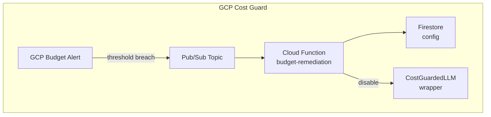

# GCP Cost Guard Specification

**Component**: `{SERVICE_NAME}`
**Phase**: 1
**Status**: Template

## Overview

GCP Cost Guard is a standalone cost protection system that monitors GCP spending and enforces budget limits through automated remediation.

## Architecture



## Components

| Component | Description | Tech Stack |
|-----------|-------------|------------|
| Budget Alert | GCP budget with Pub/Sub notification | GCP Console |
| Pub/Sub Topic | `cost-alerts` message queue | Cloud Pub/Sub |
| Cloud Function | `budget-remediation` handler | Python, Cloud Functions v2 |
| Firestore | Configuration and state storage | Firestore |
| CostGuardedLLM | LLM wrapper with spend limits | Python class |

## Configuration Schema

```yaml
# Firestore: {SERVICE_NAME}/config
budget_thresholds:
  - percent: 50
    action: "notify"
  - percent: 80
    action: "warn"
  - percent: 100
    action: "disable"

llm_limits:
  daily_spend_limit_usd: 10.00
  per_request_limit_usd: 0.50

notification_channels:
  - type: "email"
    target: "{ALERT_EMAIL}"
  - type: "teams"
    webhook: "{TEAMS_WEBHOOK}"
```

## API Contracts

### CostGuardedLLM

```python
class CostGuardedLLM:
    def __init__(self, config_path: str):
        """Initialize with Firestore config path."""

    def check_budget(self) -> bool:
        """Return True if within budget."""

    def invoke(self, prompt: str) -> str:
        """Invoke LLM if within budget, raise BudgetExceededError otherwise."""
```

## Exit Criteria

- Budget alerts fire within 1 hour of threshold breach
- LLM spend limits enforced per-request
- Idle resources detected weekly
- Total infrastructure cost < $15/month

## References

- [ADR-002: GCP-First Strategy](./adr/002-gcp-only-first.md)
- [Phase 1 Roadmap](../governance/ROADMAP.md#phase-1-gcp-cost-guard-standalone)
