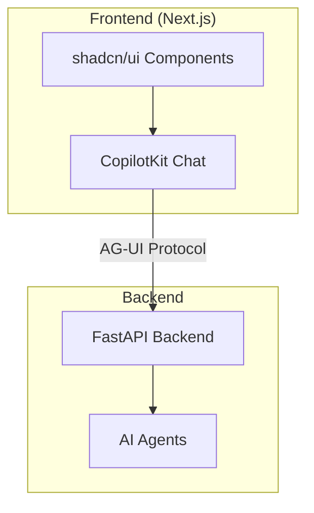

# UX Implementation Guide

**Layer**: UI/UX
**Phase**: 5
**Status**: Template

## Overview

This guide defines the CopilotKit-based chat interface for the MVP. Grafana dashboards are deferred to post-MVP.

## Architecture



## Technology Stack

| Component | Technology | Version |
|-----------|------------|--------|
| Framework | Next.js | 14.x |
| AI Chat | CopilotKit | Latest |
| Styling | Tailwind CSS | 3.x |
| Components | shadcn/ui | Latest |
| Protocol | AG-UI (SSE) | 1.0 |

## CopilotKit Integration

```typescript
// app/layout.tsx
import { CopilotKit } from "@copilotkit/react-core";

export default function RootLayout({ children }) {
  return (
    <CopilotKit runtimeUrl="/api/copilotkit">
      {children}
    </CopilotKit>
  );
}

// app/page.tsx
import { CopilotChat } from "@copilotkit/react-ui";

export default function Home() {
  return (
    <main className="flex h-screen">
      <CopilotChat
        labels={{
          title: "Cost Assistant",
          placeholder: "Ask about your cloud costs...",
        }}
      />
    </main>
  );
}
```

## AG-UI Protocol (SSE Streaming)

```typescript
// API route handler
export async function POST(req: Request) {
  const { message } = await req.json();

  const stream = new TransformStream();
  const writer = stream.writable.getWriter();

  // Stream agent responses
  for await (const chunk of agent.stream(message)) {
    await writer.write(
      encoder.encode(`data: ${JSON.stringify(chunk)}\n\n`)
    );
  }

  return new Response(stream.readable, {
    headers: {
      "Content-Type": "text/event-stream",
      "Cache-Control": "no-cache",
    },
  });
}
```

## Performance Targets

| Metric | Target |
|--------|--------|
| Lighthouse Score | >= 90 |
| First Contentful Paint | < 1.5s |
| Time to Interactive | < 3s |
| Streaming Response Start | < 500ms |

## Accessibility

- WCAG 2.1 AA compliance
- Keyboard navigation for all interactions
- Screen reader support for chat messages
- Color contrast ratios >= 4.5:1

## Deferred (Post-MVP)

- Grafana dashboards with BigQuery connector
- Historical trend charts
- Budget vs actual visualizations
- Anomaly detection panels

## References

- [ADR-007: CopilotKit + Grafana Hybrid](../adr/007-grafana-plus-agui-hybrid.md)
- [CopilotKit Documentation](https://docs.copilotkit.ai/)
