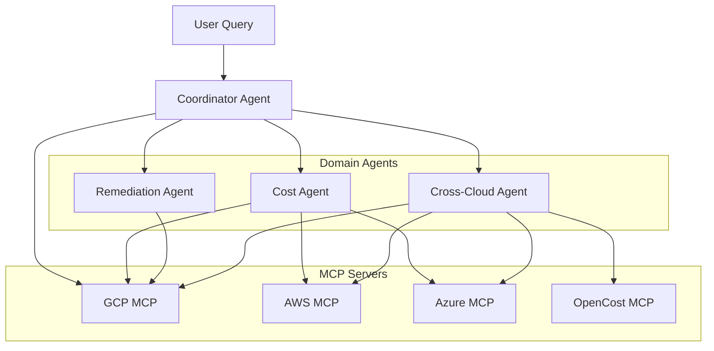

# Agent Routing Specification

**Layer**: AI Agents
**Phase**: 4
**Status**: Template

## Overview

This specification defines the 2-layer agent architecture: Coordinator Agent + Domain Agents. The Coordinator handles intent classification and routes to appropriate Domain Agents or directly to MCP servers.

## Agent Architecture



## Agent Inventory

| Agent | Responsibility | MCP Access |
|-------|----------------|------------|
| Coordinator | Intent classification, routing | All (direct) |
| Cost Agent | Analysis, forecasting, optimization | GCP, AWS, Azure |
| Remediation Agent | Action decisions, execution | GCP |
| Cross-Cloud Agent | Multi-cloud aggregation | All |

## Coordinator Agent

### Intent Classification

```yaml
intents:
  - name: cost_query
    examples:
      - "What did we spend last month?"
      - "Show me GCP costs"
    route_to: cost_agent

  - name: optimization
    examples:
      - "How can we reduce costs?"
      - "Find idle resources"
    route_to: cost_agent

  - name: remediation
    examples:
      - "Stop the idle VM"
      - "Apply the recommendation"
    route_to: remediation_agent

  - name: cross_cloud
    examples:
      - "Compare AWS and GCP costs"
      - "Total spend across all clouds"
    route_to: cross_cloud_agent

  - name: simple_data
    examples:
      - "List GCP projects"
      - "Get current budget status"
    route_to: mcp_direct
```

### Routing Decision

```python
def route(query: str) -> Agent | MCP:
    intent = classify_intent(query)

    if intent.confidence < 0.7:
        return clarify_with_user()

    if intent.name == "simple_data":
        return select_mcp(intent.cloud_provider)

    return select_agent(intent.route_to)
```

## Domain Agent Specifications

### Cost Agent

```yaml
name: cost_agent
capabilities:
  - cost_analysis
  - forecasting
  - optimization_recommendations
  - report_generation

tools:
  - get_billing_data
  - get_resource_recommendations
  - get_cost_forecast

llm_config:
  model: gpt-4o-mini  # via LiteLLM
  temperature: 0.1
  max_tokens: 2000
```

### Remediation Agent

```yaml
name: remediation_agent
capabilities:
  - action_decision
  - execution_via_mcp
  - confirmation_flow

tools:
  - stop_instance
  - apply_recommendation
  - update_budget

safety:
  require_confirmation: true
  max_cost_impact: 100.00  # USD
```

## Performance Requirements

| Metric | Target |
|--------|--------|
| Intent classification latency | < 200ms |
| Agent response time | < 5s |
| Routing accuracy | >= 95% |
| Parallel MCP queries | <= 5s total |

## References

- [ADR-005: LiteLLM for LLMs](../adr/005-use-litellm-for-llms.md)
- [02-mcp-tool-contracts.md](./02-mcp-tool-contracts.md)
