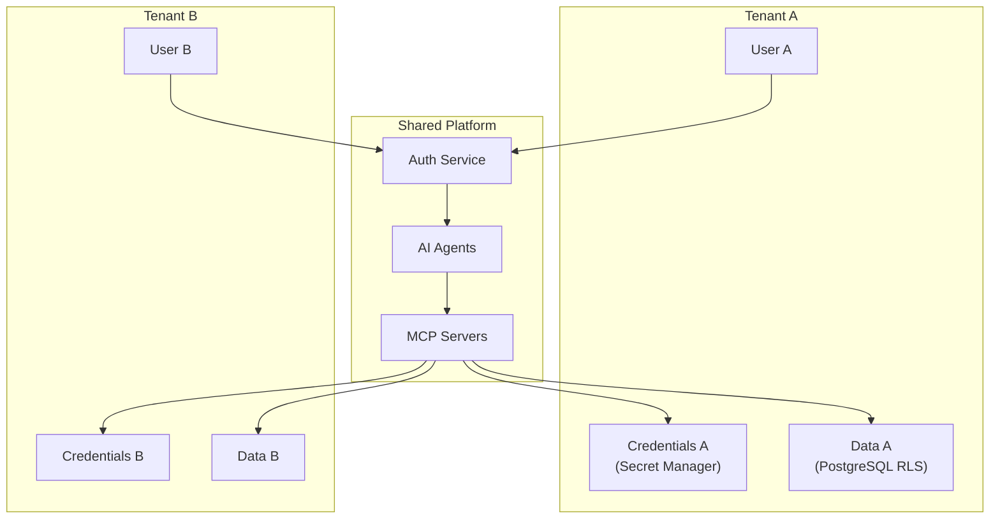
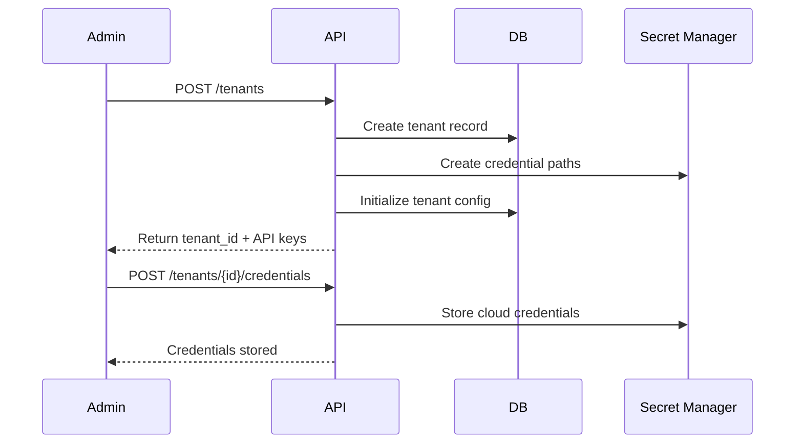

# Tenant Onboarding Specification

**Layer**: Multi-Tenancy
**Phase**: 7
**Status**: Template

## Overview

This specification defines the multi-tenant architecture and onboarding flow for the platform. Phase 7 introduces tenant isolation, per-tenant credentials, and the Tenant Agent.

## Multi-Tenant Architecture



## Data Isolation

### PostgreSQL Row-Level Security

```sql
-- Enable RLS on all tenant tables
ALTER TABLE cost_data ENABLE ROW LEVEL SECURITY;

-- Create tenant isolation policy
CREATE POLICY tenant_isolation ON cost_data
    USING (tenant_id = current_setting('app.tenant_id')::uuid);

-- Set tenant context per request
SET app.tenant_id = 'tenant-uuid-here';
```

### Credential Isolation

```yaml
# Secret Manager path structure
secrets:
  - projects/{PROJECT}/secrets/{TENANT_ID}-aws-credentials
  - projects/{PROJECT}/secrets/{TENANT_ID}-azure-credentials
  - projects/{PROJECT}/secrets/{TENANT_ID}-gcp-service-account
```

## Onboarding Flow



## Tenant Configuration Schema

```yaml
tenant:
  id: uuid
  name: string
  created_at: datetime
  status: enum [active, suspended, deleted]

  cloud_accounts:
    - provider: gcp
      project_id: string
      credential_path: string
    - provider: aws
      account_id: string
      credential_path: string
    - provider: azure
      subscription_id: string
      credential_path: string

  settings:
    budget_alerts: boolean
    llm_spend_limit: number
    notification_channels: array
```

## RBAC per Tenant

| Role | Permissions |
|------|-------------|
| Tenant Admin | Full tenant access, user management |
| Operator | Execute remediations, view all data |
| Analyst | View data, run reports |
| Viewer | Read-only dashboard access |

## Security Requirements

- All tenant data isolated via PostgreSQL RLS
- Credentials stored in Secret Manager with tenant-specific paths
- Cross-tenant queries blocked at database level
- Audit logging for all tenant operations

## References

- [ADR-003: BigQuery for Analytics](../adr/003-use-bigquery-not-timescaledb.md)
- [Phase 7 Roadmap](../../governance/ROADMAP.md#phase-7-multi-tenant--a2a-conditional)
