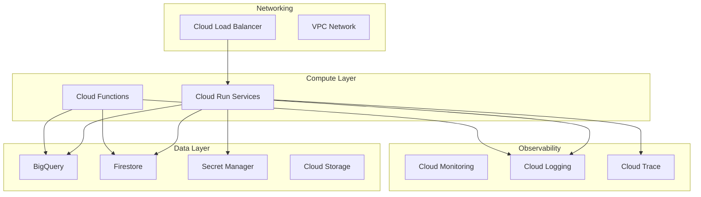

# Deployment Infrastructure Specification

**Layer**: Foundation
**Phase**: 2
**Status**: Template

## Overview

This specification defines the GCP infrastructure for the platform, including compute, data, and observability layers.

## Infrastructure Architecture



## Terraform Module Structure

```
components/infrastructure/
├── main.tf
├── variables.tf
├── outputs.tf
├── modules/
│   ├── cloud-run/
│   │   ├── main.tf
│   │   ├── variables.tf
│   │   └── outputs.tf
│   ├── bigquery/
│   ├── firestore/
│   ├── secret-manager/
│   ├── cloud-functions/
│   └── networking/
└── environments/
    ├── dev.tfvars
    ├── staging.tfvars
    └── prod.tfvars
```

## Cloud Run Configuration

```yaml
# Cloud Run service spec
service:
  name: "{SERVICE_NAME}-api"
  region: us-central1

  scaling:
    min_instances: 0      # Scale-to-zero
    max_instances: 10
    concurrency: 80

  resources:
    cpu: 1
    memory: 512Mi

  env:
    - name: PROJECT_ID
      value: "{PROJECT_ID}"
    - name: FIRESTORE_DATABASE
      value: "(default)"
```

## BigQuery Dataset

```sql
-- Billing data dataset
CREATE SCHEMA IF NOT EXISTS billing_data
OPTIONS(
  location = "US",
  description = "Cloud billing export data"
);

-- Cost aggregation table
CREATE TABLE billing_data.daily_costs (
  date DATE,
  project_id STRING,
  service STRING,
  cost FLOAT64,
  currency STRING
)
PARTITION BY date;
```

## CI/CD Pipeline

```yaml
# GitHub Actions workflow
name: Deploy to Cloud Run

on:
  push:
    branches: [main]

jobs:
  deploy:
    runs-on: ubuntu-latest
    steps:
      - uses: actions/checkout@v4

      - name: Authenticate to GCP
        uses: google-github-actions/auth@v2
        with:
          credentials_json: ${{ secrets.GCP_SA_KEY }}

      - name: Build and Push
        run: |
          gcloud builds submit --tag gcr.io/$PROJECT_ID/$SERVICE_NAME

      - name: Deploy to Cloud Run
        run: |
          gcloud run deploy $SERVICE_NAME \
            --image gcr.io/$PROJECT_ID/$SERVICE_NAME \
            --region us-central1 \
            --allow-unauthenticated
```

## Cost Targets

| Resource | Monthly Cost |
|----------|-------------|
| Cloud Run (idle) | $0 |
| Cloud Run (active) | ~$5-10 |
| BigQuery (1TB free) | $0 |
| Firestore | ~$1-2 |
| Secret Manager | < $1 |
| **Total MVP** | **< $15/month** |

## References

- [ADR-002: GCP-First Strategy](../adr/002-gcp-only-first.md)
- [ADR-004: Cloud Run](../adr/004-cloud-run-not-kubernetes.md)
