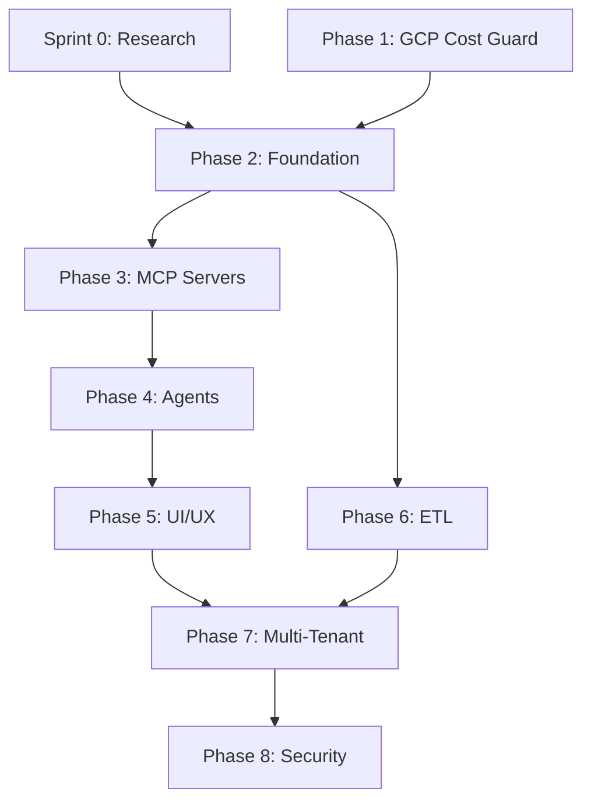

# AI Cost Monitoring - Project Plan

**Project**: {PROJECT_NAME} (`{PROJECT_PREFIX}`)
**Total Duration**: 20 weeks (Feb 17 - Jul 18, 2026)
**Total Sprints**: 10 sprints + Sprint 0 (1 week)
**Estimated Tasks**: ~75 individual tasks
**AI-Optimized**: All phases optimized with simplified architecture

> **Architecture Simplification (v2.0)**:
> - MCP Servers: 8 → 4 (data access only, using native providers)
> - AI Agents: 11 → 5 (removed Cloud Agent layer, merged Domain Agents)
> - UI: Grafana deferred, CopilotKit MVP only
> - ETL: Deferred, MCP provides real-time data

---

## 1. Project Phases Overview

### Timeline Visualization

```
2026
Feb        Mar        Apr        May        Jun        Jul
 |          |          |          |          |          |
 v          v          v          v          v          v
[S0]-[P1]--[ P2 ]--[P3]--[ P4 ]--[P5]-[P6]--[  P7  ]--[  P8  ]
 1w   1w     3w     2w     3w    2w   2w       4w        4w
      ^      ^      ^      ^     ^    ^
   All phases AI-optimized (20 weeks total)
```

### Phase Summary Table

| Phase | Name | Duration | Sprints | Start | End | Board Status | Epic |
|:-----:|:-----|:--------:|:-------:|:------|:----|:-------------|:----:|
| S0 | Research & Decisions | 1 week | -- | Feb 17 | Feb 21 | Done | -- |
| P1 | GCP Cost Guard | 1 week | 1.1 | Feb 24 | Feb 28 | **In Progress** (tasks: Backlog) | #11 |
| P2 | Foundation Infrastructure | 3 weeks | 2.1, 2.2 | Mar 3 | Mar 21 | Todo | #12 |
| P3 | MCP Servers (4) | 2 weeks | 3.1 | Mar 24 | Apr 4 | Todo | #13 |
| P4 | AI Agents (5) | 3 weeks | 4.1, 4.2 | Apr 7 | Apr 25 | Todo | #14 |
| P5 | CopilotKit Chat | 2 weeks | 5.1 | Apr 28 | May 9 | Todo | #15 |
| P6 | Event Processing | 2 weeks | 6.1 | May 12 | May 23 | Todo | #16 |
| P7 | Multi-Tenant & A2A | 4 weeks | 7.1, 7.2 | May 26 | Jun 20 | Todo | #17 |
| P8 | Security & Testing | 4 weeks | 8.1, 8.2 | Jun 23 | Jul 18 | Todo | #18 |

### Phase Dependencies



| Dependency | Reason |
|:-----------|:-------|
| S0 → P2 | Auth/LLM decisions required for foundation |
| P1 → P2 | Cost Guard validates GCP patterns |
| P2 → P3 | MCP servers need Cloud Run infra |
| P2 → P6 | ETL needs Cloud Functions + BigQuery |
| P3 → P4 | Agents call MCP servers |
| P4 → P5 | UI renders agent responses |
| P5 + P6 → P7 | Multi-tenant needs working UI + data |
| P7 → P8 | Security hardens full system |

### Phase Descriptions

| Phase | Scope | Key Deliverables | Exit Criteria |
|:------|:------|:-----------------|:--------------|
| **S0** | Resolve blocking decisions | ADRs for LLM, Auth, OTEL, Grafana, OpenCost | All P0 decisions documented |
| **P1** | Standalone GCP cost protection | Budget alerts, LLM limits, idle detection | Alerts < 1hr, cost < $15/mo |
| **P2** | Platform infrastructure on GCP | Terraform, FastAPI, CI/CD, Auth, RBAC | Cloud Run + Auth working |
| **P3** | 4 MCP servers (data access) | 3 native (AWS/Azure/GCP) + OpenCost custom | All MCPs < 3s response |
| **P4** | 5 AI agents (Google ADK) | Coordinator + Cost + Remediation + Cross-Cloud | E2E query < 5s, 95% routing |
| **P5** | CopilotKit Chat (MVP) | AI chat interface (Grafana deferred) | Lighthouse 90+, RBAC |
| **P6** | Event processing & alerts | Webhooks, notifications (ETL deferred) | Alerts < 5min |
| **P7** | Multi-tenancy + A2A gateway | PostgreSQL RLS, tenant isolation | 2+ tenants isolated |
| **P8** | Production hardening | Security scans, E2E tests, docs | 0 critical CVEs |

---

## 2. Current State Analysis

### GitHub Issues Summary (32 issues)

| Type | Count | Issues | State | Board Status |
|:-----|:-----:|:-------|:------|:-------------|
| Phase 1 Epic | 1 | #11 | Open | In Progress |
| Phase 2-8 Epics | 7 | #12-18 | Open | Todo |
| Phase 1 Sub-tasks | 14 | #19-32 | Open | Backlog |
| Sprint 0 Research | 5 | #6-10 | Closed | Done |
| Legacy/Duplicate | 4 | #1, #3, #4, #5 | Open | — |

### Board Status Rules

| Status | Assignment | Meaning |
|:-------|:-----------|:--------|
| **Todo** | Default (automatic) | All new issues receive this via built-in workflow |
| **Backlog** | Manual (nearest phase only) | Sub-tasks of the next phase to execute; ready for sprint pull |
| **In Progress** | Manual | Actively being worked on |
| **In Review** | Manual / label sync | PR submitted, awaiting review |
| **Done** | Automatic | Issue closed or PR merged |

### Gap Analysis (Simplified Architecture)

| Item | Roadmap | GitHub | Gap |
|:-----|:-------:|:------:|:----|
| Sprint 0 Tasks | 5 | 5 (closed) | Complete |
| Phase 1 Tasks | 14 | 14 (#19-32) | Complete — on Project Board #{PROJECT_BOARD_NUMBER} |
| Phase 2 Tasks | 10 | 1 (epic only) | Need 10 sub-tasks |
| Phase 3 Tasks | 8 | 1 (epic only) | Need 8 sub-tasks |
| Phase 4 Tasks | 8 | 1 (epic only) | Need 8 sub-tasks |
| Phase 5 Tasks | 6 | 1 (epic only) | Need 6 sub-tasks |
| Phase 6 Tasks | 6 | 1 (epic only) | Need 6 sub-tasks |
| Phase 7 Tasks | 8 | 1 (epic only) | Need 8 sub-tasks |
| Phase 8 Tasks | 9 | 1 (epic only) | Need 9 sub-tasks |

**Action Required**: Create ~61 sub-task issues for Phases 2-8 (create just-in-time as each phase begins).

---

## 3. Sprint 0: Research & Decisions

**Duration**: 1 week (Feb 17-21, 2026)
**Epic**: N/A (standalone)
**Milestone**: `AIOCTO - Sprint 0: Research & Decisions`

| ID | Task | Priority | Labels | Blocks | Issue |
|:---|:-----|:---------|:-------|:-------|:------|
| 0.1 | Reconcile LLM Strategy: Vertex AI vs LiteLLM | P0 | `type:research`, `component:agents` | Phase 4 | #6 |
| 0.2 | Reconcile Auth Strategy: Identity Platform vs Auth0 | P0 | `type:research`, `component:auth` | Phase 2 | #7 |
| 0.3 | Evaluate OTEL Gen-AI Semantic Conventions | P1 | `type:research`, `component:monitoring` | Phase 2 | #8 |
| 0.4 | Decide Grafana Deployment: Self-hosted vs Cloud | P1 | `type:research`, `component:ui` | Phase 5 | #9 |
| 0.5 | Decide OpenCost Integration: Prometheus vs API | P2 | `type:research`, `component:mcp` | Phase 3 | #10 |

**Exit Criteria**: All P0 decisions documented as ADRs.

---

## 4. Phase 1: GCP Cost Guard

**Duration**: 1 week AI-optimized (Feb 24 - Feb 28, 2026)
**Epic**: #11 `[Phase 1] GCP Cost Guard — Standalone Budget Protection`
**Milestone**: `AIOCTO - Phase 1: GCP Cost Guard`
**Depends On**: None (standalone, can start immediately)
**Reference**: [GCP-COST-GUARD.md](../docs/GCP-COST-GUARD.md)
**Repository**: `components/{SERVICE_NAME}` (monorepo)
**Total Effort**: ~36 hours (19 AI + 17 human) -- includes 20% buffer
**Time Analysis**: [AI_TIME_ESTIMATION.md](./AI_TIME_ESTIMATION.md)

### Sprint 1.1: Budget Alerts + Remediation + LLM Control

| Attribute | Value |
|:----------|:------|
| **Sprint** | 1.1 |
| **Duration** | 1 week (AI-optimized) |
| **Start Date** | Feb 24, 2026 (Monday) |
| **End Date** | Feb 28, 2026 (Friday) |
| **Total Effort** | ~36 hours (19 AI + 17 human) |
| **Buffer** | 20% included for reviews/testing/changes |
| **Sprint Goal** | Deliver working GCP cost protection system |

#### Sprint Capacity

| Resource | Capacity | Hours/Day | Total Hours | Notes |
|:---------|:--------:|:---------:|:-----------:|:------|
| AI Agent | 100% | ~4 hr | 19 hr | Code generation, tests, config |
| Human | 50% | ~3.5 hr | 17 hr | Review, GCP Console, approvals |

#### Task Execution Order

```
1.0 Repo --> 1.0a Terraform --> 1.0b CI/CD --------------------------+
                  |                                                   |
                  +--→ 1.1 Firestore --+-- 1.3 CostGuardedLLM       |
                  |                    |                              |
                  +--→ 1.2 Pub/Sub ----+--→ 1.4 Cloud Function       |
                                              |          |            |
                                              |          +-- 1.4a    |
                                              +--→ 1.5 Budget        |
                  1.1 + 1.6 BigQuery --→ 1.7 Idle Scanner            |
                                              |                      |
                                              +--→ 1.8 Recommender   |
                                              |                      |
               All (1.3-1.8) --------→ 1.9 Integration Tests <------+
                                                   |
                                                   +--- 1.10 Release
```

> _Corrected per implementation plan review: 1.2 depends on 1.0a (not 1.1). 1.1 and 1.2 are parallel. All functional issues block 1.9._

#### Task Details

| ID | Task | Pri | AI | AI Time | Human | Total | Depends | Reference |
|:---|:-----|:---:|:--:|:-------:|:-----:|:-----:|:--------|:----------|
| 1.0 | Create `{PROJECT_PREFIX}-{SERVICE_NAME}` repository | P0 | Y | 35 min | 20 min | 1 hr | -- | REPOSITORY_STRATEGY.md |
| 1.0a | Create Terraform module structure | P0 | Y | 1.2 hr | 40 min | 2 hr | 1.0 | -- |
| 1.0b | Set up GitHub Actions CI/CD pipeline | P0 | Y | 2.5 hr | 1.2 hr | 3.5 hr | 1.0 | -- |
| 1.1 | Create Firestore `{SERVICE_NAME}/config` schema | P0 | Y | 25 min | 15 min | 40 min | 1.0a | GCP-COST-GUARD.md |
| 1.2 | Create Pub/Sub topic `cost-alerts` | P0 | Y | 25 min | 15 min | 40 min | 1.0a | GCP-COST-GUARD.md |
| 1.3 | Implement `CostGuardedLLM` wrapper class | P0 | Y | 2.5 hr | 1.2 hr | 3.5 hr | 1.1 | GCP-COST-GUARD.md |
| 1.4 | Create Cloud Function `budget-remediation` | P0 | Y | 3.5 hr | 1.2 hr | 5 hr | 1.1, 1.2 | GCP-COST-GUARD.md |
| 1.4a | Configure notification channels (Teams/Email) | P1 | N | -- | 2.5 hr | 2.5 hr | 1.4 | -- |
| 1.5 | Set up GCP Budget with Pub/Sub notification | P0 | N | -- | 2.5 hr | 2.5 hr | 1.2, 1.4 | GCP-COST-GUARD.md |
| 1.6 | Set up BigQuery Billing Export | P0 | N | -- | 2 hr | 2 hr | -- | GCP-COST-GUARD.md |
| 1.7 | Create Cloud Function `idle-scanner` | P1 | Y | 3 hr | 1.2 hr | 4 hr | 1.1, 1.6 | GCP-COST-GUARD.md |
| 1.8 | Integrate GCP Recommender API | P1 | Y | 1.2 hr | 40 min | 2 hr | 1.7 | GCP-COST-GUARD.md |
| 1.9 | Integration tests for all components | P0 | Y | 3.5 hr | 2.5 hr | 6 hr | 1.0b, 1.4, 1.7 | -- |
| 1.10 | Release `{SERVICE_NAME} v1.0.0` | P0 | N | 35 min | 1.2 hr | 2 hr | All | RELEASE_PROCESS.md |

**Legend**: Y = AI-implementable, N = Human required (GCP console, manual config, approvals)
All estimates include **20% buffer** for reviews, test deployment, and changes.

#### Time Summary

| Category | Tasks | AI Time | Human Time | Total |
|:---------|:-----:|:-------:|:----------:|:-----:|
| AI-Implementable | 10 | 18.5 hr | 9 hr | 27.5 hr |
| Human Required | 4 | 0.5 hr | 8 hr | 8.5 hr |
| **Total** | **14** | **19 hr** | **17 hr** | **36 hr** |

#### Daily Schedule

> _Schedule revised per implementation plan review: #28 moved to Day 1 (BigQuery needs 24h data population). #22/#23 parallelized on Day 2._

##### Day 1 (Mon Feb 24): Repository + Infrastructure

| Time | Tasks | AI Hours | Human Hours | Deliverable |
|:-----|:------|:--------:|:-----------:|:------------|
| AM | 1.0 | 0.6 hr | 0.3 hr | Repo with full structure |
| AM | 1.6 (BigQuery export) | -- | 2 hr | Export enabled (data in ~24h) |
| PM | 1.0a | 1.2 hr | 0.7 hr | Terraform structure |
| PM | 1.0b (parallel with 1.0a) | 2.5 hr | 1.2 hr | GitHub Actions workflows |
| **Total** | | **4.3 hr** | **4.2 hr** | |

##### Day 2 (Tue Feb 25): Firestore + Pub/Sub + Core Functions

| Time | Tasks | AI Hours | Human Hours | Deliverable |
|:-----|:------|:--------:|:-----------:|:------------|
| AM | 1.1 + 1.2 (parallel) | 0.8 hr | 0.5 hr | Both infra components |
| AM | 1.3 (after 1.1) | 2.5 hr | 1.2 hr | CostGuardedLLM class + unit tests |
| PM | 1.4 | 3.5 hr | 1.2 hr | budget-remediation function + unit tests |
| **Total** | | **6.8 hr** | **2.9 hr** | |

##### Day 3 (Wed Feb 26): GCP Console + Idle Scanner

| Time | Tasks | AI Hours | Human Hours | Deliverable |
|:-----|:------|:--------:|:-----------:|:------------|
| AM | 1.5 (GCP Budget) | -- | 2.5 hr | Budget → Pub/Sub configured |
| PM | 1.7 | 3 hr | 1.2 hr | idle-scanner function + unit tests |
| **Total** | | **3 hr** | **3.7 hr** | |

##### Day 4 (Thu Feb 27): Notifications + Recommender + Tests

| Time | Tasks | AI Hours | Human Hours | Deliverable |
|:-----|:------|:--------:|:-----------:|:------------|
| AM | 1.4a (Teams/Email) | -- | 2.5 hr | Notification channels |
| AM | 1.8 | 1.2 hr | 0.7 hr | Recommender integration |
| PM | 1.9 | 3.5 hr | 2.5 hr | All integration tests passing in CI |
| **Total** | | **4.7 hr** | **5.7 hr** | |

##### Day 5 (Fri Feb 28): Buffer + Release

| Time | Tasks | AI Hours | Human Hours | Deliverable |
|:-----|:------|:--------:|:-----------:|:------------|
| AM | Buffer | -- | 1 hr | Fix test failures, code review |
| PM | 1.10 | 1 hr | 1.2 hr | CHANGELOG, tag, release |
| **Total** | | **1 hr** | **2.2 hr** | |

##### Daily Summary

| Day | Focus | AI Hours | Human Hours | Total | Tasks |
|:----|:------|:--------:|:-----------:|:-----:|:------|
| Mon | Infrastructure | 4.3 hr | 4.2 hr | 8.5 hr | 1.0, 1.0a, 1.0b, 1.6 |
| Tue | Core Functions | 6.8 hr | 2.9 hr | 9.7 hr | 1.1, 1.2, 1.3, 1.4 |
| Wed | GCP Console + Scanner | 3 hr | 3.7 hr | 6.7 hr | 1.5, 1.7 |
| Thu | Integrations + Tests | 4.7 hr | 5.7 hr | 10.4 hr | 1.4a, 1.8, 1.9 |
| Fri | Release | 1 hr | 2.2 hr | 3.2 hr | Buffer, 1.10 |
| **Total** | | **19.8 hr** | **18.7 hr** | **~38.5 hr** | **14 tasks** |

#### Backlog by Priority

**P0 - Critical (Must Complete)**:

| ID | Title | Size | Blocks |
|:---|:------|:----:|:-------|
| 1.0 | Create repository | S | All |
| 1.0a | Terraform module structure | S | 1.1, 1.2 |
| 1.0b | GitHub Actions CI/CD | M | 1.9, 1.10 |
| 1.1 | Create Firestore schema | XS | 1.3, 1.4, 1.7 |
| 1.2 | Create Pub/Sub topic | XS | 1.4, 1.5 |
| 1.3 | Implement CostGuardedLLM | M | 1.9 |
| 1.4 | Create budget-remediation function | M | 1.4a, 1.5, 1.9 |
| 1.5 | Set up GCP Budget | S | 1.9 |
| 1.6 | Set up BigQuery Export | S | 1.7 |
| 1.9 | Integration tests | M | 1.10 |
| 1.10 | Release v1.0.0 | XS | -- |

**P1 - High (Should Complete)**:

| ID | Title | Size | Blocks |
|:---|:------|:----:|:-------|
| 1.4a | Configure notification channels | S | 1.9 |
| 1.7 | Create idle-scanner function | M | 1.8, 1.9 |
| 1.8 | Integrate Recommender API | S | 1.9 |

### Task Specifications

<details>
<summary><strong>1.0 Create `{PROJECT_PREFIX}-{SERVICE_NAME}` repository</strong></summary>

**Priority**: P0 | **Size**: S | **AI**: Y | **Labels**: `type:infra`, `phase:1`
**Blocks**: All subsequent tasks | **Reference**: [REPOSITORY_STRATEGY.md](./REPOSITORY_STRATEGY.md)

**Summary**: Create the component repository with Python project structure and development tooling.

**Acceptance Criteria**:
- [ ] Repository `{PROJECT_PREFIX}-{SERVICE_NAME}` created on GitHub Enterprise
- [ ] Python project structure initialized:
  ```
  {PROJECT_PREFIX}-{SERVICE_NAME}/
  ├── src/
  │   └── cost_guard/
  │       ├── __init__.py
  │       ├── llm_wrapper.py
  │       ├── functions/
  │       │   ├── __init__.py
  │       │   ├── budget_remediation.py
  │       │   └── idle_scanner.py
  │       └── utils/
  │           ├── __init__.py
  │           ├── firestore.py
  │           └── logging.py
  ├── tests/
  │   ├── __init__.py
  │   ├── test_llm_wrapper.py
  │   ├── test_budget_remediation.py
  │   └── test_idle_scanner.py
  ├── terraform/
  ├── .github/
  ├── pyproject.toml
  ├── README.md
  ├── CHANGELOG.md
  └── .gitignore
  ```
- [ ] `pyproject.toml` with dependencies: `litellm`, `google-cloud-firestore`, `google-cloud-pubsub`, `google-cloud-logging`, `google-cloud-monitoring`, `google-cloud-recommender`, `functions-framework`
- [ ] Development dependencies: `pytest`, `pytest-cov`, `ruff`, `mypy`
- [ ] `.gitignore` for Python, Terraform, IDE files
- [ ] README.md with project overview placeholder
- [ ] Branch protection rules applied to `main`

**Technical Notes**:
- Use `uv` or `pip` for dependency management
- Python version: 3.12+
- License: Apache 2.0 or as per org standard
</details>

<details>
<summary><strong>1.0a Create Terraform module structure</strong></summary>

**Priority**: P0 | **Size**: S | **AI**: Y | **Labels**: `type:infra`, `cloud:gcp`, `phase:1`
**Depends On**: 1.0 | **Blocks**: 1.1, 1.2, 1.4, 1.7

**Summary**: Create modular Terraform structure for all GCP resources.

**Acceptance Criteria**:
- [ ] Terraform directory structure:
  ```
  terraform/
  ├── main.tf
  ├── variables.tf
  ├── outputs.tf
  ├── versions.tf
  ├── terraform.tfvars.example
  ├── modules/
  │   ├── firestore/
  │   │   ├── main.tf
  │   │   ├── variables.tf
  │   │   └── outputs.tf
  │   ├── pubsub/
  │   │   ├── main.tf
  │   │   ├── variables.tf
  │   │   └── outputs.tf
  │   ├── cloud-functions/
  │   │   ├── main.tf
  │   │   ├── variables.tf
  │   │   └── outputs.tf
  │   └── scheduler/
  │       ├── main.tf
  │       ├── variables.tf
  │       └── outputs.tf
  └── environments/
      ├── dev.tfvars
      └── prod.tfvars
  ```
- [ ] Provider configuration for GCP (version pinned)
- [ ] Variables for: `project_id`, `region`, `environment`
- [ ] Backend configuration for GCS state storage
- [ ] `terraform validate` passes
- [ ] `terraform fmt` applied

**Technical Notes**:
- Provider: `hashicorp/google ~> 5.0`
- Region default: `us-central1`
- State bucket naming: `${project_id}-tfstate`
</details>

<details>
<summary><strong>1.0b Set up GitHub Actions CI/CD pipeline</strong></summary>

**Priority**: P0 | **Size**: M | **AI**: Y | **Labels**: `type:infra`, `phase:1`
**Depends On**: 1.0 | **Blocks**: 1.9, 1.10

**Summary**: Create CI/CD workflows for testing, linting, and deployment.

**Acceptance Criteria**:
- [ ] Workflow `.github/workflows/ci.yml`:
  - Triggers on: push to `main`, pull requests
  - Jobs: lint (ruff), type check (mypy), test (pytest)
  - Python matrix: 3.12
  - Test coverage report uploaded
  - Status badges in README
- [ ] Workflow `.github/workflows/terraform.yml`:
  - Triggers on: push to `main` (terraform/ changes), manual dispatch
  - Jobs: validate, plan, apply (on merge to main)
  - Uses Workload Identity Federation (no service account keys)
- [ ] Workflow `.github/workflows/deploy-functions.yml`:
  - Triggers on: push to `main` (src/ changes)
  - Deploys Cloud Functions to GCP
  - Environment: dev (auto), prod (manual approval)
- [ ] Workflow `.github/workflows/release.yml`:
  - Triggers on: tag push (`v*`)
  - Creates GitHub Release with changelog
- [ ] Repository secrets configured (documented, not actual values):
  - `GCP_PROJECT_ID`
  - `GCP_WORKLOAD_IDENTITY_PROVIDER`
  - `GCP_SERVICE_ACCOUNT`

**Technical Notes**:
- Use Workload Identity Federation for keyless auth
- Cache pip dependencies for faster builds
- **No marketplace actions** — use self-contained shell commands per [GOVERNANCE_RULES.md §2a](./GOVERNANCE_RULES.md#2a-no-marketplace-actions-mandatory)
- Checkout via `git clone`, Python via runner-installed `python3`, Terraform via curl download
</details>

<details>
<summary><strong>1.1 Create Firestore `{SERVICE_NAME}/config` schema</strong></summary>

**Priority**: P0 | **Size**: XS | **AI**: Y | **Labels**: `type:infra`, `component:data`, `cloud:gcp`, `phase:1`
**Blocks**: 1.2, 1.3, 1.4, 1.7 | **Reference**: [GCP-COST-GUARD.md](../docs/GCP-COST-GUARD.md)

**Summary**: Initialize Firestore collections for cost guard configuration and spend tracking.

**Acceptance Criteria**:
- [ ] Collection `{SERVICE_NAME}/config/budgets` exists with schema: `{ monthly_limit: number, alert_thresholds: number[] }`
- [ ] Collection `{SERVICE_NAME}/config/llm` exists with schema: `{ daily_limit: number, monthly_limit: number, enabled: boolean }`
- [ ] Collection `{SERVICE_NAME}/config/remediation` exists with schema: `{ auto_disable: boolean, protected_services: string[], auto_disable_services: string[] }`
- [ ] Collection `{SERVICE_NAME}/spend/{date}` exists with schema: `{ llm: number, total: number }`
- [ ] Firestore security rules restrict access to service accounts only
- [ ] Default values populated: `daily_limit=100`, `monthly_limit=500`

**Technical Notes**:
- Use Firestore in Native mode (not Datastore mode)
- Create in `us-central1` region
- Create via Terraform or Python script
</details>

<details>
<summary><strong>1.2 Create Pub/Sub topic `cost-alerts`</strong></summary>

**Priority**: P0 | **Size**: XS | **AI**: Y | **Labels**: `type:infra`, `cloud:gcp`, `phase:1`
**Depends On**: 1.0a | **Blocks**: 1.4, 1.5

**Summary**: Create Pub/Sub topic to receive GCP Budget notifications.

**Acceptance Criteria**:
- [ ] Topic `cost-alerts` exists in project
- [ ] Topic has IAM binding for `billing.budgets.publisher` service account
- [ ] Dead-letter topic `cost-alerts-dlq` exists for failed messages
- [ ] Message retention set to 7 days
- [ ] Terraform module created

**Technical Notes**:
- Topic will receive JSON payload from GCP Budget API
- Message schema: `{ budgetDisplayName, costAmount, budgetAmount, alertThresholdExceeded }`
</details>

<details>
<summary><strong>1.3 Implement `CostGuardedLLM` wrapper class</strong></summary>

**Priority**: P0 | **Size**: M | **AI**: Y | **Labels**: `type:feature`, `component:agents`, `phase:1`
**Depends On**: 1.1 | **Blocks**: 1.9

**Summary**: Python class that wraps LiteLLM calls with spend tracking and limit enforcement.

**Acceptance Criteria**:
- [ ] Class `CostGuardedLLM` in `src/cost_guard/llm_wrapper.py`
- [ ] Constructor accepts `daily_limit` and `monthly_limit` parameters
- [ ] Method `call(prompt, model)` checks limits before API call
- [ ] Raises `DailyLimitExceeded` when daily limit reached
- [ ] Raises `MonthlyLimitExceeded` when monthly limit reached
- [ ] Records cost to Firestore after each successful call
- [ ] Logs all calls to Cloud Logging with cost breakdown
- [ ] Unit tests achieve 90% coverage
- [ ] Type hints on all public methods

**Technical Notes**:
- Use LiteLLM for multi-model support
- Cost calculation: `response.usage.total_tokens * model_cost_per_token`
- Model costs stored in config or retrieved from LiteLLM
</details>

<details>
<summary><strong>1.4 Create Cloud Function `budget-remediation`</strong></summary>

**Priority**: P0 | **Size**: M | **AI**: Y | **Labels**: `type:feature`, `cloud:gcp`, `phase:1`
**Depends On**: 1.1, 1.2 | **Blocks**: 1.5, 1.9

**Summary**: Cloud Function triggered by Pub/Sub to auto-disable services at budget thresholds.

**Acceptance Criteria**:
- [ ] Function `budget-remediation` deployed to Cloud Functions (2nd gen)
- [ ] Triggered by `cost-alerts` Pub/Sub topic
- [ ] At 50% threshold: sends Teams/email warning (no action)
- [ ] At 80% threshold: disables services tagged `{SERVICE_NAME}: auto-disable`
- [ ] At 100% threshold: disables all non-protected services
- [ ] Reads protected services list from Firestore
- [ ] Logs all actions to Cloud Logging
- [ ] Unit tests for threshold logic
- [ ] Terraform deployment module

**Technical Notes**:
- Use Cloud Run functions (2nd gen) for longer timeout (up to 60 min)
- Service disable via Cloud Run Admin API: `services.replaceService` with `serving.knative.dev/min-scale: 0`
</details>

<details>
<summary><strong>1.4a Configure notification channels (Teams/Email)</strong></summary>

**Priority**: P1 | **Size**: S | **AI**: N (requires external service setup) | **Labels**: `type:infra`, `phase:1`
**Depends On**: 1.4 | **Blocks**: 1.9

**Summary**: Set up notification channels for budget alerts and remediation actions.

**Acceptance Criteria**:
- [ ] Firestore config schema extended: `{SERVICE_NAME}/config/notifications`
  ```json
  {
    "teams": {
      "enabled": true,
      "webhook_url": "secret:teams-webhook",
      "channel": "Cost Alerts"
    },
    "email": {
      "enabled": true,
      "recipients": ["team@example.com"],
      "smtp_config": "secret:smtp-config"
    }
  }
  ```
- [ ] Teams incoming webhook URL stored in Secret Manager
- [ ] Email SMTP credentials stored in Secret Manager (or use SendGrid/Mailgun API)
- [ ] `budget-remediation` function updated to send notifications
- [ ] Test notification sent successfully
- [ ] Documentation for adding new recipients

**Technical Notes**:
- Teams: Create incoming webhook via Microsoft Teams connector
- Email options: SendGrid (free tier 100/day), GCP SMTP relay, or direct SMTP
- Secrets accessed via `google-cloud-secret-manager` library
- Alternative: {COMMUNICATION_TOOL_ALT} integration (Teams/Email only per governance rules)
- Consider GCP Cloud Monitoring notification channels as alternative
</details>

<details>
<summary><strong>1.5 Set up GCP Budget with Pub/Sub notification</strong></summary>

**Priority**: P0 | **Size**: S | **AI**: N (requires GCP Console) | **Labels**: `type:infra`, `cloud:gcp`, `phase:1`
**Depends On**: 1.2, 1.4 | **Blocks**: 1.9

**Summary**: Configure GCP Budget to send alerts to Pub/Sub at defined thresholds.

**Acceptance Criteria**:
- [ ] Budget created in GCP Billing console
- [ ] Budget amount set to configurable value (default $1000/month)
- [ ] Alert thresholds at 50%, 80%, 100%
- [ ] Pub/Sub notification enabled pointing to `cost-alerts` topic
- [ ] Budget scope: entire billing account or specific project
- [ ] Documented in runbook

**Technical Notes**:
- This task requires GCP Console access (not fully automatable)
- Can be partially automated via `gcloud billing budgets create`
- Document manual steps in runbook
</details>

<details>
<summary><strong>1.6 Set up BigQuery Billing Export</strong></summary>

**Priority**: P0 | **Size**: S | **AI**: N (requires Billing Console) | **Labels**: `type:infra`, `component:data`, `cloud:gcp`, `phase:1`
**Blocks**: 1.7

**Summary**: Enable native GCP Billing Export to BigQuery for cost analysis.

**Acceptance Criteria**:
- [ ] BigQuery dataset `billing_export` created
- [ ] Billing export enabled in Billing console
- [ ] Standard usage cost export enabled (not detailed)
- [ ] Data appears within 24 hours of enabling
- [ ] Sample query documented for cost breakdown

**Technical Notes**:
- Native export is free (no ETL required)
- Table: `gcp_billing_export_v1_XXXXXX_XXXXXX`
- Schema is fixed by GCP
</details>

<details>
<summary><strong>1.7 Create Cloud Function `idle-scanner`</strong></summary>

**Priority**: P1 | **Size**: M | **AI**: Y | **Labels**: `type:feature`, `cloud:gcp`, `phase:1`
**Depends On**: 1.1, 1.6 | **Blocks**: 1.8, 1.9

**Summary**: Daily Cloud Function that detects idle GCP resources using Cloud Monitoring API.

**Acceptance Criteria**:
- [ ] Function `idle-scanner` deployed to Cloud Functions
- [ ] Triggered by Cloud Scheduler at 6 AM daily
- [ ] Detects idle Cloud Run services (0 requests in 7 days)
- [ ] Detects idle Compute Engine VMs (CPU < 5% for 7 days)
- [ ] Detects idle Cloud SQL instances (0 connections in 7 days)
- [ ] Stores results in Firestore `{SERVICE_NAME}/idle-resources/{scan-date}`
- [ ] Sends weekly digest email with findings
- [ ] Unit tests for detection logic

**Technical Notes**:
- Query Cloud Monitoring API for metrics
- Metrics: `run.googleapis.com/request_count`, `compute.googleapis.com/instance/cpu/utilization`
- Use service account with `monitoring.viewer` role
</details>

<details>
<summary><strong>1.8 Integrate GCP Recommender API</strong></summary>

**Priority**: P1 | **Size**: S | **AI**: Y | **Labels**: `type:feature`, `cloud:gcp`, `phase:1`
**Depends On**: 1.7 | **Blocks**: 1.9

**Summary**: Add GCP Recommender API integration to surface cost optimization insights.

**Acceptance Criteria**:
- [ ] Function queries Recommender API for recommendations
- [ ] Supports `google.compute.instance.MachineTypeRecommender`
- [ ] Supports `google.compute.instance.IdleResourceRecommender`
- [ ] Supports `google.compute.disk.IdleResourceRecommender`
- [ ] Results stored in Firestore alongside idle-scanner results
- [ ] Recommendations included in weekly digest

**Technical Notes**:
- Recommender API is free
- Requires `recommender.viewer` IAM role
- API: `recommender.projects.locations.recommenders.recommendations.list`
</details>

<details>
<summary><strong>1.9 Integration tests for all components</strong></summary>

**Priority**: P0 | **Size**: M | **AI**: Y | **Labels**: `type:test`, `cloud:gcp`, `phase:1`
**Depends On**: 1.0b, 1.4, 1.7 | **Blocks**: 1.10

**Summary**: End-to-end tests verifying all Phase 1 components work together.

**Acceptance Criteria**:
- [ ] Test: Budget alert triggers remediation function
- [ ] Test: CostGuardedLLM enforces daily limit
- [ ] Test: CostGuardedLLM enforces monthly limit
- [ ] Test: Idle scanner detects test idle resource
- [ ] Test: Recommender integration returns results
- [ ] All tests pass in CI pipeline (GitHub Actions)
- [ ] Coverage report generated (target: 80%)

**Technical Notes**:
- Use pytest with mocked GCP services for unit tests
- Use actual GCP project for integration tests (separate test project)
- CI runs on GitHub Actions
</details>

<details>
<summary><strong>1.10 Release `{SERVICE_NAME} v1.0.0`</strong></summary>

**Priority**: P0 | **Size**: XS | **AI**: N (requires manual approval) | **Labels**: `type:infra`, `phase:1`
**Depends On**: All (1.1-1.9)

**Summary**: Tag and release the {SERVICE_NAME} component.

**Acceptance Criteria**:
- [ ] All tests passing on main branch
- [ ] CHANGELOG.md updated with v1.0.0 changes
- [ ] Git tag `v1.0.0` created
- [ ] GitHub Release published with notes
- [ ] README.md has installation and usage instructions
- [ ] Deployment guide documented

**Technical Notes**:
- Follow [RELEASE_PROCESS.md](./RELEASE_PROCESS.md)
- Use semantic versioning
</details>

### Phase 1 Exit Criteria

| Criterion | Target | Verification Method |
|:----------|:-------|:--------------------|
| Budget alerts fire | < 1 hour from threshold | Manual test with test budget |
| LLM limits enforced | 100% rejection at limit | Unit test + manual test |
| Idle detection runs | Weekly (every Monday 6 AM) | Cloud Scheduler logs |
| Infrastructure cost | < $15/month | GCP Billing dashboard |
| Test coverage | > 80% | pytest-cov report |
| Release published | v1.0.0 | GitHub Releases page |

### Sprint 1.1 Definition of Done

- [ ] All P0 tasks completed and merged
- [ ] All P1 tasks completed or documented as tech debt
- [ ] Integration tests passing in CI
- [ ] No critical bugs open
- [ ] Release v1.0.0 published
- [ ] Sprint retrospective completed

### Phase 1 Risks & Mitigations

| Risk | Probability | Impact | Mitigation |
|:-----|:-----------:|:------:|:-----------|
| GCP Budget API delay (up to 1hr) | High | Low | Document expected latency |
| Firestore cold start latency | Medium | Low | Regional deployment, keep-alive |
| LiteLLM cost calculation mismatch | Medium | Medium | Validate against actual billing |
| Test GCP project billing | Low | High | Set strict budget on test project |

---

## 5. Phase 2: Foundation Infrastructure

**Duration**: 3 weeks (Mar 3 - Mar 21, 2026)
**Epic**: #12 `[Phase 2] Foundation Infrastructure — Cloud Run + Auth + CI/CD`
**Milestone**: `AIOCTO - Phase 2: Foundation Infrastructure`
**Depends On**: Sprint 0, Phase 1

### Sprint 2.1: Compute + Data Layer (Mar 3-14)

| ID | Task | Priority | Labels | Blocks | Size |
|:---|:-----|:---------|:-------|:-------|:-----|
| 2.1 | Terraform: Cloud Run, BigQuery, Firestore | P0 | `type:infra`, `cloud:gcp` | Phase 3 | L |
| 2.2 | Terraform: Secret Manager, Storage, Scheduler | P0 | `type:infra`, `cloud:gcp` | Phase 6 | M |
| 2.3 | FastAPI backend skeleton on Cloud Run | P0 | `type:feature`, `component:data` | Phase 3 | M |
| 2.4 | CI/CD pipeline (GitHub Actions) | P0 | `type:infra` | All repos | M |
| 2.5 | Docker image strategy (python:3.12-slim) | P1 | `type:infra` | Phase 3 | S |

### Sprint 2.2: Auth + Observability (Mar 17-21)

| ID | Task | Priority | Labels | Blocks | Size |
|:---|:-----|:---------|:-------|:-------|:-----|
| 2.6 | Authentication setup (per Sprint 0 decision) | P0 | `type:feature`, `component:auth` | Phase 5 | L |
| 2.7 | RBAC implementation (5 roles) | P0 | `type:feature`, `component:auth` | Phase 5 | M |
| 2.8 | Cloud Monitoring + Logging + Trace | P1 | `type:infra`, `component:monitoring` | -- | M |
| 2.9 | OTEL Gen-AI semantic conventions | P1 | `type:feature`, `component:monitoring` | -- | M |
| 2.10 | Health check endpoints | P1 | `type:feature` | -- | S |

**Exit Criteria**: FastAPI on Cloud Run with auto-scale. Auth + RBAC working. CI/CD deploys on merge. Terraform < 10 min.

---

## 6. Phase 3: MCP Servers

**Duration**: 2 weeks AI-optimized (Mar 24 - Apr 4, 2026)
**Epic**: #13 `[Phase 3] MCP Servers — 4 Data Access Servers`
**Milestone**: `AIOCTO - Phase 3: MCP Servers`
**Depends On**: Phase 2

> **Architecture Principle**: MCP servers provide DATA ACCESS only. AI reasoning, forecasting, and decisions are handled by AI Agents in Phase 4.
>
> **Native MCP Servers (2026)**:
> - AWS: `@awslabs/mcp-server-aws-core` (native, GA Jan 2026)
> - Azure: `Azure.Mcp.Server` (native, GA)
> - GCP: `gcloud-mcp` + `bigquery-mcp` (native, GA)
> - OpenCost: Custom MCP (no native available)

### Sprint 3.1: MCP Integration (Mar 24 - Apr 4)

| ID | Task | Priority | Labels | Blocks | Size |
|:---|:-----|:---------|:-------|:-------|:-----|
| 3.1 | Integrate GCP native MCP (gcloud-mcp) | P0 | `type:feature`, `component:mcp`, `cloud:gcp` | Phase 4 | S |
| 3.2 | Integrate AWS native MCP (@awslabs/mcp-server-aws-core) | P0 | `type:feature`, `component:mcp`, `cloud:aws` | Phase 4 | S |
| 3.3 | Integrate Azure native MCP (Azure.Mcp.Server) | P1 | `type:feature`, `component:mcp`, `cloud:azure` | Phase 4 | S |
| 3.4 | Build custom OpenCost MCP server | P1 | `type:feature`, `component:mcp` | Phase 4 | M |
| 3.5 | Unified tool contracts (data schemas) | P0 | `type:feature`, `component:mcp` | All MCPs | S |
| 3.6 | Integration tests per MCP | P1 | `type:test`, `component:mcp` | -- | M |
| 3.7 | Cross-MCP signature validation | P1 | `type:feature`, `component:mcp` | -- | S |
| 3.8 | Release MCP layer package | P0 | `type:infra`, `component:mcp` | Phase 4 | S |

**Exit Criteria**: All 4 MCPs configured (3 native + 1 custom). Schema validation passes. Response < 3s.

---

## 7. Phase 4: AI Agents

**Duration**: 3 weeks AI-optimized (Apr 7 - Apr 25, 2026)
**Epic**: #14 `[Phase 4] AI Agents — 5 Agents (Google ADK)`
**Milestone**: `AIOCTO - Phase 4: AI Agents`
**Depends On**: Phase 3, Sprint 0 (LLM decision)

> **Simplified Architecture**: 11 agents → 5 agents
> - **Removed**: 4 Cloud Agents (Coordinator routes directly to MCP servers)
> - **Merged**: Cost + Optimization + Reporting → single Cost Agent
> - **Deferred**: Tenant Agent → Phase 7 (multi-tenant)
>
> **Architecture Principle**: Agents handle REASONING, FORECASTING, and DECISIONS. MCP servers provide raw data access only.

### Sprint 4.1: Core Agents (Apr 7-18)

| ID | Task | Priority | Labels | Blocks | Size |
|:---|:-----|:---------|:-------|:-------|:-----|
| 4.1 | Coordinator Agent (intent classification, routing to MCP) | P0 | `type:feature`, `component:agents` | Phase 5 | L |
| 4.2 | Cost Agent (analysis, forecasting, anomaly detection) | P0 | `type:feature`, `component:agents` | Phase 5 | L |
| 4.3 | Remediation Agent (recommendations, approval workflow) | P1 | `type:feature`, `component:agents` | Phase 5 | M |
| 4.4 | Cross-Cloud Agent (multi-cloud comparison, optimization) | P1 | `type:feature`, `component:agents` | Phase 5 | M |
| 4.5 | Parallel MCP query capability | P0 | `type:feature`, `component:agents` | -- | M |
| 4.6 | Google ADK + LiteLLM integration | P0 | `type:feature`, `component:agents` | -- | M |

### Sprint 4.2: Integration (Apr 21-25)

| ID | Task | Priority | Labels | Blocks | Size |
|:---|:-----|:---------|:-------|:-------|:-----|
| 4.7 | E2E flow: NL query → MCP data → Agent reasoning → response | P0 | `type:feature`, `component:agents` | Phase 5 | L |
| 4.8 | Agent unit + integration tests | P1 | `type:test`, `component:agents` | -- | M |
| 4.9 | Release agents package | P0 | `type:infra`, `component:agents` | Phase 5 | S |

**Exit Criteria**: Full agent hierarchy operational. NL query returns reasoned response E2E. Routing accuracy >= 95%.

---

## 8. Phase 5: CopilotKit Chat (MVP)

**Duration**: 2 weeks AI-optimized (Apr 28 - May 9, 2026)
**Epic**: #15 `[Phase 5] CopilotKit Chat — AI-First Interface (MVP)`
**Milestone**: `AIOCTO - Phase 5: CopilotKit Chat`
**Depends On**: Phase 4, Phase 2 (Auth)

> **Scope Change**: Grafana dashboards deferred to post-MVP. CopilotKit provides AI-first chat interface for MVP.

### Sprint 5.1: CopilotKit Chat (Apr 28 - May 9)

| ID | Task | Priority | Labels | Blocks | Size |
|:---|:-----|:---------|:-------|:-------|:-----|
| 5.1 | Next.js frontend on Cloud Run | P0 | `type:feature`, `component:ui` | -- | M |
| 5.2 | CopilotKit + AG-UI integration | P0 | `type:feature`, `component:ui` | -- | L |
| 5.3 | Streaming responses (SSE) | P0 | `type:feature`, `component:ui` | -- | M |
| 5.4 | Dark mode, responsive, Tailwind | P1 | `type:feature`, `component:ui` | -- | M |
| 5.5 | Auth integration (RBAC) | P0 | `type:feature`, `component:ui`, `component:auth` | -- | M |
| 5.6 | Release Platform v1.0.0 | P0 | `type:infra` | All | S |

**Exit Criteria**: CopilotKit streams AI responses. Lighthouse >= 90. RBAC enforced. MVP functional.

---

## 9. Phase 6: Event Processing

**Duration**: 2 weeks AI-optimized (May 12 - May 23, 2026)
**Epic**: #16 `[Phase 6] Event Processing — Alert Pipeline`
**Milestone**: `AIOCTO - Phase 6: Event Processing`
**Depends On**: Phase 2
**Note**: Can run in parallel with Phase 5

> **Scope Change**: ETL pipelines deferred. MCP servers provide real-time data access. Focus on event-driven alerts.

### Sprint 6.1: Event-Driven Pipeline (May 12 - May 23)

| ID | Task | Priority | Labels | Blocks | Size |
|:---|:-----|:---------|:-------|:-------|:-----|
| 6.1 | GCP native billing export (BigQuery) | P0 | `type:feature`, `component:data`, `cloud:gcp` | -- | S |
| 6.2 | Webhook endpoints for cloud alerts | P0 | `type:feature`, `component:data` | -- | M |
| 6.3 | Event processor with policy evaluation | P1 | `type:feature`, `component:data` | -- | M |
| 6.4 | Cross-cloud budget thresholds | P1 | `type:feature`, `component:data` | -- | S |
| 6.5 | Notification integration (Email/Teams) | P1 | `type:feature` | -- | M |
| 6.6 | Release Platform v2.0.0 | P0 | `type:infra` | All | S |

**Exit Criteria**: Event alerts fire within 5 minutes. Budget thresholds trigger notifications.

---

## 10. Phase 7: Multi-Tenant & A2A (Conditional)

**Duration**: 4 weeks (May 26 - Jun 20, 2026)
**Epic**: #17 `[Phase 7] Multi-Tenant & A2A Gateway (Conditional)`
**Milestone**: `AIOCTO - Phase 7: Multi-Tenant & A2A`
**Depends On**: Phase 5, Phase 6
**Conditional**: Only if multi-tenant required

### Sprint 7.1: Multi-Tenant Isolation (May 26 - Jun 6)

| ID | Task | Priority | Labels | Blocks | Size |
|:---|:-----|:---------|:-------|:-------|:-----|
| 7.1 | Migrate Firestore → PostgreSQL (Cloud SQL) | P0 | `type:feature`, `component:data` | 7.2 | L |
| 7.2 | PostgreSQL Row-Level Security | P0 | `type:feature`, `component:data`, `security` | -- | M |
| 7.3 | Per-tenant credential management | P0 | `type:feature`, `component:auth` | -- | M |
| 7.4 | Tenant onboarding flow | P1 | `type:feature`, `component:auth` | -- | M |

### Sprint 7.2: A2A Gateway (Jun 9-20)

| ID | Task | Priority | Labels | Blocks | Size |
|:---|:-----|:---------|:-------|:-------|:-----|
| 7.5 | A2A Protocol gateway endpoint | P1 | `type:feature`, `component:agents` | -- | L |
| 7.6 | External agent registration + auth | P1 | `type:feature`, `component:auth` | -- | M |
| 7.7 | Rate limiting (10 req/min per agent) | P2 | `type:feature`, `security` | -- | S |
| 7.8 | Release Platform v3.0.0 | P0 | `type:infra` | All | S |

**Exit Criteria**: >= 2 tenants isolated. External agents query via A2A. RLS verified.

---

## 11. Phase 8: Security & Testing (Conditional)

**Duration**: 4 weeks (Jun 23 - Jul 18, 2026)
**Epic**: #18 `[Phase 8] Security Hardening & E2E Testing (Conditional)`
**Milestone**: `AIOCTO - Phase 8: Security & Testing`
**Depends On**: Phase 7
**Conditional**: Production readiness

### Sprint 8.1: Security Hardening (Jun 23 - Jul 4)

| ID | Task | Priority | Labels | Blocks | Size |
|:---|:-----|:---------|:-------|:-------|:-----|
| 8.1 | Trivy container image scanning in CI | P0 | `type:infra`, `security` | -- | M |
| 8.2 | VPC network architecture (private subnets) | P0 | `type:infra`, `security` | -- | L |
| 8.3 | Audit logging (7-year retention) | P1 | `type:infra`, `security` | -- | M |
| 8.4 | Secrets auto-rotation (90-day cycle) | P1 | `type:infra`, `security` | -- | M |

### Sprint 8.2: Testing & Documentation (Jul 7-18)

| ID | Task | Priority | Labels | Blocks | Size |
|:---|:-----|:---------|:-------|:-------|:-----|
| 8.5 | E2E test suite (Playwright, all 4 modes) | P0 | `type:test` | -- | L |
| 8.6 | Load testing (100 tenants) | P1 | `type:test` | -- | M |
| 8.7 | Runbook for operational issues | P1 | `type:docs` | -- | M |
| 8.8 | Developer onboarding guide | P2 | `type:docs` | -- | M |
| 8.9 | Release Platform v4.0.0 | P0 | `type:infra` | All | S |

**Exit Criteria**: 0 critical CVEs. E2E covers all modes. < 5s p95 at 100 tenants.

---

## 12. Summary Statistics

| Metric | Value |
|:-------|:------|
| Total Phases | 8 + Sprint 0 |
| Total Sprints | 10 + Sprint 0 |
| Total Tasks | ~75 (simplified architecture) |
| Duration | 20 weeks (AI-optimized) |
| P0 Tasks | ~40 |
| P1 Tasks | ~25 |
| P2 Tasks | ~5 |
| Phase 1 Effort | ~36 hours (19 AI + 17 human) |
| Total Effort | ~729 hours (with 20% buffer) |
| Buffer | 20% included in all estimates |

### Tasks by Component

| Component | Tasks |
|:----------|:-----:|
| `component:mcp` | 8 |
| `component:agents` | 9 |
| `component:ui` | 6 |
| `component:data` | 6 |
| `component:auth` | 4 |
| `component:monitoring` | 2 |
| `type:infra` | 12 |
| `type:test` | 3 |
| `type:docs` | 2 |

### Tasks by Cloud

| Cloud | Tasks |
|:------|:-----:|
| `cloud:gcp` | 8 |
| `cloud:aws` | 2 |
| `cloud:azure` | 2 |

---

## Appendix A: AI Time Estimation Reference

For AI-assisted time estimation methodology, speedup factors, buffer rationale, and phase-by-phase effort breakdowns, see [AI_TIME_ESTIMATION.md](./AI_TIME_ESTIMATION.md).

---

## Appendix B: Migration Plan to GitHub

### Step 1: Clean Up Legacy Issues
- Close or relabel #1, #3, #4, #5 (duplicate research tasks)

### Step 2: Create Sub-Tasks for Each Phase
- Use GitHub MCP `create_issue` with parent epic reference
- Apply consistent labels and milestone assignments

### Step 3: Set Up Dependencies
- Use issue references in body (`Blocks #X`, `Depends on #Y`)
- Configure Project board fields (Phase, Priority, Size)

### Step 4: Configure Sprint Iterations
- Create iterations in Project #{PROJECT_BOARD_NUMBER} matching sprint calendar
- Assign tasks to appropriate iterations

---

## 13. Deployment Model

This project uses **phase-gated deployment** with a 4-stage iterative QA loop. See [AI_ISSUE_LIFECYCLE.md](./AI_ISSUE_LIFECYCLE.md) and [plans/](./plans/) for full details.

### Deployment Flow

```
Development → Deployment → QA Testing → Bug Fix (max 3 iterations)
                              ↓
                         Production
```

| Stage | Issue Label | Purpose |
|:------|:------------|:--------|
| Development | `ai:development` | Feature/fix implementation |
| Deployment | `ai:deployment` | Staging deployment verification |
| QA Testing | `ai:qa-testing` | Automated test execution |
| Bug Fix | `ai:development` + `bug` + `iteration:N` | Fix failures (max 3) |

**Quality Gates**: Each phase must pass QA before production deployment. All 8 phases deploy cumulatively to staging before production release.

---

## Version History

| Version | Date | Changes |
|:--------|:-----|:--------|
| 2.6 | {DATE} | Fixed task 1.0b Technical Notes: removed prohibited marketplace actions, added reference to GOVERNANCE_RULES.md §2a |
| 2.5 | {DATE} | Added Deployment Model section referencing IPLAN-010 phase-gated deployment |
| 2.4 | {DATE} | Applied IPLAN-001 corrections: fixed 1.2 dependency (1.0a not 1.1), revised daily schedule (#28→Day 1, #22/#23 parallel), Slack→Teams throughout, WIF-only auth |
| 2.3 | {DATE} | Added Board Status Rules: Todo (default), Backlog (nearest phase only); updated Phase Summary and Issues Summary to reflect current board state |
| 2.2 | {DATE} | Updated gap analysis: Phase 1 issues (#19-32) verified complete on GitHub; added to Project Board #{PROJECT_BOARD_NUMBER} |
| 2.1 | {DATE} | Consistency fixes: aligned task IDs across all phases with ROADMAP.md; fixed task/effort counts; replaced Appendix A with AI_TIME_ESTIMATION.md reference |
| 2.0 | {DATE} | Merged SPRINT_PLANNING.md into PROJECT_PLAN.md; added phase overview, dependencies, daily schedule, sprint capacity; numbered all sections |
| 1.4 | {DATE} | Added 20% buffer to all Phase 1 time estimates |
| 1.3 | {DATE} | Added AI-assisted time estimates; compressed Phase 1 from 2 weeks to 1 week |
| 1.2 | {DATE} | Added 4 prerequisite tasks (1.0, 1.0a, 1.0b, 1.4a) for Phase 1 |
| 1.1 | {DATE} | Enhanced Phase 1 with detailed task specs, acceptance criteria, dependency graph |
| 1.0 | {DATE} | Initial project plan based on ROADMAP.md analysis |
