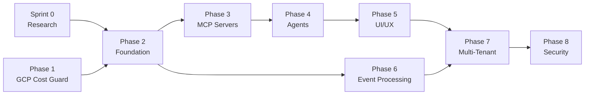

# Project Roadmap

**Project**: {PROJECT_NAME} | **Prefix**: `{PROJECT_PREFIX}`
**Home Repo**: [`{REPO_NAME}`](https://{GITHUB_HOST}/{GITHUB_ORG}/{REPO_NAME}) | **Board**: [V2 #{PROJECT_BOARD_NUMBER}](https://{GITHUB_HOST}/orgs/{GITHUB_ORG}/projects/{PROJECT_BOARD_NUMBER})
**Strategy**: Phased delivery with simplified 2-layer agent architecture (Coordinator + Domain Agents).
**Sprint Duration**: 2 weeks per sprint.
**Home Cloud**: GCP (platform infrastructure). **Monitored Clouds**: AWS, Azure, GCP, Kubernetes.

> This roadmap aligns with [PROJECT_DEFINITION.md](../docs/PROJECT_DEFINITION.md), the [ADRs](../docs/adr/), and [core specifications](../docs/core/).

**Related Planning Documents**:
- [PROJECT_PLAN.md](./PROJECT_PLAN.md) — Full project plan with task specifications and sprint planning
- [AI_TIME_ESTIMATION.md](./AI_TIME_ESTIMATION.md) — AI-assisted time estimates for all phases
- [DEFINITION_OF_DONE.md](./DEFINITION_OF_DONE.md) — Completion criteria
- [AI_ISSUE_LIFECYCLE.md](./AI_ISSUE_LIFECYCLE.md) — 4-stage issue lifecycle (Development → Deployment → QA → Bug Fix)
- [Implementation Plans](./plans/) — AI-first phase-gated deployment and other workflows

---

## Dependency Graph



| Dependency | Reason |
|:---|:---|
| Sprint 0 → Phase 2 | Auth and LLM decisions must be resolved before building foundation |
| Phase 1 → Phase 2 | Cost Guard validates GCP infra patterns reused in Phase 2 |
| Phase 2 → Phase 3 | MCP servers deploy on Cloud Run (Phase 2 infra) |
| Phase 3 → Phase 4 | Agents call MCP servers — MCP must exist first |
| Phase 4 → Phase 5 | UI renders agent responses — agents must work first |
| Phase 2 → Phase 6 | Event processing uses Cloud Functions + BigQuery (Phase 2 infra) |
| Phases 5+6 → Phase 7 | Multi-tenant requires working UI and data pipelines |
| Phase 7 → Phase 8 | Security hardening is for the full multi-tenant system |

---

## Sprint 0: Research & Decisions
*   **Scope**: Resolve open questions that block execution.
*   **Duration**: ~1 week
*   **Target**: Feb 17 – Feb 21, 2026

| # | Task | Priority | Issue | Blocks |
|:--|:-----|:---------|:------|:-------|
| 0.1 | Reconcile LLM strategy: Vertex AI vs LiteLLM | **P0** | [#6](https://{GITHUB_HOST}/{GITHUB_ORG}/{REPO_NAME}/issues/6) | Phase 4 (Agents) |
| 0.2 | Reconcile Auth strategy: GCP Identity Platform vs Auth0 | **P0** | [#7](https://{GITHUB_HOST}/{GITHUB_ORG}/{REPO_NAME}/issues/7) | Phase 2 (Auth) |
| 0.3 | Evaluate OTEL Gen-AI Semantic Conventions maturity | **P1** | [#8](https://{GITHUB_HOST}/{GITHUB_ORG}/{REPO_NAME}/issues/8) | Phase 2 (Observability) |
| 0.4 | Decide Grafana deployment: self-hosted vs Grafana Cloud | **P1** | [#9](https://{GITHUB_HOST}/{GITHUB_ORG}/{REPO_NAME}/issues/9) | Phase 5 (Dashboards) |
| 0.5 | Decide OpenCost integration: Prometheus vs direct API | **P2** | [#10](https://{GITHUB_HOST}/{GITHUB_ORG}/{REPO_NAME}/issues/10) | Phase 3 (K8s MCP) |

**Exit Criteria**: All P0 decisions documented as ADRs. P1/P2 decisions have a recommended option with rationale.

---

## Phase 1: GCP Cost Guard (Standalone)
*   **Scope**: `{SERVICE_NAME}` — a standalone, deployable cost protection system for GCP.
*   **Reference**: [GCP-COST-GUARD.md](../docs/GCP-COST-GUARD.md)
*   **Duration**: ~1 week AI-optimized (1 sprint)
*   **Target**: Feb 24 – Feb 28, 2026

### Sprint 1.1: Budget Alerts + Remediation + Idle Detection

> **Full task details**: See [PROJECT_PLAN.md §Phase 1](./PROJECT_PLAN.md#4-phase-1-{SERVICE_NAME}) for 14 tasks with acceptance criteria, daily schedule, and sprint capacity.

| # | Task | Priority | Blocks |
|:--|:-----|:---------|:-------|
| 1.0 | Create `components/{SERVICE_NAME}` component | **P0** | All |
| 1.0a | Create Terraform module structure | **P0** | 1.1, 1.2 |
| 1.0b | Set up GitHub Actions CI/CD pipeline | **P0** | 1.9, 1.10 |
| 1.1 | Create Firestore `{SERVICE_NAME}/config` schema | **P0** | 1.2, 1.3, 1.4, 1.7 |
| 1.2 | Create Pub/Sub topic `cost-alerts` | **P0** | 1.4, 1.5 |
| 1.3 | Implement `CostGuardedLLM` wrapper class | **P0** | 1.9 |
| 1.4 | Create Cloud Function `budget-remediation` | **P0** | 1.4a, 1.5, 1.9 |
| 1.4a | Configure notification channels (Teams/Email) | **P1** | 1.9 |
| 1.5 | Set up GCP Budget with Pub/Sub notification | **P0** | 1.9 |
| 1.6 | Set up BigQuery Billing Export | **P0** | 1.7 |
| 1.7 | Create Cloud Function `idle-scanner` | **P1** | 1.8, 1.9 |
| 1.8 | Integrate GCP Recommender API | **P1** | 1.9 |
| 1.9 | Integration tests for all components | **P0** | 1.10 |
| 1.10 | Release `{SERVICE_NAME} v1.0.0` | **P0** | — |

**Exit Criteria**: Budget alerts fire within 1 hour of threshold. LLM spend limits enforced. Idle resources detected weekly. Total infra cost < $15/month.

---

## Phase 2: Foundation Infrastructure
*   **Scope**: Platform infrastructure on GCP — the Home Cloud.
*   **Reference**: [07-deployment-infrastructure.md](../docs/core/07-deployment-infrastructure.md), ADR-002, ADR-003, ADR-004
*   **Duration**: ~3 weeks (2 sprints)
*   **Target**: Mar 3 – Mar 21, 2026
*   **Depends on**: Sprint 0 (auth decision), Phase 1 (Terraform patterns)

### Sprint 2.1: Compute + Data Layer

| # | Task | Priority | Blocks |
|:--|:-----|:---------|:-------|
| 2.1 | Terraform modules: Cloud Run services, BigQuery dataset, Firestore | **P0** | Phase 3 |
| 2.2 | Terraform modules: Secret Manager, Cloud Storage, Cloud Scheduler | **P0** | Phase 6 |
| 2.3 | FastAPI backend skeleton (deployed on Cloud Run) | **P0** | Phase 3 |
| 2.4 | CI/CD pipeline (GitHub Actions: lint → test → build → deploy to Cloud Run) | **P0** | All repos |
| 2.5 | Docker image strategy (python:3.12-slim base, finops-python-base) | **P1** | Phase 3 |

### Sprint 2.2: Auth + Observability

| # | Task | Priority | Blocks |
|:--|:-----|:---------|:-------|
| 2.6 | Authentication setup (per Sprint 0 decision) | **P0** | Phase 5 |
| 2.7 | RBAC implementation (5 roles: Super Admin, Org Admin, Operator, Analyst, Viewer) | **P0** | Phase 5 |
| 2.8 | Cloud Monitoring + Cloud Logging + Cloud Trace integration | **P1** | — |
| 2.9 | OTEL Gen-AI semantic conventions (ADR-008) | **P1** | — |
| 2.10 | Health check endpoints for all Cloud Run services | **P1** | — |

**Exit Criteria**: FastAPI backend runs on Cloud Run with auto-scale. Auth + RBAC working with at least 2 roles tested. CI/CD deploys on merge to main. Terraform provisions all resources in < 10 minutes.

---

## Phase 3: MCP Servers (Data Access Layer)
*   **Scope**: MCP server layer — data access only (ADR-001).
*   **Reference**: [02-mcp-tool-contracts.md](../docs/core/02-mcp-tool-contracts.md)
*   **Duration**: ~2 weeks (1 sprint)
*   **Target**: Mar 24 – Apr 4, 2026
*   **Depends on**: Phase 2 (Cloud Run infra)

> **Architecture Principle**: MCP servers provide DATA ACCESS only. AI Agents handle reasoning, forecasting, and decisions.
>
> **Native MCP Servers (2026)**:
> - AWS: `@awslabs/mcp-server-aws-core` (GA Jan 2026)
> - Azure: `Azure.Mcp.Server` (GA, VS 2026 built-in)
> - GCP: `gcloud-mcp` + BigQuery MCP (GA)
> - OpenCost: Custom (no native available)

### Sprint 3.1: MCP Integration

| # | Task | Priority | Blocks |
|:--|:-----|:---------|:-------|
| 3.1 | GCP MCP integration (configure `gcloud-mcp` + BigQuery MCP) | **P0** | Phase 4 |
| 3.2 | AWS MCP integration (configure `@awslabs/mcp-server-aws-core`) | **P0** | Phase 4 |
| 3.3 | Azure MCP integration (configure `Azure.Mcp.Server`) | **P0** | Phase 4 |
| 3.4 | OpenCost MCP Server (custom - K8s cost allocation) | **P1** | Phase 4 |
| 3.5 | Unified tool contracts adapter layer | **P0** | All MCPs |
| 3.6 | Integration tests per MCP | **P1** | — |
| 3.7 | Cross-MCP signature validation | **P1** | — |
| 3.8 | Release MCP layer | **P0** | Phase 4 |

**Exit Criteria**: All 4 MCP servers configured (3 native + 1 custom OpenCost). Unified adapter layer provides consistent interface. Response time < 3 seconds per tool call.

---

## Phase 4: AI Agents
*   **Scope**: Simplified 2-layer agent architecture (Coordinator + Domain Agents).
*   **Reference**: [03-agent-routing-spec.md](../docs/core/03-agent-routing-spec.md)
*   **Duration**: ~3 weeks (1.5 sprints)
*   **Target**: Apr 7 – Apr 25, 2026
*   **Depends on**: Phase 3 (MCP servers must be callable), Sprint 0 (LLM decision)

> **Architecture Simplification**: 11 agents → 5 agents
> - **Removed**: 4 Cloud Agents (Coordinator routes directly to MCP servers)
> - **Merged**: Cost + Optimization + Reporting → single Cost Agent
> - **Deferred**: Tenant Agent → Phase 7 (multi-tenancy)
>
> **Final Architecture**:
> - Coordinator Agent (intent classification, routing to MCP)
> - Cost Agent (analysis, forecasting, optimization, reporting)
> - Remediation Agent (action decisions, executes via MCP)
> - Cross-Cloud Agent (multi-cloud data aggregation)

### Sprint 4.1: Core Agents + Integration

| # | Task | Priority | Blocks |
|:--|:-----|:---------|:-------|
| 4.1 | Coordinator Agent — intent classification, MCP routing | **P0** | Phase 5 |
| 4.2 | Cost Agent — analysis, forecasting, optimization, reporting | **P0** | Phase 5 |
| 4.3 | Remediation Agent — action decisions, executes via MCP | **P1** | Phase 5 |
| 4.4 | Cross-Cloud Agent — multi-cloud data aggregation | **P1** | Phase 5 |
| 4.5 | Parallel MCP query capability | **P0** | — |
| 4.6 | Google ADK + LiteLLM integration (ADR-005) | **P0** | — |
| 4.7 | E2E flow: user query → Coordinator → Agent → MCP → response | **P0** | Phase 5 |
| 4.8 | Agent unit + integration tests | **P1** | — |

**Exit Criteria**: 5-agent hierarchy operational. Natural language query returns structured cost data end-to-end. Parallel MCP queries complete in < 5 seconds. Agent routing accuracy ≥ 95% on test suite.

---

## Phase 5: UI/UX — CopilotKit Chat (MVP)
*   **Scope**: AI-first chat interface (CopilotKit). Grafana deferred to post-MVP.
*   **Reference**: [UX/FINAL-implementation-guide.md](../docs/UX/FINAL-implementation-guide.md), ADR-007
*   **Duration**: ~2 weeks (1 sprint)
*   **Target**: Apr 28 – May 9, 2026
*   **Depends on**: Phase 4 (Agents), Phase 2 (Auth + RBAC)

> **Architecture Simplification**: AI-first interface only for MVP
> - **Keep**: CopilotKit Chat UI (core AI-agent interaction pattern)
> - **Deferred**: Grafana dashboards (traditional BI) → post-MVP enhancement
>
> **Rationale**: Users interact via natural language, not clicking dashboards. Grafana adds complexity without supporting the AI-first differentiator.

### Sprint 5.1: CopilotKit Chat Interface

| # | Task | Priority | Blocks |
|:--|:-----|:---------|:-------|
| 5.1 | Next.js frontend on Cloud Run | **P0** | — |
| 5.2 | CopilotKit integration with AG-UI protocol | **P0** | — |
| 5.3 | Streaming responses (SSE-based A2UI) | **P0** | — |
| 5.4 | Dark mode, responsive design, Tailwind + shadcn/ui | **P1** | — |
| 5.5 | Auth integration (frontend) | **P0** | — |
| 5.6 | Release Platform `v1.0.0` | **P0** | All above |

**Exit Criteria**: CopilotKit chat returns streaming AI responses end-to-end. Lighthouse score ≥ 90. RBAC enforced. Users can query costs via natural language.

> **Deferred to Post-MVP**: Grafana dashboards (BigQuery plugin, unified cost dashboard, per-cloud drilldown panels, budget vs actual charts, anomaly detection panel)

---

## Phase 6: Event Processing & Alerts
*   **Scope**: Event-driven alerting pipeline. Batch ETL deferred to post-MVP.
*   **Reference**: [UX/FINAL-implementation-guide.md](../docs/UX/FINAL-implementation-guide.md)
*   **Duration**: ~2 weeks (1 sprint)
*   **Target**: May 12 – May 23, 2026
*   **Depends on**: Phase 2 (Cloud Functions + BigQuery infra)

> **Architecture Simplification**: MCP servers provide real-time data access
> - **Keep**: Event processing for alerts (real-time notifications)
> - **Deferred**: Batch ETL pipelines (AWS/Azure → BigQuery) → post-MVP
>
> **Rationale**: Native MCP servers query cloud cost APIs in real-time. ETL is only needed for historical trend analysis, which can be added post-MVP.

### Sprint 6.1: Event Processing

| # | Task | Priority | Blocks |
|:--|:-----|:---------|:-------|
| 6.1 | GCP Billing Export → BigQuery (native, console setup) | **P0** | — |
| 6.2 | Webhook endpoints for cloud provider alerts | **P0** | — |
| 6.3 | Event processor with policy evaluation | **P1** | — |
| 6.4 | Cross-cloud budget thresholds | **P1** | — |
| 6.5 | Notification integration (Teams/Email) | **P1** | — |
| 6.6 | Release Platform `v2.0.0` | **P0** | All above |

**Exit Criteria**: GCP billing data in BigQuery (native export). Event-driven alerts fire within 5 minutes for budget threshold breaches. Notifications delivered to configured channels.

> **Deferred to Post-MVP**: AWS/Azure → BigQuery ETL pipelines, unified BigQuery views for historical trend analysis

---

## Phase 7: Multi-Tenant & A2A *(Conditional)*
*   **Scope**: Multi-tenancy and Agent-to-Agent gateway.
*   **Reference**: [core/04-tenant-onboarding.md](../docs/core/04-tenant-onboarding.md)
*   **Duration**: ~4 weeks (2 sprints)
*   **Target**: May 26 – Jun 20, 2026
*   **Depends on**: Phase 5 (UI working), Phase 6 (events working)

### Sprint 7.1: Multi-Tenant Data Isolation

| # | Task | Priority | Blocks |
|:--|:-----|:---------|:-------|
| 7.1 | Migrate from Firestore to PostgreSQL (Cloud SQL) for relational data | **P0** | 7.2 |
| 7.2 | PostgreSQL Row-Level Security on `tenant_id` | **P0** | — |
| 7.3 | Per-tenant credential management (Secret Manager paths) | **P0** | — |
| 7.4 | Tenant onboarding flow | **P1** | — |

### Sprint 7.2: A2A Gateway (Mode 4)

| # | Task | Priority | Blocks |
|:--|:-----|:---------|:-------|
| 7.5 | A2A Protocol gateway endpoint | **P1** | — |
| 7.6 | External agent registration + auth (mTLS/API Key) | **P1** | — |
| 7.7 | Rate limiting (10 req/min per agent) | **P2** | — |
| 7.8 | Release Platform `v3.0.0` | **P0** | All above |

**Exit Criteria**: ≥ 2 tenants fully isolated (data, credentials, RBAC). External agents can query via A2A. PostgreSQL RLS verified with penetration test.

---

## Phase 8: Security Hardening & Testing *(Conditional)*
*   **Scope**: Production readiness.
*   **Duration**: ~4 weeks (2 sprints)
*   **Target**: Jun 23 – Jul 18, 2026
*   **Depends on**: Phase 7 (full multi-tenant system)

### Sprint 8.1: Security

| # | Task | Priority | Blocks |
|:--|:-----|:---------|:-------|
| 8.1 | Trivy container image scanning in CI | **P0** | — |
| 8.2 | VPC network architecture (private subnets for DB) | **P0** | — |
| 8.3 | Audit logging (7-year retention) | **P1** | — |
| 8.4 | Secrets auto-rotation (90-day cycle) | **P1** | — |

### Sprint 8.2: Testing & Documentation

| # | Task | Priority | Blocks |
|:--|:-----|:---------|:-------|
| 8.5 | End-to-end test suite using Playwright (all 4 operational modes) | **P0** | — |
| 8.6 | Load testing with production-like data (100 tenants) | **P1** | — |
| 8.7 | Runbook for common operational issues | **P1** | — |
| 8.8 | Developer onboarding guide | **P2** | — |
| 8.9 | Release Platform `v4.0.0` | **P0** | All above |

> **Tooling**: E2E tests use Playwright MCP for AI-assisted test development and Playwright test runner for CI. See [GITHUB_TOOLS_SETUP.md](./GITHUB_TOOLS_SETUP.md#7-browser-automation-playwright-mcp) for configuration.

**Exit Criteria**: All Cloud Run services pass Trivy scan (0 critical CVEs). E2E tests cover all 4 operational modes. Load test confirms < 5s p95 latency at 100 tenants. Documentation reviewed by at least 1 external developer.

---

## Timeline Summary (Simplified Architecture v2.0)

```
Feb 2026                                               Jul 2026
                                                          
                                                          
[S0][P1][ P2 ][P3][ P4 ][P5][P6][  P7  ][  P8  ]
1wk  1wk   3wk   2wk   3wk   2wk  2wk    4wk      4wk

All phases AI-optimized (20 weeks total)
```

| Phase | Start | End | Duration | Sprints |
|:---|:---|:---|:---|:---|
| Sprint 0 | Feb 17 | Feb 21 | 1 week | — |
| Phase 1 | Feb 24 | Feb 28 | 1 week | 1.1 |
| Phase 2 | Mar 3 | Mar 21 | 3 weeks | 2.1, 2.2 |
| Phase 3 | Mar 24 | Apr 4 | 2 weeks | 3.1 |
| Phase 4 | Apr 7 | Apr 25 | 3 weeks | 4.1 |
| Phase 5 | Apr 28 | May 9 | 2 weeks | 5.1 |
| Phase 6 | May 12 | May 23 | 2 weeks | 6.1 |
| Phase 7 | May 26 | Jun 20 | 4 weeks | 7.1, 7.2 |
| Phase 8 | Jun 23 | Jul 18 | 4 weeks | 8.1, 8.2 |

**Total**: ~20 weeks (Feb 17 → Jul 18, 2026)

---

## Deployment & Testing Strategy

This project uses a **phase-gated deployment model** with a **4-stage iterative QA loop** optimized for AI-first development. See [AI_ISSUE_LIFECYCLE.md](./AI_ISSUE_LIFECYCLE.md) and [plans/](./plans/) for full details.

### Deployment Model

```

                      PHASE-GATED DEPLOYMENT MODEL                               
                                                                                 
  Phase 1  Staging (all P1 features)  QA Pass  Prod Gate               
  Phase 2  Staging (all P1+P2)        QA Pass  Prod Gate               
  ...                                                                            
  Phase 8  Staging (all P1-P8)        QA Pass  Production               
                                                                                 

```

| Environment | Trigger | Purpose |
|:------------|:--------|:--------|
| **Dev (PR)** | PR created | Per-PR ephemeral environment for AI review |
| **Staging** | Phase complete | Cumulative testing of all phases 1..N |
| **Production** | Manual dispatch | After all 8 phases + QA pass |

### 4-Stage Iterative QA Loop

Each development issue flows through 4 stages with automatic bug iteration:

```
Development → Deployment → QA Testing → Bug Fix (if needed)
     ↑                                        
     
                  (max 3 iterations)
```

| Stage | Issue Type | Label | Created By |
|:------|:-----------|:------|:-----------|
| 1 | Development | `ai:development` | Human |
| 2 | Deployment | `ai:deployment` | `create-deployment-issue.yml` |
| 3 | QA Testing | `ai:qa-testing` | `create-qa-testing-issue.yml` |
| 4 | Bug Fix | `ai:development` + `bug` | `create-bug-issue.yml` |

### Quality Gates

| Gate | Criteria | Enforced By |
|:-----|:---------|:------------|
| **PR Gate** | CI passes, AI review | `ci.yml`, `ai-review.yml` |
| **Phase Gate** | All phase issues closed | `check-phase-completion.yml` |
| **QA Gate** | All tests pass (max 3 iterations) | `execute-qa-testing.yml` |
| **Prod Gate** | Manual approval, deployment window | `deploy-prod.yml` |

### Testing Layers

| Layer | Coverage Target | Runs On |
|:------|:----------------|:--------|
| Unit tests | ≥90% | PR, Staging |
| Integration tests | ≥70% | PR, Staging |
| E2E tests | Critical paths | Staging |
| Smoke tests | Health endpoints | All environments |

### Human Escalation

After 3 failed QA iterations, the system creates a `needs-human` escalation issue and stops automation. This prevents infinite loops while ensuring quality.
