# Autopilot TDD Integration Guide

**Purpose**: Define how Test-Driven Development (TDD) integrates with Autopilot automated workflow, enabling tests to guide specification creation.

**Version**: 1.0
**Last Updated**: 2026-01-21

---

## Overview

This guide defines a modified Autopilot workflow where **unit tests are generated BEFORE specifications**, ensuring tests serve as executable specifications that guide SPEC contract design.

### Key Principle: Test-First Specification

**Traditional Flow** (Code-First):
```
REQ → SPEC → CODE → TESTS
```
Problem: SPECs may not be testable, tests follow code

**TDD Flow** (Test-First):
```
REQ → UNIT TESTS → SPEC → CODE → TESTS PASS
```
Advantage: Tests guide SPEC contract creation, ensuring testability

---

## Autopilot TDD Workflow

### Complete Flow

```mermaid
graph TD
    subgraph "Business & Requirements Layers"
        BRD[L1: BRD]
        PRD[L2: PRD]
        EARS[L3: EARS]
        BDD[L4: BDD]
    end

    subgraph "Architecture Layers"
        ADR[L5: ADR]
        SYS[L6: SYS]
    end

    subgraph "Requirements Layer"
        REQ[L7: REQ]
    end

    subgraph "TDD Phase"
        UnitGen[Generate Unit Tests from REQ]
        UnitFail[Unit Tests FAIL - Expected]
    end

    subgraph "Design Layers"
        SPEC[L9: SPEC]
        TASKS[L10: TASKS]
    end

    subgraph "Implementation Phase"
        CODE[L11: CODE]
        UnitPass[Unit Tests PASS]
    end

    subgraph "Integration Phase"
        IntegGen[Generate Integration Tests]
        IntegPass[Integration Tests PASS]
    end

    subgraph "Deployment Phase"
        DEPLOY[L13: Deploy]
        SmokeGen[Generate & Run Smoke Tests]
        SmokePass[Smoke Tests PASS]
    end

    subgraph "Acceptance Phase"
        BDDGen[Generate Acceptance Tests]
        BDDPass[Acceptance Tests PASS]
    end

    BRD --> PRD --> EARS --> BDD --> ADR --> SYS --> REQ
    REQ --> UnitGen
    UnitGen --> UnitFail
    UnitFail --> SPEC
    SPEC --> TASKS
    TASKS --> CODE
    CODE --> UnitPass
    UnitPass --> IntegGen
    IntegGen --> IntegPass
    IntegPass --> DEPLOY
    DEPLOY --> SmokeGen
    SmokeGen --> SmokePass
    SmokePass --> BDDGen
    BDDGen --> BDDPass

    style REQ fill:#f8d7da
    style UnitGen fill:#d4edda
    style SPEC fill:#fff3e0
    style CODE fill:#d1ecf1
    style UnitPass fill:#d4edda

    classDef fail fill:#f8d7da,stroke:#721c24,stroke-width:2px
    classDef pass fill:#d4edda,stroke:#155724,stroke-width:2px

    class UnitFail fail
    class UnitPass,IntegPass,SmokePass,BDDPass pass
```



### Stage Details

#### Stage 1: Business & Requirements (L1-L7)
**Standard Autopilot Flow**
- Generate BRD (L1)
- Generate PRD (L2)
- Generate EARS (L3)
- Generate BDD (L4)
- Generate ADR (L5)
- Generate SYS (L6)
- Generate REQ (L7)

**Quality Gate**: All artifacts score ≥90% (auto-approve)

#### Stage 2: TDD Unit Test Generation (NEW)
**When**: After REQ (L7) complete and validated

**Action**: Generate unit tests from REQ documents

```bash
test-automation generate-unit \
  --input 07_REQ/ \
  --output tests/unit/ \
  --framework pytest \
  --tdd-mode
```

**Expected Outcome**: Tests FAIL (code doesn't exist yet) - **This is correct**

**Key Insight**: These tests define the interface and behavior expectations that SPEC (L9) must satisfy.

**Quality Gate**: Skip validation - TDD expects tests to fail initially

**Traceability Tags** (PENDING):
```python
"""
Unit tests for REQ-001
@brd: BRD-01
@prd: PRD-01
@ears: EARS-01
@bdd: BDD-01
@adr: ADR-01
@sys: SYS-01
@req: REQ-01.01.01
@spec: PENDING  # Will fill after SPEC generated
@tasks: PENDING  # Will fill after TASKS created
@code: PENDING  # Will fill after code generation
"""
```

#### Stage 3: Specification Design (L9)
**When**: After unit tests generated

**Key Change**: SPEC (L9) is now designed to satisfy unit test expectations

**Design Process**:
1. Review unit test file structure
2. Identify required classes, methods, and signatures
3. Define SPEC contracts based on test expectations
4. Ensure all test scenarios have corresponding SPEC implementations

**Example**:

**Unit Test** (Tests REQ-01.01.01):
```python
def test_validate_email_format():
    result = validate_email('user@example.com')
    assert result is True

def test_validate_email_invalid():
    result = validate_email('invalid')
    assert result is False
```

**SPEC Contract** (Designed to satisfy tests):
```yaml
spec_id: SPEC-001
title: "Validation Service"
classes:
  - name: ValidationService
    methods:
      - name: validate_email
        signature: "validate_email(email: str) -> bool"
        behavior:
          - "Returns True for valid email formats"
          - "Returns False for invalid email formats"
        test_coverage:
          - "tests/unit/test_req_001_email_validation.py"
```

**Quality Gate**: SPEC validates against unit test expectations

#### Stage 4: Task Planning (L10)
**When**: After SPEC (L9) complete

**Action**: Generate TASKS with knowledge of existing unit tests

**TASKS Structure**:
```markdown
# TASKS-001: Implement Validation Service

## Scope
Implement ValidationService to satisfy unit test expectations in tests/unit/test_req_001_email_validation.py

## Plan
1. Review existing unit tests in tests/unit/test_req_001_email_validation.py
2. Implement ValidationService class per SPEC-001
3. Implement validate_email() method with correct signature
4. Ensure all unit test scenarios pass:
   - test_validate_email_format (valid email)
   - test_validate_email_invalid (invalid email)
   - test_validate_email_empty (empty string)
   - test_validate_email_special_chars (special characters)
5. Run unit tests and verify 100% pass rate
6. Update traceability tags in test files

## Execution Commands
```bash
# Run unit tests (will pass after implementation)
pytest tests/unit/test_req_001_email_validation.py -v

# Update traceability tags
python scripts/update_test_tags.py \
  --test-file tests/unit/test_req_001_email_validation.py \
  --spec-file 09_SPEC/SPEC-001_validation_service.yaml \
  --tasks-file 10_TASKS/TASKS-001_validation_service.md \
  --code-file src/services/validation_service.py
```

## Traceability
@spec: 09_SPEC/SPEC-001_validation_service.yaml
@unit_tests: tests/unit/test_req_001_email_validation.py
```

#### Stage 5: Code Generation (L11)
**When**: After TASKS (L10) complete

**Action**: Generate code from SPEC, knowing unit tests expect specific behavior

```bash
python AUTOPILOT/scripts/code_generator.py \
  --spec 09_SPEC/SPEC-001_validation_service.yaml \
  --tasks 10_TASKS/TASKS-001_validation_service.md \
  --output src/
```

**Expected Outcome**: Code implementation satisfies unit tests

**Validation**: Run unit tests immediately after generation

```bash
pytest tests/unit/ \
  --cov=src/ \
  --cov-fail-under=90 \
  --cov-report=html
```

**Result**: Unit tests now PASS (TDD cycle complete)

#### Stage 6: Update Test Traceability
**When**: After code generation and validation

**Action**: Update PENDING tags in unit test files

**Before**:
```python
@spec: PENDING
@tasks: PENDING
@code: PENDING
```

**After**:
```python
@spec: 09_SPEC/SPEC-001_validation_service.yaml
@tasks: TASKS-001_validation_service.md
@code: src/services/validation_service.py
```

**Automation**:
```bash
python scripts/update_test_tags.py \
  --test-dir tests/unit/ \
  --spec-dir 09_SPEC/ \
  --tasks-dir 10_TASKS/ \
  --code-dir src/
```

#### Stage 7: Integration Tests (Post-Implementation)
**When**: After all components implemented and unit tests pass

**Action**: Generate and run integration tests from CTR/SYS/SPEC

```bash
test-automation generate-integration \
  --input 08_CTR/ 06_SYS/ 09_SPEC/ \
  --output tests/integration/ \
  --framework pytest

pytest tests/integration/ --testcontainers
```

**Quality Gate**: All integration tests pass

#### Stage 8: Deployment (L13)
**When**: After integration tests pass

**Action**: Deploy to target environment

#### Stage 9: Smoke Tests (Post-Deployment)
**When**: Immediately after deployment

**Action**: Generate and run smoke tests from EARS/BDD/REQ

```bash
test-automation generate-smoke \
  --input 03_EARS/ 04_BDD/ 07_REQ/ \
  --output tests/smoke/ \
  --framework pytest

pytest tests/smoke/ --fail-fast
```

**Quality Gate**: All smoke tests pass
**Failure Action**: Immediate rollback

#### Stage 10: Acceptance Tests (Optional)
**When**: After smoke tests pass

**Action**: Generate and run acceptance tests from BDD

```bash
test-automation generate-bdd \
  --input 04_BDD/ \
  --output tests/acceptance/ \
  --framework pytest-bdd

pytest tests/acceptance/
```

---

## TDD Benefits for Autopilot

### 1. Test-Driven SPEC Design

**Problem Without TDD**:
- SPEC created without test awareness
- Code generated from unvalidated SPEC
- Tests created after code
- Refactoring required when tests fail

**Solution With TDD**:
- Unit tests define behavior expectations first
- SPEC designed to satisfy test expectations
- Code generated from test-aware SPEC
- Tests pass on first generation (higher success rate)

### 2. Reduced Refactoring Cycles

**Without TDD**:
```
SPEC → CODE → TESTS (FAIL) → FIX CODE → RETEST
```
Average: 2-3 iterations

**With TDD**:
```
UNIT TESTS → SPEC → CODE → TESTS (PASS)
```
Average: 1 iteration

**Impact**: 50-75% reduction in refactoring cycles

### 3. Improved Code Quality

**TDD Guarantees**:
- Testable design enforced from start
- Clear interface contracts
- Comprehensive test coverage
- Fewer bugs in generated code

**Metrics**:
- 90%+ unit test coverage (by design)
- Fewer integration test failures
- Faster deployment cycles

### 4. Clearer Implementation Guidance

**TASKS Receive**:
- Existing unit tests as behavior specification
- SPEC designed around test expectations
- Clear pass/fail criteria
- Reduced ambiguity

**Developer Benefits**:
- Know exactly what to implement
- Have executable acceptance criteria
- Can validate progress incrementally
- Less guesswork

---

## Autopilot Configuration

### Workflow Configuration

```yaml
# AUTOPILOT/TDD_WORKFLOW_CONFIG.yaml
workflow:
  name: "Autopilot TDD Pipeline"
  version: "2.0"

  stages:
    # Stage 1: Standard Artifact Generation (L1-L7)
    - name: generate_artifacts
      layers: [BRD, PRD, EARS, BDD, ADR, SYS, REQ]
      auto_approve_threshold: 90
      stop_on_failure: true

    # Stage 2: TDD Unit Test Generation (NEW)
    - name: tdd_unit_tests
      action: generate_unit_tests
      source: 07_REQ/
      output: tests/unit/
      framework: pytest
      mode: tdd
      expected_status: fail
      skip_quality_gate: true  # TDD: Tests fail before code
      update_traceability: pending

    # Stage 3: Specification Design (L9)
    - name: generate_spec
      layer: SPEC
      source: [03_EARS/, 04_BDD/, 07_REQ/]
      test_guidance: tests/unit/  # SPEC aware of tests
      auto_approve_threshold: 90

    # Stage 4: Task Planning (L10)
    - name: generate_tasks
      layer: TASKS
      source: [07_REQ/, 09_SPEC/]
      test_awareness: tests/unit/  # TASKS reference tests
      auto_approve_threshold: 90

    # Stage 5: Code Generation (L11)
    - name: generate_code
      layer: CODE
      source: [09_SPEC/, 10_TASKS/]
      output: src/
      test_validation: tests/unit/
      auto_approve_threshold: 90

    # Stage 6: Validate Unit Tests
    - name: validate_unit_tests
      action: run_tests
      test_dir: tests/unit/
      coverage_threshold: 90
      expected_status: pass  # Now tests should pass
      update_traceability: true  # Fill PENDING tags

    # Stage 7: Integration Tests
    - name: integration_tests
      action: generate_and_run_integration_tests
      source: [08_CTR/, 06_SYS/, 09_SPEC/]
      output: tests/integration/
      expected_status: pass

    # Stage 8: Deployment (L13)
    - name: deploy
      layer: DEPLOYMENT
      target: staging

    # Stage 9: Smoke Tests
    - name: smoke_tests
      action: generate_and_run_smoke_tests
      source: [03_EARS/, 04_BDD/, 07_REQ/]
      output: tests/smoke/
      fail_fast: true
      rollback_on_failure: true

    # Stage 10: Acceptance Tests (Optional)
    - name: acceptance_tests
      action: generate_and_run_acceptance_tests
      source: 04_BDD/
      output: tests/acceptance/
      optional: true
```

### Quality Gate Configuration

```python
# AUTOPILOT/scripts/quality_gate_tdd.py

def validate_tdd_unit_tests(artifact):
    """
    TDD-specific validation: Tests expected to fail before code exists
    """
    if artifact.type == 'unit_tests' and artifact.tdd_mode:
        if artifact.code_exists:
            # Code exists - tests should pass
            if artifact.tests_pass:
                return ValidationResult(
                    status='PASS',
                    message='TDD cycle complete: Tests pass after code generation'
                )
            else:
                return ValidationResult(
                    status='FAIL',
                    message='Code exists but tests fail - implementation incorrect'
                )
        else:
            # No code - tests expected to fail
            return ValidationResult(
                status='SKIP',
                message='TDD: Tests fail before code (expected behavior)'
            )
    else:
        return standard_validation(artifact)
```

---

## Traceability Management

### Two-Phase Tagging

**Phase 1: Test Generation (PENDING Tags)**
```python
"""
Unit tests for REQ-001
Generated: Before SPEC/TASKS/CODE
@brd: BRD-01
@prd: PRD-01
@ears: EARS-01
@bdd: BDD-01
@adr: ADR-01
@sys: SYS-01
@req: REQ-01.01.01
@spec: PENDING
@tasks: PENDING
@code: PENDING
"""
```

**Phase 2: After Code Generation (Filled Tags)**
```python
"""
Unit tests for REQ-001
Updated: After code generation
@brd: BRD-01
@prd: PRD-01
@ears: EARS-01
@bdd: BDD-01
@adr: ADR-01
@sys: SYS-01
@req: REQ-01.01.01
@spec: 09_SPEC/SPEC-001_validation_service.yaml
@tasks: TASKS-001_validation_service.md
@code: src/services/validation_service.py
"""
```

### Automation Script

```python
# AUTOPILOT/scripts/update_test_traceability.py

import os
import re
from pathlib import Path

def update_test_traceability(test_dir, spec_dir, tasks_dir, code_dir):
    """
    Update PENDING traceability tags in test files with actual paths
    """
    for test_file in Path(test_dir).glob('*.py'):
        content = test_file.read_text()

        # Extract REQ ID from test file
        req_match = re.search(r'@req:\s*(REQ-\d+)', content)
        if not req_match:
            continue

        req_id = req_match.group(1)

        # Find corresponding files
        spec_file = find_file_by_id(spec_dir, req_id, 'SPEC')
        tasks_file = find_file_by_id(tasks_dir, req_id, 'TASKS')
        code_file = find_code_file(req_id, code_dir)

        # Update PENDING tags
        content = re.sub(
            r'@spec:\s*PENDING',
            f'@spec: {spec_file}',
            content
        )
        content = re.sub(
            r'@tasks:\s*PENDING',
            f'@tasks: {tasks_file}',
            content
        )
        content = re.sub(
            r'@code:\s*PENDING',
            f'@code: {code_file}',
            content
        )

        test_file.write_text(content)
        print(f"Updated traceability in {test_file.name}")
```

---

## Autopilot Modifications

### Required Changes

**1. New TDD Stage**
- Add TDD unit test generation stage after REQ (L7)
- Implement `skip_quality_gate` flag for TDD tests
- Support PENDING traceability tags

**2. SPEC Generation Enhancement**
- Read existing unit tests before generating SPEC
- Design SPEC contracts to satisfy test expectations
- Validate SPEC against unit test requirements

**3. TASKS Template Update**
- Include reference to existing unit tests
- Add test execution commands
- Include traceability tag update commands

**4. Code Generation Integration**
- Run unit tests immediately after generation
- Validate test pass rate (90%+ required)
- Update traceability tags automatically

**5. Traceability Automation**
- Implement two-phase tagging (PENDING → filled)
- Create update script for traceability tags
- Integrate into Autopilot workflow

### Backward Compatibility

**Phase 1: Manual TDD** (Current Framework)
- Developers manually generate unit tests before SPEC
- Autopilot unchanged for now
- Documented in TESTING_STRATEGY_TDD.md

**Phase 2: TDD Awareness** (Enhanced Autopilot)
- Autopilot reads existing unit tests during SPEC generation
- Improved SPEC quality through test awareness
- No breaking changes

**Phase 3: Native TDD Support** (Full Integration)
- TDD stage fully integrated into Autopilot
- Automated test generation → SPEC → CODE → TESTS cycle
- Full quality gate support

---

## Best Practices

### SPEC Design with Tests

**1. Analyze Test Requirements**
```bash
# Before generating SPEC, analyze unit tests
python scripts/analyze_test_requirements.py \
  --test-dir tests/unit/ \
  --output spec_requirements.json
```

**Output Example**:
```json
{
  "REQ-001": {
    "required_classes": ["ValidationService"],
    "required_methods": [
      {
        "name": "validate_email",
        "signature": "(email: str) -> bool",
        "test_scenarios": [
          "test_validate_email_format",
          "test_validate_email_invalid",
          "test_validate_email_empty"
        ]
      }
    ],
    "test_coverage_requirements": 4
  }
}
```

**2. Design SPEC Around Tests**
```yaml
# SPEC designed to satisfy test requirements
spec_id: SPEC-001
title: "Validation Service"
test_requirements:
  source: tests/unit/test_req_001_email_validation.py
  coverage_target: 100%

classes:
  - name: ValidationService
    test_driven: true
    methods:
      - name: validate_email
        signature: "validate_email(email: str) -> bool"
        test_scenarios:
          - name: "valid_email_format"
            test: "test_validate_email_format"
            expected: True
          - name: "invalid_email_format"
            test: "test_validate_email_invalid"
            expected: False
```

### TASKS Implementation

**1. Reference Existing Tests**
```markdown
## Plan
1. Review unit tests in tests/unit/test_req_001_email_validation.py
2. Implement ValidationService class per SPEC-001
3. For each test scenario:
   - test_validate_email_format: Implement valid email validation
   - test_validate_email_invalid: Implement invalid email detection
   - test_validate_email_empty: Handle empty string case
4. Run tests and verify all pass
5. Update traceability tags
```

**2. Execute TDD Commands**
```bash
# Run unit tests after implementation
pytest tests/unit/test_req_001_email_validation.py -v

# Update traceability
python scripts/update_test_tags.py \
  --test-file tests/unit/test_req_001_email_validation.py \
  --spec-file 09_SPEC/SPEC-001.yaml \
  --code-file src/services/validation_service.py
```

---

## Success Metrics

### TDD Effectiveness Metrics

| Metric | Target | Measurement |
|--------|---------|-------------|
| Unit test pass rate (first generation) | ≥90% | pytest runs |
| Refactoring cycles per component | ≤1 | Count iterations |
| Code coverage | ≥90% | pytest-cov |
| SPEC testability score | ≥95% | Automated analysis |
| Integration test failures | <5% | Test run frequency |

### Pipeline Performance

| Stage | Target Time | Actual Time |
|-------|-------------|-------------|
| Unit test generation | <2 min | - |
| SPEC generation (test-aware) | <5 min | - |
| Code generation | <10 min | - |
| Unit test validation | <2 min | - |
| Integration tests | <10 min | - |

---

## Troubleshooting

### Unit Tests Fail After Code Generation

**Problem**: Code doesn't satisfy test expectations

**Root Causes**:
1. SPEC doesn't match test requirements
2. Code generation misinterpreted SPEC
3. Test expectations are incorrect

**Solutions**:
1. Review test requirements in unit test file
2. Compare SPEC contract with test expectations
3. Update SPEC to match tests (correct TDD approach)
4. Regenerate code

### Integration Tests Fail

**Problem**: Component interaction issues

**Solutions**:
1. Verify CTR contract compliance
2. Check SYS integration patterns
3. Review component interfaces in SPEC

### SPEC Generation Ignoring Tests

**Problem**: Autopilot doesn't read unit tests during SPEC generation

**Fix**:
```yaml
# AUTOPILOT/config.yml
spec_generation:
  test_awareness: true
  test_directory: tests/unit/
  test_analysis_script: scripts/analyze_test_requirements.py
```

### Traceability Tags Not Updating

**Problem**: PENDING tags not filled after code generation

**Fix**:
```bash
# Manual update
python AUTOPILOT/scripts/update_test_traceability.py \
  --test-dir tests/unit/ \
  --spec-dir 09_SPEC/ \
  --tasks-dir 10_TASKS/ \
  --code-dir src/

# Validate
grep -r "PENDING" tests/unit/  # Should be empty
```

---

## Migration Path

### Phase 1: Manual TDD (Week 1-2)
**Goal**: Validate TDD approach manually

**Actions**:
1. Generate REQ (L7) as normal
2. Manually generate unit tests from REQ
3. Create SPEC aware of test requirements
4. Generate code
5. Validate tests pass
6. Document lessons learned

### Phase 2: TDD Awareness (Week 3-4)
**Goal**: Autopilot reads existing tests

**Actions**:
1. Implement test requirement analysis script
2. Update SPEC generation to read tests
3. Add `test_awareness` flag to config
4. Validate SPEC quality improves

### Phase 3: Native TDD Support (Week 5-6)
**Goal**: Full automation of TDD cycle

**Actions**:
1. Add TDD unit test generation stage
2. Implement `skip_quality_gate` logic
3. Add traceability update automation
4. Integrate full pipeline
5. Validate end-to-end workflow

---

## References

### Framework Documents
- [TESTING_STRATEGY_TDD.md](../TESTING_STRATEGY_TDD.md) - Complete testing strategy
- [AUTOPILOT/AUTOPILOT_WORKFLOW_GUIDE.md](./AUTOPILOT/AUTOPILOT_WORKFLOW_GUIDE.md) - Autopilot workflow
- [10_TASKS/README.md](./10_TASKS/README.md) - TASKS implementation guide

### Implementation Plan
- [work_plans/tdd_autopilot_integration/IPLAN-001_tdd_autopilot_integration.md](../work_plans/tdd_autopilot_integration/IPLAN-001_tdd_autopilot_integration.md) - Detailed implementation steps

### Related Skills
- [test-automation](../.claude/skills/test-automation) - Test generation skill
- [code-review](../.claude/skills/code-review) - Code quality validation

---

**Document Control**

| Item | Details |
|------|---------|
| **Framework Version** | SDD v2.2 |
| **Document Version** | 1.0 |
| **Date Created** | 2026-01-21 |
| **Last Updated** | 2026-01-21 |
| **Status** | Active |
| **Maintained By** | AI Dev Flow Working Group |
| **Review Frequency** | Quarterly or on major Autopilot updates |

**Change History**:

| Version | Date | Changes | Author |
|---------|-------|---------|---------|
| 1.0 | 2026-01-21 | Initial TDD integration guide for Autopilot | Framework Team |
