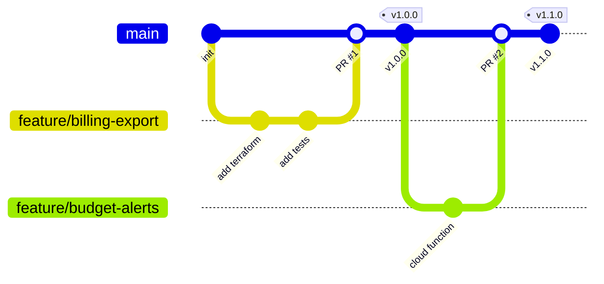

# Branching Strategy

This document defines the Git branching model for all repositories in the AI Cost Monitoring project.

## Model: Trunk-Based Development (Simplified)

We use a **simplified trunk-based** model suitable for small teams with fast iteration cycles.



## Branch Types

| Branch | Pattern | Purpose | Lifetime |
|:---|:---|:---|:---|
| **main** | `main` | Production-ready code. Always deployable. | Permanent |
| **feature** | `feature/<short-name>` | New features or enhancements | Until merged |
| **bugfix** | `bugfix/<short-name>` | Bug fixes | Until merged |
| **hotfix** | `hotfix/<short-name>` | Urgent production fix | Until merged |
| **ai** | `ai/<issue-number>-<short-name>` | AI-implemented changes | Auto-deleted after merge |

## AI Branch Conventions

AI assistants ({AI_TOOL_NAME} Code, Copilot, etc.) create branches following this pattern:

```
ai/123-add-budget-alerts
ai/456-fix-api-timeout
```

**Rules for AI branches**:

1. Include issue number in branch name for traceability.
2. AI branches require human review before merge.
3. Auto-deleted after PR merge (via GitHub Actions).
4. Never force-push to AI branches once a review is requested.

## Rules

1. **`main` is always deployable.** Never push broken code to `main`.
2. **All changes go through PRs.** No direct commits to `main`.
3. **Branch from `main`, merge back to `main`.** No long-lived branches.
4. **Delete branches after merge.** Keep the repo clean.
5. **Squash merge** for feature branches to keep history clean.

## Naming Convention

```
feature/add-bigquery-export      # Human feature
bugfix/fix-alert-threshold       # Human bugfix
hotfix/patch-api-timeout         # Human hotfix
ai/123-add-bigquery-export       # AI-implemented (issue #123)
ai/456-fix-alert-threshold       # AI bugfix (issue #456)
```

## Protection Rules (Apply to All Repos)

* Require at least 1 PR review before merge.
* Require CI status checks to pass (lint, test).
* Prevent force-push to `main`.
* Auto-delete head branches after merge.
