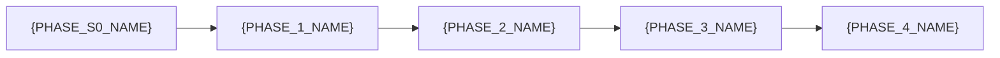

# Project Roadmap

**Project**: {PROJECT_NAME} | **Prefix**: `{PROJECT_PREFIX}`
**Home Repo**: [`{REPO_NAME}`](https://{GITHUB_HOST}/{GITHUB_ORG}/{REPO_NAME}) | **Board**: [V2 #{PROJECT_BOARD_NUMBER}](https://{GITHUB_HOST}/orgs/{GITHUB_ORG}/projects/{PROJECT_BOARD_NUMBER})
**Strategy**: {DELIVERY_STRATEGY}
**Sprint Duration**: {SPRINT_DURATION}
**Primary Cloud**: {PRIMARY_CLOUD}

> **Template Usage**: Replace all `{PLACEHOLDER}` values with project-specific content. Remove this note when complete.

> This roadmap aligns with [PROJECT_DEFINITION.md](../docs/PROJECT_DEFINITION.md), the [ADRs](../docs/adr/), and [core specifications](../docs/core/).

**Related Planning Documents**:

- [PROJECT_PLAN.md](./PROJECT_PLAN.md) — Full project plan with task specifications and sprint planning
- [AI_TIME_ESTIMATION.md](./AI_TIME_ESTIMATION.md) — AI-assisted time estimates for all phases
- [DEFINITION_OF_DONE.md](./DEFINITION_OF_DONE.md) — Completion criteria
- [AI_ISSUE_LIFECYCLE.md](./AI_ISSUE_LIFECYCLE.md) — 4-stage issue lifecycle (Development → Deployment → QA → Bug Fix)
- [Implementation Plans](./plans/) — AI-first phase-gated deployment and other workflows

---

## Dependency Graph



| Dependency | Reason |
|:---|:---|
| S0 → P1 | {DEPENDENCY_REASON} |
| P1 → P2 | {DEPENDENCY_REASON} |
| P2 → P3 | {DEPENDENCY_REASON} |
| P3 → P4 | {DEPENDENCY_REASON} |

---

## Sprint 0: {PHASE_S0_NAME}
- **Scope**: {S0_SCOPE}
- **Duration**: {S0_DURATION}
- **Target**: {S0_START} – {S0_END}

| # | Task | Priority | Issue | Blocks |
|:--|:-----|:---------|:------|:-------|
| 0.1 | {TASK_NAME} | **P0** | [#{ISSUE}](https://{GITHUB_HOST}/{GITHUB_ORG}/{REPO_NAME}/issues/{ISSUE}) | {BLOCKS} |
| 0.2 | {TASK_NAME} | **P0** | [#{ISSUE}](https://{GITHUB_HOST}/{GITHUB_ORG}/{REPO_NAME}/issues/{ISSUE}) | {BLOCKS} |

**Exit Criteria**: {S0_EXIT_CRITERIA}

---

## Phase 1: {PHASE_1_NAME}
- **Scope**: {P1_SCOPE}
- **Reference**: [{P1_REFERENCE_DOC}](../docs/{P1_REFERENCE_DOC})
- **Duration**: {P1_DURATION}
- **Target**: {P1_START} – {P1_END}

### Sprint 1.1: {SPRINT_1_1_NAME}

| # | Task | Priority | Blocks |
|:--|:-----|:---------|:-------|
| 1.1 | {TASK_NAME} | **P0** | {BLOCKS} |
| 1.2 | {TASK_NAME} | **P0** | {BLOCKS} |
| 1.3 | {TASK_NAME} | **P1** | {BLOCKS} |

**Exit Criteria**: {P1_EXIT_CRITERIA}

---

## Phase 2: {PHASE_2_NAME}
- **Scope**: {P2_SCOPE}
- **Reference**: [{P2_REFERENCE_DOC}](../docs/{P2_REFERENCE_DOC})
- **Duration**: {P2_DURATION}
- **Target**: {P2_START} – {P2_END}
- **Depends on**: {P2_DEPENDENCIES}

### Sprint 2.1: {SPRINT_2_1_NAME}

| # | Task | Priority | Blocks |
|:--|:-----|:---------|:-------|
| 2.1 | {TASK_NAME} | **P0** | {BLOCKS} |
| 2.2 | {TASK_NAME} | **P0** | {BLOCKS} |

### Sprint 2.2: {SPRINT_2_2_NAME}

| # | Task | Priority | Blocks |
|:--|:-----|:---------|:-------|
| 2.3 | {TASK_NAME} | **P0** | {BLOCKS} |
| 2.4 | {TASK_NAME} | **P1** | {BLOCKS} |

**Exit Criteria**: {P2_EXIT_CRITERIA}

---

## Phase 3: {PHASE_3_NAME}
- **Scope**: {P3_SCOPE}
- **Reference**: [{P3_REFERENCE_DOC}](../docs/{P3_REFERENCE_DOC})
- **Duration**: {P3_DURATION}
- **Target**: {P3_START} – {P3_END}
- **Depends on**: {P3_DEPENDENCIES}

### Sprint 3.1: {SPRINT_3_1_NAME}

| # | Task | Priority | Blocks |
|:--|:-----|:---------|:-------|
| 3.1 | {TASK_NAME} | **P0** | {BLOCKS} |
| 3.2 | {TASK_NAME} | **P1** | {BLOCKS} |

**Exit Criteria**: {P3_EXIT_CRITERIA}

---

## Phase 4: {PHASE_4_NAME} *(Conditional)*
- **Scope**: {P4_SCOPE}
- **Duration**: {P4_DURATION}
- **Target**: {P4_START} – {P4_END}
- **Depends on**: {P4_DEPENDENCIES}
- **Conditional**: {P4_CONDITION}

### Sprint 4.1: {SPRINT_4_1_NAME}

| # | Task | Priority | Blocks |
|:--|:-----|:---------|:-------|
| 4.1 | {TASK_NAME} | **P0** | {BLOCKS} |

**Exit Criteria**: {P4_EXIT_CRITERIA}

---

## Timeline Summary

```
{TIMELINE_VISUALIZATION}
```

| Phase | Start | End | Duration | Sprints |
|:---|:---|:---|:---|:---|
| Sprint 0 | {DATE} | {DATE} | {DURATION} | — |
| Phase 1 | {DATE} | {DATE} | {DURATION} | 1.1 |
| Phase 2 | {DATE} | {DATE} | {DURATION} | 2.1, 2.2 |
| Phase 3 | {DATE} | {DATE} | {DURATION} | 3.1 |
| Phase 4 | {DATE} | {DATE} | {DURATION} | 4.1 |

**Total**: {TOTAL_DURATION}

---

## Deployment & Testing Strategy

This project uses a **phase-gated deployment model** with a **4-stage iterative QA loop** optimized for AI-first development. See [AI_ISSUE_LIFECYCLE.md](./AI_ISSUE_LIFECYCLE.md) and [plans/](./plans/) for full details.

### Deployment Model

```
  Phase 1  Staging (all P1 features)  QA Pass  Prod Gate
  Phase 2  Staging (all P1+P2)        QA Pass  Prod Gate
  ...
  Phase N  Staging (all P1-PN)        QA Pass  Production
```

| Environment | Trigger | Purpose |
|:------------|:--------|:--------|
| **Dev (PR)** | PR created | Per-PR ephemeral environment for AI review |
| **Staging** | Phase complete | Cumulative testing of all phases 1..N |
| **Production** | Manual dispatch | After all phases + QA pass |

### 4-Stage Iterative QA Loop

Each development issue flows through 4 stages with automatic bug iteration:

```
Development → Deployment → QA Testing → Bug Fix (if needed)
     ↑                                        │
     └────────────── (max 3 iterations) ──────┘
```

| Stage | Issue Type | Label | Created By |
|:------|:-----------|:------|:-----------|
| 1 | Development | `ai:development` | Human |
| 2 | Deployment | `ai:deployment` | `create-deployment-issue.yml` |
| 3 | QA Testing | `ai:qa-testing` | `create-qa-testing-issue.yml` |
| 4 | Bug Fix | `ai:development` + `bug` | `create-bug-issue.yml` |

### Quality Gates

| Gate | Criteria | Enforced By |
|:-----|:---------|:------------|
| **PR Gate** | CI passes, AI review | `ci.yml`, `ai-review.yml` |
| **Phase Gate** | All phase issues closed | `check-phase-completion.yml` |
| **QA Gate** | All tests pass (max 3 iterations) | `execute-qa-testing.yml` |
| **Prod Gate** | Manual approval, deployment window | `deploy-prod.yml` |

### Testing Layers

| Layer | Coverage Target | Runs On |
|:------|:----------------|:--------|
| Unit tests | ≥90% | PR, Staging |
| Integration tests | ≥70% | PR, Staging |
| E2E tests | Critical paths | Staging |
| Smoke tests | Health endpoints | All environments |

### Human Escalation

After 3 failed QA iterations, the system creates a `needs-human` escalation issue and stops automation. This prevents infinite loops while ensuring quality.

---

## Placeholder Reference

| Placeholder | Description | Example |
|:------------|:------------|:--------|
| `{PROJECT_NAME}` | Full project name | AI Cost Monitoring |
| `{PROJECT_PREFIX}` | Short prefix for labels | AIOCTO |
| `{REPO_NAME}` | Repository name | ai-cost-monitor |
| `{GITHUB_HOST}` | GitHub host | github.com |
| `{GITHUB_ORG}` | GitHub organization | my-org |
| `{PROJECT_BOARD_NUMBER}` | GitHub Project board number | 5 |
| `{DELIVERY_STRATEGY}` | Delivery approach | Phased delivery with 2-layer agent architecture |
| `{SPRINT_DURATION}` | Sprint length | 2 weeks per sprint |
| `{PRIMARY_CLOUD}` | Primary cloud provider | GCP |
| `{PHASE_N_NAME}` | Phase name | Foundation Infrastructure |
| `{PN_SCOPE}` | Phase scope description | Platform infrastructure on GCP |
| `{PN_DURATION}` | Phase duration | 3 weeks |
| `{PN_START}` / `{PN_END}` | Phase dates | Mar 3, 2026 |
| `{PN_EXIT_CRITERIA}` | Phase completion criteria | All Cloud Run services deployed |
| `{TASK_NAME}` | Task description | Create Terraform modules |
| `{BLOCKS}` | Dependencies | Phase 2, Phase 3 |
| `{ISSUE}` | GitHub issue number | 15 |
