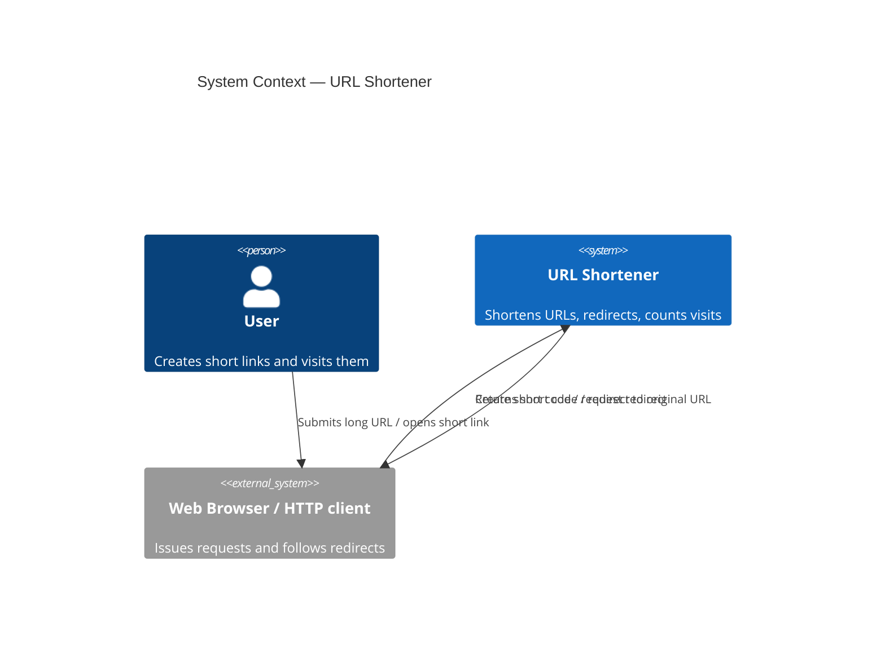
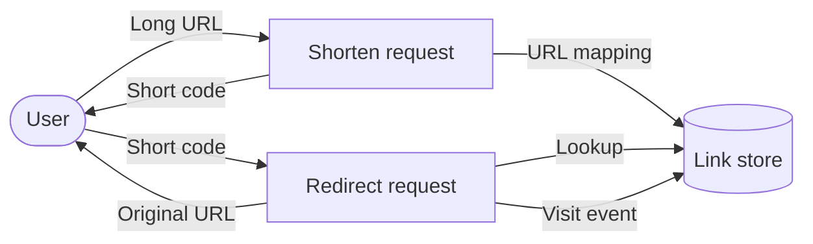
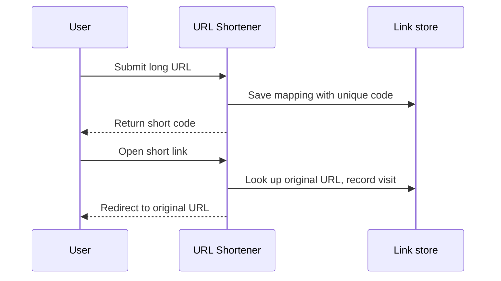

# BRD-01: URL Shortener — MVP Business Requirements

## 1. Document Control

| Field | Value |
|-------|-------|
| Project name | URL Shortener |
| Version | 1.0 |
| Status | Draft |
| Date created | 2026-06-03 |
| Last updated | 2026-06-03 |
| Author | SDD Flow (requirements-analyst) |
| Prepared by | Business Analyst lens |
| MVP target launch | Not scheduled (example) |
| PRD readiness score | 94/100 |

### Revision History

| Version | Date | Author | Changes | Approver |
|---------|------|--------|---------|----------|
| 1.0 | 2026-06-03 | Business Analyst lens | Initial MVP draft from seed `seed/initial-requirements.md` | Pending |

## 2. Executive Summary

A managed URL-shortener service converts a long URL into a short code and
redirects each short link to its original URL, while counting visits per link.
The MVP validates that users adopt short-link creation and that redirects meet
customer-facing latency and availability targets. Scope is restricted to three
capabilities — shorten, redirect, count — with vanity domains, user accounts,
and analytics dashboards deferred to a later cycle.

### Target Users

| Tier | Segment | Need |
|------|---------|------|
| Primary | People sharing links | Convert a long URL into a short, shareable code that redirects reliably |
| Secondary | Content publishers | A visit count per short link to gauge reach |

## Diagrams

| Title | Type | Tag | Scope |
|-------|------|-----|-------|
| System context | C4-L1 | `@diagram: c4-l1` | Actors and system boundary |
| Top-level data flow | DFD-L1 | `@diagram: dfd-l1` | Data movement across the boundary |
| Business journey | sequenceDiagram | — | Happy-path shorten + redirect |

### System Context (`@diagram: c4-l1`)

### Top-Level Data Flow (`@diagram: dfd-l1`)

### Business Journey (sequenceDiagram)

## 3. Introduction

**Business context.** Long URLs are awkward to share and carry no usage signal.
A shortener provides compact links and a per-link visit count.

**Purpose.** This BRD defines business requirements for the URL Shortener MVP —
the smallest feature set that delivers value and validates the core hypothesis.

| Scope | Items |
|-------|-------|
| In scope | Short-link creation; redirection to original URL; collision-free unique codes; per-link visit counting; baseline quality targets; architecture decision topics |
| Out of scope | Custom vanity domains; user accounts and authentication; analytics dashboards; detailed personas and user stories (PRD owns these) |

## 4. Business Objectives

**Hypothesis.** Users will adopt a shortener if short links resolve quickly and
reliably and provide a visit count, without requiring an account.

Validation questions:

- Will users create short links and reuse the service?
- Will redirects meet the customer-facing latency target under MVP load?
- Will the service sustain its availability target across a month?

**Problem statement.** Long URLs are hard to share and provide no usage
visibility; the impact is reduced shareability and no reach signal. The MVP
solves this with three capabilities: shorten, redirect, and count.

### Goals

| ID | Goal | Baseline | Target |
|----|------|----------|--------|
| BRD.01.04.d3c3 | Validate demand for a managed URL shortening service | N/A — new capability | Sustained short-link creation across the first 90 days |
| BRD.01.04.1c90 | Prove redirect performance and reliability at MVP scale | N/A — new capability | Meet latency and availability targets for 90 days post-launch |

### Success Metrics

| ID | Objective | Metric | Target | Period |
|----|-----------|--------|--------|--------|
| BRD.01.04.81ea | Adoption | Short links created | Sustained non-zero growth | 90 days post-launch |
| BRD.01.04.8f0f | Reliability | Redirect success rate | ≥ 99.9% of visits resolve | 90 days post-launch |
| BRD.01.04.bfdb | Performance | Redirect latency p95 | < 50 ms | 90 days post-launch |

### Expected Benefits

| Class | Benefit |
|-------|---------|
| Quantifiable | Measurable adoption (links created); measurable reach (visits per link) |
| Qualitative | Market validation for a fuller product; user feedback for refinement |

**Cost-benefit (MVP-level).** Single small team, one delivery cycle; managed
hosting and a single data store. ROI hypothesis: demonstrated adoption and
quality targets justify a later cycle (vanity domains, accounts, dashboards).

## 5. Project Scope

**Scope statement.** Deliver the minimum set of capabilities to create short
links, redirect them to their original URLs without collisions, and count
visits — sufficient to validate adoption and quality targets.

| Priority | Features |
|----------|----------|
| P1 — Must Have | Short-link creation; redirection to original URL; collision-free unique codes; per-link visit counting |
| P2 — Should Have | Retrieval of the current visit count for a given short link |

**Out of scope (deferred to next cycle):** custom vanity domains; user accounts
and authentication; analytics dashboards. Rationale: the MVP proves the core
value proposition; deferred features are added based on user feedback.

### Workflow (happy path)

1. User submits a long URL and receives a short code.
2. Service stores the mapping under a unique, collision-free code.
3. User opens the short link.
4. Service resolves the code to the original URL and records the visit.
5. Service redirects the user to the original URL.

## 6. Stakeholders

| Role | Authority / Responsibility |
|------|----------------------------|
| Executive Sponsor | Final approval authority |
| Product Owner | Feature prioritization |
| Technical Lead | Architecture decisions |
| Early Users / Beta Testers | Feedback loop on link creation and redirect reliability |

## 7. Functional Requirements

Priority: **P1** = essential for launch; **P2** = workaround exists for MVP.

### BRD.01.07.8f04 — URL Shortening (P1)

- **Capability:** System must enable a user to submit a long URL and receive a short code.
- **Complexity:** 1/5 (single service; no external partners; no regulatory scope; ≤3 decisions).
- **Business needs:** Accept a submitted long URL; return a compact short code usable as a link.
- **Business rules:** Each submitted URL is assigned a code; an invalid or empty submission is rejected.

| Acceptance criterion | ID | Target |
|----------------------|-----|--------|
| A valid long-URL submission returns a usable short code | BRD.01.07.e4c2 | 100% of valid submissions return a code |

### BRD.01.07.ea8c — Short Link Redirection (P1)

- **Capability:** System must redirect a visitor from a short link to the original URL.
- **Complexity:** 2/5 (read-dominant path; latency-sensitive; no partners; availability-critical).
- **Business needs:** Resolve a short code to its original URL; send the visitor to that URL.
- **Business rules:** An unknown short code returns a not-found outcome rather than a redirect.

| Acceptance criterion | ID | Target |
|----------------------|-----|--------|
| Visiting a short link redirects to the stored original URL | BRD.01.07.914d | 100% of known codes resolve correctly |
| Redirect response time meets the customer-facing target | BRD.01.07.b6f3 | p95 < 50 ms |

### BRD.01.07.45e6 — Unique Collision-Free Codes (P1)

- **Capability:** System must ensure every short code is unique and never collides.
- **Complexity:** 2/5 (correctness-critical uniqueness guarantee; no partners; no regulatory scope).
- **Business needs:** Guarantee that distinct URLs never receive the same code.
- **Business rules:** A code is assigned to exactly one URL mapping for the life of that link.

| Acceptance criterion | ID | Target |
|----------------------|-----|--------|
| No two distinct URLs share a short code | BRD.01.07.81aa | 0 collisions |

### BRD.01.07.ebd7 — Visit Counting (P1)

- **Capability:** System must count how many times each short link is visited.
- **Complexity:** 2/5 (per-link counter on the redirect path; accuracy expectation; no partners).
- **Business needs:** Record a visit each time a short link resolves; make the count available per link.
- **Business rules:** Only resolved redirects increment the count; not-found requests do not.

| Acceptance criterion | ID | Target |
|----------------------|-----|--------|
| Recorded visit count matches actual resolved visits | BRD.01.07.b9c9 | Count accuracy ≥ 99.9% |

## 8. ADR Topics

No ADR numbers referenced — ADRs do not exist yet. Topics describe business
capability needs for downstream decision.

| ID | Category | Topic | Status | Business driver | Recommended selection | PRD requirements |
|----|----------|-------|--------|-----------------|-----------------------|------------------|
| BRD.01.08.1717 | Infrastructure | Hosting & Deployment | Pending | Redirect path must meet latency and availability targets | Pending | Hosting model and deployment region(s) |
| BRD.01.08.9f7d | Data Architecture | Database & Storage | Pending | Durable storage of URL mappings and visit counts; read-dominant access | Pending | Storage choice supporting fast key lookups and a per-link counter |
| BRD.01.08.7159 | Integration | External Systems | N/A | MVP is standalone; no external system integration | N/A | None |
| BRD.01.08.b446 | Security | Authentication & Data Protection | Pending | Public short links; protect stored URLs and the service from abuse | Pending | Transport security; abuse/rate protection on creation |
| BRD.01.08.543b | Observability | Monitoring & Logging | Pending | Must measure redirect availability and latency against targets | Pending | Latency and availability monitoring; error logging |
| BRD.01.08.9a88 | AI/ML | If Applicable | N/A | No AI/ML components in the MVP | N/A | None |
| BRD.01.08.04cc | Technology Selection | Core Stack | Pending | Service must serve low-latency redirects at MVP scale | Pending | Language/runtime and framework selection with versions |

## 9. Quality Expectations

| Category | Expectation |
|----------|-------------|
| Performance | Redirect latency p95 under 50 ms |
| Reliability | Availability 99.9% monthly |
| Reliability | Existing short links continue to resolve across deployments |
| Scalability | Sustain MVP-scale concurrent redirect traffic |
| Security | HTTPS/TLS for all connections; abuse protection on link creation |
| Observability | Latency and availability monitoring with error logging |

## 10. Constraints and Assumptions

### Constraints

| ID | Category | Description | Impact |
|----|----------|-------------|--------|
| BRD.01.10.5674 | Scope | MVP limited to shorten, redirect, and visit counting | Defers vanity domains, accounts, dashboards |
| BRD.01.10.f814 | Quality | Redirect latency (p95 < 50 ms) and availability (99.9%) bound the design | Drives storage and hosting choices |
| BRD.01.10.de0c | Team | Small team delivers the MVP within one cycle | Limits parallel workstreams |

### Assumptions

| ID | Assumption | Validation method | Impact if false |
|----|------------|-------------------|-----------------|
| BRD.01.10.3bed | Redirect (read) traffic dominates creation (write) traffic | Measure read/write ratio post-launch | Re-evaluate storage write path |
| BRD.01.10.0cae | Short links are public; no accounts required for MVP | Confirm with stakeholders | Adds authentication scope (new BRD) |

## 11. Acceptance Criteria

### Launch Gates

| Tier | Gate |
|------|------|
| Must have | All P1 functional requirements implemented and tested |
| Must have | Redirect latency p95 < 50 ms verified under MVP load |
| Must have | Zero collisions demonstrated in code-assignment testing |
| Must have | Security baseline met (HTTPS/TLS; creation abuse protection) |
| Should have | Visit-count retrieval (P2) available |

### Post-Launch Validation

| Window | Criteria |
|--------|----------|
| 30 days | Non-zero short-link creation; redirect success ≥ 99.9%; p95 < 50 ms |
| 90-day decision gate | **Continue** if adoption and quality hold and new features are identified; **maintain** if stable with no new features; **pivot/shutdown** if adoption or quality targets fail |

## 12. Risk Management

| ID | Risk | Likelihood | Impact | Mitigation | Owner |
|----|------|------------|--------|------------|-------|
| BRD.01.12.8396 | Two URLs receive the same short code, corrupting redirects | Low | High | Enforce a uniqueness guarantee on code assignment; verify with collision testing | Technical Lead |
| BRD.01.12.6f0e | Redirect latency exceeds the customer-facing target under load | Medium | High | Read-optimized storage; latency monitoring against the p95 target | Technical Lead |
| BRD.01.12.493d | Service downtime breaks existing short links | Medium | High | Availability monitoring; deployment practices that preserve existing links | Product Owner |

## 13. Approval

| Role | Name | Title | Date |
|------|------|-------|------|
| Executive Sponsor | Pending assignment | — | Pending |
| Product Owner | Pending assignment | — | Pending |
| Business Lead | Pending assignment | — | Pending |
| Technology Lead | Pending assignment | — | Pending |

Approval criteria: all P1 requirements defined and validated; critical risks
identified with mitigation; budget estimate approved; technical feasibility
confirmed; stakeholder alignment achieved.

## 14. Traceability

**Tags:** @brd: BRD-01

**Cross-links:**

- `@depends:` none — BRD-01 is the entry point for this example.
- `@discoverability:` none.

### Objectives → Requirements

| Objective ID | Objective | Related FRs | Coverage |
|--------------|-----------|-------------|----------|
| BRD.01.04.d3c3 | Validate demand | BRD.01.07.8f04, BRD.01.07.ebd7 | Complete |
| BRD.01.04.1c90 | Prove performance & reliability | BRD.01.07.ea8c, BRD.01.07.45e6 | Complete |

### Upstream

| Type | Reference | Relevance |
|------|-----------|-----------|
| Seed requirements | `seed/initial-requirements.md` | Source business need and quality targets |

### Downstream (expected)

| Type | Layer | Description |
|------|-------|-------------|
| PRD | 2 | Product features, personas, KPIs; inherits §8 architecture topics |

### Health Score

| Metric | Value |
|--------|-------|
| BO→FR coverage | 100% |
| Cross-BRD validated | N/A (no dependencies) |
| Target score | ≥ 90/100 |

## 15. Glossary

| Term | Definition |
|------|------------|
| Short code | The compact identifier that maps to an original URL |
| Short link | A URL containing a short code that redirects to the original URL |
| Redirect | Sending a visitor from a short link to its original URL |
| Collision | Two distinct URLs assigned the same short code (must never occur) |
| p95 | 95th percentile of a measured value |
| MVP | Minimum Viable Product |
| BRD | Business Requirements Document |
| PRD | Product Requirements Document |

## Appendix

Each BRD represents one iteration cycle (MVP → PROD → NEW MVP). New features
become a new BRD (BRD-02, …), linked via `@depends`.

**Next-cycle candidates:** custom vanity domains; user accounts and
authentication; analytics dashboards. Trigger: MVP stable in production (30+
days), feedback collected, next features prioritized and approved.
